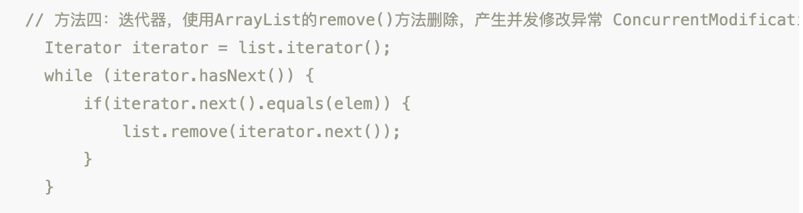
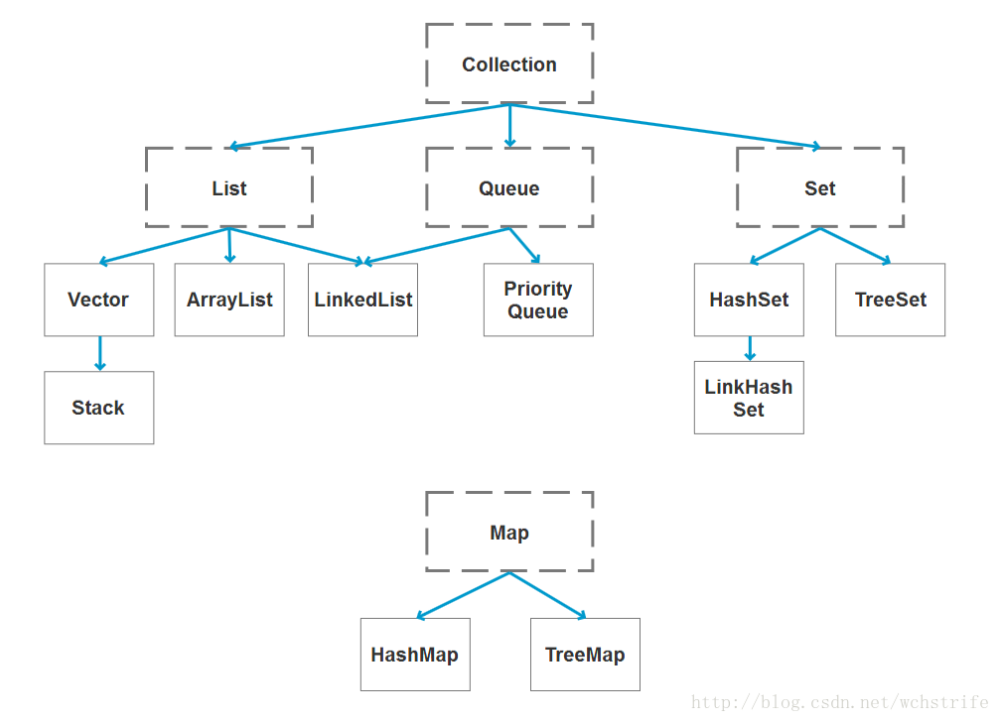

(PS：建了一个技术微信群，可以自由地讨论技术，工作和生活，也会分享一些我自己在看的技术资料，不定时发放红包福利，欢迎大家扫[首页里面的二维码](README.md)进群，希望和大家一起学习进步！大家如果想一起为这个项目做贡献的话，也可以进群大家聊一聊)

下面是主要是自己看了很多Java容器类相关的博客，以及很多面经中涉及到的Java容器相关的面试题后，自己全部手写的解答，也画了一些流程图，之后会继续更新这一部分。

####  [1.ArrayList与LinkedList的区别是什么？](#ArrayList与LinkedList的区别是什么？)

#### [2.怎么使ArrayList，LinkedList变成线程安全的呢？](#怎么使ArrayList，LinkedList变成线程安全的呢？)

#### [3.ArrayList遍历时删除元素有哪些方法？](#ArrayList遍历时删除元素有哪些方法？)
#### [4.ConcurrentModificationException是什么？](#ConcurrentModificationException是什么？)

#### [5.java容器类的层次是怎么样的？](#java容器类的层次是怎么样的？)

### ArrayList与LinkedList的区别是什么？

每次遇到一个好看的小姐姐，我们一般都是会去看她的外貌，身材，大小(咳咳，我们指的是年龄大小)等等。同样的，我们在分析Java容器之间的区别时，我们也可以从继承树，底层数据结构，线程安全，执行效率来进行分析。

#### 1.底层使用的数据结构

* ArrayList 底层使用的是**Object数组**，初始化时就会指向的会是一个static修饰的空数组，数组长度一开始为**0**，插入第一个元素时数组长度会初始化为**10**，之后每次数组空间不够进行扩容时都是增加为原来的**1.5倍**。ArrayList的空间浪费主要体现在在list列表的结尾会预留一定的容量空间(为了避免添加元素时，数组空间不够频繁申请内存)，而LinkedList的空间花费则体现在它的每一个元素都需要消耗比ArrayList更多的空间（因为要存放后继指针next和前驱指针pre以及数据）

* LinkedList 底层使用的数据结构是**双向链表**，每个节点保存了指向前驱节点和后继结点的指针。初始化时，不执行任何操作，添加第一个元素时，再去构造链表中的节点。

#### 2.是否保证线程安全：

 ArrayList 和 LinkedList 都是不同步的，也就是不保证线程安全。

因为ArrayList的插入元素的方法就是裸奔的，直接将原数组index及后面的元素拷贝到index+1及后面的位置上，然后将index位置设置为插入的值，并发修改时保证不了数据安全性，所以也不允许并发修改，一旦检测到并发修改，会抛出ConcurrentModificationException异常。

```java
//ArrayList的插入元素的方法
public void add(int index, E element) {
        rangeCheckForAdd(index);
        ensureCapacityInternal(size + 1);  // Increments modCount!!
        System.arraycopy(elementData, index, elementData, index + 1,
                         size - index);//将原数组index之后的元素拷贝到原数组index+1后面的位置上
        elementData[index] = element;
        size++;
}
```

#### 3.插入和删除的复杂度：

* ArrayList 采用数组存储，元素的物理存储地址是连续的，支持以O(1)的时间复杂度对元素快速访问。插入和删除元素后，需要将后面的元素进行移动，所以插入和删除元素的时间复杂度受元素位置的影响。复杂度是 O(n)， 
* LinkedList 采用链表存储，所以不能快速随机访问。所以首尾插入，删除元素时间复杂度不受元素位置的影响，都是近似 O(1)(如果是插入到中间位置还需要考虑寻找插入位置的时间复杂度)。而数组为近似 O(n)。

#### 4.继承树

* ArrayList继承于AbstractList抽象类，实现了**List, RandomAccess, Cloneable, java.io.Serializable**接口 。
* LinkedList继承自AbstractSequentialList 实现**List, Deque, Cloneable, java.io.Serializable**接口。

**AbstractSequentialList**是AbstractList类的子类，实现了根据下标来访问元素的一些方法，主要是通过listIterator遍历获取特定元素。

**List接口**代表的是有序结合，与Set相反，List的元素是按照移动的顺序进行排列。

**Cloneable接口**代表类会重新父类Object的clone()方法，支持对实例对象的clone操作。

**java.io.Serializable**接口代表类支持序列化。

**RandomAccess**是一个标示性接口，代表ArrayList支持快速访问，而LinkedList不支持。

**Deque**接口是双端队列的意思，代表LinkedList支持两端元素插入和移除。

### 怎么使ArrayList，LinkedList变成线程安全的呢？

#### 1.使用SynchronizedList

SynchronizedList是一个线程安全的包装类。继承于SynchronizedCollection，SynchronizedCollection实现了Collection接口，SynchronizedList包含一个List对象，对List的访问修改方法进行了一些封装，在封装的方法中会对list使用同步锁加锁，然后再进行存取和修改操作。

使用方法如下

```java
LinkedList<Integer>    linkedList    = new LinkedList<Integer>();
//调用Collections的synchronizedList方法，传入一个linkedList，会返回一个SynchronizedList实例对象
List<Integer> synchronizedList =  Collections.synchronizedList(linkedList);

//调用Collections的synchronizedList方法，ArrayList，返回一个SynchronizedRandomAccessList实例对象
ArrayList<Integer>    arrayList    = new ArrayList<Integer>();
List<Integer> synchronizedRandomAccessList =  Collections.synchronizedList(linkedList);
```

(Collections.synchronizedList()方法会判断传入的对象是否实现了 RandomAccess接口，是的话，会返回一个SynchronizedRandomAccessList对象，SynchronizedRandomAccessList是SynchronizedList的子类，只是会多一个以线程安全的方式获取子数组的方法)。

SynchronizedList类的部分代码如下：

```java
static class SynchronizedList<E>
        extends SynchronizedCollection<E>
        implements List<E> {
        final List<E> list;//源list
        final Object mutex; 

        SynchronizedCollection(Collection<E> c) {
            this.c = Objects.requireNonNull(c);
            mutex = this;//mutex就是SynchronizedList实例自己，作为同步锁使用
        }
   
  			public E get(int index) {
            synchronized (mutex) {
            是父类中的成员变量，在父类中会将list赋值给mutex
            		return list.get(index);
            }
        }
   
        public E set(int index, E element) {
            synchronized (mutex) {return list.set(index, element);}
        }
}
```

#### 2.使用CopyOnWriteArrayList

CopyOnWriteArrayList跟ArrayList类似，都是实现了List接口，只不过它的父类是Object，而不是AbstractList。CopyOnWriteArrayList与ArrayList的不同在于，

##### 1.内部持有一个ReentrantLock类型的lock锁，用于控制并发访问

```java
	final transient ReentrantLock lock = new ReentrantLock();
```

在对数组进行修改的方法中，都会先获取lock，获取成功才能进行修改，修改完释放锁，保证每次只允许一个线程对数组进行修改。

##### 2.使用volatile修饰Object数组，使得变量具备内存可见性

```java
   //CopyOnWriteArrayList
   private transient volatile Object[] array;
    
   //ArrayList
   private transient Object[] elementData;//transient
```

可以看到区别主要在于CopyOnWriteArrayList的Object是使用volatile来修饰的，volatile可以使变量具备内存可见性，一个线程在工作内存中对变量进行修改后，会立即更新到物理内存，并且使得其他线程中的这个变量缓存失效，其他线程在读取会去物理内存中读取最新的值。（volatile修饰的是指向数组的引用变量，所以对数组添加元素，删除元素不会改变引用，只有对数组变量array重新赋值才会改变。所以为了保证内存可见性，CopyOnWriteArrayList.add()方法在添加元素时，都是复制出一个新数组，进行修改操作后，再设置到就数组上）

注意事项:Object数组都使用transient修饰是**因为transient修饰的属性不会参与序列化**，ArrayList通过实现writeObject()和readObject()方法来自定义了序列化方法(基于反序列化时节约空间考虑，如果用默认的序列方法，源elementData数组长度为100，实际只有10个元素，反序列化时也会分配长度为100的数组，造成内存浪费。)

**下面是CopyOnWriteArrayList的add()方法:**

```java
public boolean add(E e) {
    final ReentrantLock lock = this.lock;
	  //1. 使用Lock,保证写线程在同一时刻只有一个
    lock.lock();
    try {
		//2. 获取旧数组引用
        Object[] elements = getArray();
        int len = elements.length;
		//3. 创建新的数组，并将旧数组的数据复制到新数组中
        Object[] newElements = Arrays.copyOf(elements, len + 1);
		//4. 往新数组中添加新的数据	        
		newElements[len] = e;
		//5. 将旧数组引用指向新的数组
        setArray(newElements);
        return true;
    } finally {
        lock.unlock();
    }
}
```

#### SynchronizedList和CopyOnWriteArrayList优缺点

##### SynchronizedList:读写都加锁

SynchronizedList是通过对读写方法使用synchronized修饰来实现同步的，即便只是多个线程在读数据，也不能进行，如果是读比较多的场景下，会性能不高，所以适合读写均匀的情况。

##### CopyOnWriteArrayList:读不加锁，写加锁

而CopyOnWriteArrayList是读写分离的，只对写操作加锁，但是每次写操作(添加和删除元素等)时都会复制出一个新数组，完成修改后，然后将新数组设置到旧数组的引用上，所以在写比较多的情况下，会有很大的性能开销，所以适合读比较多的应用场景。

### ArrayList遍历时删除元素有哪些方法？
首先结论如下：

第1种方法 - 普通for循环正序删除（结果：会漏掉元素判断）

第2种方法 - 普通for循环倒序删除（结果：正确删除）

第3种方法 - for-each循环删除（结果：抛出异常）

第4种方法 - Iterator遍历，使用ArrayList.remove()删除元素（结果：抛出异常）

第5种方法 - Iterator遍历，使用Iterator的remove删除元素（结果：正确删除）

下面让我们来详细探究一下原因吧！


首先初始化一个数组arrayList，假设我们要删除等于3的元素。
```java
   public static void main(String[] args) {
        ArrayList<Integer> arrayList = new ArrayList();
        arrayList.add(1);
        arrayList.add(2);
        arrayList.add(3);
        arrayList.add(3);
        arrayList.add(4);
        arrayList.add(5);
        removeWayOne(arrayList);
    }
```

#### 第1种方法 - 普通for循环正序删除（结果：会漏掉对后一个元素的判断）

```java
for (int i = 0; i < arrayList.size(); i++) {
	if (arrayList.get(i) == 3) {//3是要删除的元素
		arrayList.remove(i);
		//解决方案: 加一行代码i = i - 1; 删除元素后，下标减1
	}
    System.out.println("当前arrayList是"+arrayList.toString());
}
//原ArrayList是[1, 2, 3, 3, 4, 5]
//删除后是[1, 2, 3, 4, 5]
```
输出结果：
```
当前arrayList是[1, 2, 3, 3, 4, 5]
当前arrayList是[1, 2, 3, 3, 4, 5]
当前arrayList是[1, 2, 3, 4, 5]
当前arrayList是[1, 2, 3, 4, 5]
当前arrayList是[1, 2, 3, 4, 5]
```
可以看到少删除了一个3，

原因在于调用remove删除元素时，remove方法调用System.arraycopy()方法将后面的元素移动到前面的位置，也就是第二个3会移动到数组下标为2的位置，而在下一次循环时，i+1之后，i会为3，不会对数组下标为2这个位置进行判断，所以这种写法，在删除元素时，被删除元素a的后一个元素b会移动a的位置，而i已经加1，会忽略对元素b的判断，所以如果是连续的重复元素，会导致少删除。

##### 解决方案

可以在删除元素后，执行i=i-1，使得下次循环时再次对该数组下标进行判断。

#### 第2种方法 - 普通for循环倒序删除（结果：正确删除）

```java
 for (int i = arrayList.size() -1 ; i>=0; i--) {
    if (arrayList.get(i).equals(3)) {
        arrayList.remove(i);
    }
    System.out.println("当前arrayList是"+arrayList.toString());
}
```
输出结果：
```
当前arrayList是[1, 2, 3, 3, 4, 5]
当前arrayList是[1, 2, 3, 3, 4, 5]
当前arrayList是[1, 2, 3, 4, 5]
当前arrayList是[1, 2, 4, 5]
当前arrayList是[1, 2, 4, 5]
当前arrayList是[1, 2, 4, 5]
```

这种方法可以正确删除元素，因为调用remove删除元素时，remove方法调用System.arraycopy()将被删除元素a后面的元素向前移动，而不会影响元素a之前的元素，所以倒序遍历可以正常删除元素。

### 第3种方法 - for-each循环删除（结果：抛出异常）

抛出异常的根本原因在于for-each是使用Iterator来实现遍历的，调用ArrayList.remove()方法会将modCount+1，而Iterator内部的expectedModCount确没有更新，这样在进行下次循环时调用Iterator.next()会对modCount和expectedModCount进行比较，不一致就会抛出ConcurrentModificationException异常。

```java
public static void removeWayThree(ArrayList<Integer> arrayList) {
    for (Integer value : arrayList) {
        if (value.equals(3)) {//3是要删除的元素
            arrayList.remove(value);
        }
    System.out.println("当前arrayList是"+arrayList.toString());
    }
}
```
输出结果：
```java
当前arrayList是[1, 2, 3, 3, 4, 5]
当前arrayList是[1, 2, 3, 3, 4, 5]
当前arrayList是[1, 2, 3, 4, 5]
Exception in thread "main" java.util.ConcurrentModificationException
	at java.util.ArrayList$Itr.checkForComodification(ArrayList.java:901)
	at java.util.ArrayList$Itr.next(ArrayList.java:851)
	at com.test.ArrayListTest1.removeWayThree(ArrayListTest1.java:50)
	at com.test.ArrayListTest1.main(ArrayListTest1.java:24)
```

会抛出ConcurrentModificationException异常，主要在于for-each的底层实现是使用ArrayList.iterator的hasNext()方法和next()方法实现的，我们可以使用反编译进行验证，对包含上面的方法的类使用以下命令反编译验证

```java
javac ArrayTest.java//生成ArrayTest.class文件
javap -c ArrayListTest.class//对class文件反编译
```

得到removeWayThree方法的反编译代码如下：

```java
 public static void removeWayThree(java.util.ArrayList<java.lang.Integer>);
    Code:
       0: aload_0
       1: invokevirtual #12   // Method java/util/ArrayList.iterator:()Ljava/util/Iterator;
       4: astore_1
       5: aload_1
       6: invokeinterface #13,  1 // InterfaceMethod java/util/Iterator.hasNext:()Z   调用Iterator.hasNext()方法
      11: ifeq          44
      14: aload_1
      15: invokeinterface #14,  1 // InterfaceMethod java/util/Iterator.next:()Ljava/lang/Object;调用Iterator.next()方法
      20: checkcast     #9                  // class java/lang/Integer
      23: astore_2
      24: aload_2
      25: iconst_3
      26: invokestatic  #4                  // Method java/lang/Integer.valueOf:(I)Ljava/lang/Integer;
      29: invokevirtual #10                 // Method java/lang/Integer.equals:(Ljava/lang/Object;)Z 
      32: ifeq          41
      35: aload_0
      36: aload_2
      37: invokevirtual #15                 // Method java/util/ArrayList.remove:(Ljava/lang/Object;)Z
      40: pop
      41: goto          5
      44: return
```

可以很清楚得看到Iterator.hasNext()来判断是否还有下一个元素，和Iterator.next()方法来获取下一个元素。而因为在删除元素时，remove()方法会调用fastRemove()方法，其中会对modCount+1，代表对数组进行了修改，将修改次数+1。

```java
 public boolean remove(Object o) {
     if (o == null) {
         for (int index = 0; index < size; index++)
             if (elementData[index] == null) {
                 fastRemove(index);
             return true;
         }
     } else {
         for (int index = 0; index < size; index++)
             if (o.equals(elementData[index])) {
                 fastRemove(index);
                 return true;
             }
     }
 		return false;
}

private void fastRemove(int index) {
    modCount++;
    int numMoved = size - index - 1;
    if (numMoved > 0)
    			System.arraycopy(elementData, index+1, elementData, index,numMoved);
    elementData[--size] = null; // clear to let GC do its work
}
```

而当删除完元素后，进行下一次循环时，会调用下面源码中Itr.next()方法获取下一个元素，会调用checkForComodification()方法对ArrayList进行校验，判断在遍历ArrayList是否已经被修改，由于之前对modCount+1，而**Iterator中的expectedModCount**还是初始化时ArrayList.Itr对象时赋的值，所以会不相等，然后抛出ConcurrentModificationException异常。

##### 那么有什么办法可以让expectedModCount及时更新呢？

可以看到下面Itr的源码中，在Itr.remove()方法中删除元素后会对 expectedModCount更新，所以我们在使用删除元素时使用Itr.remove()方法来删除元素就可以保证expectedModCount的更新了，具体看**第5种**方法。

```java
//使用Iterator遍历元素的方法
/*
Iterator遍历时使用next()方法返回下一个元素，主要通过将游标cursor+1，获得下一个元素

调用remove()删除元素时，主要删除lastRet下标对应的元素，并且将cursor设置为lastRet的值，因为后面的元素向前面的空位移动了一位

Iterator遍历过程中，在一次循环中也不能多次调用remove()方法，因为每次remove()后就会将lastRet设置为-1，本次循环中再remove就会抛异常，必须等调用next()方法后对lastRet重新赋值。
*/
public void tranverse() {
  ArrayList<Integer> list = new ArrayList<Integer>();
        list.add(1);
        list.add(2);
        list.add(3);
        list.add(3);
        list.add(4);
        list.add(5);
	Iterator<Integer> iterator = list.iterator();
  while (iterator.hasNext()) {
    Integer value = iterator.next();
    System.out.println(value);
    if (value.equals(3)) {
      iterator.remove();
      iterator.remove();//在循环中多次调用iterator的remove方法会抛出异常
      iterator.remove();
    }
  }
}
```

**Iterator的源代码**

```java
private class Itr implements Iterator<E> {
        int cursor;       // 游标
        int lastRet = -1; // index of last element returned; -1 if no such
        int expectedModCount = modCount;//期待的modCount值

        public boolean hasNext() {
            return cursor != size;
        }

        @SuppressWarnings("unchecked")
        public E next() {
            checkForComodification();//判断expectedModCount与当前的modCount是否一致
            int i = cursor;
            if (i >= size)
                throw new NoSuchElementException();
            Object[] elementData = ArrayList.this.elementData;
            if (i >= elementData.length)
                throw new ConcurrentModificationException();
            cursor = i + 1;
            return (E) elementData[lastRet = i];
        }

        public void remove() {
            if (lastRet < 0)
                throw new IllegalStateException();
            checkForComodification();
            try {
                ArrayList.this.remove(lastRet);
                cursor = lastRet;
                lastRet = -1;
                expectedModCount = modCount;//更新expectedModCount
            } catch (IndexOutOfBoundsException ex) {
                throw new ConcurrentModificationException();
            }
        }

        final void checkForComodification() {
            if (modCount != expectedModCount)
                throw new ConcurrentModificationException();
        }
    }
```

#### 第4种方法 - Iterator遍历，使用ArrayList.remove()删除元素（结果：抛出异常）

```java
Iterator<Integer> iterator = arrayList.iterator();
while (iterator.hasNext()) {
    Integer value = iterator.next();
    if (value.equals(3)) {//3是要删除的元素
    		arrayList.remove(value);
    }
    System.out.println("当前arrayList是"+arrayList.toString());
}
```
输出结果：
```java
当前arrayList是[1, 2, 3, 3, 4, 5]
当前arrayList是[1, 2, 3, 3, 4, 5]
当前arrayList是[1, 2, 3, 4, 5]
Exception in thread "main" java.util.ConcurrentModificationException
	at java.util.ArrayList$Itr.checkForComodification(ArrayList.java:901)
	at java.util.ArrayList$Itr.next(ArrayList.java:851)
	at com.test.ArrayListTest1.removeWayFour(ArrayListTest1.java:61)
	at com.test.ArrayListTest1.main(ArrayListTest1.java:25)
```

第4种方法其实是第3种方法在编译后的代码，所以第四种写法也会抛出ConcurrentModificationException异常。这种需要注意的是，每次调用iterator的next()方法，会导致游标向右移动，从而达到遍历的目的。所以在单次循环中不能多次调用next()方法，不然会导致每次循环时跳过一些元素，我在一些博客里面看到了一些错误的写法，比如这一篇[《在ArrayList的循环中删除元素，会不会出现问题？》](https://juejin.im/post/5b92844a6fb9a05d290ed46c)文章中：



先调用iterator.next()获取元素，与elem进行比较，如果相等，再调用list.remove(iterator.next());来移除元素，这个时候的iterator.next()其实已经不是与elem相等的元素了，而是后一个元素了，我们可以写个demo来测试一下

```java
ArrayList<Integer> arrayList = new ArrayList();
arrayList.add(1);
arrayList.add(2);
arrayList.add(3);
arrayList.add(4);
arrayList.add(5);
arrayList.add(6);
arrayList.add(7);

Integer elem = 3;
Iterator iterator = arrayList.iterator();
while (iterator.hasNext()) {
    System.out.println(arrayList);
    if(iterator.next().equals(elem)) {
    		arrayList.remove(iterator.next());
    }
} 
```

输出结果如下：

```java
[1, 2, 3, 4, 5, 6, 7]
[1, 2, 3, 4, 5, 6, 7]
[1, 2, 3, 4, 5, 6, 7]
[1, 2, 3, 5, 6, 7]
Exception in thread "main" java.util.ConcurrentModificationException
	at java.util.ArrayList$Itr.checkForComodification(ArrayList.java:901)
	at java.util.ArrayList$Itr.next(ArrayList.java:851)
	at com.test.ArrayListTest1.main(ArrayListTest1.java:29)
```

可以看到移除的元素其实不是3，而是3之后的元素，因为调用了两次next()方法，导致游标多移动了。所以应该使用Integer value = iterator.next();将元素取出进行判断。

#### 第5种方法 - Iterator遍历，使用Iterator的remove删除元素（结果：正确删除）

```java
Iterator<Integer> iterator = arrayList.iterator();
while (iterator.hasNext()) {
    Integer value = iterator.next();
    if (value.equals(3)) {//3是需要删除的元素
        iterator.remove();
    }
}
```
输出结果：
```java
当前arrayList是[1, 2, 3, 3, 4, 5]
当前arrayList是[1, 2, 3, 3, 4, 5]
当前arrayList是[1, 2, 3, 4, 5]
当前arrayList是[1, 2, 4, 5]
当前arrayList是[1, 2, 4, 5]
当前arrayList是[1, 2, 4, 5]
```
可以正确删除元素。

跟第3种和第4种方法的区别在于是使用iterator.remove();来移除元素，而在remove()方法中会对iterator的expectedModCount变量进行更新，所以在下次循环调用iterator.next()方法时，expectedModCount与modCount相等，不会抛出异常。

### ConcurrentModificationException是什么？

根据ConcurrentModificationException的文档介绍，一些对象不允许并发修改，当这些修改行为被检测到时，就会抛出这个异常。（例如一些集合不允许一个线程一边遍历时，另一个线程去修改这个集合）。

一些集合（例如Collection, Vector, ArrayList，LinkedList, HashSet, Hashtable, TreeMap, AbstractList, Serialized Form）的Iterator实现中，如果提供这种并发修改异常检测，那么这些Iterator可以称为是"fail-fast Iterator"，意思是快速失败迭代器，就是检测到并发修改时，直接抛出异常，而不是继续执行，等到获取到一些错误值时在抛出异常。

异常检测主要是通过modCount和expectedModCount两个变量来实现的，

- modCount 
集合被修改的次数，一般是被集合(ArrayList之类的)持有，每次调用add()，remove()方法会导致modCount+1

- expectedModCount 
期待的modCount，一般是被Iterator(ArrayList.iterator()方法返回的iterator对象)持有，一般在Iterator初始化时会赋初始值，在调用Iterator的remove()方法时会对expectedModCount进行更新。（可以看看上面的ArrayList.Itr源码）

然后在Iterator调用next()遍历元素时，会调用checkForComodification()方法比较modCount和expectedModCount，不一致就抛出ConcurrentModificationException。

单线程操作Iterator不当时也会抛出ConcurrentModificationException异常。（上面的例子就是）

#### 总结
因为ArrayList和HashMap的Iterator都是上面所说的“fail-fast Iterator”，Iterator在获取下一个元素，删除元素时，都会比较expectedModCount和modCount，不一致就会抛出异常。

所以当使用Iterator遍历元素(for-each遍历底层实现也是Iterator)时，需要删除元素，一定需要使用 **Iterator的remove()方法** 来删除，而不是直接调用ArrayList或HashMap自身的remove()方法,否则会导致Iterator中的expectedModCount没有及时更新，之后获取下一个元素或者删除元素时，expectedModCount和modCount不一致，然后抛出ConcurrentModificationException异常。

### java容器类的层次是怎么样的？



大致是这样一个图，Collection是一个接口，代表是集合，它有三个子接口，分别是有序集合List，队列Queue，无序集合Set。Map代表键值对。实际上关系会更加复杂一些，以ArrayList为例：

ArrayList不单是实现了List接口，而且还继承于AbstractList抽象类，同时实现了RandomAccess，Cloneable，Serializable接口。

HashMap不单是实现了Map接口，而且继承于AbstractMap抽象类，同时实现了Cloneable，Serializable接口。

