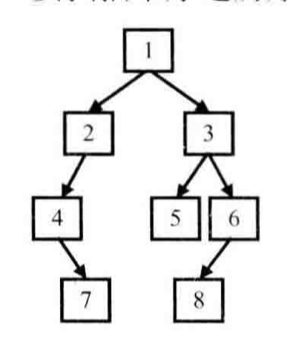

(PS：扫描[首页里面的二维码](README.md)进群，分享我自己在看的技术资料给大家，希望和大家一起学习进步！)

下面是主要是自己刷完《剑指Offer》上题后写的题解，有点乱，主要是给自己复习看的，之后有空了会进行整理。

#### [题003 二维数组中的查找](#题003)
#### [题004 替换空格](#题004)

#### [题005从尾到头打印链表](#题005)
#### [题006重建二叉树](#题006)
#### [题007两个栈实现队列](#题007)
#### [题008旋转数组](#题008)

#### [题009斐波那契数列](#题009)

#### [题010求某个数的二进制格式下1的个数](#题010)

#### [题011数值的整数次方](#题011)
#### [题012调整数组顺序使奇数排在前面](#题012)
#### [题013链表的倒数第K个结点](#题013)
#### [题014反转链表](#题014)

#### [题015 合并链表](#题015)
#### [题016判断一个二叉树是否是另一个二叉树的子结构](#题016)

#### [题017二叉树的镜像](#题017)
#### [题018顺时针打印矩形](#题018)

#### [题019包含min函数的栈](#题019)
#### [题020 栈的压入、弹出序列](#题020)

#### [题021 从上往下打印二叉树](#题021)

#### [题022 判断是否是二叉搜索树的后序遍历](#题022)

#### [题023 二叉树中和为某一值的路径](#题023)

#### [题024 复杂链表的复制](#题024)
#### [题025 二叉搜索树与双向链表](#题025)
#### [题026字符串的排列](#题026)

#### [题027数组中出现的次数超过一半的数字](#题027)
#### [题028最小的k个数](#题028)
#### [题029连续子数组的最大和](#题029)
#### [题030从1到n中出现的整数中1出现的次数](#题030)

#### [题031把数组排成最小的数](#题031)

#### [题032返回第N个丑数](#题032)

#### [题033 第一个只出现一次的字符](#题033)

#### [题034 数组中的逆序对](#题034)

#### [题035 两个的链表的第一个公共节点](#题035)

#### [题036 数字在排序数组中出现的次数](#题036)

#### [题037 二叉树的深度](#题037)

#### [题038 判断是否是平衡二叉树](#题038)
#### [题039 数组中只出现一次的数组](#题039)

#### [题040 和为S的连续正数序列](#题040)
#### [题041 和为S的两个数字](#题041)

#### [题042左旋转字符串](#题042)
#### [题043 翻转单词的序列](#题043)
#### [题044 扑克牌顺子](#题044)
#### [题045 圆圈中最后剩下的数字](#题045)
#### [题046 求1+2+…+n](#题046)
#### [题047 不用加减乘除做加法](#题047)

#### [题048 将字符串转换为整数](#题048)
#### [题049 数组中重复的数字](#题049)

#### [题050 构建乘积数组](#题050)
#### [题053 字符流中第一个不重复的字符](#题053)
#### [题054 链表中环的入口节点](#题054)
#### [题055 删除链表中重复的节点](#题055)
#### [题056 二叉树的下一个节点](#题056)
#### [题057 对称的二叉树](#题057)
#### [题058 按之字形顺序打印二叉树](#题058)
#### [题059 把二叉树打印成多行](#题059)
#### [题060序列化二叉树](#题060)

#### [题061 二叉搜索树的第K小的节点](#题061)
#### [题062 数据流的中位数](#题062)

#### [题063 滑动窗口的最大值](#题063)
#### [题064 矩阵中的路径](#题064)
#### [题065机器人的运动范围](#题065)

#### [题066剪绳子](#题066)

### 题003 二维数组中的查找

##### 题目内容：


在一个二维[数组](https://cuijiahua.com/blog/tag/数组/)中，每一行都按照从左到右递增的顺序排序，每一列都按照从上到下递增的顺序排序。请完成一个函数，输入这样的一个二维[数组](https://cuijiahua.com/blog/tag/数组/)和一个整数，判断数组中是否含有该整数。

如果在一个二维数组中找到数字7，则返回true，如果没有找到，则返回false。

##### 思路

就是从右上角开始遍历，假设要查找的数为A，当前遍历的数为B，B的特点是B所在行里面最大的数，也是B所在列最小的数，如果遍历的数B<A，那么B所在的行可以排除（比B都小)，如果遍历的数B>A，那么B所在的列可以排除(比B都大)。

##### 代码：

```java
 static boolean find(int target, int [][] array) {
  int rowLength = array.length;//总行数
  int colLength = array[0].length;//总列数

  int currentRow = 0;//起始遍历位置是右上角，行号为0
  int currentCol = colLength - 1;//起始遍历位置是右上角，列号为最大值
  while (currentRow <rowLength && currentCol >= 0) {//防止超出边界
    if (array[currentRow][currentCol] == target) {
      return true;
    } else if (array[currentRow][currentCol]  > target) {//比要找的数大，那么排除更大的数，也就是排除这一列
      currentCol--;
    } else {//比要找的数小，那么排除更小的数，也就是排除这一行
      currentRow++;
    }
  }
  return false;
}
```

##### 总结

注意这个currentRow <rowLength && currentCol >= 0判断条件，防止越界。

### 题004 替换空格

请实现一个函数，将一个字符串中的每个空格替换成“%20”。例如，当字符串为We Are Happy.则经过替换之后的字符串为 We%20Are%20Happy。

最暴力的方法就是从头开始对字符数组进行遍历，碰到空格，就进行替换，然后让后面的元素向后移动2位，但是这样每个空格都需要让后面的元素移动，复杂度会是O（n^2）。

优化的方法是先遍历一编字符串，知道字符串的空格数，然后计算得到替换后的长度=原来长度+2*空格数，然后从字符串的末尾进行遍历，每次把元素移动到计算后的数组下标的位置，并且对空格进行替换。

```java
 String replaceSpace(StringBuffer str) {
        int number = 0;//空格数目
        for (int i = 0; i < str.length(); i++) {
            if (str.charAt(i) == ' ') {
                number++;
            }
        }
        int oldLength = str.length();
        int newLength = str.length()+ 2*number;

        str.setLength(newLength);
        int tempIndex = newLength - 1;//新字符串正在的位置
        for (int i = oldLength-1; i >=0; i--) {//遍历
            if (str.charAt(i) != ' ') {
                str.setCharAt(tempIndex, str.charAt(i));
                tempIndex--;
            } else {
                str.setCharAt(tempIndex, '0');
                str.setCharAt(tempIndex-1, '2');
                str.setCharAt(tempIndex-2, '%');
                tempIndex = tempIndex - 3;

            }
        }
        return str.toString();
}
```

## 题005 从尾到头打印链表

输入一个链表，按链表值从尾到头的顺序返回一个ArrayList。

总结：

首先通过开始的判断，来排除链表为空的情况，直接返回空数组，链表不为空，取下一个节点，判断下一个节点是否为空，

- 不为空，那么递归调用printListFromTailToHead方法来获取后面的节点反序生成的ArrayList，然后添加当前的节点的值，然后返回arrayList。
- 为空，那么说明当前节点是链表尾部节点，直接创建一个ArrayList，然后添加当前节点的值，然后返回arrayList。

其实原理就是先递归遍历，然后再打印，这样链表打印的顺序就是逆序的了。
```java
ArrayList<Integer> list = new ArrayList<Integer>();
public ArrayList<Integer> printListFromTailToHead(ListNode listNode) {
		if(listNode == null ){
				return list;
		}
		printListFromTailToHead(listNode.next);
		list.add(listNode.val);
		return list;
}
```


## 题006重建二叉树

输入某二叉树的前序遍历和中序遍历的结果，请重建出该二叉树。假设输入的前序遍历和中序遍历的结果中都不含重复的数字。例如输入前序遍历序列{1,2,4,7,3,5,6,8}和中序遍历序列{4,7,2,1,5,3,8,6}，则重建二叉树并返回。



前序遍历结果和中序遍历结果：


前序遍历结果分布是二叉树根节点，左子树，右子树。

中序遍历结果分布是左子树，二叉树根节点，右子树。

所以根据前序遍历结果的第一个元素获取到根节点，然后根据根节点把中序遍历结果分为两半，得到左子树的中序遍历结果，然后根据左子树的长度可以去前序遍历结果中分离出左子树的前序遍历结果，右子树也是如此，所以可以递归得构造出整个二叉树。

```java
 public static TreeNode reConstructBinaryTree(int[] pre, int[] in) {
        return reConstructBinaryTree(pre, 0, pre.length-1, in, 0, in.length-1);
    }

    public static TreeNode reConstructBinaryTree(int[] pre, int preStart, int preEnd, int[] in, int inStart, int inEnd) {
        if (preStart > preEnd || inStart > inEnd) {
            return null;
        }
        TreeNode treeNode = new TreeNode(pre[preStart]);
        for (int i = inStart; i <= inEnd; i++) {
            if (in[i] == pre[preStart]) {
                int leftLength = i - inStart;//左子树长度
                treeNode.left = reConstructBinaryTree(pre, preStart + 1, preStart+leftLength, in, inStart, i-1);
                treeNode.right = reConstructBinaryTree(pre, preStart +leftLength+1, preEnd, in, i+1, inEnd);
               break;
            }
        }
        return treeNode;
    }
```

## 题007两个栈实现队列

用两个栈来实现一个队列，完成队列的 Push 和 Pop 操作。 队列中的元素为int类型。

思路：因为队列是先进先出，栈是先进后出，一个栈用来进元素，一个栈用来反序，就可以实现队列。用一个栈stack1来进元素，另一个栈stack2来出元素，stack2为空时，将stack1的元素依次出栈，然后依次入栈到stack2，然后从stack2取出栈顶元素。

```java
		Stack<Integer> stack1 = new Stack<Integer>();
    Stack<Integer> stack2 = new Stack<Integer>();
    public void push(Integer number) {
        stack1.push(number);
    }
    public Integer pop() {
        if (stack2.size()>0) {
            return stack2.pop();
        }else if (stack1.size()>=0) {
            while (stack1.size()>0) {
                Integer temp = stack1.pop();
                stack2.push(temp);
            }
            return stack2.pop();
        }
        return null;
    }
```

## 题008旋转数组

把一个数组最开始的若干个元素搬到数组的末尾，我们称之为数组的旋转。 输入一个非减排序的数组的一个旋转，输出旋转数组的最小元素。 例如数组{3,4,5,1,2}为{1,2,3,4,5}的一个旋转，该数组的最小值为1。 NOTE：给出的所有元素都大于0，若数组大小为0，请返回0。

```java
int minNumberInRotateArray(int[] array) {
        if (array[0]<array[array.length-1]){//当前就是一个递增的情况
            return array[0];
        }
        int start = 0;
        int end = array.length-1;
        int mid = 0;
        while (array[start] >= array[end]) {
            System.out.println(start+"======"+mid+"====="+end);
            if (end-start == 1) {
                return array[end];
            }
            mid = (end + start)/2;

            if (array[start] == array[mid] && array[start] == array[end]) {//左边界，中间值，右边界相等
                int min = array[start];
                for (int i = start+1; i <=end ; i++) {
                    if (array[i]< min) {
                        min = array[i];
                    }
                }
                return min;
            }
            if ( array[mid]>=array[start]){//左半部分是递增的，那么就去掉左半部分
                start = mid;
            } else if(array[mid]<=array[end]) {//右半部分是递增的，那么就去掉右半部分
                end = mid;
            }
        }
        return array[mid];
    }
```

思路：旋转数组其实就是一个递增的数组，整体移动了一下元素，类似3，4，5，1，2这种。要查找最小的元素，可以遍历一遍数组，复杂度为O(N)，这样就太暴力了，因为这个旋转数组其实是有规律的，可以根据左边界，右边界，中间值来判断最小值的位置

* 左边界<=中间值 说明左边界到中间值这一段是递增的，也就是最小值不处于这一段。这样可以排除掉这一段，然后去另一段里面遍历查找。

* 中间值<=右边界 说明中间值到右边界这一段是递增的，也就是最小值不处于这一段。这样可以排除掉这一段，然后去另一段里面查找。

  一直排除到最后，右边界下标-左边界下标==1时，说明左边界是最大值，右边界是最小值，此时整个循环结束。

* 特殊情况 左边界== 中间值==右边界 说明无法判断最小值位于哪里，只能从左边界到右边界进行遍历然后获得最小值。

## 题009斐波那契数列

大家都知道斐波那契数列，现在要求输入一个整数n，请你输出斐波那契数列的第n项（从0开始，第0项为0）。n<=39

##### 递归解法

f(n) =f(n-1)+f(n-2) 

n为0时，f(n)为0

n为1时，f(n)为1

```java
int Fibonacci(int n) {
    if (n == 0){
        return 0;
    } else if (n==1) {
        return 1;
    }
    return Fibonacci(n-1) + Fibonacci(n-2);
}
```


## 题010求某个数的二进制格式下1的个数

输入一个整数，输出该数二进制表示中1的个数。其中负数用补码表示。

第一种解法就是每次拿二进制数最低位与1取&结果，如果结果为1，代表最低位为1，count+1，然后将二进制数>>1位，让倒数第二位成为最低位然后比较。（负数右移动，左边的空位是会补1的，所以如果是负数A右移动，会先变成变成A/2，最终变为-1，-1的二进制数继续右移还是-1）

在计算机中，数值都是使用补码进行表示的，可以将符号位和数值域统一处理；同时，加法和减法也可以统一处理。正数的补码就是原码，负数的补码就是绝对值取原码，取反得到反码，然后再+1

```
-1的补码是
1、先取1的原码：00000000 00000000 00000000 00000001
2、得反码： 11111111 11111111 11111111 11111110
3、得补码： 11111111 11111111 11111111 11111111

-2的补码是
1、先取1的原码：00000000 00000000 00000000 00000010
2、得反码： 11111111 11111111 11111111 11111101
3、得补码： 11111111 11111111 11111111 11111110
```

这种解法的问题在于负数的最高位是1，向右移动一位后，为了保证移位后还是一个负数，最高位还是设置为1，这样就会陷入死循环（-1右移动还-1）。

第二种解法就是不拿最低位去进行比较了，而是定义一个变量flag=1，拿二进制数与flag进行比较，判断最低位是否为1，为1那么count+1，然后将flag<<1位，拿二进制数与flag进行比较，判断倒数第二位是否为1，然后一直把每一位都判断完，但是在Java中，int是4字节，32位，这样需要判断32次。

```java
public int NumberOf1(int n) {
		int count = 0;
		int bit = 1;
		int times =0;
		while(times<32) {
      //不为0说明这一个二进制位为1，
				if((bit&n) != 0) {count++;}
				times++;
				bit = bit<<1;
		}
    return count;
}
```

第三种解法可以做到二进制数有多少个1就判断多少次。具体原理是

n&(n-1)的结果其实是将n的最右边的1去掉，所以多次执行n&(n-1)直到将所有的1都去掉，以此来计数。

```java
public int NumberOf1(int n) {
        int count = 0;
        while (n != 0) {
            count++;
            n = n & (n-1);
        }
        return count;
    }
```

## 题011数值的整数次方

给定一个 double 类型的浮点数 base 和 int 类型的整数 exponent 。求 base 的 exponent 次方。

思路可以用一个循环，让底数直接相乘，循环次数为整数次方数，这样如果有n次方，复杂度为O(N)，可以

假设f(n)代表x的n次方

n为偶数时，

f(n)= f(n/2)*f(n/2)

n为奇数时，

f(n)= f(n/2)*f(n/2) * x

```java
double Power(double base ,int exponent) {
    if (exponent<0) {
        if (base!=0) {
            return 1/Power(base,-exponent);
        } else {
            //抛出异常
        }
    }
    if (exponent == 0) { return 1;}
    else if (exponent == 1) { return base;}
    double result = Power(base, exponent / 2);
    if ((exponent & 0x1) == 0) {
        return result * result;
    }
    return base * result * result;
}
```

## 题012调整数组顺序使奇数排在前面

输入一个整数数组，实现一个函数来调整该数组中数字的顺序，使得所有的奇数位于数组的前半部分，所有的偶数位于数组的后半部分，并保证奇数和奇数，偶数和偶数之间的相对位置不变。

解题思路：

如果可以使用额外的内存空间，可以对数组遍历两遍，一遍将奇数取出，存放在额外的数组中去，一遍把剩下的偶数存放到额外的数组中去。

如果不能使用额外的内存空间，就是查找奇数，然后与前面的元素互换，一直到替换到最后一个奇数的后面，有点像是冒泡排序。(因为不能改变相对位置，所以不能用快排)

冒泡排序是其实是交换，从头开始，依次判断两个相邻的元素，将更大的元素向右交换，遍历一次后可以将当前序列最大的元素交换到最后面去，下次遍历就不用管最后一个元素。

```java
public static void reOrderArray(int [] array) {
    int j = 0;//第一个偶数的位置。用于存放下一个奇数
    for (int i = 0; i < array.length; i++) {
        if (array[i]%2==1) {//奇数
            for (int k = i;k>j;k--) {
                int temp = array[k];
                array[k] = array[k-1];
                array[k-1] = temp;
            }
            j++;
        }
    }
}
```

## 题013链表的倒数第K个结点

输入一个链表，输出该链表中倒数第k个结点。

一个指针A先向前走k-1步，然后一个指针B指向头结点，A，B同时往后面走，直到A成为最后一个节点。

```java
ListNode FindKthToTail(ListNode head, int k) {
    if (head==null || k <= 0) {//空链表，或者k小于等于0
        return null;
    }
    ListNode secondNode = head;
    for (int i=0 ; i < k-1 ; i++) {//向前走k-1步
        if (secondNode.next==null) {//链表长度不足k个
            return null;
        }
        secondNode = secondNode.next;
    }
    ListNode firstNode = head;
    while (secondNode.next != null) {//一直遍历到secondNode成为最后一个节点
        secondNode = secondNode.next;
        firstNode = firstNode.next;
    }
    return firstNode;
}
```


## 题014反转链表

输入一个链表，反转链表后，输出新链表的表头。

A = head

B = head.next

head = null;//特别注意需要将原本的头结点置为null，否则原来的头结点的next会引用原来的第二个节点，形成一个环。

上一个节点A，当前节点B，下一个节点C，让

C = B.next;

B.next = A;

A = B;

B = C;

一直到B为null，此时A为最后一个节点.

```java
public static ListNode ReverseList(ListNode head) {

    if (head == null) return null;//链表为空
    if (head.next==null) return head;//链表只有一个节点
    ListNode lastNode = head;
    ListNode currentNode = head.next;
    head.next = null;//将原来的头结点指向null

    while (currentNode != null) {//一直到currentNode是最好一个节点
        ListNode saveNextNode = currentNode.next;
        currentNode.next = lastNode;
        lastNode = currentNode;
        currentNode = saveNextNode;
    }
    return lastNode;
}
```

这种解法好理解一点，就是使用first，second，three保存三个连续的节点，依次后移动

```java
public ListNode findLastNode(ListNode node) {
		if(node==null ||node.next ==null) {
				return node;
		}
		//至少有两个节点
		ListNode first = node;
		ListNode second = node.next;
		ListNode three = second.next;
		first.next = null;
		while(second!=null) {
				second.next = first;
				first = second;
				second = three;
				if (three == null){break};
				else {
					three = three.next;
				}
		}
		return first;
}
```


## 题015 合并链表

输入两个单调递增的链表，输出两个链表合成后的链表，当然我们需要合成后的链表满足单调不减规则。

遍历写法：

```java
 ListNode Merge(ListNode list1,ListNode list2) {
        if (list1 == null || list2 == null ) { //存在链表为空
        		return list1 == null ? list2 : list1;
        }
        ListNode newHead, currentNode;
        //取出较小值作为新链表的头结点
        if (list1.val < list2.val) {
            newHead = list1;
            list1 = list1.next;
        }else {
            newHead = list2;
            list2 = list2.next;
        }
        currentNode = newHead;
        while (list1 != null && list2 != null ) {
            if (list1.val<list2.val) {
                currentNode.next = list1;
                list1 = list1.next;
            } else {
                currentNode.next = list2;
                list2 = list2.next;
            }
            currentNode = currentNode.next;
        }
        if (list1!=null) {
            currentNode.next = list1;
        } else {
            currentNode.next = list2;
        }
        return newHead;
 }
```

递归写法：

```java
ListNode Merge(ListNode list1,ListNode list2) {
    if (list1 == null || list2 == null ) { //存在链表为空
    		return list1 == null ? list2 : list1;
    }
    ListNode newHead;
    if (list1.val < list2.val) {
        newHead = list1;
        newHead.next = Merge(list1.next,list2);
    }else {
        newHead = list2;
        newHead.next = Merge(list1,list2.next);
    }
    return newHead;
}
```

## 题016 判断一个二叉树是否是另一个二叉树的子结构

输入两棵二叉树A，B，判断B是不是A的子结构。（ps：我们约定空树不是任意一个树的子结构）

有一个root为空，就返回false，然后判断根节点是否相等，

* 相等，那么对根节点进行递归，判断子树根节点是否为NULL，是返回true，判断父树根节点是否为NULL，是返回false，然后对左右节点进行判断
* 不相等，直接对左子树递归调用判断，是false，继续对右子树进行判断。

```java
public boolean HasSubtree(TreeNode root1,TreeNode root2) {
    boolean result = false;
    if (root1 != null && root2 != null) {
        if (root1.val == root2.val) {
            result = judgeTheTree(root1, root2);
        }
        if (result == false) {
            result = HasSubtree(root1.left, root2);
        }
        if (result == false) {
            result = HasSubtree(root1.right, root2);
        }
    }
    return result;
}

boolean judgeTheTree(TreeNode root1, TreeNode root2) {
    if (root2 == null) {return true;}
    if (root1 == null) {return false;}
    if (root1.val == root2.val) {
        return judgeTheTree(root1.left, root2.left) && judgeTheTree(root1.right, root2.right);
    }
    return false;
}
```


## 题017 二叉树的镜像

操作给定的二叉树，将其变换为源二叉树的镜像。

就是翻转二叉树，将二叉树的左右子树进行交换。

```java
public void Mirror(TreeNode root) {
    if (root != null) {
        TreeNode tempNode = root.left;
        root.left = root.right;
        root.right = tempNode;
        Mirror(root.left);
        Mirror(root.right);
    }
}
```


## 题018 顺时针打印矩形

输入一个矩阵，按照从外向里以顺时针的顺序依次打印出每一个数字，例如，如果输入如下4 X 4矩阵： 1 2 3 4 5 6 7 8 9 10 11 12 13 14 15 16 则依次打印出数字1,2,3,4,8,12,16,15,14,13,9,5,6,7,11,10.

就是将矩形外面一圈打印完，外面打印时可以分为四块，上面，右边，下面，左边。然后递归打印剩下的部分，


```java
public ArrayList<Integer> printMatrix(int [][] matrix) {
				if(matrix==null) {
						return null;
				}
        ArrayList<Integer> arrayList = new  ArrayList<Integer>();
        return printMatrix(arrayList, matrix, 0, matrix.length-1,0,matrix[0].length -1);
    }

    public ArrayList<Integer> printMatrix(ArrayList<Integer> arrayList, int [][] matrix,int rowStart, int rowEnd, int colStart, int colEnd) {
        if (rowStart> rowEnd || colStart>colEnd) {
            return arrayList;
        }
        for (int i = colStart; i <=colEnd;i++) {
            arrayList.add(matrix[rowStart][i]);
        }
        for (int i = rowStart+1; i <=rowEnd-1;i++) {
            arrayList.add(matrix[i][colEnd]);
        }
        for (int i = colEnd; i >=colStart&&rowEnd>rowStart;i--) {//要加rowEnd>rowStart判断，不然对于单行情况会重复打印
            arrayList.add(matrix[rowEnd][i]);
        }
        for (int i = rowEnd-1; i >=rowStart+1&& colStart < colEnd;i--) {//要加rowEnd>rowStart判断，不然对于单列情况会重复打印
            arrayList.add(matrix[i][colStart]);
        }
        printMatrix(arrayList, matrix,rowStart+1,rowEnd-1, colStart+1,colEnd-1);
        return arrayList;
    }
```

## 题019 包含min函数的栈

定义栈的数据结构，请在该类型中实现一个能够得到栈中所含最小元素的 min 函数（时间复杂度应为O（1））。

暴力解法极速

就是用另外一个栈来存栈每个元素的对应的栈最小值，其实很多原生的元素对应的栈最小值都是一样的，只有栈最小值自己出栈或者入栈后才会有区别。

所以入栈时，如果元素<=之前的最小值，那么对元素入min栈，

出栈时，如果元素==min栈的栈顶元素，也就是当前的最小值，那么需要同时对min栈做出栈操作。

```java
private Stack<Integer> stack = new Stack<Integer>();
private Stack<Integer> minStack = new Stack<Integer>();
public void push(int node) {
    stack.push(node);
    if (minStack.size()==0 || node<=minStack.peek()) {
        minStack.push(node);
    }
}
public void pop() {
   if(stack.size()>0 && minStack.size()>0) {
        Integer value = stack.pop();
        if (value == minStack.peek()) {
            minStack.pop();
        }
    }
}

public int top() {
    return stack.peek();
}

public int min() {
    return minStack.peek();
}
```

## 题020 栈的压入、弹出序列

输入两个整数序列，第一个序列表示栈的压入顺序，请判断第二个序列是否可能为该栈的弹出顺序。假设压入栈的所有数字均不相等。例如序列1,2,3,4,5是某栈的压入顺序，序列4,5,3,2,1是该压栈序列对应的一个弹出序列，但4,3,5,1,2就不可能是该压栈序列的弹出序列。（注意：这两个序列的长度是相等的）

一个是栈的压入顺序A，一个是出栈顺序B，判断出栈顺序是否是这个栈的出栈顺序。

例如压入顺序是1,2,3,4,5，

出栈顺序4,5,3,2,1可能是该栈的弹出顺序，

第一种解法，模拟压入，弹出法。

就出栈要么是在压入过程中，就是压入一个元素时，然后进行出栈，或者全部压完之后再出栈。

所以可以对压入顺序A进行遍历，判断A压入的元素是否是出栈顺序B最前面的元素，

* 如果不是，那么说明只是把元素压入栈tempStack，现在还没有出栈
* 如果是，那么现在元素可以出栈了，将元素先压入tempStack，然后对B继续向后遍历，继续之前的循环。

循环结束后，继续对B继续向后遍历，并且与tempStack的栈顶元素进行判断，是的话就出栈，知道tempStack的元素与B中遍历到的元素不相等，那么说明B与A对应不上。

```java
public static boolean IsPopOrder1(int [] pushA,int [] popB) {
        if (pushA==null||popB==null) {
            return false;
        }
        Stack<Integer> stack = new Stack<>();
        int j = 0;
 				//先根据入栈序列，往栈中压入数据
        for (int i = 0; i < pushA.length; i++) {
            //如果当前栈顶元素跟出栈序列当前遍历的元素一样，那么进行出栈处理
            while (stack.size()>0 && j<popA.length && popB[j] == stack.peek()) {
                j++;
                stack.pop();
            }
          //将后面的元素压栈
            stack.push(pushA[i]);
        }
        //对剩余元素出栈
        while (stack.size()>0 && j<popA.length && popB[j] == stack.peek()) {
            j++;
            stack.pop();
        }
        // stack.size()==0代表所有元素都出栈了，弹出序列是与弹入序列是一一对应的
        return stack.size()==0;
    }
```

## 题021 从上往下打印二叉树

从上往下打印出二叉树的每个节点，同层节点从左至右打印。

其实就是二叉树的宽度优先遍历，一般就是使用一个队列，一开始将根节点加入队列，每次从队列取出最前面的节点，将节点打印，并将左右节点加入到队列，从队列中取出头结点，然后重复这个操作。

```java
public ArrayList<Integer> PrintFromTopToBottom(TreeNode root) {
        ArrayList<Integer> arrayList = new ArrayList<Integer>();
        if (root==null) {
            return arrayList;
        }
        ArrayList<TreeNode> queue = new ArrayList<TreeNode>();
        queue.add(root);
        while (queue.size()>0) {
            TreeNode treeNode = queue.remove(0);
            arrayList.add(treeNode.val);
            if (treeNode.left!=null) queue.add(treeNode.left);
            if (treeNode.right!=null) queue.add(treeNode.right);
        }
        return arrayList;
}
```

也可以通过队列来实现，将根节点添加到队列中，然后对队列进行循环，每次从队列取出一个元素，添加到ArrayList中去，然后将左，右子节点添加到队列中去，然后继续循环，一直到队列中取不到元素。(Java中队列的实现Queue，add(),remove())

##### 深度优先遍历

一般是使用栈来实现，一开始将

1.根节点加入栈，

2.将栈顶元素出栈，打印这个节点，然后将它的右子节点入栈，将其左节点入栈

3.重复2操作，一直到栈中元素为空。

也可以使用递归实现，深度遍历递归实现

```java
ArrayList<TreeNode> list = new ArrayList<TreeNode>();
void deepTranverse(TreeNode node) {
			if(node!=null) {
			    list.add(node);
					deepTranverse(node.left);
          deepTranverse(node.right);
			}
}
//栈的解法
void deepTranverse(TreeNode node) {
      Stack<TreeNode> stack=new Stack<TreeNode>();
     List<Integer> list=new ArrayList<Integer>();
     if(root==null)
            return list;
     //压入根节点
        stack.push(root);
    //然后就循环取出和压入节点，直到栈为空，结束循环
        while (!stack.isEmpty()){
            TreeNode t=stack.pop();
            if(t.right!=null)
                stack.push(t.right);
            if(t.left!=null)
                stack.push(t.left);
            list.add(t.val);
        }
        return  list;
}
```


## 题022 判断是否是二叉搜索树的后序遍历

输入一个整数数组，判断该数组是不是某二叉搜索树的后序遍历的结果。如果是则输出 Yes ,否则输出 No 。假设输入的数组的任意两个数字都互不相同。

二叉搜索树的特点在于，左子树所有节点<根节点<右子树所有节点，后续遍历的遍历顺序是左子树，右子树，根节点，所以取出数组最后一个元素，也就是根节点，然后遍历序列，发现第一个比根节点大的数之后，这个是也就是临界点，后面的数肯定也需要比根节点大，否则不是后续遍历，遍历完成后。

* 没有临界点(也就是第一个右子树的节点)，全部都是左子树，递归调用判断，
* 临界点等于第一个元素，全部都是右子树，递归调用判断，
* 其他情况，将序列分为左子树，右子树，递归调用判断，

（遍历时如果只有一个元素，那么直接返回正确，肯定满足要求）

```java
public static boolean VerifySquenceOfBST(int [] sequence) {
    if (sequence == null || sequence.length ==0) {
        return false;
    }
    return VerifySquenceOfBST(sequence,0,sequence.length-1);
}

public static boolean VerifySquenceOfBST(int[] sequence, int start, int end) {
    if (start==end) {
        return true;
    }
    Integer rightChildIndex = null;
    for (int i = start;i<end;i++) {
            if (sequence[i] > sequence[end]&&rightChildIndex==null) {
                rightChildIndex = i;
            }
            if (rightChildIndex!=null&&sequence[i] < sequence[end]) {//右子树有更小的元素
                return false;
            }
    }
    if(rightChildIndex==null) {//说明全部位于左子树
        return VerifySquenceOfBST(sequence,start,end-1);
    } else if(rightChildIndex== start) {//说明全部位于右边子树
        return VerifySquenceOfBST(sequence,start,end-1);
    }
  //继续校验
    return VerifySquenceOfBST(sequence,start,rightChildIndex-1) && VerifySquenceOfBST(sequence,rightChildIndex, end-1);
}
```

## 题023 二叉树中和为某一值的路径

输入一颗二叉树的根节点和一个整数，打印出二叉树中结点值的和为输入整数的所有路径。路径定义为从树的根结点开始往下一直到叶结点所经过的结点形成一条路径。(注意: 在返回值的 list 中，数组长度大的数组靠前。)

就是递归调用每个节点的左右子树，然后将节点值相加，如果节点值和为某个预期值，并且该节点为叶子节点，那么这条路径就是要找的路径。

```java
public ArrayList<ArrayList<Integer>> FindPath(TreeNode root, int target) {
    ArrayList<ArrayList<Integer>> arrayContainer = new ArrayList<ArrayList<Integer>>();
    if (root == null) {
        return arrayContainer;
    }
    judgeIfIsTarget(arrayContainer, new ArrayList<Integer>(),root,target,0);
    return arrayContainer;
}

public void judgeIfIsTarget(ArrayList<ArrayList<Integer>> arrayContainer, ArrayList<Integer> currentArrayList, TreeNode root, int target,int sum) {
    if (root == null) {
        return ;
    }
    currentArrayList.add(root.val);
    sum = sum+root.val;
    if (sum == target && root.left == null && root.right == null) {
        ArrayList<Integer> copyArrayList = new ArrayList<>(currentArrayList);
        arrayContainer.add(copyArrayList);
    } else {
        judgeIfIsTarget(arrayContainer, new ArrayList<>(currentArrayList), root.left, target,sum);
        judgeIfIsTarget(arrayContainer, new ArrayList<>(currentArrayList), root.right, target,sum);
    }
}
```

## 题024 复杂链表的复制

输入一个复杂链表（每个节点中有节点值，以及两个指针，一个指向下一个节点，另一个特殊指针指向任意一个节点），返回结果为复制后复杂链表的 head 。（注意，输出结果中请不要返回参数中的节点引用，否则判题程序会直接返回空）

第一种解法就是需要额外的空间，一个哈希表来辅助，哈希表存储了旧链表的节点与新节点的映射关系，把链表当成普通单链表来进行复制，复制完之后通过去哈希表中查找节点来对特殊指针进行赋值。

第二种解法就是不需要额外的空间，但是将新节点先放在旧链表中对应的节点的后面，然后当成单链表复制完毕后，复制完之后，去对特殊指针赋值，然后再将新旧链表分离。

```java
public RandomListNode Clone(RandomListNode pHead)
    {
        if (pHead == null){return null;}

        RandomListNode currentNode= pHead;
        //当成单链表来赋值一遍
        while (currentNode!=null) {
            RandomListNode newNode = new RandomListNode(currentNode.label);

                RandomListNode nextNode = currentNode.next;
                currentNode.next = newNode;
                newNode.next = nextNode;
                currentNode = nextNode;


        }
        //设置新链表的特殊指针
        RandomListNode oldCurrentNode= pHead;
        RandomListNode newCurrentNode;
        while (oldCurrentNode!=null) {
            newCurrentNode = oldCurrentNode.next;
            RandomListNode specialNode = oldCurrentNode.random;
            newCurrentNode.random = specialNode == null ? null : specialNode.next;//random可能会为null
            oldCurrentNode = oldCurrentNode.next.next;

        }

        //链表分离
        oldCurrentNode = pHead;
        newCurrentNode = oldCurrentNode.next;

        RandomListNode newHead = pHead.next;

        while (oldCurrentNode!=null) {

            RandomListNode oldNextNode = oldCurrentNode.next.next;
            if (oldNextNode== null) {//到最后一个节点了
                oldCurrentNode.next = null;//不然会指向新链表的最后一个节点
                break;
            }
            RandomListNode newNextNode = oldNextNode.next;
            oldCurrentNode.next = oldNextNode;
            oldCurrentNode = oldNextNode;
            newCurrentNode.next = newNextNode;
            newCurrentNode = oldCurrentNode.next;
        }
        return newHead;
    }
```


## 题025 二叉搜索树与双向链表

输入一棵二叉搜索树，将该二叉搜索树转换成一个排序的双向链表。要求不能创建任何新的结点，只能调整树中结点指针的指向。

二叉搜索树的中序遍历的结果就是递增的序列，所以递归实现二叉搜索树的中序遍历

```java
		TreeNode head = null;//主要记录双向链表头结点
    TreeNode   lastNode = null;//主要记录中序遍历时，上一次遍历的节点
    public TreeNode Convert(TreeNode pRootOfTree) {
        if (pRootOfTree == null) {
            return null;
        }
        Convert(pRootOfTree.left);
        if (head == null) {//这里相当于是把第一次执行Convert方法的元素设置为链表头结点，也就是中序遍历第一个位置的节点，也就最左边的叶子节点。
            head = pRootOfTree;
        }
        if (lastNode != null) {//中序遍历时，假设存在上一个遍历的节点，将上一个节点与这个节点进行关联
						lastNode.right = pRootOfTree;
            pRootOfTree.left = lastNode;
        } 
      	//完成对当前节点的遍历，将当前设置为lastNode。
        lastNode = pRootOfTree;
        Convert(pRootOfTree.right);
        return head;
    }
```

## 题026字符串的排列

输入一个字符串,按字典序打印出该字符串中字符的所有排列。例如输入字符串abc,则打印出由字符a,b,c所能排列出来的所有字符串abc,acb,bac,bca,cab和cba。

输入描述:输入一个字符串,长度不超过9(可能有字符重复),字符只包括大小写字母。

##### 回溯算法

对于一个字符串的序列，可以看成第一个字符+剩下字符的排列，每次从后面序列中取一个不重复的字符，与第一个字符交换，然后递归地对后面的字符调用函数进行排列。

1.遍历字符串，每次取一个不同的字符作为首字符，然后对后面剩余的字符串递归调用方法，对后面的字符串进行排列。

2.在递归的尽头，也就是当前子字符串只有1个元素，会将所有元素添加到数组。

```java
		public ArrayList<String> Permutation1(String str) {
        ArrayList<String> list = new ArrayList<String>();
        if (str==null||str.length()==0) {
            return list;
        }
        Permutation(list,str,0,str.length()-1);
        return list;
    }
    public void Permutation(ArrayList<String> list,String str,int start,int end) {
        StringBuffer stringBuffer = new StringBuffer(str);
        HashSet<Character> set = new HashSet<>();
      //递归到最后一层，此时只有一个字符了，肯定是排在第一个，将当前字符串添加到list
        if (start == end) {
            list.add(str);
            return;
        }
        for (int i = start; i <= end; i++) {
            Character c = str.charAt(i);
            if (set.contains(c) == false) {
                //添加当前字符到set，代表已经做了首元素了  
                set.add(c);
                //将当前字符与首字符交换
                Character startChar = stringBuffer.charAt(start);
                stringBuffer.setCharAt(start,c);
                stringBuffer.setCharAt(i,startChar);
              //继续递归
                Permutation(list, stringBuffer.toString(),start+1,end);
            }
        }
    }
```

## 题027数组中出现的次数超过一半的数字

数组中有一个数字出现的次数超过数组长度的一半，请找出这个数字。例如输入一个长度为9的数组{1,2,3,2,2,2,5,4,2}。由于数字2在数组中出现了5次，超过数组长度的一半，因此输出 2 。如果不存在则输出 0 。

就是一个数组，假设包含一个超过次数一半的元素，那么去除掉两个不相等的元素后，剩下的数组中，这个元素还是会出现次数超过一半。

（原理就是每次排除两个不相等的元素，最后剩下的一个元素，或者两个元素一定是次数超过一半的这个数字。）

```java
public int MoreThanHalfNum_Solution(int [] array) {
    if (array==null||array.length==0) {
        return 0;
    }
    if (array.length==1) {
        return array[0];
    }
    int result = array[0];
    int times = 1;
    for (int i = 1; i < array.length; i++) {
        if (times == 0) {
            times = 1;
            result = array[i];
        } else if (array[i] == result) {
            times++;
        } else {
            times--;
        }
    }
    //下面就是判断这个数字是否满足条件
    int statTimes = 0;
    for (int i = 0; i < array.length; i++) {
      if (array[i] == result) {
        statTimes++;
      }
    }
    if (statTimes>array.length/2) {
      return result;
    }
    return 0;
}
```

## 题028最小的k个数

输入n个整数，找出其中最小的K个数。例如输入4,5,1,6,2,7,3,8这8个数字，则最小的4个数字是1,2,3,4。

其实就是插入排序，只不过只是对k个数进行插入排序，但是这样的时间复杂度会是O(N^2)，如果是使用快排来做，平均时间复杂度就是O(N)。

```java
public ArrayList<Integer> GetLeastNumbers_Solution(int [] input, int k) {
        ArrayList<Integer> arrayList = new ArrayList<Integer>();
        if(input==null || input.length==0 ||input.length<k || k == 0) {
            return null;
        }
        arrayList.add(input[0]);
        for (int i = 1; i < input.length; i++) {
            if (arrayList.size() < k) {//子数组个数没有达到K
                arrayList.add(input[i]);
            } else if (input[i] > arrayList.get(arrayList.size()-1)) {//子数组个数达到了K，并且当前数比子数组最后一个数大
                continue;
            } else if (input[i] < arrayList.get(arrayList.size()-1)) {
                arrayList.remove(arrayList.size()-1);
                arrayList.add(input[i]);
            }

            //将最后一个元素移动合适的位置
            for (int j = arrayList.size()-1; j > 0 ; j--) {
                if (arrayList.get(j) < arrayList.get(j-1)) {
                    int temp = arrayList.get(j);
                    arrayList.set(j, arrayList.get(j-1));
                    arrayList.set(j-1, temp);
                }
            }

        }
        return arrayList;
    }
```

## 题029连续子数组的最大和

例如:{6,-3,-2,7,-15,1,2,2},连续子向量的最大和为8(从第1个开始,到第4个为止)。给一个数组，返回它的最大连续子序列的和，你会不会被他忽悠住？(子向量的长度至少是1)

使用动态规划的方法来进行思考

f(n) 有两种取值

* 当f(n-1)<=0时，取array[n]，从这个元素重新开始

* 当f(n-1)>0时，取f(n-1)+array[n]


```java
    public int FindGreatestSumOfSubArray(int[] array) {
        if(array==null || array.length==0) {
            return 0;
        }
        int currentSum = array[0];
        int maxSum = currentSum;
        for (int i = 1; i < array.length; i++) {
            if (currentSum<0) {//前面的和是负数，就直接丢弃
                currentSum = array[i];
            } else {
                currentSum = currentSum + array[i];
            }
            if (currentSum>maxSum) {
                maxSum = currentSum;
            }
        }
        return maxSum;
    }
```

## 题030从1到n中出现的整数中1出现的次数

求出1~13的整数中 1 出现的次数,并算出 100~1300 的整数中1出现的次数？为此他特别数了一下 1~13 中包含1的数字有 1、10、11、12、13 因此共出现 6 次,但是对于后面问题他就没辙了。ACMer 希望你们帮帮他,并把问题更加普遍化,可以很快的求出任意非负整数区间中1出现的次数（从1 到 n 中1出现的次数）。

解法一，就是对1到n进行遍历，对每个数统计该数1出现的次数，统计时用这个数x%10，判断个位数是否为1，然后用x=x/10的结果继续%10来进行判断个位数为1，一直到x=0，统计到x包含1的个数，这样的话，一共有N个数，每个数计算的时间复杂度log10 N，总时间复杂度是N*log10 (N)也就是Nlog(N)

解法二：还是对1到n进行遍历，对每个数统计该数1出现的次数，将每个数转换为字符串，判断字符串包含字符"1"的个数，但是将数字转换为字符串的这个过程，由于使用了StringBuffer的append()方法，然后使用了Integer的getChars方法，复杂度还是Log10 (N)，所以总复杂度还是Nlog(N)

```java
public int NumberOf1Between1AndN_Solution(int n) {
    int count = 0;
    for (int i = 1; i <= n; i *= 10) {
        int a = n / i,b = n % i;
        //之所以补8，是因为当百位为0，则a/10==(a+8)/10，
        //当百位>=2，补8会产生进位位，效果等同于(a/10+1)
        count += (a + 8) / 10 * i + ((a % 10 == 1) ? b + 1 : 0);
    }
    return count;
}
```

## 题031把数组排成最小的数

输入一个正整数数组，把数组里所有数字拼接起来排成一个数，打印能拼接出的所有数字中最小的一个。例如输入数组{3，32，321}，则打印出这三个数字能排成的最小数字为321323。


就是把小的数排前面，这样排出来的数就是最小的，

思路就是冒泡排序，将小数往后面挪动，只是判断数A与数B之间的大小，是以AB和BA的大小来决定的，所以对A和B进行拼接成，AB和BA，通过字符串比较，判断AB和BA的大小，AB>BA,说明A排起来会比较大，往后面挪。

```java
public String PrintMinNumber(int [] numbers) {
    if(numbers.length==1) {
        return new StringBuffer().append(numbers[0]).toString();
    }
    StringBuffer stringBuffer = new StringBuffer();
    for (int i = 1; i < numbers.length; i++) {
        for (int j = 0; j < numbers.length - i ; j++) {
            if (compare(numbers[j], numbers[j+1])) {//numbers[i-1]更大
                int temp = numbers[j];
                numbers[j] = numbers[j+1];
                numbers[j+1] = temp;
            }
        }
    }
    for (int i = 0; i < numbers.length; i++) {
        stringBuffer.append(numbers[i]);
    }
    return stringBuffer.toString();
}

public Boolean compare(int a, int b) {
    String first = new StringBuffer().append(a).append(b).toString();
    String second = new StringBuffer().append(b).append(a).toString();
    for (int i = 0; i < first.length(); i++) {
        Character char1 = first.charAt(i);
        Character char2 = second.charAt(i);
        if (char1.equals(char2)) {
            continue;
        } else if (char1 > char2) {
            return true;
        } else {
            return false;
        }
    }
    return true;
}
```

## 题032返回第N个丑数

把只包含质因子2、3和5的数称作丑数（Ugly Number）。例如6、8都是丑数，但14不是，因为它包含质因子7。 习惯上我们把1当做是第一个丑数。求按从小到大的顺序的第N个丑数。

1 2 3 5 

第一个丑数是1，除了1以外，其他丑数都是2，3，5之间相乘得到的，也就是丑数的因子都是2，3，4，5，6，

第一种解决方案就是从1开始对所有整数遍历，将每个数一直除以2，3，5，看能否除尽，能除尽代表是丑数，一直得到第N个丑数。

第二种解决方案就是用一个数组来存丑数，将2，3，5当前对应的最小丑数乘以2，3，5，取最小值，作为最新的丑数，一直计算到第N个丑数。

```java
public int GetUglyNumber_Solution(int index) {
    if (index == 0) return 0;
    int[] array = new int[index];
    array[0] = 1;//最小的丑数是1
    int index2 =0 ,index3 = 0, index5 = 0;//分别代表上一次乘了2，3，5的index
    for (int i = 1; i< index;i++){
        int temp2 = array[index2]*2;
        int temp3 = array[index3]*3;
        int temp5 = array[index5]*5;
        int minTemp = temp2 < temp3 ? temp2 : temp3;
        minTemp = minTemp < temp5 ? minTemp : temp5;
        if (temp2 == minTemp) {
            index2++;
        }
        if (temp3 == minTemp) {
            //可能存在一个丑数可以由多种丑数相乘得到，
            // 例如12可以是6*2，也可以是4*3，所以这里的三个if需要分开判断赋值
            index3++;
        }
        if (temp5 == minTemp) {
            index5++;
        }
        array[i] = minTemp;
    }
    return array[index-1];
}
```

## 题033 第一个只出现一次的字符

在一个字符串(0<=字符串长度<=10000，全部由字母组成)中找到第一个只出现一次的字符,并返回它的位置, 如果没有则返回 -1（需要区分大小写）.

因为java中的字符char类型是 2字节的，也就是16位，所以只有256*256种可能，所以可以使用一个数组来对字符出现的次数进行记录。第一遍扫描字符串，统计字符出现次数，第二遍扫码字符串，返回只出现一次的字符的下标。

```java
 public int FirstNotRepeatingChar(String str) {
        if (str == null|| str.length() == 0) {
            return -1;
        }
        int[] array = new int[256*256];
        for (int i = 0; i < str.length(); i++) {
            char value = str.charAt(i);
            array[value]++;
        }
        for (int i = 0; i < str.length(); i++) {
            char value = str.charAt(i);
            if(array[value] == 1) {
                return i;
            }
        }
        return -1;
  }
```

## 题034 数组中的逆序对

在数组中的两个数字，如果前面一个数字大于后面的数字，则这两个数字组成一个逆序对。输入一个数组,求出这个数组中的逆序对的总数P。并将P对1000000007取模的结果输出。 即输出P%1000000007

输入描述: 题目保证输入的数组中没有的相同的数字

数据范围：

	对于%50的数据,size<=10^4
	
	对于%75的数据,size<=10^5
	
	对于%100的数据,size<=2*10^5

逆序对就是前面的数比后面的数大，就是一个逆序对，可以使用归并排序，每次组合并时，右边的组的数比左边的数小时，会出现逆序对，逆序对的个数为当前左边的组的元素个数。

```java
public int InversePairs(int [] array) {
        int[] temp = new int[array.length];
        int count = inversePairsort2(array,0,array.length-1,temp);
        return count;
}

public int inversePairsort2(int[] array, int left, int right, int[] temp) {
    int count = 0;
    if (left < right) {
        int mid = (left + right)/2;
        count += inversePairsort2(array,left,mid, temp);
        count += inversePairsort2(array,mid+1, right ,temp);
        //进行合并
        int leftIndex=left,rightIndex = mid+1,newIndex = left;
        while (leftIndex<=mid && rightIndex<= right) {
            if (array[leftIndex] <= array[rightIndex]) {
                temp[newIndex] = array[leftIndex];
                leftIndex++;
                newIndex++;
            } else {
                temp[newIndex] = array[rightIndex];
                count += mid - leftIndex + 1;
                if (count>1000000007) {
                    System.out.println(count);
                }
                rightIndex++;
                newIndex++;
            }
        }
        while (leftIndex<=mid) {
            temp[newIndex] = array[leftIndex];
            leftIndex++;
            newIndex++;
        }
        while (rightIndex<=right) {
            temp[newIndex] = array[rightIndex];
            rightIndex++;
            newIndex++;
        }

        for (int i = left; i <= right; i++) {
            array[i] = temp[i];
        }
    }
    return count;
}
```

思路就是先递归对数组进行分组，一直到每个组只有一个元素，然后每个组按大小进行合并，形成一个新的组。每次合并的时间复杂度是N，大概需要合并log(N)次，所以总时间复杂度是 Nlog(N)，这样写简单是简单，就是空间复杂度太高了，每次创建新数组，空间复杂度是Nlog(N)

```java
 public static int[] sort(int[] array,int start, int end) {
        if (start == end) {
            return new int[]{array[start]};
        }

        int mid = (start+end)/2;
        int[] leftArray = sort(array, start, mid);
        int[] rightArray = sort(array, mid+1, end);
        int leftIndex = 0, rightIndex = 0, newIndex = 0;
        //开始合并
        int[] newArray = new int[leftArray.length+rightArray.length];
        while (leftIndex<leftArray.length && rightIndex<rightArray.length) {
            if (leftArray[leftIndex]<rightArray[rightIndex]) {
                newArray[newIndex] = leftArray[leftIndex];
                leftIndex++;
                newIndex++;
            } else {
                newArray[newIndex] = rightArray[rightIndex];
                rightIndex++;
                newIndex++;
            }
        }
        while (leftIndex<leftArray.length) {
            newArray[newIndex] = leftArray[leftIndex];
            leftIndex++;
            newIndex++;
        }
        while (rightIndex<rightArray.length) {
            newArray[newIndex] = rightArray[rightIndex];
            rightIndex++;
            newIndex++;
        }

        return newArray;
    }
```

空间复杂度为N的一种写法,只使用一个临时数组temp来进行过度，

```java
public static int[] sort2(int[] array, int left, int right, int[] temp) {
    if (left < right) {
        int mid = (left + right)/2;
        sort2(array,left,mid, temp);
        sort2(array,mid+1, right ,temp);
        //进行合并
        int leftIndex=left,rightIndex = mid+1,newIndex = left;
        while (leftIndex<=mid && rightIndex<= right) {
            if (array[leftIndex] < array[rightIndex]) {
                temp[newIndex] = array[leftIndex];
                leftIndex++;
                newIndex++;
            } else {
                temp[newIndex] = array[rightIndex];
                rightIndex++;
                newIndex++;
            }
        }
        while (leftIndex<=mid) {
            temp[newIndex] = array[leftIndex];
            leftIndex++;
            newIndex++;
        }
        while (rightIndex<=right) {
            temp[newIndex] = array[rightIndex];
            rightIndex++;
            newIndex++;
        }

        for (int i = left; i <= right; i++) {
            array[i] = temp[i];
        }
    }
    return array;
}
```

## 题035 两个的链表的第一个公共节点

输入两个链表，找出它们的第一个公共结点。

解法一需要辅助空间，用两个栈将两个链表中的节点存起来，取出链表末尾的节点开始比较，不相等就先前移动（也就是栈顶出栈）

解法二将某一个链表的节点存储到一个HashSet中，对链表二进行遍历，与HashSet中的节点进行对比。

解法三，分别遍历两个链表，得到两个链表的长度，用两个指针分别指向头结点，指向长度更大的链表的指针向后移动N步，使得链表的剩余节点长度相等，然后每次两个指针向后移动一步，直到指针指向的节点相等。

```java
public ListNode FindFirstCommonNode(ListNode pHead1, ListNode pHead2) {
    if (pHead1==null|| pHead2 == null) {
        return null;
    }
    //统计长度
    int length1 = 0;
    ListNode currentNode1 = pHead1;
    while (currentNode1!=null) {
        length1++;
        currentNode1 = currentNode1.next;
    }
    int length2 = 0;
    ListNode currentNode2 = pHead2;
    while (currentNode2!=null) {
        length2++;
        currentNode2 = currentNode2.next;
    }
    currentNode1 = pHead1;
    currentNode2 = pHead2;
    while (length1!=length2) {
        if (length1>length2) {
            length1--;
            currentNode1 = currentNode1.next;
        } else {
            length2--;
            currentNode2 = currentNode2.next;
        }
    }
    while (currentNode1!=null&&currentNode2!=null) {
        if (currentNode1==currentNode2){
            return currentNode1;
        } else {
            currentNode1 = currentNode1.next;
            currentNode2 = currentNode2.next;
        }
    }
    return null;
}
```

## 题036 数字在排序数组中出现的次数

统计一个数字在排序数组中出现的次数。

正常的二分查找是这样的，找不到时就会返回-1

```java
public int findByHalf (int[] array, double target) {
    int start = 0;
    int end = array.length - 1;
    while (start <= end) {
        int mid = (start+end)/2;
        if (target < array[mid]) {
            end = mid - 1;
        } else if (target > array[mid]){
            start = mid+1;
        } else { //相等
            return mid;
        }
    }
    return -1;
}
```

如果我们想在找不到时，返回当前数应该插入的位置index，那么应该这样

```java
public int findByHalf (int[] array, double target) {
        int start = 0;
        int end = array.length - 1;
        while (start <= end) {
            int mid = (start+end)/2;
            if (target < array[mid]) {
                end = mid - 1;
            } else if (target > array[mid]){
                start = mid+1;
            }
        }
        System.out.println("start"+start);
        return start;
    }
```

所以此题可以计算K+0.5应该插入的位置减去 K-0.5应该插入的位置，就得到K的个数了
```java
public int GetNumberOfK(int [] array , int k) {
        if (array==null||array.length== 0) {
            return 0;
        }
        return findByHalf(array, k+0.5) - findByHalf(array, k-0.5) ;
    }
    public int findByHalf (int[] array, double target) {
        int start = 0;
        int end = array.length - 1;
        while (start <= end) {
            int mid = (start+end)/2;
            if (target < array[mid]) {
                end = mid - 1;
            } else if (target > array[mid]){
                start = mid+1;
            }

        }
        return start;
    } 
```

## 题037 二叉树的深度

输入一棵二叉树，求该树的深度。从根结点到叶结点依次经过的结点（含根、叶结点）形成树的一条路径，最长路径的长度为树的深度。

递归来遍历就好了

```
  public int TreeDepth(TreeNode root) {
        if (root==null) {
            return 0;
        }
        int left = TreeDepth(root.left);
        int right = TreeDepth(root.right);
        return left > right ? left+1 : right+1;
    }
```

## 题038 判断是否是平衡二叉树

平衡二叉树的特点就是任意节点的左右子树高度差的绝对值都小于等于1，

也可以先根据上面计算二叉树深度的算法先计算左右高度差，然后再去减，判断当前节点是否满足平衡二叉树的要求，然后再去对左子节点，和右子节点做同样的操作，但是这样的问题在于会对节点多次重复遍历。如果是把顺序调换一下，先去分别计算左右子节点的最大高度，过程中，发现不符合平衡二叉树的要求时，直接返回-1，这样就直接结束了，否则返回最大高度。

```java
public boolean IsBalanced_Solution(TreeNode root) {
    int depth = IsBalanced_Solution_Depth(root);

    return depth == -1 ? false : true;//返回-1代表有节点不满足平衡二叉树的要求
}
public int IsBalanced_Solution_Depth(TreeNode root) {
    if (root == null) {
        return 0;
    }
    int left = IsBalanced_Solution_Depth(root.left);
    int right = IsBalanced_Solution_Depth(root.right);
    if (left!=-1 && right!= -1) {
        int temp = left-right;
        if (temp<=1 && temp>=-1) {
            return left > right ? left + 1 : right + 1;
        }
    }
    return -1;//返回-1代表有节点不满足平衡二叉树的要求
}
```

## 题039 数组中只出现一次的数

一个整型数组里除了两个数字之外，其他的数字都出现了两次。请写程序找出这两个只出现一次的数字。


数组中有两个数字只出现了一次，其他数字都出现了两次，

因为A异或A的结果是0，所以对数组遍历异或后的结果result，出现两次的数字异或结果为0， 所以result其实是两个只出现一次的数字B和C的异或结果，并且因为B，C不相等，所以result肯定也不等于0，result肯定有一位是1，在这一位上，肯定B，C中一个为1，一个为0，所以可以根据这一位将数组分成两个子数组，这样每个子数组只会包含一些出现过两次的数字和B，C中的一个，所以对两个子数组异或只会的结果就可以得到B和C。

```java
public void FindNumsAppearOnce(int [] array,int num1[] , int num2[]) {
    int result = 0;
    for (int i = 0; i < array.length; i++) {
        result = result ^ array[i];
    }
    //发现result第一个为1的位数
    int bit = 1;
    int tempResult = result & bit;
    while (tempResult==0) {
        bit = bit*2;
        tempResult = result & bit;
    }
    int number1 = 0;
    int number2 = 0;
    for (int i = 0; i < array.length; i++) {
        int temp = array[i]&bit;
        if (temp == 0) {
            number1 = number1 ^ array[i];
        } else {
            number2 = number2 ^ array[i];
        }
    }
    num1[0] = number1;
    num2[0] = number2;
}
```

## 题040 和为S的连续正数序列

输出所有和为S的连续正数序列。序列内按照从小至大的顺序，序列间按照开始数字从小到大的顺序

就是使用滑动窗口来实现，当两个下标相差1时，计算的和还比sum大，这个时候会进行low++，会使得low==high，跳出循环，例如sum是100，那么在low=high=51时跳出循环

```java
public ArrayList<ArrayList<Integer>> FindContinuousSequence(int sum) {
    ArrayList arrayList = new ArrayList<ArrayList<Integer>>();
    int low=1,high=2;
    while (low<high) {
        int currentSum = (low+high)*(high-low+1)/2;//除以2的操作放在后面，否则在前面除时，(low+high)/2除不尽会丢掉1，比如3/2*2会丢掉1。
        if (currentSum==sum) {
            ArrayList tempArrayList = new ArrayList<Integer>();
            for (int k =low;k<=high;k++) {
                tempArrayList.add(k);
            }
            arrayList.add(tempArrayList);
            low++;
        } else if (currentSum<sum) {
            high++;
        } else {
            low++;
        }
    }
    return arrayList;
}
```

## 题041 和为S的两个数字

输入一个递增排序的数组和一个数字S，在数组中查找两个数，使得他们的和正好是S，如果有多对数字的和等于S，输出两个数的乘积最小的。

还是滑动窗口，将两个指针指向数组的首尾两端，一直循环，如果currentSum偏小，左边指针向右移动，如果currentSum偏大，右边指针向左移动，如果currentSum满足要求，直接结束循环。

```java
  public ArrayList<Integer> FindNumbersWithSum(int [] array, int sum) {
        ArrayList<Integer> arrayList = new ArrayList<Integer>();
        int low = 0;
        int high = array.length-1;

        while (low<high) {
            int currentSum = array[low]+array[high];
            if (currentSum == sum) {
                if (array[low]*array[high] < temp) {
                    arrayList.add(array[low]);
                    arrayList.add(array[high]);
                    break;
                }
            } else if (currentSum<sum) {
                low++;
            } else {
                high--;
            }
        }
        return arrayList;
    }
```

## 题042左旋转字符串

汇编语言中有一种移位指令叫做循环左移（ROL），现在有个简单的任务，就是用字符串模拟这个指令的运算结果。对于一个给定的字符序列S，请你把其循环左移K位后的序列输出。例如，字符序列S=”abcXYZdef”,要求输出循环左移3位后的结果，即“XYZdefabc”。是不是很简单？OK，搞定它！

输入字符串S=”abcXYZdef”,要输出“XYZdefabc”，其实就是将前n个字符移动到字符串末尾，直接移动的话很容易实现，不管是直接使用添加字符串的方法，还是直接使用字符串截取的方法，这里是一种新方法，就是将整个字符串翻转，再将length-n的字符翻转，再将后n个字符翻转，这样得到的也是前n个字符移动到末尾的结果。

原字符串：                                 abcXYZdef

整个字符翻转：                         fedZYXcba

前length-n个字符翻转：           XYZdefcba

后n个字符翻转得到最终结果：XYZdefabc

```java
public String LeftRotateString(String str,int n) {
    if (str==null|| str.length()==0 || str.length()<n) {
        return str;
    }

    str = reverse(str,0,n-1);
    str = reverse(str, n,str.length()-1);
    str = reverse(str,0,str.length()-1);
    return str;
}

public String reverse(String str, int start, int end) {
    if (start>=end) {
        return str;
    }
    StringBuffer stringBuffer = new StringBuffer(str);
    for (int i = start,j = end; i < j; i++,j--) {
        char temp = stringBuffer.charAt(i);
        stringBuffer.setCharAt(i, stringBuffer.charAt(j));
        stringBuffer.setCharAt(j, temp);
    }
    return stringBuffer.toString();
}
```

## 题043 翻转单词的序列


牛客最近来了一个新员工 Fish ，每天早晨总是会拿着一本英文杂志，写些句子在本子上。同事Cat对Fish写的内容颇感兴趣，有一天他向Fish借来翻看，但却读不懂它的意思。例如，“student. a am I”。后来才意识到，这家伙原来把句子单词的顺序翻转了，正确的句子应该是“I am a student.”。Cat对一一的翻转这些单词顺序可不在行，你能帮助他么？


就是字符串整个都翻转过来，并且每个单词也要翻转过来

"student. a am I"字符串，处理后的结果需要是I am a student.，所以第一遍遍历对整个字符串进行翻转，第二遍，对每个单词进行翻转。

```java
  public String ReverseSentence(String str) {
        StringBuffer stringBuffer = new StringBuffer(str);
        //先将字符串整体翻转
        for (int i = 0,j=stringBuffer.length()-1; i < j; i++,j--) {
            char temp = stringBuffer.charAt(i);
            stringBuffer.setCharAt(i, stringBuffer.charAt(j));
            stringBuffer.setCharAt(j, temp);
        }
        //对每个单词进行翻转
        int start=0,end=0;
        int i = 0;
        while (i<stringBuffer.length()) {
            while (i < stringBuffer.length() && stringBuffer.charAt(i) == ' ') { i++; }
            start = i;
            end = i;
            //找到最后一个不为空格的字符
            while (i < stringBuffer.length() && stringBuffer.charAt(i) != ' ') {
                end = i;
                i++;
            }
            //进行替换
            for (int j = start,k=end; j < k; j++,k--) {
                char temp = stringBuffer.charAt(j);
                stringBuffer.setCharAt(j, stringBuffer.charAt(k));
                stringBuffer.setCharAt(k, temp);
            }
        }
        return stringBuffer.toString();
    }
```

## 题044 扑克牌顺子

LL今天心情特别好,因为他去买了一副扑克牌,发现里面居然有 2 个大王, 2 个小王(一副牌原本是 54 张)…他随机从中抽出了 5 张牌,想测测自己的手气,看看能不能抽到顺子,如果抽到的话,他决定去买体育彩票,嘿嘿！！“红心A,黑桃3,小王,大王,方片5”,“Oh My God!”不是顺子…..LL不高兴了,他想了想,决定大\小 王可以看成任何数字,并且A看作1,J为11,Q为12,K为13。上面的5张牌就可以变成“1,2,3,4,5”(大小王分别看作2和4),“So Lucky!”。LL决定去买体育彩票啦。 现在,要求你使用这幅牌模拟上面的过程,然后告诉我们 LL 的运气如何， 如果牌能组成顺子就输出 true，否则就输出 false。为了方便起见,你可以认为大小王是0。


就是判断抓的牌是不是顺子，就先用快排对数组排序，然后对数组遍历，记录大小王的个数（也就是元素为0），记录当前元素减去上一个元素的差值，差值为0，不能构成顺子，差值为1说明是连续的，差值不为1，是不连续的，记录差值，最后看总差值和大小王的个数来进行比较。

```java
public static boolean isContinuous(int [] numbers) {
        if (numbers == null || numbers.length == 0) return false;
        qsort(numbers,0,numbers.length-1);
        int count = 0;
        int needKing = 0;
        for (int i = 0; i < numbers.length; i++) {
            if (numbers[i]==0) {
                count++;
            }
            if (i>=1 && numbers[i]!=0&&numbers[i-1]!=0) {
                if (numbers[i] == numbers[i-1]) {
                    return false;
                }
                needKing += numbers[i] - numbers[i-1]-1;
            }
        }
        if (needKing>count) {
            return false;
        }
     return true;
}

//快排写法
public static void qsort(int[] array, int start ,int end) {
    if (start>=end) {return;}
    int threhold = array[start];//阀值
    int i        = start;
    int j        = end;
    while (i < j) {
        while (array[j] >= threhold && i < j) j--;//从右端找的应该需要写在前面
        while (array[i] <= threhold && i < j) i++;
        int temp = array[i];
        array[i] = array[j];
        array[j] = temp;
    }
    //将现在最中间的数与最左端的数（也就是阀值）交换
    array[start] = array[i];
    array[i] = threhold;
    qsort(array, start, i - 1);
    qsort(array, i + 1, end);

}
```

## 题045 圆圈中最后剩下的数字


每年六一儿童节,牛客都会准备一些小礼物去看望孤儿院的小朋友,今年亦是如此。HF 作为牛客的资深元老,自然也准备了一些小游戏。其中,有个游戏是这样的:首先,让小朋友们围成一个大圈。然后,他随机指定一个数m,让编号为0的小朋友开始报数。每次喊到m-1的那个小朋友要出列唱首歌,然后可以在礼品箱中任意的挑选礼物,并且不再回到圈中,从他的下一个小朋友开始,继续0…m-1报数….这样下去….直到剩下最后一个小朋友,可以不用表演,并且拿到牛客名贵的“名侦探柯南”典藏版。请你试着想下,哪个小朋友会得到这份礼品呢？(注：小朋友的编号是从 0 到 n-1 )


就是约瑟夫环问题

假设一开始有n个数，每个人的编号为0到n-1，让数到m的人出局，假设出局的人的编号为k，那么k=(m-1)%n;
在n个人中间报数时，每个人的编号是
0 1 2 ... k k+1 k+2 ... n-1
当k出局以后，在n-1个人中报数时，每个人的编号是重新从k+1开始计数，原来的编号就映射为下面这样了(原来k+1变成了0，原来的n-1变成了n-1-(k+1))
n-k-1 ...   0  1   ... n-1 -(k+1)
所以假设从n-1报数时的编号到n个人报数时的编号存在一个映射关系
假设f(n)代表n个人报数编号
f(n) = (f(n-1)+k+1)%n = (f(n-1)+ (m-1)%n + 1)%n = 
(f(n-1) +m)%n

n为1时，只有一个数，也就是最后剩下的数，所以f(1)为0

n>1时，f(n)=(f(n-1)+m)%n

所以就是按照这个公式从2计算到n，得到f(n)

```java
public int LastRemaining_Solution(int n, int m) {
    if (n<1|| m<1) {
        return -1;
    }
    int last = 0;
    for (int i = 2; i<=n; i++) {
        last = (last+m)%i;
    }
    return last;
}
```

## 题046 求1+2+…+n

求1+2+3+…+n，要求不能使用乘除法、for、while、if、else、switch、case等关键字及条件判断语句（A?B:C）。

解题思路：

因为不能使用for循环，肯定是需要使用递归来进行累加，但是由于不能使用if和三元判断语句，所以结束递归不是特别方便，所以这里是利用了&&语句，当n>0时，后面的语句才会执行，同时利用了赋值语句的值可以用于判断的特性，sum+=Sum_Solution(n-1))>0

```
public int Sum_Solution(int n) {
        int sum = n;
        boolean ans = (n>0)&&((sum+=Sum_Solution(n-1))>0);
        return sum;
    }
```

## 题047 不用加减乘除做加法

写一个函数，求两个整数之和，要求在函数体内不得使用+、-、*、/四则运算符号。

就是A^B，A异或B的结果其实就是A，B二进制位中不相同的结果，也就是A+B，但是不进位的相加结果，A+B进位的那一部分结果等于(A&B)<<1,所以在循环中一直用A^B+A&B,一直到A&B等于0。


A+B = A^B + A&B<<1 

如果A&B为0的话也就不需要进行进位了，此时就等于A+B = A^B，否则就继续递归调用方法，对A^B + A&B<<1 进行相加

递归写法

```java
public int Add(int num1,int num2) {
	if(num2 == 0) {
    return num1;
  } 
  return Add(num1^num2, (num1&num2)<<1);
}
```

for循环写法

```java
public int Add(int num1,int num2) {
    while (num2!=0) {
        int temp  = num1 ^ num2;
        int temp2 = (num1 & num2) << 1;
        num1 = temp;
        num2 = temp2;
    }
    return  num1;
}
```

## 题048 将字符串转换为整数

就是遍历，累乘，需要注意的是，

1.String的substring(index1,index2)方法是一个这样的区间[index1,index2)，也就是包含左边界，不包含右边界。所以在如果需要取某个字符串除去第一个字符以外的部分，应该是str.substring(1,str.length)

2.int和Integer的取值范围是

-2147483648 至 2147483647

-2的31次方          2的31次方 -1 

```java
public static int StrToInt(String str) {
    if (str==null || str.length()==0) {
        return 0;
    }
    int isNegative = 0;
    if (str.charAt(0) == '+') {
        str = str.substring(1,str.length());
    } else if (str.charAt(0) == '-') {
        str = str.substring(1,str.length());
        isNegative = 1;
    }
    long sum =0;
    for (int i = 0; i <str.length(); i++) {
        char c = str.charAt(i);
        if (c<'0'|| c>'9') {//字符不合法
            return 0;
        } else {
            sum = sum * 10 + c - '0';
        }
    }
    if (isNegative ==1) {
        sum = 0-sum;
    }
    if (sum>Integer.MAX_VALUE || sum <Integer.MIN_VALUE) {
        return 0;
    }
    return (int)sum;
}
```

## 题049 数组中重复的数字


在一个长度为n的数组里的所有数字都在0到 n-1 的范围内。 数组中某些数字是重复的，但不知道有几个数字是重复的。也不知道每个数字重复几次。请找出数组中任意一个重复的数字。 例如，如果输入长度为7的数组{2,3,1,0,2,5,3}，那么对应的输出是第一个重复的数字2。

解法一就是在遍历时将每个元素添加到hashSet，通过判断hashset中是否包含当前元素，来判断是否重复，由于这个长度为n数组中元素的取值范围是0-n-1，所以可以使用一个长度为n的数组array来代替hashSet记录元素是否出现，例如x出现了，将数组array[x]设置为1。

解法二就是将当前数组作为标记数组，每次遍历到下标为i的元素时，将array[array[i]]与当前元素交换，并且将array[array[i]]设置为-1，代表已经这个元素是重复元素，然后i- -，继续遍历交换后的这个元素。

```
public boolean duplicate(int numbers[],int length,int [] duplication) {
    if (numbers == null || numbers.length==0) {
        return false;
    }
    for (int i=0;i<numbers.length;i++) {
        int current = numbers[i];
        if (current == -1) {//当前存储的值为-1，说明这个下标之前出现过，但是不重复
            continue;
        }else if (numbers[current] == -1) {//说明有重复的了
            duplication[0] = current;
            return true;
        } else if (current == i) {//等于当前下标，直接标识为-1
            numbers[i]= -1;
        } else {//不等于当前下标，进行交换后，然后标识为-1
            int temp = numbers[current];
            numbers[current] = -1;
            numbers[i] = temp;
            i--;
        }
    }
    return false;
}
```

## 题050 构建乘积数组

```java
就是B[i] = A[0]A[1]...A[i-1]  A[i+1]...*A[n-1]，通过拆分成两部分，
C[i] = A[0]A[1]...A[i-1]
D[i] = A[i+1]...*A[n-1]
B[i]=C[n]*D[n]来解决。

public int[] multiply(int[] A) {
    int[] b = new int[A.length];
    int[] c = new int[A.length];
    int[] d = new int[A.length];
    c[0] = 1;
    int result1 = c[0];
    //构建数组C
    for (int i = 1; i < c.length; i++) {
        result1 = result1 * A[i-1];
        c[i] = result1;
    }
    d[d.length-1] = 1;
    int result2 = 1;
    //构建数组D
    for (int i = d.length-2; i >=0; i--) {
        result2 = result2 * A[i+1];
        d[i] = result2;
    }
    for (int i = 0; i < b.length; i++) {
        b[i] = c[i]*d[i];
    }
    return b;
}
```

## 题053 字符流中第一个不重复的字符

就是使用一个数组来记录字符出现的次数。

```java
		StringBuffer str = new StringBuffer();
    int[] table = new int[256];//记录出现次数，0代表0次，1代表1次，2代表2次及2次以上
    public void Insert(char ch)
    {
        if (table[ch] < 2) {//出现次数为0次和1次时才累加。
            table[ch]++;
        }
        str.append(ch);
    }

public char FirstAppearingOnce()
{
    for (int i = 0; i < str.length(); i++) {
      char c = str.charAt(i);
      if (table[c] == 1) {
        return c;
      }
    }
    return '#';
}
```

## 题054 链表中环的入口节点

给一个链表，若其中包含环，请找出该链表的环的入口结点，否则，输出null。


一种方法是遍历整个链表，将每个节点添加到HashSet中，判断是否在HashSet中出现过，第一个重复的节点就是环的入口节点。

另一种解决方法是，假设存在环，环的长度为x，第一个指针先走x步，然后第二个指针从链表头结点出发，两个指针一起走，当第二个指针刚好走到环入口时，第一个指针正好在环中走了一圈，也在环的入口，此时的节点就是环的的入口节点，

怎么得到环的长度呢，就是一个指针每次走2步，一个指针每次走一步，他们相遇时的节点肯定就是在环中的某个节点，然后这个节点在环中遍历一圈，回到原点，就可以得到环的长度count。

两个指针从头出发，第一个指针先走count步，然后两个指针每次都只走一步，相遇的地方就是环的入口。

```java
public ListNode EntryNodeOfLoop(ListNode pHead)
{
    if (pHead == null || pHead.next==null) {
        return null;
    }
    //计算环的长度
    ListNode slowNode = pHead.next;
    ListNode quickNode = slowNode.next;
    ListNode nodeInLoop = null;//获取环上的某个节点
    while (quickNode!=null && slowNode!= null) {
        if (quickNode == slowNode) {
            nodeInLoop =  quickNode;
            break;
        }
        slowNode = slowNode.next;
        quickNode = quickNode.next;
        if (quickNode!= null) {
            quickNode=quickNode.next;
        }
    }
    if (nodeInLoop == null) {//说明没有环
        return null;
    }
    //根据环上的某个节点来计算环的长度count
    ListNode tempNode = nodeInLoop;
    int count = 1;//将当前计算计算在内
    while (tempNode.next!=nodeInLoop) {
        tempNode = tempNode.next;
        count++;
    }
    //从链表头结点出发，第一个指针先走count步，然后两个指针每次只走一步，相遇的地方就是环的入口，
    // 然后第一个指针和第二个指针一起走，当第二个指针刚好走了x步到环入口时，
    // 第一个指针正好走了x+count步，在环中走了一圈，也在环的入口，
    quickNode = pHead;
    for (int i = 0; i < count; i++) {
        quickNode = quickNode.next;
    }

    slowNode = pHead;
    while (quickNode!=slowNode) {
        quickNode = quickNode.next;
        slowNode=slowNode.next;
    }
    return slowNode;
}
```

使用hashSet的解法

```java
public ListNode EntryNodeOfLoop1(ListNode pHead)
{
    if (pHead==null) {
        return null;
    }
    HashSet<ListNode> set = new HashSet<ListNode>();
    ListNode node = pHead;
    while (node !=null) {
        if (set.contains(node)) {
            return node;
        } else {
            set.add(node);
        }
        node= node.next;
    }
    return null;
}
```

## 题055 删除链表中重复的节点

在一个排序的链表中，存在重复的结点，请删除该链表中重复的结点，重复的结点不保留，返回链表头指针。 例如，链表1->2->3->3->4->4->5 处理后为 1->2->5

解法：

就先创建一个我们自己的节点ourHead，

ourHead.next= head，

pre = ourHead

currentNode = pre.next

然后currentNode开始向后遍历，每次拿当前节点与后一个节点值比较

相等，那么就遍历找到一个不相等的点，然后将pre节点指向这个不相等的节点，currentNode = pre.next

不相等，那么就直接让pre和currentNode向后移动一步。

```java
public ListNode deleteDuplication(ListNode pHead)
{
    if (pHead == null || pHead.next == null) {
        return pHead;
    }

    ListNode ourHead = new ListNode(0);
    ourHead.next = pHead;
    ListNode preNode = ourHead;
    ListNode currentNode = ourHead.next;
    
    while (currentNode!=null) {//往后遍历
        if (currentNode.next!=null && currentNode.val == currentNode.next.val) {//如果当前节点与下一个节点相等，就找到一个与当前节点不相等的节点，然后把中间多出来的这些相等的节点都删除掉
            ListNode tempNode = currentNode.next;
            //找到第一个不相等的节点
            while (tempNode!=null) {
                if(tempNode.val == currentNode.val) { tempNode = tempNode.next; }
                else { break; }
            }
            preNode.next = tempNode;
            currentNode = preNode.next;
        } else {//如果当前节点与下一个节点相等，就跳过，遍历下一个节点
            preNode = preNode.next;
            currentNode = currentNode.next;
        }
    }
    return  ourHead.next;
}
```

## 题056 二叉树的下一个节点

给定一个二叉树和其中的一个结点，请找出中序遍历顺序的下一个结点并且返回。注意，树中的结点不仅包含左右子结点，同时包含指向父结点的指针。


主要就是分情况讨论

中序遍历就是左子树，根节点，右子树

所以当前节点的中序遍历中的下一个节点是

1.当前节点有右子树 

​	右子树有左节点，一直向下遍历，找到最左的叶子节点。

​	右子树没有左节点，就是右子树节点。

2.当前节点没有右子树

​	 没有父节点，那么没有下一个节点。

 	这个节点有父节点

​				这个节点父节点是属于左边分支的，直接返回父节点。

​				这个节点父节点是属于右边分支的，一直向上遍历，直到找到一个父节点，他是祖先节点是左节点的，找到就返回祖先节点，找不到就返回空。	

```java
public TreeLinkNode GetNext(TreeLinkNode pNode)
{
    //这个节点有右子树
    if (pNode.right != null) {
        TreeLinkNode right = pNode.right;
        if (right.left==null) {//右子树没有左节点
            return right;
        } else {
            TreeLinkNode leftNode = right.left;
            while (leftNode.left!= null) {//右子树有左节点
                leftNode = leftNode.left;
            }
            return leftNode;
        }
    } else {//这个节点没有右子树，那么就去找父节点
        TreeLinkNode father = pNode.next;
        if (father == null) {//父节点为空
            return null;
        } else if(father.left == pNode) {//父节点不为空,该节点为父节点的左子树
            return father;
        } else {
                while (father.next!=null) {
                    TreeLinkNode grandFather = father.next;
                    if (grandFather.left == father) {
                        return grandFather;
                    } else {
                        father = grandFather;
                        continue;
                    }
                }
            }
        }
    return null;
}
```

## 题057 对称的二叉树

请实现一个函数，用来判断一颗二叉树是不是对称的。注意，如果一个二叉树同此二叉树的镜像是同样的，定义其为对称的。


前序遍历是根节点，左子树，右子树

假设有另外一种遍历是根节点，右子树，左子树，如果二叉树是对称，那么这两种遍历的结果是一样的，所以使用递归来进行两种遍历，然后在过程中判断两种遍历结果是否一样。 

```java
boolean isSymmetrical(TreeNode pRoot)
{
    return isSymmetrical(pRoot,pRoot);
}

boolean isSymmetrical(TreeNode leftRoot,TreeNode rightRoot)
{

    if (leftRoot == null || rightRoot == null) {
        return (leftRoot == null) & (rightRoot == null);
    }
    if (leftRoot.val!=rightRoot.val) {
        return false;
    } else {
        return isSymmetrical(leftRoot.left, rightRoot.right)
                & isSymmetrical(leftRoot.right, rightRoot.left);
    }
}
```

## 题058 按之字形顺序打印二叉树

就是使用两个栈，stack1存放奇数层的节点，stack2存放偶数层的节点，一开始将根节点加入奇数层的栈，开始遍历，

当前处于奇数层时，每次对stack1出栈，将出栈的节点的值打印，然后依次将节点的左子节点，右子节点加入到stack2，一直到stack1的全部元素出栈。

当前出于偶数层时，每次对stack2出栈，将出栈的节点的值打印，然后依次将节点的右子节点，左子节点加入大屏stack2，一直到stack2的全部元素出栈。

```java
public ArrayList<ArrayList<Integer>> Print(TreeNode pRoot) {
    ArrayList<ArrayList<Integer>> arrayLists = new ArrayList<ArrayList<Integer>>();
    if (pRoot==null) return arrayLists;
    Stack<TreeNode> stack1 = new Stack<TreeNode>();//存放奇数层的栈
    Stack<TreeNode> stack2 = new Stack<TreeNode>();//存放偶数层的栈
     int flag = 0;//代表当前遍历的是奇数层还是偶数层。区别在于添加子节点的顺序。
     stack1.add(pRoot);
     while ((flag == 0 && stack1.size()>0) || (flag == 1 && stack2.size()>0)) {
         if (flag==0) {//代表是偶数层
             ArrayList<Integer> array = new ArrayList<Integer>();
             while (stack1.size()>0) {
                 TreeNode node = stack1.pop();
                 array.add(node.val);
                 if (node.left!=null) stack2.push(node.left);
                 if (node.right!=null) stack2.push(node.right);
             }
             arrayLists.add(array);
             flag = 1;
         } else {
             ArrayList<Integer> array = new ArrayList<Integer>();
             while (stack2.size()>0) {
                 TreeNode node = stack2.pop();
                 array.add(node.val);
                 if (node.right!=null) stack1.push(node.right);
                 if (node.left!=null) stack1.push(node.left);
             }
             arrayLists.add(array);
             flag = 0;
         }
     }
    return arrayLists;
}
```
这是另外一种写法。
```java
public ArrayList<ArrayList<Integer>> Print(TreeNode pRoot) {
        ArrayList<ArrayList<Integer>> list = new ArrayList<ArrayList<Integer>>();
        Stack<TreeNode> otherStack = new Stack<TreeNode>();
        Stack<TreeNode> currentStack = new Stack<TreeNode>();
        if(pRoot == null) {
            return list;
        }
        currentStack.push(pRoot);
        int addChildFromRightFlag = 0;//
        while(currentStack.size()>0 || otherStack.size()>0) {
            ArrayList<Integer> array = new ArrayList<Integer>();
            while(currentStack.size()>0) {

                TreeNode node = currentStack.pop();
                array.add(node.val);
                if(addChildFromRightFlag == 0) {//根据层数的不同，决定从右边还是左边添加节点。
                    if(node.left!=null) {
                        otherStack.add(node.left);
                    }
                    if(node.right!=null) {
                        otherStack.add(node.right);
                    }
                } else {
                    if(node.right!=null) {
                        otherStack.add(node.right);
                    }
                    if(node.left!=null) {
                        otherStack.add(node.left);
                    }
                }
            }
            list.add(array);
            addChildFromRightFlag = addChildFromRightFlag == 0 ? 1:0;
            currentStack = otherStack;
            otherStack = new Stack<TreeNode>();
        }
         return list;
    }
```


## 题059 把二叉树打印成多行

宽度优先遍历的话，就是使用一个队列来实现，这里需要每一层的节点在一行打印，其实就是宽度优先遍历时需要区分每一层。

使用两个队列的解法

可以使用两个队列，队列queue1存放奇数层节点，队列queue2存放偶数层节点，一开始将根节点加到队列queue1，然后对queue1所有元素按顺序出列，每次将元素的左右子节点添加到偶数队列queue2中，知道queue1队列元素全部出列，然后对queue2队列重复queue1的操作，直到queue1，queue2的元素都为空。

使用一个队列的解法

就是使用一个队列queue，一开始将根节点加入queue，并且加入一个null元素到队列中作为标志元素，用来分割每一层，标志这一层的节点都在标志元素的前面。然后对queue中元素出列，每个进行打印，直到出列的元素是null，表示这一层已经结束了，如果queue中还有元素，那么在后面加入null标志元素分割，并且进行换行，打印下一行，如果queue中没有元素就结束循环

```java
ArrayList<ArrayList<Integer>> Print(TreeNode pRoot) {
    ArrayList<ArrayList<Integer>> arrayLists= new ArrayList<ArrayList<Integer>>();
    if (pRoot == null) return arrayLists;
    ArrayList<TreeNode> queue = new ArrayList<>();
    queue.add(pRoot);
    queue.add(null);//每一层结束时，添加标志节点
    ArrayList<Integer> tempArrayList = new ArrayList<>();
    while (queue.size()>0) {
        TreeNode treeNode = queue.remove(0);
        if (treeNode==null) {//null是标志节点，说明这一层已经打印结束了
            arrayLists.add(tempArrayList);
            tempArrayList = new ArrayList<>();
            if (queue.size() == 0)  {break;}//如果队列里没有元素了，就结束循环
            else { queue.add(null); }//如果队列里还有元素就继续添加标志节点
        } else {
            tempArrayList.add(treeNode.val);
            if (treeNode.left!=null) queue.add(treeNode.left);
            if (treeNode.right!=null) queue.add(treeNode.right);
        }
    }
    return arrayLists;
}
```

递归的解法

就是递归遍历每一个节点，遍历时传入深度depth，将节点加入到ArrayList中特定深度对应的数组中去。

这种方法也可以用来进行二叉树先序遍历，遍历完之后将嵌套数组拆分成单层的数组。

```java
ArrayList<ArrayList<Integer>> Print2(TreeNode pRoot) {
    ArrayList<ArrayList<Integer>> arrayLists = new ArrayList<ArrayList<Integer>>();
    if (pRoot==null)return arrayLists;
    find(pRoot,1,arrayLists);
    return arrayLists;
}

void find(TreeNode pRoot, int depth, ArrayList<ArrayList<Integer>> arrayLists) {
    if (arrayLists.size()< depth) {//还没有存放这一层节点的数组
        arrayLists.add(new ArrayList<Integer>());
    }
    ArrayList<Integer> tempArrayList = arrayLists.get(depth-1);
    tempArrayList.add(pRoot.val);
    if (pRoot.left!=null) find(pRoot.left,depth+1,arrayLists);
    if (pRoot.right!=null) find(pRoot.right,depth+1,arrayLists);
}
```

## 题060序列化二叉树

请实现两个函数，分别用来序列化和反序列化二叉树


序列化的过程就是二叉树宽度遍历的过程，null元素也会加入到序列化的字符串中去

反序列化就是调用String.split()方法

1.将字符串先转换为String[]数组的过程，

2.然后也是去数组取出第一个字符串firstStr，创建一个根节点treeNode，将firstStr转换为Integer类型，赋值给treeNode，然后将treeNode添加到一个队列中去。

3.每次从队列取出一个元素node，依次从String[]数组中取两个值，转换为Intger类型，作为node的左，右子节点，如果左，右子节点的值不为null，那么就将左右子节点添加到队列中去。

4.重复步骤3，直到队列元素个数为空。

```java
String Serialize(TreeNode root) {
        StringBuffer stringBuffer = new StringBuffer();
        if (root == null) {return stringBuffer.toString();}
        ArrayList<TreeNode> queue = new ArrayList<TreeNode>();
        queue.add(root);
        while (queue.size()>0) {
            TreeNode node = queue.remove(0);
            if (node == null) {
                stringBuffer.append("#!");
            } else {
                stringBuffer.append(node.val+"!");
                queue.add(node.left);
                queue.add(node.right);
            }
        }
        return stringBuffer.toString();
}

TreeNode Deserialize(String str) {
        if (str == null || str.length() == 0) {return null;}
        String[] array = str.split("!");

        Integer rootValue = convert(array[0]);
        if (rootValue == null) {return null;}

        TreeNode rootNode = new TreeNode(rootValue);
        ArrayList<TreeNode> queue = new ArrayList<TreeNode>();
        queue.add(rootNode);
        int currentIndex = 1;
        while (queue.size()>0 && currentIndex<array.length) {
            TreeNode node = queue.remove(0);
            Integer leftValue,rightValue;
            leftValue = convert(array[currentIndex]);
            rightValue = convert(array[currentIndex+1]);

            currentIndex = currentIndex + 2;
            if (leftValue!=null) {
                TreeNode leftNode = new TreeNode(leftValue);
                node.left = leftNode;
                queue.add(leftNode);
            }
            if (rightValue!=null) {
                TreeNode rightNode = new TreeNode(rightValue);
                node.right = rightNode;
                queue.add(rightNode);
            }
        }

        return rootNode;
}

Integer convert(String str) {
        Integer result;
        try {
            result = Integer.parseInt(str);
        } catch (NumberFormatException e) {
            return null;
        }
        return result;
}
```

## 题061 二叉搜索树的第K小的节点

给定一棵二叉搜索树，请找出其中的第 k 小的结点。例如，`5，3，7，2，4，6，8` 中，按结点数值大小顺序第三小结点的值为4。


因为二叉搜索树的特定的 根节点>左子树所有节点，根节点<右子树所有节点

由于前序遍历是先左子树，根节点，右子树的顺序，所以前序遍历的结果，就是二叉搜索树中元素按递增顺序排列的结果，所以按照前序遍历到第K个元素就是第K小的节点。

```java
Integer index = 0;
TreeNode kNode = null;

TreeNode KthNode(TreeNode pRoot, int k)
{
    find(pRoot,k);
    return kNode;
}

void find(TreeNode node, Integer k) {
    if (node == null) {return;}
    find(node.left, k);
    index++;
    if (index == k) {
        kNode = node;
    } else {
        find(node.right, k);
    }
}
```

## 题062 数据流的中位数

如何得到一个数据流中的中位数？如果从数据流中读出奇数个数值，那么中位数就是所有数值排序之后位于中间的数值。如果从数据流中读出偶数个数值，那么中位数就是所有数值排序之后中间两个数的平均值。我们使用 `Insert()` 方法读取数据流，使用 `GetMedian()` 方法获取当前读取数据的中位数。


可以使用插入排序来实现，就是每次插入元素，将元素与排好序的元素逐一比较，插入已排序后的数组，返回中位数时直接根据下标来获取


```java
  ArrayList<Integer> arrayList = new ArrayList<Integer>();

    public void Insert(Integer num) {
        if (arrayList.size()==0) {
            arrayList.add(num);
        } else {
            for (int i = arrayList.size()-1; i >=0 ; i--) {
                if (arrayList.get(i)<num) {
                    arrayList.add(i+1,num);//需要注意的是ArrayList.add(index)方法是将元素插在index下标下，而当前arrayList.get(i)是小于num的，所以当前元素插在i+1下标下
                    break;
                } else if (arrayList.get(i)>=num && i==0) {//插入的元素比数组中所有元素都小的情况
                    arrayList.add(0,num);
                }
            }
        }
    }

    public Double GetMedian() {
        if (arrayList.size()%2==1) {
            return  arrayList.get(arrayList.size()/2).doubleValue() ;
        } else {
            return (arrayList.get(arrayList.size()/2-1).doubleValue() + arrayList.get(arrayList.size()/2).doubleValue())/2;
        }
    }

```

## 题063 滑动窗口的最大值

给定一个数组和滑动窗口的大小，找出所有滑动窗口里数值的最大值。例如，如果输入数组`{2,3,4,2,6,2,5,1}`及滑动窗口的大小3，那么一共存在6个滑动窗口，他们的最大值分别为`{4,4,6,6,6,5}`； 针对数组{2,3,4,2,6,2,5,1}的滑动窗口有以下6个： `{[2,3,4],2,6,2,5,1}， {2,[3,4,2],6,2,5,1}， {2,3,[4,2,6],2,5,1}， {2,3,4,[2,6,2],5,1}， {2,3,4,2,[6,2,5],1}， {2,3,4,2,6,[2,5,1]}`。

解法一就是维护一个排序好的数组，数组就是当前滑动窗口排序好的结果，每次滑动时将值插入排序好的队列，并且将过期的值删除，

```java
public ArrayList<Integer> maxInWindows1(int[] num, int size) {
    ArrayList<Integer> arrayList = new ArrayList<Integer>();
    ArrayList<Integer> sortList  = new ArrayList<Integer>(size);

    if (num == null || num.length == 0 || size <= 0 || size > num.length) {
        return arrayList;
    }
    int i = 0;
    for (; i < size; i++) {//初始化一开始的滑动窗口的值
        sortList = insertValueIntoSorted(sortList, num[i]);
    }
    arrayList.add(sortList.get(size - 1));//添加第一个滑动窗口的最大值
    for (; i < num.length; i++) {
        sortList = removeValueIntoSorted(sortList, num[i - size]);//将离开滑动窗口的值从排序数组移除
        sortList = insertValueIntoSorted(sortList, num[i]);
        arrayList.add(sortList.get(size - 1));
    }
    return arrayList;
}

ArrayList<Integer> insertValueIntoSorted(ArrayList<Integer> sortList, int currentValue) {
    if (sortList.size() == 0) {
        sortList.add(currentValue);
    } else {
        for (int j = sortList.size() - 1; j >= 0; j--) {
            if (currentValue > sortList.get(j)) {
                sortList.add(j + 1, currentValue);
                break;
            } else if (j == 0) {
                sortList.add(0, currentValue);
            }
        }
    }
    return sortList;
}

ArrayList<Integer> removeValueIntoSorted(ArrayList<Integer> sortList, int currentValue) {
    int index = 0;
    for (int i = 0; i < sortList.size(); i++) {
        if (sortList.get(i) == currentValue) {
            index = i;
            break;
        }
    }
    sortList.remove(index);
    return sortList;
}
```

解法二使用双端队列来实现，队列是按大小顺序排列的，头结点的值最大
每次往队列中添加元素A时，先将比当前元素A小的所有元素都丢掉，
因为这些元素的index比A都小，而且值也比A小，不可能再成为最大值了，
然后判断队列头结点的最大值是否过期，过期的话也删除

```java

public ArrayList<Integer> maxInWindows(int[] num, int size) {
    ArrayList<Integer>  arrayList = new ArrayList<Integer>();
    if (num == null || num.length == 0 || size <= 0 || size > num.length) {
        return arrayList;
    }
    LinkedList<Integer> maxQueue  = new LinkedList<>();//存储最大值的下标
    for (int i = 0; i < num.length; i++) {
        int begin = i - size + 1;//滑动窗口最左边的下标

        if (maxQueue.size() == 0) {
            maxQueue.add(i);
        }
        if (maxQueue.peekFirst() < begin) {//说明已经过期
            maxQueue.pollFirst();//将它移除队列
        }
        while (maxQueue.size() > 0 && num[maxQueue.peekLast()] <= num[i]) {//队列末尾的值都小于当前值，将他们都出列
            maxQueue.pollLast();//出列
        }
        maxQueue.add(i);
        if (begin >= 0) {//滑动接口全部处于在数组中时才能添加值
            arrayList.add(num[maxQueue.peekFirst()]);
        }
    }
    return arrayList;
}
```

## 题064 矩阵中的路径

请设计一个函数，用来判断在一个矩阵中是否存在一条包含某字符串所有字符的路径。路径可以从矩阵中的任意一个格子开始，每一步可以在矩阵中向左，向右，向上，向下移动一个格子。如果一条路径经过了矩阵中的某一个格子，则之后不能再次进入这个格子。 例如 `a b c e s f c s a d e e` 这样的 `3 X 4` 矩阵中包含一条字符串`"bcced"`的路径，但是矩阵中不包含`"abcb"`路径，因为字符串的第一个字符b占据了矩阵中的第一行第二个格子之后，路径不能再次进入该格子。


判断一个字符串在字符矩阵中是否一条符号条件的路径

就是递归去判断就行了。

```java
public boolean hasPath(char[] matrix, int rows, int cols, char[] str)
{
    boolean[] flag = new boolean[matrix.length];
    for (int i = 0; i < rows; i++) {
        for (int j = 0; j < cols; j++) {
            if (matrix[i*cols + j] == str[0]) {
                if (judge(matrix,rows,cols,i, j, str, 0, flag)) {
                    return true;
                }
            }
        }
    }
    return false;
}

//flag 标识这个节点是否已经在路径中了


boolean judge(char[] matrix, int rows, int cols, int i, int j, char[] str, int charIndex,boolean[] flag) {


    int index =  i*cols + j;
    if (i<0 || j<0 || i>=rows || j>=cols || matrix[index] != str[charIndex] || flag[index] == true) {
        return false;
    }
    if (charIndex==str.length-1) { return true;}
		//用来记录这个位置是否在路径中
    flag[index]=true;
    if (judge(matrix,rows,cols,i+1, j, str, charIndex+1, flag)
            ||judge(matrix,rows,cols,i-1, j, str, charIndex+1, flag)
            ||judge(matrix,rows,cols,i, j+1, str, charIndex+1, flag)
            ||judge(matrix,rows,cols,i, j-1, str, charIndex+1, flag)) {
        return true;
    }

    flag[index]=false;
    return false;
}
```

## 题065机器人的运动范围

地上有一个m行和n列的方格。一个机器人从坐标 `0,0` 的格子开始移动，每一次只能向左，右，上，下四个方向移动一格，但是不能进入行坐标和列坐标的数位之和大于k的格子。 例如，当k为 `18` 时，机器人能够进入方格`（35,37）`，因为`3+5+3+7 = 18`。但是，它不能进入方格`（35,38）`，因为`3+5+3+8 = 19`。请问该机器人能够达到多少个格子？


地上有一个m行和n列的方格。一个机器人从坐标0,0的格子开始移动，每一次只能向左，右，上，下四个方向移动一格，但是不能进入行坐标和列坐标的数位之和大于k的格子。

（就是行坐标的每位上的数字之和+坐列标的每位上的数字之和<=k）

 例如，当k为18时，机器人能够进入方格（35,37），因为3+5+3+7 = 18。但是，它不能进入方格（35,38），因为3+5+3+8 = 19。请问该机器人能够达到多少个格子？

就是递归去求解，判断每个节点的上，下，左，右节点是否满足需求。

```java
public int movingCount(int threshold, int rows, int cols)
{
    if (rows<0||cols<0||threshold<0) {return 0;}
    boolean[][] flagArray = new boolean[rows][cols];
    int count = findCount(rows,cols,0,0,flagArray,threshold);
    return count;
}

int findCount(int rows, int cols,int i,int j, boolean[][]flagArray,int threshold) {
    if (i<0||i>=rows||j<0||j>=cols||flagArray[i][j]==true|| judge(i)+judge(j)>threshold) {
        return 0;
    }
    flagArray[i][j]=true;
    return 1+findCount(rows,cols,i-1,j,flagArray,threshold)
            +findCount(rows,cols,i+1,j,flagArray,threshold)
            +findCount(rows,cols,i,j-1,flagArray,threshold)
            +findCount(rows,cols,i,j+1,flagArray,threshold);
}

int judge(int i) {
    int sum = 0;
    while (i>0) {
        sum += i%10;
        i = i/10;
    }
    return sum;
}
```

## 题066剪绳子

给定一根长度为n的绳子，请把绳子剪成m段（m、n都是整数，n>1并且m>1），每段绳子的长度记为`k[0],k[1],…,k[m]`。请问`k[0]* k[1] * … *k[m]`可能的最大乘积是多少？


就是把一个整数n，拆成m个整数，m个整数的乘积最大，根据动态规划的算法就是

f(1)=0;

f(2)=1;

f(3)=2;

f(4)= 4;

对于f(n) = max f(i)*f(n-i) 对i从0到n-1进行遍历，计算出最大值就是f(n),这样子就可以得到f(n)的值，时间复杂度是n^2,空间复杂度是n。


贪心算法就是根据公式计算当n>=5时，3(n-3)>=2(n-2)，并且3(n-3)>=4(n-4)，所以绳子就尽可能得去剪出3来，如果最后剪掉3，剩下1，就把最后的4按照，2和2来剪，这样会好一些。

```java
public int cutRope(int target) {
    if (target <= 1) {
        return 0;
    } else if (target==2) {
        return 1;
    } else if (target == 3) {
        return 2;
    }
    int result = 1;
    int times = target/3;
    int number = target%3;
    if (number==1) {//就是余数为1时，给它一个3，凑成一个4，改成2*2乘积更大
        times=times-1;
        result = result * 4;
        for (int i = 0; i < times; i++) {
            result = result * 3;
        }
    } else if (number == 2) {
        result = result * 2;
        for (int i = 0; i < times; i++) {
            result = result * 3;
        }
    }
    return result;
}
```

# 基础篇

## 二分查找

普通的二分查找

```java
public int findByHalf(int[] array, int target) {
    if (array==null||array.length==0) {
        return -1;
    }
    int left = 0;
    int right = array.length-1;
    while (left<=right) {//需要注意是小于等于right，否则会是[left,right),将最后一个元素排除比较
        int mid = left + (right - left)/2;
        if (array[mid] == target){
            return mid;
        } else if (array[mid]<target) {
            left= mid+1;
        } else {
            right = mid-1;
        }
    }
    return -1;
}
```

二分查找-左边界版本，只要改等于时的判断以及后面的越界判断

```java
 public static void main(String[] args) {
        Test002 test002 = new Test002();
        int[] array = new int[]{1,2,2,2,2,4,5,6,7};
        System.out.println(test002.findByHalfLeft(array, 3));
    }
    //二分查找左边界
    public int findByHalfLeft(int[] array, int target) {
        if (array==null||array.length==0) { return -1;}
        int left = 0;
        int right = array.length - 1;
        while (left<=right) {
            int mid = left+(right-left)/2;
            if (array[mid] == target) {
                right = mid-1;
            } else if (array[mid] < target) {
                left = mid+1;
            } else {
                right = mid-1;
            }
        }
    	if (left >= array.length || array[left] != target){ return -1;}
			return  array[left]==target ? left : -1;
		}
			// 检查出界情况，因为循环结束的条件是left=right+1，如果target比数组所有元素都大会导致越界
        //如果有左边界就返回左边界，没有时，此时的left应该是最接近左边界，并且大于左边界的数的位置
```

