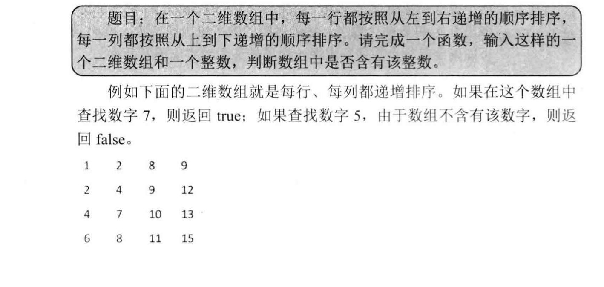

(PS：扫描[首页里面的二维码](README.md)进群，分享我自己在看的技术资料给大家，希望和大家一起学习进步！)

## 数组专题

### 剑指Offer部分

#### [题003 二维数组中的查找](#题003)

#### [题008旋转数组](#题008)

#### [题012调整数组顺序使奇数排在前面](#题012)

#### [题018顺时针打印矩形](#题018)

#### [题027数组中出现的次数超过一半的数字](#题027)

#### [题028最小的k个数](#题028)

#### [题029连续子数组的最大和](#题029)

#### [题030从1到n中出现的整数中1出现的次数](#题030)

#### [题031把数组排成最小的数](#题031)

#### [题032返回第N个丑数](#题032)

#### [题034 数组中的逆序对](#题034)

#### [题036 数字在排序数组中出现的次数](#题036)

#### [题039 数组中只出现一次的数组](#题039)

#### [题040 和为S的连续正数序列](#题040)

#### [题041 和为S的两个数字](#题041)

#### [题044 扑克牌顺子](#题044)

#### [题049 数组中重复的数字](#题049)

#### [题050 构建乘积数组](#题050)

#### [题062 数据流的中位数](#题062)

#### [题063 滑动窗口的最大值](#题063)

#### [题064 矩阵中的路径](#题064)

### 题003 二维数组中的查找

##### 题目内容：



在一个二维[数组](https://cuijiahua.com/blog/tag/数组/)中，每一行都按照从左到右递增的顺序排序，每一列都按照从上到下递增的顺序排序。请完成一个函数，输入这样的一个二维[数组](https://cuijiahua.com/blog/tag/数组/)和一个整数，判断数组中是否含有该整数。

如果在一个二维数组中找到数字7，则返回true，如果没有找到，则返回false。

##### 思路

就是从右上角开始遍历，假设要查找的数为A，当前遍历的数为B，B的特点是B所在行里面最大的数，也是B所在列最小的数，如果遍历的数B<A，那么B所在的行可以排除（比B都小)，如果遍历的数B>A，那么B所在的列可以排除(比B都大)。

##### 代码：

```java
 static boolean find(int target, int [][] array) {
  int rowLength = array.length;//总行数
  int colLength = array[0].length;//总列数

  int currentRow = 0;//起始遍历位置是右上角，行号为0
  int currentCol = colLength - 1;//起始遍历位置是右上角，列号为最大值
  while (currentRow <rowLength && currentCol >= 0) {//防止超出边界
    if (array[currentRow][currentCol] == target) {
      return true;
    } else if (array[currentRow][currentCol]  > target) {//比要找的数大，那么排除更大的数，也就是排除这一列
      currentCol--;
    } else {//比要找的数小，那么排除更小的数，也就是排除这一行
      currentRow++;
    }
  }
  return false;
}
```

##### 总结

注意这个currentRow <rowLength && currentCol >= 0判断条件，防止越界。

## 题008旋转数组

把一个数组最开始的若干个元素搬到数组的末尾，我们称之为数组的旋转。 输入一个非减排序的数组的一个旋转，输出旋转数组的最小元素。 例如数组{3,4,5,1,2}为{1,2,3,4,5}的一个旋转，该数组的最小值为1。 NOTE：给出的所有元素都大于0，若数组大小为0，请返回0。

##### 解题思路：

旋转数组其实就是一个递增的数组，整体移动了一下元素，类似3，4，5，1，2这种。要查找最小的元素，可以遍历一遍数组，复杂度为O(N)，这样就太暴力了，因为这个旋转数组其实是有规律的，可以根据左边界，右边界，中间值来判断最小值的位置

* 左边界<=中间值 说明左边界到中间值这一段是递增的，也就是最小值不处于这一段。这样可以排除掉这一段，然后去另一段里面遍历查找。

* 中间值<=右边界 说明中间值到右边界这一段是递增的，也就是最小值不处于这一段。这样可以排除掉这一段，然后去另一段里面查找。
  
  一直排除到最后，右边界下标-左边界下标==1时，说明左边界是最大值，右边界是最小值，此时整个循环结束。

* 特殊情况 左边界== 中间值==右边界 说明无法判断最小值位于哪里，只能从左边界到右边界进行遍历然后获得最小值。

```java
int minNumberInRotateArray(int[] array) {
        if (array[0]<array[array.length-1]){//当前就是一个递增的情况
            return array[0];
        }
        int start = 0;
        int end = array.length-1;
        int mid = 0;
        //循环都是以array[start] >= array[end]为基础的，一旦右边界值>左边界值，说明现在的顺序就是完全递增的，那么就返回左边界。
        while (array[start] >= array[end]) {
 System.out.println(start+"======"+mid+"====="+end);
            if (end-start == 1) {
                return array[end];
            }
            mid = (end + start)/2;
            if (array[start] == array[mid] && array[start] == array[end]) {//左边界，中间值，右边界相等
                int min = array[start];
                for (int i = start+1; i <=end ; i++) {
                    if (array[i]< min) {
                        min = array[i];
                    }
                }
                return min;
            }
            if ( array[mid]>=array[start]){
                start = mid;
            } else if(array[mid]<=array[end]) {
                end = mid;
            }
        }
        return array[mid];
    }
```

## 题012调整数组顺序使奇数排在前面

输入一个整数数组，实现一个函数来调整该数组中数字的顺序，使得所有的奇数位于数组的前半部分，所有的偶数位于数组的后半部分，并保证奇数和奇数，偶数和偶数之间的相对位置不变。

##### 使用额外的内存空间的解法

如果可以使用额外的内存空间，可以对数组遍历两遍，一遍将奇数取出，存放在额外的数组中去，一遍把剩下的偶数存放到额外的数组中去。

##### 类似冒泡排序的解法

如果不能使用额外的内存空间，就是查找到第一个奇数，然后与前面的偶数元素整体往后挪一位，将该奇数设置到前面第一个偶数的位置，有点像是冒泡排序,复杂度其实是O(n^2)。(由于本题需要保证奇数与奇数的顺序，偶数与偶数的顺序，所以需要使用这种类似于冒泡排序的算法，如果不保证顺序，找到奇数后就于第一个偶数交换位置就行，复杂度是O(N))

冒泡排序是其实是交换，从头开始，依次判断两个相邻的元素，将更大的元素向右交换，遍历一次后可以将当前序列最大的元素交换到最后面去，下次遍历就不用管最后一个元素。

```java
 public static void reOrderArray1(int [] array) {
        if (array==null || array.length==0) {
            return;
        }
        int saveIndex=0;//第一个偶数的位置，用于存后面找到的第一个奇数
        for (int i = 0; i < array.length; i++) {
            if (array[i]%2==1) {//找到奇数
                int temp = array[i];//将奇数保存
                //将奇数前面的数都往后挪
                for (int j = i; j >saveIndex; j--) {
                    array[j] = array[j-1];
                }
                array[saveIndex] = temp;
                saveIndex++;
            }
        }
    }
```

## 题018 顺时针打印矩形

输入一个矩阵，按照从外向里以顺时针的顺序依次打印出每一个数字，例如，如果输入如下4 X 4矩阵： 
1    2   3   4 
5    6   7   8 
9   10 11 12
13 14 15 16 
则依次打印出数字1,2,3,4,8,12,16,15,14,13,9,5,6,7,11,10.

就是将矩形外面一圈打印完，外面打印时可以分为四块，上面，右边，下面，左边。然后递归打印剩下的部分，当矩阵是正常情况下时，这么打印是没有问题，如果矩阵只有一个元素，只有一行，只有一列，这么打印就会有问题，所以我们将特殊情况单独列出来了。

```java
    public ArrayList<Integer> printMatrix2(int [][] matrix) {
        ArrayList<Integer> arrayList = new ArrayList<Integer>();
        printMatrix2(arrayList,matrix,0,matrix.length-1,0,matrix[0].length-1);
        return arrayList;
    }
    public ArrayList<Integer> printMatrix2(ArrayList<Integer> arrayList, int [][] matrix,int rowStart,int rowEnd,int colStart,int colEnd) {
        if (rowStart>rowEnd||colStart>colEnd) {
            return arrayList;
        }
        //我们采取的策略是按照左闭右开区间进行打印，也就是[rowStart,roWend)，对于每一边打印时，
        // 只包含左边界的值，不包含右边界的值
        // 比如二维矩阵为
        // 1 2 3
        // 4 5 6
        // 7 8 9
        // 打印顺序是先打印
        // 1，2
        //3,6
        //9,8
        //7,4
        //4
        //这种打印方法的缺点是只有一个元素，只有一行，只有一列时，打印就会有问题，所以我们将这些情况单独列出来。
        //特殊情况1 只有一个元素
        if (rowStart == rowEnd && colStart == colEnd) {
            arrayList.add(matrix[rowStart][colEnd]);
            return arrayList;
        }
        //特殊情况2 只有一列，
        if (colStart == colEnd) {
            for (int i = rowStart; i <=rowEnd ; i++) {
                arrayList.add(matrix[i][colStart]);
            }
            return arrayList;
        }
        //特殊情况2 只有一行
        if (rowStart == rowEnd) {
            for (int i = colStart; i <= colEnd; i++) {
                arrayList.add(matrix[rowStart][i]);
            }
            return arrayList;
        }
        //打印上边
        for (int i = colStart;i<colEnd;i++) {
            arrayList.add(matrix[rowStart][i]);
        }
        //打印右边
        for (int i = rowStart;i<rowEnd;i++) {
            arrayList.add(matrix[i][colEnd]);
        }
        //打印下边
        for (int i = colEnd;i>colStart;i--) {
            arrayList.add(matrix[rowEnd][i]);
        }
        //打印左边
        for (int i = rowEnd;i>rowStart;i--) {
            arrayList.add(matrix[i][colStart]);
        }
        printMatrix2(arrayList,matrix,rowStart+1,rowEnd-1,colStart+1,colEnd-1);
        return arrayList;
    }
```

##### 解法二：

```java
public ArrayList<Integer> printMatrix(int [][] matrix) {
                if(matrix==null) {
                        return null;
                }
        ArrayList<Integer> arrayList = new  ArrayList<Integer>();
        return printMatrix(arrayList, matrix, 0, matrix.length-1,0,matrix[0].length -1);
    }

    public ArrayList<Integer> printMatrix(ArrayList<Integer> arrayList, int [][] matrix,int rowStart, int rowEnd, int colStart, int colEnd) {
        if (rowStart> rowEnd || colStart>colEnd) {
            return arrayList;
        }
        for (int i = colStart; i <=colEnd;i++) {
            arrayList.add(matrix[rowStart][i]);
        }
        for (int i = rowStart+1; i <=rowEnd-1;i++) {
            arrayList.add(matrix[i][colEnd]);
        }
        for (int i = colEnd; i >=colStart&&rowEnd>rowStart;i--) {//要加rowEnd>rowStart判断，不然对于单行情况会重复打印
            arrayList.add(matrix[rowEnd][i]);
        }
        for (int i = rowEnd-1; i >=rowStart+1&& colStart < colEnd;i--) {//要加rowEnd>rowStart判断，不然对于单列情况会重复打印
            arrayList.add(matrix[i][colStart]);
        }
        printMatrix(arrayList, matrix,rowStart+1,rowEnd-1, colStart+1,colEnd-1);
        return arrayList;
    }
```

## 题027数组中出现的次数超过一半的数字

数组中有一个数字出现的次数超过数组长度的一半，请找出这个数字。例如输入一个长度为9的数组{1,2,3,2,2,2,5,4,2}。由于数字2在数组中出现了5次，超过数组长度的一半，因此输出 2 。如果不存在则输出 0 。

#### 解题思路：

##### 只适用于本题的特殊解法

就是一个数组，假设包含一个超过次数一半的元素，那么去除掉两个不相等的元素后，剩下的数组中，这个元素还是会出现次数超过一半。

（原理就是每次排除两个不相等的元素，最后剩下的一个元素，或者两个元素一定是次数超过一半的这个数字。）

```java
public int MoreThanHalfNum_Solution(int [] array) {
    if (array==null||array.length==0) {
        return 0;
    }
    if (array.length==1) {//只有一个元素，直接返回
        return array[0];
    }
    int result = array[0];
    int times = 1;
    for (int i = 1; i < array.length; i++) {
        if (times == 0) {
            times = 1;
            result = array[i];
        } else if (array[i] == result) {//相同就是times+1
            times++;
        } else {//不相同就将times-1，进行抵消
            times--;
        }
    }
    //下面就是判断这个数字是否满足条件，因为也有可能存在1，1，2，2，3这种数组，最后导致result是3，但是3其实不是超过一半的元素，所以需要重新遍历判断。
    int statTimes = 0;
    for (int i = 0; i < array.length; i++) {
      if (array[i] == result) {
        statTimes++;
      }
    }
    if (statTimes>array.length/2) {
      return result;
    }
    return 0;
}
```

##### 快排解法

另外一种思路就是假设该数组存在数量超过一半的元素A，并且数组排好序，那么元素A一定是数组的中位数，A的下标一定是n/2，所以此题可以转换为找出数组第n/2小的元素，找出元素A后，然后对数组进行遍历，判断A的出现次数是否超过了一半。但是这种解法的最坏时间复杂度是O(N^2);

```java
//[1,2,3,2,4,2,5,2,3]
    public int MoreThanHalfNum_Solution1(int[] array) {
        if (array==null||array.length==0) {
            return 0;
        }
        if (array.length==1) {
            return array[0];
        }
        int value = quickSort(array,0,array.length-1,array.length/2);
        int times = 0;
        for (int i = 0; i < array.length; i++) {
            if (array[i] == value) {
                times++;
            }
            if (times>array.length/2) {
                return value;
            }
        }
        return 0;
    }
    //寻找第K小的元素
    public int quickSort(int[] array,int start ,int end,int K) {
        if (start>=end) {
            return array[start];
        }
        int base = array[start];
        int i = start;
        int j = end;
        while (i<j) {
            while (array[j]>base&&j>i) {j--;}
            while (array[i]<=base&&i<j) {i++;}
            int temp = array[i];
            array[i] = array[j];
            array[j] = temp;
        }
        array[start] = array[i];
        array[i] = base;
        //当前分界元素array[i]是整个数组中第i小的
        if (i==K) { //第K小的元素
            return array[i];
        } else if (i>K) {//第K小的元素在左边
            return quickSort(array,start, i-1,K);
        } else {//第K小的元素在右边
            return quickSort(array,i+1,end,K);
        }
    }
```

## 题028最小的k个数

输入n个整数，找出其中最小的K个数。例如输入4,5,1,6,2,7,3,8这8个数字，则最小的4个数字是1,2,3,4。

##### 插入排序普通版

其实就是插入排序，只不过只是对k个数进行插入排序，复杂度O(N^2)

```java
public ArrayList<Integer> GetLeastNumbers_Solution(int [] input, int k) {
        ArrayList<Integer> arrayList = new ArrayList<Integer>();
        if(input==null || input.length==0 ||input.length<k || k == 0) {
            return null;
        }
        arrayList.add(input[0]);
        for (int i = 1; i < input.length; i++) {
            if (arrayList.size() < k) {//子数组个数没有达到K
                arrayList.add(input[i]);
            } else if (input[i] > arrayList.get(arrayList.size()-1)) {//子数组个数达到了K，并且当前数比子数组最后一个数大
                continue;
            } else if (input[i] < arrayList.get(arrayList.size()-1)) {
                arrayList.remove(arrayList.size()-1);
                arrayList.add(input[i]);
            }

            //将最后一个元素移动合适的位置
            for (int j = arrayList.size()-1; j > 0 ; j--) {
                if (arrayList.get(j) < arrayList.get(j-1)) {
                    int temp = arrayList.get(j);
                    arrayList.set(j, arrayList.get(j-1));
                    arrayList.set(j-1, temp);
                }
            }

        }
        return arrayList;
    }
```

##### 解法二  插入排序优化版（根据二分查找插入的位置）

时间复杂度N*log(N)

```java
public ArrayList<Integer> GetLeastNumbers_Solution1(int [] input, int k) {
    ArrayList<Integer> arrayList = new ArrayList<>();
    if (input==null||input.length<k||k==0) {
        return arrayList;
    }
    arrayList.add(input[0]);
    for (int i = 1; i < input.length; i++) {
        addNewElement(arrayList,input[i]);
        if (arrayList.size()>k) {
            arrayList.remove(arrayList.size()-1);
        }
    }
    return arrayList;
}
//使用二分查找插入的位置
void addNewElement(ArrayList<Integer> arrayList, int target) {
    if (target<=arrayList.get(0)) {
        arrayList.add(0,target);
    } else if (target>= arrayList.get(arrayList.size()-1)) {
        arrayList.add(target);
    } else {//使用二分查找，查找左边界，就是左边界右边的值就是>=target的
        int left = 0;
        int right = arrayList.size();
        while (left<right) {
            int middle = (left+right)/2;
            if (arrayList.get(middle) == target) {//因为是寻找左边界，所以得继续往左边找
                right = middle;
            } else if (arrayList.get(middle) < target) {
                //因为是寻找左边界，所以middle肯定不是需要的下标
                left = middle+1;
            } else if (arrayList.get(middle) > target)  {
                //因为是寻找左边界，此时middle可能是需要的下标
                 right = middle;
            }
        }
        arrayList.add(left,target);

    }
}
```

##### 解法三 堆排

```java
public ArrayList<Integer> GetLeastNumbers_Solution2(int [] input, int k) {
    ArrayList<Integer> arrayList = new ArrayList<>();
    if (input == null || input.length==0|| input.length<k ||k<=0 ) {
        return arrayList;
    }
    //首先取前K个元素建立大顶堆
    for (int i = k/2-1; i>=0 ; i--) {
        adjustHeap(input,i,k);
    }
    for (int i = k; i < input.length; i++) {
        if (input[i] < input[0]) {
            swap(input,0,i);
            adjustHeap(input,0,k);
        }
    }
    for (int i = k-1; i >=0; i--) {
        arrayList.add(input[i]);
    }
    return arrayList;
}
void adjustHeap(int[] input, int i ,int length) {
    while (2*i+1<length) {
        int left = 2*i+1;
        int right = 2*+2;
        if (right<length) {//右节点存在
            int maxIndex = input[right] > input[left] ? right:left;
            maxIndex = input[i] > input[maxIndex] ? i : maxIndex;
            if (maxIndex==i) {
                break;
            } else if (maxIndex == left) {
                swap(input, i, left);
                i = left;
            } else if (maxIndex == right) {
                swap(input, i, right);
                i = right;
            }
        } else {
            if (input[left] > input[i]) {
                swap(input,i,left);
                i = left;
            } else {
                break;
            }
        }
    }
}
void swap(int[] input, int i, int j) {
    int temp = input[i];
    input[i] = input[j];
    input[j] = temp;
}
```

##### 快排解法

平均时间复杂度是O(N)，最坏的时间复杂度是O(N^2)。

最坏的时间复杂度出现的情况是当数组是以排好序的数组，每次取的基准元素都比数组中其他元素小，这样就每次分割就只能分割出1个元素，每次分割时间复杂度为O(N)，需要分割K次，当K趋近与N时，复杂度就是O(N^2)。

```java
public ArrayList<Integer> GetLeastNumbers_Solution3(int[] input, int k) {
    ArrayList<Integer> arrayList = new ArrayList<Integer>();
    if (input==null||input.length<k||k<=0) {return  arrayList;}
    quickSort(input,0,input.length-1,k);
    for (int i = 0; i < k; i++) {
        arrayList.add(input[i]);
    }
    return arrayList;
}

void quickSort(int[] array, int start,int end,int K) {
    if (start>=end) {
        return;
    }
    int base = array[start];
    int i = start;
    int j = end;
    while (i<j) {
        while (array[j]>base&&j>i) {j--;}
        while (array[i] <= base &&j>i) {i++;}
        if (i<j) {
            int temp = array[j];
            array[j] = array[i];
            array[i] = temp;
        }
    }
    array[start] = array[i];
    array[i] = base;
    if (i == K-1) {
        return;
    } else if (i<K-1){
        quickSort(array,i+1,end,K);
    } else if (i>K-1) {
        quickSort(array,start,i-1,K);
    }
}
```

## 题029连续子数组的最大和

例如:{6,-3,-2,7,-15,1,2,2},连续子向量的最大和为8(从第0个开始,到第3个为止)。给一个数组，返回它的最大连续子序列的和(子向量的长度至少是1)

##### 解法一

```java
    public int FindGreatestSumOfSubArray(int[] array) {
        if(array==null || array.length==0) {
            return 0;
        }
        int max=array[0];//最大的连续子数组和
        int currentSum = array[0];//前面的节点当前的累计值
        for (int i = 1; i < array.length; i++) {
            if (currentSum<0) {//累计值<0,直接丢掉
                currentSum = array[i];
            } else {//累计值>0,不管现在的值是否为正数，都需要累加，不然就断了
                currentSum = currentSum + array[i];
            }
            //超过最大值，保存到max
            max = currentSum>max ? currentSum : max;
        }
        return max;
    }
```

##### 动态规划的解法

使用动态规划的方法来进行思考

f(n) 有两种取值

* 当f(n-1)<=0时，取array[n]

* 当f(n-1)>0时，取f(n-1)+array[n]

  所以可以使用动态规划来解这道题。

## 题030从1到n中出现的整数中1出现的次数

求出1~13的整数中 1 出现的次数,并算出 100~1300 的整数中1出现的次数？为此他特别数了一下 1~13 中包含1的数字有 1、10、11、12、13 因此共出现 6 次,但是对于后面问题他就没辙了。ACMer 希望你们帮帮他,并把问题更加普遍化,可以很快的求出任意非负整数区间中1出现的次数（从1 到 n 中1出现的次数）。

##### 解法一

就是对1到n进行遍历，对每个数统计该数1出现的次数，统计时用这个数x%10，判断个位数是否为1，然后用x=x/10的结果继续%10来进行判断个位数为1，一直到x=0，统计到x包含1的个数，这样的话，一共有N个数，每个数计算的时间复杂度log10 N，总时间复杂度是N*log10 (N)也就是Nlog(N)

```java
public int NumberOf1Between1AndN_Solution2(int n) {
    if (n<=0) {return 0;}
    int count = 0;
    for (int i = 1; i < n; i++) {
        while (i>0) {
            if (i%10==1) {
                count++;
            }
            i=i/10;
        }
    }
    return 0;
}
```

##### 解法二

还是对1到n进行遍历，对每个数统计该数1出现的次数，将每个数转换为字符串，判断字符串包含字符"1"的个数，但是将数字转换为字符串的这个过程，由于使用了StringBuffer的append()方法，然后使用了Integer的getChars方法，复杂度还是Log100 (N)，所以总复杂度还是Nlog(N)。

##### 解法三

这种解法就是自己去找数学规律了

```java
public int NumberOf1Between1AndN_Solution(int n) {
    int count = 0;
    for (int i = 1; i <= n; i *= 10) {
        int a = n / i,b = n % i;
        //之所以补8，是因为当百位为0，则a/10==(a+8)/10，
        //当百位>=2，补8会产生进位位，效果等同于(a/10+1)
        count += (a + 8) / 10 * i + ((a % 10 == 1) ? b + 1 : 0);
    }
    return count;
}
```

## 题031把数组排成最小的数

输入一个正整数数组，把数组里所有数字拼接起来排成一个数，打印能拼接出的所有数字中最小的一个。例如输入数组{3，32，321}，则打印出这三个数字能排成的最小数字为321323。

##### 解题思路

本题其实就是对数组中的元素进行排序，只不过元素之间比较的不是值大小，而是字典序的大小，是以AB和BA的大小来决定的，所以对A和B进行拼接成，AB和BA，通过字符串比较，判断AB和BA的大小，AB>BA。这里主体主要使用冒泡排序

```java
public String PrintMinNumber(int [] numbers) {
    if(numbers.length==1) {
        return new StringBuffer().append(numbers[0]).toString();
    }
    StringBuffer stringBuffer = new StringBuffer();
    for (int i = numbers.length; i > 0; i--) {
        for (int j = 1; j < i ; j++) {
            if (compare(numbers[j-1], numbers[j])) {//numbers[j]更大，需要交换到后面去
                int temp = numbers[j];
                numbers[j] = numbers[j-1];
                numbers[j-1] = temp;
            }
        }
    }
    for (int i = 0; i < numbers.length; i++) {
        stringBuffer.append(numbers[i]);
    }
    return stringBuffer.toString();
}
//判断a和b的字典序的大小的秘诀是，拼接两个字符串ab，ba，判断两个字符串，前面的字符大小
public Boolean compare(int a, int b) {
    String first = new StringBuffer().append(a).append(b).toString();
    String second = new StringBuffer().append(b).append(a).toString();
    for (int i = 0; i < first.length(); i++) {
        Character char1 = first.charAt(i);
        Character char2 = second.charAt(i);
        if (char1.equals(char2)) {
            continue;
        } else if (char1 > char2) {
            return true;
        } else {
            return false;
        }
    }
    return true;
}
```

## 题032返回第N个丑数

把只包含质因子2、3和5的数称作丑数。例如6、8都是丑数，但14不是，因为它包含质因子7。 习惯上我们把1当做是第一个丑数。求按从小到大的顺序的第N个丑数。

第一个丑数是1，除了1以外，其他丑数都是2，3，5之间相乘得到的，也就是丑数的因子都是2，3，5，

第一种解决方案就是从1开始对所有整数遍历，将每个数一直除以2，3，5，看能否除尽，能除尽代表是丑数，一直得到第N个丑数。

第二种解决方案就是用一个数组来存丑数，将2，3，5当前对应的最小丑数乘以2，3，5，取最小值，作为最新的丑数，一直计算到第N个丑数。

使用index2，index3，index5记录上一次乘了2，3，5的数的最小值

```java
public int GetUglyNumber_Solution(int index) {
    if (index == 0) return 0;
    int[] array = new int[index];
    array[0] = 1;//最小的丑数是1
    int index2 =0 ,index3 = 0, index5 = 0;//分别代表上一次乘了2，3，5的index
    for (int i = 1; i< index;i++){
        int temp2 = array[index2]*2;
        int temp3 = array[index3]*3;
        int temp5 = array[index5]*5;
        int minTemp = temp2 < temp3 ? temp2 : temp3;
        minTemp = minTemp < temp5 ? minTemp : temp5;
        if (temp2 == minTemp) {
            index2++;
        }
        if (temp3 == minTemp) {
            //可能存在一个丑数可以由多种丑数相乘得到，
            // 例如6可以是2*2*2，也可以是2*3，所以这里的三个if需要分开判断赋值
            index3++;
        }
        if (temp5 == minTemp) {
            index5++;
        }
        array[i] = minTemp;
    }
    return array[index-1];
}
```


## 题034 数组中的逆序对

在数组中的两个数字，如果前面一个数字大于后面的数字，则这两个数字组成一个逆序对。输入一个数组,求出这个数组中的逆序对的总数P。并将P对1000000007取模的结果输出。 即输出P%1000000007

输入描述: 题目保证输入的数组中没有的相同的数字

数据范围：

    对于%50的数据,size<=10^4
    
    对于%75的数据,size<=10^5
    
    对于%100的数据,size<=2*10^5

逆序对就是前面的数比后面的数大，就是一个逆序对，可以使用归并排序，每次组合并时，右边的组的数比左边的数小时，会出现逆序对，逆序对的个数为左边的组的数组元素个数。

举例：假设数组是[9，8 ，5，4 ，11，7，6，23]

分成四组，分别是

A组9，8

B组5，4

C组 11，7

D组6，23

那么对于5来说，它的逆序对其实是等于9在B组内的逆序对，5大于5，也就是1，然后是5对于A组，C组和D组的逆序对，所以可以进行归并排序来进行分组，然后进行数组归并，每次合并时，右边的组的数比左边的数小时，会出现逆序对，逆序对的个数为左边的组的数组元素个数。

```java
public int InversePairs(int [] array) {
        if (array==null||array.length==0) {return 0;}
        int[] tempArray = new int[array.length];
        return mergeSort(array,0,array.length-1,tempArray);
    }

    int mergeSort(int[] array,int start,int end,int[] tempArray) {
        int count = 0;
        if (start>=end) {
            return 0;
        }
        int middle = start + (end - start)/2;
        //对左半部分，右半部分进行分组，然后进行合并
        count += mergeSort(array,start,middle,tempArray);
        count += mergeSort(array,middle+1,end,tempArray);
        //进行合并
        int i = start;
        int j = middle+1;
        int currentIndex = start;
        while (i<=middle&&j<=end) {
            if (array[j]<array[i]) {//右边数组比左边数组的数要小，可以形成逆序对
                count += middle - i + 1;
                count=count>1000000007?count%1000000007:count;
                tempArray[currentIndex++] = array[j++];
            } else {
                tempArray[currentIndex++] = array[i++];
            }
        }
        while (i<=middle) {
            tempArray[currentIndex++] = array[i++];
        }
        while (j<=end) {
            tempArray[currentIndex++] = array[j++];
        }
        //将临时数组的值拷贝到原数组
        for (int k = start; k <= end; k++) {
            array[k] = tempArray[k];
        }
        return count;
    }
```

## 题036 数字在排序数组中出现的次数

统计一个数字在排序数组中出现的次数。

正常的二分查找是这样的，找不到时就会返回-1,所以此题可以计算K+0.5应该插入的位置减去 K-0.5应该插入的位置，就得到K的个数了

```java
   public int GetNumberOfK1(int [] array , int k) {
        if (array==null||array.length==0) {
            return 0;
        }
        return left_bound(array,k+0.5) - left_bound(array,k-0.5);
    }
//查找左边界，也就是>=taeget的元素的最小下标
    int left_bound(int[] array, double target) {
        if (array==null||array.length == 0) return -1;
        int left = 0;
        int right = array.length-1; // 注意
        while (left<=right) {
            int middle = left + (right -left)/2;
            if (array[middle] == target) {
                right = middle-1;
            } else if(array[middle] < target) {
                left = middle+1;
            } else if(array[middle]>target) {
                right = middle-1;
            }
        }
//        if (left>=array.length) {
//            return -1;
//        }
        return left;
    }
```

## 题039 数组中只出现一次的数

一个整型数组里除了两个数字之外，其他的数字都出现了两次。请写程序找出这两个只出现一次的数字。

数组中有两个数字只出现了一次，其他数字都出现了两次，

因为A异或A的结果是0，所以对数组遍历异或后的结果result，出现两次的数字异或结果为0， 所以result其实是两个只出现一次的数字B和C的异或结果，并且因为B，C不相等，所以result肯定也不等于0，result肯定有一位是1，在这一位上，肯定B，C中一个为1，一个为0，所以可以根据这一位将数组分成两个子数组，这样每个子数组只会包含一些出现过两次的数字和B，C中的一个，所以对两个子数组异或只会的结果就可以得到B和C。

```java

    public void FindNumsAppearOnce2(int [] array,int num1[] , int num2[]) {
        if (array == null || array.length<=1) {
            return;
        }
        int result = 0;
        for (int i = 0; i < array.length; i++) {
            //由于相同的数异或后会变成0，result其实是只出现一次的元素a和元素b的异或结果a^b
            result = result ^ array[i];
        }
        //bit通过跟a，b的异或结果result进行&元素，得到a,b不相同的第一个位置bit位
        int bit = 1;
        while (bit<=result) {
            if ((result&bit) > 0) {
                break;
            } else{
                bit = bit<<1;
            }
        }
        int a=0;
        int b=0;
      //在bit位进行分组，bit位为1的为一组，一起异或，bit位为0的为一组，一起异或，其中a，b肯定是在不同组
        for (int i = 0; i < array.length; i++) {
            if ((array[i]&bit)==0) {
                a = a^array[i];
            } else {
                b = b^array[i];
            }
        }
        num1[0] = a;
        num2[0] = b;
    }

```

## 题040 和为S的连续正数序列

输出所有和为S的连续正数序列。序列内按照从小至大的顺序，序列间按照开始数字从小到大的顺序。

##### 滑动窗口解法

就是使用滑动窗口来实现，当两个下标相差1时，计算的和还比sum大，这个时候会进行low++，会使得low==high，跳出循环，例如sum是100，那么在low=high=51时跳出循环

```java
public ArrayList<ArrayList<Integer>> FindContinuousSequence(int sum) {
    ArrayList arrayList = new ArrayList<ArrayList<Integer>>();
    int low=1,high=2;
    while (low<high) {
        int currentSum = (low+high)*(high-low+1)/2;//除以2的操作放在后面，否则在前面除时，(low+high)/2除不尽会丢掉1，比如3/2*2会丢掉1。
        if (currentSum==sum) {
            ArrayList tempArrayList = new ArrayList<Integer>();
            for (int k =low;k<=high;k++) {
                tempArrayList.add(k);
            }
            arrayList.add(tempArrayList);
            low++;
        } else if (currentSum<sum) {
            high++;
        } else {
            low++;
        }
    }
    return arrayList;
}
```

##### 数学规律解法

就是连续整数序列和sum=(i+k)(k-i+1)/2，代表整数i到整数k的连续整数序列。假设x为i到k的长度，x = k-i+1，n=i+k，那么sum = x*m，

1.m在什么时候取最大值呢？

当序列是从1开始累加时，也就是i是1时，长度x可以取到最大值，此时由于i为1，sum = (1+k)(k-1+1)/2=k(k+1)/2,  长度x为k+1，sum = (x-1)x/2，m的数量级其实是小于根号sum的

2.连续正整数和sum为奇数和sum为偶数时的区别？

- 对于sum为奇数的情况, 设其长度为 x, 序列中间值为 m, 那么 N 一定为 m*x, 例如 15=1+2+3+4+5=3*5，此时也就是sum可以整除掉x

- 对于sum为偶数的情况, 设其长度为 x, 两个中间值为 m 和 m+1, 那么 N 一定为(m+0.5)*x, 例如 10=1+2+3+4=2.5*4，此时sum不能整除掉x，余数应该是0.5。

具体步骤如下:
1.按照长度 x 从 1 开始遍历, 最大长度要小于 sqrt(2*N)

2.因为假设长度为 x, 从 1 开始的连续整数之和为 x*(x+1)/2, 这是最小的和了, 它要<=N, 那么 x 就要小于 sqrt(2N), 那 x<=int(sqrt(2N))


## 题041 和为S的两个数字

输入一个递增排序的数组和一个数字S，在数组中查找两个数，使得他们的和正好是S，如果有多对数字的和等于S，输出两个数的乘积最小的。

[1,2,4,7,11,15]  15

##### 解题思路：

还是滑动窗口，将两个指针指向数组的首尾两端，一直循环，如果currentSum偏小，左边指针向右移动，如果currentSum偏大，右边指针向左移动，如果currentSum满足要求，直接结束循环。

如果是寻找和为S的连续正数序列，那么也是滑动窗口，不过是滑动窗口的两端都是从数组起始位置开始。

```java
  public ArrayList<Integer> FindNumbersWithSum(int [] array, int sum) {
        ArrayList<Integer> arrayList = new ArrayList<Integer>();
        int low = 0;
        int high = array.length-1;

        while (low<high) {
            int currentSum = array[low]+array[high];
            if (currentSum == sum) {
                if (array[low]*array[high] < temp) {
                    arrayList.add(array[low]);
                    arrayList.add(array[high]);
                    break;
                }
            } else if (currentSum<sum) {
                low++;
            } else {
                high--;
            }
        }
        return arrayList;
    }
```

## 题044 扑克牌顺子

LL今天心情特别好,因为他去买了一副扑克牌,发现里面居然有 2 个大王, 2 个小王(一副牌原本是 54 张)…他随机从中抽出了 5 张牌,想测测自己的手气,看看能不能抽到顺子,如果抽到的话,他决定去买体育彩票,嘿嘿！！“红心A,黑桃3,小王,大王,方片5”,“Oh My God!”不是顺子…..LL不高兴了,他想了想,决定大\小 王可以看成任何数字,并且A看作1,J为11,Q为12,K为13。上面的5张牌就可以变成“1,2,3,4,5”(大小王分别看作2和4),“So Lucky!”。LL决定去买体育彩票啦。 现在,要求你使用这幅牌模拟上面的过程,然后告诉我们 LL 的运气如何， 如果牌能组成顺子就输出 true，否则就输出 false。为了方便起见,你可以认为大小王是0。

解题思路：

就是判断抓的牌是不是顺子，就先用快排对数组排序，然后对数组遍历，记录大小王的个数（也就是元素为0），记录当前元素减去上一个元素的差值，差值为0，不能构成顺子，差值为1说明是连续的，差值不为1，是不连续的，记录差值，最后看总差值和大小王的个数来进行比较。

```java
public static boolean isContinuous(int [] numbers) {
        if (numbers == null || numbers.length == 0) return false;
        qsort(numbers,0,numbers.length-1);
        int count = 0;
        int needKing = 0;
        for (int i = 0; i < numbers.length; i++) {
            if (numbers[i]==0) {
                count++;
            }
            if (i>=1 && numbers[i]!=0&&numbers[i-1]!=0) {
                if (numbers[i] == numbers[i-1]) {
                    return false;
                }
                needKing += numbers[i] - numbers[i-1]-1;
            }
        }
        if (needKing>count) {
            return false;
        }
     return true;
}

//快排写法
public static void qsort(int[] array, int start ,int end) {
    if (start>=end) {return;}
    int threhold = array[start];//阀值
    int i        = start;
    int j        = end;
    while (i < j) {
        while (array[j] >= threhold && i < j) j--;//从右端找的应该需要写在前面
        while (array[i] <= threhold && i < j) i++;
        int temp = array[i];
        array[i] = array[j];
        array[j] = temp;
    }
    //将现在最中间的数与最左端的数（也就是阀值）交换
    array[start] = array[i];
    array[i] = threhold;
    qsort(array, start, i - 1);
    qsort(array, i + 1, end);

}
```

## 题049 数组中重复的数字

在一个长度为n的数组里的所有数字都在0到 n-1 的范围内。 数组中某些数字是重复的，但不知道有几个数字是重复的。也不知道每个数字重复几次。请找出数组中任意一个重复的数字。 例如，如果输入长度为7的数组{2,3,1,0,2,5,3}，那么对应的输出是第一个重复的数字2。

解法一就是在遍历时将每个元素添加到hashSet，通过判断hashset中是否包含当前元素，来判断是否重复，由于这个长度为n数组中元素的取值范围是0-n-1，所以可以使用一个长度为n的数组array来代替hashSet记录元素是否出现，例如x出现了，将数组array[x]设置为1。

解法二就是将当前数组作为标记数组，每次遍历到下标为i的元素时，将array[array[i]]与当前元素交换，并且将array[array[i]]设置为-1，代表已经这个元素是重复元素，然后i- -，继续遍历交换后的这个元素。

```java
public boolean duplicate(int numbers[],int length,int [] duplication) {
    if (numbers == null || numbers.length==0) {
        return false;
    }
    for (int i=0;i<numbers.length;i++) {
        int current = numbers[i];
        if (current == -1) {//当前存储的值为-1，说明这个下标之前出现过，但是不重复
            continue;
        }else if (numbers[current] == -1) {//说明有重复的了
            duplication[0] = current;
            return true;
        } else if (current == i) {//等于当前下标，直接标识为-1
            numbers[i]= -1;
        } else {//不等于当前下标，进行交换后，然后标识为-1
            int temp = numbers[current];
            numbers[current] = -1;
            numbers[i] = temp;
            i--;
        }
    }
    return false;
}
```

## 题050 构建乘积数组

##### 题目描述

给定一个数组A[0,1,...,n-1],请构建一个数组B[0,1,...,n-1],其中B中的元素B[i]=A[0]*A[1]*...*A[i-1]*A[i+1]*...*A[n-1]。不能使用除法。（注意：规定B[0] = A[1] * A[2] * ... * A[n-1]，B[n-1] = A[0] * A[1] * ... * A[n-2];）

对于A长度为1的情况，B无意义，故而无法构建，因此该情况不会存在。

```java
//就是B[i] = A[0]A[1]...A[i-1]  A[i+1]...*A[n-1]，通过拆分成两部分，
//C[i] = A[0]A[1]...A[i-1]
//D[i] = A[i+1]...*A[n-1]
//B[i]=C[n]*D[n]来解决。
public int[] multiply(int[] A) {
    int[] b = new int[A.length];
    int[] c = new int[A.length];
    int[] d = new int[A.length];
    c[0] = 1;
    int result1 = c[0];
    for (int i = 1; i < c.length; i++) {
        result1 = result1 * A[i-1];
        c[i] = result1;
    }
    d[d.length-1] = 1;
    int result2 = 1;
    for (int i = d.length-2; i >=0; i--) {
        result2 = result2 * A[i+1];
        d[i] = result2;
    }
    for (int i = 0; i < b.length; i++) {
        b[i] = c[i]*d[i];
    }
    return b;
}
```

## 题062 数据流的中位数

如何得到一个数据流中的中位数？如果从数据流中读出奇数个数值，那么中位数就是所有数值排序之后位于中间的数值。如果从数据流中读出偶数个数值，那么中位数就是所有数值排序之后中间两个数的平均值。我们使用 `Insert()` 方法读取数据流，使用 `GetMedian()` 方法获取当前读取数据的中位数。

可以使用插入排序来实现，就是每次插入元素，将元素与排好序的元素逐一比较，插入已排序后的数组，返回中位数时直接根据下标来获取

```java
  ArrayList<Integer> arrayList = new ArrayList<Integer>();

    public void Insert(Integer num) {
        if (arrayList.size()==0) {
            arrayList.add(num);
        } else {
            for (int i = arrayList.size()-1; i >=0 ; i--) {
                if (arrayList.get(i)<num) {
                    arrayList.add(i+1,num);//需要注意的是ArrayList.add(index)方法是将元素插在index下标下，而当前arrayList.get(i)是小于num的，所以当前元素插在i+1下标下
                    break;
                } else if (arrayList.get(i)>=num && i==0) {//插入的元素比数组中所有元素都小的情况
                    arrayList.add(0,num);
                }
            }
        }
    }

    public Double GetMedian() {
        if (arrayList.size()%2==1) {
            return  arrayList.get(arrayList.size()/2).doubleValue() ;
        } else {
            return (arrayList.get(arrayList.size()/2-1).doubleValue() + arrayList.get(arrayList.size()/2).doubleValue())/2;
        }
    }
```

## 题063 滑动窗口的最大值

给定一个数组和滑动窗口的大小，找出所有滑动窗口里数值的最大值。例如，如果输入数组`{2,3,4,2,6,2,5,1}`及滑动窗口的大小3，那么一共存在6个滑动窗口，他们的最大值分别为`{4,4,6,6,6,5}`； 针对数组{2,3,4,2,6,2,5,1}的滑动窗口有以下6个： `{[2,3,4],2,6,2,5,1}， {2,[3,4,2],6,2,5,1}， {2,3,[4,2,6],2,5,1}， {2,3,4,[2,6,2],5,1}， {2,3,4,2,[6,2,5],1}， {2,3,4,2,6,[2,5,1]}`。

解题思路

思想主要是插入排序的思想，就是遍历数组，每次往双端队列后面插入元素，并且可以把比队尾比当前元素小的数都移除掉。插入到特定位置，队列是按顺序排序的，如果队头元素的下标超出了滑动窗口，就可以把它移除，一直到队头元素没有过期，这样就是这个此时的最大元素了。

其实插入排序的复杂度是O(N^2)，因为需要对N个元素插入到排序好的序列，而每次插入的复杂度都是N，本题由于从队列尾部进行插入会将那些比较小的数移除掉，所以每次插入的时间复杂度是一个常数，总时间复杂度是O(N)，

具体步骤：

##### 添加初始元素

1.遍历数组中的每个元素，如果队列为空，直接添加元素(考虑到有时候窗口大小是1和数组长度也是1，所以此时不能调用continue结束本次循环)

##### 移除队尾比当前值小的元素

2.将当前元素num[i]从队列尾部进行插入，将那些比num[i]小的元素移除掉，因为num[i]的下标比它们大，值也比它们大，它们不可能成为最大值了

##### 添加当前值到队列尾部

3.比当前值小的数都从队尾移除完之后，再将当前值添加到队列尾部

##### 移除队首过期元素，添加当前窗口最大值到数组

4.计算滑动窗口左下标windowLeft，对队列头部元素下标进行判断，如果小于窗口左下标，说明过期了，需要移除，判断windowLeft是否>=0，满足说明才到计算滑动窗口最大值的时机，才会添加当前队列最大值到数组。

```java
public ArrayList<Integer> maxInWindows2(int[] num, int size) {
        ArrayList<Integer> arrayList = new ArrayList<>();
        if (num==null||num.length==0||num.length<size || size <=0) {
            return arrayList;
        }
        LinkedList<Integer> queue = new LinkedList<Integer>();
        for (int i = 0; i < num.length; i++) {
            int currentValue = num[i];
            if (queue.size()==0) {//1.添加第一个元素
                queue.add(i);
            }
            //2.当前元素比队尾元素大，移除队尾元素
            while (queue.size() > 0 &&currentValue >= num[queue.getLast()]) {
                queue.removeLast();
            }
            queue.add(i);
            int windowLeft = i - size + 1;//滑动窗口最左边的下标
            //3.顶部移除过期队列头部元素
            if (windowLeft>queue.getFirst()) {
                queue.removeFirst();
            }
            if (windowLeft>=0) {//进入第一个滑动窗口
                arrayList.add(num[queue.getFirst()]);
            }
        }
        return arrayList;
    }
```

## 题064 矩阵中的路径

请设计一个函数，用来判断在一个矩阵中是否存在一条包含某字符串所有字符的路径。路径可以从矩阵中的任意一个格子开始，每一步可以在矩阵中向左，向右，向上，向下移动一个格子。如果一条路径经过了矩阵中的某一个格子，则之后不能再次进入这个格子。 例如 `a b c e s f c s a d e e` 这样的 `3 X 4` 矩阵中包含一条字符串`"bcced"`的路径，但是矩阵中不包含`"abcb"`路径，因为字符串的第一个字符b占据了矩阵中的第一行第二个格子之后，路径不能再次进入该格子。

判断一个字符串在字符矩阵中是否一条符号条件的路径

就是递归去判断就行了。

```java
public boolean hasPath(char[] matrix, int rows, int cols, char[] str)
{
    boolean[] flag = new boolean[matrix.length];
    for (int i = 0; i < rows; i++) {
        for (int j = 0; j < cols; j++) {
            if (matrix[i*cols + j] == str[0]) {
                if (judge(matrix,rows,cols,i, j, str, 0, flag)) {
                    return true;
                }
            }
        }
    }
    return false;
}

//flag 标识这个节点是否已经在路径中了


boolean judge(char[] matrix, int rows, int cols, int i, int j, char[] str, int charIndex,boolean[] flag) {


    int index =  i*cols + j;
    if (i<0 || j<0 || i>=rows || j>=cols || matrix[index] != str[charIndex] || flag[index] == true) {
        return false;
    }
    if (charIndex==str.length-1) { return true;}

    flag[index]=true;
    if (judge(matrix,rows,cols,i+1, j, str, charIndex+1, flag)
            ||judge(matrix,rows,cols,i-1, j, str, charIndex+1, flag)
            ||judge(matrix,rows,cols,i, j+1, str, charIndex+1, flag)
            ||judge(matrix,rows,cols,i, j-1, str, charIndex+1, flag)) {
        return true;
    }

    flag[index]=false;
    return false;
}
```
