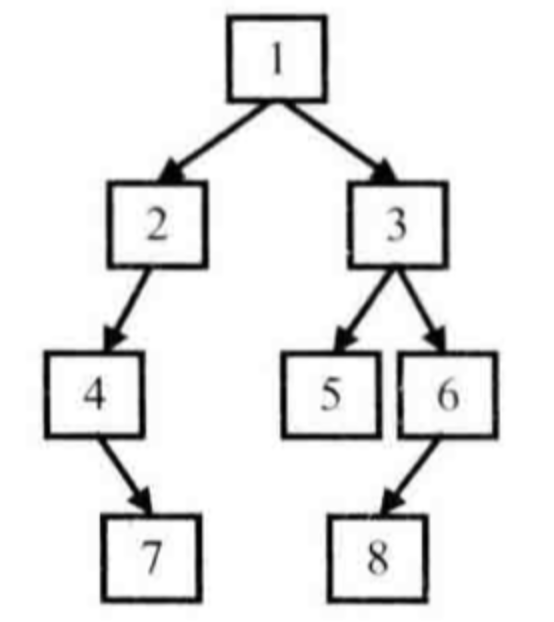
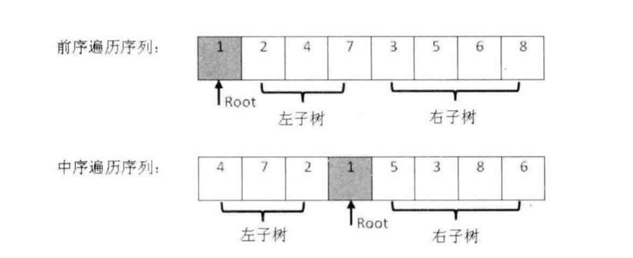
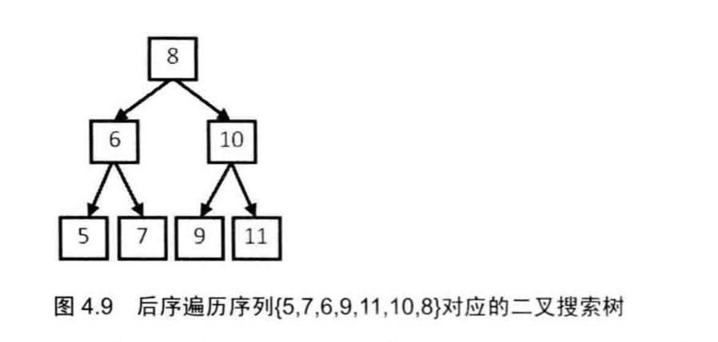

(PS：扫描[首页里面的二维码](README.md)进群，分享我自己在看的技术资料给大家，希望和大家一起学习进步！)

## 二叉树专题
### 剑指Offer部分
#### [题006重建二叉树](#题006)
#### [题016判断一个二叉树是否是另一个二叉树的子结构](#题016)
#### [题017二叉树的镜像](#题017)
#### [题021 从上往下打印二叉树](#题021)
#### [题022 判断是否是二叉搜索树的后序遍历](#题022)

#### [题023 二叉树中和为某一值的路径](#题023)
#### [题025 二叉搜索树与双向链表](#题025)

#### [题037 二叉树的深度](#题037)
#### [题038 判断是否是平衡二叉树](#题038)
#### [题056 二叉树的下一个节点](#题056)
#### [题057 对称的二叉树](#题057)
#### [题058 按之字形顺序打印二叉树](#题058)

#### [题059 把二叉树打印成多行](#题059)
#### [题060序列化二叉树](#题060)
#### [题061 二叉搜索树的第K小的节点](#题061)

## 题006重建二叉树

输入某二叉树的前序遍历和中序遍历的结果，请重建出该二叉树。假设输入的前序遍历和中序遍历的结果中都不含重复的数字。例如输入前序遍历序列{1,2,4,7,3,5,6,8}和中序遍历序列{4,7,2,1,5,3,8,6}，则重建二叉树并返回。



前序遍历结果和中序遍历结果：



前序遍历结果分布是二叉树根节点，左子树，右子树。

中序遍历结果分布是左子树，二叉树根节点，右子树。

所以根据前序遍历结果的第一个元素获取到根节点，然后根据根节点把中序遍历结果分为两半，得到左子树的中序遍历结果，然后根据左子树的长度可以去前序遍历结果中分离出左子树的前序遍历结果，右子树也是如此，所以可以递归得构造出整个二叉树。

```java
 public static TreeNode reConstructBinaryTree(int[] pre, int[] in) {
        return reConstructBinaryTree(pre, 0, pre.length-1, in, 0, in.length-1);
    }

    public static TreeNode reConstructBinaryTree(int[] pre, int preStart, int preEnd, int[] in, int inStart, int inEnd) {
        if (preStart > preEnd || inStart > inEnd) {
            return null;
        }
        TreeNode treeNode = new TreeNode(pre[preStart]);
        for (int i = inStart; i <= inEnd; i++) {
            if (in[i] == pre[preStart]) {
                int leftLength = i - inStart;//左子树长度
                treeNode.left = reConstructBinaryTree(pre, preStart + 1, preStart+leftLength, in, inStart, i-1);
                treeNode.right = reConstructBinaryTree(pre, preStart +leftLength+1, preEnd, in, i+1, inEnd);
            }
        }
        return treeNode;
    }
```

## 题016 判断一个二叉树是否是另一个二叉树的子结构

输入两棵二叉树A，B，判断B是不是A的子结构。（ps：我们约定空树不是任意一个树的子结构）

有一个root为空，就返回false，然后判断根节点是否相等，

* 相等，那么对根节点进行递归，判断子树根节点是否为NULL，是返回true，判断父树根节点是否为NULL，是返回false，然后对左右节点进行判断
* 不相等，直接对左子树递归调用判断，是false，继续对右子树进行判断。

```java
//判断当前root2是否是root1及其子树的子结构
public boolean HasSubtree(TreeNode root1,TreeNode root2) {
    boolean result = false;
    if (root1 != null && root2 != null) {	
        if (root1.val == root2.val) {
            result = judgeTheTree(root1, root2);
          //如果在这里就直接return result就会跳过对后面左右子树的判断
        }
        if (result == false) {
            result = HasSubtree(root1.left, root2) || HasSubtree(root1.right, root2);
        }
    }
    return result;
}
//判断
boolean judgeTheTree(TreeNode root1, TreeNode root2) {
    if (root2 == null) {return true;}
    if (root1 == null) {return false;}
    if (root1.val == root2.val) {
        return judgeTheTree(root1.left, root2.left) && judgeTheTree(root1.right, root2.right);
    }
    return false;
}
```


## 题017 二叉树的镜像

操作给定的二叉树，将其变换为源二叉树的镜像。

就是翻转二叉树，将二叉树的左右子树进行交换。

```java
public void Mirror(TreeNode root) {
    if (root != null) {
        TreeNode tempNode = root.left;
        root.left = root.right;
        root.right = tempNode;
        Mirror(root.left);
        Mirror(root.right);
    }
}
```

## 题021 从上往下打印二叉树

从上往下打印出二叉树的每个节点，同层节点从左至右打印。

##### 宽度优先遍历

其实就是二叉树的宽度优先遍历，一般就是通过队列来实现，将根节点添加到队列中，然后对队列进行循环，每次从队列取出一个元素，添加到ArrayList中去，然后将左，右子节点添加到队列中去，然后继续循环，一直到队列中取不到元素。(Java中可以使用LinkedList的add(),remove()方法来实现队列。

```java
public ArrayList<Integer> PrintFromTopToBottom(TreeNode root) {
        ArrayList<Integer> arrayList = new ArrayList<Integer>();
        if (root==null) {
            return arrayList;
        }
  //这里用LinkedList比较好，因为它的底层是基于链表实现的，在队列取出队头元素时，不后面的元素不需要前移。
        LinkedList<TreeNode> queue = new LinkedList<TreeNode>();
        queue.add(root);
        while (queue.size()>0) {
            TreeNode treeNode = queue.remove(0);
            arrayList.add(treeNode.val);
            if (treeNode.left!=null) queue.add(treeNode.left);
            if (treeNode.right!=null) queue.add(treeNode.right);
        }
        return arrayList;
}
```

##### 深度优先遍历

一般是使用栈来实现，一开始将

1.根节点加入栈，

2.将栈顶元素出栈，打印这个节点，然后将它的右子节点入栈，将其左节点入栈

3.重复2操作，一直到栈中元素为空。

也可以使用递归实现

```java
//使用递归实现深度遍历
ArrayList<TreeNode> list = new ArrayList<TreeNode>();
void deepTranverse(TreeNode node) {
			if(node!=null) {
			    list.add(node);
					deepTranverse(node.left);
          deepTranverse(node.right);
			}
}
//使用栈的实现深度遍历
void deepTranverse(TreeNode node) {
     Stack<TreeNode> stack=new Stack<TreeNode>();
     List<Integer> list=new ArrayList<Integer>();
     if(root==null)
            return list;
     //压入根节点
        stack.push(root);
    //然后就循环取出和压入节点，直到栈为空，结束循环
        while (!stack.isEmpty()){
            TreeNode t=stack.pop();
            if(t.right!=null)
                stack.push(t.right);
            if(t.left!=null)
                stack.push(t.left);
            list.add(t.val);
        }
        return  list;
}
```

## 题022 判断是否是二叉搜索树的后序遍历

输入一个整数数组，判断该数组是不是某二叉搜索树的后序遍历的结果。如果是则输出 Yes ,否则输出 No 。假设输入的数组的任意两个数字都互不相同。



二叉搜索树的特点在于，左子树所有节点<根节点<右子树所有节点，后续遍历的遍历顺序是左子树，右子树，根节点，所以取出数组最后一个元素，也就是根节点，然后遍历序列，发现第一个比根节点大的数之后，这个是也就是临界点，后面的数肯定也需要比根节点大，否则不是后续遍历，遍历完成后。

* 没有临界点(也就是第一个右子树的节点)，全部都是左子树，递归调用判断，
* 临界点等于第一个元素，全部都是右子树，递归调用判断，
* 其他情况，将序列分为左子树，右子树，递归调用判断，

（遍历时如果只有一个元素，那么直接返回正确，肯定满足要求）

```java
public static boolean VerifySquenceOfBST(int [] sequence) {
    if (sequence == null || sequence.length ==0) {
        return false;
    }
    return VerifySquenceOfBST(sequence,0,sequence.length-1);
}

public static boolean VerifySquenceOfBST(int[] sequence, int start, int end) {
    if (start==end) {
        return true;
    }
    Integer rightChildIndex = null;
    for (int i = start;i<end;i++) {
            if (sequence[i] > sequence[end]&&rightChildIndex==null) {
                rightChildIndex = i;
            }
            if (rightChildIndex!=null&&sequence[i] < sequence[end]) {//右子树有更小的元素
                return false;
            }
    }
    if(rightChildIndex==null) {//说明全部位于左子树
        return VerifySquenceOfBST(sequence,start,end-1);
    } else if(rightChildIndex== start) {//说明全部位于右边子树
        return VerifySquenceOfBST(sequence,start,end-1);
    }
    return VerifySquenceOfBST(sequence,start,rightChildIndex-1) && VerifySquenceOfBST(sequence,rightChildIndex, end-1);
}
```

## 题023 二叉树中和为某一值的路径

输入一颗二叉树的跟节点和一个整数，打印出二叉树中结点值的和为输入整数的所有路径。路径定义为从树的根结点开始往下一直到叶结点所经过的结点形成一条路径。(注意: 在返回值的 list 中，数组长度大的数组靠前)

就是递归调用每个节点的左右子树，然后将节点值相加，如果节点值和为某个预期值，并且该节点为叶子节点，那么这条路径就是要找的路径。

```java
public ArrayList<ArrayList<Integer>> FindPath(TreeNode root, int target) {
    ArrayList<ArrayList<Integer>> arrayContainer = new ArrayList<ArrayList<Integer>>();
    if (root == null) {
        return arrayContainer;
    }
    judgeIfIsTarget(arrayContainer, new ArrayList<Integer>(),root,target,0);
    return arrayContainer;
}

public void judgeIfIsTarget(ArrayList<ArrayList<Integer>> arrayContainer, ArrayList<Integer> currentArrayList, TreeNode root, int target,int sum) {
    if (root == null) {//根节点为空，直接结束这条路径的遍历
        return ;
    }
    currentArrayList.add(root.val);
    sum = sum+root.val;
    if (sum == target && root.left == null && root.right == null) {//当前路径满足要求就将路径添加到数组中去
        ArrayList<Integer> copyArrayList = new ArrayList<>(currentArrayList);
        arrayContainer.add(copyArrayList);
    } else {
      //判断左边节点的路径是否满足需求
        judgeIfIsTarget(arrayContainer, new ArrayList<>(currentArrayList), root.left, target,sum);
      //判断右边界的路径是否满足需求
        judgeIfIsTarget(arrayContainer, new ArrayList<>(currentArrayList), root.right, target,sum);
    }
}
```

另外一种写法

```java
public ArrayList<ArrayList<Integer>> FindPath(TreeNode root, int target) {
        ArrayList<ArrayList<Integer>> allLists = new ArrayList<ArrayList<Integer>>();
        if (root==null) {
            return allLists;
        }
        ArrayList<Integer> currentArray = new ArrayList<Integer>();
        judgeIfIsTarget(allLists,root,target,currentArray,0);
        return allLists;
    }
public void judgeIfIsTarget(ArrayList<ArrayList<Integer>> allList,TreeNode root, int target,ArrayList<Integer>currentArray, int currentValue) {
        currentValue += root.val;
        if (currentValue > target) {//大于目标值，这条路径不可能是了
            return;
        } else if (currentValue == target && root.left == null && root.right == null) {//必须要是根节点
            currentArray.add(root.val);
            ArrayList<Integer> newArray = new ArrayList<>(currentArray);
            allList.add(newArray);
        } else {//小于target
            currentArray.add(root.val);
            ArrayList<Integer> newArray = new ArrayList<>(currentArray);
            if (root.left!=null) {//遍历左子树
                judgeIfIsTarget(allList,root.left,target,newArray,currentValue);
            }
            if (root.right!=null) {//遍历右子树
                judgeIfIsTarget(allList,root.right,target,newArray,currentValue);
            }
        }
    }
```


## 题025 二叉搜索树与双向链表

输入一棵二叉搜索树，将该二叉搜索树转换成一个排序的双向链表。要求不能创建任何新的结点，只能调整树中结点指针的指向。

二叉搜索树的中序遍历的结果就是递增的序列，所以递归实现二叉搜索树的中序遍历

```java
		TreeNode head = null;//主要记录双向链表头结点
    TreeNode   lastNode = null;//主要记录中序遍历时，上一次遍历的节点
    public TreeNode Convert(TreeNode pRootOfTree) {
        if (pRootOfTree == null) {
            return null;
        }
        Convert(pRootOfTree.left);
        if (head == null) {//这里相当于是把第一次执行Convert方法的元素设置为链表头结点，也就是中序遍历第一个位置的节点，也就最左边的叶子节点。
            head = pRootOfTree;
        }
        if (lastNode != null) {//中序遍历时，假设存在上一个遍历的节点，将上一个节点与这个节点进行关联
						lastNode.right = pRootOfTree;
            pRootOfTree.left = lastNode;
        } 
      	//完成对当前节点的遍历，将当前设置为lastNode。
        lastNode = pRootOfTree;
        Convert(pRootOfTree.right);
        return head;
    }
```


## 题037 二叉树的深度

输入一棵二叉树，求该树的深度。从根结点到叶结点依次经过的结点（含根、叶结点）形成树的一条路径，最长路径的长度为树的深度。

递归来遍历就好了

```java
  public int TreeDepth(TreeNode root) {
        if (root==null) {
            return 0;
        }
        int left = TreeDepth(root.left);
        int right = TreeDepth(root.right);
        return left > right ? left+1 : right+1;
    }
```

## 题038 判断是否是平衡二叉树

平衡二叉树的特点就是**任意节点的左右子树高度差的绝对值都小于等于1**，

也可以先根据上面计算二叉树深度的算法先计算左右高度差，然后再去减，判断当前节点是否满足平衡二叉树的要求，然后再去对左子节点，和右子节点做同样的操作，但是这样的问题在于会对节点多次重复遍历。如果是把顺序调换一下，先去分别计算左右子节点的最大高度，过程中，发现不符合平衡二叉树的要求时，直接返回-1，这样就直接结束了，否则返回最大高度。

```java
public boolean IsBalanced_Solution1(TreeNode root) {
        if (root==null) {
            return true;
        }
        return fetchDepthIfSatisfy(root) != -1;//如果正常返回深度，则是平衡的，否则根节点子树中存在不平衡
    }

//如果满足条件就返回当前节点的深度，当子树中存在节点不符合平衡二叉树会返回-1
Integer fetchDepthIfSatisfy(TreeNode root) {
        if (root == null) {
            return 0;
        }
        Integer leftDepth = fetchDepthIfSatisfy(root.left);
        Integer rightDepth = fetchDepthIfSatisfy(root.right);
        if (leftDepth==-1 || rightDepth==-1) {//代表子树中有节点不满足条件
            return -1;
        }
        if (leftDepth - rightDepth  > 1 || leftDepth - rightDepth < -1) {//代表当前节点不满足条件
            return -1;
        }
        return leftDepth> rightDepth? leftDepth+1:rightDepth+1;
    }

```

## 题056 二叉树的下一个节点

给定一个二叉树和其中的一个结点，请找出中序遍历顺序的下一个结点并且返回。注意，树中的结点不仅包含左右子结点，同时包含指向父结点的指针。

主要就是分情况讨论

中序遍历就是左子树，根节点，右子树

所以当前节点的中序遍历中的下一个节点是

1.有右子树 

​	1.1右子树有左节点，一直向下遍历，找到最左的叶子节点。

​	1.2右子树没有左节点，就是右子树节点。

2.没有右子树

​	 2.1没有父节点，那么没有下一个节点。

 	2.2有父节点

​				2.3当前节点是父节点的左子树，直接返回父节点。

​				2.4当前节点是父节点的右子树，一直向上遍历，直到找到一个父节点，他是祖先节点的左子树节点的，找到就返回祖先节点，找不到就返回空。	

```java
public TreeLinkNode GetNext(TreeLinkNode pNode)
{
    //这个节点有右子树
    if (pNode.right != null) {
        TreeLinkNode right = pNode.right;
        if (right.left==null) {//右子树没有左节点
            return right;
        } else {
            TreeLinkNode leftNode = right.left;
            while (leftNode.left!= null) {//右子树有左节点
                leftNode = leftNode.left;
            }
            return leftNode;
        }
    } else {//这个节点没有右子树，那么就去找父节点
        TreeLinkNode father = pNode.next;
        if (father == null) {//父节点为空
            return null;
        } else if(father.left == pNode) {//父节点不为空,该节点为父节点的左子树
            return father;
        } else {//父节点不为空,该节点为父节点的右子树
                while (father.next!=null) {
                    TreeLinkNode grandFather = father.next;
                    if (grandFather.left == father) {
                        return grandFather;
                    } else {
                        father = grandFather;
                        continue;
                    }
                }
            }
        }
    return null;
}
```

## 题057 对称的二叉树

请实现一个函数，用来判断一颗二叉树是不是对称的。注意，如果一个二叉树同此二叉树的镜像是同样的，定义其为对称的。


前序遍历是根节点，左子树，右子树

假设有另外一种遍历是根节点，右子树，左子树，如果二叉树是对称，那么这两种遍历的结果是一样的，所以使用递归来进行两种遍历，然后在过程中判断两种遍历结果是否一样。 

```java
boolean isSymmetrical(TreeNode pRoot)
{
    return isSymmetrical(pRoot,pRoot);
}

boolean isSymmetrical(TreeNode leftRoot,TreeNode rightRoot)
{

    if (leftRoot == null || rightRoot == null) {
        return (leftRoot == null) & (rightRoot == null);
    }
    if (leftRoot.val!=rightRoot.val) {
        return false;
    } else {
        return isSymmetrical(leftRoot.left, rightRoot.right)
                & isSymmetrical(leftRoot.right, rightRoot.left);
    }
}
```

##### 另外一种写法

```java
boolean isSymmetrical1(TreeNode pRoot) {
    if (pRoot == null) {
      	return true;
    }
    return isSymmetrical1(pRoot.left,pRoot.right);
}
boolean isSymmetrical1(TreeNode leftNode,TreeNode rightNode) {
    if (leftNode==null && rightNode==null) {//都为null
      	return true;
    }
    if (leftNode==null && rightNode!=null) {//其中一个为null
      	return false;
    }
    if (leftNode!=null && rightNode==null) {//其中一个为null
      	return false;
    }
    if (leftNode.val==rightNode.val) {//都不为null，判断左右节点是否对称
      	return isSymmetrical1(leftNode.left,rightNode.right) && isSymmetrical1(leftNode.right,rightNode.left);
    }
    return false;
}
```


## 题058 按之字形顺序打印二叉树

就是使用两个栈，stack1存放奇数层的节点，stack2存放偶数层的节点，一开始将根节点加入奇数层的栈，开始遍历，

当前处于奇数层时，每次对stack1出栈，将出栈的节点的值打印，然后依次将节点的左子节点，右子节点加入到stack2，一直到stack1的全部元素出栈。

当前出于偶数层时，每次对stack2出栈，将出栈的节点的值打印，然后依次将节点的右子节点，左子节点加入大屏stack2，一直到stack2的全部元素出栈。

```java
public ArrayList<ArrayList<Integer>> Print(TreeNode pRoot) {
    ArrayList<ArrayList<Integer>> arrayLists = new ArrayList<ArrayList<Integer>>();
    if (pRoot==null) return arrayLists;
    Stack<TreeNode> stack1 = new Stack<TreeNode>();//存放奇数层的栈
    Stack<TreeNode> stack2 = new Stack<TreeNode>();//存放偶数层的栈
     int flag = 0;//代表当前遍历的是奇数层还是偶数层。区别在于添加子节点的顺序。
     stack1.add(pRoot);
     while ((flag == 0 && stack1.size()>0) || (flag == 1 && stack2.size()>0)) {
         if (flag==0) {
             ArrayList<Integer> array = new ArrayList<Integer>();
             while (stack1.size()>0) {
                 TreeNode node = stack1.pop();
                 array.add(node.val);
               //flag0是奇数层，子节点从左往右添加到栈中，
                 if (node.left!=null) stack2.push(node.left);
                 if (node.right!=null) stack2.push(node.right);
             }
             arrayLists.add(array);
             flag = 1;
         } else {
             ArrayList<Integer> array = new ArrayList<Integer>();
             while (stack2.size()>0) {
                 TreeNode node = stack2.pop();
                 array.add(node.val);
                 //flag1是偶数层，子节点从右往左添加到栈中
                 if (node.right!=null) stack1.push(node.right);
                 if (node.left!=null) stack1.push(node.left);
             }
             arrayLists.add(array);
             flag = 0;
         }
     }
    return arrayLists;
}
```
这是另外一种写法。
```java
public ArrayList<ArrayList<Integer>> Print(TreeNode pRoot) {
        ArrayList<ArrayList<Integer>> list = new ArrayList<ArrayList<Integer>>();
        Stack<TreeNode> otherStack = new Stack<TreeNode>();
        Stack<TreeNode> currentStack = new Stack<TreeNode>();
        if(pRoot == null) {
            return list;
        }
        currentStack.push(pRoot);
        int addChildFromRightFlag = 0;//
        while(currentStack.size()>0 || otherStack.size()>0) {
            ArrayList<Integer> array = new ArrayList<Integer>();
            while(currentStack.size()>0) {
                TreeNode node = currentStack.pop();
                array.add(node.val);
                if(addChildFromRightFlag == 0) {//根据层数的不同，决定从右边还是左边添加节点。
                    if(node.left!=null) {
                        otherStack.add(node.left);
                    }
                    if(node.right!=null) {
                        otherStack.add(node.right);
                    }
                } else {
                    if(node.right!=null) {
                        otherStack.add(node.right);
                    }
                    if(node.left!=null) {
                        otherStack.add(node.left);
                    }
                }
            }
            list.add(array);
            addChildFromRightFlag = addChildFromRightFlag == 0 ? 1:0;
            currentStack = otherStack;
            otherStack = new Stack<TreeNode>();
        }
         return list;
    }
```


## 题059 把二叉树打印成多行

宽度优先遍历的话，就是使用一个队列来实现，这里需要每一层的节点在一行打印，其实就是宽度优先遍历时需要区分每一层。

##### 使用两个队列的解法

可以使用两个队列，队列queue1存放奇数层节点，队列queue2存放偶数层节点，一开始将根节点加到队列queue1，然后对queue1所有元素按顺序出列，每次将元素的左右子节点添加到偶数队列queue2中，知道queue1队列元素全部出列，然后对queue2队列重复queue1的操作，直到queue1，queue2的元素都为空。

##### 使用一个队列的解法（使用空节点分割）

就是使用一个队列queue，一开始将根节点加入queue，并且加入一个null元素到队列中作为标志元素，用来分割每一层，标志这一层的节点都在标志元素的前面。然后对queue中元素出列，每个进行打印，直到出列的元素是null，表示这一层已经结束了，如果queue中还有元素，那么在后面加入null标志元素分割，并且进行换行，打印下一行，如果queue中没有元素就结束循环

```java
ArrayList<ArrayList<Integer>> Print(TreeNode pRoot) {
    ArrayList<ArrayList<Integer>> arrayLists= new ArrayList<ArrayList<Integer>>();
    if (pRoot == null) return arrayLists;
    ArrayList<TreeNode> queue = new ArrayList<>();
    queue.add(pRoot);
    queue.add(null);//每一层结束时，添加标志节点
    ArrayList<Integer> tempArrayList = new ArrayList<>();
    while (queue.size()>0) {
        TreeNode treeNode = queue.remove(0);
        if (treeNode==null) {//null是标志节点，说明这一层已经打印结束了
            arrayLists.add(tempArrayList);
            tempArrayList = new ArrayList<>();
            if (queue.size() == 0)  {break;}//如果队列里没有元素了，就结束循环
            else { queue.add(null); }//如果队列里还有元素就继续添加标志节点用于分割
        } else {
            tempArrayList.add(treeNode.val);
            if (treeNode.left!=null) queue.add(treeNode.left);
            if (treeNode.right!=null) queue.add(treeNode.right);
        }
    }
    return arrayLists;
}
```

递归的解法

就是递归遍历每一个节点，遍历时传入深度depth，将节点加入到ArrayList中特定深度对应的数组中去。（但需要注意的是，这种方式其实是深度遍历的先序遍历，所以在添加节点到数组中时的顺序不是某一层的节点添加完毕后，才添加下一层的，所以如果是需要当时打印的话就不行，这种方法其实是将某一层的节点添加到专门存这一层的数组中，后续全部遍历完毕后，打印每个数组）

这种方法也可以用来进行二叉树深度遍历，遍历完之后将嵌套数组拆分成单层的数组。

```java
ArrayList<ArrayList<Integer>> Print2(TreeNode pRoot) {
    ArrayList<ArrayList<Integer>> arrayLists = new ArrayList<ArrayList<Integer>>();
    if (pRoot==null)return arrayLists;
    find(pRoot,1,arrayLists);
    return arrayLists;
}

void find(TreeNode pRoot, int depth, ArrayList<ArrayList<Integer>> arrayLists) {
    if (arrayLists.size()< depth) {//还没有存放这一层节点的数组
        arrayLists.add(new ArrayList<Integer>());
    }
    ArrayList<Integer> tempArrayList = arrayLists.get(depth-1);
    tempArrayList.add(pRoot.val);
    if (pRoot.left!=null) find(pRoot.left,depth+1,arrayLists);
    if (pRoot.right!=null) find(pRoot.right,depth+1,arrayLists);
}
```

## 题060序列化二叉树

请实现两个函数，分别用来序列化和反序列化二叉树


序列化的过程就是二叉树宽度遍历的过程，null元素也会加入到序列化的字符串中去

反序列化就是调用String.split()方法

1.将字符串先转换为String[]数组的过程，

2.然后也是去数组取出第一个字符串firstStr，创建一个根节点treeNode，将firstStr转换为Integer类型，赋值给treeNode，然后将treeNode添加到一个队列中去。

3.每次从队列取出一个元素node，依次从String[]数组中取两个值，转换为Intger类型，作为node的左，右子节点，如果左，右子节点的值不为null，那么就将左右子节点添加到队列中去。

4.重复步骤3，直到队列元素个数为空。

```java
String Serialize(TreeNode root) {
        StringBuffer stringBuffer = new StringBuffer();
        if (root == null) {return stringBuffer.toString();}
        ArrayList<TreeNode> queue = new ArrayList<TreeNode>();
        queue.add(root);
        while (queue.size()>0) {
            TreeNode node = queue.remove(0);
            if (node == null) {
                stringBuffer.append("#!");
            } else {
                stringBuffer.append(node.val+"!");
                queue.add(node.left);
                queue.add(node.right);
            }
        }
        return stringBuffer.toString();
}

TreeNode Deserialize(String str) {
        if (str == null || str.length() == 0) {return null;}
        String[] array = str.split("!");

        Integer rootValue = convert(array[0]);
        if (rootValue == null) {return null;}

        TreeNode rootNode = new TreeNode(rootValue);
        ArrayList<TreeNode> queue = new ArrayList<TreeNode>();
        queue.add(rootNode);
        int currentIndex = 1;
        while (queue.size()>0 && currentIndex<array.length) {
            TreeNode node = queue.remove(0);
            Integer leftValue,rightValue;
            leftValue = convert(array[currentIndex]);
            rightValue = convert(array[currentIndex+1]);

            currentIndex = currentIndex + 2;
            if (leftValue!=null) {
                TreeNode leftNode = new TreeNode(leftValue);
                node.left = leftNode;
                queue.add(leftNode);
            }
            if (rightValue!=null) {
                TreeNode rightNode = new TreeNode(rightValue);
                node.right = rightNode;
                queue.add(rightNode);
            }
        }

        return rootNode;
}

Integer convert(String str) {
        Integer result;
        try {
            result = Integer.parseInt(str);
        } catch (NumberFormatException e) {
            return null;
        }
        return result;
}
```

除以以外，也可以按照前序遍历二叉树来作为序列化二叉树，把二叉树看成一个完全二叉树，空节点同样使用符号"#"来代替。

## 题061 二叉搜索树的第K小的节点

给定一棵二叉搜索树，请找出其中的第 k 小的结点。例如，`5，3，7，2，4，6，8` 中，按结点数值大小顺序第三小结点的值为4。


因为二叉搜索树的特定的 根节点>左子树所有节点，根节点<右子树所有节点

由于前序遍历是先左子树，根节点，右子树的顺序，所以前序遍历的结果，就是二叉搜索树中元素按递增顺序排列的结果，所以按照前序遍历到第K个元素就是第K小的节点。

```java
Integer index = 0;
TreeNode kNode = null;

TreeNode KthNode(TreeNode pRoot, int k)
{
    find(pRoot,k);
    return kNode;
}

void find(TreeNode node, Integer k) {
    if (node == null) {return;}
    find(node.left, k);
    index++;
    if (index == k) {
        kNode = node;
    } else {
        find(node.right, k);
    }
}
```


