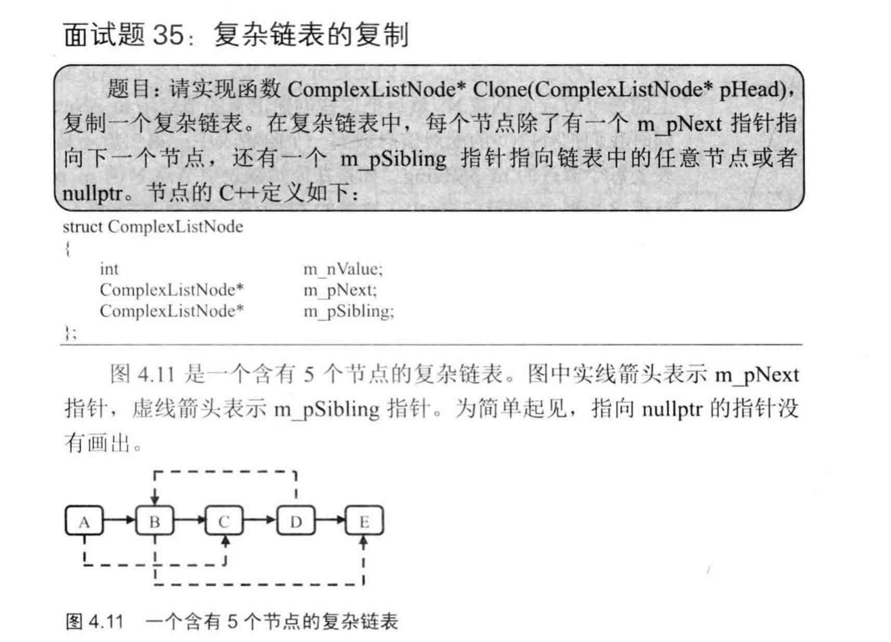

(PS：扫描[首页里面的二维码](README.md)进群，分享我自己在看的技术资料给大家，希望和大家一起学习进步！)

## 链表专题
一开始是刷剑指offer，后面是刷LeetCode，发现就是题目都是相对比较零散，不是按照链表，二叉树，数组等等这些Tag来分的，所以不是特别方便自己复习，所以自己在复习时就把刷过的题按照Tag重新刷了一遍。

### 剑指Offer部分
#### [题005从尾到头打印链表](#题005)
#### [题013链表的倒数第K个结点](#题013)
#### [题014反转链表](#题014)
#### [题015 合并链表](#题015)

#### [题024 复杂链表的复制](#题024)
#### [题035 两个的链表的第一个公共节点](#题035)

#### [题054 链表中环的入口节点](#题054)
#### [题055 删除链表中重复的节点](#题055)

## 题005 从尾到头打印链表

输入一个链表，按链表值从尾到头的顺序返回一个ArrayList。

#### 解题思路(递归遍历链表)

首先通过开始的判断，来排除链表为空的情况，直接返回空数组，链表不为空，取下一个节点，判断下一个节点是否为空，

- 不为空，那么递归调用printListFromTailToHead方法来获取后面的节点反序生成的ArrayList，然后添加当前的节点的值，然后返回arrayList。
- 为空，那么说明当前节点是链表尾部节点，直接创建一个ArrayList，然后添加当前节点的值，然后返回arrayList。

```java
ArrayList<Integer> printListFromTailToHead(ListNode listNode) {
    if(listNode == null) { return new ArrayList<Integer>(); }
    ArrayList<Integer> arrayList;
    ListNode nextNode = listNode.next;
    if (nextNode!=null) {
    		arrayList = printListFromTailToHead(nextNode);
    		arrayList.add(listNode.val);
    } else {
    		arrayList = new ArrayList<>();
    	  arrayList.add(listNode.val);
  	}
    return arrayList;
}
```
或者是这样写，其实原理就是先递归遍历，然后再打印，这样链表打印的顺序就是逆序的了。下面这么写，通过把ArrayList设置为一个全局变量，更加便于理解。
```java
ArrayList<Integer> list = new ArrayList<Integer>();
public ArrayList<Integer> printListFromTailToHead(ListNode listNode) {
		if(listNode == null ){
				return list;
		}
		printListFromTailToHead(listNode.next);
		list.add(listNode.val);
		return list;
}
```


## 题013链表的倒数第K个结点

输入一个链表，输出该链表中倒数第k个结点。

#### 解题思路(快慢指针)
一个指针A先向前走k-1步，然后一个指针B指向头结点，A，B同时往后面走，直到A成为最后一个节点。

```java
ListNode FindKthToTail(ListNode head, int k) {
    if (head==null || k <= 0) {//空链表，或者k小于等于0
        return null;
    }
    ListNode secondNode = head;

    for (int i=0 ; i < k-1 ; i++) {//向前走k-1步
        if (secondNode.next==null) {//链表长度不足k个
            return null;
        }
        secondNode = secondNode.next;
    }

    ListNode firstNode = head;
    while (secondNode.next != null) {//一直遍历到secondNode成为最后一个节点
        secondNode = secondNode.next;
        firstNode = firstNode.next;
    }
    return firstNode;
}
```
还有一种方法更加简洁一些，就是让快指针quickNode走到为null，此时head就是倒数第K个节点。
```java
ListNode findLastK(ListNode head,int k) {
        if (head==null || k < 1) {//空链表，或者k小于等于0
            return null;
        }
        ListNode quickNode = head;
        for (int i = 0; i < k; i++) {
            if (quickNode == null) {
                return null;
            } else {
                quickNode = quickNode.next;
            }
        }
        while (quickNode!=null) {
            quickNode = quickNode.next;
            head=head.next;
        }
        return head;
    }
```
## 题014反转链表

输入一个链表，反转链表后，输出新链表的表头。

A = head

B = head.next

head = null;//特别注意需要将原本的头结点置为null，否则原来的头结点的next会引用原来的第二个节点，形成一个环。

上一个节点A，当前节点B，下一个节点C，让

C = B.next;

B.next = A;

A = B;

B = C;

一直到B为null，此时A为最后一个节点.

```java
public static ListNode ReverseList(ListNode head) {

    if (head == null) return null;//链表为空
    if (head.next==null) return head;//链表只有一个节点
    ListNode lastNode = head;
    ListNode currentNode = head.next;
    head.next = null;//将原来的头结点指向null

    while (currentNode != null) {//一直到currentNode是最好一个节点
        ListNode saveNextNode = currentNode.next;
        currentNode.next = lastNode;
        lastNode = currentNode;
        currentNode = saveNextNode;
    }
    return lastNode;
}
```

这种解法好理解一点，就是使用first，second，three保存三个连续的节点，依次后移动

```java
public ListNode findLastNode(ListNode node) {
		if(node==null ||node.next ==null) {
				return node;
		}
		//至少有两个节点
		ListNode first = node;
		ListNode second = node.next;
		ListNode three = second.next;
		first.next = null;
		while(second!=null) {
				second.next = first;
				first = second;
				second = three;
				if (three == null){break};
				else {
					three = three.next;
				}
		}
		return first;
}
```
还有一种是递归的写法
```java
ListNode reverseNode(ListNode head) {
        ListNode lastNode = reverseNode2(head);
        head.next = null;//把老的链表头结点的next指针设置为null，不然会形成环
        return lastNode;
    }
    //递归遍历到末尾
ListNode reverseNode2(ListNode head) {
	if (head.next==null) {
		return head;
	}
	ListNode lastNode = reverseNode2(head.next);
	head.next.next = head;
	return lastNode;
}

```

## 题015 合并链表

输入两个单调递增的链表，输出两个链表合成后的链表，当然我们需要合成后的链表满足单调不减规则。

遍历写法：

```java
 ListNode merge(ListNode head1, ListNode head2) {
        //有一个链表为空，就将另一个链表返回
        if (head1==null) { return head2;}
        if (head2==null) { return head2;}
        //创建preNode作为新链表头结点前面的节点
        ListNode preHead = new ListNode(-1);
        //currentNode作为起始节点
        ListNode currentNode = preHead;
        while (head1!=null&&head2!=null) {
            if (head1.val<head2.val) {
                currentNode.next = head1;
                currentNode = currentNode.next;
                head1 = head1.next;
            } else {
                currentNode.next = head2;
                currentNode = currentNode.next;
                head2 = head2.next;
            }
        }
        //将剩余节点拼接到currentNode后面
        if (head1!=null) { currentNode.next = head1;}
        if (head2!=null) { currentNode.next = head2;}
        return preHead.next;
    }
```

递归写法：

```java
ListNode Merge(ListNode list1,ListNode list2) {
    if (list1 == null || list2 == null ) { //存在链表为空
    		return list1 == null ? list2 : list1;
    }
    ListNode newHead;
    if (list1.val < list2.val) {
        newHead = list1;
        newHead.next = Merge(list1.next,list2);
    }else {
        newHead = list2;
        newHead.next = Merge(list1,list2.next);
    }
    return newHead;
}
```

## 题024 复杂链表的复制

输入一个复杂链表（每个节点中有节点值，以及两个指针，一个指向下一个节点，另一个特殊指针指向任意一个节点），返回结果为复制后复杂链表的 head 。（注意，输出结果中请不要返回参数中的节点引用，否则判题程序会直接返回空）



第一种解法就是需要额外的空间，一个哈希表来辅助，哈希表存储了旧链表的节点与新节点的映射关系，把链表当成普通单链表来进行复制，复制完之后通过去哈希表中查找节点来对特殊指针进行赋值。

第二种解法就是不需要额外的空间，但是将新节点先放在旧链表中对应的节点的后面，然后当成单链表复制完毕后，复制完之后，去对特殊指针赋值，然后再将新旧链表分离。

```java
public RandomListNode copy(RandomListNode head) {
        if (head == null) {return null;}
        RandomListNode node = head;
  			//在老链表中创建新的节点，添加到每个节点后面
        while (node!=null) {
            RandomListNode copyNode = new RandomListNode(node.label);
            copyNode.next = node.next;
            node.next=copyNode;
            node = copyNode.next;
        }
        node = head;
        //从头开始，给每个节点加上随机指针
        while (node!=null) {
            RandomListNode copyNode = node.next;
            RandomListNode random  = node.random;
          //需要判断random指针为空的情况
            copyNode.random = random != null ? random.next:null;
            node = node.next.next;
        }
        RandomListNode oldNode = head;
        //这是复制后的链表头结点的前一个节点
        RandomListNode preNewHead = new RandomListNode(0);
        RandomListNode newNode = preNewHead;
        //将链表分离
        while (oldNode!=null) {
            RandomListNode nextNewNode = oldNode.next;
            RandomListNode oldNextNode = oldNode.next.next;
            newNode.next = nextNewNode;
            oldNode.next = oldNextNode;
            //后移
            oldNode = oldNextNode;
            newNode = nextNewNode;
        }
        return preNewHead.next;
    }
```

## 题035 两个的链表的第一个公共节点

输入两个链表，找出它们的第一个公共结点。

解法一需要辅助空间，用两个栈将两个链表中的节点存起来，取出链表末尾的节点开始比较，不相等就先前移动（也就是栈顶出栈）

解法二将某一个链表的节点存储到一个HashSet中，对链表二进行遍历，与HashSet中的节点进行对比。

解法三，分别遍历两个链表，得到两个链表的长度，用两个指针分别指向头结点，指向长度更大的链表的指针向后移动N步，使得链表的剩余节点长度相等，然后每次两个指针向后移动一步，直到指针指向的节点相等。

```java
ListNode FindTheCommonNode(ListNode head1, ListNode head2) {
        if (head1==null|| head2 == null) {
            return null;
        }
  //统计长度
        int length1=0,length2=0;
        ListNode node1 = head1,node2=head2;
        while (node1!=null) {
            length1++;
            node1=node1.next;
        }
        while (node2!=null) {
            length2++;
            node2 = node2.next;
        }
        node1 = head1;
        node2 = head2;
  //长的链表先走
        while (length1!=length2) {
            if (length1>length2) {
                length1--;
                node1=node1.next;
            } else {
                length2--;
                node2=node2.next;
            }
        }
        while (node1!=node2) {
            node1 = node1.next;
            node2 = node2.next;
        }
        if (node1==node2) {
            return node1;
        }
        return null;
    }
```

## 题054 链表中环的入口节点

给一个链表，若其中包含环，请找出该链表的环的入口结点，否则，输出null。


一种方法是遍历整个链表，将每个节点添加到HashSet中，判断是否在HashSet中出现过，第一个重复的节点就是环的入口节点。

另一种解决方法是，假设存在环，环的长度为x，第一个指针先走x步，然后第二个指针从链表头结点出发，两个指针一起走，当第而个指针刚好走到环入口时，第一个指针正好在环中走了一圈，也在环的入口，此时的节点就是环的的入口节点，

怎么得到环的长度呢，就是一个指针每次走2步，一个指针每次走一步，他们相遇时的节点肯定就是在环中的某个节点，然后这个节点在环中遍历一圈，回到原点，就可以得到环的长度count。

两个指针从头出发，第一个指针先走count步，然后两个指针每次都只走一步，相遇的地方就是环的入口，

```
public ListNode EntryNodeOfLoop(ListNode pHead)
{
    if (pHead == null || pHead.next==null) {
        return null;
    }
    //计算环的长度
    ListNode slowNode = pHead.next;
    ListNode quickNode = slowNode.next;
    ListNode nodeInLoop = null;//获取环上的某个节点
    while (quickNode!=null && slowNode!= null) {
        if (quickNode == slowNode) {
            nodeInLoop =  quickNode;
            break;
        }
        slowNode = slowNode.next;
        quickNode = quickNode.next;
        if (quickNode!= null) {
            quickNode=quickNode.next;
        }
    }
    if (nodeInLoop == null) {//说明没有环
        return null;
    }
    //根据环上的某个节点来计算环的长度count
    ListNode tempNode = nodeInLoop;
    int count = 1;//将当前计算计算在内
    while (tempNode.next!=nodeInLoop) {
        tempNode = tempNode.next;
        count++;
    }
    //从链表头结点出发，第一个指针先走count步，然后两个指针每次只走一步，相遇的地方就是环的入口，
    // 然后第一个指针和第二个指针一起走，当第二个指针刚好走了x步到环入口时，
    // 第一个指针正好走了x+count步，在环中走了一圈，也在环的入口，
    quickNode = pHead;
    for (int i = 0; i < count; i++) {
        quickNode = quickNode.next;
    }

    slowNode = pHead;
    while (quickNode!=slowNode) {
        quickNode = quickNode.next;
        slowNode=slowNode.next;
    }
    return slowNode;
}
```

使用hashSet的解法

```
public ListNode EntryNodeOfLoop1(ListNode pHead)
{
    if (pHead==null) {
        return null;
    }
    HashSet<ListNode> set = new HashSet<ListNode>();
    ListNode node = pHead;
    while (node !=null) {
        if (set.contains(node)) {
            return node;
        } else {
            set.add(node);
        }
        node= node.next;
    }
    return null;
}
```

## 题055 删除链表中重复的节点

在一个排序的链表中，存在重复的结点，请删除该链表中重复的结点，重复的结点不保留，返回链表头指针。 例如，链表1->2->3->3->4->4->5 处理后为 1->2->5

解法：

就先创建一个我们自己的节点ourHead，

ourHead.next= head，

pre = ourHead

currentNode = pre.next

然后currentNode开始向后遍历，每次拿当前节点与后一个节点值比较

相等，那么就遍历找到一个不相等的点，然后将pre节点指向这个不相等的节点，currentNode = pre.next

不相等，那么就直接让pre和currentNode向后移动一步。

```java
public ListNode deleteDuplication(ListNode pHead)
{
    if (pHead == null || pHead.next == null) {
        return pHead;
    }

    ListNode ourHead = new ListNode(0);
    ourHead.next = pHead;
    int temp = pHead.val;
    ListNode preNode = ourHead;
    ListNode currentNode = ourHead.next;
    
    while (currentNode!=null) {//往后遍历
        if (currentNode.next!=null && currentNode.val == currentNode.next.val) {//如果当前节点与下一个节点相等，就找到一个与当前节点不相等的节点，然后把中间多出来的这些相等的节点都删除掉
            ListNode tempNode = currentNode.next;
            //找到第一个不相等的节点
            while (tempNode!=null) {
                if(tempNode.val == currentNode.val) { tempNode = tempNode.next; }
                else { break; }
            }
            preNode.next = tempNode;
            currentNode = preNode.next;
        } else {//如果当前节点与下一个节点相等，就跳过，遍历下一个节点
            preNode = preNode.next;
            currentNode = currentNode.next;
        }
    }
    return  ourHead.next;
}
```