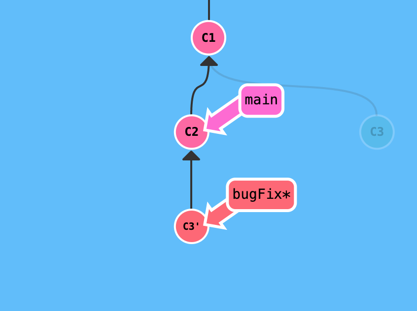

##### git命令使用

`git branch dev`  创建一个名称为dev的分支

`git checkout dev`切换到dev分支上


`git checkout -b dev ` 从当前分支上创建出一个新分支dev


`git merge dev` 假设当前为master分支，执行这条命令后会将dev分支合并到当前master分支，合并完成后，master分支和dev分支会变成同一个分支

`git:(dev)  git rebase master`  假设当前为dev分支，git rebase master命令会将当dev的更改进行回退，回退到与main分支交汇的地方，将这些更改暂存到rebase目录，然后将master上面的提交拿过来，让dev分支更新到master分支那样，然后再把之前暂存的更改应用上，中间如果出现冲突，需要解决冲突，解决完冲突后，使用git add 将更新添加上，然后使用git rebase --continue继续合并。如果中间需要中断合并那么可以使用git rebase —abort。

在rebase完成后，我们dev分支已经是最新了，但是master上还是老的代码，我们需要使用git checkout master 切换到master分支上，然后使用git rebase dev将dev上面的更改移动到master上来，然后push到远程。


`git checkout HEAD^` 将当前head指向上1次提交

`git checkout HEAD~3` 将当前head指向上3次提交

`git reset HEAD~1` 回滚到上一次提交

`git reset HEAD` 生成一个新的提交，用于将上一个提交的更改撤销掉，等价于`git reset HEAD~1`

`git cherry-pick C3 C4 C7`将其他分支上的C3提交，C4提交，C7提交拿到这个分支上面来

`git rebase -i HEAD~3` 合并最近的两次提交为一次提交记录，执行这个命令后会进入vim界面，然后会出现3次提交的记录

```java
pick 115e825 queryCreditsMonth
pick 4cedfe6 queryCreditsMonth
pick b3dccfd nickname
```

有一下操作符：
pick：保留该commit（缩写:p）
reword：保留该commit，但我需要修改该commit的注释（缩写:r）
edit：保留该commit, 但我要停下来修改该提交(不仅仅修改注释)（缩写:e）
squash：将该commit和前一个commit合并（缩写:s）
fixup：将该commit和前一个commit合并，但我不要保留该提交的注释信息（缩写:f）
exec：执行shell命令（缩写:x）
drop：我要丢弃该commit（缩写:d）

咱们如果要把三次提交合并成一个就改成这样

```
pick 115e825 queryCreditsMonth
s 4cedfe6 queryCreditsMonth
s b3dccfd nickname
```

然后保存退出，然后会进入填写commit说明的地方，我们直接保存就好了，这样就完成了,会生成一个新的commit

```java
commit b3dccfd2c2173fa0a6358de604b6541c8c6c644a (HEAD -> feature-dev)
Date:   Fri May 7 16:29:22 2021 +0800

    nickname

    nickname

    change credits
```


`git commit -amend`可以修改最后一次提交的commit说明


##### rebase出现了冲突怎么办？

假设master上跟我们改了同一行，其实就会造成冲突
例如下面这个就是我们需要解决的冲突，<<<<< HEAD 到====== 之间为其他分支上别人的更改，======到>>>>>>> change credits之间为我们自己在dev分支上的更改，我们需要解决冲突，然后使用git add对文件进行提交
```java
 @Override
    public List<CreditsMonthsUser> creditsMonthsQuery(Integer months, long year) {
<<<<<<< HEAD
        List<CreditsMonthsUser> creditsMonth = creditsMonthsMapper.creditsMonthsQuery(months, year);
        for(CreditsMonthsUser creditsMonthsUser : creditsMonth){
            String nickname = WechatUtil.decodeNickName(creditsMonthsUser.getNickname());
            creditsMonthsUser.setNickname(nickname);
        }
        return creditsMonth;
=======
        Integer a = 100;
        return creditsMonthsMapper.creditsMonthsQuery(months, year);
>>>>>>> change credits
    }

```

##### 日常开发流程应该是怎么样的呢？
1. git fetch origin dev   拉取远程的dev分支到本地，本地也会创建出dev分支

2.git checkout -b feature-dev 我们自己从dev分支创建出一个feature-dev分支，用于我们自己开发

3.我们自己在feature-dev开发了一些功能后，进行提交时，可能其他人往dev分支上提交了更新，我们需要将更新拿到本地

4.

git checkout dev 切到dev分支
git pull origin dev 将其他人在远程dev上的提交拉到本地

5.

git checkout feature-dev

git rebase dev 将dev上的更改应用到我们的feature-dev分支

然后可能会出现冲突，我们对冲突进行合并，

然后对修改后的文件使用git add +文件名 进行添加，

添加完成后使用git rebase --continue就可以继续，然后合并完成（如果需要中断rebase操作可以使用git rebase --abort）

6.git checkout feature-dev

git rebase feature-dev 就可以把feature-dev上合并好的更改拿到dev分支上

7. git push origin dev 就可以将dev分支上的更改提交到远程