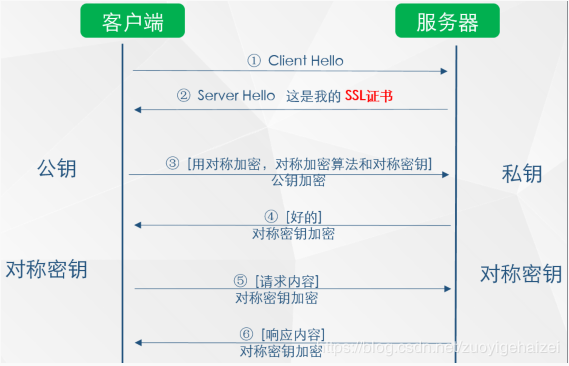
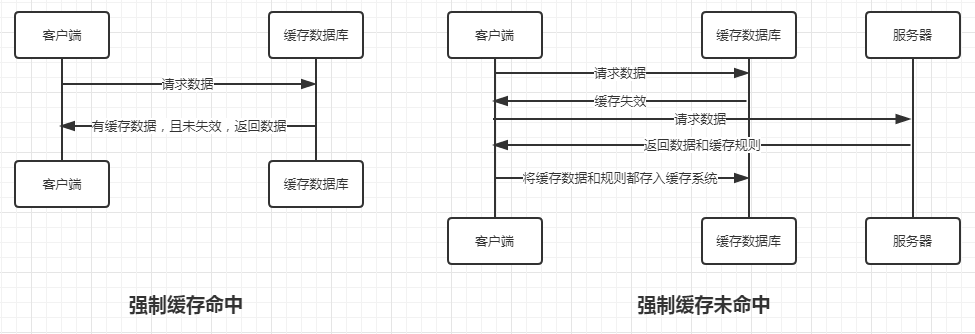
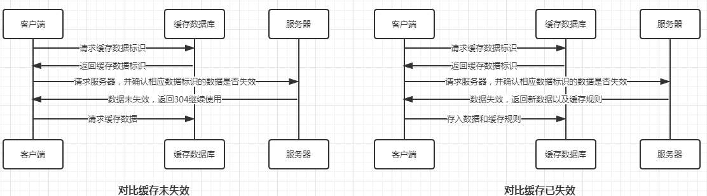
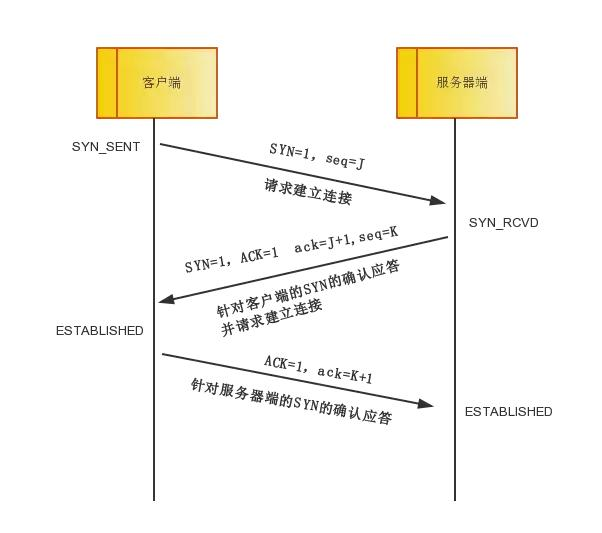
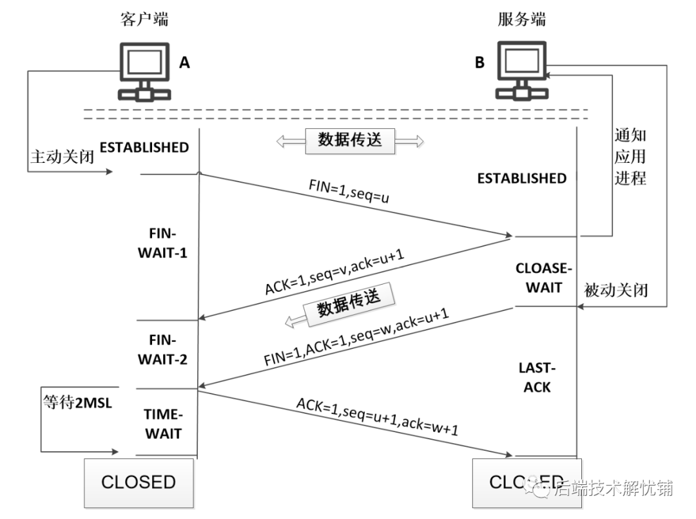
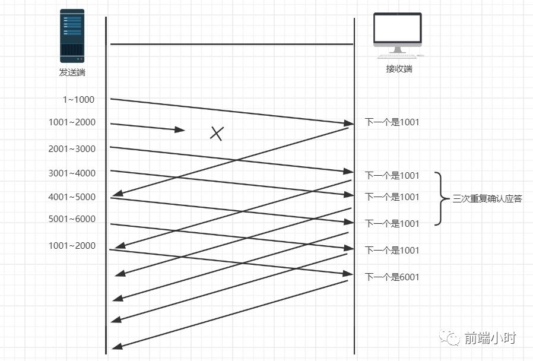
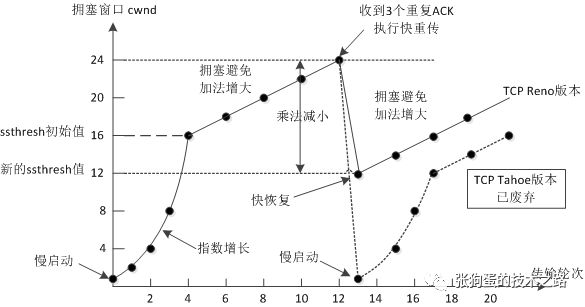
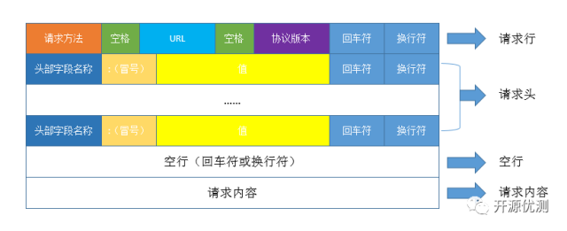
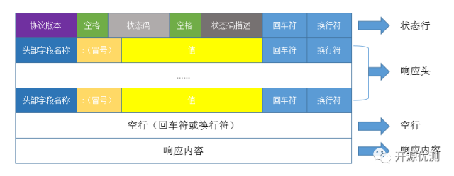
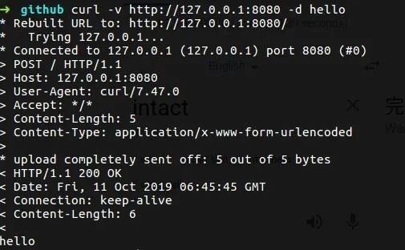

(PS：扫描[首页里面的二维码](README.md)进群，分享我自己在看的技术资料给大家，希望和大家一起学习进步！)

#### [1.HTTPS建立连接的过程是怎么样的？](#HTTPS建立连接的过程是怎么样的？)
#### [2.HTTP的缓存策略是怎么样的？](#HTTP的缓存策略是怎么样的？)
#### [3. TCP三次握手和四次挥手是怎么样的？](#TCP三次握手和四次挥手是怎么样的？)
#### [4.TCP怎么保证可靠性的?](#TCP怎么保证可靠性的?)
#### [5.TCP拥塞控制怎么实现？](#TCP拥塞控制怎么实现？)
#### [6.close_wait太多怎么处理?](#close_wait太多怎么处理?)

### HTTPS建立连接的过程是怎么样的？



在发起连接之前，服务器会向证书机构申请SSL证书，流程是服务器将自己的公钥发给CA证书机构，CA证书机构会用自己的私钥对服务器的公钥加密，生成SSL证书给服务器，服务器将SSL证书存储后供之后建立安全连接使用。

1.客户端发起请求，TCP三次握手，跟服务器建立连接。
如上图所示，在第 ② 步时服务器发送了一个SSL证书给客户端，SSL 证书中包含的具体内容有：

（1）证书的发布机构CA

（2）证书的有效期

（3）服务器的公钥

（4）证书所有者

（5）签名

3、客户端在接受到服务端发来的SSL证书时，会对证书的真伪进行校验，以浏览器为例说明如下：

（1）首先浏览器读取证书中的证书所有者、有效期等信息进行一一校验

（2）浏览器开始查找操作系统中已内置的受信任的证书发布机构CA证书，与服务器发来的证书中的颁发者CA比对，用于校验证书是否为合法机构颁发 。

（3）如果找不到，浏览器就会报错，说明服务器发来的证书是不可信任的。

（4）如果找到，那么浏览器就会从操作系统中取出  颁发者CA  的公钥，然后对服务器发来的证书里面的签名进行解密

（5）浏览器使用相同的hash算法计算出服务器发来的证书的hash值，将这个计算的hash值与证书中签名做对比

（6）对比结果一致，则证明服务器发来的证书合法，没有被冒充

（7）此时浏览器就可以读取证书中的公钥，用于后续加密了。

假设没有CA，那么如果服务器返回的包含公钥的包被hack截取，然后hack也生成一对公私钥，他将自己的公钥发给客户端。hack得到客户端数据后，解密，然后再通过服务器的公钥加密发给服务器，这样数据就被hack获取。
有了CA后，客户端根据内置的CA根证书，很容易识别出hack的公钥不合法，或者说hack的证书不合法。

### HTTP的缓存策略是怎么样的？

HTTP 缓存主要分为强缓存和对比缓存两种，从优先级上看，强缓存大于对比缓存。

#### 强缓存



 强缓缓存就是浏览器缓存数据库里有缓存数据就不再去向服务器发请求了

可以造成强制缓存的字段有Expires和Cache-Control两个：

Expires：该字段标识缓存到期时间，是一个绝对时间，也就是服务器时间+缓存有效时间。
缺点：如果客户端修改了本地时间，会造成缓存失效。如果本地时间与服务器时间不一致，也会导致缓存失效。

Cache-Control：该字段表示缓存最大有效时间，该时间是一个相对时间。
使用相对时间的话，即使本地时间与服务器时间不一致，也不会导致缓存失效。
 下面列举一下Cache-Control的字段可以带的值：

> - max-age：即最大有效时间
> - no-cache：表示没有缓存，即告诉浏览器该资源并没有设置缓存
> - s-maxage：同max-age，但是仅用于共享缓存，如CDN缓存
> - public：多用户共享缓存，默认设置
> - private：不能够多用户共享，HTTP认证之后，字段会自动转换成private。

#### 对比缓存



对比缓存的实现原理时，先给给服务器发请求，并且带上缓存的资源文件的缓存标识，让服务端进行对比，如果资源文件没有更改，就只返回header部分，body为空，状态码是304，浏览器使用缓存的资源文件。如果数据有更改，就返回更新后的资源文件。

可以实现对比缓存的机制有Last-Modified/If-Modified-Since和Etag/If-None-Match两种：

##### Last-Modified/If-Modified-Since
就是 请求的response header中会返回Last-Modified字段，代表资源文件最近的修改时间，发请求时 request header中会带上If-Modified-Since字段，代表上次获取的资源文件的最近修改时间，服务器判断资源文件是否有更新，来决定返回最新的资源文件（返回200），还是让浏览器使用缓存(返回304)。

缺点：

1. Last-Modified标注的最后修改只能精确到秒级，如果某些文件在1秒钟以内，被修改多次的话，它将不能准确标注文件的修改时间。

2. 如果某些文件会被定期生成，当有时内容并没有任何变化，但Last-Modified却改变了，导致文件没法使用缓存。

##### Etag/If-None-Match

就是 response header中会返回Etag，代表资源文件的版本号，发请求时 request header中会加上If-None-Match字段，值是上次请求的资源的文件的版本号，代表上次请求的资源文件的版本号，服务器判断资源文件是否有更新，来决定返回最新的资源文件（返回200），还是让浏览器使用缓存(返回304)。

##### 优先级

优先级方面排序是 强缓存（Cache-Control）> 强缓存（Expires）> 对比缓存（Etag/If-None-Match）> 对比缓存（Last-Modified/If-Modified-Since）

### TCP三次握手和四次挥手是怎么样的？

#### 三次握手：

TCP是一个面向连接的可靠的传输协议。建立连接前需要进行三次握手。

流程如下：



1.客户端首先会生成一个随机数J作为数据包的序号，给服务端发送一个SYN包，包的序号seq设置为J，发送成功后，自己进入SYN_SENT 状态，代表发送SYN包成功，等待服务端的确认。

2.服务端收到SYN包之后，会进入到SYN_RECV状态，同时为了检测服务端到客户端是否通畅，会给客户端发送一个SYN包，将ACK设置为1，并且会带上ack=J+1，生成随机数作为包的序号，seq=K，用于确认之前收到了客户端发送的SYN包。

3.客户端收到服务端发送的SYN包后，会检测ACK标志位是否为1，并且ack是否等于J+1,如果是的话，就说明之前服务器收到了客户端发送的SYN包，并且服务端发送给客户端的SYN包也是可以收到的，所以需要给服务端发送ACK包，ACK=1，ack=K+1。

4.服务端收到ACK回应后，检查ack是否为K+1，ACK是否为1，如果正确则连接建立成功，客户端和服务器端进入ESTABLISHED状态，完成三次握手，随后客户端与服务器端之间可以开始传输数据了。

#### 四次挥手



TCP是全双工的连接，断开每一方向的连接都需要发送断开请求，断开确认。所以总共需要发送4个包才能确定连接的断开。

1.首先客户端给服务端发送一个FIN包，seq=J，客户端进入FIN_WAIT_1状态，代表客户端已经没有数据发送给服务端了。

2.服务端接收到FIN包之后，会给客户端发送一个ACK，ack=J+1，用于确认客户端-服务端这边的连接进行断开。同时会进入到CLOSE_WAIT状态，表示在等待关闭，因为服务端往客户端可能还在继续传输数据，暂时还不能断开。客户收到服务端返回的ACK回应后，会进入到FIN_WAIT_2状态，代表客户端-服务端的连接已经断开成功，等待服务端发送FIN包断开服务端-客户端的连接。

3.服务端发现没有数据发给客户端后，会发一个FIN包给客户端，并且进入LAST_ACK，代表等待客户端的ACK，一旦收到ACK，代表连接正式断开，服务端可以进入CLOSE状态。

4.客户端收到服务端发送的FIN包后，说明连接已经断开了，但是需要服务端知道，客户端会给服务端发送一个ACK包通知服务端，并且会进入TIME_WATING状态，代表超过超时时间后自动进入CLOSE状态，如果ACK包中途丢了，服务端会再发送FIN包，客户端会进行ACK包重发，这也是TIME_WAITING状态的意义。

### TCP怎么保证可靠性的?

TCP主要提供了**检验和**、**序列号/确认应答**、**超时重传**、**最大消息长度**、**滑动窗口控制**等方法实现了可靠性传输。

**校验和**

主要是将数据切分成若干个16位的二进制串，将每个二进制串看成一个二进制数，对这些数进行相加等运算得到一个校验和，然后接收方收到数据会使用同样的算法来对数据计算校验和，如果结果和发送端发过来的校验和一样，那么就校验成功。主要是为了防止接收方收到的是已经损坏的数据。

**序列号/确认应答，超时重传**

对发送的每个数据包都有一个序号，服务端收到数据包会返回一个ACK进行确认，如果在超过超时时间后，客户端还是没有收到服务端返回的ACK确认，就会对数据包进行超时重传。并且超时时间是动态变化的，初始值会大于正常的报文发送到接收到ACK回应的时间，重传后还没有得到回应会调大重传时间，然后进行重传。
例如：在Linux中，超时以500ms为单位进行控制，每次判定超时重发的超时时间都是500ms的整数倍。其规律为：如果重发一次仍得不到应答，就等待2500ms后再进行重传，如果仍然得不到应答就等待4500ms后重传，依次类推，以指数形式递增，重传次数累计到一定次数后，TCP认为网络或对端主机出现异常，就会强行关闭连接。

**最大消息长度**

在建立TCP连接的时候，双方约定一个最大的长度（MSS）作为发送的单位，重传的时候也是以这个单位来进行重传。理想的情况下是该长度的数据刚好不被网络层分块。

**滑动窗口控制**

就是发送方在发送一个包时，不需要等到收到接收方对上一个包的确认应答后，才能发。只需要当前发送的包在滑动窗口内就行了。发送方每接收到一个确认应答，就会向后移动一位。 对于接收方而言，只会给客户端返回当前需要的包的序号，也就是对目前已收到的包的确认应答。（在拥塞控制里面，一般判断是否是网络拥塞导致丢包，有两种机制，超时重传，超过重传时间，还没有收到回应，另一个是收到三个重复确认ACK，就是比如中间某个数据包N丢了，那么后面发送的3个数据包如果被服务端接收到了，返回的确认回答ACK=N，代表没有收到数据包N，需要发送方重传，重复确认ACK超过3个，就认为发送了网络拥塞）



### 流量控制是怎么实现的？

因为滑动窗口设置得太大或太小都不易于数据传输，所以是根据接收端的反馈，发送端可以对滑动窗口大小进行动态调整的。发送端在发送的数据包的序号必须小于最大的滑动窗口值，所以当发送的数据包过多，导致接收端的缓冲区写满时，接收端会通知给客户端将滑动窗口设置为更小的值，减少发送的量，达到一个流量控制的效果。

### TCP拥塞控制怎么实现？



拥塞控制主要由**慢启动**，**拥塞避免**，**拥塞发生时算法**，**快速恢复**四个算法组成。

**慢启动**

TCP连接刚建立，一点一点地提速，试探一下网络的承受能力，以免直接扰乱了网络通道的秩序，是呈指数增长的。一开始拥塞窗口cwnd大小是1，就是每收到一个ACK确认回答，就会把拥塞窗口cwnd的大小+1，这样在每个往返时延下，窗口cwnd大小都会变为原来的二倍，所以就会呈指数增长。

**拥塞避免**

因为慢启动的拥塞窗口cwnd呈指数增长的，一旦达到网络的最大承受能力时，有可能已经发出大量数据包了，造成网络拥塞了，所以为了避免网络拥塞，当拥塞窗口cwnd达到慢启动的阀值ssthresh的大小时，就会停止指数增长，进入线性增长状态，在每个往返时延下，窗口cwnd大小都+1。

**拥塞发生时算法**

一般认为，网络拥塞时就会发生网络丢包，所以判定拥塞发生就是以丢包为主。有两种判定方法，**超时重传**，在发送一个数据以后就开启一个计时器，在一定时间（RTO[Retransmission Timeout]）内如果没有得到发送数据报的ACK报文，那么就重新发送数据，直到发送成功为止。另一个是**收到三个重复确认ACK**，就是比如中间某个数据包N丢了，那么后面发送的3个数据包如果被服务端接收到了，返回的确认回答ACK=N，代表没有收到数据包N，需要发送方重传，重复确认ACK超过3个，就认为发送了网络拥塞）。

一旦认定网络拥塞，就会将慢启动阀值ssthresh设置为发生拥塞时的窗口cwnd大小的一半。

PS：快重传是什么？

假设发送方发送了1，2，3，4个数据包，假设接收方收到1，2数据包，并且发送了ACK确认，没有收到3，但是收到了4。根据可靠性传输原理，由于没有收到3，即便接受到了4，它也是一个失序报文，接收方不能对它进行确认。只能等发送方在等待3的ACK的回应时间超过2MSL后，进行重发。但是在这里为了让发送方快速知道哪些数据报文丢失了，接收方在收到3时就会给他返回2的ACK，一旦收到3个重复的ACK回应，也就是2的ACK，发送方就会意识到数据包3丢了，就会进行快速重传，重发报文3。

**快速恢复算法**

发生网络拥塞后，慢启动阀值ssthresh设置为发生拥塞时的窗口cwnd大小的一半后，

如果是早期的算法TCP Tahoe，此时会将cwnd重置为1，重新开始慢启动的过程。

如果现在的TCP Reno算发，会将cwnd窗口设置为新的ssthresh值的大小，后续开始进入拥塞避免算法的流程，对cwnd窗口进入线性增长的状态。

### close_wait太多怎么处理?

close_wait 主要在TCP四次挥手时，服务端给客户端返回ACK应答后，由于自身还需要给客户端传输数据，所以会进入到close_wait状态，直到不需要给客户端发数据了，才会去给客户端发送FIN包，同时进入LAST_ACK状态。(被动关闭的一方没有及时发出 FIN 包就会导致自己一直处于close_wait状态。)

tcp_keepalive_time默认是2个小时，也就是TCP空闲连接可以存活2个小时，在close_wait状态下，可以把这个时间调小，减少处于close_wait连接的数量

### time_wait太多是怎么造成的？
首先time_wait状态存在的意义是可以有效地终止TCP连接，因为主动关闭方发生ACK给被动关闭方后，需要等待2MSL的时间(MSL指的是报文最大有效存活时间，在linux下是60s)，在这个时间内，如果没有收到被动关闭方重发的FIN包，就说明连接关闭完成了。
在高并发短连接的业务场景下，由于短连接的传输数据+业务处理的时间很短，所以服务器处理完请求就会立即主动关闭连接，并且进入TIME_WAITING状态，而端口处于有个0~65535的范围中，除去系统占用的，总的数量有限。所以持续的到达一定量的高并发短连接，会使服务器因端口资源不足而拒绝为一部分请求服务。
可以通过修改TCP的默认配置来改善这个问题。
```
net.ipv4.tcp_syncookies = 1 表示开启SYN Cookies。当出现SYN等待队列溢出时，启用cookies来处理，可防范少量SYN攻击，默认为0，表示关闭；
net.ipv4.tcp_tw_reuse = 1 表示开启重用。允许将TIME-WAIT sockets重新用于新的TCP连接，默认为0，表示关闭；
net.ipv4.tcp_tw_recycle = 1 表示开启TCP连接中TIME-WAIT sockets的快速回收，默认为0，表示关闭。
net.ipv4.tcp_fin_timeout 修改系默认的 TIMEOUT 时间
```
https://www.cnblogs.com/dadonggg/p/8778318.html
https://segmentfault.com/a/1190000019292140
### HTTP/2 有哪些新特性？
#### 1.二进制传输
HTTP/2传输数据量的大幅减少,主要有两个原因:以二进制方式传输和Header 压缩。我们先来介绍二进制传输,HTTP/2 采用二进制格式传输数据，而非HTTP/1.x 里纯文本形式的报文 ，二进制协议解析起来更高效。HTTP/2 将请求和响应数据分割为更小的帧，并且它们采用二进制编码。
HTTP/2 中，同域名下所有通信都在单个连接上完成，该连接可以承载任意数量的双向数据流。每个数据流都以消息的形式发送，而消息又由一个或多个帧组成。多个帧之间可以乱序发送，根据帧首部的流标识可以重新组装。

#### 2.Header 压缩
HTTP/2并没有使用传统的压缩算法，而是开发了专门的"HPACK”算法，在客户端和服务器两端建立“字典”，用索引号表示重复的字符串，还采用哈夫曼编码来压缩整数和字符串，可以达到50%~90%的高压缩率。

具体来说:

在客户端和服务器端使用“首部表”来跟踪和存储之前发送的键-值对，对于相同的数据，不再通过每次请求和响应发送；

首部表在HTTP/2的连接存续期内始终存在，由客户端和服务器共同渐进地更新;

每个新的首部键-值对要么被追加到当前表的末尾，要么替换表中之前的值

例如下图中的两个请求， 请求一发送了所有的头部字段，第二个请求则只需要发送差异数据，这样可以减少冗余数据，降低开销。

#### 3.多路复用
在 HTTP/2 中引入了多路复用的技术。多路复用很好的解决了浏览器限制同一个域名下的请求数量的问题，同时也接更容易实现全速传输，毕竟新开一个 TCP 连接都需要慢慢提升传输速度。

https://my.oschina.net/u/4331678/blog/3628959

#### 4.Server Push

HTTP2还在一定程度上改变了传统的“请求-应答”工作模式，服务器不再是完全被动地响应请求，也可以新建“流”主动向客户端发送消息。比如，在浏览器刚请求HTML的时候就提前把可能会用到的JS、CSS文件发给客户端，减少等待的延迟，这被称为"服务器推送"（ Server Push，也叫 Cache push）
#### 5.提高安全性

出于兼容的考虑，HTTP/2延续了HTTP/1的“明文”特点，可以像以前一样使用明文传输数据，不强制使用加密通信，不过格式还是二进制，只是不需要解密。

但由于HTTPS已经是大势所趋，而且主流的浏览器Chrome、Firefox等都公开宣布只支持加密的HTTP/2，所以“事实上”的HTTP/2是加密的。也就是说，互联网上通常所能见到的HTTP/2都是使用"https”协议名，跑在TLS上面。HTTP/2协议定义了两个字符串标识符：“h2"表示加密的HTTP/2，“h2c”表示明文的HTTP/2。

### HTTP报文结构是怎么样的？

#### 请求报文

请求报文结构如下：




HTTP请求由请求行+请求header+空行+请求内容组成，第一行就是请求行，主要包含请求方法，URL，HTTP协议版本。第二行开始就是请求Header，请求Header后面会有一个空行，用于区分Header和请求内容。

#### 请求行

由请求方法字段、URL字段、协议版本字段三部分构成，它们之间由空格隔开。常用的请求方法有：GET、POST、HEAD、PUT、DELETE、OPTIONS、TRACE、CONNECT。

#### 请求头

请求头由key/value对组成，每行为一对，key和value之间通过冒号(:)分割。请求头的作用主要用于通知服务端有关于客户端的请求信息。

典型的请求头有：

User-Agent：生成请求的浏览器类型

Accept：客户端可识别的响应内容类型列表；星号`*` 用于按范围将类型分组。`*/*`表示可接受全部类型，`type/*`表示可接受type类型的所有子类型。

Accept-Language: 客户端可接受的自然语言

Accept-Encoding: 客户端可接受的编码压缩格式

Accept-Charset： 可接受的字符集

Host: 请求的主机名，允许多个域名绑定同一IP地址

connection：连接方式（close或keeplive）

Cookie: 存储在客户端的扩展字段

#### 空行

最后一个请求头之后就是空行，用于告诉服务端以下内容不再是请求头的内容了。

#### 请求内容

请求内容主要用于POST请求，与POST请求方法配套的请求头一般有Content-Type（标识请求内容的类型）和Content-Length（标识请求内容的长度）


#### 响应报文



HTTP响应报文由状态行、响应头、空行和响应内容4个部分构成。第一行是状态行，由HTTP协议版本，状态码，状态描述组成，第二行开始是响应头，响应头后面是一个空行，用于区分响应头和响应内容。

#### 状态行

由HTTP协议版本、状态码、状态码描述三部分构成，它们之间由空格隔开。

状态码由3位数字组成，第一位标识响应的类型，常用的5大类状态码如下：

1xx：表示服务器已接收了客户端的请求，客户端可以继续发送请求

2xx：表示服务器已成功接收到请求并进行处理

3xx：表示服务器要求客户端重定向

4xx：表示客户端的请求有非法内容

5xx：标识服务器未能正常处理客户端的请求而出现意外错误

常见状态码说明：

200 OK： 表示客户端请求成功

304  Not Modified：未修改。所请求的资源未修改，服务器返回此状态码时，不会返回任何资源。客户端通常会缓存访问过的资源，通过提供一个头信息指出客户端希望只返回在指定日期之后修改的资源。

400 Bad Request： 表示客户端请求有语法错误，不能被服务器端解析

401 Unauthorized： 表示请求未经授权，该状态码必须与WWW-Authenticate报文头一起使用

404 Not Found：请求的资源不存在，例如输入了错误的url

500 Internal Server Error： 表示服务器发生了不可预期的错误，导致无法完成客户端的请求

503 Service Unavailable：表示服务器当前不能处理客户端的请求，在一段时间后服务器可能恢复正常

#### 响应头

一般情况下，响应头会包含以下，甚至更多的信息。

Location：服务器返回给客户端，用于重定向到新的位置

Server： 包含服务器用来处理请求的软件信息及版本信息

Vary：标识不可缓存的请求头列表

Connection: 连接方式。

对于请求端来讲：close是告诉服务端，断开连接，不用等待后续的求请了。keeplive则是告诉服务端，在完成本次请求的响应后，保持连接，等待本次连接后的后续请求。

对于响应端来讲：close表示连接已经关闭。keeplive则表示连接保持中，可以继续处理后续请求。Keep-Alive表示如果请求端保持连接，则该请求头部信息表明期望服务端保持连接多长时间（秒），例如300秒，应该这样写Keep-Alive: 300

#### 空行

最后一个响应头之后就是空行，用于告诉请求端以下内容不再是响应头的内容了。

#### 响应内容

服务端返回给请求端的文本信息。

下面是一个实际的例子：



##### HTTP状态码502，503，504各自代表着什么？

502是指网关(一般是Nginx)从后端服务器接受到了无效的响应结果。通常是我们的后端服务器挂了之类的。

503是请求过载，就是请求超过了Nginx限流设置的阀值，就会返回503服务不可用。

504是指网关(一般是Nginx)从后端服务器接受的响应超时了。