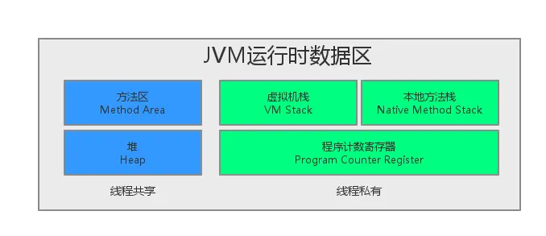
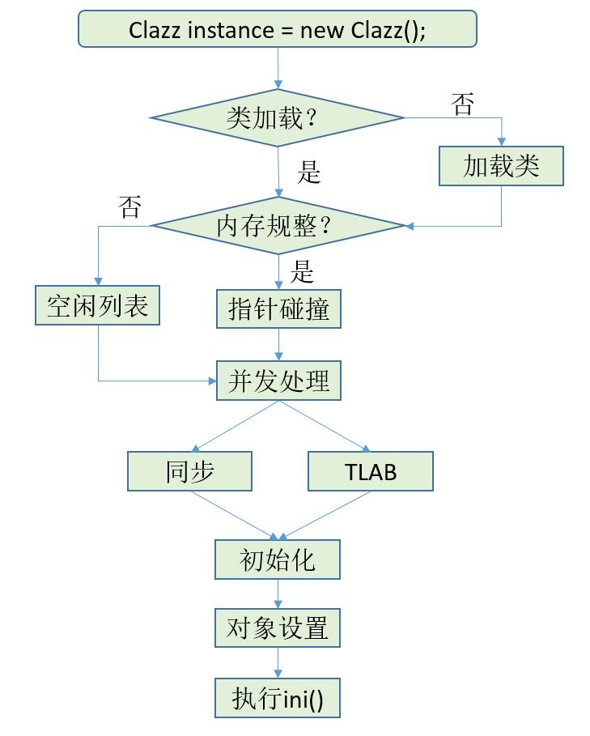
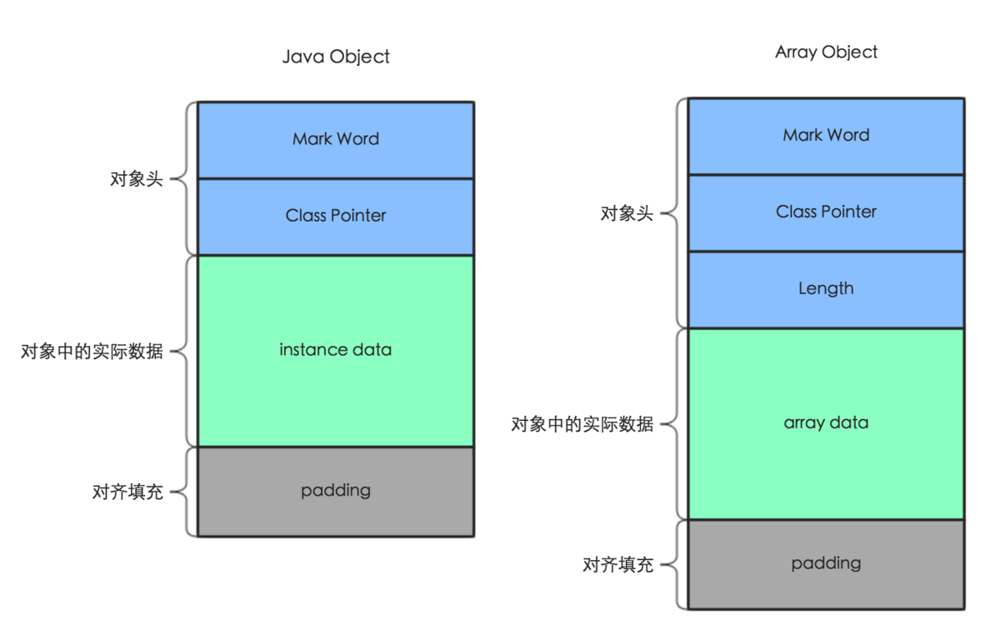
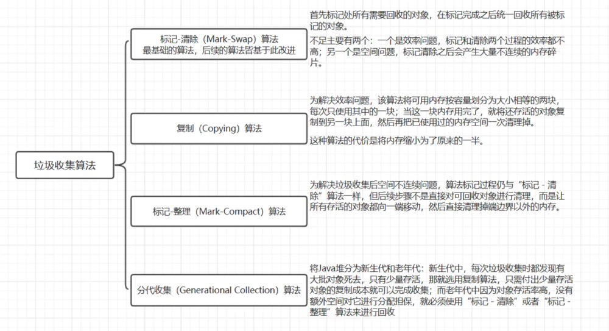
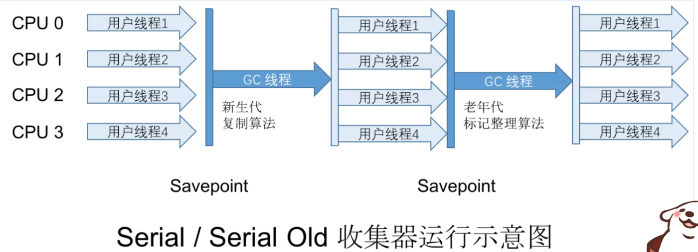
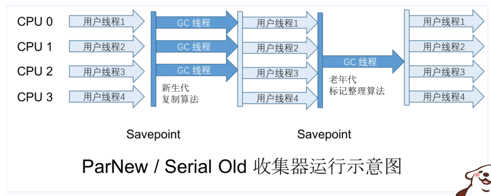
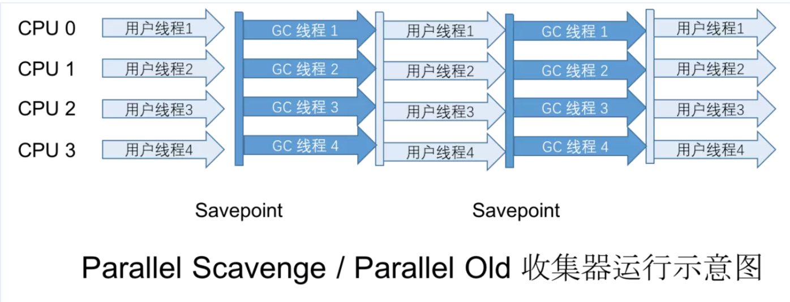
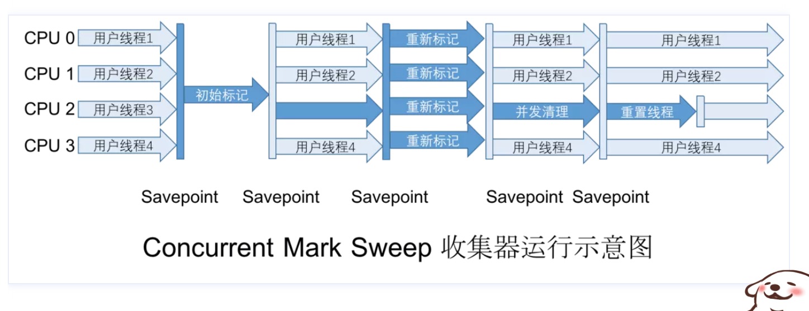
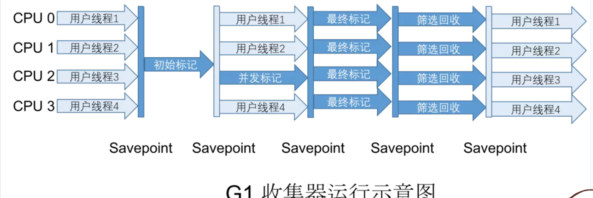
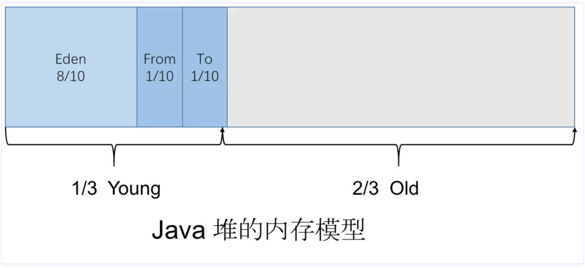

(PS：扫描首页里面的二维码进群，分享我自己在看的技术资料给大家，希望和大家一起学习进步！)

下面是主要是自己看了第三版的《深入理解Java虚拟机》后写的一些摘要，还没有进行整理，有点乱，之后会继续更新这一部分。


## 第二章 Java内存区域与内存溢出异常

### 2.2运行时数据区域

运行时数据区域包含以下五个区域：程序计数器，Java虚拟机栈，本地方法栈，堆，方法区（其中前三个区域各线程私有，相互独立，后面两个区域所有线程共享）


### 线程私用的部分(Java虚拟机栈,本地方法栈,程序计数器)

#### Java虚拟机栈

执行一个Java方法时，虚拟机都会创建一个栈帧，来存储局部变量表，操作数栈等，方法调用完毕后会对栈帧从虚拟机栈中移除。

局部变量表中存储了Java基本类型，对象引用（可以是对象的存储地址，也可以是代表对象的句柄等）和returnAddress类型（存储了一条字节码指令的地址）。
#### 本地方法栈

本地方法栈与Java虚拟机栈类似，只不过是执行Native方法（C++方法等）。

#### 程序计数器
计数器存储了当前线程正在执行的字节码指令的地址（如果是当前执行的是Native方法，那么计数器为空），字节码解释器就是通过改变计数器的值来选取下一条需要执行的字节码指令。程序计数器是线程私有的，便于各个线程切换后，可以恢复到正确的执行位置。

### 线程共享的部分(堆,方法区)
#### Java 堆

堆存储了几乎所有对象实例和数组，是被所有线程进行共享的区域。在逻辑上是连续的，在物理上可以是不连续的内存空间（在存储一些类似于数组的这种大对象时，基于简单和性能考虑会使用连续的内存空间）。

#### 方法区
存储了被虚拟机加载的类型信息，常量，静态变量等数据，在JDK8以后，存储在元空间中（以前是存储在堆中的永久代中，JDK8以后已经没有永久代了）。

运行时常量池是方法区的一部分，会存储各种字面量和符号引用。具备动态性，运行时也可以添加新的常量入池（例如调用String的intern()方法时，如果常量池没有相应的字符串，会将它添加到常量池）。


### 直接内存区(不属于虚拟机运行时数据区)
直接内存区不属于虚拟机运行时数据区的一部分。它指的是使用Native方法直接分配堆外内存，然后通过Java堆中的DirectByteBuffer来对内存的引用进行操作（可以避免Java堆与Native堆之间的数据复制，提升性能）。

### 2.3 HotSpot虚拟机对象探秘
### 对象的创建过程

这是网上看到的一张流程图：



#### 1.类加载检查

首先代码中new关键字在编译后，会生成一条字节码new指令，当虚拟机遇到一条字节码**new**指令时，会根据类名去方法区**运行时常量池**找类的**符号引用**，检查符号引用代表的类是否已加载，解析和初始化过。如果没有就执行相应的**类加载**过程。

#### 2.分配内存

虚拟机从Java堆中分配一块大小确定的内存（因为类加载时，创建一个此类的实例对象的所需的内存大小就确定了），并且初始化为零值。内存分配的方式有**指针碰撞**和**空闲列表**两种，取决于虚拟机采用的垃圾回收期是否带有空间压缩整理的功能。

##### 指针碰撞

如果垃圾收集器是Serial，ParNew等带有空间压缩整理的功能时，Java堆是规整的，此时通过移动内存分界点的指针，就可以分配空闲内存。

##### 空闲列表

如果垃圾收集器是CMS这种基于清除算法的收集器时，Java堆中的空闲内存和已使用内存是相互交错的，虚拟机会维护一个列表，记录哪些可用，哪些不可用，分配时从表中找到一块足够大的空闲内存分配给实例对象，并且更新表。

#### 3.对象初始化（虚拟机层面）
虚拟机会对对象进行必要的设置，将对象的一些信息存储在Obeject header 中。

#### 4.对象初始化（Java程序层面）
在构造一个类的实例对象时，遵循的原则是先静后动，先父后子，先变量，后代码块，构造器。在Java程序层面会依次进行以下操作：
* 初始化父类的静态变量（如果是首次使用此类）

* 初始化子类的静态变量（如果是首次使用此类）

* 执行父类的静态代码块（如果是首次使用此类）

* 执行子类的静态代码块（如果是首次使用此类）

* 初始化父类的实例变量

* 初始化子类的实例变量

* 执行父类的普通代码块

* 执行子类的普通代码块

* 执行父类的构造器

* 执行子类的构造器

#### PS:如何解决内存分配时的多线程并发竞争问题？

  内存分配不是一个线程安全的操作，在多个线程进行内存分配是，可能会存在数据不同步的问题。所以有两种方法解决：

  ##### 添加CAS锁

  对内存分配的操作进行同步处理，添加CAS锁，配上失败重试的方式来保证原子性。（默认使用这种方式）。

##### 预先给各线程分配TLAB

  预先在Java堆中给各个线程分配一块TLAB（本地线程缓冲区）内存，每个线程先在各自的缓冲区中分配内存，使用完了再通过第一种添加CAS锁的方式来分配内存。（是否启动取决于-XX：+/-UseTLAB参数）。

###  对象的内存布局是怎么样的？

对象在内存中存储布局主要分为对象头，实例数据和对齐填充三部分。

这是网上看到的一张图：



#### 对象头

对象头主要包含对象自身的运行时数据(也就是图中Mark Word)，类型指针(图中的Class Pointer，指向对象所属的类)。如果对象是数组，还需要包含数组长度(否则无法确定数组对象的大小)。

**Mark Word**：存储对象自身的运行时数据，例如hashCode，GC分代年龄，锁状态标志，线程持有的锁等等。在32位系统占4字节，在64位系统中占8字节。

 **Class Pointer**：用来指向对象对应的Class对象（其对应的元数据对象）的内存地址。在32位系统占4字节，在64位系统中占8字节。

 **Length**：如果是数组对象，还有一个保存数组长度的空间，占4个字节。

#### 实例数据

保存对象的非静态成员变量数据。

#### 对齐填充

因为HotSpot虚拟机的自动内存管理系统要求对象起始地址是8字节的整数倍，所以任何对象的大小必须是8字节的整数倍，而对象头部分一般是8字节的倍数，如果实力数据部分不是8字节的整数倍，需要对齐填充来补全。

#### 对象的访问定位

根据对象的引用去访问的对象的方式有通过句柄访问和之间指针访问两种。

* 通过句柄访问

  Java堆中有一块内存作为句柄池，每个句柄包含了对象的实例数据地址和类数据地址，对象的引用保存的是句柄地址，通过句柄再去访问对象。这种方式的好处是在垃圾回收时，移动对象时，对象的引用保存的地址不用变化，只需要改变句柄中保存的实例数据地址。

* 直接指针访问(HotSpot虚拟机的主要使用方式)

  这种方式，对象引用保存的地址是对象的地址，根据对象引用可以直接访问对象，节省了一次指针定位的时间开销，速度更快。

## 第3章 垃圾收集器和内存分配策略
因为程序计数器，虚拟机栈，本地方法栈都是线程私有的，生命周期与线程相同，当方法执行完或者线程结束时，内存就回收了，所以这三个内存区域的内存回收具备确定性，而堆和方法区的内存回收存在不确定性，所以需要垃圾收集器进行管理。
### 垃圾回收的几种算法
#### 引用计数法
每个对象有一个引用计数，当其他对象引用这个对象时，该对象的引用计数+1，当其他对象不再引用这个对象时，引用计数-1。当引用计数为0时，垃圾回收器可以对对象进行回收。

缺点在于需要大量额外处理才能保证正确地工作，例如单纯的引用计数没有办法解决循环引用的问题。

#### 可达性分析算法

根据一系列GC Roots对象作为起始点，从这些节点根据引用关系向下搜索，走过的路径是引用链，如果一个对象没有被任何引用链相连，说明是不可达的，也就是不可能被使用的，会被判定为可回收的对象。


GC Roots对象只有包括以下几种：

* 虚拟机栈(栈帧中的本地变量表)引用的对象。例如方法的传参，局部变量等。

* 方法区中类的静态变量引用的对象。

* 方法区中常量引用的对象。例如字符串常量池中的引用。

* 本地方法栈中的引用的对象。

* Java虚拟机内部的引用，例如基本数据类型对应的Class对象，常驻的异常对象（NullPointException等）

* 被同步锁（sychronized关键字修饰）持有的对象。

  除此以外，根据用户所选用的垃圾回收器以及当前回收的内存区域的不同，还可以将其他对象临时性加入，共同构成GC Roots集合，辅助内存回收。（例如回收新生代内存时，可以将一些关联区域的对象一并加入GC Roots集合中去。）

### 对象的强引用，软引用，弱引用和虚引用

##### 强引用

  就是普通的变量对对象的引用，强引用的对象不会被系统回收。

  ##### 软引用

  当内存空间足够时，软引用的对象不会被系统回收。当内存空间不足时，软引用的对象可能被系统回收。通常用于内存敏感的程序中。

  ##### 弱引用

  引用级别比软引用低，对于只有软引用的对象，不管内存是否足够， 都可能会被系统回收。

  ##### 虚引用

  虚引用主要用于跟踪对象被垃圾回收的状态，不能单独使用，必须和引用队列联合使用。

##### finalize()方法

第一次标记

垃圾回收器对对象进行可达性分析之后，发现没有任何于GCRoots连接的引用链引用着对象，会将对象进行**第一次标记**，

第二次标记

* 如果对象有覆写finalize()方法

  会将对象添加到F-Queue队列中，让由一条虚拟机创建的、低调度优先级的线程去执行finalize()方法（不一定会等待运行结束，防止其他对象处于长时间的等待）。如果在finalize方法中，成功得让对象与引用链上的人格对象简历了关联，那么会被移除“即将回收”的集合，否则会被**第二次标记**。

* 如果对象没有覆写finalize()方法，或者finalize()方法已被调用，那么会对对象进行**第二次标记**，稍后对象会被回收。

#### 回收方法区

回收方法区主要是回收不再使用的常量和不再使用的类型。

不再使用的类型需要满足三个条件：

* 类的所有的实例都已被回收。
* 加载此类的类加载器已被回收。
* 类的方法无法再通过反射调用。(类对应的java.lang.Class对象没有在任何地方被引用。）

## 垃圾回收算法

**弱分代假说**

绝对大多数对象都是朝生夕灭。

**强分代假说**

熬过越多次垃圾收集过程的对象就越难以消灭。

基于这两个假说，Java虚拟机一般会分为新生代和老年代，然后根据区域内对象的特性，采用不通的垃圾回收算法。

**跨代引用假说**

相比同代引用，跨代引用占极少数，所以不需要为了少量跨代引用，在回收新生代时去扫描整个老年代，只需要在新生代简历一个记忆集，将老年代化粪池多个小块，标识出哪一块内存存在跨代引用。

垃圾回收算法一般有四种



#### 标记-清除算法

就是对要回收的对象进行标记，标记完成后统一回收。（CMS垃圾收集器使用这种）

缺点：

**效率不稳定**

执行效率不稳定，有大量对象时，并且有大量对象需要回收时，执行效率会降低。

**内存碎片化**

内存碎片化，会产生大量不连续的内存碎片。（内存碎片只能通过使用分区空闲分配链表来分配内存）

#### 标记-复制算法

就是将内存分为两块，每次只用其中一块，垃圾回收时将存活对象，拷贝到另一块内存。（serial new，parallel new和parallel scanvage垃圾收集器）

缺点：

**不适合存活率高的老年代**

存活率较高时需要很多复制操作，效率会降低，所以老年代一般不使用这种算法。

**浪费内存**

会浪费一半的内存，

解决方案是新生代的内存配比是Eden:From Survivor: To Survivor = 8:1:1

每次使用时，Eden用来分配新的对象，From Survivor存放上次垃圾回收存活的对象，只使用Eden和From Survivor的空间，To Survivor是空的，垃圾回收时将存活对象拷贝到To Survivor，当空间不够时，从老年代进行分配担保。

####标记-整理算法

就是让存活对象往内存空间一端移动，然后直接清理掉边界以外的内存。（parallel Old和Serial old收集器就是采用该算法进行回收的）

**吞吐量高**

移动时内存操作会比较复杂，需要移动存活对象并且更新所有对象的引用，会是一种比较重的操作，但是如果不移动的话，会有内存碎片，内存分配时效率会变低，所以由于内存分配的频率会比垃圾回收的频率高很多，所以从吞吐量方面看，标记-整理法高于标记-清除法，所以强调高吞吐量的Parallel Scavenge收集器是采用标记整理法。

**延迟高**

但是由于需要移动对象，停顿时间会比较长，垃圾回收时延迟会高一些，强调低延迟的CMS收集器一般是大部分时候用标记-清除算法，当内存碎片化程度达到一定程度时，触发Full GC，会使用标记-整理算法清理一次。

#### 分代收集算法

就是现在的系统一般都比较复杂，堆中的对象也会比较多，如果使用对所有对象都分析是否需要回收，那么效率会比较低，所以有了分代收集算法，就是对熬过垃圾回收次数不同的对象进行分类，分为新生代和老年代，采用不同回收策略。

新生代存活率低，使用标记-复制算法。新生代发生的垃圾收集交Minor GC，发生频率较高

老年代存活率高，使用标记-清除算法，或者标记-整理算法。（一般是多数时间采用标记-清除算法，内存碎片化程度较高时，使用标记-整理算法收集一次）。老年代内存满时会触发Major GC（Full GC），一般触发的频率比较低。

### HotSpot的算法实现

#### 枚举根节点

目前的垃圾收集器都是准确式的GC，就是当用户线程停顿下来时，进行垃圾回收时，不需要检查完所有的执行上下文（栈中的本地变量表）和全局性引用（常量，类静态变量）。在编译时，会通过一个OopMap数据结构在特定位置记录下栈和寄存器里哪些位置是引用。

#### 安全点

不可能给每条指令都生成OopMap，只能选定一些“可以让程序长时间运行”的指令作为安全点，在安全点生OopMap。安全点一般是指令会重复使用的指令，方法调用，循环跳转等。

垃圾收集时会让所有线程跑到最近的安全点去，然后停顿，实现方式有两种：

抢先式中断：将所有用户线程中断，当一些线程中断的地方不是安全点时，恢复这些线程，执行到安全点，然后再中断。

主动式中断：线程在执行过程中会去轮询一个标志，当需要垃圾收集时，会对这个标志设置

，然后线程会执行到最近的安全点然后中断中断挂起。

##### 安全区域

在一个代码片段中，引用关系不会变化，那么在这个区域进行垃圾收集都是安全的。虚拟机进行垃圾收集时就不用管这些处于安全区域的线程，线程要离开安全区域时会检查虚拟机是否完成了根节点美剧，完成了，那么就继续执行，否则进行等待，直到收到可以离开安全区域的信号。（典型的场景是用户线程处于Sleep或者Block状态。）

#### 记忆集

一种记录从非收集区域指向收集区域的指针集合的抽象数据结构。卡表就是记忆集的一种具体实现，卡表可以是一个字节数组，每个元素指向一个内存块，也就是卡页。卡页中通常包含很多个对象，当一个对象存在跨代指针时，就将对应卡表的数组元素值标记为1。垃圾回收时只会扫描这些标识为1的卡页。

#### 写屏障

写屏障可以看成是在虚拟机层面对引用类型字段赋值操作的AOP切面，就是虚拟机会对所有赋值操作生成相应的指令，在赋值前后对卡表进行更新。

##### 伪共享

CPU中的缓存系统是以缓存行为单位存储的，一个缓存行会包含多个变量，多线程修改相互独立的变量时，如果这些变量在共享一个缓存行，那么性能就会受影响。在更新卡表时为了避免伪共享问题，在对卡表元素进行标记时，如果已标记，就不进行标记操作了。

#### 并发可达性分析

在垃圾收集的过程中，用户线程可以和收集线程并发工作，垃圾收集器在进行根节点枚举时，会对对象进行标记：

白色，未被扫描到（代表不可达）

黑色，被扫描到，且对象所有的引用也被扫描到了（代表安全存活）

灰色：对象正在被扫描（中间态）

在扫描过程中，用户线程也会进行工作，可能会对引用进行更改，为了保持一致性有两种解决方案：

原来是B引用C，垃圾收集过程中，去掉B对C的引用，改为A引用C

增量更新，就是在更改引用关系时，将更改后的引用关系进行记录，扫描结束后对这些记录重新扫描。这个例子中会对A标记为灰色，进行记录，扫描结束后对A进行再扫描。

原始快照，就是在更改引用关系时，将原来的引用关系进行记录，扫码结束后对这些记录重新扫描。这个例子中会将原始的引用B-C记录下来，扫描结束后，重新扫描B。

#### 经典的垃圾收集器

[Java虚拟机（五）经典的垃圾收集器](http://antarctica.gitee.io/blog/2020/01/12/Java%E8%99%9A%E6%8B%9F%E6%9C%BA5/#%E5%9E%83%E5%9C%BE%E6%94%B6%E9%9B%86%E5%99%A8](http://antarctica.gitee.io/blog/2020/01/12/Java虚拟机5/#垃圾收集器)

#### Serial收集器（标记-复制算法）

就是最简单的垃圾收集器，也是目前 JVM 在 Client 模式默认的垃圾收集器，在进行垃圾收集时会停止用户线程，然后使用一个收集线程进行垃圾收集。主要用于新生代，使用标记-复制算法。

优点是简单高效（与其他收集器的单线程比），内存占用小，因为垃圾回收时就暂停所有用户线程，然后使用一个单线程进行垃圾回收，不用进行线程切换。

缺点是收集时必须停止其他用户线程。

#### Serial Old收集器（标记-整理算法）

跟Serial收集器一样，不过是应用于老年代，使用标记-整理算法。



#### ParNew收集器（标记-复制算法）

ParNew收集器是Serial收集器的多线程并行版本，在进行垃圾收集时可以使用多个线程进行垃圾收集。

与Serial收集器主要区别就是支持多线程收集，ParNew收集器应用广泛（JDK9以前，服务端模式垃圾收集组合官方推荐的是ParNew+CMS），因为只有Serial和ParNew才能配合CMS收集器(应用于老年代的并发收集器)一起工作。



#### Parallel Scanvenge收集器（吞吐量优先收集器）

也支持多线程收集，它的目标是达到一个可控制的吞吐量，就是运行用户代码的时间/CPU消耗的总时间的比值。高吞吐量可以最高效率地利用处理器资源，尽快完成程序运算任务，适合不需要太多的交互分析任务。

#### Parallel Old收集器

是Parallel Scanvenge老年代版本，支持多线程收集，使用标记整理法实现的，



#### CMS 收集器（老年代并发低停顿收集器）

CMS收集器是第一个支持并发收集的垃圾收集器，在垃圾收集时，用户线程可以和收集线程一起工作，它的执行目标是达到最短回收停顿时间，以获得更好的用户体验。

CMS英文是Concurrent Mark Sweep，是基于标记-清除法实现的，步骤如下：

初始标记：标记那些GC Roots可以直接关联到的对象。

并发标记：从GC Roots能关联到的对象直接向下遍历整个对象图，耗时较长，但是可以与用户线程并发执行。

重新标记：由于标记时，用户线程在运行，并发标记阶段存在一些标记变动的情况，这一阶段就是修正这些记录。(CMS采用增量更新算法来解决，主要是将更改后的引用关系记录，之后增量更新)

并发清除：清除标记阶段判断的已经死亡的对象，由于不需要移动存活对象，这个阶段也可以与用户线程并发执行。



#### G1收集器（Garbage First收集器，标记-整理算法，老年代，新生代都进行回收）

目标是在延迟可控(用户设定的延迟时间)的情况下获得尽可能高的吞吐量。

JDK9以前，服务端模式默认的收集器是Parallel Scavenge+Parallel Old，JDK9之后，默认收集器是G1。G1不按照新生代，老年代进行划分，而是将Java堆划分为多个大小相等的独立Region，每一个Region可以根据需要，扮演新生代的Eden空间，Survivor空间，老年代空间，回收思路是G1持续跟踪各个Region的回收价值（回收可释放的空间和回收所需时间），然后维护一个优先级列表，在用户设定的最大收集停顿时间内，优先回收那些价值大的Region。

Region如何解决跨代指针

使用记忆集，普通的记忆集只会标记那些卡表中那些卡页中存在对象被非收集区域引用，从而将这个卡页标记为脏，扫描时作为GC Roots扫描，这里的记忆集是一个哈希表，key是其他Region的起始地址，Value是一个集合，里面是卡表的索引号。

收集步骤

**初始标记** 只标记GC Roots直接引用的对象

**并发标记** 从GC Roots开始对堆中对象进行可达性分析，扫描整个对象图，找出要回收的对象。（可以与用户线程并发执行）

**最终标记** 对并发标记阶段，由于用户线程执行造成的改动进行修正，使用原始快照方法。

**筛选回收** 对Region进行排序，根据回收价值，选择任意多个Region构成回收集，将存活对象复制到空的Region中去，因为涉及到存活对象的移动，所以是暂停用户线程的。





shenandoah和ZGC都是处于实验阶段的垃圾收集器

### 内存分配和回收策略



Serial收集器中，

##### 新生代

分为Eden，From Survivor，To Survivor，8：1：1

Eden用来分配新对象，满了时会触发Minor GC。

From Survivor是上次Minor GC后存活的对象。

To Survivor是用于下次Minor GC时存放存活的对象。

##### 老年代

用于存放存活时间比较长的对象，大的对象，当容量满时会触发Major GC（Full GC）

##### 1.对象优先在Eden分配

对象优先在Eden分配，Eden空间不够时触发Minor GC

##### 2.大对象直接进入老年代

为了避免大对象在Eden和两个Survivor区之间进行来回复制，所以当对象超过-XX:+PrintTenuringDistribution参数设置的大小时，直接从老年代分配、

##### 3.长期存活的对象将进入老年代

当对象经历的Minor GC次数大于XX:MaxTenuringThreshold参数设置的次数时，在Minor GC时进入老年代（默认是15）。

##### 4.动态对象年龄判定

同年龄的对象大小总和超过Survivor区空间的一半时，年龄大于或等于该年龄的对象可以直接进入老年代。

##### 5.空间分配担保

在JDK6以后，只要老年代连续空间大于新生代对象总大小或者历次进入老年代的大小，就会进行Minor GC，否则进入Full GC（收集整个Java 堆和方法区的垃圾）。

### 类文件结构

每个Java文件对应一个类或者接口，编译后，转换成class文件，

每个class文件由魔数CAFEBABE+class文件版本号（四字节）+常量池等等

class中数据结构分为两种

无符号数：也就是基本数据类型，可以描述数字，索引，数量值，字符串值等。以u1，u2，u4，u8分别代表1，2，4，8个字节

表：由多个无符号数，其他表作为数据项构成的复合数据类型

### 类加载


将描述类的数据从class文件加载到内存，并对数据进行校验，转换解析和初始化，变成虚拟机可以直接使用的java类型的过程。

类的生命周期是加载，验证，准备，解析(也有可能在初始化后执行)，初始化，使用，卸载。

第一次用到某个类被主动引用时，一般是以下六种情况：

1.遇到new(使用new构造对象)，getstatic(读取静态变量)，putstatic(设置静态变量)，invokestatic(调用静态方法)四条字节码指令时。

2.使用java.lang.reflect包中的方法对类型进行发射调用。

3、初始化一个类时，其父类还没有初始化，触发父类的初始化。（接口初始化时，不需要接口的父类初始化，用到时才会初始化）

4.虚拟机启动时，会初始化指定的主类。

5.JDK7之后的动态语言支持。

6.JDK8之后的默认方法（接口中被default修饰的方法），实现类初始化时，接口要在之前进行初始化。

当类是被动引用时，不会触发初始化：

1.通过子类去调用父类的静态变量，SubClass.fatherStaticValue

2.通过数组定义类引用类，SuperClass[] array = new SuperClass[10];

不会触发SuperClass类的初始化，但是执行字节码指令newarray会触发另外一个类[Lorg.fenixsoft.classloading.SuperClass的初始化，这个类继承于Object类，是一个包装类，里面包含了访问数组的所有方法，

3.只引用类的常量不会触发初始化,因为常量在编译阶段进入常量池

```java
class SuperClass {
		public static final String str = "hello";
}

//引用常量编译时会直接存入常量池
System.out.println(SuperClass.str);

```

#### 加载

类加载的第一步是加载，主要包含三个步骤：

1.根据类的全名去获取类的二进制字节流（可以从class文件获取，也可也从网络获取，例例如Web Applet，也可以运行时生成，例如动态代理技术）

2.将字节流所存储的静态存储结构转化为方法区的运行时数据结构。

3.从内存中生成一个代表此类的java.lang.Class对象，作为方法区中类的各种数据访问入口。

普通类的加载阶段可开发性很强，可以使用虚拟机内置的类加载器来完成，也可以使用自定义的类加载器去完成（重写类加载器的findClass()或loadClass()方法）。数组类不通过类加载器创建，是直接在内存中动态构造出来的。加载阶段可能会与连接阶段交叉进行，就是加载还没有完成时，连接阶段已经开始。

#### 验证

确保Class文件中的字节流包含的信息符合JAVA规范，不会危害到虚拟机的安全。

主要有

1.文件格式验证（字节流是不是魔数开头，主次版本号是否在可接受范围内）

2.元数据验证（主要是语义分析，检查是否符合Java的语法，是否每个类都有父类什么的)

3.字节码验证（确定程序语义是合法的，例如跳转指令不会跳转到方法体以外的字节指令上）

4.符号引用验证(将符号引用转换为直接引用的过程，在解析阶段发生，为了保证正常解析，在这里对类的符号引用进行匹配性校验，例如找不到引用的外部类)

#### 准备

为类的静态变量分配内存，赋初值的阶段。

```java
public static int value = 123;//准备阶段会给value赋初值0，在初始化阶段，执行<clinit>()方法时才会赋值123

public static final int value = 123;//准备阶段就赋初值123
```

#### 解析

解析不一定是在类加载时执行，也有可能是只会用到时才执行。就是将常量池中的符号引用替换为直接引用的过程。符号引用其实就是从Class文件中加载出来的字符串，本身没有跟真正的类，方法进行关联。主要是针对类，接口，字段，类方法，接口方法，方法类型，方法句柄。

https://www.zhihu.com/question/30300585

**符号引用**：用一组符号来描述所引用的目标，其实就是在Java中调用一个方法，转换为class字节码以后，是这样的

```
CONSTANT_Methodref_info {
    u1 tag;//tag代表常量池数据类型
    u2 class_index;//类索引
    u2 name_and_type_index;//方法名称索引
}
```

例如调用X类的foo()方法中会调用bar()方法，
Java代码如下：
```java
public class X {
  public void foo() {
    bar();
  }

  public void bar() { }
}
```
编译后的Class文件如下：
```java
Classfile /private/tmp/X.class
  Last modified Jun 13, 2015; size 372 bytes
  MD5 checksum 8abb9cbb66266e8bc3f5eeb35c3cc4dd
  Compiled from "X.java"
public class X
  SourceFile: "X.java"
  minor version: 0
  major version: 51
  flags: ACC_PUBLIC, ACC_SUPER
Constant pool:
   #1 = Methodref          #4.#16         //  java/lang/Object."<init>":()V
   #2 = Methodref          #3.#17         //  X.bar:()V
   #3 = Class              #18            //  X
   #4 = Class              #19            //  java/lang/Object
   #5 = Utf8               <init>
   #6 = Utf8               ()V
   #7 = Utf8               Code
   #8 = Utf8               LineNumberTable
   #9 = Utf8               LocalVariableTable
  #10 = Utf8               this
  #11 = Utf8               LX;
  #12 = Utf8               foo
  #13 = Utf8               bar
  #14 = Utf8               SourceFile
  #15 = Utf8               X.java
  #16 = NameAndType        #5:#6          //  "<init>":()V
  #17 = NameAndType        #13:#6         //  bar:()V
  #18 = Utf8               X
  #19 = Utf8               java/lang/Object
{
  public X();
    flags: ACC_PUBLIC
    Code:
      stack=1, locals=1, args_size=1
         0: aload_0       
         1: invokespecial #1                  // Method java/lang/Object."<init>":()V
         4: return        
      LineNumberTable:
        line 1: 0
      LocalVariableTable:
        Start  Length  Slot  Name   Signature
               0       5     0  this   LX;

  public void foo();
    flags: ACC_PUBLIC
    Code:
      stack=1, locals=1, args_size=1
         0: aload_0       
         1: invokevirtual #2                  // Method bar:()V
         4: return        
      LineNumberTable:
        line 3: 0
        line 4: 4
      LocalVariableTable:
        Start  Length  Slot  Name   Signature
               0       5     0  this   LX;

  public void bar();
    flags: ACC_PUBLIC
    Code:
      stack=0, locals=1, args_size=1
         0: return        
      LineNumberTable:
        line 6: 0
      LocalVariableTable:
        Start  Length  Slot  Name   Signature
               0       1     0  this   LX;
}
```
java代码中的` bar();`转换为字节码后是
`[B6] [00 02]`翻译过来其实是`invokevirtual #2`
B6是invokevitual指令的操作码，02是常量池中下标为2的常量项。
而下标为2的常量项是`#3.#17`，也就是`X.bar:()V`,这就是符号引用，解析后会转换为直接引用，就是虚方法表的下标和参数个数，
`[B6] [00 02]` 翻译结果`invokevirtual #2`
转换为直接引用后就是
`[D6] [06] [01]`翻译结果invokevirtual_quick vtable_index=6, args_size=1，也就是执行虚方法表里面偏移量为6的方法，参数个数为1（每个实例方法都有一个隐藏参数，也就是当前对象）。
所以JVM在执行invokevirtual_quick要调用X.bar()时，只要顺着对象引用查找到虚方法表，然后从中取出第6项的methodblock\*，就可以找到实际应该调用的目标然后调用过去了。

**直接引用**：可以直接指向目标的指针，相对偏移量或者是句柄。

**方法解析**的过程：首先根据类索引class_index来找到所属的类，然后查找方法，如果又找到，那么就返回直接引用，找不到就去父类里面找，找到了返回直接引用。如果还没有找到就去实现的接口和父接口里面找，找到了说明类C是个抽象类，抛出AbstractMethodError异常，否则查找失败，抛出NoSuchMethodError。

大致过程是：找到类->从当前类中->从父类中找->从实现的接口，父接口里面找

**字段解析**

大致过程是：找到类->从当前类中->从接口中找->从父类中找

当某个同名字段同时出现在父类，接口中，会编译时报错，实际上解析是可以按顺序解析的。

#### 初始化

初始化的过程其实就是执行类构造器<clinit()方法的过程，clinit方法是编译器自动收集类静态变量的赋值操作，静态代码块的执行语句(按照编写顺序)合并而成的。

<clinit()方法不需要显式调用父类的构造函数，但是因为总是先加载父类，再加载本类，所以在执行前，父类的<clinit()方法已经执行完毕。

多线程去加载同一个类时，会加同步锁，保证只执行一次。

### 类加载器

两个类相等，除了本身相等以外，必须被同一个类加载器加载才算相等。Class对象的equals()方法，isAssignbleFrom()方法(判断是否是相同类或者子类)，isInstance()方法，instanceof关键字返回结构都是需要考虑类加载器的。

三层类加载器

**启动类加载器**：主要是在加载JAVA_HOME/lib目录下的特定名称jar包，例如rt.jar包，像java.lang就在这个jar包中。

**扩展加载器**：主要是加载JAVA_HOME/lib/ext目录下的具备通用性的类库。

**应用程序加载器**：加载用户类路径下所有的类库，也就是程序中默认的类加载器。

##### 双亲委派机制（Parents Delegation Model）

启动类加载器<-扩展类加载器<-应用程序加载器

要求除启动类加载器以外，其他加载器都要有自己的父类加载器（父子关系通过组合设计模式来实现），如果一个类加载器收到类加载请求时，先检查是否已经加载过了，没有首先会调用父类的loadClass方法，将请求委派给父类加载器(没有父类加载器就委派给启动类加载器)，父类加载器无法完成时，子加载器尝试自己去加载。

目的是为了保证每个类只加载一次，并且是由特定的类加载器进行加载（都是首先让启动类来进行加载）。

```java
public abstract class ClassLoader {
    ...
    public Class<?> loadClass(String name) throws ClassNotFoundException {
        return loadClass(name, false);
    }
    protected Class<?> loadClass(String name, boolean resolve)
        throws ClassNotFoundException {
        synchronized (getClassLoadingLock(name)) {
            Class<?> c = findLoadedClass(name);
            if (c == null) {
                ...
                try {
                    if (parent != null) {
                        c = parent.loadClass(name, false);
                    } else {
                        c = findBootstrapClassOrNull(name);
                    }
                } catch (ClassNotFoundException e) {
                }

                if (c == null) {
                    ...
                    c = findClass(name);
                    // do some stats
                    ...
                }
            }
            if (resolve) {
                resolveClass(c);
            }
            return c;
        }
    }
    protected Class<?> findClass(String name) throws ClassNotFoundException {
        throw new ClassNotFoundException(name);
    }
    ...
}
```

### 怎么自定义一个类加载器？

加载一个类时，一般是调用类加载器的loadClass()方法来加载一个类，loadClass()方法的工作流程如下：

1.先调用findLoadedClass(className)来获取这个类，判断类是否已加载。

2.如果未加载，如果父类加载器不为空，调用父类加载器的loadClass()来加载这个类，父类加载器为空，就调用父类加载器加载这个类。

3.父类加载器加载失败，那么调用该类加载器findClass(className)方法来加载这个类。

所以我们我们一般自定义类加载器都是继承ClassLoader，来重新findClass()方法，来实现类加载。

```java
public class DelegationClassLoader extends ClassLoader {
  private String classpath;

  public DelegationClassLoader(String classpath, ClassLoader parent) {
    super(parent);
    this.classpath = classpath;
  }

  @Override
  protected Class<?> findClass(String name) throws ClassNotFoundException {
    InputStream is = null;
    try {
      String classFilePath = this.classpath + name.replace(".", "/") + ".class";
      is = new FileInputStream(classFilePath);
      byte[] buf = new byte[is.available()];
      is.read(buf);
      return defineClass(name, buf, 0, buf.length);
    } catch (IOException e) {
      throw new ClassNotFoundException(name);
    } finally {
      if (is != null) {
        try {
          is.close();
        } catch (IOException e) {
          throw new IOError(e);
        }
      }
    }
  }

  public static void main(String[] args)
      throws ClassNotFoundException, IllegalAccessException, InstantiationException,
      MalformedURLException {
    sun.applet.Main main1 = new sun.applet.Main();

    DelegationClassLoader cl = new DelegationClassLoader("java-study/target/classes/",
        getSystemClassLoader());
    String name = "sun.applet.Main";
    Class<?> clz = cl.loadClass(name);
    Object main2 = clz.newInstance();

    System.out.println("main1 class: " + main1.getClass());
    System.out.println("main2 class: " + main2.getClass());
    System.out.println("main1 classloader: " + main1.getClass().getClassLoader());
    System.out.println("main2 classloader: " + main2.getClass().getClassLoader());
    ClassLoader itrCl = cl;
    while (itrCl != null) {
      System.out.println(itrCl);
      itrCl = itrCl.getParent();
    }
  }
}
```