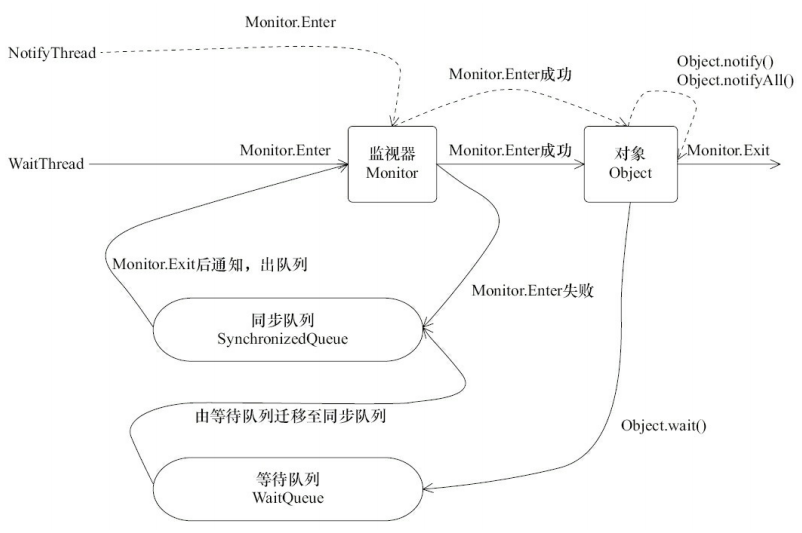
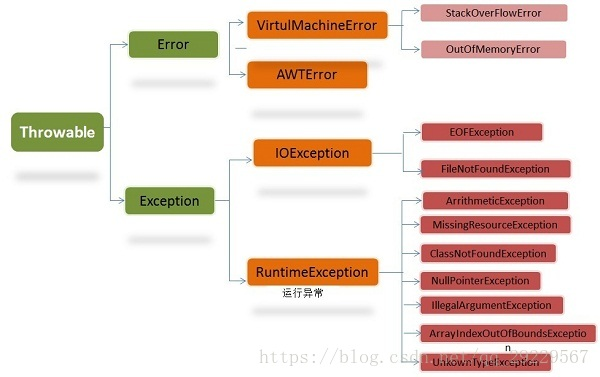

(PS：扫描[首页里面的二维码](README.md)进群，分享我自己在看的技术资料给大家，希望和大家一起学习进步！)

下面是主要是自己看了《疯狂Java讲义》后，学习到一些之前没掌握的技术点，写的解答，之后会继续更新和完善。

####  [1.Java中的多态是什么？](#Java中的多态是什么？)

#### [2.Java中变量，代码块，构造器之间执行顺序是怎么样的？](#java中变量，代码块，构造器之间执行顺序是怎么样的？)
#### [3.final关键字有哪些作用？](#final关键字有哪些作用？)

#### [4.Integer类会进行缓存吗？](#Integer类会进行缓存吗？)

#### [5.抽象类有哪些特点？](#抽象类有哪些特点？)

#### [6.String，StringBuffer和StringBuilder之间的区别是什么？](#String，StringBuffer和StringBuilder之间的区别是什么？)

#### [7.编译型编程语言，解释型编程语言，伪编译型语言的区别是什么？](#编译型编程语言，解释型编程语言，伪编译型语言的区别是什么？)

#### [8.Java中的访问控制符有哪些？](#Java中的访问控制符有哪些？)

#### [9.Java的构造器有哪些特点？](#Java的构造器有哪些特点？)

####  [10.Java中的内部类是怎么样的？](#Java中的内部类是怎么样的？)

####  [11.Java中的注解是什么？](#Java中的注解是什么)

#### [12.为什么hashCode()和equal()方法要一起重写？](#为什么hashCode()和equal()方法要一起重写？)

#### [13.Java中有哪些数据类型？](#Java中有哪些数据类型？)

#### [14.包装类型和基本类型的区别是什么？](#包装类型和基本类型的区别是什么？)


### Java中的多态是什么？

**多态**指的是相同类型的变量在调用同一个方法时呈现出多种**不同的行为特征**。而造成这一现象的原因在于Java中的变量有两个类型：

* 编译时类型，由声明变量时的类型决定。

* 运行时类型，由实际赋值给变量的对象的类型决定，

  当一个变量的两个类型不一致，就会出现多态。

```java
//BaseClass是SubClass的父类
BaseClass a = new BaseClass();
BaseClass b = new SubClass();
a.baseMethod()//变量a调用baseMethod()方法，实际上会调用BaseClass的baseMethod()方法,会打印111
b.baseMethod()//变量b调用baseMethod方法，实际上会调用SubClass的重写baseMethod()方法，会打印222
Class BaseClass {
  void baseMethod() {
    System.out.println("111");
  }
}
Class SubClass {
  void baseMethod() {
    System.out.println("222");
  }
}
输出结果：
111
222
```
例如这个例子中，

##### 对于变量a而言

a的**编译类型是BaseClass**，**实际类型也是BaseClass**，所以调用baseMethod()会执行BaseClass#baseMethod()方法，打印出111。

#####  对于变量b而言

b的的**编译类型是BaseClass**，但是实际赋值时，给变量b赋值的是SubClass对象，所以b的**实际类型是SubClass**。而SubClass重写了父类BaseClass#baseMethod()方法，所以调用baseMethod()方法会调用SubClass#baseMethod()，从而打印出222。

a和b的编译类型相同，却展现出了不同的行为特征，这就是多态。

（PS：如果直接对b调用只有SubClass有的方法，编译时会报错，但是可以通过反射进行调用。）

### Java中变量，代码块，构造器之间执行顺序是怎么样的？

Java程序中类中个元素的初始化顺序
初始化的原则是：

* 先初始化**静态**部分，再初始化**动态**部分，

* 先初始化**父类**部分，后初始化**子类**部分，

* 先初始化**变量**，再初始化**代码块**和**构造器**。

所以依照这个规则可以得出总体顺序是：

1.父类的静态成员变量（如果是第一次加载类）

2.父类的静态代码块（如果是第一次加载类）

3.子类的静态成员变量（如果是第一次加载类）

4.子类的静态代码块（如果是第一次加载类）

5.父类的普通成员变量

6.父类的动态代码块

7.父类的构造器方法

8.子类的普通成员变量

9.子类的动态代码块

10.子类的构造器方法

下面写了一个Demo进行验证:
```java
public class Base {
    static Instance staticInstance = new Instance("1---Base类的静态成员变量staticInstance");
    static  {
        System.out.println("2---Base类的静态代码块执行了");
    }
    Instance instance = new Instance("5---Base类的普通成员变量instance");
    {
        System.out.println("6---Base类的动态代码块执行了");
    }
    Base() {
        System.out.println("7---Base类的构造器方法执行了");
    }
}

public class Child extends Base {
    static Instance staticInstance = new Instance("3---Child类的静态成员变量staticInstance");
    static  {
        System.out.println("4---Child类的静态代码块执行了");
    }
    Instance instance = new Instance("8---Child类的普通成员变量instance");
    {
        System.out.println("9----Child类的动态代码块执行了");
    }
    Child() {
        System.out.println("10---Child类的构造器方法执行了");
    }
    public static void main(String[] args) {
        Child child = new Child();
    }
}
```

输出结果如下：

```
1---Base类的静态成员变量staticInstance进行了初始化
2---Base类的静态代码块执行了
3---Child类的静态成员变量staticInstance进行了初始化
4---Child类的静态代码块执行了
5---Base类的普通成员变量instance进行了初始化
6---Base类的动态代码块执行了
7---Base类的构造器方法执行了
8---Child类的普通成员变量instance进行了初始化
9----Child类的动态代码块执行了
10---Child类的构造器方法执行了
```

说明确实是按照上面的执行顺序执行的。

### final关键字有哪些作用？

##### 修饰类

final修饰类时，类不能被继承，并且类中的所有方法都被隐式地使用final修饰。

##### 修饰方法

final修饰方法时，有两个作用：

* 方法不能被子类重写。
* 可以让方法转换为内联调用，提升效率。（早期的Java版本是这样，最近的版本已经没有这些优化了，因为如果方法过大时，内嵌调用无法带来性能提升。）

* 修饰变量

  final修饰的变量一旦初始化，就不能被修改。当final修饰实例变量时，可以在在定义变量时赋初值，也可以在定义时不赋值，在动态代码块，或构造器中赋初值。（只能赋值一次）。
  
  如果final变量在声明时就指定了初始值，并且在编译时可以确定下来，那么在编译时，final变量本质上会变成一个宏变量，所有用到该变量的地方都直接替换成该变量的值。

### Integer类会进行缓存吗？

```java
Intger a =  new Integer(127);
Intger b = Interger.valueOf(127);
Intger c = Interger.valueOf(127);
Intger d = Interger.valueOf(128);
Intger e = Interger.valueOf(128);
System.out.println(a == b); //输出false
System.out.println(b == c); //输出true
System.out.println(d == e); //输出false
```

上面这种例子的原因是如果

* 通过new Interger()创建Interger对象，每次返回全新的Integer对象

* 通过Interger.valueOf()创建Interger对象，如果值在-128到127之间，会返回缓存的对象(初始化时)。

  ##### 实现原理

  Integer类中有一个静态内部类IntegerCach，在加载Integer类时会同时加载IntegerCache类，IntegerCache类的静态代码块中会创建值为-128到127的Integer对象，缓存到cache数组中，之后调用Integer#valueOf方法时，判断使用有缓存的Integer对象，有则返回，无则调用new Integer()创建。

  

  PS：（127是默认的边界值，也可以通过设置JVM参数java.lang.Integer.IntegerCache.high来进行自定义。）

```java
public static Integer valueOf(int i) {
    if (i >= IntegerCache.low && i <= IntegerCache.high)
    		//cache是一个Integer数组，缓存了-128到127的Integer对象
        return IntegerCache.cache[i + (-IntegerCache.low)];
		return new Integer(i);
}

//IntegerCache是Integer类中的静态内部类，Integer类在加载时会同时加载IntegerCache类，IntegerCache类的静态代码块中会
private static class IntegerCache {
        static final int low = -128;
        static final int high;
        static final Integer cache[];

        static {
            // 127是默认的边界值，也可以通过设置JVM参数java.lang.Integer.IntegerCache.high来进行自定义。
            int h = 127;
            String integerCacheHighPropValue =            sun.misc.VM.getSavedProperty("java.lang.Integer.IntegerCache.high");
            if (integerCacheHighPropValue != null) {
                try {
                    int i = parseInt(integerCacheHighPropValue);
                    i = Math.max(i, 127);
                    // cache数组的长度不能超过Integer.MAX_VALUE
                    h = Math.min(i, Integer.MAX_VALUE - (-low) -1);
                } catch( NumberFormatException nfe) {
                    // If the property cannot be parsed into an int, ignore it.
                }
            }
            high = h;

            cache = new Integer[(high - low) + 1];
            int j = low;
            for(int k = 0; k < cache.length; k++)
                cache[k] = new Integer(j++);
          
            // high值必须大于等于127，不然会抛出异常
            assert IntegerCache.high >= 127;
        }

        private IntegerCache() {}
    }
```

### 抽象类有哪些特点？

从多个具体的类中抽象出来的父类叫做抽象类，抽象类就像是一个模板。抽象类使用abstract关键字修饰，抽象类可以拥有抽象方法（使用abstract修饰的方法，由子类来提供方法的实现）。抽象类的特点如下：

1.可以包含抽象方法

抽象方法与普通方法的区别在于，抽象类不提供抽象方法的实现，由继承抽象类的子类实现抽象方法。

2.不能实例化

也正因为包含抽象方法，抽象类不能被实例化。抽象类的构造器不能用于创建实例，是仅提供给子类调用的。除此以外，抽象类跟普通类一样，可以拥有成员变量，普通方法，构造器，初始化块，内部类，枚举等。

3.抽象类可以被继承

继承抽象类的子类如果实现了所有抽象方法，那么可以作为普通类使用，否则也只能作为抽象类。

### String，StringBuffer和StringBuilder之间的区别是什么？

##### 1.可变性

String是一个不可变类，任何对String改变都是会产生一个新的String对象，所以String类是使用final来进行修饰的。而StringBuffer和StringBuilder是可变类，对应的字符串的改变不会产生新的对象。

##### 2.执行效率

当频繁对字符串进行修改时，使用String会生成一些临时对象，多一些附加操作，执行效率降低。

```java
stringA = StringA + "2";
//实际上等价于
{
  StringBuffer buffer = new StringBuffer(stringA)
  buffer.append("2");
  return buffer.toString();
}
```

在对stringA进行修改时，实际上是先根据字符串创建一个StringBuffer对象，然后调用append()方法对字符串修改，再调用toString()返回一个字符串。

##### 3.线程安全

StringBuffer的读写方法都使用了synchronized修饰，同一时间只有一个线程进行操作，所以是线程安全的，而StringBuilder不是线程安全的。

### Object类有哪些自带方法？

#### registerNatives()

首先Object类有一个本地方法registerNatives()，会在类加载时调用，主要是将Object类中的一些本地方法绑定到指定的函数中去，便于之后调用。例如将hashCode和clone本地方法绑定到JVM_IHashCode和JVM_IHashCode函数。

```java
    private static native void registerNatives();
    static {
        registerNatives();
    }
```

想深入了解的朋友可以看看这两篇文章：

[Java之Thread源码registerNatives()深入理解](https://juejin.im/post/5dbb959151882523b5402c8f)

[Object类中的registerNatives方法的作用深入介绍](https://blog.csdn.net/Saintyyu/article/details/90452826)

#### getClass()

**getClass()**方法会返回对象的**运行时**类。

```java
    public final native Class<?> getClass();
```

具体可以看下面这个例子:

有一个类Son，继承于Father类，instance的编译类型是Father，实际赋值的是一个Son对象，所以调用instance.getClass()获取的是instance对象的运行时类型，打印的类名是"com.test.Son"。

```java
  package com.test;
  class Father {}

  class Son extends Father {}
   
  Father instance = new Son();
  Class class1 = instance.getClass();
  System.out.println("class1 is"class1);
```
输出结果：
```java
class1 is class com.test.Son
```
##### Classs.forName()
与**getClass()**类似的方法还有两个，一个是Class类中的**forName()**方法，也是在**运行时**，根据传入的类名去加载类，然后返回与类关联的Class对象。也正是因为是动态加载，在编译时可以没有这个类，也不会对类名进行检验，所以有可能抛出ClassNotFoundException异常。

```java
public static Class<?> forName(String className)
                throws ClassNotFoundException {
        Class<?> caller = Reflection.getCallerClass();
        return forName0(className, true, ClassLoader.getClassLoader(caller), caller);
}
```
可以自己尝试运行一下这段代码
```java
  Class class2 = null;
  try {
  	class2 = Class.forName("com.test.Son");//如果实际不存在com.test.Son这个类，那么会抛出ClassNotFoundException异常
  	System.out.println(class2);
  } catch (ClassNotFoundException e) {
  	e.printStackTrace();
  }
```

```java
class2 is class com.test.Son
```
##### 类名+.class

还有一种方式是使用**类名+.class**来获取类关联的Class对象，与上面两种方法不同之处在于，它返回的是编译时类型，也就是在编译时，类加载器将类加载到JVM中，然后初始化一个Class对象返回。
```java
  Class class3 = Son.class;
  System.out.println(class3);
```
输出结果：
```java
	class3 is class com.test.Son
```

PS:无论是使用哪种方式来获取类关联的Class对象，类都是只会加载一次，如果获取Class对象时，不会重复加载类。

### 为什么hashCode()和equals()方法要一起重写？
#### hashCode()和equals()方法

可以看到Obejct类中的源码如下，可以看到equals()方法的默认实现是判断两个对象的内存地址是否相同来决定返回结果。

```java
    public native int hashCode();

    public boolean equals(Object obj) {
        return (this == obj);
    }
```

网上很多博客说hashCode的默认实现是返回内存地址，其实不对，以OpenJDK为例，hashCode的默认计算方法有5种，有返回随机数的，有返回内存地址，具体采用哪一种计算方法取决于运行时库和JVM的具体实现。(可以理解Object类hashCode默认实现是对所有对象返回的值都不一样。)

感兴趣的朋友可以看看这篇博客

[Java的Object.hashCode()的返回值到底是不是对象内存地址？](https://blog.csdn.net/xusiwei1236/article/details/45152201)

##### hashCode()方法的作用有哪些？

* 对对象做散列

  为了将一组键值对均匀得存储在一个数组中，HashMap对key的hashCode进行计算得到一个hash值，用hash对数组长度取模，得到数组下标，将键值对存储在数组下标对应的链表下。

* 快速判断对象是否不相等

  因为两个对象hashCode相等，调用equals()方法的结果不一定为true，

  因为两个对象调用equals()方法相等，hashCode一定相等。

  所以hashCode不相等可以作为两个对象不相等的快速判断条件。

  在往HashMap中添加一个键值对时，计算得到数组下标后，会遍历数组下标下存储的链表中，拿key的hashCode与每个节点的hashCode进行比较，相等时，才调用equals()方法进行继续调用，节约时间。（在一些类的equal()方法的自定义实现中也会对hashCode进行判断）。

##### 假如只重写hashCode()方法（结果：HashMap可以存在两个内存地址不相同，但是相等的对象，无法保证去重）

此时equals()方法的实现是默认实现，也就是当两个对象的内存地址相等时，equals()方法才返回true，假设两个键值对，它们的key类型都是TestObject，的值都是test，但是由于是使用new String()创建而成的字符串对象，key1和key2的内存地址不相等，所以key1==key2的结果会是false，TestObject的equals()方法默认实现是判断两个对象的内存地址，所以 key1.equals(key2)也会是false， 所以两个键值对可以重复地添加到hashMap中去。

```java
public class TestObject {
    Integer a;
    public TestObject(Integer a) {
        this.a = a;
    }
    @Override
    public int hashCode() {
        return a;
    }

    public static void main(String[] args) {
        TestObject key1 = new TestObject(1);
        TestObject key2 = new TestObject(1);
        System.out.println("key1的hashCode为"+ key1 +"key2的hashCode为" + key2);
        System.out.println("key1.equals(key2)的结果为"+(key1.equals(key2)));

        HashMap<TestObject,String> map = new HashMap<TestObject,String>();
        map.put(key1,"value1");
        map.put(key2,"value2");
        System.out.println("HashMap是"+map.toString());
		}
}
```

输出结果：

```java
key1的hashCode为com.test.TestObject@1
key2的hashCode为com.test.TestObject@1

key1.equals(key2)的结果为false
  
HashMap是
{com.test.TestObject@1=value1, 
com.test.TestObject@1=value2}
```

##### 假如只重写equals()方法（结果：相同的对象hashCode不同，从而映射到不同下标下，HashMap无法保证去重）

假设只equals()方法，hashCode方法会是默认实现，具体的计算方法取决于JVM，可能会导致两个相等的对象，它们的hashCode却不相同，从而计算得到的数组下标不相同，存储到hashMap中不同数组下标下的链表中，也会导致HashMap中存在重复元素。

```java
public class TestObject {
    Integer a;
    public TestObject(Integer a) {
        this.a = a;
    }
    @Override
    public boolean equals(Object o) {
        if (this == o) return true;
        if (o == null || getClass() != o.getClass()) return false;
        TestObject that = (TestObject) o;
        return Objects.equals(a, that.a);
    }

    public static void main(String[] args) {
        TestObject key1 = new TestObject(1);
        TestObject key2 = new TestObject(1);
        System.out.println("key1的hashCode为"+ key1 +"key2的hashCode为" + key2);
        System.out.println("key1.equals(key2)的结果为"+(key1.equals(key2)));

        HashMap<TestObject,String> map = new HashMap<TestObject,String>();
        map.put(key1,"value1");
        map.put(key2,"value2");
        System.out.println("HashMap是"+map.toString());
		}
}
```

输出结果如下：

```java
key1的hashCode为1288141870 
key2的hashCode为2054881392

key1.equals(key2)的结果为true

HashMap是
{com.test.TestObject@4cc77c2e=value1, com.test.TestObject@7a7b0070=value2}
```

#### clone()方法

clone()方法会创建并返回当前对象的副本。副本与原对象的区别在于它们相等，但是存储在不同的内存位置中。

```java
protected native Object clone() throws CloneNotSupportedException;
```

要调用clone()方法必须实现Cloneable接口，否则调用默认的Object类的clone方法会抛出CloneNotSupportedException异常。默认clone()方法返回的对象是浅拷贝的。

#### toString()方法

返回类名+@+hashCode的16进制字符串

```java
public String toString() {
    return getClass().getName() + "@" + Integer.toHexString(hashCode());
}
```

#### wait()方法和notify()方法

```java
//timeout是超时时间，也就是等待的最大毫秒数，如果为0，代表会一直等待下去
public final native void wait(long timeout) throws InterruptedException;
public final native void notify();
public final native void notifyAll();
```

##### wait()

wait()方法可以让当前线程放弃对象的监视器(可以简单认为监视器就是一个锁)，进入等待队列，进行等待，直到其他线程调用notify()或者notifyAll()后(或者过了超时时间)，线程才会从等待队列，移动到同步队列，再次获得对象的监视器后才能继续执行。

##### notify()

notify()可以唤醒等待队列中的某一个线程，线程被唤醒后会从等待队列移动到同步队列，线程再次获得对象的监视器后才能继续执行。（然后调用notify()方法的线程会继续执行，在同步块中执行完毕后，会释放对象的监视器。）

##### notifyAll()

notifyAll()方法与notify()方法类似，只是会将等待队列中的所有线程唤醒。

可以看看这张图。



#### finalize

```
//默认为空的实现，子类可以重写这个方法
protected void finalize() throws Throwable { }
```

当垃圾回收器确认某个对象不被任何其他对象引用时(即对象处于可恢复状态)，系统在回收对象时，会调用finalize()方法，可以在这个方法中清理资源，在这个方法中，也有可能让对象重新获得引用，从而变成可达状态。

### 编译型编程语言，解释型编程语言，伪编译型语言的区别是什么？

* 编译型编程语言

  指的是用专门的编译器，对于针对特定平台将某种高级语言编写的源代码一次性编译成可在该平台硬件执行的机器码，并打包成该平台所能识别的可执行性程序的格式。优点是执行效率比较高，缺点是无法跨平台运行。需要移植到其他平台上运行，需要采用特定平台的编译器重新编译。C,C++,Objective-C,Swift,Kotlin都属于此类。

* 解释型编程语言

  使用特定的解释器对源代码进行逐行解释并立即执行的的语言。缺点是因为每次执行都需进行编译，运行效率低，而且不能脱离解释器独立运行，优点是可以跨平台运行，只要在特定平台上提供特定的解释器就行了。JavaScript，Ruby，Python都属于此类。

* 伪编译型语言

  编译时只编译成中间代码，将中间代码和解释器一起打包成可执行文件。然后执行时使用解释器将中间代码解析成二进制代码。Visual Basic属于此类。

Java
  Java是通过javac编译器将源代码编译成跟平台无关的字节码（也就是.class文件），然后由不同平台上的 JVM（Java虚拟机）对字节码解释执行，在一些Java虚拟机的实现中，还会将字节码转换为特定系统的机器码，提高执行效率。Java语言不属于上面的任何一类，因为目前的高级语言较为复杂，已经不能简单地以编译型编程语言，解释型编程语言，伪编译型语言进行划分了。

### Java中的访问控制符有哪些？

在Java中使用访问控制符修饰成员变量，方法，构造方法时

| 访问范围       | private | default | protected | public |
| -------------- | ------- | ------- | --------- | ------ |
| 本类中         | 允许    | 允许    | 允许      | 允许   |
| 同一包中       |         | 允许    | 允许      | 允许   |
| 其他包中的子类 |         |         | 允许      | 允许   |
| 其他包中       |         |         |           | 允许   |

private 允许在类中访问。

default 允许在类中，同一包中访问。

protected 允许在类中，同一包中，其他包中的子类 访问。

public 只允许在所有地方访问。

##### 注意事项:

如果某个类Father一个方法A是没有使用访问修饰符，那么子类Son如果是在其他包中，不能调用这个方法A。但是如果方法A是使用protected修饰的，那么在子类中可以调用。(但是不能使用父类去调用，就是不能在子类中去创建父类对象，然后用父类对象去调用。)

具体可以看看下面这个例子：

```java
package com.one;
//假设有一个Father类在包com.one下
public class Father {
    void defalutTest() {}
    protected void protectedMothod() {}
}

package com.two;
import com.one.Father;
public class Son extends Father {
    public static void main(String[] args) {
        Father father = new Father();
        father.protectedMothod()//位置1.这句代码会报错，因为即便是protected修饰的方法，在其他包中的子类中，也不能用父类去调用，只能按位置2或者位置4那样去调用
          
        Son son = new Son();
        son.protectedMothod();//位置2
    }
    void someMethod() {
        this.defaultMethod();//位置3.这句代码会报错，因为默认的方法不允许在其他包中的子类调用的
        this.protectedMothod();//位置4.可以调用成功
    }
}
```

### Java的构造器有哪些特点？

```java
public class Test {
    String str;
    public Test(String str) {
        this.str = str;
  }
}
```
1.如果没有自定义构造器，系统会提供一个默认的无参数构造器。如果提供了自定义的构造器，系统就不会提供默认的无参数构造器。(也就是不能直接调用new Test()来创建一个对象了，除非自己自定义一个无参数构造器)。

2.在上面的代码中，其实在构造器Test(String str)调用之前，系统已经分配好空间，创建一个对象，然后执行构造器Test(String str)方法对对象进行初始化，然后返回。

3.构造器一般使用public修饰符修饰，也可以使用protected，private来限制访问。

4.构造器重载，指的是一个类可以有多个构造器，多个构造器的参数列表不同。

### Java中的内部类是怎么样的？

内部类分为静态内部类和非静态内部类。静态内部类是与外部类相关的，而非静态内部类是与外部类的实例对象相关的。

##### 静态内部类

静态内部类一般使用public static修饰，也可以使用private static使用，那样只能在外部类内部使用。在外部类以外的地方使用静态类时，需要带上外部类的包名，例如创建一个静态内部类对象：

```java
OutClass.InnerClass object = new OutClass.InnerClass();
```

##### 非静态内部类

非静态内部类是跟外部类的实例对象绑定在一起的。外部类一般是由两种访问修饰符default（只能包内访问），public（所有位置可以访问）。而非静态内部类有private，default，protected，public四种访问修饰符。因为必须跟外部类的实例对象绑定在一起，所以非静态内部类不能有静态方法，静态成员变量，静态初始化块，在外面创建一个非静态内部类对象：

```java
OutClass out = new OutClass();
OutClass.InnerClass object = out.new InnerClass();
```
### Java中的注解是什么？
Java中的注解其实是继承于annotation接口的一个接口，根据@Retention修饰的作用范围，注解可以是作用于源码层面，字节码文件层面，运行时层面。

```java
// 如果@Retention的值是RetentionPolicy.Source 那么在编译时注解就失效了，不会编译进class文件
// 如果@Retention的值是RetentionPolicy.CLASS 那么会编译进class文件，但是JVM加载class文件时就会丢弃这个注解，在运行时注解就失效了
// 如果@Retention的值是RetentionPolicy.RUNTIME 在运行时注解同样有效
```

根据@Retention的值，注解主要分为编译时扫描和运行时扫描，例如@Override注解是作用于源码层面的，只是在编译时，编译器会去检验method是否是真正重写了父类的某个方法。

```java
@Override
public void method() {

}


@Target(ElementType.METHOD)
@Retention(RetentionPolicy.SOURCE)
public @interface Override {

}
```

除了几个JDK自带的注解以外，通常情况下，我们使用的注解都是运行时注解，在运行时，JVM在运行时会针对注解生成一个动态代理类，通过反射获取注解时，实际上返回的是Java运行时生成的动态代理对象$Proxy1，而Proxy类就是我们注解（接口）的具体实现类。

### Java 异常体系是怎么样的？



Throwable的子类为Error和Exception

Exception的子类为RuntimeException异常和RuntimeException以外的异常（例如IOException）。

主要分为Error，RuntimeException类及其子类的非受检异常和非受检异常以外的受检异常。

Error就是一些程序处理不了的错误，代表JVM出现了一些错误，应用程序无法处理。例如当 JVM 不再有继续执行操作所需的内存资源时，将出现 OutOfMemoryError。

RuntimeException异常就是应用程序运行时，可能会抛出的异常。这些异常是非受检异常，编译时Java编译器不会去检查，不会强制程序员添加处理异常的代码。程序中可以选择捕获处理，也可以不处理。如NullPointerException(空指针异常)、IndexOutOfBoundsException(下标越界异常)等。

非受检异常以外的异常可以认为是受检异常，从程序语法角度讲是必须进行处理的异常，编译时编译器就会要求有相关的异常捕获处理的代码逻辑。如IOException、SQLException，FileNotFoundException。

##### PS：

@Transaction默认检测异常为RuntimeException及其子类，如果有其他异常需要回滚事务的需要自己手动配置，例如：@Transactional(rollbackFor = Exception.class)

### Java中有哪些基本数据类型？


| 类型    | 字节数                                             | 取值范围                                                     |
| ------- | -------------------------------------------------- | ------------------------------------------------------------ |
| byte    | 1字节                                              | -128~127，也就是-2的7次方到2的7次方减1                       |
| short   | 2字节                                              | －32768～32767，就是-2的15次方到2的15次方减1                 |
| int     | 4字节                                              | -2147483648~2147483647，-2的31次方到2的31次方减1，换算成十进制应该是有10位，也就是十亿的数量级。 |
| long    | 8字节                                              | -2的63次方到2的64次方，换算成十进制的数，是有19位。          |
| boolean | 理论上1字节就可以满足需求，为了内存对齐一般是4字节 |                                                              |
| float   | 4字节                                              |                                                              |
| double  | 8字节                                              |                                                              |
| char    | 2字节                                              | C语言的char类型其实是1字节，使用anscil编码，取值范围是0~127，有一个2进制位作为数据校验位。Java使用的是unicode编码，16个二进制位。取值范围会大一些，所以用的2字节，可以存汉字。 |

### 包装类型和基本类型的区别是什么？

最主要的区别是包装类型是对象，拥有字段和方法，可以很方便地调用一些基本的方法，初始值是null，而且可以使用null代表空值，而基本数据类型只能使用0来代表初始值。其次是基本数据类型是直接存储在栈中，而包装类型是一个对象，对象的引用变量是存储在栈中，存储了对象在堆中的地址，对象的数据是存在堆中。

### JDK8 Stream与普通for循环的区别？

对于简单操作，比如最简单的遍历，Stream串行api性能明显差于显示迭代，但并行的Stream API能够发挥多核特性。

元素为整型时，普通for循环耗时：串行api耗时：双核CPU并行Stream API=1：2：1

元素为字符串型时，普通for循环耗时：串行api耗时：双核CPU并行Stream API=1：1.5：0.72。

https://blog.csdn.net/zhenghongcs/article/details/104305798