(PS：扫描[首页里面的二维码](README.md)进群，分享我自己在看的技术资料给大家，希望和大家一起学习进步！)

目前还只是买了最新版的[《深入理解JVM虚拟机 第三版》](backend/bookRecommend？#《深入理解Java虚拟机-第三版》),还没有完全看完，看完之后会从网上的面经中找一些实际的面试题，然后自己通过翻书查资料，写面试题解答。

####  [1.Java内存区域怎么划分的？](#Java内存区域怎么划分的？)

####  [2.Java中对象的创建过程是怎么样的？](#Java中对象的创建过程是怎么样的？)
####  [3.Java对象的内存布局是怎么样的？](#Java对象的内存布局是怎么样的？)
####  [4.垃圾回收有哪些特点？](#垃圾回收有哪些特点？)
####  [5.在垃圾回收机制中，对象在内存中的状态有哪几种？](#在垃圾回收机制中，对象在内存中的状态有哪几种？)
####  [6.对象的强引用，软引用，弱引用和虚引用的区别是什么？](#对象的强引用，软引用，弱引用和虚引用的区别是什么？)
#### [7.双亲委派机制是什么？](#双亲委派机制是什么？)
#### [8.怎么自定义一个类加载器？](#怎么自定义一个类加载器？)
#### [9.垃圾回收算法有哪些？](#垃圾回收算法有哪些？)
#### [10.Minor GC和Full GC是什么？](#MinorGC和FullGC是什么？)
#### [11.如何确定一个对象可以回收？](#如何确定一个对象是否可以被回收？)
#### [12.目前通常使用的是什么垃圾收集器？](#目前通常使用的是什么垃圾收集器？)


### Java内存区域怎么划分的？
运行时数据区域包含以下五个区域：程序计数器，Java虚拟机栈，本地方法栈，堆，方法区（其中前三个区域各线程私有，相互独立，后面两个区域所有线程共享）


### 线程私用的部分(Java虚拟机栈,本地方法栈,程序计数器)

#### Java虚拟机栈

执行一个Java方法时，虚拟机都会创建一个栈帧，来存储局部变量表，操作数栈等，方法调用完毕后会对栈帧从虚拟机栈中移除。

局部变量表中存储了Java基本类型，对象引用（可以是对象的存储地址，也可以是代表对象的句柄等）和returnAddress类型（存储了一条字节码指令的地址）。
#### 本地方法栈

本地方法栈与Java虚拟机栈类似，只不过是执行Native方法（C++方法等）。

#### 程序计数器
计数器存储了当前线程正在执行的字节码指令的地址（如果是当前执行的是Native方法，那么计数器为空），字节码解释器就是通过改变计数器的值来选取下一条需要执行的字节码指令。程序计数器是线程私有的，便于各个线程切换后，可以恢复到正确的执行位置。

### 线程共享的部分(堆,方法区)

#### Java 堆

堆存储了几乎所有对象实例和数组，是被所有线程进行共享的区域。在逻辑上是连续的，在物理上可以是不连续的内存空间（在存储一些类似于数组的这种大对象时，基于简单和性能考虑会使用连续的内存空间）。

#### 方法区
存储了被虚拟机加载的**类型信息**，**常量**，**静态变量**等数据，在JDK8以后，存储在**方法区的元空间**中（以前是存储在堆中的永久代中，JDK8以后已经没有永久代了）。

**运行时常量池**是方法区的一部分，会存储各种字面量和符号引用。具备动态性，运行时也可以添加新的常量入池（例如调用String的intern()方法时，如果常量池没有相应的字符串，会将它添加到常量池）。


### 直接内存区(不属于虚拟机运行时数据区)
直接内存区不属于虚拟机运行时数据区的一部分。它指的是使用Native方法直接分配堆外内存，然后通过Java堆中的DirectByteBuffer来对内存的引用进行操作（可以避免Java堆与Native堆之间的数据复制，提升性能）。

### Java中对象的创建过程是怎么样的？

这是网上看到的一张流程图：


#### 1.类加载检查

首先代码中new关键字在编译后，会生成一条字节码new指令，当虚拟机遇到一条字节码**new**指令时，会根据类名去方法区**运行时常量池**找类的**符号引用**，检查符号引用代表的类是否已加载，解析和初始化过。如果没有就执行相应的**类加载**过程。

#### 2.分配内存

虚拟机从Java堆中分配一块大小确定的内存（因为类加载时，创建一个此类的实例对象的所需的内存大小就确定了），并且初始化为零值。内存分配的方式有**指针碰撞**和**空闲列表**两种，取决于虚拟机采用的垃圾回收期是否带有空间压缩整理的功能。

##### 指针碰撞

如果垃圾收集器是Serial，ParNew等带有空间压缩整理的功能时，Java堆是规整的，此时通过移动内存分界点的指针，就可以分配空闲内存。

##### 空闲列表

如果垃圾收集器是CMS这种基于清除算法的收集器时，Java堆中的空闲内存和已使用内存是相互交错的，虚拟机会维护一个列表，记录哪些可用，哪些不可用，分配时从表中找到一块足够大的空闲内存分配给实例对象，并且更新表。

#### 3.对象初始化（虚拟机层面）
虚拟机会对对象进行必要的设置，将对象的一些信息存储在Obeject header 中。

#### 4.对象初始化（Java程序层面）
在构造一个类的实例对象时，遵循的原则是先静后动，先父后子，先变量，后代码块，构造器。在Java程序层面会依次进行以下操作：
* 初始化父类的静态变量（如果是首次使用此类）

* 初始化子类的静态变量（如果是首次使用此类）

* 执行父类的静态代码块（如果是首次使用此类）

* 执行子类的静态代码块（如果是首次使用此类）

* 初始化父类的实例变量

* 初始化子类的实例变量

* 执行父类的普通代码块

* 执行子类的普通代码块

* 执行父类的构造器

* 执行子类的构造器

#### PS:如何解决内存分配时的多线程并发竞争问题？

  内存分配不是一个线程安全的操作，在多个线程进行内存分配是，可能会存在数据不同步的问题。所以有两种方法解决：

  ##### 添加CAS锁

对内存分配的操作进行同步处理，添加CAS锁，配上失败重试的方式来保证原子性。（默认使用这种方式）。

##### 预先给各线程分配TLAB

预先在Java堆中给各个线程分配一块TLAB（本地线程缓冲区）内存，每个线程先在各自的缓冲区中分配内存，使用完了再通过第一种添加CAS锁的方式来分配内存。（是否启动取决于-XX：+/-UseTLAB参数）。

###  Java对象的内存布局是怎么样的？

对象在内存中存储布局主要分为对象头，实例数据和对齐填充三部分。

这是网上看到的一张图：


#### 对象头

对象头主要包含对象自身的**运行时数据**(也就是图中Mark Word)，**类型指针**(图中的Class Pointer，指向对象所属的类)。如果对象是数组，还需要包含数组长度(否则无法确定数组对象的大小)。

**Mark Word**：存储对象自身的运行时数据，例如hashCode，GC分代年龄，锁状态标志，线程持有的锁等等。在32位系统占4字节，在64位系统中占8字节。

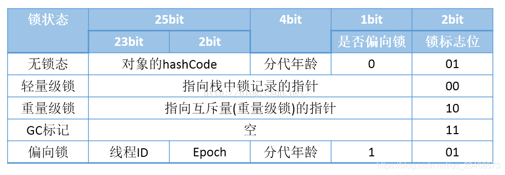

 **Class Pointer**：用来指向对象对应的Class对象（其对应的元数据对象）的内存地址。在开启了指针压缩时，占4字节。（默认是开启的）

 **Length**：如果是数组对象，还有一个保存数组长度的空间，占4个字节。

#### 实例数据

保存对象的非静态成员变量数据。实例数据存储的是真正的有效数据，即各个字段的值。无论是子类中定义的，还是从父类继承下来的都需要记录。这部分数据的存储顺序受到虚拟机的分配策略以及字段在类中的定义顺序的影响。

#### 对齐填充

因为HotSpot虚拟机的自动内存管理系统要求对象起始地址是8字节的整数倍，所以任何对象的大小必须是8字节的整数倍，而对象头部分一般是8字节的倍数，如果实力数据部分不是8字节的整数倍，需要对齐填充来补全。

### 如何计算一个对象在内存中占多少个字节？

由于默认是开启了指针压缩的，现在普遍的机器位数都是64位，如果对象是普通对象，非数组类型，那么就是对象头部分就是12字节(类型指针4字节，Mark Word 8字节)，假设这个对象只有一个Integer变量，那么在实例数据部分就是一个引用变量的空间4字节，总共是16字节，由于正好是8的倍数，就不需要进行对齐填充了。


### 垃圾回收有哪些特点？

垃圾回收具有以下特点：

1.只回收堆内存的对象，不回收其他物理资源（数据库连接等）

2.无法精准控制内存回收的时机，系统会在合适的时候进行内存回收。

3.在回收对象之前会调用对象的finalize()方法清理资源，这个方法有可能会让其他变量重新引用对象导致对象复活。

### 在垃圾回收机制中，对象在内存中的状态有哪几种？

1.**可达状态**

有一个及以上的变量引用着对象。

2.**可恢复状态**

已经没有变量引用对象了，但是还没有被调用finalize()方法。系统在回收前会调用finalize()方法，如果在执行finalize()方法时，重新让一个变量引用了对象，那么对象会变成可达状态，否则会变成不可达状态。

3.**不可达状态**

执行finalize()方法后，对象还是没有被其他变量引用，那么对象就变成了不可达状态。

### 对象的强引用，软引用，弱引用和虚引用的区别是什么？

##### 强引用

就是普通的变量对对象的引用，强引用的对象不会被系统回收。

##### 软引用

当内存空间足够时，软引用的对象不会被系统回收。当内存空间不足时，软引用的对象可能被系统回收。通常用于内存敏感的程序中。

##### 弱引用

引用级别比软引用低，对于只有软引用的对象，不管内存是否足够，在垃圾回收时， 都可能会被系统回收。

##### 虚引用

虚引用主要用于跟踪对象被垃圾回收的状态，在垃圾回收时可以收到一个通知。

### 双亲委派机制是什么？

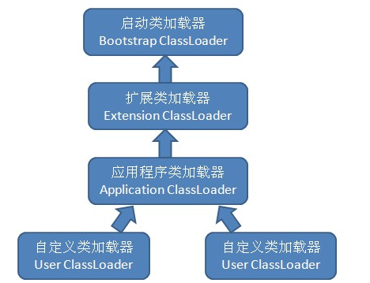

就是类加载器一共有三种：

**启动类加载器**：主要是在加载JAVA_HOME/lib目录下的特定名称jar包，例如rt.jar包，像java.lang就在这个jar包中。

**扩展类加载器**：主要是加载JAVA_HOME/lib/ext目录下的具备通用性的类库。

**应用程序类加载器**：加载用户类路径下所有的类库，也就是程序中默认的类加载器。

工作流程：

除启动类加载器以外，所有类加载器都有自己的父类加载器，类加载器收到一个类加载请求时，首先会判断类是否已经加载过了，没有的话会调用父类加载器的的loadClass方法，将请求委派为父加载器，当父类加载器无法完成类加载请求时，子加载器才尝试去加载这个类。
目的是为了保证每个类只加载一次，并且是由特定的类加载器进行加载（都是首先让启动类来进行加载）。

```java
public abstract class ClassLoader {
    ...
    public Class<？> loadClass(String name) throws ClassNotFoundException {
        return loadClass(name, false);
    }
    protected Class<？> loadClass(String name, boolean resolve)
        throws ClassNotFoundException {
      	//使用synchronized加锁，保证不会重复加载
        synchronized (getClassLoadingLock(name)) {
          //判断这个类是否已加载
            Class<？> c = findLoadedClass(name);
            if (c == null) {
                ...
                try {
                    if (parent != null) {//有父类加载器，让父类加载器先尝试加载
                        c = parent.loadClass(name, false);
                    } else {
                        c = findBootstrapClassOrNull(name);
                    }
                } catch (ClassNotFoundException e) {
                }
								//使用当前类加载器进行类加载
                if (c == null) {
                    ...
                    c = findClass(name);
                    // do some stats
                    ...
                }
            }
            if (resolve) {
                resolveClass(c);
            }
            return c;
        }
    }
    protected Class<？> findClass(String name) throws ClassNotFoundException {
        throw new ClassNotFoundException(name);
    }
    ...
}
```

### 怎么自定义一个类加载器？

加载一个类时，一般是调用类加载器的loadClass()方法来加载一个类，loadClass()方法的工作流程如下：

1.先调用findLoadedClass(className)来获取这个类，判断类是否已加载。

2.如果未加载，如果父类加载器不为空，调用父类加载器的loadClass()来加载这个类，父类加载器为空，就调用父类加载器加载这个类。

3.父类加载器加载失败，那么调用该类加载器findClass(className)方法来加载这个类。

所以我们一般自定义类加载器都是**继承ClassLoader，重写findClass()方法**，来实现类加载，这样不会违背双亲委派类加载机制，也可以通过重写loadClass()方法进行类加载，但是这样会违背双亲委派类加载机制。

```java
public class DelegationClassLoader extends ClassLoader {
  private String classpath;

  public DelegationClassLoader(String classpath, ClassLoader parent) {
    super(parent);
    this.classpath = classpath;
  }

  @Override
  protected Class<？> findClass(String name) throws ClassNotFoundException {
    InputStream is = null;
    try {
      String classFilePath = this.classpath + name.replace(".", "/") + ".class";
      is = new FileInputStream(classFilePath);
      byte[] buf = new byte[is.available()];
      is.read(buf);
      return defineClass(name, buf, 0, buf.length);
    } catch (IOException e) {
      throw new ClassNotFoundException(name);
    } finally {
      if (is != null) {
        try {
          is.close();
        } catch (IOException e) {
          throw new IOError(e);
        }
      }
    }
  }

  public static void main(String[] args)
      throws ClassNotFoundException, IllegalAccessException, InstantiationException,
      MalformedURLException {
    sun.applet.Main main1 = new sun.applet.Main();

    DelegationClassLoader cl = new DelegationClassLoader("java-study/target/classes/",
        getSystemClassLoader());
    String name = "sun.applet.Main";
    Class<？> clz = cl.loadClass(name);
    Object main2 = clz.newInstance();

    System.out.println("main1 class: " + main1.getClass());
    System.out.println("main2 class: " + main2.getClass());
    System.out.println("main1 classloader: " + main1.getClass().getClassLoader());
    System.out.println("main2 classloader: " + main2.getClass().getClassLoader());
    ClassLoader itrCl = cl;
    while (itrCl != null) {
      System.out.println(itrCl);
      itrCl = itrCl.getParent();
    }
  }
}
```

### 类加载的过程是什么样的？

#### 类加载器

类加载器是 Java 运行时环境（Java Runtime Environment）的一部分，负责动态加载 Java 类到 Java 虚拟机的内存空间中。**类通常是按需加载，即第一次使用该类时才加载。** 由于有了类加载器，Java 运行时系统不需要知道文件与文件系统。每个 Java 类必须由某个类加载器装入到内存。


类装载器除了要定位和导入二进制 class 文件外，还必须负责验证被导入类的正确性，为变量分配初始化内存，以及帮助解析符号引用。这些动作必须严格按一下顺序完成：

1. **装载**：查找并装载类型的二进制数据。
2. **链接**：执行验证、准备以及解析(可选) -
 -**验证**：确保被导入类型的正确性 
 -**准备**：为类变量分配内存，并将其初始化为默认值。
 - **解析**：把类型中的符号引用转换为直接引用。
3. **初始化**：把类变量初始化为正确的初始值。

#### 装载

##### 类加载器分类

在Java虚拟机中存在多个类装载器，Java应用程序可以使用两种类装载器：

- **Bootstrap ClassLoader**：此装载器是 Java 虚拟机实现的一部分。由原生代码（如C语言）编写，不继承自 `java.lang.ClassLoader` 。负责加载核心 Java 库，启动类装载器通常使用某种默认的方式从本地磁盘中加载类，包括 Java API。
- **Extention Classloader**：用来在`<JAVA_HOME>/jre/lib/ext` ,或 `java.ext.dirs` 中指明的目录中加载 Java 的扩展库。 Java 虚拟机的实现会提供一个扩展库目录。
- **Application Classloader**：根据 Java应用程序的类路径（ `java.class.path` 或 `CLASSPATH` 环境变量）来加载 Java 类。一般来说，Java 应用的类都是由它来完成加载的。可以通过 `ClassLoader.getSystemClassLoader()` 来获取它。
- **自定义类加载器**：可以通过继承 `java.lang.ClassLoader` 类的方式实现自己的类加载器，以满足一些特殊的需求而不需要完全了解 Java 虚拟机的类加载的细节。

##### 全盘负责双亲委托机制

在一个 JVM 系统中，至少有 3 种类加载器，那么这些类加载器如何配合工作？在 JVM 种类加载器通过 **全盘负责双亲委托机制** 来协调类加载器。

- **全盘负责**：指当一个 `ClassLoader` 装载一个类的时，除非显式地使用另一个 `ClassLoader` ，该类所依赖及引用的类也由这个 `ClassLoader` 载入。
- **双亲委托机制**：指先委托父装载器寻找目标类，只有在找不到的情况下才从自己的类路径中查找并装载目标类。

全盘负责双亲委托机制只是 Java 推荐的机制，并不是强制的机制。实现自己的类加载器时，如果想保持双亲委派模型，就应该重写 `findClass(name)` 方法；如果想破坏双亲委派模型，可以重写 `loadClass(name)` 方法。

##### 装载入口

所有Java虚拟机实现必须在每个类或接口首次主动使用时初始化。以下六种情况符合主动使用的要求：

- 当创建某个类的新实例时(new、反射、克隆、序列化)
- 调用某个类的静态方法
- 使用某个类或接口的静态字段，或对该字段赋值(用final修饰的静态字段除外，它被初始化为一个编译时常量表达式)
- 当调用Java API的某些反射方法时。
- 初始化某个类的子类时。
- 当虚拟机启动时被标明为启动类的类。

除以上六种情况，所有其他使用Java类型的方式都是被动的，它们不会导致Java类型的初始化。
当类是被动引用时，不会触发初始化：

1.通过子类去调用父类的静态变量，不会触发子类的初始化，只会触发包含这个静态变量的类初始化，例如执行这样的代码`SubClass.fatherStaticValue`只会触发FatherClass的初始化，不会触发SubClass的初始化，因为fatherStaticValue是FatherClass的变量

2.通过数组定义类引用类，SuperClass[] array = new SuperClass[10];

不会触发SuperClass类的初始化，但是执行字节码指令newarray会触发另外一个类[Lorg.fenixsoft.classloading.SuperClass的初始化，这个类继承于Object类，是一个包装类，里面包含了访问数组的所有方法，

3.只引用类的常量不会触发初始化,因为常量在编译阶段进入常量池

```java
class SuperClass {
		public static final String str = "hello";
}

//引用常量编译时会直接存入常量池
System.out.println(SuperClass.str);

```

对于接口来说，只有在某个接口声明的非常量字段被使用时，该接口才会初始化，而不会因为事先这个接口的子接口或类要初始化而被初始化。

**父类需要在子类初始化之前被初始化**。当实现了接口的类被初始化的时候，不需要初始化父接口。然而，当实现了父接口的子类(或者是扩展了父接口的子接口)被装载时，父接口也要被装载。(只是被装载，没有初始化)

#### 验证

确认装载后的类型符合Java语言的语义，并且不会危及虚拟机的完整性。

- **装载时验证**：检查二进制数据以确保数据全部是预期格式、确保除 Object 之外的每个类都有父类、确保该类的所有父类都已经被装载。
- **正式验证阶段**：检查 final 类不能有子类、确保 final 方法不被覆盖、确保在类型和超类型之间没有不兼容的方法声明(比如拥有两个名字相同的方法，参数在数量、顺序、类型上都相同，但返回类型不同)。
- **符号引用的验证**：当虚拟机搜寻一个被符号引用的元素(类型、字段或方法)时，必须首先确认该元素存在。如果虚拟机发现元素存在，则必须进一步检查引用类型有访问该元素的权限。

#### 准备

在准备阶段，Java虚拟机为类变量分配内存，**设置默认初始值**。但在到到初始化阶段之前，类变量都没有被初始化为真正的初始值。

| 类型      | 默认值   |
| --------- | -------- |
| int       | 0        |
| long      | 0L       |
| short     | (short)0 |
| char      | ’\u0000’ |
| byte      | (byte)0  |
| blooean   | false    |
| float     | 0.0f     |
| double    | 0.0d     |
| reference | null     |

#### 解析

https://www.zhihu.com/question/30300585

解析的过程就是在类型的常量池总寻找类、接口、字段和方法的符号引用，**把这些符号引用替换为直接引用的过程**。

- `类或接口的解析`：判断所要转化成的直接引用是数组类型，还是普通的对象类型的引用，从而进行不同的解析。
- `字段解析`：对字段进行解析时，会先在本类中查找是否包含有简单名称和字段描述符都与目标相匹配的字段，如果有，则查找结束；如果没有，则会按照继承关系从上往下递归搜索该类所实现的各个接口和它们的父接口，还没有，则按照继承关系从上往下递归搜索其父类，直至查找结束，

#### 初始化

**所有的类变量(即静态量)初始化语句和类型的静态初始化器都被Java编译器收集在一起，放到一个特殊的方法中，这个步骤就是初始化类静态变量和执行静态代码块。** 对于类来说，这个方法被称作类初始化方法；对于接口来说，它被称为接口初始化方法。在类和接口的 class 文件中，这个方法被称为`<clinit>`。

1. 如果存在直接父类，且直接父类没有被初始化，先初始化直接父类。
2. 如果类存在一个类初始化方法，执行此方法。

这个步骤是递归执行的，即第一个初始化的类一定是`Object`。

**Java虚拟机必须确保初始化过程被正确地同步。** 如果多个线程需要初始化一个类，仅仅允许一个线程来进行初始化，其他线程需等待。

> 这个特性可以用来写单例模式。

##### Clinit 方法

- 对于静态变量和静态初始化语句来说：执行的顺序和它们在类或接口中出现的顺序有关。
- **并非所有的类都需要在它们的class文件中拥有<clinit>()方法，** 如果类没有声明任何类变量，也没有静态初始化语句，那么它就不会有`<clinit>()`方法。如果类声明了类变量，但没有明确的使用类变量初始化语句或者静态代码块来初始化它们，也不会有`<clinit>()`方法。如果类仅包含静态`final`常量的类变量初始化语句，而且这些类变量初始化语句采用编译时常量表达式，类也不会有`<clinit>()`方法。**只有那些需要执行Java代码来赋值的类才会有<clinit>()**
- `final`常量：Java虚拟机在使用它们的任何类的常量池或字节码中直接存放的是它们表示的常量值。


### JVM 内存区域分布是什么样的？gc 发生在哪些部分？

Java虚拟机的内存区域主要分为**虚拟机栈**，**本地方法栈**，**程序计数器**，堆，**方法区**。垃圾回收主要是对**堆**中的对象进行回收，方法区里面也会进行一些垃圾回收，但是方法区中的内存回收出现的频率会比较低，主要是针对**常量池的回收** 和 **对类型的卸载**，判定一个常量是否是“废弃常量”比较简单，不被引用就行了，而要判定一个类是否是“无用的类”的条件则相对苛刻许多。类需要同时满足下面3个条件才能算是“无用的类”：

1.该类所有的实例都已经被回收，也就是Java堆中不存在该类的任何实例；

2.加载该类的ClassLoader已经被回收；

3.该类对应的 java.lang.Class 对象没有在任何地方被引用，无法在任何地方通过反射访问该类的方法；

##### 虚拟机栈

是Java方法执行的内存模型，主要是用于方法执行的，每次执行方法时就会创建一个栈帧来压入栈中，每个栈帧存储了方法调用需要的数据，例如局部变量表，操作数栈等。

局部变量表主要是存储方法的参数和创建的局部变量（基本类型或者引用类型），它的大小在编译时就固定了，方法有一个Code属性记录了需要的局部变量表的大小。

操作数栈是一个栈，主要用来做算术运算及调用其他方法时存储传参，调用其他方法时，当前方法栈帧的操作数栈会跟其他方法的局部变量表有一定的重叠，主要便于共享这些传递参数，节约内存空间。（最大深度也是编译时就计算好的。）

##### 本地方法栈

线程在调用native方法时使用的栈。

##### 程序计数器

跟虚拟机栈，本地方法栈一样，程序计数器也是线程私有的，主要用来记录当前线程执行的字节码指令的行号，字节码解释器通过改变这个计数器来选取下一条需要执行的字节码指令。

##### 堆

用来存储对象和数据的区域，被所有线程共享，在物理上可以是不连续的。

##### 方法区

方法区也是被线程共享的，主要存放类型信息，常量，静态变量，方法去中有一个运行时常量池。

Java中的类在编译后会生成class文件，class文件除了包含变量，方法，接口信息外还包含一个常量池表，用于存放编译时生成的各种字面量和符号引用，在类加载后，字符流常量池会被存放在方法区中的运行时常量池中，运行期间也会可以将新的常量添加到运行时常量池，例如对String的实例调用intern方法。

### 垃圾回收算法有哪些？

垃圾回收算法一般有四种


#### 标记-清除算法(一般用于老年代)

就是对要回收的对象进行标记，标记完成后统一回收。（CMS垃圾收集器使用这种）

缺点：

**效率不稳定**

执行效率不稳定，有大量对象时，并且有大量对象需要回收时，执行效率会降低。

**内存碎片化**

内存碎片化，会产生大量不连续的内存碎片。（内存碎片只能通过使用分区空闲分配链表来分配内存）

#### 标记-复制算法(一般用于新生代)

就是将内存分为两块，每次只用其中一块，垃圾回收时将存活对象，拷贝到另一块内存。（serial new，parallel new和parallel scanvage垃圾收集器）

缺点：

**不适合存活率高的老年代**

存活率较高时需要很多复制操作，效率会降低，所以老年代一般不使用这种算法。

**浪费内存**

会浪费一半的内存，

解决方案是新生代的内存配比是Eden:From Survivor: To Survivor = 8比1比1

每次使用时，Eden用来分配新的对象，From Survivor存放上次垃圾回收后存活的对象，只使用Eden和From Survivor的空间，To Survivor是空的，垃圾回收时将存活对象拷贝到To Survivor，当空间不够时，从老年代进行分配担保。

#### 标记-整理算法(一般用于老年代)

标记-整理算法跟标记-清除算法适用的场景是一样的，都是用于老年代，也就是存活对象比较多的情况。标记-整理算法的流程就是让存活对象往内存空间一端移动，然后直接清理掉边界以外的内存。（parallel Old和Serial old收集器就是采用该算法进行回收的）

**吞吐量高**

移动时内存操作会比较复杂，需要移动存活对象并且更新所有对象的引用，会是一种比较重的操作，但是如果不移动的话，会有内存碎片，内存分配时效率会变低，所以由于内存分配的频率会比垃圾回收的频率高很多，所以从吞吐量方面看，标记-整理法高于标记-清除法。

**延迟高**

但是由于需要移动对象，停顿时间会比较长，垃圾回收时延迟会高一些，强调低延迟的CMS收集器一般是大部分时候用标记-清除算法，当内存碎片化程度达到一定程度时，触发Full GC，会使用标记-整理算法清理一次。

#### 分代收集算法

弱分代假说：就是绝大部分对象都是朝生夕灭。

强分代假说：熬过越多次垃圾收集的对象就越难以消忙。

就是现在的系统一般都比较复杂，堆中的对象也会比较多，如果使用对所有对象都分析是否需要回收，那么效率会比较低，所以有了分代收集算法，就是对熬过垃圾回收次数不同的对象进行分类，分为新生代和老年代，采用不同回收策略。

新生代存活率低，使用标记-复制算法。新生代发生的垃圾收集交Minor GC，发生频率较高

老年代存活率高，使用标记-清除算法，或者标记-整理算法。（CMS垃圾收集器一般是多数时间采用标记-清除算法，内存碎片化程度较高时，使用标记-整理算法收集一次）。老年代内存满时会触发Major GC（Full GC），一般触发的频率比较低。

#### 如何确定一个对象是否可以被回收？

有两种算法，一种是引用计数法，可以记录每个对象被引用的数量来确定，当被引用的数量为0时，代表可以回收。
一种是可达性分析法。就是判断对象的引用链是否可达来确定对象是否可以回收。就是把所有对象之间的引用关系看成是一个图，通过从一些GC Roots对象作为起点，根据这些对象的引用关系一直向下搜索，走过的路径就是引用链，当所有的GCRoots对象的引用链都到达不了这个对象，说明这个对象不可达，可以回收。
GCRoots对象一般是当前肯定不会被回收的对象，一般是虚拟机栈中局部变量表中的对象，方法区的类静态变量引用的对象，方法区常量引用的对象，本地方法栈中Native方法引用的对象。

### 内存分配策略有哪些？

#### 内存划分策略：


Serial收集器中，新生代与老年代的内存分配是1：2，然后新生代分为Eden区，From区，To区，比例是8:1:1。

##### 新生代

分为Eden，From Survivor，To Survivor，8：1：1

Eden用来分配新对象，满了时会触发Minor GC。

From Survivor是上次Minor GC后存活的对象。

To Survivor是用于下次Minor GC时存放存活的对象。

##### 老年代

用于存放存活时间比较长的对象，大的对象，当容量满时会触发Major GC（Full GC）

#### 内存分配策略：

1) 对象优先在Eden分配

当Eden区没有足够空间进行分配时，虚拟机将发起一次MinorGC。现在的商业虚拟机一般都采用复制算法来回收新生代，将内存分为一块较大的Eden空间和两块较小的Survivor空间，每次使用Eden和其中一块Survivor。 当进行垃圾回收时，将Eden和Survivor中还存活的对象一次性地复制到另外一块空闲的Survivor空间上，最后处理掉Eden和刚才的Survivor空间。（HotSpot虚拟机默认Eden和Survivor的大小比例是8:1）当Survivor空间不够用时，需要依赖老年代进行分配担保。

2) 大对象直接进入老年代

所谓的大对象是指，需要大量连续内存空间的Java对象，最典型的大对象就是那种很长的字符串以及数组，为了避免大对象在Eden和两个Survivor区之间进行来回复制，所以当对象超过-XX:+PrintTenuringDistribution参数设置的大小时，直接从老年代分配

3) 长期存活的对象将进入老年代

当对象在新生代中经历过一定次数（XX:MaxTenuringThreshold参数设置的次数，默认为15）的Minor GC后，就会被晋升到老年代中。

4) 动态对象年龄判定

为了更好地适应不同程序的内存状况，虚拟机并不是永远地要求对象年龄必须达到了MaxTenuringThreshold才能晋升老年代，如果在Survivor空间中某个年龄所有对象大小的总和>Survivor空间的50%，年龄大于或等于该年龄的对象就可以直接进入老年代，无须等到MaxTenuringThreshold中要求的年龄。

### MinorGC和FullGC是什么？

Minor GC：对新生代进行回收，不会影响到年老代。因为新生代的 Java 对象大多死亡频繁，所以 Minor GC 非常频繁，一般在这里使用速度快、效率高的算法，使垃圾回收能尽快完成。

Full GC：也叫 Major GC，对整个堆进行回收，包括新生代和老年代。由于Full GC需要对整个堆进行回收，所以比Minor GC要慢，因此应该尽可能减少Full GC的次数，导致Full GC的原因包括：老年代被写满和System.gc()被显式调用等。

### 触发Minor GC的条件有哪些？

1.为新对象分配内存时，新生代的Eden区空间不足。
新生代回收日志：

```java
2020-05-12T16:15:10.736+0800: 7.803: [GC (Allocation Failure) 2020-05-12T16:15:10.736+0800: 7.803: [ParNew: 838912K->22016K(943744K), 0.0982676 secs] 838912K->22016K(1992320K), 0.0983280 secs] [Times: user=0.19 sys=0.01, real=0.10 secs]
```
### 触发Full GC的条件有哪些？

主要分为三种：
#### 1.system.gc()

代码中调用system.gc()方法，建议JVM进行垃圾回收。

#### 2.方法区空间不足

  方法区中存放的是一些类的信息，当系统中要加载的类、反射的类和调用的方法较多时，方法区可能会被占满，触发 Full GC

#### 3.老年代空间不足

而老年代空间不足又有很多种情况：
**3.1 Minor GC后，老年代存放不下晋升对象**
在进行 MinorGC 时， Survivor Space 放不下存活的对象，此时会让这些对象晋升，只能将它们放入老年代，而此时老年代也放不下时造成的。
还有一些情况也会导致新生代对象晋升，例如存活对象经历的垃圾回收次数超过一定次数（XX:MaxTenuringThreshold参数设置的次数，默认为15），那么会导致晋升，
或者在Survivor空间中相同年龄所有对象大小的总和大于Survivor空间的一半，年龄大于或等于该年龄的对象就可以直接进入老年代，无须等到MaxTenuringThreshold中要求的年龄。
**3.2 Concurrent Mode Failure**
在执行 CMS GC 的过程中，同时有对象要放入老年代，而此时老年代空间不足造成的。
**3.3 历次晋升的对象平均大小>老年代的剩余空间**
这是一个较为复杂的触发情况， HotSpot为了避免由于新生代对象晋升到老年代导致老年代空间不足的现象，
在进行 Minor GC时，做了一个判断，如果之前统计所得到的 MinorGC 晋升到老年代的平均大小大于老年代的剩余空间，那么就直接触发 Full GC。
**3.4 老年代空间不足以为大对象分配内存**
因为超过阀值(-XX:+PrintTenuringDistribution参数设置的大小时)的大对象，会直接分配到老年代，如果老年代空间不足，会触发Full GC。


### 垃圾收集器有哪些？

一般老年代使用的就是**标记-整理**，或者**标记-清除**+标记-整理结合（例如CMS）

新生代就是**标记-复制**算法

| 垃圾收集器                                  | 特点                                                 | 算法                | 适用内存区域   |
| ------------------------------------------- | ---------------------------------------------------- | ------------------- | -------------- |
| Serial                                      | 单个GC线程进行垃圾回收，简单高效                     | 标记-复制           | 新生代         |
| Serial Old                                  | 单个GC线程进行垃圾回收                               | 标记-整理           | 老年代         |
| ParNew                                      | 是Serial的改进版，就是可以多个GC线程一起进行垃圾回收 | 标记-复制           | 新生代         |
| Parallel Scanvenge收集器（吞吐量优先收集器) | 高吞吐量，吞吐量=执行用户线程的时间/CPU执行总时间    | 标记-复制           | 新生代         |
| Parallel Old收集器                          | 支持多线程收集                                       | 标记-整理           | 老年代         |
| CMS收集器（并发低停顿收集器）               | 低停顿                                               | 标记-清除+标记-整理 | 老年代         |
| G1收集器                                    | 低停顿，高吞吐量                                     | 标记-复制算法       | 老年代，新生代 |

#### Serial收集器（标记-复制算法）

就是最简单的垃圾收集器，也是目前 JVM 在 Client 模式默认的垃圾收集器，在进行垃圾收集时会停止用户线程，然后使用一个收集线程进行垃圾收集。主要用于新生代，使用标记-复制算法。

优点是简单高效（与其他收集器的单线程比），内存占用小，因为垃圾回收时就暂停所有用户线程，然后使用一个单线程进行垃圾回收，不用进行线程切换。

缺点是收集时必须停止其他用户线程。

#### Serial Old收集器（标记-整理算法）

跟Serial收集器一样，不过是应用于老年代，使用标记-整理算法。


#### ParNew收集器（标记-复制算法）

ParNew收集器是Serial收集器的多线程并行版本，在进行垃圾收集时可以使用多个线程进行垃圾收集。

与Serial收集器主要区别就是支持多线程收集，ParNew收集器应用广泛（JDK9以前，服务端模式垃圾收集组合官方推荐的是ParNew+CMS），因为只有Serial和ParNew才能配合CMS收集器(应用于老年代的并发收集器)一起工作。


#### Parallel Scanvenge收集器（吞吐量优先收集器）

也支持多线程收集，它的目标是达到一个可控制的吞吐量，就是运行用户代码的时间/(运行用户代码的时间+垃圾回收的时间)比值。高吞吐量可以最高效率地利用处理器资源，尽快完成程序运算任务，适合不需要太多的交互分析任务。不支持并发收集，进行垃圾回收时会暂停用户线程，使用多个垃圾回收线程进行垃圾回收。

#### Parallel Old收集器

是Parallel Scanvenge老年代版本，支持多线程收集，使用标记整理法实现的。


#### CMS 收集器（老年代并发低停顿收集器）

CMS收集器是第一个支持并发收集的垃圾收集器，在垃圾收集时，用户线程可以和收集线程一起工作，它的执行目标是达到最短回收停顿时间，以获得更好的用户体验。

CMS英文是Concurrent Mark Sweep，是基于标记-清除法+标记-整理算法实现的，步骤如下：


#### 1.初始标记

标记那些GC Roots可以直接关联到的对象。

#### 2.并发标记(可以与用户线程并发执行)

从GC Roots能关联到的对象直接向下遍历整个对象图，耗时较长，但是可以与用户线程并发执行。

整个标记过程是采用三色标记法来实现的：

**白色**：代表还没有遍历的对象。

**灰色**：代表已遍历到的对象，但是它直接引用的对象还没有遍历完。

**黑色**：代表已遍历到的对象，它直接引用的对象也都已经遍历完。

##### 执行流程：

1.先将所有对象放到白色集合，然后将GC Roots能关联的对象添加到灰色集合。

2.对灰色集合中对象进行遍历，假设从灰色集合中取出的对象是A，将对象A引用的所有对象添加到灰色集合，全部添加完毕后，将A添加到黑色集合。

3.重复第2步，直到灰色集合为空。

##### 三色标记法的一些问题：

##### 1.对于多标的情况，会生成浮动垃圾

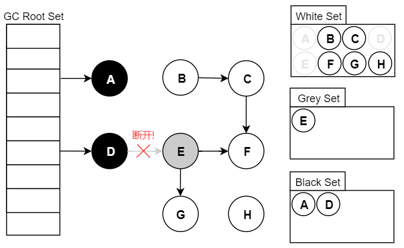
对于这种多标的情况，对象E/F/G是“应该”被回收的。然而因为E已经变为灰色了，其仍会被当作存活对象继续遍历下去。最终的结果是：这部分对象仍会被标记为存活，即本轮GC不会回收这部分内存。
这部分本应该回收 但是 没有回收到的内存，被称之为“浮动垃圾”。浮动垃圾并不会影响垃圾回收的正确性，只是需要等到下一轮垃圾回收中才被清除。
另外，针对并发标记开始后的新对象，通常的做法是直接全部当成黑色，本轮不会进行清除。这部分对象期间可能会变为垃圾，这也算是浮动垃圾的一部分。

##### 2.对于引用变动后导致漏标情况的处理

 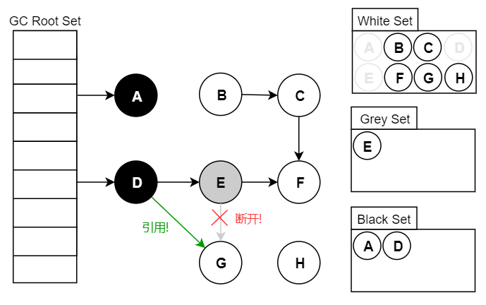
##### 增量更新法

对于这种漏标的情况，CMS垃圾收集器使用的是增量更新法，就是将引用变化后的引用情况进行记录，然后之后进行标记。也就是当E->G变成了E->null,D->G，会对更改后的引用D->G进行记录，用于在重新标记阶段对这种情况进行处理。

##### 原始快照法

就是对于这种E->G，然后改成D->G，正常来说，应该可能会漏掉，因为D已经是黑色对象了，就不会遍历G了，G1垃圾收集器对这种情况的处理是保存原始快照，就是在并发标记过程中，引用的变动，都会对变动前的引用情况进行记录，会按照变动前的引用情况进行标记，也就是即便E->G变成了E->null,D->G变化了，还是会记录E->G的引用情况，用于在重新标记阶段对这种情况进行处理。
#### 3.重新标记

由于标记时，用户线程在运行，并发标记阶段存在一些标记变动的情况，这一阶段就是修正这些记录。(CMS采用增量更新算法来解决，主要是将更改后的引用关系记录，之后增量更新)

#### 4.并发清除

清除标记阶段判断的已经死亡的对象，由于不需要移动存活对象，这个阶段也可以与用户线程并发执行。

#### G1收集器（Garbage First收集器，标记-整理算法，老年代，新生代都进行回收）

目标是在延迟可控(用户设定的延迟时间)的情况下获得尽可能高的吞吐量。

JDK9以前，服务端模式默认的收集器是Parallel Scavenge+Serial Old。JDK9及之后，默认收集器是G1。G1不按照新生代，老年代进行划分，而是将Java堆划分为多个大小相等的独立Region，每一个Region可以根据需要，扮演新生代的Eden空间，Survivor空间，老年代Old空间和用于分配大对象的Humongous区。回收思路是G1持续跟踪各个Region的回收价值（回收可释放的空间和回收所需时间），然后维护一个优先级列表，在用户设定的最大收集停顿时间内，优先回收那些价值大的Region。

JDK 8 和9中，Region的大小是通过(最大堆大小+最小堆大小)的平均值/2048，一般是需要在1到32M之间。G1认为2048是比较理想的Region数量

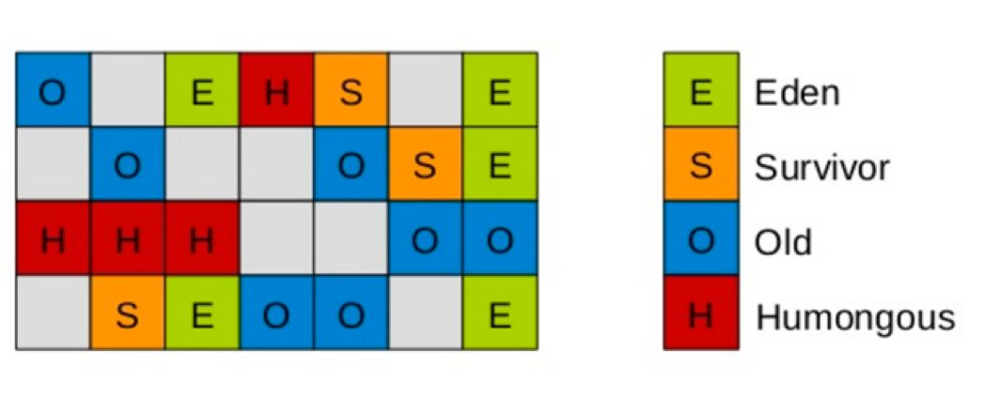

**G1对象分配策略**

说起对象的分配，我们不得不谈谈对象的分配策略。它分为4个阶段：

1. 栈上分配
2. TLAB(Thread Local Allocation Buffer)线程本地分配缓冲区
3. 共享Eden区中分配
4. Humongous区分配（超过Region大小50%的对象）

对象在分配之前会做逃逸分析，如果该对象只会被本线程使用，那么就将该对象在栈上分配。这样对象可以在函数调用后销毁，减轻堆的压力，避免不必要的gc。 如果对象在栈是上分配不成功，就会使用TLAB来分配。TLAB为线程本地分配缓冲区，它的目的为了使对象尽可能快的分配出来。如果对象在一个共享的空间中分配，我们需要采用一些同步机制来管理这些空间内的空闲空间指针。在Eden空间中，每一个线程都有一个固定的分区用于分配对象，即一个TLAB。分配对象时，线程之间不再需要进行任何的同步。

对TLAB空间中无法分配的对象，JVM会尝试在共享Eden空间中进行分配。如果是大对象，则直接在Humongous区分配。

最后，G1提供了两种GC模式，Young GC和Mixed GC，两种都是Stop The World(STW)的。下面我们将分别介绍一下这2种模式。

**G1 Young GC**

Young GC主要是对Eden区进行GC，它在Eden空间耗尽时会被触发。在这种情况下，Eden空间的数据移动到Survivor空间中，如果Survivor空间不够，Eden空间的部分数据会直接晋升到年老代空间。Survivor区的数据移动到新的Survivor区中，也有部分数据晋升到老年代空间中。最终Eden空间的数据为空，GC停止工作，应用线程继续执行。

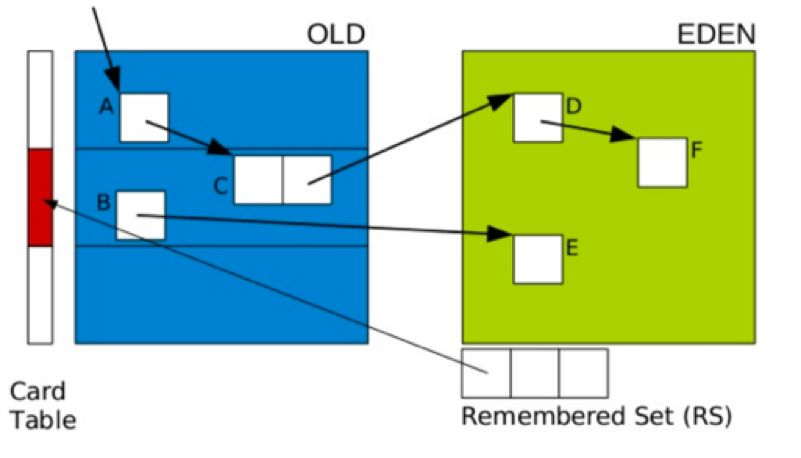

##### Region如何解决跨代指针？

因为老年代old区也会存在对新生代Eden区的引用，如果只是为了收集Eden区而对整个老年代进行扫描，那样开销太大了，所以G1其实会将每个Region分为很多个区，每个区有一个下标，当这个区有对象被其他Region引用时，那么CardTable对应下标下值为0，然后使用一个**Rset来存储老年代Region对当前这个新生代Region的引用**，Key是别的Region的起始地址，Value是一个集合，里面的元素是Card Table的Index。对跨代引用的扫描，只需要扫描RSet就行了。

在CMS中，也有RSet的概念，在老年代中有一块区域用来记录指向新生代的引用。这是一种point-out，在进行Young GC时，扫描根时，仅仅需要扫描这一块区域，而不需要扫描整个老年代。

但在G1中，并没有使用point-out（就是记录当前Region对其他Region中对象的引用），这是由于一个Region太小，Region数量太多，如果是用point-out的话，如果需要计算一个Region的可回收的对象数量，需要把所有Region都是扫描一遍会造成大量的扫描浪费，有些根本不需要GC的分区引用也扫描了。于是G1中使用point-in来解决。point-in的意思是哪些Region引用了当前Region中的对象。这样只需要将当前Region中这些对象当做初始标记时的根对象来扫描就可以扫描出因为有跨代引用需要存活的对象，避免了无效的扫描。

##### 由于新生代有多个，那么我们需要在新生代之间记录引用吗？

这是不必要的，原因在于每次GC时，所有新生代都会被扫描，所以只需要记录**老年代的Region对新生代的这个Region之间的引用**即可。

需要注意的是，如果引用的对象很多，赋值器需要对每个引用做处理，赋值器开销会很大，为了解决赋值器开销这个问题，在G1 中又引入了另外一个概念，卡表（Card Table）。一个Card Table将一个分区在逻辑上划分为固定大小的连续区域，每个区域称之为卡。卡通常较小，介于128到512字节之间。CardTable通常为字节数组，由Card的索引（即数组下标）来标识每个分区的空间地址。默认情况下，每个卡都未引用。当一个地址空间有引用时，这个地址空间对应的数组索引的值被标记为"0"，即标记为脏引用，此外RSet也将这个数组下标记录下来。一般情况下，这个RSet其实是一个Hash Table集合（每个线程对应一个Hash Table，主要是为了减少多线程并发更新RSet的竞争），每个哈希表的Key是别的Region的起始地址，Value是一个集合，里面的元素是Card Table的Index。

如果Rset是记录每个外来Region对当前Region中对象的引用，这样数量就太多了，所以Card Table只是有很多Byte字节，每个字节记录了Region对应的一个内存区域(卡页)是否是dirty的，为1代表dirty，也就是有其他Region对这个卡页中的对象进行引用。

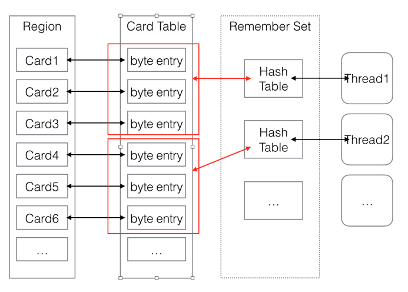

**G1 MixGC**

MixGC不仅进行正常的新生代垃圾收集，同时也回收部分后台扫描线程标记的老年代分区。Young GC回收是把新生代活着的对象都拷贝到Survivor的特定区域（Survivor to），剩下的Eden和Survivor from就可以全部回收清理了。那么，mixed GC就是把一部分老年区的region加到Eden和Survivor from的后面，合起来称为collection set, 就是将被回收的集合，下次mixed GC evacuation把他们所有都一并清理。选old region的顺序是垃圾多的（存活对象少）优先。

它的GC步骤分2步：

1. 全局并发标记（global concurrent marking）
2. 拷贝存活对象（evacuation）

在进行Mix GC之前，会先进行global concurrent marking（全局并发标记）。 global concurrent marking的执行过程是怎样的呢？

在G1 GC中，它主要是为Mixed GC提供标记服务的，并不是一次GC过程的一个必须环节。global concurrent marking的执行过程分为五个步骤：

- 初始标记（initial mark，STW）
     在此阶段，G1 GC 对根进行标记。该阶段与常规的(STW) 新生代垃圾回收密切相关。
- 根区域扫描（root region scan）
      G1 GC 在初始标记的存活区扫描对老年代的引用，并标记被引用的对象。该阶段与应用程序（非 STW）同时运行，并且只有完成该阶段后，才能开始下一次 STW 新生代垃圾回收。
- 并发标记（Concurrent Marking）
      G1 GC 在整个堆中查找可访问的（存活的）对象。该阶段与应用程序同时运行，可以被 STW 新生代垃圾回收中断
- 最终标记（Remark，STW）
      该阶段是 STW 回收，帮助完成标记周期。G1 GC清空 SATB 缓冲区，跟踪未被访问的存活对象，并执行引用处理。
- 清除垃圾（Cleanup，STW）
      在这个最后阶段，G1 GC 执行统计和 RSet 净化的 STW 操作。在统计期间，G1 GC 会识别完全空闲的区域和可供进行混合垃圾回收的区域。清理阶段在将空白区域重置并返回到空闲列表时为部分并发。

##### 收集步骤：


**初始标记** 只标记GC Roots直接引用的对象

**并发标记** 从GC Roots开始对堆中对象进行可达性分析，扫描整个对象图，找出要回收的对象。（可以与用户线程并发执行）

**最终标记** 对并发标记阶段，由于用户线程执行造成的改动进行修正，使用原始快照方法。

**筛选回收** 对Region进行排序，根据回收价值，选择任意多个Region构成回收集，将存活对象复制到空的Region中去，因为涉及到存活对象的移动，所以是暂停用户线程的。

相关资料：

https://www.jianshu.com/p/aef0f4765098

### 三色标记法，引用计数， Mark-Sweep法（标记清除法）三者的区别？

三色标记法可以与用户线程并发执行。

引用计数法主要没有办法解决循环引用的问题。

标记清除法主要流程就是一开始认为所有对象是0，然后从GC Roots对象开始向下遍历，**递归地**遍历所有对象，将能遍历到的对象标记为1。然后遍历结束后，标记为0的对象被认为是可以被销毁的。主要问题在于标记过程需要Stop the world，也就是需要停止用户线程，只有标记线程能运行。

扩展阅读：

https://zhuanlan.zhihu.com/p/87790329

### 垃圾收集器相关的参数

-XX:+UseSerialGC，虚拟机运行在Client 模式下的默认值，打开此开关后，使用Serial + Serial Old 的收集器组合进行内存回收

-XX:+UseConcMarkSweepGC，打开此开关后，使用**ParNew + CMS + Serial Old** 的收集器组合进行内存回收。Serial Old 收集器将作为CMS 收集器出现Concurrent Mode Failure失败后的后备收集器使用。（我们的线上服务用的都是这个）

-XX:+UseParallelGC，虚拟机运行在Server 模式下的默认值，打开此开关后，使用**Parallel Scavenge + Serial Old**（PS MarkSweep）的收集器组合进行内存回收。

-XX:+UseParallelOldGC，打开此开关后，使用Parallel Scavenge + Parallel Old 的收集器组合进行内存回收。

-XX:+UseG1GC，打开此开关后，采用 Garbage First (G1) 收集器

-XX:+UseParNewGC，在JDK1.8被废弃，在JDK1.7还可以使用。打开此开关后，使用ParNew + Serial Old 的收集器组合进行内存回收

参考链接：

https://www.pianshen.com/article/7390335728/

### 目前通常使用的是什么垃圾收集器？

##### 怎么查询当前JVM使用的垃圾收集器？

使用这个命令可以查询当前使用的垃圾收集器
`java -XX:+PrintCommandLineFlags -version`

另外这个命令可以查询到更加详细的信息

`java -XX:+PrintFlagsFinal -version | grep GC`

我们在IDEA中启动的一个Springboot的项目，默认使用的垃圾收集器参数是
-XX:+UseParallelGC

```
-XX:InitialHeapSize=134217728 -XX:MaxHeapSize=2147483648 -XX:+PrintCommandLineFlags -XX:+UseCompressedClassPointers -XX:+UseCompressedOops -XX:+UseParallelGC 
java version "1.8.0_73"
Java(TM) SE Runtime Environment (build 1.8.0_73-b02)
Java HotSpot(TM) 64-Bit Server VM (build 25.73-b02, mixed mode)
```
##### Parallel Scavenge+Serial Old

JDK8默认情况下服务端模式下JVM垃圾回收参数是-XX:+UseParallelGC参数，也就是会使用**Parallel Scavenge+Serial Old**的收集器组合，进行内存回收。

##### ParNew+CMS

但是一般如果我们的后端应用不是那种需要进行大量计算的应用，基于低延迟的考虑，可以考虑使用-XX:+UseConcMarkSweepGC进行垃圾收集，这种配置下会使用ParNew来收集新生代内存，CMS垃圾回收器收集老年代内存。

##### G1

在JDK9时，默认的垃圾收集器是G1收集器，也可以使用-XX:+UseG1GC参数来启动G1垃圾收集器。


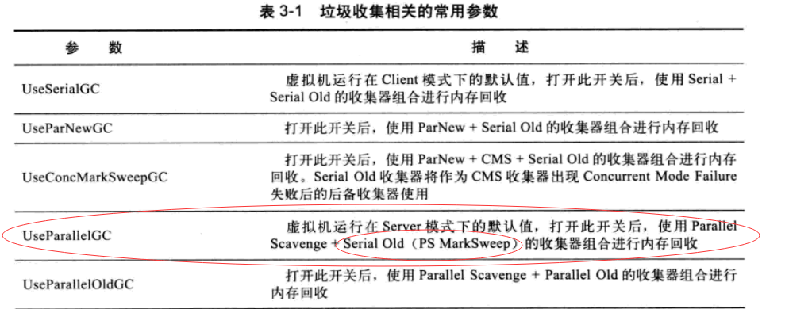

### 容器的内存和 jvm 的内存有什么关系？参数怎么配置？

一般在使用容器部署Java应用时，一般为了充分利用物理机的资源，会在物理机上部署多个容器应用，然后对每个容器设置最大内存的限制，但是JVM的最大堆默认值一般取得的物理机最大内存的25%，一旦应用内存超出容器的最大内存限制，容器就会把应用进程kill掉，然后重启。为了解决这个问题，有3种解决方案：

1.在应用的JVM参数中添加-Xmx 最大堆内存的大小，可以设置为容器最大内存限制的75%。一旦你在修改了容器的最大内存限制，每个应用的JVM参数-Xmx 也许需要同步进行修改。

2.就是添加这几个参数可以让Java应用感知容器的内存限制，从而在设置最大堆内存大小时，根据容器的内存限制进行设置。
`-XX:+UnlockExperimentalVMOptions 
-XX:+UseCGroupMemoryLimitForHeap 
-XX:MaxRAMFraction=2`

下面是MaxRAMFraction取不同的值时，最大堆内存与容器最大内存限制的比例。考虑到除了内存中除了最大堆内存以外，还有方法区，线程栈等需要需要占用内存，所以MaxRAMFraction一般至少取2会比较合适。如果取值为1，在最大堆内存占满时，可能Java应用占用的总内存会超过容器最大内存限制。


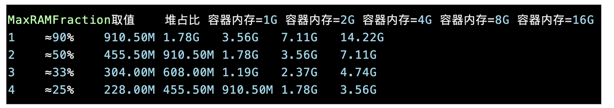

3.在JDK8以后，JVM增加了容器感知功能，就是如果不显示指定-Xmx2048m 最大堆内存大小， -Xms2048m最小堆内存大小，会取容器所在的物理机的内存的25%作为最大堆内存大小，也可以通过这几个参数来设置堆内存占容器内存的比例
-XX:MinRAMPercentage 最小堆内存大小占容器内存限制的比例
-XX:MaxRAMPercentage 最大堆内存大小占容器内存限制的比例
-XX:InitialRAMPercentage 初始堆内存大小占容器内存限制的比例

### 如何大体估算java进程使用的内存呢？

Max memory = [-Xmx] + [-XX:MaxPermSize] + number_of_threads * [-Xss]

-Xss128k: 设置每个线程的堆栈大小.JDK5.0以后默认每个线程的栈大小为1M。

-Xms 堆内存的初始大小，默认为物理内存的1/64
-Xmx 堆内存的最大大小，默认为物理内存的1/4
-Xmn 堆内新生代的大小。通过这个值也可以得到老生代的大小：-Xmx减去-Xmn

-Xss 设置每个线程可使用的内存大小，即栈的大小。在相同物理内存下，减小这个值能生成更多的线程，当然操作系统对一个进程内的线程数还是有限制的，不能无限生成。线程栈的大小是个双刃剑，如果设置过小，可能会出现栈溢出，特别是在该线程内有递归、大的循环时出现溢出的可能性更大，如果该值设置过大，就有影响到创建栈的数量，如果是多线程的应用，就会出现内存溢出的错误。

### 怎么获取 dump 文件？怎么分析？

1.启动时配置，出现OOM问题时自动生成
JVM启动时增加两个参数:


```java
//出现 OOME 时生成堆 dump: 
-XX:+HeapDumpOnOutOfMemoryError
//生成堆文件地址：
-XX:HeapDumpPath=/home/liuke/jvmlogs/
```

2.执行jmap命令立即生成
发现程序异常前通过执行指令，直接生成当前JVM的dmp文件，6214是指JVM的进程号

```java
jmap -dump:format=b,file=/home/admin/logs/heap.hprof 6214
```

获得heap.hprof以后，执行`jvisualvm`命令打开使用Java自带的工具Java VisualVM来打开heap.hprof文件，就可以分析你的Java线程里面对象占用堆内存的情况了

由于第一种方式是一种事后方式，需要等待当前JVM出现问题后才能生成dmp文件，实时性不高，第二种方式在执行时，JVM是暂停服务的，所以对**线上的运行会产生影响**。所以建议第一种方式。

### gc日志怎么看？

可以在启动Java应用的命令中添加这些参数，指定生成垃圾收集的日志的路径，可以记录垃圾收集的情况。

`-XX:+PrintGCDetails 
-XX:+PrintGCDateStamps 
-Xloggc:/var/log/gc.log
`

这是一条Minor GC的回收日志(一般GC (Allocation Failure)代表Minor GC，老年代垃圾回收一般打印的是Full GC (Metadata GC Threshold) )

```java
2020-05-07T16:28:02.845+0800: 78210.469: [GC (Allocation Failure) 2020-05-07T16:28:02.845+0800: 78210.469: [ParNew: 68553K->466K(76672K), 0.0221963 secs] 131148K->63062K(2088640K), 0.0223082 secs] [Times: user=0.02 sys=0.00, real=0.02 secs] 
```

**GC (Allocation Failure)** 

代表Eden区分配内存失败触发Minor GC。
**2020-05-07T16:28:02.845+0800: 78210.469** 

是发生的时间。
**68553K->466K(76672K)** 

代表垃圾回收前新生代使用内存是68MB，剩余0.4MB，总内存是76MB。
**0.0221963 secs** 

是垃圾回收耗时。
**131148K->63062K(2088640K)** 

代表堆区回收前使用131MB，63MB，总内存是2088MB。

**[Times: user=0.02 sys=0.00, real=0.02 secs]** 

用户态耗时0.02s，内核态耗时0s，总耗时0.02s

 PS：有一个网站，可以对上传GC.log的日志进行分析，解析日志文件，统计出垃圾收集总占用的时间，以及新生代，老年代的内存使用峰值，https://gceasy.io/

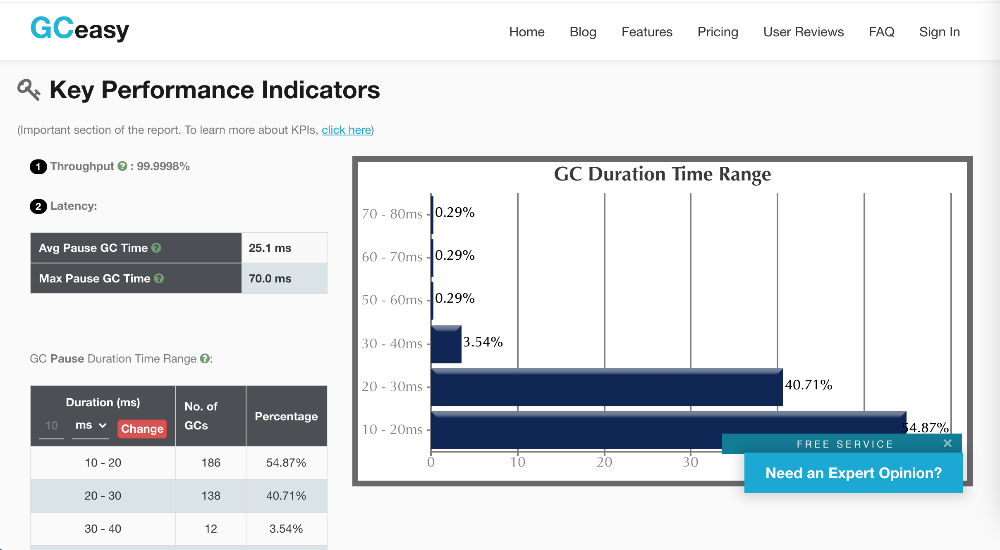

### cpu 使用率特别高，怎么排查？通用方法？定位代码？cpu高的原因？

[CPU飙高，频繁GC，怎么排查？](https://mp.weixin.qq.com/s？src=11&timestamp=1589109647&ver=2330&signature=LegOQuRkl7V9kFT6JT3Kg-9X4VYN40OmTyVRlSOFLppbFy*PTUWPAb2iyCFqz-ka9RRCje4fXGxS3sqw1z3JYQ3MRxzuI-UTLtlx-fV8VA8CLDWOFFfIuIVwrAeUdDHb&new=1)

[jstack命令：教你如何排查多线程问题](https://mp.weixin.qq.com/s？__biz=MzI3ODcxMzQzMw==&mid=2247484624&idx=1&sn=a907100b51aca8bd651aebdb9aca532f&chksm=eb5381e6dc2408f092159c453a452c2781d374ca43f0984dde87688de8a1f8d9196dfd747124&scene=21#wechat_redirect)
```
 jstat -gcutil 29530 1000 10
 垃圾回收信息统计，29530是pid，1000是每1秒打印一次最新信息，10是最多打印10次
```


### 怎么排查CPU占用率过高的问题？
1.首先使用`top`命令查看CPU占用率高的进程的pid。
```
top - 15:10:32 up 523 days,  3:47,  1 user,  load average: 0.00, 0.01, 0.05
Tasks:  95 total,   1 running,  94 sleeping,   0 stopped,   0 zombie
%Cpu(s):  1.7 us,  0.5 sy,  0.0 ni, 95.7 id,  2.2 wa,  0.0 hi,  0.0 si,  0.0 st
KiB Mem : 16267904 total,  6940648 free,  2025316 used,  7301940 buff/cache
KiB Swap: 16777212 total, 16776604 free,      608 used. 13312484 avail Mem

  PID USER      PR  NI    VIRT    RES    SHR S  %CPU %MEM     TIME+ COMMAND
14103 hadoop    20   0 2832812 203724  18392 S   3.7  1.3 977:08.04 java
14010 hadoop    20   0 2897344 285392  18660 S   0.3  1.8 513:30.49 java
14284 hadoop    20   0 3052556 340436  18636 S   0.3  2.1   1584:47 java
14393 hadoop    20   0 2912460 504112  18632 S   0.3  3.1 506:43.68 java
    1 root      20   0  190676   3404   2084 S   0.0  0.0   4:31.47 systemd
    2 root      20   0       0      0      0 S   0.0  0.0   0:04.77 kthreadd
    3 root      20   0       0      0      0 S   0.0  0.0   0:10.16 ksoftirqd/0
```
2.使用`top -Hp 进程id`获得该进程下各个线程的CPU占用情况，找到占用率最高的线程的pid2，
使用`printf "%x\n" pid2`命令将pid2转换为16进制的数number。

```
top - 15:11:01 up 523 days,  3:48,  1 user,  load average: 0.00, 0.01, 0.05
Threads:  69 total,   0 running,  69 sleeping,   0 stopped,   0 zombie
%Cpu(s): 12.8 us,  0.1 sy,  0.0 ni, 87.0 id,  0.1 wa,  0.0 hi,  0.0 si,  0.0 st
KiB Mem : 16267904 total,  6941352 free,  2024612 used,  7301940 buff/cache
KiB Swap: 16777212 total, 16776604 free,      608 used. 13313188 avail Mem

  PID USER      PR  NI    VIRT    RES    SHR S %CPU %MEM     TIME+ COMMAND
14393 hadoop    20   0 2912460 504112  18632 S  0.0  3.1   0:00.01 java
14411 hadoop    20   0 2912460 504112  18632 S  0.0  3.1   0:01.95 java
14412 hadoop    20   0 2912460 504112  18632 S  0.0  3.1   0:16.18 java
14413 hadoop    20   0 2912460 504112  18632 S  0.0  3.1   0:12.79 java
14414 hadoop    20   0 2912460 504112  18632 S  0.0  3.1   8:09.10 java
```
3.使用`jstack pid`获得进程下各线程的堆栈信息，nid=0xnumber的线程即为占用率高的线程，查看它是在执行什么操作。(`jstack 5521 | grep -20 0x1596`可以获得堆栈信息中，会打印匹配到0x1596的上下20行的信息。)

例如这个线程是在执行垃圾回收:
```
"GC task thread#0 (ParallelGC)" os_prio=0 tid=0x00007f338c01f000 nid=0x1593 runnable
```

##### JVM相关的异常

#### 1.stackoverflow

这种就是栈的空间不足，就会抛出这个异常，一般是递归执行一个方法时，执行方法深度太深时出现。Java执行一个方法时，会创建一个栈帧来存放局部变量表，操作数栈，如果分配栈帧时，栈空间不足，那么就会抛出这个异常。

（栈空间可以设置-Xss参数实现，默认为1M，如果参数）

### JVM调优有哪些工具？

#### jstat

jstat可以打印出当前JVM运行的各种状态信息，例如新生代内存使用情况，老年代内存使用情况，以及垃圾回收的时间。Minor GC发生总次数，总耗时，Full GC发生总次数，总耗时。(jmap -heap命令也可以打印出堆中各个分区的内存使用情况，但是不能定时监测，持续打印。例如每1s打印当前的堆中各个分区的内存使用情况，一直打印100次。)
```
//5828是java进程id，1000是打印间隔，每1000毫秒打印一次，100是总共打印100次
jstat -gc 5828 1000 100
```

打印结果如下：

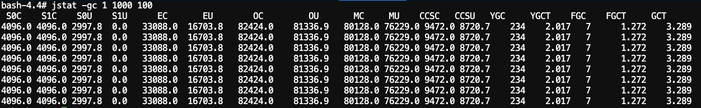

各个参数的含义如下：

`S0C` 新生代中第一个survivor（幸存区）的总容量 (字节) 

`S1C `新生代中第二个survivor（幸存区）的总容量 (字节) 

`S0U` 新生代中第一个survivor（幸存区）目前已使用空间 (字节) 

`S1U` 新生代中第二个survivor（幸存区）目前已使用空间 (字节) 

`EC` 新生代中Eden区的总容量 (字节) 

`EU` 新生代中Eden区目前已使用空间 (字节) 

`OC` 老年代的总容量 (字节) 

`OU` 老年代代目前已使用空间 (字节) 

`YGC` 目前新生代垃圾回收总次数 

`YGCT` 目前新生代垃圾回收总消耗时间 

`FGC` 目前full gc次数总次数

`FGCT` 目前full gc次数总耗时，单位是秒

`GCT` 垃圾回收总耗时

一般还可以使用`jstat -gcutil <pid>`:统计gc信息，这样打印出来的结果是百分比，而不是实际使用的空间，例如jstat -gcutil 1 1000 100

例如，S0代表 新生代中第一个survivor区的空间使用了73.19%，E代表新生代Eden区使用了51%，O代表老年代食堂了98%


| 参数 | 描述                                                     |
| ---- | -------------------------------------------------------- |
| S0   | 年轻代中第一个survivor（幸存区）已使用的占当前容量百分比 |
| s1   | 年轻代中第二个survivor（幸存区）已使用的占当前容量百分比 |
| E    | 年轻代中Eden已使用的占当前容量百分比                     |
| O    | old代已使用的占当前容量百分比                            |
| M    | 元空间(MetaspaceSize)已使用的占当前容量百分比            |
| CCS  | 压缩使用比例                                             |
| YGC  | 年轻代垃圾回收次数                                       |
| FGC  | 老年代垃圾回收次数                                       |
| FGCT | 老年代垃圾回收消耗时间                                   |
| GCT  | 垃圾回收消耗总时间                                       |

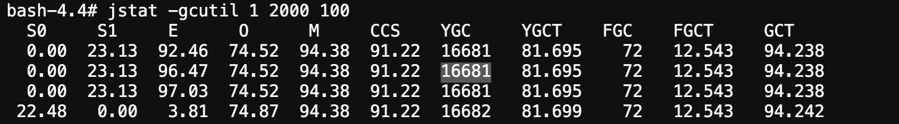

#### jstack

jstack可以生成当前JVM的线程快照，也就是当前每个线程当前的状态及正在执行的方法，锁相关的信息。`jstack -l 进程id  `，-l代表除了堆栈信息外，还会打印锁的附加信息。jstack还会检测出死锁信息。一般可以用于定位线程长时间停顿，线程间死锁等问题。

例如在下面的例子中，第一个线程获取到lock1，再去获取lock2，第二个线程先获取到lock2，然后再去获取lock1。每个线程都只获得了一个锁，同时在获取另外一个锁，就会进入死锁状态。

```java
public static void main(String[] args) {
        final Integer lock1 = new Integer(1);
        final String  lock2 = new String();
        ExecutorService executorService = Executors.newCachedThreadPool();
        executorService.execute(new Runnable() {
            @Override
            public void run() {
                synchronized (lock1) {
                    System.out.println("线程1获得了lock1");
                    try {
                        Thread.sleep(1000);
                    } catch (InterruptedException e) {
                        e.printStackTrace();
                    }
                    System.out.println("线程1休眠结束");
                    System.out.println("线程1开始尝试获取lock2");
                    synchronized (lock2) {
                        System.out.println("线程1获得了lock2");
                    }
                }
            }
        });
        executorService.execute(new Runnable() {
            @Override
            public void run() {
                synchronized (lock2) {
                    System.out.println("线程2获得了lock2");
                    System.out.println("线程2开始尝试获取lock1");
                    synchronized (lock1) {
                        System.out.println("线程2获得了lock2");
                    }
                }
            }
        });
    }
```

使用`jstack -l 进程id`就可以打印出当前的线程信息

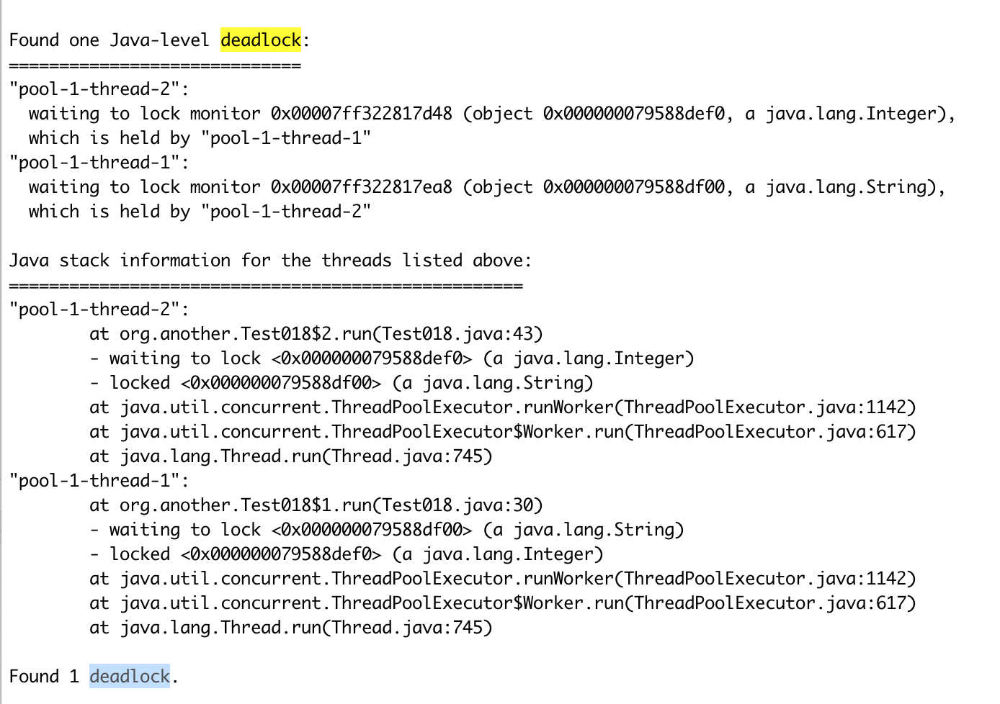

以及各个线程的状态，执行的方法（pool-1-thread-1和pool-1-thread-2分别代表线程池的第一个线程和第二个线程）：

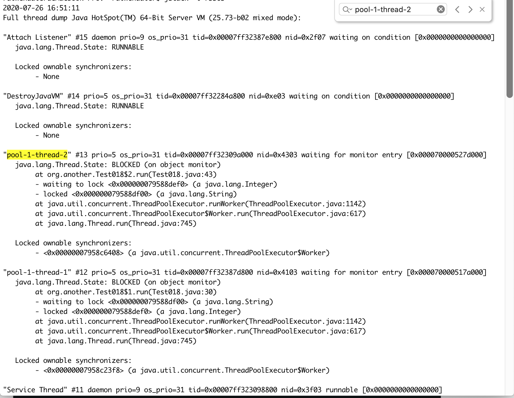

#### jmap

##### jmap -heap

这个命令可以生成当前堆栈快照。使用 `jmap -heap 进程id`可以打印出当前堆各分区内存使用情况的情况，新生代(Eden区,To Survivor区,From Survivor区)，老年代区的内存使用情况。

使用jmap -heap查看内存使用情况的案例

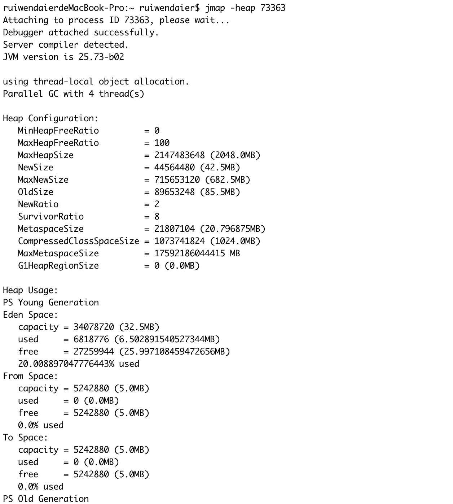

##### jmap -histo

 **jmap -histo 进程id** 打印出当前堆中的对象统计信息，包括类名，每个类的实例数量，总占用内存大小。

```java
instances列：表示当前类有多少个实例。
bytes列：说明当前类的实例总共占用了多少个字节
class name列：表示的就是当前类的名称，class name 对于基本数据类型，使用的是缩写。解读：B代表byte ，C代表char ，D代表double， F代表float，I代表int，J代表long，Z代表boolean 
前边有[代表数组，[I 就相当于int[] 
对象数组用`[L+类名`表示 
```

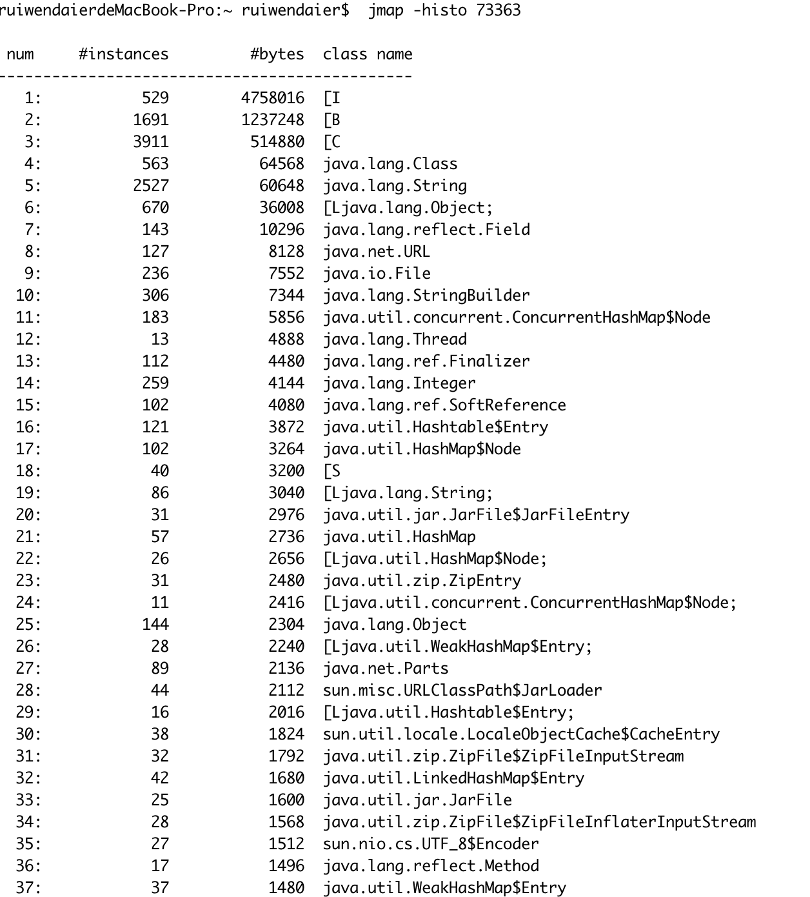 


##### jmap -dump

使用`jmap -dump:format=b,file=dump.hprof 进程id`可以生成当前的堆栈快照，堆快照和对象统计信息，对生成的堆快照进行分析，可以分析堆中对象所占用内存的情况，检查大对象等。执行`jvisualvm`命令打开使用Java自带的工具**Java VisualVM**来打开堆栈快照文件，进行分析。可以用于排查内存溢出，内存泄露问题。在**Java VisualVM**里面可以看到每个类的实例对象占用的内存大小，以及持有这个对象的实例所在的类等等信息。

也可以配置启动时的JVM参数，让发送内存溢出时，自动生成堆栈快照文件。

```java
//出现 OOM 时生成堆 dump: 
-XX:+HeapDumpOnOutOfMemoryError
//生成堆文件地址：
-XX:HeapDumpPath=/home/liuke/jvmlogs/
```

使用**jmap -dump:format=b,file=/存放路径/heapdump.hprof 进程id**就可以得到堆转储文件，然后执行jvisualvm命令就可以打开JDK自带的jvisualvm软件。

例如在这个例子中会造成OOM问题，通过生成heapdump.hprof文件，可以使用jvisualvm查看造成OOM问题的具体代码位置。

```java
public class Test018 {

    ArrayList<TestObject> arrayList = new ArrayList<TestObject>();

    public static void main(String[] args) {
        Test018 test018 =new Test018();
        Random random = new Random();
        for (int i = 0; i < 10000000; i++) {
            TestObject testObject = new TestObject();
            test018.arrayList.add(testObject);
        }
    }
    private static class TestObject {
        public byte[] placeholder = new byte[64 * 1024];//每个变量是64k
    }
}

-Xms20m -Xmx20m -verbose:gc -XX:+PrintGCDetails -XX:+HeapDumpOnOutOfMemoryError -XX:HeapDumpPath=/存放路径/heapdump.hprof
```

造成OOM问题的代码位置：

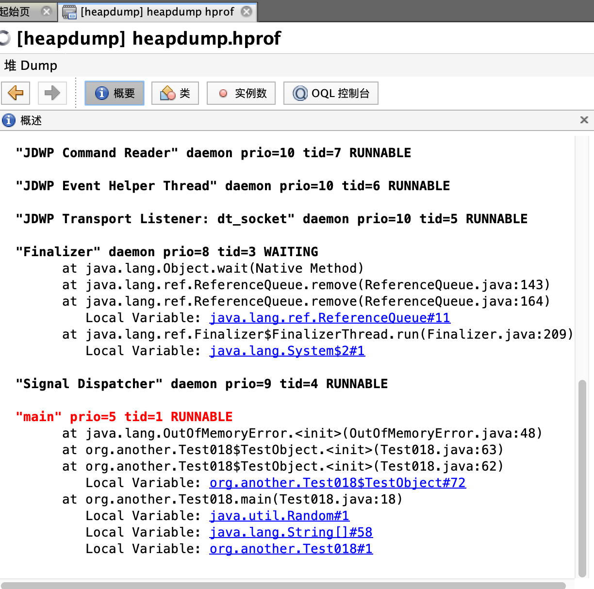

堆内对象列表

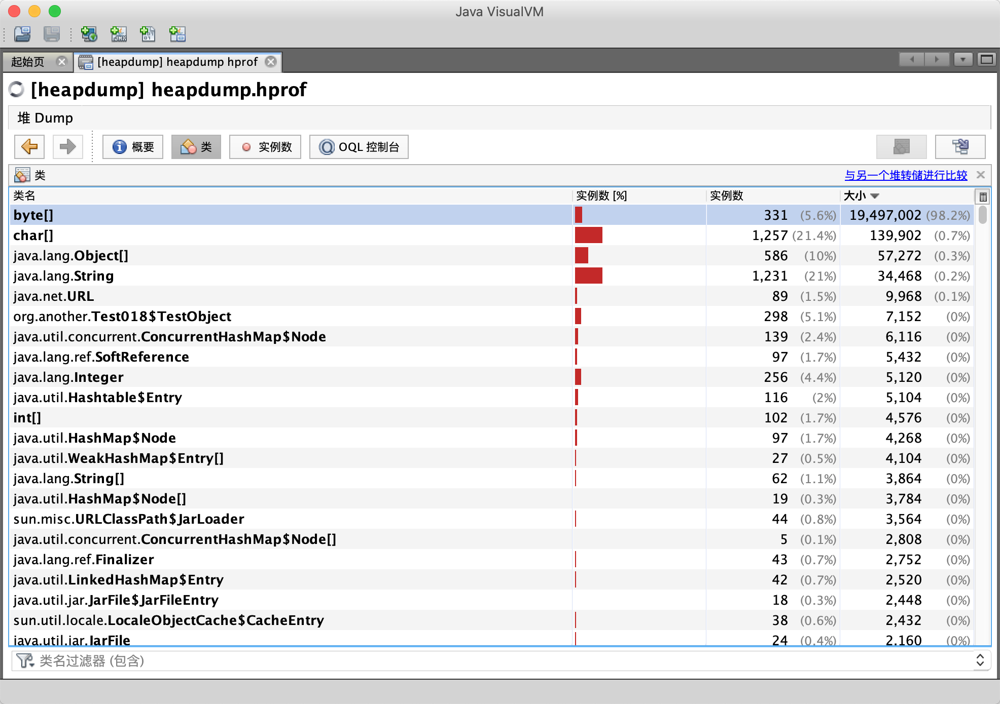

占用内存最多的实例对象就是这个placeholder对象

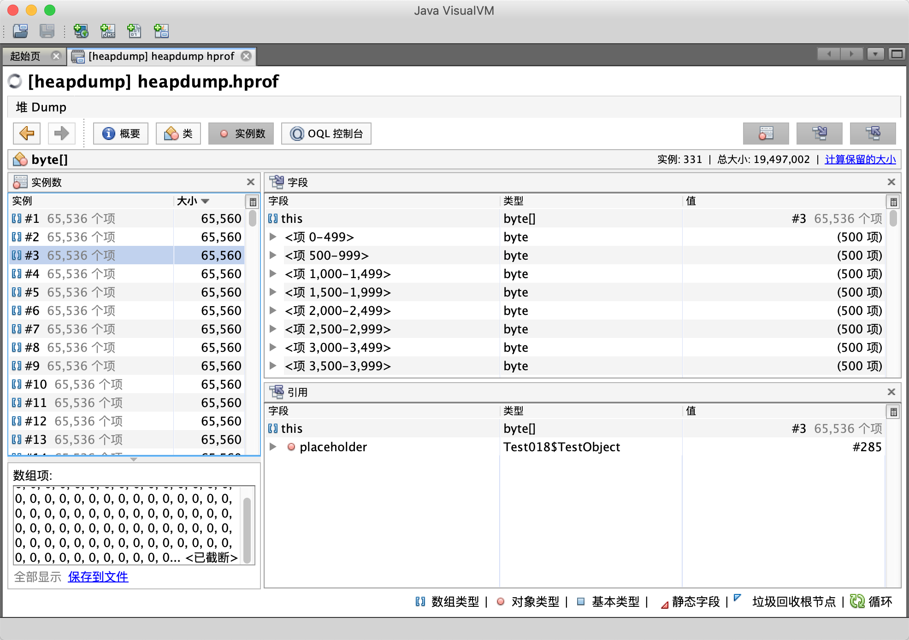

#### MAT

MAT主要可以用于分析内存泄露，可以查询dump堆转储文件中的对象列表，以及潜在的内存泄露的对象。

通过导入hprof文件，主页会展示潜在的内存泄露问题，比如下面这个例子中

```java
public class Test018 {
    static ArrayList<TestObject> arrayList = new ArrayList<TestObject>();
    public static void main(String[] args) {
        Random random = new Random();
        for (int i = 0; i < 10000000; i++) {
            TestObject testObject = new TestObject();
            Test018.arrayList.add(testObject);
        }
    }
    private static class TestObject {
        public byte[] placeholder = new byte[64 * 1024];
    }
}
```

在详情页面Shortest Paths To the Accumulation Point表示GC root对象到内存消耗聚集点的最短路径，内存聚集点的意思就是占用了大量内存的对象，也就是可能发生； 内存泄露的对象。

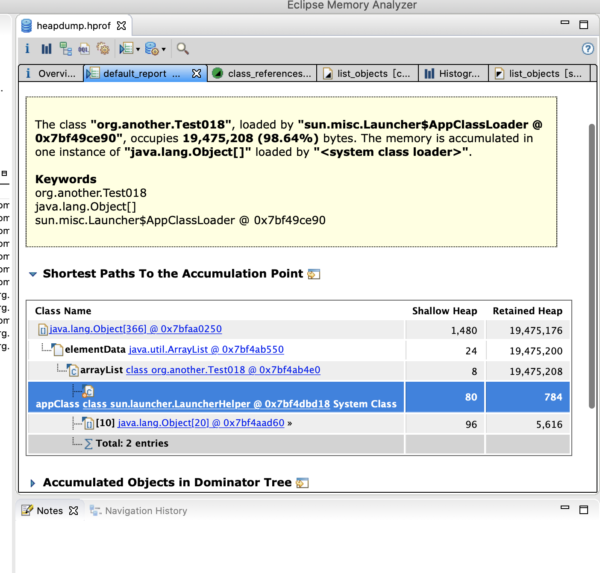


然后在主页点击Histogram，进入Histogram页面可以看到对象列表，with incomming references 也就是可以查看所有对这个对象的引用（思路一般优先看占用内存最大对象；其次看数量最多的对象。）。我们这个例子中主要是byte[]数组分配了占用了大量的内存空间，而byte[]主要来自于Test018类的静态变量arrayList的每个TestObject类型的元素的placeholder属性。

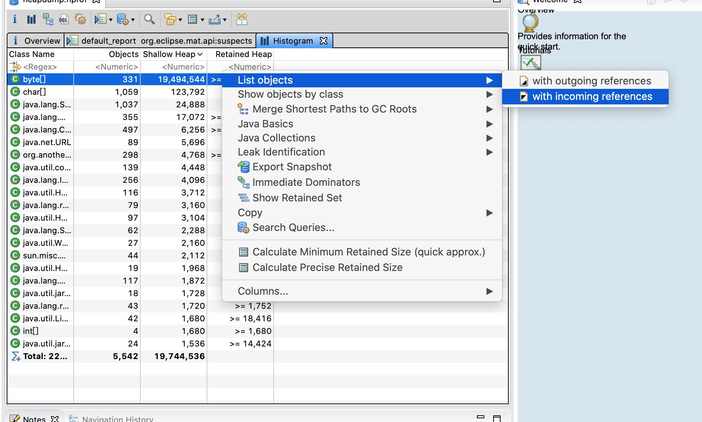

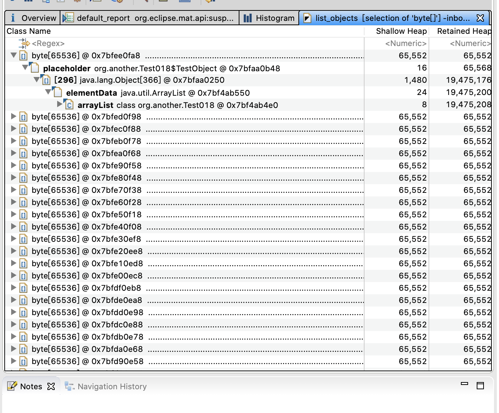

同时可以点击 内存快照对比 功能对两个dump文件进行对比，判断两个dump文件生成间隔期间，各个对象的数量变化，以此来判断内存泄露问题。

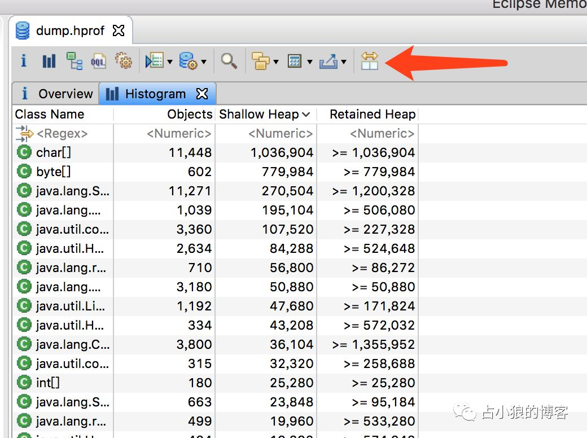

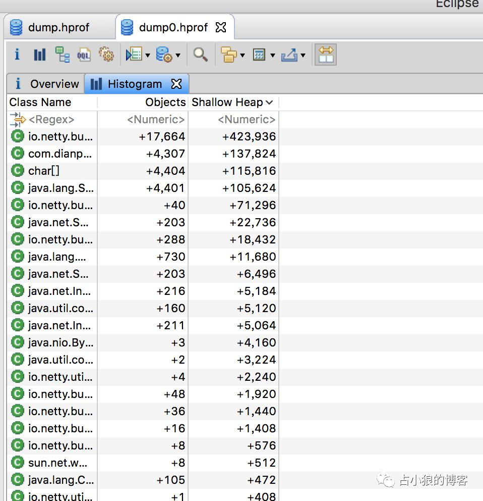

### happens-before指的是什么？
happens-before主要是为保证Java多线程操作时的有序性和可见性，防止了编译器重排序对程序结果的影响。
因为当一个变量出现一写多读，多读多写的情况时，就是多个线程读这个变量，然后至少一个线程写这个变量，因为编译器在编译时会对指令进行重排序，如果没有happens-before原则对重排序进行一些约束，就有可能造成程序执行不正确的情况。

具体有8条规则：
1.**程序次序性规则**：一个线程内，按照代码顺序，书写在前面的操作先行发生于书写在后面的操作。一段代码在单线程中执行的结果是有序的。(只在单线程有效，一写多读时，写的变量如果是没有使用volatile修饰时，是没法保证其他线程读到的变量是最新的值)

2.**锁定规则**：一个锁的解锁操作总是要在加锁操作之前。

3.**volatile规则**：如果一个写操作去写一个volatile变量，一个读操作去读volatile变量，那么写操作一定是在读操作之前。

4.**传递规则**：操作A happens before 操作B， B happens before C，那么A一定是happens before C的。

5.**线程启动规则**：线程A执行过程中修一些共享变量，然后再调用threadB.start()方法来启动线程B，那么A对那些变量的修改对线程B一定是可见的。

6.**线程终结规则**：线程A执行过程中调用了threadB.join()方法来等待线程B执行完毕，那么线程B在执行过程中对共享变量的修改，在join()方法返回后，对线程A可见。

7.**线程中断规则**：对线程interrupt()方法的调用先行发生于被中断线程的代码检测到中断事件的发生。

8.**对象终结规则**：一个对象的初始化完成先行发生于他的finalize()方法的开始；

https://www.cnblogs.com/chenssy/p/6393321.html

http://ifeve.com/java-%e4%bd%bf%e7%94%a8-happen-before-%e8%a7%84%e5%88%99%e5%ae%9e%e7%8e%b0%e5%85%b1%e4%ba%ab%e5%8f%98%e9%87%8f%e7%9a%84%e5%90%8c%e6%ad%a5%e6%93%8d%e4%bd%9c/#more-38824