(PS：扫描[首页里面的二维码](README.md)进群，分享我自己在看的技术资料给大家，希望和大家一起学习进步！)
# 多线程专题

#### [1.进程与线程的区别是什么？](#进程与线程的区别是什么？)
#### [2.进程间如何通信？](#进程间如何通信？)

#### [3.Java中单例有哪些写法？](#Java中单例有哪些写法？)
####  [4.Java中创建线程有哪些方式?](#Java中创建线程有哪些方式?)
#### [5.如何解决序列化时可以创建出单例对象的问题?](#如何解决序列化时可以创建出单例对象的问题?)
#### [6.volatile关键字有什么用？怎么理解可见性，一般什么场景去用可见性？](#volatile关键字有什么用？怎么理解可见性，一般什么场景去用可见性？)
#### [7.Java中线程的状态是怎么样的？](#Java中线程的状态是怎么样的？)
#### [8.wait()，join()，sleep()方法有什么作用？](#wait()，join()，sleep()方法有什么作用？)
#### [9.Thread.sleep(),Object.wait(),LockSupport.park()有什么区别？](#Thread.sleep(),Object.wait(),LockSupport.park()有什么区别？)
#### [10.谈一谈你对线程中断的理解？](#谈一谈你对线程中断的理解？)
#### [11.线程间怎么通信？](#线程间怎么通信？)
#### [12.怎么实现实现一个生产者消费者？](#怎么实现实现一个生产者消费者？)
#### [13.谈一谈你对线程池的理解？](#谈一谈你对线程池的理解？)
#### [14.线程池有哪些状态？](#线程池有哪些状态？)

### 进程与线程的区别是什么？

#### 批处理操作系统

**批处理操作系统**就是把一系列需要操作的指令写下来，形成一个清单，一次性交给计算机。用户将多个需要执行的程序写在磁带上，然后交由计算机去读取并逐个执行这些程序，并将输出结果写在另一个磁带上。

批处理操作系统在一定程度上提高了计算机的效率，但是由于**批处理操作系统的指令运行方式仍然是串行的，内存中始终只有一个程序在运行**，后面的程序需要等待前面的程序执行完成后才能开始执行，而前面的程序有时会由于I/O操作、网络等原因阻塞，导致CPU闲置所以**批处理操作效率也不高**。

#### 进程的提出

批处理操作系统的瓶颈在于内存中只存在一个程序，进程的提出，可以让内存中存在多个程序，每个程序对应一个进程，进程是操作系统资源分配的最小单位。CPU采用时间片轮转的方式运行进程：CPU为每个进程分配一个时间段，称作它的时间片。如果在时间片结束时进程还在运行，则暂停这个进程的运行，并且CPU分配给另一个进程（这个过程叫做上下文切换）。如果进程在时间片结束前阻塞或结束，则CPU立即进行切换，不用等待时间片用完。多进程的好处在于一个在进行IO操作时可以让出CPU时间片，让CPU执行其他进程的任务。

#### 线程的提出

随着计算机的发展，对CPU的要求越来越高，进程之间的切换开销较大，已经无法满足越来越复杂的程序的要求了。于是就发明了线程，线程是程序执行中一个单一的顺序控制流程，是程序执行流的最小单元，是处理器调度和分派的基本单位。一个进程可以有一个或多个线程，各个线程之间共享程序的内存空间(也就是所在进程的内存空间)。

#### 进程和线程的区别

进程是计算机中已运行程序的实体，进程是操作系统资源分配的最小单位。而线程是在进程中执行的一个任务，是CPU调度和执行的最小单位。他们两个本质的区别是是否**单独占有内存地址空间及其它系统资源（比如I/O）**：

* 进程单独占有一定的内存地址空间，所以进程间存在内存隔离，数据是分开的，数据共享复杂但是同步简单，各个进程之间互不干扰；而线程共享所属进程占有的内存地址空间和资源，数据共享简单，但是同步复杂。

* 进程单独占有一定的内存地址空间，一个进程出现问题不会影响其他进程，不影响主程序的稳定性，可靠性高；一个线程崩溃可能影响整个程序的稳定性，可靠性较低。

* 进程单独占有一定的内存地址空间，进程的创建和销毁不仅需要保存寄存器和栈信息，还需要资源的分配回收以及页调度，开销较大；线程只需要保存寄存器和栈信息，开销较小。

另外一个重要区别是，进程是操作系统进行资源分配的基本单位，而线程是操作系统进行调度的基本单位，即CPU分配时间的单位 。

#### 独立性

Linux系统会给每个进程分配4G的虚拟地址空间(0到3G是User地址空间，3到4G部分是kernel地址空间)，进程具备私有的地址空间，未经允许，一个用户进程不能访问其他进程的地址空间。

#### 动态性

程序是一个静态的指令集合，而进程是正在操作系统中运行的指令集合，进程有自己的生命周期和各种不同的状态。

五态模型一般指的是:

**新建态**（创建一个进程）

**就绪态**（已经获取到资源，准备好了，进入运行队列，一旦获得时间片可以立即执行）

**运行态**（获取到了时间片，执行程序）

**阻塞态**（运行过程中等待获取其他资源，I/O请求等）

**终止态**（进程被杀死了)

#### 并发性

多个进程可以在CPU上并发执行。
线程是独立运行和调度的最小单位，线程会共享进程的虚拟空间，一个进程会对应多个线程。在Java中，线程拥有自己私有的程序计数器，虚拟机栈，本地方法栈。

#### PS:虚拟内存

虚拟内存是一种逻辑上扩充物理内存的技术。基本思想是用软、硬件技术把内存与外存这两级存储器当做一级存储器来用。虚拟内存技术的实现利用了自动覆盖和交换技术。简单的说就是将硬盘的一部分作为内存来使用。

#### PS:虚拟地址空间

每个进程有4G的地址空间，在运行程序时，只有一部分数据是真正加载到内存中的，内存管理单元将虚拟地址转换为物理地址，如果内存中不存在这部分数据，那么会使用页面置换方法，将内存页置换出来，然后将外存中的数据加入到内存中，使得程序正常运行。

### 进程间如何通信？

进程间通信的方式主要有管道，

#### 管道

调用pipe函数在内存中开辟一块缓冲区，管道半双工的（即数据只能在一个方向上流动），具有固定的读端和写端，调用

```
#include <unistd.h>
int pipe(int pipefd[2]);
```

### Java中创建线程有哪些方式?

#### 第一种 继承Thread类，重写Run方法

这种方法就是通过自定义CustomThread类继承Thread类，重写run()方法，然后创建CustomThread的对象，然后调用start()方法，JVM会创建出一个新线程，并且为线程创建方法调用栈和程序计数器，此时线程处于就绪状态，当线程获取CPU时间片后，线程会进入到运行状态，会去调用run()方法。并且创建CustomThread类的对象的线程(这里的例子中是主线程)与调用run()方法的线程之间是并发的，也就是在执行run()方法时，主线程可以去执行其他操作。

```java
class CustomThread extends Thread {
    public static void main(String[] args) {
        System.out.println(Thread.currentThread().getName()+"线程调用了main方法");
        for (int i = 0; i < 10; i++) {
            if (i == 1) {
                CustomThread customThread = new CustomThread();
                customThread.start();
                System.out.println(Thread.currentThread().getName()+"线程--i是"+i);
            }
        }
        System.out.println("main()方法执行完毕！");
    }
    void run() {
        System.out.println(Thread.currentThread().getName()+"线程调用了run()方法");
        for (int j = 0; j < 5; j++) {
            System.out.println(Thread.currentThread().getName()+"线程--j是"+j);
        }
        System.out.println("run()方法执行完毕！");
    }
}
```

输出结果如下：

```
main线程调用了main方法
Thread-0线程调用了run()方法
Thread-0线程--j是0
main线程--i是1
Thread-0线程--j是2
Thread-0线程--j是3
Thread-0线程--j是4
run()方法执行完毕！
main()方法执行完毕！
```

可以看到在创建一个CustomThread对象，调用start()方法后，Thread-0调用了run方法，进行for循环，对j进行打印，与此同时，main线程并没有被阻塞，而是继续执行for循环，对i进行打印。

##### 执行原理

首先我们可以来看看start的源码，首先会判断threadStatus是否为0，如果不为0会抛出异常。然后会将当前对象添加到线程组，最后调用start0方法，因为是native方法，看不到源码，根据上面的执行结果来看，JVM新建了一个线程调用了run方法。

```java
private native void start0();

public synchronized void start() {
   	//判断当前Thread对象是否是新建态，否则抛出异常
    if (threadStatus != 0)
        throw new IllegalThreadStateException();
    //将当前对象添加到线程组
    group.add(this);
    boolean started = false;
    try {
        start0();//这是一个native方法，调用后JVM会新建一个线程来调用run方法
        started = true;
    } finally {
        try {
            if (!started) {
                group.threadStartFailed(this);
            }
        } catch (Throwable ignore) {
            /* do nothing. If start0 threw a Throwable then
              it will be passed up the call stack */
        }
    }
}
```
扩展问题：多次调用Thread对象的start()方法会怎么样？

会抛出IllegalThreadStateException异常。其实在Thread#start()方法里面的的注释中有提到，多次调用start()方法是非法的，所以在上面的start()方法源码中一开始就是对threadStatus进行判断，不为0就会抛出IllegalThreadStateException异常。

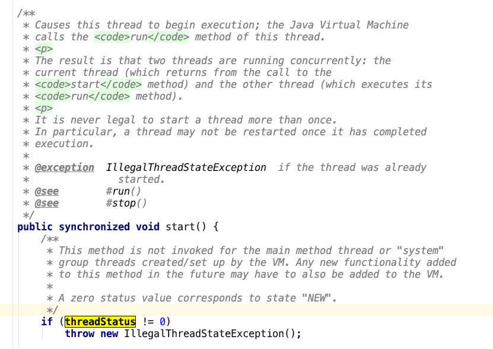

##### 注意事项：

start()方法中判断threadStatus是否为0，是判断当前线程是否新建态，0是代表新建态(上图中的源码注释里面有提到)，而不是就绪态，因为Java的Thread类中，Thread的Runnable状态包括了线程的就绪态和运行态，（Thread的state为RUNNABLE时(也就是threadStatus为4时)，代表线程为就绪态或运行态）。执行start()方法的线程还不是JVM新建的线程，所以不是就绪态。有一些技术文章把这里弄错了，例如这一篇[《深入浅出线程Thread类的start()方法和run()方法》](https://juejin.im/post/5b09274af265da0de25759d5)

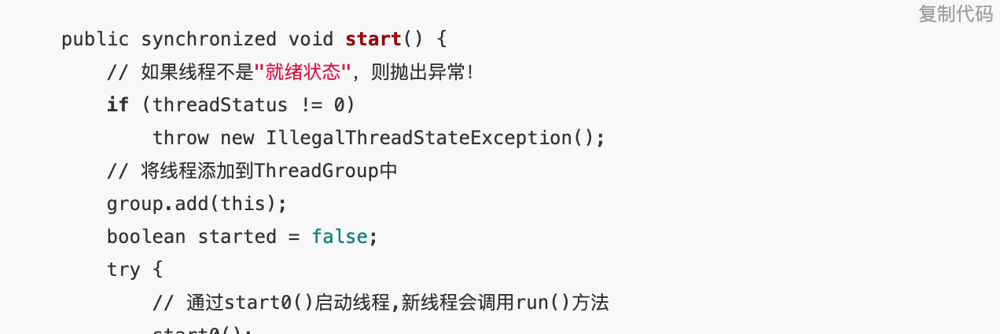

##### 总结

这种方式的缺点很明显，就是需要继承Thread类，而且实际上我们的需求可能仅仅是希望某些操作被一个其他的线程来执行，所以有了第二种方法。

#### 第二种 实现Runnable接口

这种方式就是创建一个类(例如下面代码中的Target类)，实现Runnable接口的Run方法，然后将Target类的实例对象作为Thread的构造器入参target，实际的线程对象还是Thread实例，只不过线程Thread与线程执行体（Target类的run方法）分离了，耦合度更低一些。

```java
class ThreadTarget implements Runnable {
    void run() {
        System.out.println(Thread.currentThread().getName()+"线程执行了run方法");
    }
    public static void main(String[] args) {
        System.out.println(Thread.currentThread().getName()+"线程执行了main方法");
        ThreadTarget target = new ThreadTarget();
        Thread thread = new Thread(target);
        thread.start();
    }
}
```

输出结果如下：


##### 原理

之所以有这种实现方法，是因为Thread类的run()方法中会判断成员变量target是否为空，不为空就会调用target类的run方法。

```java
private Runnable target;
public void run() {
    if (target != null) {
    		target.run();
    }
}
```

##### 另外一种写法

这种实现方式也有其他的写法，可以不创建Target类。

##### 匿名内部类

可以不创建Target类，可以使用匿名内部类的方式来实现，因此上面的代码也可以按以下方式写：

```java
Thread thread = new Thread(new Runnable() {
    @Override
    public void run() {
      		System.out.println(Thread.currentThread().getName()+"线程执行了run方法");
    }
});
thread.start();
```
##### Lamda表达式

在Java8之后，使用了@FunctionalInterface注解来修饰Runnable接口，表明Runnable接口是一个函数式接口，有且只有一个抽象方法，可以Lambda方式来创建Runnable对象，比使用匿名类的方式更加简洁一些。

```java
@FunctionalInterface
public interface Runnable {
    public abstract void run();
}
```

因此上面的代码也可以按以下方式写：

```java
Thread thread = new Thread(()->{
      System.out.println(Thread.currentThread().getName()+"线程执行了run方法");
})
thread.start()  
```

##### 总结

这种写法不用继承Thread，但是同样也有缺点，就是线程方法体(也就是run方法)不能设置返回值。

#### 第三种 实现Callable接口

Runnable接口中的run()方法是没有返回值，如果我们需要执行的任务带返回值就不能使用Runnable接口。创建一个类CallableTarget，实现Callable接口，实现带有**返回值的call()方法**，然后根据CallableTarget创建一个任务FutureTask，然后根据FutureTask来创建一个线程Thread，调用Thread的start方法可以执行任务。

```java
public class CallableTarget implements Callable<Integer> {
    public Integer call() throws InterruptedException {
        System.out.println(Thread.currentThread().getName()+"线程执行了call方法");
        Thread.sleep(5000);
        return 1;
    }
    public static void main(String[] args) throws ExecutionException, InterruptedException {
        System.out.println(Thread.currentThread().getName()+"线程执行了main方法");
        CallableTarget callableTarget = new CallableTarget();
        FutureTask<Integer> task = new FutureTask<Integer>(callableTarget);
        Thread thread = new Thread(task);
        thread.start();
        Integer result = task.get();//当前线程会阻塞，一直等到结果返回。
        System.out.println("执行完毕，打印result="+result);
        System.out.println("执行完毕");
    }
}
```

原理就是Thread类默认的run()方法实现是会去调用自身实例变量target的run()方法，(target就是我们构造Thread传入的FutureTask)，而FutureTask的run方法中就会调用Callable接口的实例的call()方法。

```java
//Thread类的run方法实现
@Override
public void run() {
  if (target != null) {
    //这里target就是我们在创建Thread时传入的FutureTask实例变量
    target.run();
  }
}
//FutureTask类的run方法实现
public void run() {
  if (state != NEW ||
      !UNSAFE.compareAndSwapObject(this, runnerOffset,
                                   null, Thread.currentThread()))
    return;
  try {
    Callable<V> c = callable;
    if (c != null && state == NEW) {
      V result;
      boolean ran;
      try {
        //在这里会调用Callable实例的call方法
        result = c.call();
        ran = true;
      } catch (Throwable ex) {
        result = null;
        ran = false;
        setException(ex);
      }
      if (ran)
        set(result);
    }
  } finally {
    // runner must be non-null until state is settled to
    // prevent concurrent calls to run()
    runner = null;
    // state must be re-read after nulling runner to prevent
    // leaked interrupts
    int s = state;
    if (s >= INTERRUPTING)
      handlePossibleCancellationInterrupt(s);
  }
}
```

### Java中的Runnable、Callable、Future、FutureTask的区别和联系？

最原始的通过新建线程执行任务的方法就是我们去新建一个类，继承Thread，然后去重写run()方法，但是这样限制太大了，Java也不支持多继承。所以有了Runnable。
##### Runnable
Runnable是一个接口，只需要新建一个类实现这个接口，然后重写run方法，将该类的实例作为创建Thread的入参，线程运行时就会调用该实例的run方法。
```java
@FunctionalInterfacepublic interface Runnable {
 public abstract void run();
}
```

Thread.start()方法->Thread.run()方法->target.run()方法

##### Callable

Callable跟Runnable类似，也是一个接口。只不过它的call方法有返回值，可以供程序接收任务执行的结果。

```java
@FunctionalInterfacepublic interface Callable<V> {
  V call() throws Exception;
}
```

##### Future

Future也是一个接口，Future就像是一个管理的容器一样，进一步对Runable和Callable的实例进行封装，定义了一些方法。取消任务的cancel()方法，查询任务是否完成的isDone()方法，获取执行结果的get()方法，带有超时时间来获取执行结果的get()方法。

```java
public interface Future<V> {
  //mayInterruptIfRunning代表是否强制中断
  //为true，如果任务已经执行，那么会调用Thread.interrupt()方法设置中断标识
  //为false，如果任务已经执行，就只会将任务状态标记为取消，而不会去设置中断标识
 boolean cancel(boolean mayInterruptIfRunning);
 boolean isCancelled();
 boolean isDone();
 V get() throws InterruptedException, ExecutionException;
 V get(long timeout, TimeUnit unit)   
   throws InterruptedException, ExecutionException, TimeoutException;
}
```

##### FutureTask

因为Future只是一个接口，并不能实例化，可以认为FutureTask就是Future接口的实现类，FutureTask实现了RunnableFuture接口，而RunnableFuture接口继承Runnable接口和Future接口。

```java
public class FutureTask<V> implements RunnableFuture<V> {
...
}

public interface RunnableFuture<V> extends Runnable, Future<V> {
    void run();
}
```

##### 使用案例

使用时，Runnable实现类的实例可以作为Thread的入参使用，而Callable只能使用FutureTask进行封装使用。

```java
//Runnable配合Thread进行使用
Thread threadA = new Thread(new Runnable() {
   @Override
      public void run() {   
			//任务的代码
      }
 });

//Callable使用FutureTask封装后，配合线程池进行使用
ExecutorService pool = Executors.newSingleThreadExecutor();
FutureTask task = new FutureTask(new Callable() {
        @Override
        public Object call() throws Exception {
          //任务的代码
          return null;
        }
});
pool.submit(task);

//Runnable使用FutureTask封装后，配合线程池进行使用
FutureTask task1 = new FutureTask(new Runnable() {
      @Override
      public void run() {
   				//任务的代码
      }
});
pool.submit(task1);
```

### Java中单例有哪些写法？

正确并且可以做到延迟加载的写法其实就是三种：

1.使用volatile修饰变量并且双重校验的写法来实现。

2.使用静态内部类来实现（类A有一个静态内部类B，类B有一个静态变量instance，类A的getInstance()方法会返回类B的静态变量instance，因为只有调用getInstance()方法时才会加载静态内部类B，这种写法缺点是不能传参。）

3.使用枚举来实现

#### 第1种 不加锁（裸奔写法）

多线程执行时，可能会在instance完成初始化之前，其他线性线程判断instance为null，从而也执行第二步的代码，导致初始化覆盖。

```java
public class UnsafeLazyInitialization {
	private static Instance instance;
	public static Instance getInstance() {
    if (instance == null) //1
      instance = new Instance(); //2
    }
    return instance;
}
```

#### 第2种-对方法加sychronize锁(俗称的懒汉模式)

初始化完成以后，每次调用getInstance()方法都需要获取同步锁，导致不必要的开销。

```java
public class Singleton {
    private static Singleton instance;
    public synchronized static Singleton getInstance() {
        if (instance == null)
            instance = new Instance();
        return instance;
    }
}
```
#### 第3种-使用静态变量(俗称的饿汉模式)

```
public class Singleton {  
    private static Singleton instance = new Singleton();  
    public static Singleton getInstance() {  
        return instance;  
    }  
}  
```
这种方法是缺点在于不能做到延时加载，在第一次调用getInstance()方法之前，如果Singleton类被使用到，那么就会对instance变量初始化。

#### 第4种-使用双重检查锁定

代码如下：

```java
public class Singleton {               
    private static Singleton instance;              
    public static Singleton getInstance() {              
        if (instance == null) {                        
            synchronized (Singleton.class) { 
                if (instance == null) { //双重检查存在的意义在于可能会有多个线程进入第一个判断，然后竞争同步锁，线程A得到了同步锁，创建了一个Singleton实例，赋值给instance，然后释放同步锁，此时线程B获得同步锁，又会创建一个Singleton实例，造成初始化覆盖。                
                    instance = new Singleton();        
                }
            }                                   
        }                                      
        return instance;                        
    }                                                 
}                     
```

instance = new Singleton();          

这句代码在执行时会分解为三个步骤：

1.为对象分配内存空间。

2.执行初始化的代码。

3.将分配好的内存地址设置给instance引用。

但是编译器会对指令进行重排序，只能保证单线程执行时结果不会变化，也就是可能第3步会在第2步之前执行，某个线程A刚好执行完第3步，正在执行第2步时，此时如果有其他线程B进入if (instance == null)判断，会发现instance不为null，然后将instance返回，但是实际上instance还没有完成初始化，线程B会访问到一个未初始化完成的instance对象。所以需要像第5种解法一样使用volatile来修饰变量，防止重排序。

#### 第5种 基于 volatile 的双重检查锁定的解决方案

代码如下：

```java
public class Singleton {               
    private volatile static Singleton instance;              
    public static Singleton getInstance() {              
        if (instance == null) {                        
            synchronized (Singleton.class) { 
                if (instance == null)//双重检查存在的意义在于可能会有多个线程进入第一个判断，然后竞争同步锁，线程A得到了同步锁，创建了一个Singleton实例，赋值给instance，然后释放同步锁，此时线程B获得同步锁，又会创建一个Singleton实例，造成初始化覆盖。
                    instance = new Singleton();          
            }                                   
        }                                      
        return instance;                        
    }                                                 
} 
```

volatile可以保证变量的内存可见性及防止指令重排。

volatile修饰的变量在编译后，会多出一个lock前缀指令，lock前缀指令相当于一个内存屏障（内存栅栏），有三个作用：

* 确保指令重排序时，内存屏障前的指令不会排到后面去，内存屏障后的指令不会排到前面去。
* 强制对变量在线程工作内存中的修改操作立即写入到物理内存。
* 如果是写操作，会导致其他CPU中对这个变量的缓存失效，强制其他CPU中的线程在获取变量时从物理内存中获取更新后的值。

所以使用volatile修饰后不会出现第3种写法中由于指令重排序导致的问题。

#### 第6种 - 使用静态内部类来实现

```java
class Test {    
    public static Signleton getInstance() {
        return Signleton.instance ;  // 只有调用getInstance()方法时，才会引用到静态内部类Signleton，从而会触发Signleton类的instance变量的初始化，以此实现懒加载的目的。
    }

     private static class Signleton {
        private static Signleton instance = new Signleton();
    }
}
```

因为JVM底层通过加锁实现，保证一个类只会被加载一次，多个线程在对类进行初始化时，只有一个线程会获得锁，然后对类进行初始化，其他线程会阻塞等待。所以可以使用上面的代码来保证instance只会被初始化一次，这种写法的问题在于创建单例时不能传参。

#### 7.使用枚举来实现单例

```java
public enum Singleton {
    //每个元素就是一个单例
    INSTANCE;
    //自定义的一些方法
    public void method(){}
}
```
这种写法比较简洁，但是不太便于阅读和理解，所以实际开发中应用得比较少，而且由于枚举类是不能通过反射来创建实例的(反射方法newInstance中判断是枚举类型，会抛出IllegalArgumentException异常)，所以可以防止反射。而且由于枚举类型的反序列化是通过java.lang.Enum的valueOf方法来实现的，不能自定义序列化方法，可以防止通过序列化来创建多个单例。

### 如何解决序列化时可以创建出单例对象的问题?

如果将单例对象序列化成字节序列后，然后再反序列成对象，那么就可以创建出一个新的单例对象，从而导致单例不唯一，避免发生这种情况的解决方案是在单例类中实现readResolve()方法。

```java
public class Singleton implements java.io.Serializable {     

   private Object readResolve() {     
         return INSTANCE;     
    }    
} 
```
通过实现readResolve方法，ObjectInputStream实例对象在调用readObject()方法进行反序列化时，就会判断相应的类是否实现了readResolve()方法，如果实现了，就会调用readResolve()方法返回一个对象作为反序列化的结果，而不是去创建一个新的对象。

### volatile关键字有什么用？怎么理解可见性，一般什么场景去用可见性？

当线程进行一个volatile变量的写操作时，JIT编译器生成的汇编指令会在写操作的指令后面加上一个“lock”指令。
Java代码如下:
```java
instance = new Singleton(); // instance是volatile变量
转变成汇编代码，如下。
0x01a3de1d: movb $0×0,0×1104800(%esi);0x01a3de24: lock addl $0×0,(%esp);
```
“lock”有三个作用：

1.将当前CPU缓存行的数据会写回到系统内存。

2.这个写回内存的操作会使得其他CPU里缓存了该内存地址的数据无效。

3.确保指令重排序时，内存屏障前的指令不会排到后面去，内存屏障后的指令不会排到前面去。

可见性可以理解为一个线程的写操作可以立即被其他线程得知。为了提高CPU处理速度，CPU一般不直接与内存进行通信，而是将系统内存的数据读到内部缓存，再进行操作。对于普通的变量，修改完不知道何时会更新到系统内存。但是如果是对volatile修饰的变量进行写操作，JVM就会向处理器发送一条Lock前缀的指令，将这个变量所在的缓存行的数据立即写回到系统内存。但是即便写回到系统内存，其他CPU中的缓存行数据还是旧的，为了保证数据一致性，其他CPU会嗅探在总线上传播的数据来检查自己的缓存行的值是否过期，当CPU发现缓存行对应的内存地址被修改，那么就会将当前缓存行设置为无效，下次当CPU对这个缓存行上的数据进行修改时，会重新从系统内存中把数据读到处理器缓存里。


##### 使用场景

##### 读写锁

如果需要实现一个读写锁，每次只能一个线程去写数据，但是有多个线程来读数据，就synchronized同步锁来对set方法加锁，get方法不加锁， 使用volatile来修饰变量，保证内存可见性，不然多个线程可能会在变量修改后还读到一个旧值。

```java
volatile Integer a;
//可以实现一写多读的场景，保证并发修改数据时的正确。
set(Integer c) {
  synchronized(this.a) {
		  this.a = c;
    
  }
}
get() {
	return a;
}
```

##### 状态位

用于做状态位标志，如果多个线程去需要根据一个状态位来执行一些操作，使用volatile修饰可以保证内存可见性。

用于单例模式用于保证内存可见性，以及防止指令重排序。


### Java中线程的状态是怎么样的？

在操作系统中，线程等同于轻量级的进程。

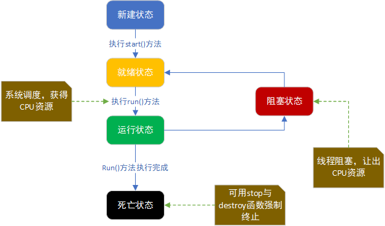

所以传统的操作系统线程一般有以下状态

1. **新建状态**:
   使用 new 关键字和 Thread 类或其子类建立一个线程对象后，该线程对象就处于新建状态。它保持这个状态直到程序 start() 这个线程。

2. **就绪状态**:
   当线程对象调用了start()方法之后，该线程就进入就绪状态。就绪状态的线程处于就绪队列中，要等待JVM里线程调度器的调度。

3. **运行状态:**
   如果就绪状态的线程获取 CPU 资源，就可以执行 run()，此时线程便处于运行状态。处于运行状态的线程最为复杂，它可以变为阻塞状态、就绪状态和死亡状态。

4. **阻塞状态:**

   如果一个线程执行了sleep（睡眠）、suspend（挂起）等方法，失去所占用资源之后，该线程就从运行状态进入阻塞状态。在睡眠时间已到或获得设备资源后可以重新进入就绪状态。可以分为三种：

   - 等待阻塞：运行状态中的线程执行 wait() 方法，使线程进入到等待阻塞状态。
   - 同步阻塞：线程在获取 synchronized同步锁失败(因为同步锁被其他线程占用)。
   - 其他阻塞：通过调用线程的 sleep() 或 join() 发出了 I/O请求时，线程就会进入到阻塞状态。当sleep() 状态超时，join() 等待线程终止或超时，或者 I/O 处理完毕，线程重新转入就绪状态。

5. **死亡状态:**
   一个运行状态的线程完成任务或者其他终止条件发生时，该线程就切换到终止状态。

但是Java中Thread对象的状态划分跟传统的操作系统线程状态有一些区别。

```java
public enum State {
    NEW,//新建态
    RUNNABLE,//运行态
    BLOCKED,//阻塞态
    WAITING,//等待态
    TIMED_WAITING,//有时间限制的等待态
    TERMINATED;//死亡态
}
```

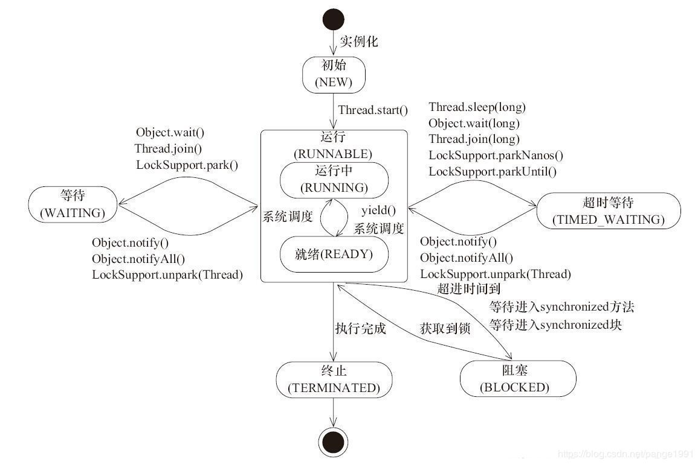


#### NEW 新建态

处于NEW状态的线程此时尚未启动，还没调用Thread实例的start()方法。

#### RUNNABLE 运行态

表示当前线程正在运行中。处于RUNNABLE状态的线程可能在Java虚拟机中运行，也有可能在等待其他系统资源（比如I/O）。

> Java线程的**RUNNABLE**状态其实是包括了传统操作系统线程的**ready**和**running**两个状态的。

#### BLOCKED 阻塞态

阻塞状态。线程没有申请到synchronize同步锁，就会处于阻塞状态，等待锁的释放以进入同步区。

#### WAITING 等待态

等待状态。处于等待状态的线程变成RUNNABLE状态需要其他线程唤醒。

调用如下3个方法会使线程进入等待状态：

- Object.wait()：使当前线程处于等待状态直到另一个线程调用notify唤醒它；
- Thread.join()：等待线程执行完毕，底层调用的是Object实例的wait()方法；
- LockSupport.park()：除非获得调用许可，否则禁用当前线程进行线程调度。

####  TIMED_WAITING 超时等待状态

超时等待状态。线程等待一个具体的时间，时间到后会被自动唤醒。

调用如下方法会使线程进入超时等待状态：

- Thread.sleep(long millis)：使当前线程睡眠指定时间；

- Object.wait(long timeout)：线程休眠指定时间，等待期间可以通过notify()/notifyAll()唤醒；

- Thread.join(long millis)：等待当前线程最多执行millis毫秒，如果millis为0，则会一直执行；

- LockSupport.parkNanos(long nanos)： 除非获得调用许可，否则禁用当前线程进行线程调度指定时间；

- LockSupport.parkUntil(long deadline)：同上，也是禁止线程进行调度指定时间；

#### TERMINATED 终止态

终止状态。此时线程已执行完毕。

#### 状态转换

1.BLOCKED与RUNNABLE状态的转换

处于BLOCKED状态的线程是因为在等待锁的释放，当获得锁之后就转换为RUNNABLE状态。

2.WAITING状态与RUNNABLE状态的转换

**Object.wait()**，**Thread.join()**和**LockSupport.park()**这3个方法可以使线程从RUNNABLE状态转为WAITING状态。

3.TIMED_WAITING与RUNNABLE状态转换

TIMED_WAITING与WAITING状态类似，只是TIMED_WAITING状态等待的时间是指定的。

调用**Thread.sleep(long)**，**Object.wait(long)**，**Thread.join(long)**会使得RUNNABLE状态转换为TIMED_WAITING状态

### wait()，join()，sleep()方法有什么作用？

首先需要对wait()，join()，sleep()方法进行介绍。

#### Object.wait()方法是什么？

调用wait()方法前线程必须持有对象Object的锁。线程调用wait()方法后，会释放当前的Object锁，进入锁的monitor对象的等待队列，直到有其他线程调用notify()/notifyAll()方法唤醒等待锁的线程。

需要注意的是，其他线程调用notify()方法只会唤醒单个等待锁的线程，如果有多个线程都在等待这个锁的话，不一定会唤醒到之前调用wait()方法的线程。

同样，调用notifyAll()方法唤醒所有等待锁的线程之后，也不一定会马上把时间片分给刚才放弃锁的那个线程，具体要看系统的调度。

#### Thread.join()方法是什么？

join()方法是Thread类的一个实例方法。它的作用是让当前线程陷入“等待”状态，等join的这个线程threadA执行完成后，再继续执行当前线程。

实现原理是join()方法本身是一个sychronized修饰的方法，也就是调用join()这个方法需要先获取threadA的锁，获得锁之后再调用wait()方法来进行等待，一直到threadA执行完成后，threadA会调用notify_all()方法,唤醒所有等待的线程，当前线程才会结束等待。

```java
Thread threadA = new Thread();
threadA.join();
```

join()方法的源码：

```java
public final void join() throws InterruptedException {
    join(0);//0的话代表没有超时时间一直等下去
}
public final synchronized void join(long millis)
throws InterruptedException {
    long base = System.currentTimeMillis();
    long now = 0;

    if (millis < 0) {
        throw new IllegalArgumentException("timeout value is negative");
    }

    if (millis == 0) {
        while (isAlive()) {
            wait(0);
        }
    } else {
        while (isAlive()) {
            long delay = millis - now;
            if (delay <= 0) {
                break;
            }
            wait(delay);
            now = System.currentTimeMillis() - base;
        }
    }
}
```

这是jvm中Thead的源码，在线程执行结束后会调用notify_all来唤醒等待的线程。

```java
//一个c++函数：
void JavaThread::exit(bool destroy_vm, ExitType exit_type) ；
//里面有一个贼不起眼的一行代码
ensure_join(this);

static void ensure_join(JavaThread* thread) {
  Handle threadObj(thread, thread->threadObj());

  ObjectLocker lock(threadObj, thread);

  thread->clear_pending_exception();

  java_lang_Thread::set_thread_status(threadObj(),        java_lang_Thread::TERMINATED);
  java_lang_Thread::set_thread(threadObj(), NULL);
  //同志们看到了没，别的不用看，就看这一句
  //thread就是当前线程，是啥？就是刚才例子中说的threadA线程
  lock.notify_all(thread);
  thread->clear_pending_exception();
}
```

#### sleep()方法是什么？

sleep方法是Thread类的一个静态方法。它的作用是让当前线程睡眠一段时间。：**sleep方法是不会释放当前线程持有的锁，而wait方法会。**

sleep与wait方法的区别：

- wait可以指定时间，也可以不指定；而sleep必须指定时间。
- wait释放cpu资源，同时释放锁；sleep释放cpu资源，但是不释放锁，所以易死锁。（调用join()方法也不会释放锁）
- wait必须放在同步块或同步方法中，而sleep可以再任意位置。

参考文章：

http://redspider.group:4000/article/01/4.html

https://www.jianshu.com/p/5d88b122a050

### Thread.sleep(),Object.wait(),LockSupport.park()有什么区别？

1.这三个方法都会让线程挂起，释放CPU时间片，进入到阻塞态。但是Object.wait()需要释放锁，所以必须在synchronized同步锁中使用，同理配套的Object.notify()也是。而Thead.sleep(),LockSupport.park()不需要在synchronized同步锁中使用，并且在调用时也不会释放锁。

2.由于Thread.sleep()没有对应的唤醒线程的方法，所以必须指定超时时间，超过时间后，线程恢复。所以调用Thread.sleep()后的线程一般是出于TIME_WAITING状态，而调用了Object.wait()，LockSupport.park()的方法是进入到WAITING状态。

3.Object.wait()对应的唤醒方法为Object.notify()，LockSupport.park()对应的唤醒方法为LockSupport.unpark()。

4.在代码中必须能保证wait方法比notify方法先执行，如果notify方法比wait方法早执行的话，就会导致因wait方法进入休眠的线程接收不到唤醒通知的问题。而park、unpark则不会有这个问题，我们可以先调用unpark方法释放一个许可证，这样后面线程调用park方法时，发现已经许可证了，就可以直接获取许可证而不用进入休眠状态了。（**LockSupport.park() 的实现原理是通过二元信号量做的阻塞，要注意的是，这个信号量最多只能加到1，也就是无论执行多少次unpark()方法，也最多只会有一个许可证。**）

5.三种方法让线程进入阻塞态后，都可以响应中断，也就是调用Thread.interrupt()方法会设置中断标志位，之前执行Thread.sleep(),Object.wait()了的线程会抛出InterruptedException异常，然后需要代码进行处理。而调用了park()方法的线程在响应中断只会相当于一次正常的唤醒操作（等价于调用unpark()方法），让线程唤醒，继续执行后面的代码，不会抛出InterruptedException异常。

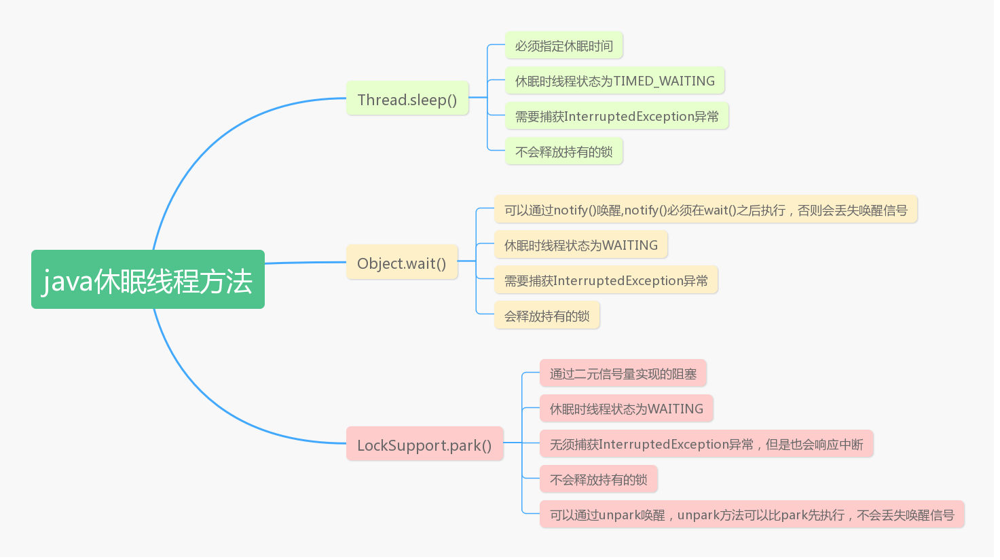

参考链接：

https://blog.csdn.net/u013332124/article/details/84647915

### 谈一谈你对线程中断的理解？

在Java中认为，一个线程不应该由其他线程来强制中断或者停止，所以一些会强制中断线程的方法Thread.stop(), Thread.suspend()方法都已经废弃了。所以一般是通过调用thread.interrupt();方法来设置线程的中断标识，

1.这样如果线程是处于阻塞状态，会抛出InterruptedException异常，代码可以进行捕获，进行一些处理。（例如Object#wait、Thread#sleep、BlockingQueue#put、BlockingQueue#take。其中BlockingQueue主要调用conditon.await()方法进行等待，底层通过LockSupport.park()实现）

2.如果线程是处于RUNNABLE状态，也就是正常运行，调用thread.interrupt();只是会设置中断标志位，不会有什么其他操作。

```java
//将线程的中断标识设置为true
thread.interrupt();
//判断线程的中断标识是否为true
thread.isInterrupted()
//会返回当前的线程中断状态，并且重置线程的中断标识，将中断标识设置为false
thread.interrupted()
```

### 线程执行的任务可以终止吗？

##### 1.设置中断

FutureTask提供了cancel(boolean mayInterruptIfRunning)方法来取消任务，并且

如果入参为false，如果任务已经在执行，那么任务就不会被取消。

如果入参为true，如果任务已经在执行，那么会调用Thread的interrupt()方法来设置线程的中断标识，如果线程处于阻塞状态，会抛出InterruptedException异常，如果正常状态只是设置标志位，修改interrupted变量的值。所以如果要取消任务只能在任务内部中调用thread.isInterrupted()方法获取当前线程的中断状态，自行取消。

##### 2.线程的stop方法

线程的stop()方法可以让线程停止执行，释放所有的锁，抛出ThreadDeath这种Error。但是在释放锁之后，没有办法让受这些锁保护的资源，对象处于一个安全，一致的状态。（例如有一个变量a，本来的值是0，你的线程任务是将a++后然后再进行a--。正常情况下任务执行完之后，其他线程取到这个变量a的值应该是0，但是如果之前调用了Thread.stop方法时，正好是在a++之后，那么变量a就会是1，这样其他线程取到的a就是出于不一致的状态。）

### 让线程顺序执行有哪些方法？

##### 1.主线程Join

就是调用threadA.start()方法让线程A先执行，然后主线程调用threadA.join()方法，然后主线程进入TIME_WAITING状态，直到threadA执行结束后，主线程才能继续往下执行，执行线程B的任务。(join方法的底层实现其实是调用了threadA的wait()方法，当线程A执行完毕后，会自动调用notifyAll()方法唤醒所有线程。)

示例代码如下：

```java
Thread threadA = new Thread(new Runnable() {
      @Override
      public void run() {
        //执行threadA的任务
      }
});
Thread threadB= new Thread(new Runnable() {
      @Override
      public void run() {
        //执行threadB的任务
      }
});
//执行线程A任务
threadA.start();
//主线程进行等待
threadA.join();
//执行线程B的任务
threadB.start();
```

##### 子线程Join

就是让线程B的任务在执行时，调用threadA.join()方法，这样就只有等线程A的任务执行完成后，才会执行线程B。

```java
   Thread threadA = new Thread(new Runnable() {
        @Override
        public void run() {
        //执行threadA的任务
        }
    });
    Thread threadB= new Thread(new Runnable() {
        @Override
        public void run() {
          	//子线程进行等待，知道threadA任务执行完毕
    				threadA.join();
            //执行threadB的任务
        }
    });
		//执行线程A任务
    threadA.start();
		//执行线程B的任务
    threadB.start();
```
##### 单线程池法

就是使用Executors.newSingleThreadExecutor()这个线程池，这个线程池的特点就是只有一个执行线程，可以保证任务按顺序执行。

```java
ExecutorService pool = Executors.newSingleThreadExecutor();
//提交任务A
executorService.submit(taskA);
//提交任务B
executorService.submit(taskB);
```

##### 等待通知法(wait和notify)

就是在线程B中调用Object.waiting()方法进行等待，线程A执行完毕后调用Object.notify()方法进行唤醒。(这种方法有两个缺点，一个是Object.waiting()和notify()方法必须在同步代码块中调用，第二个是如果线程A执行过快，先调用了object.notify()方法，就会导致线程B后面一直得不到唤醒。)

```java
 		final Object object = new Object();
 		Thread threadA = new Thread(new Runnable() {
        @Override
        public void run() {
        //执行threadA的任务
          synchronized(object) {
             object.notify();
          }
        }
    });
    Thread threadB= new Thread(new Runnable() {
        @Override
        public void run() {
            synchronized(object) {
          	//子线程进行等待，知道threadA任务执行完毕
    						object.wait();
            //执行threadB的任务
            }
        }
    });
```

##### 等待通知法(await和singal)

具体实现就是Reentrantlock可以创建出一个Condition实例queue，可以认为是一个等待队列，线程B调用queue.await()就会进行等待，直到线程A执行完毕调用queue.signal()来唤醒线程B。

```java
 				final ReentrantLock lock   = new ReentrantLock();
        final Condition     queue1 = lock.newCondition();
        final Object object = new Object();
        final Thread threadA = new Thread(new Runnable() {
            @Override
            public void run() {
                //执行threadA的任务
                    lock.lock();
                    try {
                      //唤醒线程B的任务
                        queue1.signal();
                    } catch (InterruptedException e) {
                        e.printStackTrace();
                    }
                    System.out.println("执行了任务A2");
                    lock.unlock();
            }
        });
        final Thread threadB= new Thread(new Runnable() {
            @Override
            public void run() {
                lock.lock();
                //子线程进行等待，知道threadA任务执行完毕
                    try {
                        queue1.await();
                        System.out.println("执行了任务B2");

                    } catch (InterruptedException e) {
                        e.printStackTrace();
                    }
                    //执行threadB的任务
                lock.unlock();
            }
        });
        threadA.start();
        threadB.start();
```


参考链接：

http://cnblogs.com/wenjunwei/p/10573289.html

### 线程间怎么通信？

#### 1.synchronized锁

通过synchronized锁来进行同步，让一次只能一个线程来执行。

#### 2.等待/通知机制

```java
//假设我们的需求是B执行结束后A才能执行
//线程A的代码
synchronized(对象) { while(条件不满足) {
    while(条件不满足) {
        对象.wait(); //线程A进行等待
    }
    //线程A执行相关的的逻辑
 } 
 
//线程B的代码
 synchronized(对象) { 
 		//线程B执行相关的的逻辑
 		//线程B唤醒线程A
 		对象.notifyAll();
 }
 
```

等待/通知机制，是指一个线程A调用了对象objectA的wait()方法进入等待状态，而另一个线程B调用了对象objectA的notify()或者notifyAll()方法，线程A收到通知后从对象objectA的wait()方法返回，进而执行后续操作。上述两个线程通过对象objectA来完成交互，而对象上的wait()和notify/notifyAll()的关系就如同开关信号一样，用来完成等待方和通知方之间的交互工作。


1)使用wait()、notify()和notifyAll()时需要先对调用对象加锁。 

2)调用wait()方法后，线程状态由RUNNING变为WAITING，并将当前线程放置到对象的 

等待队列。 

3)notify()或notifyAll()方法调用后，等待线程依旧不会从wait()返回，因为等待线程只是从等待队列到了同步队列，需要调用notify()或 notifAll()的线程释放锁之后，等待线程获得锁，才能从同步队列中移除，才有机会从wait()返回，才能继续往下执行。  

4)notify()方法将等待队列中的一个等待线程从等待队列中移到同步队列中，而notifyAll() 方法则是将等待队列中所有的线程全部移到同步队列，被移动的线程状态由WAITING变为 BLOCKED。 

5)从wait()方法返回的前提是获得了调用对象的锁。 

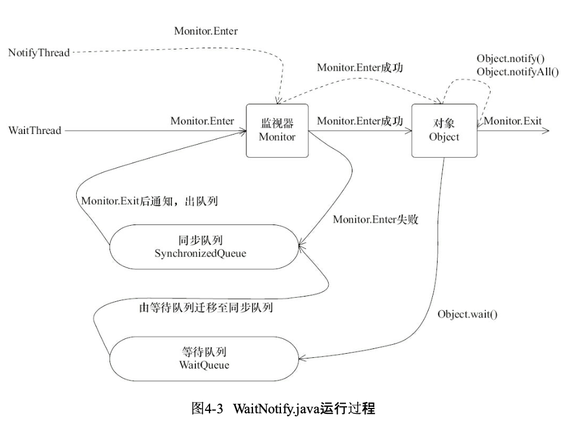

##### 3.管道

管道输入/输出流 管道输入/输出流和普通的文件输入/输出流或者网络输入/输出流不同之处在于，它主要 用于线程之间的数据传输，而传输的媒介为内存。 管道输入/输出流主要包括了如下4种具体实现:PipedOutputStream、PipedInputStream、 PipedReader和PipedWriter，前两种面向字节，而后两种面向字符。

 PipedReader和PipedWriter可以一个线程A调用PipedWriter实例的write()方法，往里面写数据，然后与PipedWriter实例建立连接的PipedReader实例可以读到数据，线程B可以通过PipedReader实例读到数据。

在代码清单4-12所示的例子中，创建了printThread，它用来接受main线程的输入，任何 main线程的输入均通过PipedWriter写入，而printThread在另一端通过PipedReader将内容读出并打印。 

代码清单4-12 Piped.java 
```java
public class Piped {
       public static void main(String[] args) throws Exception {
          PipedWriter out = new PipedWriter();
          PipedReader in = new PipedReader();
          // 将输出流和输入流进行连接，否则在使用时会抛出IOException 											out.connect(in);
          Thread printThread = new Thread(new Print(in), "PrintThread"); printThread.start();
          int receive = 0;
          try {
							while ((receive = System.in.read()) != -1) { 				out.write(receive);
									}
					} finally {	out.close(); }
       }
       static class Print implements Runnable {
           private PipedReader in;
           public Print(PipedReader in) {
								this.in = in; 
					}
				public void run() { 
							int receive = 0; 
							try {
									while ((receive = in.read()) != -1) { System.out.print((char) receive);
                   }
               } catch (IOException ex) {
       			}
     	}
		}
}    
```

运行该示例，输入一组字符串，可以看到被printThread进行了原样输出。 

Repeat my words. 
Repeat my words. 

#### 4.Thread.join

Thread.join()的使用如果一个线程A执行了thread.join()语句，当前线程A会一直等待thread线程终止之后才从thread.join()返回，向下执行。线程Thread除了提供join()方法之外，还提供了join(long millis)和join(long millis,int nanos)两个具备超时参数的方法。

#### 5.ThreadLocal的使用 

ThreadLocal，即线程变量，是一个以ThreadLocal对象为键、任意对象为值的存储结构。这 个结构被附带在线程上，也就是说一个线程可以根据一个ThreadLocal对象查询到绑定在这个 线程上的一个值。 

```java
public class Profiler {
    // 第一次get()方法调用时会进行初始化(如果set方法没有调用)，每个线程会调用一次
    private static final ThreadLocal<Long> TIME_THREADLOCAL = new ThreadLocal<Long>() {
        protected Long initialValue() { return System.currentTimeMillis();} 
    };
    public static final void begin() { 
        TIME_THREADLOCAL.set(System.currentTimeMillis());
    }
    public static final long end() {
        return System.currentTimeMillis() - TIME_THREADLOCAL.get(); 
    }
    public static void main(String[] args) throws Exception { 
        Profiler.begin();
        TimeUnit.SECONDS.sleep(1);
        System.out.println("Cost: " + Profiler.end() + " mills");
    } 
}
```

Profiler可以被复用在方法调用耗时统计的功能上，在方法的入口前执行begin()方法，在 

方法调用后执行end()方法，好处是两个方法的调用不用在一个方法或者类中，比如在AOP(面 向方面编程)中，可以在方法调用前的切入点执行begin()方法，而在方法调用后的切入点执行 end()方法，这样依旧可以获得方法的执行耗时。 

### 怎么实现实现一个生产者消费者？

#### 1.使用Object.wait()和Object.notify()实现
使用queue作为一个队列，存放数据，并且使用Synchronized同步锁，每次只能同时存在一个线程来生产或者消费数据，

生成线程发现队列容量>10,生产者线程就进入waiting状态，一旦成功往队列添加数据，那么就唤醒所有线程（主要是生产者线程起来消费）。

消费线程消费时，发现队列容量==0，也会主动进入waiting状态。

伪代码如下：

```java
LinkedList<Integer> queue = new LinkedList<>();
void produce(Integer value) {
  synchronized(queue) {//加锁控制，保证同一时间点，只能有一个线程生成或者消费
    while(queue.size()>10) {
					queue.waiting();
    }
    queue.add(value);
    //唤醒消费者线程
    queue.notifyAll();
  }
}
Integer consumer() {
  synchronized(queue) {//加锁控制，保证同一时间点，只能有一个线程生成或者消费
    while(queue.size()==0) {
       queue.waiting();
    }
    Integer value = queue.poll();
    //唤醒生产者线程
    queue.notifyAll();
		return value;
  }
}
```

完整代码如下：

```java
public static void main(String[] args) {
    Queue<Integer> queue    = new LinkedList<>();
    final Customer customer = new Customer(queue);
    final Producer producer = new Producer(queue);
    ExecutorService pool = Executors.newCachedThreadPool();
    for (int i = 0; i < 1000; i++) {
        pool.execute(new Runnable() {
            @Override
            public void run() {
                try {
                    Thread.sleep(1000);
                } catch (InterruptedException e) {
                    e.printStackTrace();
                }
                Integer a = customer.removeObject();
                System.out.println("消费了数据 "+a);
            }
        });
        pool.execute(new Runnable() {
            @Override
            public void run() {
                try {
                    Thread.sleep(1000);
                } catch (InterruptedException e) {
                    e.printStackTrace();
                }
                Random  random = new Random();
                Integer a      = random.nextInt(1000);
                System.out.println("生成了数据 "+a);
                producer.addObject(a);
            }
        });
    }
}
private static class Customer {
    Queue<Integer> queue;
    Customer(Queue<Integer> queue) { this.queue = queue; }
    public Integer removeObject() {
        synchronized (queue) {
            try {
                while (queue.size()==0) {
                    System.out.println("队列中没有元素了，进行等待");
                    queue.wait();
                }
            } catch (InterruptedException e) {
                e.printStackTrace();
            }
            Integer number = queue.poll();
            System.out.println("唤醒所有生产线程，当前queue大小是" + queue.size());
            queue.notifyAll();
            return number;
        }
    }
}
private static class Producer {
    Queue<Integer> queue;
    Producer(Queue<Integer> queue) { this.queue = queue; }
    public void addObject(Integer number) {
        synchronized (queue) {
            try {
                while (queue.size()>10) {
                    queue.wait();
                }
            } catch (InterruptedException e) {
                e.printStackTrace();
            }
            queue.add(number);
            queue.notifyAll();
            System.out.println("唤醒所有消费线程，当前queue大小是"+queue.size());
        }
    }
}
```

#### 2.使用Lock和Condition来实现

调用Object.wait()方法可以让线程进入等待状态，被添加到Object的monitor监视器的等待队列中，Object.notifyAll()可以唤醒monitor监视器等待队列中的所有线程。

而调用lock的newCondition()方法,可以返回一个ConditionObject实例对象，每个ConditionObject包含一个链表，存储等待队列。可以认为一个ReentrantLock有一个同步队列（存放没有获得锁的线程），和多个等待队列（存放调用await()方法的线程）。使用Condition.singal()和Condition.singalAll()可以更加**精准的唤醒线程**，也就是唤醒的都是这个Condition对应的等待队列里面的线程，而Object.notify()和Object.notifyAll()只能唤醒等待队列中的所有的线程。

```java
ReentrantLock lock = new ReentrantLock();
Condition customerQueue = lock.newCondition();
```
ReentrantLock的Condition相关的实现

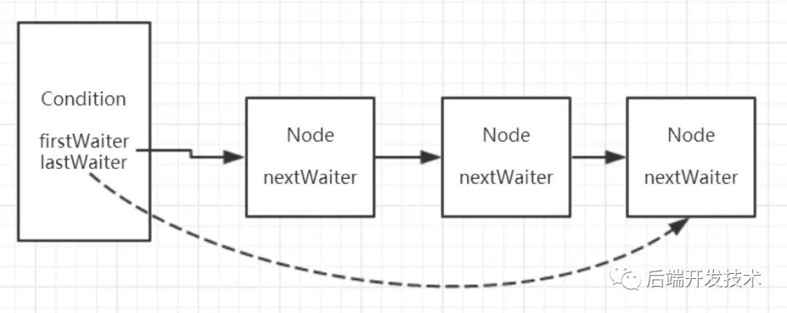

```java
abstract static class Sync extends AbstractQueuedSynchronizer {
    final ConditionObject newCondition() {
        return new ConditionObject();
    }
}
//AQS内部类 ConditionObject
public class ConditionObject implements Condition, java.io.Serializable {
    private static final long serialVersionUID = 1173984872572414699L;
    //链表头结点
    private transient Node firstWaiter;
    //链表尾结点
    private transient Node lastWaiter;
    //真正的创建Condition对象
    public ConditionObject() { }
}
```

消费者-生产者实现

```java
public static void main(String[] args) {
    ReentrantLock lock = new ReentrantLock();
    Condition customerQueue = lock.newCondition();
    Condition producerQueue = lock.newCondition();

    Queue<Integer>     queue    = new LinkedList<>();
    final Customer customer = new Customer(lock,customerQueue, producerQueue,queue);
    final Producer producer = new  Producer(lock,customerQueue, producerQueue,queue);

    ExecutorService    pool     = Executors.newCachedThreadPool();
    for (int i = 0; i < 1000; i++) {
        pool.execute(new Runnable() {
            @Override
            public void run() {
                try {
                    Thread.sleep(1000);
                } catch (InterruptedException e) {
                    e.printStackTrace();
                }
                Integer a = customer.take();
//                    System.out.println("消费了数据 "+a);
            }
        });
        pool.execute(new Runnable() {
            @Override
            public void run() {
                try {
                    Thread.sleep(1000);
                } catch (InterruptedException e) {
                    e.printStackTrace();
                }
                Random  random = new Random();
                Integer a      = random.nextInt(1000);
//                    System.out.println("生成了数据 "+a);
                producer.add(a);
            }
        });
    }
}

private static class Customer {
    private ReentrantLock lock;
    private Condition customer;
    private Condition producer;
    private Queue<Integer> queue;

    Customer(ReentrantLock lock, Condition customer, Condition producer,Queue<Integer> queue) {
        this.lock = lock;
        this.customer = customer;
        this.producer = producer;
        this.queue = queue;
    }

    public Integer take() {
        lock.lock();
        Integer element = null;
        try {
            while (queue.size() == 0) {
                customer.await();
            }
            element = queue.poll();
            System.out.println("消费者线程取出来元素"+element);
            producer.signalAll();
        } catch (InterruptedException e) {
            e.printStackTrace();
        } finally {
            lock.unlock();
        }
        return element;
    }
}

private static class Producer {
    private ReentrantLock lock;
    private Condition customer;
    private Condition producer;
    private Queue<Integer> queue;

    Producer(ReentrantLock lock, Condition customer, Condition producer,Queue<Integer> queue) {
        this.lock = lock;
        this.customer = customer;
        this.producer = producer;
        this.queue = queue;
    }

    public void add( Integer element) {
        lock.lock();
        try {
            while (queue.size() > 10) {
                producer.await();
            }
             queue.add(element);
            System.out.println("生成和线程添加元素"+element);
            customer.signalAll();
        } catch (InterruptedException e) {
            e.printStackTrace();
        } finally {
            lock.unlock();
        }
    }
}
```
#### 3.使用BlockingQueue实现
利用阻塞队列BlockingQueue的特征进行生产和消费的同步(其实阻塞队列内部也是基于Lock,condition实现的 )

```java
public class BlockQueueRepository<T> extends AbstractRepository<T> implements Repository<T> {
    public BlockQueueRepository(int cap) {
      //cap代表队列的最大容量
        products = new LinkedBlockingQueue<>(cap);
    }

    @Override
    public void put(T t) {
        if (isFull()) {
            log.info("repository is full, waiting for consume.....");
        }
        try {
          //如果队列长度已满，那么会阻塞等待
            ((BlockingQueue) products).put(t);
        } catch (InterruptedException e) {
            e.printStackTrace();
        }
    }

    @Override
    public T take() {
        T product = null;
        if (isEmpty()) {
            log.info("repository is empty, waiting for produce.....");
        }
        try {
            //如果队列元素为空，那么也会阻塞等待
            product = (T) ((BlockingQueue) products).take();
        } catch (InterruptedException e) {
            e.printStackTrace();
        }
        return product;
    }
}
```

### 谈一谈你对线程池的理解？

#### 首先线程池有什么作用？

* 1.提高响应速度，如果线程池有空闲线程的话，可以直接复用这个线程执行任务，而不用去创建。

* 2.减少资源占用，每次都创建线程都需要申请资源，而使用线程池可以复用已创建的线程。

* 3.可以控制并发数，可以通过设置线程池的最大线程数量来控制最大并发数，如果每次都是创建新线程，来了大量的请求，可能会因为创建的线程过多，造成内存溢出。

* 4.更加方便来管理线程资源。

#### 线程池有哪些参数？

```java
public ThreadPoolExecutor(int corePoolSize,
                              int maximumPoolSize,
                              long keepAliveTime,
                              TimeUnit unit,
                              BlockingQueue<Runnable> workQueue,
                              ThreadFactory threadFactory) {
        this(corePoolSize, maximumPoolSize, keepAliveTime, unit, workQueue,
             threadFactory, defaultHandler);
    }
```

##### 1.corePoolSize 核心线程数

该线程池中**核心线程数最大值**，添加任务时，即便有空闲线程，只要当前线程池线程数<corePoolSize,都是会新建线程来执行这个任务。并且核心线程空闲时间超过keepAliveTime也是不会被回收的。（

从阻塞队列取任务时，如果阻塞队列为空:

**核心线程**的会一直卡在`workQueue.take`方法，这个take方法每种等待队列的实现各不相同，以LinkedBlockingQueue为例，

在这个方法里会调用notEmpty队列(这是Condition实例)的await()方法一直阻塞并挂起，不会占用CPU资源。

**非核心线程**会调用workQueue.poll(keepAliveTime, TimeUnit.NANOSECONDS)方法取任务 ，这个poll方法每种等待队列的实现各不相同，以LinkedBlockingQueue为例，

在这个方法里面会调用notEmpty队列(这是Condition实例)的awaitNanos()方法进行超时等待，如果超过keepAliveTime时间后还没有新的任务，就会返回`null`,Worker对象的`run()`方法循环体的判断为`null`,任务结束，然后线程被系统回收）

##### 2.maximumPoolSize 最大线程数

**该线程池中线程总数最大值** ，一般是用于当线程池中的线程都在执行任务，并且等待队列满了时，如果当前线程数<maximumPoolSize,可以创建一个新线程来执行任务。maximumPoolSize一般也可以用来现在最大线程并发执行量。

##### **3.workQueue 等待队列**

等待队列，一般是抽象类**BlockingQueue**的子类。

| ArrayBlockingQueue    | 有界队列，一种使用数组实现的先进先出的有界阻塞队列。支持公平锁和非公平锁，底层数据结构是数组，需要指定队列的大小。 |
| --------------------- | ------------------------------------------------------------ |
| LinkedBlockingQueue   | 无界队列，一种使用链表实现的先进先出的有界阻塞队列。默认的容量是`Interge.MAX_VALUE`，相比于`ArrayBlockingQueue`具有更高的吞吐量，但是却丢失了快速随机存取的特性。默认大小是`Integer.MAX_VALUE`，也可以指定大小。newFixedThreadPool()和newSingleThreadExecutor()的等待队列都是这个阻塞队列。 |
| LinkedBlockingDeque   | 一种使用链表实现的具有双向存取功能的有界阻塞队列。在高并发下，相比于`LinkedBlockingQueue`可以将锁竞争降低最多一半 |
| PriorityBlockingQueue | 一种提供了优先级排序的无界阻塞队列。如果没有提供具体的排列方法，那么将会使用自然排序进行排序，会抛出`OOM`异常。 |
| SynchronousQueue      | SynchronousQueue一种不存储任务的同步队列，内部没有使用AQS。如果是公平锁模式，每次调用put方法往队列中添加一个线程后，线程先进行自旋，然后超时后就阻塞等待直到有提取线程把调用take方法把操作取出，这样之前调用put方法的线程才能继续执行。如果是非公平锁模式，每次添加任务就是就是把任务添加到栈中，这样就是先进后出，所以非公平。 |
| LinkedTransferQueue   | 一种使用链表实现的无界阻塞队列。                             |
| DelayQueue            | 一种无界的延时队列，可以设置每个元素需要等待多久才能从队列中取出。 延迟队列，该队列中的元素只有当其指定的延迟时间到了，才能够从队列中获取到该元素 。底层数据数据结构是数组实现的堆结构。 |

**4.keepAliveTime**：**非核心线程闲置超时时长**。

非核心线程如果处于闲置状态超过该值，就会被销毁。如果设置allowCoreThreadTimeOut(true)，则会也作用于核心线程。

**5.RejectedExecutionHandler 拒绝处理策略**

**拒绝处理策略**，核心线程已经满了，等待队列也满了，并且线程数量大于最大线程数时，就会采用拒绝处理策略进行处理，四种拒绝处理的策略为 ：

1. ThreadPoolExecutor.AbortPolicy：**默认拒绝处理策略**，丢弃任务并抛出RejectedExecutionException异常。
2. ThreadPoolExecutor.DiscardPolicy：丢弃新来的任务，但是不抛出异常。
3. ThreadPoolExecutor.DiscardOldestPolicy：丢弃等待队列头部（最旧的）的任务，然后重新尝试执行程序，将任务添加到队列中（如果再次失败，重复此过程）。
4. ThreadPoolExecutor.CallerRunsPolicy：由调用线程处理该任务。

##### 6.ThreadFactory创建线程的工厂

ThreadFactory是一个接口，只有一个newThread()方法。(默认情况下ThreadPoolExecutor用的ThreadFactory默认都是Executors.defaultThreadFactory())。一般来说，你通过ThreadPoolExecutor来创建线程池，对于线程池中的线程你是无法直接接触到的，例如你为了更加方便得定位线程池的Bug，希望对线程池中线程设置跟业务相关的名称，那么就需要建一个类，实现ThreadFactory接口，编写newThread()方法的实现。
```
public interface ThreadFactory {
    Thread newThread(Runnable r);
}
```

#### 线程池执行任务的过程？

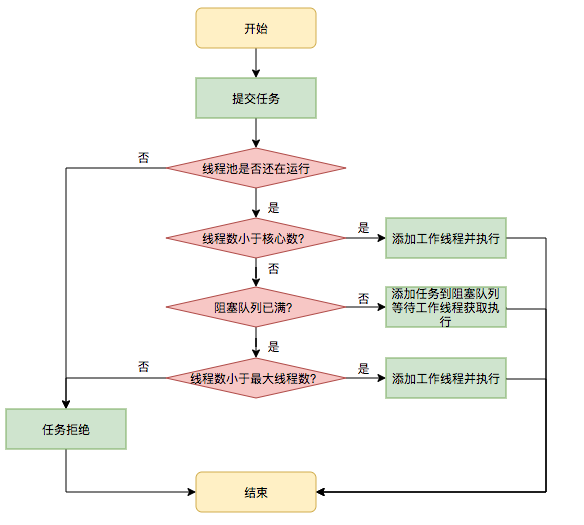

#### Executors提供的四种线程池的使用场景。

Executors提供四种线程池，分别为：

##### newFixedThreadPool 定长线程池


```java
public static ExecutorService newFixedThreadPool(int nThreads) {
    return new ThreadPoolExecutor(nThreads, nThreads,
                                  0L, TimeUnit.MILLISECONDS,
                                  new LinkedBlockingQueue<Runnable>());
}
public LinkedBlockingQueue() {
    this(Integer.MAX_VALUE);
}
```

一句话总结就是：**线程数固定，等待队列无限长**。

创建一个线程池，核心线程数与最大线程数值都是传入参数nThreads。可控制线程最大并发数，超出的线程会在队列中等待（比较适合需要控制并发量的情况）。主要是通过将核心线程数设置为与最大线程数相等实现的。缺点是LinkedBlockingQueue队列的默认长度是Integer.MAX_VALUE，也存在内存溢出的风险。

**与CachedThreadPool的区别**：

- 因为 corePoolSize == maximumPoolSize ，所以**newFixedThreadPool**只会创建核心线程。 而**CachedThreadPool**因为corePoolSize=0，所以只会创建非核心线程。
- 在 getTask() 方法，如果队列里没有任务可取，线程会一直阻塞在 LinkedBlockingQueue.take() ，线程不会被回收。 **CachedThreadPool**的线程会在60s后收回。
- 由于线程不会被回收，会一直卡在阻塞，所以**没有任务的情况下， FixedThreadPool占用资源更多**。
- 都几乎不会触发拒绝策略，但是原理不同。FixedThreadPool是因为阻塞队列可以很大（最大为Integer最大值），故几乎不会触发拒绝策略；CachedThreadPool是因为线程池很大（最大为Integer最大值），几乎不会导致线程数量大于最大线程数，故几乎不会触发拒绝策略。

##### newSingleThreadExecutor 单线程池

```java
public static ExecutorService newSingleThreadExecutor() {
        return new FinalizableDelegatedExecutorService
            (new ThreadPoolExecutor(1, 1,
                                    0L, TimeUnit.MILLISECONDS,
                                    new LinkedBlockingQueue<Runnable>()));
    }
```
一句话总结就是：**单线程池，等待队列无限长。**
创建一个单线程化的线程池，它只会用唯一的工作线程来执行任务，保证所有任务按照指定顺序(FIFO, LIFO, 优先级)执行。主要是通过将核心线程数和最大线程数都设置为1来实现。

##### newCachedThreadPool可缓存线程池

创建一个可缓存线程池，如果线程池长度超过处理需要，可灵活回收空闲线程，若无可回收，则新建线程。但是由于最大线程数设置的是Integer.MAX_VALUE，存在内存溢出的风险。

一句话总结就是：**最大线程数无限大，线程超时被回收**

```java
public static ExecutorService newCachedThreadPool() {
        return new ThreadPoolExecutor(0, Integer.MAX_VALUE,
                                      60L, TimeUnit.SECONDS,
                                      new SynchronousQueue<Runnable>());
}
```

`CacheThreadPool`的**运行流程**如下：

1. 提交任务进线程池。
2. 因为**corePoolSize**为0的关系，不创建核心线程，线程池最大为Integer.MAX_VALUE。
3. 尝试将任务添加到**SynchronousQueue**队列。(需要注意的是**SynchronousQueue**本身不存储任务，只是将添加任务的线程加入一个栈中，进行阻塞等待，然后线程池中的线程空闲时，会从栈中取出线程，取出线程携带的任务，进行执行。)
4. 如果**SynchronousQueue**入列成功，等待被当前运行的线程空闲后拉取执行。如果当前没有空闲线程，那么就创建一个非核心线程，然后从SynchronousQueue拉取任务并在当前线程执行。
5. 如果**SynchronousQueue**已有任务在等待，入列操作将会阻塞。

当需要执行很多**短时间**的任务时，CacheThreadPool的线程复用率比较高， 会显著的**提高性能**。而且线程60s后会回收，意味着即使没有任务进来，CacheThreadPool并不会占用很多资源。

##### newScheduledThreadPool定时执行线程池

创建一个定时执行的线程池，主要是通过DelayedWorkQueue来实现（该队列中的元素只有当其指定的延迟时间到了，才能够从队列中获取到该元素）。支持定时及周期性任务执行。但是由于最大线程数设置的是Integer.MAX_VALUE，存在内存溢出的风险。

一句话总结就是：线程数无限大，定时执行。

```java
public ScheduledThreadPoolExecutor(int corePoolSize,
                                   ThreadFactory threadFactory) {
    super(corePoolSize, Integer.MAX_VALUE, 0, NANOSECONDS,
          new DelayedWorkQueue(), threadFactory);
}
```

##### 为什么不建议大家使用Executors的四种线程池呢？

主要是newFixedThreadPool和newSingleThreadExecutor的等待队列是LinkedBlockingQueue，长度是Integer.MAX_VALUE,，可以认为是无限大的，如果创建的任务特别多，可能会造成内存溢出。而newCachedThreadPool和newScheduledThreadPool的最大线程数是Integer.MAX_VALUE，如果创建的任务过多，可能会导致创建的线程过多，从而导致内存溢出。

扩展资料：

[Java线程池实现原理及其在美团业务中的实践](https://tech.meituan.com/2020/04/02/java-pooling-pratice-in-meituan.html)

[SynchronousQueue实现原理](https://zhuanlan.zhihu.com/p/29227508)

### 线程池有哪些状态？

线程池生命周期：

- **RUNNING**：表示线程池处于运行状态，这时候的线程池可以接受任务和处理任务。值是-1，

- **SHUTDOWN**：表示线程池不接受新任务，但仍然可以处理队列中的任务，二进制值是0。调用showdown()方法会进入到SHUTDOWN状态。

- **STOP**：表示线程池不接受新任务，也不处理队列中的任务，同时中断正在执行任务的线程，值是1。调用showdownNow()方法会进入到STOP状态。

- **TIDYING**：表示所有的任务都已经终止，并且工作线程的数量为0。值是2。SHUTDOWN和STOP状态的线程池任务执行完了，工作线程也为0了就会进入到TIDYING状态。

- **TERMINATED**：表示线程池处于终止状态。值是3

  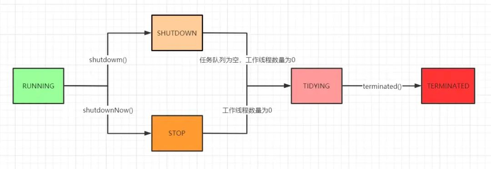

### 怎么根据业务场景确定线程池的参数corePoolSize和maximumPoolSize？

#### 方法一 计算密集型任务
因为是计算密集型任务，可以理解为每个任务在执行期间基本没有IO操作，全部都在CPU时间片中执行。所以可以理解为CPU就是满载的，CPU利用率就是100%，其实线程数等于CPU数就可以的，但是由于需要考虑到计算密集型的线程恰好在某时因为发生一个页错误或者因其他原因而暂停，此时应该需要有一个“额外”的空闲线程来获得时间片，然后执行，可以确保在这种情况下CPU周期不会中断工作，充分利用CPU。
```java
最佳线程数=CPU的数量+1 
```
#### 方法二 IO密集型任务
这种任务在执行时，需要进行一些IO操作，所以为了充分利用CPU，应该在线程进行IO操作时，就让出时间片，CPU进行上下文切换，执行其他线程的任务，保证CPU利用率尽可能达到100%。

如果任务有50%的时间需要CPU执行状态，其他时间进行IO操作，则程序所需线程数为CPU数量的1除以0.5，也就是2倍。如果任务有20%的时时间需要CPU执行，其他时间需要进行IO操作，最佳线程数也就是1除以0.2，也就是CPU数的5倍。
所以公式为

```java
最佳线程数 = CPU数量/(每个任务中需要CPU执行的时间的比例)
= CPU数量/(CPU运行时间/任务执行总时间)=CPU数量/(CPU运行时间/(CPU运行时间+IO操作时间))
所以最终公式为
最佳线程数/CPU数量 = CPU运行时间/(CPU运行时间+IO操作时间)
```
##### 不足
但是在实际线上运行的环境中，每个任务执行的时间是各不相同的，而且我们其实是不太方便去监测每个任务执行时需要的CPU执行时间，IO操作时间的，所以这种方法只是一种理论。

#### 方法三 动态化线程池
这种其实是美团他们做的一个线程池监测平台，主要把任务分成两种，
##### 追求响应时间的任务
一种是追求响应时间的任务，例如使用线程池对发起多个网络请求，然后对结果进行计算。 这种任务的最大线程数需要设置大一点，然后队列使用同步队列，队列中不缓存任务，任务来了就会被执行。判断线程池资源不够用时，一般是发现活跃线程数/最大线程数>阀值(默认是0.8)时，或者是线程池抛出的RejectedExecut异常次数达到阀值，就会进行告警。然后程序员收到告警后，动态发送修改核心线程数，最大线程数，队列相关的指令，服务器进行动态修改。

##### 追求高吞吐量的任务

假设说需要定期自动化生成一些报表，不需要考虑响应时间，只是希望如何使用有限的资源，尽可能在单位时间内处理更多的任务，也就是吞吐量优先的问题。
这种就是使用有界队列，对任务进行缓存，然后线程进行并发执行。判断线程池资源不够用时，一般是发现等待队列中的任务数量/等待队列的长度>阀值(默认是0.8)时，或者是线程池抛出的RejectedExecut异常次数达到阀值，就会进行告警。然后程序员收到告警后，动态发送修改核心线程数，最大线程数，队列相关的指令，服务器进行动态修改。

ThreadPoolExecutor提供了如下几个public的setter方法

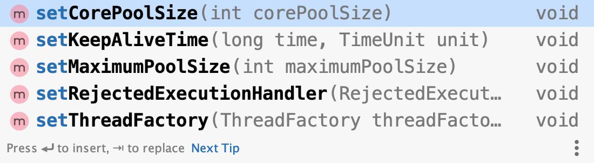

调用corePoolSize方法之后，线程池会直接覆盖原来的corePoolSize值，并且基于当前值和原始值的比较结果采取不同的处理策略。（总得来说就是，多退少补的策略）

**对于新corePoolSize<当前工作线程数的情况：**

说明有多余的worker线程，此时会向当前idle状态的worker线程发起中断请求以实现回收，多余的worker在下次idel的时候也会被回收。

**对于新corePoolSize>当前工作线程数且队列中有任务的情况：**

如果当前队列中有待执行任务，则线程池会创建新的worker线程来执行队列任务。

setCorePoolSize的方法的执行流程入下图所示：


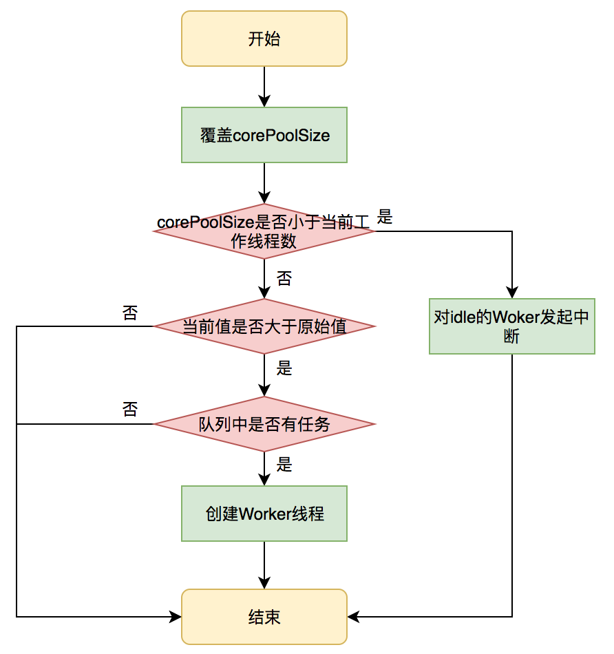

扩展资料：
[Java并发（八）计算线程池最佳线程数](https://www.cnblogs.com/jpfss/p/11016169.html)

### ThreadLocal是什么？怎么避免内存泄露？

从字面意思上，ThreadLocal会被理解为线程本地存储，就是对于代码中的一个变量，每个线程拥有这个变量的一个副本，访问和修改它时都是对副本进行操作。
##### 使用场景：
ThreadLocal 适用于每个线程需要自己独立的实例且该实例需要在多个方法中被使用，也即变量在线程间隔离而在方法或类间共享的场景。(例如：方法直接调用时传递的变量过多，为了代码简洁性，可以使用ThreadLocal，在前一个方法中，将变量进行存储，后一个方法中取，进行使用。)
```java
public class A {
    // 每个线程本地副本初始化
    private static ThreadLocal <UserData> threadLocal = new ThreadLocal <>(). withInitial (() -> new UserData ());
    public static void setUser (UserLogin user){
        if (user == null )
            return ;
        UserData userData = threadLocal.get();
        userData. setUserLogin (user);
    }
    public static UserLogin getUser (){
        return threadLocal.get(). getUserLogin ();
    }
}
```

##### 实现原理

就是每个Thread有一个ThreadLocalMap，类似于HashMap，当调用ThreadLocal#set()方法进行存值时，实际上是先获取到当前的线程，然后获取线程的map，是一个ThreadLocalMap类型，然后会在这个map中添加一个新的键值对，key就是我们ThreadLocal变量的地址，value就是我们存的值。ThreadLocalMap与HashMap不同的时，解决HashMap使用的是**开放定址法**，也就是当发现hashCode计算得到数组下标已经存储了元素后，会继续往后找，直到找到一个空的数组下标，存储键值对。

```java
//ThreadLocal实例的赋值方法
public void set(T value) {
  	//获取当前线程
    Thread t = Thread.currentThread();
  	//获取线程对应的Map
    ThreadLocalMap map = getMap(t);
  	//将值存入线程特有的Map中
    if (map != null)
      //key为this就是当前ThreadLocal引用变量的地址
      //value就是我们要存储的值
      map.set(this, value);
    else
      createMap(t, value);
}
ThreadLocalMap getMap(Thread t) {
  	//线程的threadLocals实例变量就是Map
    return t.threadLocals;
}
```

##### ThreadLocal中的Entry的key使用了弱引用，为什么使用弱引用？

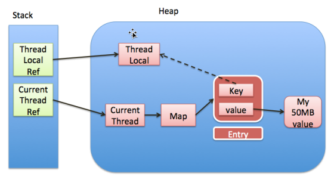

首先在上面类A的代码中，类A中有一个ThreadLocal类型的变量

它们的引用链如下：

```java
ThreadLocal变量所在的类的实例(代码中A的实例)->ThreadLocal
执行代码的线程->线程独有的ThreadLocalMap->引用的key就是ThreadLocal
```

可以看到ThreadLocal变量不仅被所在的类A的实例所引用，还被执行的线程所引用，

1.如果使用强引用，也就是线程对ThreadLocal变量是强引用，那么即便实例A被回收了，只要线程还没有被回收，线程的ThreadLocalMap还会引用这个key(也就是这个ThreadLocal遍历)，导致这个key 没有被回收，造成内存泄露。

2.如果使用弱引用，不会影响key的回收，也就是不会影响引用了ThreadLocal的实例对象的回收。

但是即便使用弱引用，ThreadLocalMap对value的引用是强引用(一边value是局部变量，也不能用弱引用，那样在用到的时候就会被)，但是value依然不会被回收，会造成内存泄露。

通常来说，value回收的时机有两个：

1.我们在用完ThreadLocal后，应该遵循规范手动调用ThreadLocal#remove()对键值对value释放，这样可以使value被回收。

2.此线程在其他对象中使用ThreadLocal对线程ThreadLocalMap进行set()和get()时,由于需要进行开放定址法进行探测，会对沿途过期的键值对(就是key为null的键值对)进行清除。以及set()方法触发的cleanSomeSlots()方法对过期键值对进行清除。

[《一篇文章，从源码深入详解ThreadLocal内存泄漏问题》](https://www.jianshu.com/p/dde92ec37bd1)

### Random类取随机数的原理是什么？

首先在初始化Random实例的时候就会根据当前的时间戳生成一个种子数seed。

```java
public Random() {
        this(seedUniquifier() ^ System.nanoTime());
    }

    private static long seedUniquifier() {
        // L'Ecuyer, "Tables of Linear Congruential Generators of
        // Different Sizes and Good Lattice Structure", 1999
        for (;;) {
            long current = seedUniquifier.get();
            long next = current * 181783497276652981L;
            if (seedUniquifier.compareAndSet(current, next))
                return next;
        }
    }
```

然后每次取随机数时是拿seed乘以一个固定值multiplier，作为随机数。

```java
 protected int next(int bits) {
        long oldseed, nextseed;
        AtomicLong seed = this.seed;
        do {
            oldseed = seed.get();
            nextseed = (oldseed * multiplier + addend) & mask;
        } while (!seed.compareAndSet(oldseed, nextseed));
        return (int)(nextseed >>> (48 - bits));
    }
```

但是这样的话，多线程并发使用Math.random取随机数时，同一个时间点取到的随机数一样的概率会比较大。所以可以使用ThreadLocalRandom.current().nextInt()方法去取随机数。每个线程第一次调用ThreadLocalRandomd的current()方法时，会为这个线程生成一个线程独立的种子数seed，这样多线程并发读取随机数时，可以保证取到的随机数都是不一样的。

```java
public static ThreadLocalRandom current() {
  			//判断这个线程是否生成种子
        if (UNSAFE.getInt(Thread.currentThread(), PROBE) == 0)
            localInit();
        return instance;
    }

//为这个线程生成一个种子seed，并且将种子seed，和线程已生成种子的标志 存储到Unsafe类中
static final void localInit() {
        int p = probeGenerator.addAndGet(PROBE_INCREMENT);
        int probe = (p == 0) ? 1 : p; // skip 0
        long seed = mix64(seeder.getAndAdd(SEEDER_INCREMENT));
        Thread t = Thread.currentThread();
        UNSAFE.putLong(t, SEED, seed);
        UNSAFE.putInt(t, PROBE, probe);
    }

//获取随机数，根据当前种子计算随机数
public int nextInt(int origin, int bound) {
        if (origin >= bound)
            throw new IllegalArgumentException(BadRange);
        return internalNextInt(origin, bound);
    }

final int internalNextInt(int origin, int bound) {
        int r = mix32(nextSeed());
        if (origin < bound) {
            int n = bound - origin, m = n - 1;
            if ((n & m) == 0)
                r = (r & m) + origin;
            else if (n > 0) {
                for (int u = r >>> 1;
                     u + m - (r = u % n) < 0;
                     u = mix32(nextSeed()) >>> 1)
                    ;
                r += origin;
            }
            else {
                while (r < origin || r >= bound)
                    r = mix32(nextSeed());
            }
        }
        return r;
    }
```

### 僵尸进程，孤儿进程，守护进程是什么？

僵尸进程：通常来说，使用fork()系统调用从一个父进程创建出一个子进程，子进程退出，是需要父进程调用wait()或者是waitpid()函数来回收子进程的资源，如果父进程没有调用，子进程的信息就会一直在内存中，而不会被回收，变成僵尸进程。

孤儿进程：就是父进程先退出了，它的子进程会被init进程接管，由它来收集子进程的状态。(init进程是内核启动时，创建出来的进程，是一个以root身份运行的普通用户进程，是永远不会停止的。)

守护进程是脱离于终端并且在后台运行的进程，脱离终端是为了避免将在执行的过程中的信息打印在终端上，并且进程也不会被任何终端所产生的终端信息所打断。

### BlockingQueue的原理是怎么样的？

https://www.cnblogs.com/tjudzj/p/4454490.html

### 进程间通信的方式

https://network.51cto.com/art/201911/606827.htm?mobile

