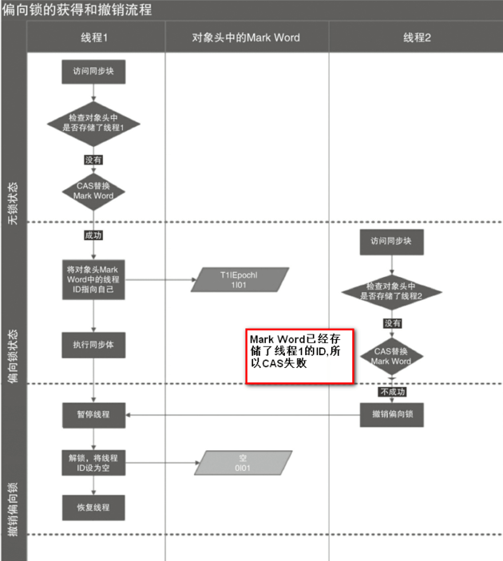
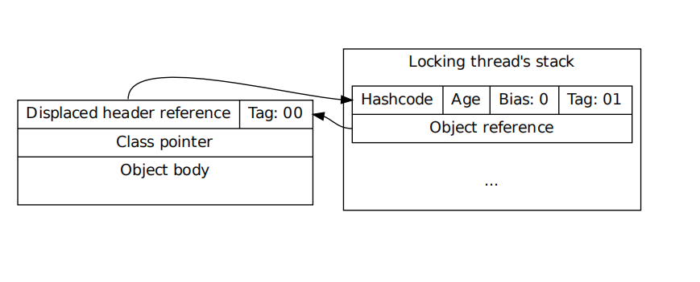
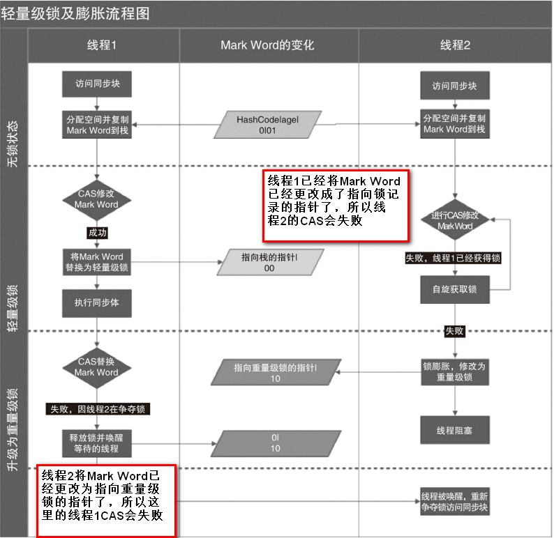
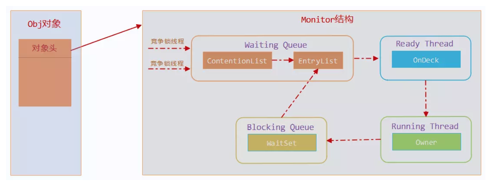

(PS：扫描[首页里面的二维码](README.md)进群，分享我自己在看的技术资料给大家，希望和大家一起学习进步！)

目前还只是买了最新版的[《操作系统导论》](backend/bookRecommend?#《操作系统导论》),还没有完全看完，看完之后会从网上的面经中找一些实际的面试题，然后自己通过翻书查资料，写面试题解答。


#### [1.进程与线程的区别是什么？](#进程与线程的区别是什么？)
#### [2.进程间如何通信？](#进程间如何通信？)
#### [3.Java中单例有哪些写法？](#Java中单例有哪些写法？)
####  [4.Java中创建线程有哪些方式?](#Java中创建线程有哪些方式?)
#### [5.如何解决序列化时可以创建出单例对象的问题?](#如何解决序列化时可以创建出单例对象的问题?)
#### [6.悲观锁和乐观锁是什么？](#悲观锁和乐观锁是什么？)
#### [7.volatile关键字有什么用？怎么理解可见性，一般什么场景去用可见性？](#volatile关键字有什么用？怎么理解可见性，一般什么场景去用可见性？)

#### [8.sychronize的实现原理是怎么样的？](#sychronize的实现原理是怎么样的？)


### 进程与线程的区别是什么？

进程是计算机中已运行程序的实体，进程是操作系统资源分配的最小单位，拥有独立的地址空间，具备独立性，动态性，并发性。

线程是CPU调度和执行的最小单位，线程共享同一进程的资源，上下文切换成本更加低，线程间的通信成本也会低一些。

#### 独立性

Linux系统会给每个进程分配4G的虚拟地址空间(0到3G是User地址空间，3到4G部分是kernel地址空间)，进程具备私有的地址空间，未经允许，一个用户进程不能访问其他进程的地址空间。

#### 动态性

程序是一个静态的指令集合，而进程是正在操作系统中运行的指令集合，进程有自己的生命周期和各种不同的状态。（五态模型一般指的是新建态（创建一个进程），就绪态（已经获取到资源，准备好了，进入运行队列，一旦获得时间片可以立即执行），阻塞态（运行过程中等待获取其他资源，I/O请求等），终止态（进程被杀死了））。

#### 并发性

多个进程可以在CPU上并发执行。
线程是独立运行和调度的最小单位，线程会共享进程的虚拟空间，一个进程会对应多个线程。在Java中，线程拥有自己私有的程序计数器，虚拟机栈，本地方法栈。

#### PS:虚拟内存

虚拟内存是一种逻辑上扩充物理内存的技术。基本思想是用软、硬件技术把内存与外存这两级存储器当做一级存储器来用。虚拟内存技术的实现利用了自动覆盖和交换技术。简单的说就是将硬盘的一部分作为内存来使用。

#### PS:虚拟地址空间

每个进程有4G的地址空间，在运行程序时，只有一部分数据是真正加载到内存中的，内存管理单元将虚拟地址转换为物理地址，如果内存中不存在这部分数据，那么会使用页面置换方法，将内存页置换出来，然后将外存中的数据加入到内存中，使得程序正常运行。

### 进程间如何通信？

进程间通信的方式主要有管道，

#### 管道

调用pipe函数在内存中开辟一块缓冲区，管道半双工的（即数据只能在一个方向上流动），具有固定的读端和写端，调用

```
#include <unistd.h>
int pipe(int pipefd[2]);
```

### Java中创建线程有哪些方式?

#### 第一种 继承Thread类，重写Run方法

这种方法就是通过自定义CustomThread类继承Thread类，重写run()方法，然后创建CustomThread的对象，然后调用start()方法，JVM会创建出一个新线程，并且为线程创建方法调用栈和程序计数器，此时线程处于就绪状态，当线程获取CPU时间片后，线程会进入到运行状态，会去调用run()方法。并且创建CustomThread类的对象的线程(这里的例子中是主线程)与调用run()方法的线程之间是并发的，也就是在执行run()方法时，主线程可以去执行其他操作。

```java
class CustomThread extends Thread {
    public static void main(String[] args) {
        System.out.println(Thread.currentThread().getName()+"线程调用了main方法");
        for (int i = 0; i < 10; i++) {
            if (i == 1) {
                CustomThread customThread = new CustomThread();
                customThread.start();
                System.out.println(Thread.currentThread().getName()+"线程--i是"+i);
            }
        }
        System.out.println("main()方法执行完毕！");
    }
    void run() {
        System.out.println(Thread.currentThread().getName()+"线程调用了run()方法");
        for (int j = 0; j < 20; j++) {
            System.out.println(Thread.currentThread().getName()+"线程--j是"+j);
        }
        System.out.println("run()方法执行完毕！");
    }
}
```

输出结果如下：

```
main线程调用了main方法
Thread-0线程调用了run()方法
Thread-0线程--j是0
Thread-0线程--j是1
Thread-0线程--j是2
Thread-0线程--j是3
Thread-0线程--j是4
Thread-0线程--j是5
Thread-0线程--j是6
Thread-0线程--j是7
Thread-0线程--j是8
Thread-0线程--j是9
Thread-0线程--j是10
Thread-0线程--j是11
Thread-0线程--j是12
Thread-0线程--j是13
Thread-0线程--j是14
main线程--i是1
Thread-0线程--j是15
Thread-0线程--j是16
Thread-0线程--j是17
Thread-0线程--j是18
Thread-0线程--j是19
run()方法执行完毕！
main()方法执行完毕！
```

可以看到在创建一个CustomThread对象，调用start()方法后，Thread-0调用了run方法，进行for循环，对j进行打印，与此同时，main线程并没有被阻塞，而是继续执行for循环，对i进行打印。

##### 执行原理

首先我们可以来看看start的源码，首先会判断threadStatus是否为0，如果不为0会抛出异常。然后会将当前对象添加到线程组，最后调用start0方法，因为是native方法，看不到源码，根据上面的执行结果来看，JVM新建了一个线程调用了run方法。

```java
private native void start0();

public synchronized void start() {
   	//判断当前Thread对象是否是新建态，否则抛出异常
    if (threadStatus != 0)
        throw new IllegalThreadStateException();
    //将当前对象添加到线程组
    group.add(this);
    boolean started = false;
    try {
        start0();//这是一个native方法，调用后JVM会新建一个线程来调用run方法
        started = true;
    } finally {
        try {
            if (!started) {
                group.threadStartFailed(this);
            }
        } catch (Throwable ignore) {
            /* do nothing. If start0 threw a Throwable then
              it will be passed up the call stack */
        }
    }
}
```
扩展问题：多次调用Thread对象的start()方法会怎么样？

会抛出IllegalThreadStateException异常。其实在Thread#start()方法里面的的注释中有提到，多次调用start()方法是非法的，所以在上面的start()方法源码中一开始就是对threadStatus进行判断，不为0就会抛出IllegalThreadStateException异常。


##### 注意事项：

start()方法中判断threadStatus是否为0，是判断当前线程是否新建态，0是代表新建态(上图中的源码注释里面有提到)，而不是就绪态，因为Java中，就绪态和运行态是合并在一起的，（Thread的state为RUNNABLE时(也就是threadStatus为4时)，代表线程为就绪态或运行态）。执行start()方法的线程还不是JVM新建的线程，所以不是就绪态。有一些技术文章把这里弄错了，例如这一篇[《深入浅出线程Thread类的start()方法和run()方法》](https://juejin.im/post/5b09274af265da0de25759d5)


##### 总结

这种方式的缺点很明显，就是需要继承Thread类，而且实际上我们的需求可能仅仅是希望某些操作被一个其他的线程来执行，所以有了第二种方法。

#### 第二种 实现Runnable接口

这种方式就是创建一个类Target，实现Runnable接口的Run方法，然后将Target类的实例对象作为Thread的构造器入参target，实际的线程对象还是Thread实例，只不过线程Thread与线程执行体（Target类的run方法）分离了，耦合度更低一些。

```java
class ThreadTarget implements Runnable {
    void run() {
        System.out.println(Thread.currentThread().getName()+"线程执行了run方法");
    }
    public static void main(String[] args) {
        System.out.println(Thread.currentThread().getName()+"线程执行了main方法");
        ThreadTarget target = new ThreadTarget();
        Thread thread = new Thread(target);
        thread.start();
    }
}
```

输出结果如下：


##### 原理

之所以有这种实现方法，是因为Thread类的run方法中会判断成员变量target是否为空，不为空就会调用target类的run方法。

```java
private Runnable target;
public void run() {
    if (target != null) {
    		target.run();
    }
}
```

##### 另外一种写法

这种实现方式也有其他的写法，可以不创建Target类。

##### 匿名内部类

可以不创建Target类，可以使用匿名内部类的方式来实现，因此上面的代码也可以按以下方式写：

```java
Thread thread = new Thread(new Runnable() {
    @Override
    public void run() {
      		System.out.println(Thread.currentThread().getName()+"线程执行了run方法");
    }
});
thread.start();
```
##### Lamda表达式

在Java8之后，使用了@FunctionalInterface注解来修饰Runnable接口，表明Runnable接口是一个函数式接口，有且只有一个抽象方法，可以Lambda方式来创建Runnable对象，比使用匿名类的方式更加简洁一些。

```java
@FunctionalInterface
public interface Runnable {
    public abstract void run();
}
```

因此上面的代码也可以按以下方式写：

```java
Thread thread = new Thread(()->{
      System.out.println(Thread.currentThread().getName()+"线程执行了run方法");
})
thread.start()  
```

##### 总结

这种写法不用继承Thread，但是同样也有缺点，就是线程方法体(也就是run方法)不能设置返回值。

#### 第三种 实现Callable接口

创建一个类CallableTarget，实现Callable接口，实现带有返回值的call()方法，以CallableTarget实例对象作为创建FutureTask对象的参数，FutureTask实现了RunnableFuture接口，而RunnableFuture接口继承于Runnable, Future接口，所以FutureTask对象可以作为创建Thread对象的入参，创建Thread对象，然后调用start方法。

```java
public class CallableTarget implements Callable<Integer> {

    public Integer call() throws InterruptedException {
        System.out.println(Thread.currentThread().getName()+"线程执行了call方法");
        Thread.sleep(5000);
        return 1;
    }

    public static void main(String[] args) throws ExecutionException, InterruptedException {
        System.out.println(Thread.currentThread().getName()+"线程执行了main方法");
        CallableTarget callableTarget = new CallableTarget();
        FutureTask<Integer> task = new FutureTask<Integer>(callableTarget);
        Thread thread = new Thread(task);
        thread.start();
        Integer result = task.get();//当前线程会阻塞，一直等到结果返回。
        System.out.println("执行完毕，打印result="+result);
        System.out.println("执行完毕");
    }
}
```

Callable接口的源码

```java
@FunctionalInterface
public interface Callable<V> {
    V call() throws Exception;
}
```

RunnableFuture接口的源码

```java
public interface RunnableFuture<V> extends Runnable, Future<V> {
    void run();
}
```


### Java中单例有哪些写法？

正确并且可以做到延迟加载的写法其实就是三种：

使用volatile修饰变量并且双重校验的写法。

使用静态内部类来实现（类A有一个静态内部类B，类B有一个静态变量instance，类A的getInstance()方法会返回类B的静态变量instance，因为只有调用getInstance()方法时才会加载静态内部类B，这种写法缺点是不能传参。）

使用枚举来实现（）

#### 第1种 不加锁（裸奔写法）

多线程执行时，可能会在instance完成初始化之前，其他线性线程判断instance为null，从而也执行第二步的代码，导致初始化覆盖。

```java
public class UnsafeLazyInitialization {
	private static Instance instance;
	public static Instance getInstance() {
    if (instance == null) //1
      instance = new Instance(); //2
    }
    return instance;
}
```

#### 第2种-对方法加sychronize锁(俗称的懒汉模式)

初始化完成以后，每次调用getInstance()方法都需要获取同步锁，导致不必要的开销。

```java
public class Singleton {
    private static Singleton instance;
    public synchronized static Singleton getInstance() {
        if (instance == null)
            instance = new Instance();
        return instance;
    }
}
```
#### 第3种-使用静态变量(俗称的饿汉模式)

```
public class Singleton {  
    private static Singleton instance = new Singleton();  
    public static Singleton getInstance() {  
        return instance;  
    }  
}  
```
这种方法是缺点在于不能做到延时加载，在第一次调用getInstance()方法之前，如果Singleton类被使用到，那么就会对instance变量初始化。

#### 第4种-使用双重检查锁定

代码如下：

```java
public class Singleton {               
    private static Singleton instance;              
    public static Singleton getInstance() {              
        if (instance == null) {                        
            synchronized (Singleton.class) { 
                if (instance == null) { //双重检查存在的意义在于可能会有多个线程进入第一个判断，然后竞争同步锁，线程A得到了同步锁，创建了一个Singleton实例，赋值给instance，然后释放同步锁，此时线程B获得同步锁，又会创建一个Singleton实例，造成初始化覆盖。                
                    instance = new Singleton();        
                }
            }                                   
        }                                      
        return instance;                        
    }                                                 
}                     
```

instance = new Singleton();          

这句代码在执行时会分解为三个步骤：

1.为对象分配内存空间。

2.执行初始化的代码。

3.将分配好的内存地址设置给instance引用。

但是编译器会对指令进行重排序，只能保证单线程执行时结果不会变化，也就是可能第3步会在第2步之前执行，某个线程A刚好执行完第3步，正在执行第2步时，此时如果有其他线程B进入if (instance == null)判断，会发现instance不为null，然后将instance返回，但是实际上instance还没有完成初始化，线程B会访问到一个未初始化完成的instance对象。

#### 第5种 基于 volatile 的双重检查锁定的解决方案

代码如下：

```java
public class Singleton {               
    private volatile static Singleton instance;              
    public static Singleton getInstance() {              
        if (instance == null) {                        
            synchronized (Singleton.class) { 
                if (instance == null)//双重检查存在的意义在于可能会有多个线程进入第一个判断，然后竞争同步锁，线程A得到了同步锁，创建了一个Singleton实例，赋值给instance，然后释放同步锁，此时线程B获得同步锁，又会创建一个Singleton实例，造成初始化覆盖。
                    instance = new Singleton();          
            }                                   
        }                                      
        return instance;                        
    }                                                 
} 
```

volatile可以保证变量的内存可见性及防止指令重排。

volatile修饰的变量在编译后，会多出一个lock前缀指令，lock前缀指令相当于一个内存屏障（内存栅栏），有三个作用：

* 确保指令重排序时，内存屏障前的指令不会排到后面去，内存屏障后的指令不会排到前面去。
* 强制对变量在线程工作内存中的修改操作立即写入到物理内存。
* 如果是写操作，会导致其他CPU中对这个变量的缓存失效，强制其他CPU中的线程在获取变量时从物理内存中获取更新后的值。

所以使用volatile修饰后不会出现第3种写法中由于指令重排序导致的问题。

#### 第6种 - 使用静态内部类来实现

```java
 private static class Signleton {
        private static Signleton instance = new Signleton();
    }

    public static Signleton getInstance() {
        return Signleton.instance ;  // 这里将导致 Signleton 类被初始化 
    }
```

因为JVM底层通过加锁实现，保证一个类只会被加载一次，多个线程在对类进行初始化时，只有一个线程会获得锁，然后对类进行初始化，其他线程会阻塞等待。所以可以使用上面的代码来保证instance只会被初始化一次，这种写法的问题在于创建单例时不能传参。

#### 7.使用枚举来实现单例

```java
public enum Singleton {
    //每个元素就是一个单例
    INSTANCE;
    //自定义的一些方法
    public void method(){}
}
```
这种写法比较简洁，但是不太便于阅读和理解，所以实际开发中应用得比较少，而且由于枚举类是不能通过反射来创建实例的(反射方法newInstance中判断是枚举类型，会抛出IllegalArgumentException异常)，所以可以防止反射。而且由于枚举类型的反序列化是通过java.lang.Enum的valueOf方法来实现的，不能自定义序列化方法，可以防止通过序列化来创建多个单例。

### 如何解决序列化时可以创建出单例对象的问题?

如果将单例对象序列化成字节序列后，然后再反序列成对象，那么就可以创建出一个新的单例对象，从而导致单例不唯一，避免发生这种情况的解决方案是在单例类中实现readResolve()方法。

```java
public class Singleton implements java.io.Serializable {     

   private Object readResolve() {     
         return INSTANCE;     
    }    
} 
```
通过实现readResolve方法，ObjectInputStream实例对象在调用readObject()方法进行反序列化时，就会判断相应的类是否实现了readResolve()方法，如果实现了，就会调用readResolve()方法返回一个对象作为反序列化的结果，而不是去创建一个新的对象。


### 悲观锁和乐观锁是什么？

##### 悲观锁

就是假定在每次取数据的时候会修改这个数据，所以在取数据的时候就会进行加锁，这样其他调用者就不能取数据，阻塞等待，一直到获取到锁。Java中的同步锁sychronized和ReentrantLock就是悲观锁思想的实现。

##### 乐观锁

就是假定在每次取数据时不会修改这个数据，所以在取数据的时候不会加锁，只有在真正修改数据时才加锁。Java中的atomic原子变量类就是乐观锁的实现。

##### 区别

##### 悲观锁适合多写的场景，

乐观锁适合多读的场景，这样只有读写冲突会发生的比较少，减少加锁的性能开销。但是如果是多写的场景，这样会导致上层应用一直重试，增加性能开销。


### 乐观锁的实现

#### 版本号机制

使用版本号来实现，对数据加上一个版本号，代表修改次数，每次修改后+1，修改数据时判断数据的版本号跟之前取的是否一致，一致才修改，不一致就重试，直到更新成功。

#### CAS操作

就是在更新数据时会传入之前取的值，在内存中判断当前内存中的值跟之前的值是否一致，一致再更新，（比较和更新都是在一个原子操作中）。

##### ABA问题

但是没法解决ABA的问题，就是其他调用方对数据修改成其他值后又改回原来的值。AtomicStampedReference的compareAndSet会先判断对象的引用是否相同，相同才进行CAS更新。实现原理主要是AtomicStampedReference会保存之前对象的的引用，及一个修改版本号，只有当引用和版本号都相等的情况下，才会进行CAS更新操作。

##### 循环时间长开销大

自旋CAS操作如果不成功就一直循环执行直到成功，如果长时间不成功，会给CPU带来非常大的执行开销

##### CAS 只对单个共享变量有效

多个变量放在一个对象里来进行 CAS 操作.所以我们可以使用锁或者利用`AtomicReference类`把多个共享变量合并成一个共享变量来操作

#### Java的原子类

原子类一共有以下四种

- 1.基本类型: AtomicInteger, AtomicLong, AtomicBoolean ;
- 2.数组类型: AtomicIntegerArray, AtomicLongArray, AtomicReferenceArray ;
- 3.引用类型: AtomicReference, AtomicStampedRerence, AtomicMarkableReference ;
- 4.对象的属性修改类型: AtomicIntegerFieldUpdater, AtomicLongFieldUpdater, AtomicReferenceFieldUpdater 。

##### AtomicInteger

主要是对Integer的封装，提供了一些原子性的操作，因为如果是使用Integer来完成i=i+1;操作，在内存中是三个步骤，先将从内存中取出i，放到寄存器中，然后将寄存器中的值与1相加，然后将结果写入内存，一共是三个步骤，所以不是原子性的，并发时会造成数据不一致的问题。

主要实现原理是AtomicInteger类有一个unsafe属性，可以通过unsafe来调用Unsafe类的一些原子性的方法Unsafe.compareAndSwapInt来实现原子性的加减运算。

其次是使用volatile来修饰value属性，保证一个内存可见性

```
//compareAndSwapInt有四个参数，第一个是待运算的对象，第二个是对象中用于运算的属性的偏移量，第三个是期望值，第四个是更新的值。
unsafe.compareAndSwapInt(this, valueOffset, expect, update)
```

```
public class AtomicInteger extends Number implements java.io.Serializable {
    private static final long serialVersionUID = 6214790243416807050L;

    // setup to use Unsafe.compareAndSwapInt for updates
    private static final Unsafe unsafe = Unsafe.getUnsafe();
    private static final long valueOffset;

    static {
        try {
            valueOffset = unsafe.objectFieldOffset
                (AtomicInteger.class.getDeclaredField("value"));
        } catch (Exception ex) { throw new Error(ex); }
    }

    private volatile int value;//使用volatiole来保证value的内存可见性
}

```

在Unsafe类中，compareAndSwapInt和getAndAddInt的区别在于，getAndAddInt会一直重试直到成功，compareAndSwapInt如果更新失败，只会返回false

```
public final int getAndAddInt(Object var1, long var2, int var4) {
    int var5;
    do {
        var5 = this.getIntVolatile(var1, var2);
    } while(!this.compareAndSwapInt(var1, var2, var5, var5 + var4));

    return var5;
}
```

### volatile关键字有什么用？怎么理解可见性，一般什么场景去用可见性？

当线程进行一个volatile变量的写操作时，JIT编译器生成的汇编指令会在写操作的指令后面加上一个“lock”指令。
Java代码如下:
```java
instance = new Singleton(); // instance是volatile变量
转变成汇编代码，如下。
0x01a3de1d: movb $0×0,0×1104800(%esi);0x01a3de24: lock addl $0×0,(%esp);
```
“lock”有三个作用：

1.将当前CPU缓存行的数据会写回到系统内存。
2.这个写回内存的操作会使得其他CPU里缓存了该内存地址的数据无效。

3.确保指令重排序时，内存屏障前的指令不会排到后面去，内存屏障后的指令不会排到前面去。

可见性可以理解为一个线程的写操作可以立即被其他线程得知。为了提高CPU处理速度，CPU一般不直接与内存进行通信，而是将系统内存的数据读到内部缓存，再进行操作，对于普通的变量，修改完不知道何时会更新到系统内存。但是如果是对volatile修饰的变量进行写操作，JVM就会向处理器发送一条Lock前缀的指令，将这个变量所在的缓存行的数据立即写回到系统内存。但是即便写回到系统内存，其他CPU中的缓存行数据还是旧的，为了保证数据一致性，其他CPU会嗅探在总线上传播的数据来检查自己的缓存行的值是否过期，当CPU发现缓存行对应的内存地址被修改，那么就会将当前缓存行设置为无效，下次当CPU对这个缓存行上 的数据进行修改时，会重新从系统内存中把数据读到处理器缓存 里。


##### 使用场景

##### 读写锁

如果需要实现一个读写锁，每次只能一个线程去写数据，但是有多个线程来读数据，就synchronize同步锁来对set方法加锁，get方法不加锁， 使用volatile来修饰变量，保证内存可见性，不然多个线程可能会在变量修改后还读到一个旧值。

##### 状态位

用于做状态位标志，如果多个线程去需要根据一个状态位来执行一些操作，使用volatile修饰可以保证内存可见性。

用于单例模式用于保证内存可见性，以及防止指令重排序。

### sychronize的实现原理是怎么样的？

```java
public class SyncTest {
    public void syncBlock(){
        synchronized (this){
            System.out.println("hello block");
        }
    }
    public synchronized void syncMethod(){
        System.out.println("hello method");
    }
}
```

当SyncTest.java被编译成class文件的时候，`synchronized`关键字和`synchronized`方法的字节码略有不同，我们可以用`javap -v` 命令查看class文件对应的JVM字节码信息，部分信息如下：

```java
{
  public void syncBlock();
    descriptor: ()V
    flags: ACC_PUBLIC
    Code:
      stack=2, locals=3, args_size=1
         0: aload_0
         1: dup
         2: astore_1
         3: monitorenter				 	  // monitorenter指令进入同步块
         4: getstatic     #2                  // Field java/lang/System.out:Ljava/io/PrintStream;
         7: ldc           #3                  // String hello block
         9: invokevirtual #4                  // Method java/io/PrintStream.println:(Ljava/lang/String;)V
        12: aload_1
        13: monitorexit						  // monitorexit指令退出同步块
        14: goto          22
        17: astore_2
        18: aload_1
        19: monitorexit						  // monitorexit指令退出同步块
        20: aload_2
        21: athrow
        22: return
      Exception table:
         from    to  target type
             4    14    17   any
            17    20    17   any
 

  public synchronized void syncMethod();
    descriptor: ()V
    flags: ACC_PUBLIC, ACC_SYNCHRONIZED      //添加了ACC_SYNCHRONIZED标记
    Code:
      stack=2, locals=1, args_size=1
         0: getstatic     #2                  // Field java/lang/System.out:Ljava/io/PrintStream;
         3: ldc           #5                  // String hello method
         5: invokevirtual #4                  // Method java/io/PrintStream.println:(Ljava/lang/String;)V
         8: return
 
}
```

对于`synchronized`关键字而言，`javac`在编译时，会生成对应的`monitorenter`和`monitorexit`指令分别对应`synchronized`同步块的进入和退出，有两个`monitorexit`指令的原因是为了保证抛异常的情况下也能释放锁，所以`javac`为同步代码块添加了一个隐式的try-finally，在finally中会调用`monitorexit`命令释放锁。

而对于`synchronized`方法而言，`javac`为其生成了一个`ACC_SYNCHRONIZED`关键字，在JVM进行方法调用时，发现调用的方法被`ACC_SYNCHRONIZED`修饰，则会先尝试获得锁。

#### 锁

这是网上看到的一个流程图：


就是Java对象的内存布局其实由对象头+实例数据+对齐填充三部分组成，而对象头主要包含Mark Word+指向对象所属的类的指针组成。Mark Word主要用于存储对象自身的运行时数据，哈希码，GC分代年龄，锁标志等。

下面就是Mark Word的数据映射表


##### 偏向锁

根据上面的表来看，Mark Word后三位为101时，加锁对象的状态为偏向锁，偏向锁的意义在于同一个线程访问sychronize代码块时不需要进行加锁，解锁操作，性能开销更低（HotSpot[1]的作者经过研究发现，大多数情况下，锁不仅不存在多线程竞争，而且总是由同一线程多次获得，为了让线程获得锁的代价更低而引入了偏向锁。）

因为正常情况下，当一个线程访问同步块并获取轻量级锁时，需要进行CAS操作将对象头的锁记录里指向当前线程的栈中的锁记录，执行完毕后需要释放轻量级锁。如果是同一个线程多次访问sychronize代码块，多次获取和释放轻量级，开销会偏大，所以会一开始判断对象是无锁状态，会将对象头设置为偏向锁，并且这个的线程ID到Mark Word，后续同一线程判断加锁标志是偏向锁，并且线程ID一致就可以直接执行。



#### 轻量级锁

JVM的开发者发现在很多情况下，在Java程序运行时，同步块中的代码都是不存在竞争的，不同的线程交替的执行同步块中的代码。这种情况下，用重量级锁是没必要的。因此JVM引入了轻量级锁的概念。

线程在执行同步块之前，JVM会先在当前的线程的栈帧中创建一个`Lock Record`，其包括一个用于存储对象头中的 `mark word`（官方称之为`Displaced Mark Word`）以及一个指向对象的指针。下图右边的部分就是一个`Lock Record`。



(1)轻量级锁加锁 

线程在执行同步块之前，JVM会先在当前线程的栈桢中创建用于存储锁记录的空间，并 将对象头中的Mark Word复制到锁记录中，官方称为Displaced Mark Word。然后线程尝试使用 CAS将对象头中的Mark Word替换为指向锁记录的指针。如果成功，当前线程获得锁，如果失败，表示其他线程竞争锁，当前线程便尝试使用自旋来获取锁，自旋获取锁失败的次数达到一定次数后就会进行锁升级，将锁升级为重量级锁，当前线程就会被阻塞，直到获得轻量级锁的线程执行完毕，释放锁，唤醒阻塞的线程。 

(2)轻量级锁解锁 

轻量级解锁时，会使用原子的CAS操作将Displaced Mark Word替换回到对象头，如果成 功，则表示没有竞争发生。如果失败，表示当前锁存在竞争，锁就会膨胀成重量级锁。图2-2是 两个线程同时争夺锁，导致锁膨胀的流程图。 



### 重量级锁

重量级锁是我们常说的传统意义上的锁，其利用操作系统底层的同步机制去实现Java中的线程同步。

重量级锁的状态下，对象的`mark word`为指向一个堆中monitor对象的指针。

一个monitor对象包括这么几个关键字段：cxq（下图中的ContentionList），EntryList ，WaitSet，owner。

其中cxq ，EntryList ，WaitSet都是由ObjectWaiter的链表结构，owner指向持有锁的线程。



当一个线程尝试获得锁时，如果该锁已经被占用，则会将该线程封装成一个ObjectWaiter对象插入到cxq的队列尾部，然后暂停当前线程。当持有锁的线程释放锁前，会将cxq中的所有元素移动到EntryList中去，并唤醒EntryList的队首线程。

如果一个线程在同步块中调用了`Object#wait`方法，会将该线程对应的ObjectWaiter从EntryList移除并加入到WaitSet中，然后释放锁。当wait的线程被notify之后，会将对应的ObjectWaiter从WaitSet移动到EntryList中。

#### 三种锁的优缺点对比


参考文章：

[死磕Synchronized底层实现--概论](https://github.com/farmerjohngit/myblog/issues/12)

[浅谈偏向锁、轻量级锁、重量级锁](https://www.jianshu.com/p/36eedeb3f912)

### 进程和线程的区别？并行和并发的区别？了解协程么？

#### 批处理操作系统

**批处理操作系统**就是把一系列需要操作的指令写下来，形成一个清单，一次性交给计算机。用户将多个需要执行的程序写在磁带上，然后交由计算机去读取并逐个执行这些程序，并将输出结果写在另一个磁带上。

批处理操作系统在一定程度上提高了计算机的效率，但是由于**批处理操作系统的指令运行方式仍然是串行的，内存中始终只有一个程序在运行**，后面的程序需要等待前面的程序执行完成后才能开始执行，而前面的程序有时会由于I/O操作、网络等原因阻塞，导致CPU闲置所以**批处理操作效率也不高**。

#### 进程的提出

批处理操作系统的瓶颈在于内存中只存在一个程序，进程的提出，可以让内存中存在多个程序，每个程序对应一个进程，进程是操作系统资源分配的最小单位。CPU采用时间片轮转的方式运行进程：CPU为每个进程分配一个时间段，称作它的时间片。如果在时间片结束时进程还在运行，则暂停这个进程的运行，并且CPU分配给另一个进程（这个过程叫做上下文切换）。如果进程在时间片结束前阻塞或结束，则CPU立即进行切换，不用等待时间片用完。多进程的好处在于一个在进行IO操作时可以让出CPU时间片，让CPU执行其他进程的任务。

#### 线程的提出
随着计算机的发展，对CPU的要求越来越高，进程之间的切换开销较大，已经无法满足越来越复杂的程序的要求了。于是就发明了线程，线程是程序执行中一个单一的顺序控制流程，是程序执行流的最小单元，是处理器调度和分派的基本单位。一个进程可以有一个或多个线程，各个线程之间共享程序的内存空间(也就是所在进程的内存空间)。
#### 进程和线程的区别
进程是一个独立的运行环境，而线程是在进程中执行的一个任务。他们两个本质的区别是是否**单独占有内存地址空间及其它系统资源（比如I/O）**：

* 进程单独占有一定的内存地址空间，所以进程间存在内存隔离，数据是分开的，数据共享复杂但是同步简单，各个进程之间互不干扰；而线程共享所属进程占有的内存地址空间和资源，数据共享简单，但是同步复杂。

* 进程单独占有一定的内存地址空间，一个进程出现问题不会影响其他进程，不影响主程序的稳定性，可靠性高；一个线程崩溃可能影响整个程序的稳定性，可靠性较低。

* 进程单独占有一定的内存地址空间，进程的创建和销毁不仅需要保存寄存器和栈信息，还需要资源的分配回收以及页调度，开销较大；线程只需要保存寄存器和栈信息，开销较小。

另外一个重要区别是，进程是操作系统进行资源分配的基本单位，而线程是操作系统进行调度的基本单位，即CPU分配时间的单位 。

#### Java中线程的状态是怎么样的？

在操作系统中，线程等同于轻量级的进程。


所以传统的操作系统线程一般有以下状态

1. 新建状态:
   使用 new 关键字和 Thread 类或其子类建立一个线程对象后，该线程对象就处于新建状态。它保持这个状态直到程序 start() 这个线程。

2. 就绪状态:
   当线程对象调用了start()方法之后，该线程就进入就绪状态。就绪状态的线程处于就绪队列中，要等待JVM里线程调度器的调度。

3. 运行状态:
   如果就绪状态的线程获取 CPU 资源，就可以执行 run()，此时线程便处于运行状态。处于运行状态的线程最为复杂，它可以变为阻塞状态、就绪状态和死亡状态。

4. 阻塞状态:

   如果一个线程执行了sleep（睡眠）、suspend（挂起）等方法，失去所占用资源之后，该线程就从运行状态进入阻塞状态。在睡眠时间已到或获得设备资源后可以重新进入就绪状态。可以分为三种：

   - 等待阻塞：运行状态中的线程执行 wait() 方法，使线程进入到等待阻塞状态。
   - 同步阻塞：线程在获取 synchronized同步锁失败(因为同步锁被其他线程占用)。
   - 其他阻塞：通过调用线程的 sleep() 或 join() 发出了 I/O请求时，线程就会进入到阻塞状态。当sleep() 状态超时，join() 等待线程终止或超时，或者 I/O 处理完毕，线程重新转入就绪状态。

5. 死亡状态:
   一个运行状态的线程完成任务或者其他终止条件发生时，该线程就切换到终止状态。

但是Java中Thread对象的状态划分跟传统的操作系统线程状态有一些区别。

```java
public enum State {
    NEW,//新建态
    RUNNABLE,//运行态
    BLOCKED,//阻塞态
    WAITING,//等待态
    TIMED_WAITING,//有时间限制的等待态
    TERMINATED;//死亡态
}
```


#### NEW 新建态

处于NEW状态的线程此时尚未启动，还没调用Thread实例的start()方法。

#### RUNNABLE 运行态

表示当前线程正在运行中。处于RUNNABLE状态的线程可能在Java虚拟机中运行，也有可能在等待其他系统资源（比如I/O）。

> Java线程的**RUNNABLE**状态其实是包括了传统操作系统线程的**ready**和**running**两个状态的。

#### BLOCKED 阻塞态

阻塞状态。处于BLOCKED状态的线程正等待锁的释放以进入同步区。

#### WAITING 等待态

等待状态。处于等待状态的线程变成RUNNABLE状态需要其他线程唤醒。

调用如下3个方法会使线程进入等待状态：

- Object.wait()：使当前线程处于等待状态直到另一个线程调用notify唤醒它；
- Thread.join()：等待线程执行完毕，底层调用的是Object实例的wait()方法；
- LockSupport.park()：除非获得调用许可，否则禁用当前线程进行线程调度。

####  TIMED_WAITING 超时等待状态

超时等待状态。线程等待一个具体的时间，时间到后会被自动唤醒。

调用如下方法会使线程进入超时等待状态：

- Thread.sleep(long millis)：使当前线程睡眠指定时间；

- Object.wait(long timeout)：线程休眠指定时间，等待期间可以通过notify()/notifyAll()唤醒；

- Thread.join(long millis)：等待当前线程最多执行millis毫秒，如果millis为0，则会一直执行；

- LockSupport.parkNanos(long nanos)： 除非获得调用许可，否则禁用当前线程进行线程调度指定时间；

- LockSupport.parkUntil(long deadline)：同上，也是禁止线程进行调度指定时间；

#### TERMINATED 终止态

终止状态。此时线程已执行完毕。

#### 状态转换

1.BLOCKED与RUNNABLE状态的转换

处于BLOCKED状态的线程是因为在等待锁的释放，当获得锁之后就转换为RUNNABLE状态。

2.WAITING状态与RUNNABLE状态的转换

**Object.wait()**，**Thread.join()**和**LockSupport.park()**这3个方法可以使线程从RUNNABLE状态转为WAITING状态。

3.TIMED_WAITING与RUNNABLE状态转换

TIMED_WAITING与WAITING状态类似，只是TIMED_WAITING状态等待的时间是指定的。

调用**Thread.sleep(long)**，**Object.wait(long)**，**Thread.join(long)**会使得RUNNABLE状态转换为TIMED_WAITING状态

### Java线程间的通信

首先需要对wait()，join()，sleep()方法进行介绍。

#### Object.wait()方法是什么？

调用wait()方法前线程必须持有对象Object的锁。线程调用wait()方法后，会释放当前的Object锁，进入锁的monitor对象的等待队列，直到有其他线程调用notify()/notifyAll()方法唤醒等待锁的线程。

需要注意的是，其他线程调用notify()方法只会唤醒单个等待锁的线程，如果有多个线程都在等待这个锁的话，不一定会唤醒到之前调用wait()方法的线程。

同样，调用notifyAll()方法唤醒所有等待锁的线程之后，也不一定会马上把时间片分给刚才放弃锁的那个线程，具体要看系统的调度。

#### Thread.join()方法是什么？

join()方法是Thread类的一个实例方法。它的作用是让当前线程陷入“等待”状态，等join的这个线程threadA执行完成后，再继续执行当前线程。

实现原理是join()方法本身是一个sychronized修饰的方法，也就是调用join()这个方法需要先获取threadA的锁，获得锁之后再调用wait()方法来进行等待，一直到threadA执行完成后，threadA会调用notify_all()方法,唤醒所有等待的线程，当前线程才会结束等待。

```
Thread threadA = new Thread();
threadA.join();
```

join()方法的源码：

```java
public final void join() throws InterruptedException {
    join(0);//0的话代表没有超时时间一直等下去
}
public final synchronized void join(long millis)
throws InterruptedException {
    long base = System.currentTimeMillis();
    long now = 0;

    if (millis < 0) {
        throw new IllegalArgumentException("timeout value is negative");
    }

    if (millis == 0) {
        while (isAlive()) {
            wait(0);
        }
    } else {
        while (isAlive()) {
            long delay = millis - now;
            if (delay <= 0) {
                break;
            }
            wait(delay);
            now = System.currentTimeMillis() - base;
        }
    }
}
```

这是jvm中Thead的源码，在线程执行结束后会调用notify_all来唤醒等待的线程。

```java
//一个c++函数：
void JavaThread::exit(bool destroy_vm, ExitType exit_type) ；
//里面有一个贼不起眼的一行代码
ensure_join(this);

static void ensure_join(JavaThread* thread) {
  Handle threadObj(thread, thread->threadObj());

  ObjectLocker lock(threadObj, thread);

  thread->clear_pending_exception();

  java_lang_Thread::set_thread_status(threadObj(), java_lang_Thread::TERMINATED);

  java_lang_Thread::set_thread(threadObj(), NULL);

  //同志们看到了没，别的不用看，就看这一句
  //thread就是当前线程，是啥？就是刚才例子中说的threadA线程
  lock.notify_all(thread);

  thread->clear_pending_exception();
}
```

#### sleep()方法是什么？

sleep方法是Thread类的一个静态方法。它的作用是让当前线程睡眠一段时间。：**sleep方法是不会释放当前的锁的，而wait方法会。**

sleep与wait方法的区别：

- wait可以指定时间，也可以不指定；而sleep必须指定时间。
- wait释放cpu资源，同时释放锁；sleep释放cpu资源，但是不释放锁，所以易死锁。（调用join()方法也不会释放锁）
- wait必须放在同步块或同步方法中，而sleep可以再任意位置。

参考文章：

http://redspider.group:4000/article/01/4.html

https://www.jianshu.com/p/5d88b122a050

### 线程间怎么通信？

1.通过sychronized锁来进行同步，让一次只能一个线程来执行。

#### 2.等待/通知机制

```java
//假设我们的需求是B执行结束后A才能执行
//线程A的代码
synchronized(对象) { while(条件不满足) {
    while(条件不满足) {
        对象.wait(); //线程A进行等待
    }
    //线程A执行相关的的逻辑
 } 
 
//线程B的代码
 synchronized(对象) { 
 		//线程B执行相关的的逻辑
 		//线程B唤醒线程A
 		对象.notifyAll();
 }
 
```

等待/通知机制，是指一个线程A调用了对象objectA的wait()方法进入等待状态，而另一个线程B调用了对象objectA的notify()或者notifyAll()方法，线程A收到通知后从对象objectA的wait()方法返回，进而执行后续操作。上述两个线程通过对象objectA来完成交互，而对象上的wait()和notify/notifyAll()的关系就如同开关信号一样，用来完成等待方和通知方之间的交互工作。


1)使用wait()、notify()和notifyAll()时需要先对调用对象加锁。 

2)调用wait()方法后，线程状态由RUNNING变为WAITING，并将当前线程放置到对象的 

等待队列。 

3)notify()或notifyAll()方法调用后，等待线程依旧不会从wait()返回，因为等待线程只是从等待队列到了同步队列，需要调用notify()或 notifAll()的线程释放锁之后，等待线程获得锁，才能从同步队列中移除，才有机会从wait()返回，才能继续往下执行。  

4)notify()方法将等待队列中的一个等待线程从等待队列中移到同步队列中，而notifyAll() 方法则是将等待队列中所有的线程全部移到同步队列，被移动的线程状态由WAITING变为 BLOCKED。 

5)从wait()方法返回的前提是获得了调用对象的锁。 


##### 3.管道

管道输入/输出流 管道输入/输出流和普通的文件输入/输出流或者网络输入/输出流不同之处在于，它主要 用于线程之间的数据传输，而传输的媒介为内存。 管道输入/输出流主要包括了如下4种具体实现:PipedOutputStream、PipedInputStream、 PipedReader和PipedWriter，前两种面向字节，而后两种面向字符。

 PipedReader和PipedWriter可以一个线程A调用PipedWriter实例的write()方法，往里面写数据，然后与PipedWriter实例建立连接的PipedReader实例可以读到数据，线程B可以通过PipedReader实例读到数据。

在代码清单4-12所示的例子中，创建了printThread，它用来接受main线程的输入，任何 main线程的输入均通过PipedWriter写入，而printThread在另一端通过PipedReader将内容读出并打印。 

代码清单4-12 Piped.java 
```
public class Piped {
       public static void main(String[] args) throws Exception {
          PipedWriter out = new PipedWriter();
          PipedReader in = new PipedReader();
          // 将输出流和输入流进行连接，否则在使用时会抛出IOException 											out.connect(in);
          Thread printThread = new Thread(new Print(in), "PrintThread"); printThread.start();
          int receive = 0;
          try {
							while ((receive = System.in.read()) != -1) { 				out.write(receive);
									}
					} finally {	out.close(); }
       }
       static class Print implements Runnable {
           private PipedReader in;
           public Print(PipedReader in) {
								this.in = in; 
					}
				public void run() { 
							int receive = 0; 
							try {
									while ((receive = in.read()) != -1) { System.out.print((char) receive);
                   }
               } catch (IOException ex) {
       			}
     	}
		}
}    
```

运行该示例，输入一组字符串，可以看到被printThread进行了原样输出。 

Repeat my words. 
Repeat my words. 

#### 4.Thread.join

Thread.join()的使用如果一个线程A执行了thread.join()语句，当前线程A会一直等待thread线程终止之后才从thread.join()返回，向下执行。线程Thread除了提供join()方法之外，还提供了join(long millis)和join(long millis,int nanos)两个具备超时参数的方法。

#### 5.ThreadLocal的使用 

ThreadLocal，即线程变量，是一个以ThreadLocal对象为键、任意对象为值的存储结构。这 个结构被附带在线程上，也就是说一个线程可以根据一个ThreadLocal对象查询到绑定在这个 线程上的一个值。 

```
public class Profiler {
    // 第一次get()方法调用时会进行初始化(如果set方法没有调用)，每个线程会调用一次
    private static final ThreadLocal<Long> TIME_THREADLOCAL = new ThreadLocal<Long>() {
        protected Long initialValue() { return System.currentTimeMillis();} 
    };
    public static final void begin() { 
        TIME_THREADLOCAL.set(System.currentTimeMillis());
    }
    public static final long end() {
        return System.currentTimeMillis() - TIME_THREADLOCAL.get(); 
    }
    public static void main(String[] args) throws Exception { 
        Profiler.begin();
        TimeUnit.SECONDS.sleep(1);
        System.out.println("Cost: " + Profiler.end() + " mills");
    } 
}
```

Profiler可以被复用在方法调用耗时统计的功能上，在方法的入口前执行begin()方法，在 

方法调用后执行end()方法，好处是两个方法的调用不用在一个方法或者类中，比如在AOP(面 向方面编程)中，可以在方法调用前的切入点执行begin()方法，而在方法调用后的切入点执行 end()方法，这样依旧可以获得方法的执行耗时。 