(PS：建了一个技术微信群，可以自由地讨论技术，工作和生活，也会分享一些我自己在看的技术资料，不定时发放红包福利，欢迎大家扫[首页里面的二维码](README.md)进群，希望和大家一起学习进步！大家如果想一起为这个项目做贡献的话，也可以进群大家聊一聊)


### 为什么写这篇文章
因为我最近的一些工作内容跟数据分析比较密切，所以需要对SQL使用得比较熟练，所以便阅读了《MySQL 必知必会》这本书，为了检验自己的阅读效果及帮助一些跟我一样需要学习MySQL相关的知识的朋友，所以每阅读一章，我就开始写一章的读书笔记，并在掘金的读书笔记版块发布沸点。一共三十章，全部发布完以后，便汇总成了这篇文章，感兴趣的朋友通过阅读这篇文章，快速得预览这本书，学习MySQL相关的知识。如果你觉得这本书对你带来帮助，希望你可以为我点一个关注，后续也会继续阅读其他的技术书籍，并整理成读书笔记，分享给大家。同时也欢迎大家加我[掘金主页](https://juejin.im/user/5b370a42e51d4558ce5eb969)的微信，我们一起探讨学习。
### 第一章 了解SQL

本章主要是介绍了一些数据库相关的概念：

数据库：保存有组织的数据的容器。

表：某种特定类型数据的结构化清单。

模式(schema)：关于数据库和表的布局及特性的信息。在MYSQL中，模式与数据库同义。

主键：唯一标识表中每行的这个列称为主键。一个列成为主键必须满足以下条件：

1.唯一性，任意两行都不具有相同的主键值。

2.不为空，每行数据必须具有一个主键值。

### 第二章 MySQL简介

DBMS(数据库管理软件)通常分为两类：

1.基于共享文件系统的DBMS。通常用于桌面(例如Microsoft Access和FileMaker)

2.Client-Sever的DBMS。日常见到的MySQL，Oracle，SQL Server数据库都是这种类型的。Client主要负责与用户进行交互，接受用户的指令，然后发出请求给Server，Server负责数据访问和处理，然后将结果返回给Client。

### 第三章 使用MySQL

主要介绍了一些MySQL的一些命令

use crashcourse;选择一个名叫crashcourse数据库(在通过命令行连接到数据库时，我们需要选择一个数据库，然后才能继续操作)
```
show DATABASES;//展示当前可用的数据库列表

show Tables;//展示当前是选择的是数据库的所有表

show COLUMNS FORM customers;//展示customers表所有的列信息(会包含字段名，类型，是否允许为NULL，键信息，默认值，其他信息)，
```

DESCRIBE customers;跟show COLUMNS FORM同义，用于展示表的列信息
```
SHOW STATUS;展示服务器信息
SHOW CREATE DATABASE crashcourse;
```
展示之前创建crashcourse这个数据库时使用的SQL语句，同理，SHOW CREATE TABLE也可以展示建某张表时使用的SQL语句
```
SHOW GRANTS FOR 'jeffrey'@'localhost';//展示jeffrey这个账号的权限

SHOW ERRORS和SHOW WARNINGS，//用来显示服务器错误或警告消息
```

HELP SHOW；当你不了解某个命令时，可以使用HELP+这个命令，来获得一些说明信息，了解这个命令的用途，这里HELP SHOW会打印出SHOW命令的用法

### 第四章 检索数据

这两章主要讲得是查询相关的。

查询时默认的数据顺序：
```
SELECT prod_name FROM products;
```

如果是不设置任何排序条件，以这种方式来进行查询，返回的数据的顺序是根据它们在底层表中出现的顺序(可以是数据最初添加到表中的顺序，但是如果数据进行过更新或删除，顺序会受到MySQL重用回收存储空间的影响)

#### 使用DISTINCT去重：
```
SELECT DISTINCT vend_id FROM products;
```

如果想要对让返回的数据不包含重复值，可以使用DISTINCT来对列进行修饰
```
SELECT DISTINCT vend_id，prod_price FROM products;
```

DISTINCT关键字是对所有字段进行修饰的，只有当所有列都相同时，才会进行排除，在上面这个例子中，只有vend_id和prod_price都相同的数据，才会进行排除，也就是可以允许一些vend_id相同，prod_price不同的数据出现。

#### 使用LIMIT来限制结果
```
SELECT prod_name FROM products LIMIT 5；
```

可以限制返回的数据为5条
```
SELECT prod_name FROM products LIMIT 4,5；
```

可以限制返回的数据是从第4行开始后面的5条

上面这条查询语句，MySQL 5以后还支持另外一种更加容易理解的写法
```
SELECT prod_name FROM products LIMIT 4 offset 5；
```
使用完全限定的表名
```
SELECT products.prod_name FROM crash_course.products;
```

可以限制在某个数据库的某个表中进行查询，上面的例子是限制了，必须在crash_course数据库的products表取prod_name列的数据


### 第五章 排序检索数据

这一章主要讲的是ORDER BY对查询结果进行排序，以及使用ASC，DESC控制升序，降序。

#### 使用ORDER BY进行排序
```
SELECT prod_name FROM products ORDER BY product_name;
```

#### 按多个列进行排序
```
SELECT prod_id， prod_price, prod_name FROM products ORDER BY product_price, product_name;
```
在 ORDER BY 指定多个字段，可以按规定的顺序，按多个列排序，例子中的数据会先根据 product_price 从低到高进行排序，如果 product_price相同，再按 product_name ，就进行比较从A到Z进行排序，如下图所示

#### 指定排序方向
默认的排序方向是升序，也就是ASC，有时候需要进行降序排序，例如价格从高到低进行排序，可以使用降序DESC

### 第六章 过滤数据

这一章其实主要讲得是WHERE语句对数据进行过滤。

#### 条件判断符

一些常见的WHERE语句的条件判断符，大家已经知道了。
例如：

```
=  等于
!= 不等于
< 小于
> 大于
<= 小于等于
>= 大于等于 
BETWEEN 在指定两个值之间
除了上面这些，有一个不太常见的操作符号
<>,代表不等于，与!= 同义
```

#### != 与 IS NULL

!= 是返回不具备特定值的行，NULL值代表未知，所以不会拿NULL值去跟特定值比较，所以不会具有NULL值的行。如果想要获取具有NULL值的行，必须使用IS NULL
例如：

对下面这个表执行 SELECT * FROM table WHERE value != 100;

| id   | value |
| ---- | ----- |
| 1    | 100   |
| 2    | NULL  |
| 3    | 200   |

返回的结果：

只会返回value为200的这一行，不会返回值为NULL的行

| id   | value |
| ---- | ----- |
| 3    | 200   |

#### BETWEEN

使用BETWEEN操作符会匹配范围中所有的值，包括指定的开始值和结束值

例如:

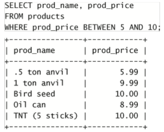

### 第七章 数据过滤

这一章主要说的是AND，OR， IN，NOT这四个操作符，

#### 计算次序
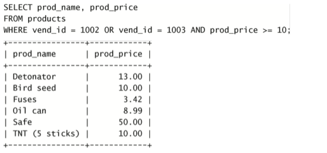


组合AND和OR使用时，因为AND优先级最高计算时会优先处理AND操作符，会将AND两边的条件进行提取，所以上面这个SQL语句其实会等价于

```
SELECT prod_name, prod_price FROM products WHERE vend_id = 1002 OR (vend_id = 1003 AND prod_price >= 10);
```

可能会与我们想要的结果会有一定差距，我们是想要

```
SELECT prod_name, prod_price FROM products WHERE vend_id = 1002 OR (vend_id = 1003 AND prod_price >= 10);
```

可能会与我们想要的结果会有一定差距，我们是想要vend_id为1002或1002，且prod_price大于10的数据，所以在日常使用中，最好使用()明确地分组相应的操作符，而不是依赖操作符的优先级，像下面这样：

```
SELECT prod_name, prod_price FROM products WHERE (vend_id = 1002 OR vend_id = 1003) AND prod_price >= 10;
```

#### IN操作符

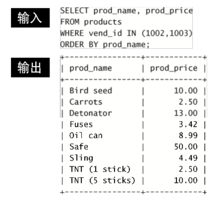

#### OR操作符
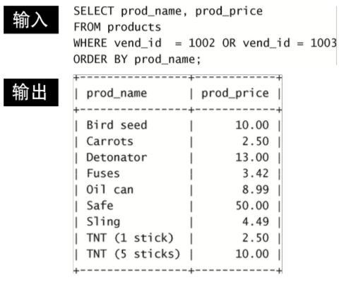

在指定条件范围进行匹配时，IN和OR都能满足需求，但是IN有一些优点：

1.IN操作符语法更加简洁直观，容易管理

2.IN操作符执行更快。

3.IN的最大优点是可以包含其他SELECT语句，从而可以动态地简历WHERE语句，第14章会对此进行详细介绍。

#### NOT操作符

其他DBMS允许使用NOT对各种条件取反，但在MySQL中，只支持使用NOT对IN、BETWEEN和EXISTS子句取反。

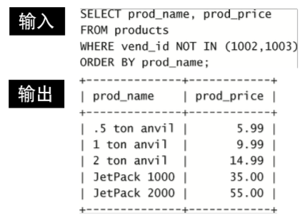


### 第八章 用通配符进行过滤

这一章主要是介绍了LIKE操作符，以及%，_ 这两个通配符。

#### LIKE操作符

LIKE主要是配合通配符一起使用的，LIKE 操作符用于在 WHERE 子句中搜索列中的指定模式。

#### %通配符

%代表搜索模式中给定位置的0个、1个或多个字符。
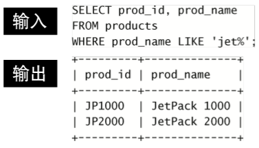
在一个查询语句中也可以使用多个%通配符

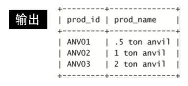

#### 尾空格
可能会干扰通配符匹配。例如，在保存词 anvil时，如果它后面有一个或多个空格，则子句WHERE prod_name LIKE '%anvil'将不会匹配它们，因为在最后的l 后有多余的字符。解决这个问题的一个简单的办法是在搜索模式最后附加一个%。一个更好的办法是使用函数(第11章将会 介绍)去掉首尾空格。
注意NULL 
虽然似乎%通配符可以匹配任何东西，但有一个例 外，即NULL。即使是WHERE prod_name LIKE '%'也不能匹配 用值NULL作为产品名的行。
下划线(_)通配符
_通配符与%通配符类似，只不过只能匹配单个字符，不能匹配0个字符，也不能匹配多个字符
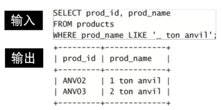

#### 使用通配符的技巧
1.在能使用其他操作符的请款下，尽量不要使用通配符，因为它的搜索事件要比其他操作符的长

2.尽量不要把通配符用在搜索模式的开始处。放在搜索模式的开始处，搜索起来是最慢的。

3.仔细检查通配符的位置。如果放错地方，可能不会返回想要的数据。

### 第九章 用正则表达式进行搜索
这一章主要讲得是正则相关的知识，我个人认为把正则当成一门单独的技术进行学习会比较好，所以建议可以专门去学习

### 第十章 使用计算字段
某些场景下，存储在的表中的数据不是我们所需要的，我们需要对它进行转换、计算或格式化过，这就是计算字段的用途。
#### 使用Concat()函数对字段进行拼接
多数DBMS使用+或||来实现拼接， MySQL则使用Concat()函数来对字段进行拼接。Concat()可以将多个字符串拼接成一个，如下图所示：
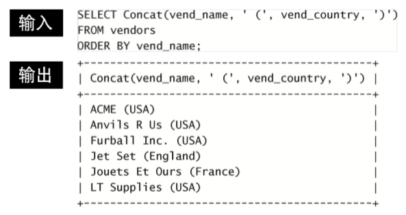

#### 使用Trim()函数来去除空格
Trim()函数 ：去除字符串左右两边的空格
LTrim()函数 ：去除字符串左边的空格
RTrim()函数 ：去除字符串右边的空格
下面是使用RTrim()函数的例子
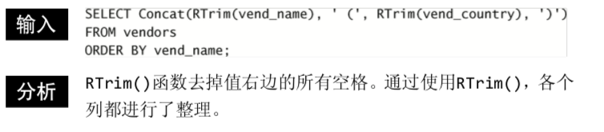

#### 使用别名
我们使用Concat()函数拼接出来的字段是没有名字的，可以使用AS关键字给它赋予一个名字，当然当已有的字段包含不符合规定的字符时，也可以AS关键字给一个已有字段起别名。
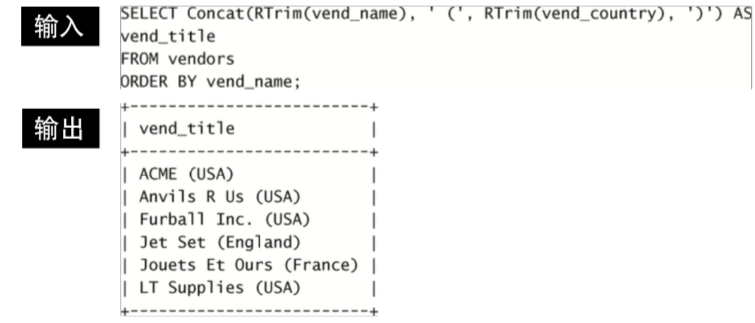

#### 执行算术计算

除了使用Concat()函数得到一个计算字符，也可以使用+，-，*，/计算得到一个字段。如图所示：*

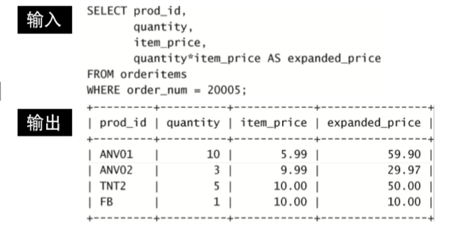


expanded_price列为一个计算字段，是由
quantity*item_price计算得到的。

### 第十一章 使用数据处理函数

除了使用SQL语句对数据进行处理，还可以使用一些函数对数据进行处理，需要注意的是，函数没有SQL的可移植性那么强。

#### 文本处理函数
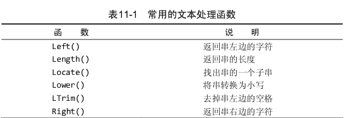

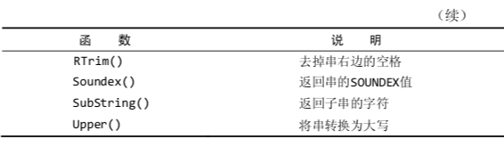

使用案例：
这是使用Upper()函数将文本处理成大写的案例
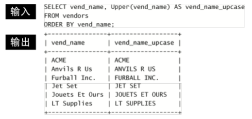

上面这些常见函数大家可能都能够理解，只有Soundex()不太常见，SOUNDEX是一个将任何文 本串转换为描述其语音表示的字母数字模式的算法。
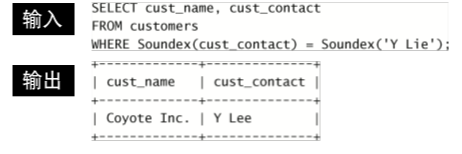
如上图所示，假设有一个顾客的cust_contact值为Y.Lee，但是我们不知道Y.Lee，只知道这个顾客的名字的发音近似于Y.Lie，这个时候我们可以使用Soundex()将cust_contact列值转换为它的SOUNDEX值，因为Y.Lee和 Y.Lie发音相似，所以它们的SOUNDEX值匹配，因此可以查询到这个顾客。

#### 常用日期和时间处理函数
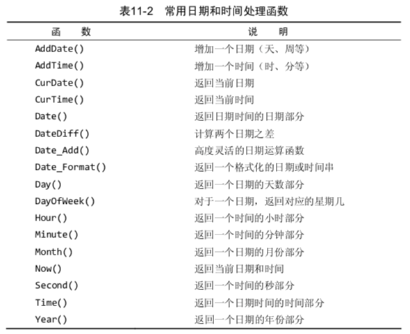
举例，使用Date函数提取日期部分：
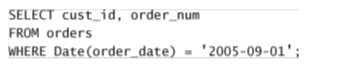

#### 数值处理函数


### 第十二章 汇总数据
在日常开发中，我们除了获得检索得到的数据，还可以使用聚合函数对数据汇总，得到处理后的结果。

#### SQL聚合函数
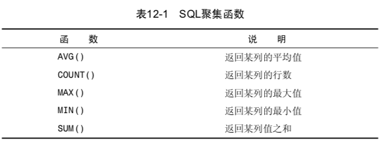

#### AVG()函数
AVG()是计算特定列的平均值，会忽略掉值为NULL的列。

AVG()函数也可以搭配DISTINCT关键字使用，将重复的数据去重后，然后计算平均值，如下图所示：
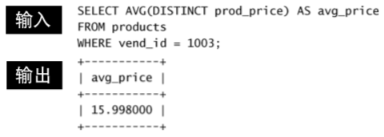
在使用了DISTINCT后，此例子中的avg_price比较高，因为有多个物品具有相同的较低价格。排除它们提升了平均价格。

#### COUNT()函数
两种用法：
1.使用COUNT(*)对表中行的数目进行计数，不管表列中包含的是空值(NULL)还是非空值。
2.使用COUNT(column)对特定列中具有值的行进行计数，会忽略 NULL值。


### 第十三章 分组数据
这一章主要讲了如果使用GROUP BY 对数据进行分组。

#### 创建分组
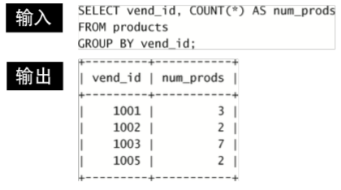

#### 过滤分组
如果要对分组进行过滤，我们可以使用WHERE语句对表中数据进行过滤后，然后使用GROUP BY进行分组，也可以在使用GROUP BY进行分组后，再使用HAVING语句过滤掉一些分组。
例如：
| id   | value |
| ---- | ----- |
| 1    | 100   |
| 2    | 150  |
| 3    | 200   |
| 3    | 500   |
对于上面这个表的数据，如果我们想要过滤掉id为3的分组，那么可以写成使用WHERE语句的方式：
```
SELECT id，COUNT(*) FROM table WHERE id != 3 GROUP BY id;
```
也可以写成使用HAVING语句的方式：
```
SELECT id，COUNT(*) FROM table GROUP BY id HAVING id !=3;
```
当然在过滤分组这方面，HAVING要比WHERE更加强大，比如我们想要对数据分组，并且得到数量大于2的组，那么WHERE就无法实现，只能用HAVING语句。如下：
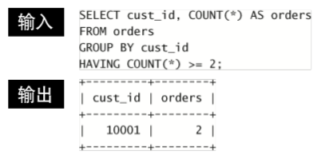

#### 分组和排序
使用GROUP BY在对数据进行分组后，输出的组的顺序通常是按从小到到大，从A到Z升序输出的，但是SQL规范并没有对此进行明确要求，所以有可能不是顺序的，可以使用ORDER BY来对分组进行升序或者降序排序。
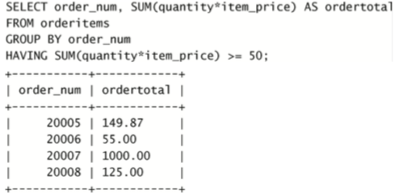

#### SELECT子句顺序
在使用这些语句时，它们的先后顺序应该要按下面的表中顺序来写
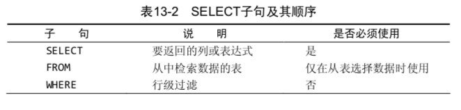

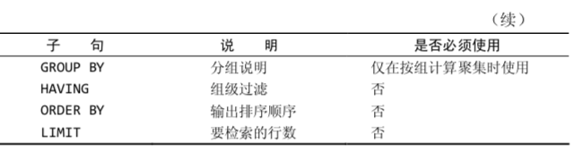

### 第十四章 使用子查询

#### 子查询作为WHERE子句的条件

有时候一条SELECT语句无法满足我们的需求，我们可以把一条SELECT语句的结果用于另外一条SELECT语句的WHERE子句，来实现复杂查询。

例如：我们想要获取订购物品TNT2的所有客户的名字和联系方式：
可以按照下图中的复杂查询实现：

(1) 查询包含物品TNT2的所有订单的编号。
(2) 根据订单编号查询所有客户的ID。 
(3) 根据客户的ID查询名字和联系方式。
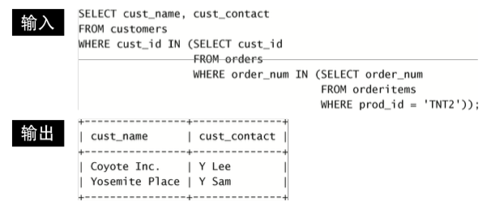

在WHERE子句中使用子查询能够编写出功能很强并且很灵活的 SQL语句。对于能嵌套的子查询的数目没有限制，不过在实际使用时由于 性能的限制，不能嵌套太多的子查询。

需要的注意的地方：

1.能嵌套的子查询的数目没有限制，不过在实际使用时由于 性能的限制，不能嵌套太多的子查询。

2.列必须匹配，在WHERE子句中使用子查询，应该保证SELECT语句具有与WHERE子句中相同数目的列。通常，子查询将返回单个列并且与单个列匹配，但如果需要也可以使用多个列。

3.子查询一般与IN操作符结合使用，但也可以用于测试等于(=)、 不等于(<>)等。

#### 子查询结果作为计算字段
例如：我们想要在获取顾客的信息的同时，获取客户的订单数，可以使用子查询来实现，如下图所示：
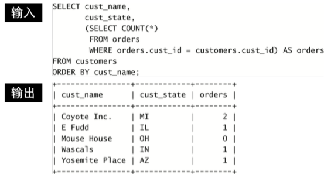
当然这个需求也可以使用JOIN来实现

### 第十五章 连接表
有时候针对单表的查询无法满足我们的需求，我们需要连接多个表，返回一组输出。连接并不是物理实体，只是在查询时建立。

#### 笛卡尔积
在进行连接查询时，如果不指定任何WHERE 条件，那么返回的结果会是笛卡尔积，会拿第一个表中的行数与第二个表中的所有行进行配对，最终总行数会是第一个表的行数乘以第二个表中的行数。

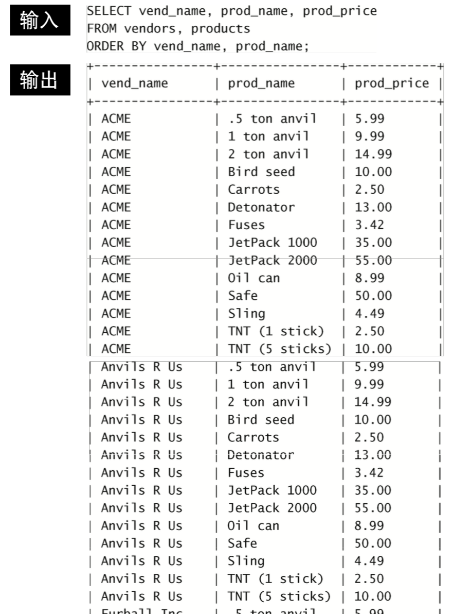

#### WHERE条件

如果指定了WHERE条件，得到的结果会是根据条件对笛卡尔积的结果进行筛选过滤后的结果。例如在这个例子中，指定了products表的vend_id与vendors表的vend_id相等作为筛选条件，这样，连接的结果就是拿vendors表的vend_id去products表中找相匹配的数据。

#### 等值连接(内连接)

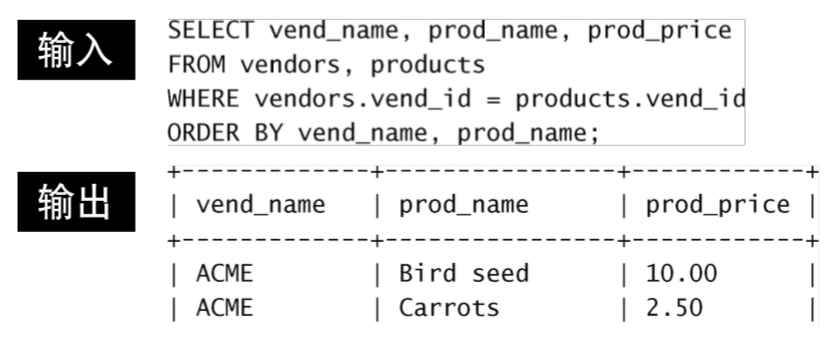

上面的这种连接其实是等值连接，可以用连接的语法来写，可以更加明确连接类型


#### 连接多个表

一条SELECT语句可以连接的表的数量没有限制，可以连接多个表，进行查询
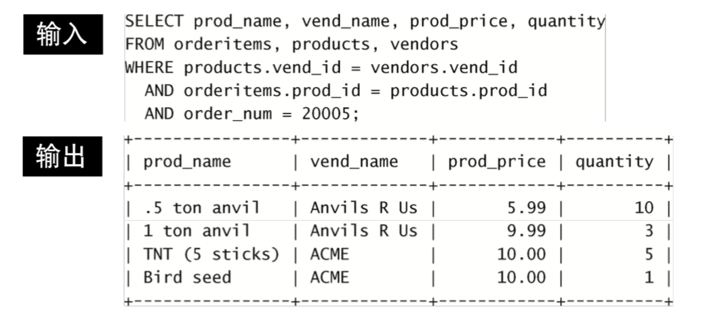


#### 使用连接来替代子查询

之前通过子查询嵌套来完成多表查询，现在可以使用连接来实现

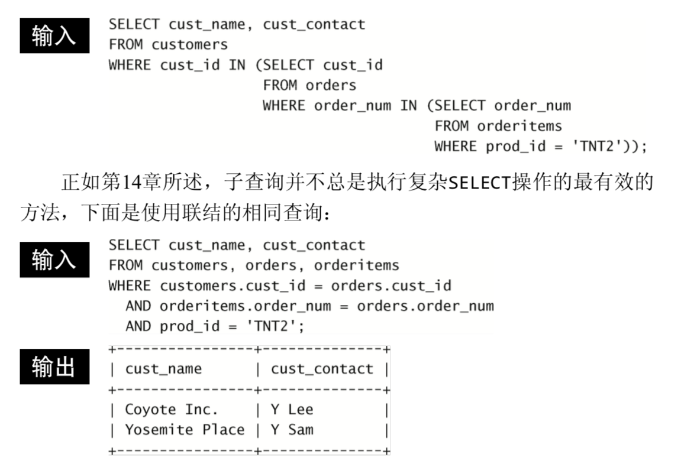


### 第十六章 创建高级联结

本章将讲解外连接，以及如何对被联结的表使用表别名和聚集函数。

#### 使用表别名
除了可以对列，计算字段起别名以外，还可以对表起别名。主要有以下好处：

1.缩短SQL语句(有些表名太长，可以起短的别名)

2.允许在单条SELECT语句中多次使用相同的表（对表进行自连接查询时会需要多次使用相同的表，在下面有相应的例子说明）

除了上一章讲到的内部连接(等值连接)以为，还有自连接，自然连接，外部连接三种连接：
#### 自连接
自连接指的是一张表对自身进行连接，进行信息查询。
例如：
某物品(其ID为DTNTR)存在问题，因此想知道生产该物 品的供应商生产的其他物品是否也存在这些问题。此查询要求首先找到 生产ID为DTNTR的物品的供应商，然后找出这个供应商生产的其他物品。
可以使用自连接的实现：
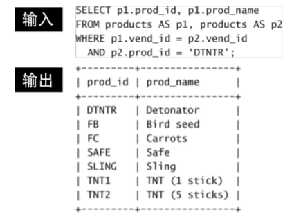

此查询中需要的两个表实际上是相同的表，因此products表在
FROM子句中出现了两次。虽然这是完全合法的，但对products 的引用具有二义性，所以使用表别名避免歧义。
当然解决上面的这个查询需求也可以使用子查询来实现，如下图所示：
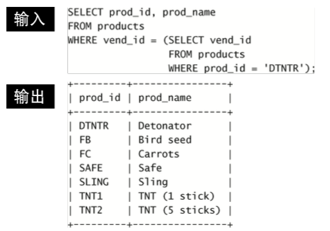

#### 外连接
内部连接会将一个表中的行与另一个表中的行想关联，有时候也需要包含不满足关联条件的那些行，这就是外连接。
例如：
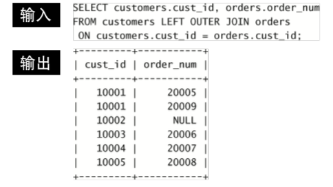
这条SELECT语句使用了关键字OUTER JOIN来指定联结的类型(而不是在WHERE子句中指 定)。但是，与内部联结关联两个表中的行不同的是，外部联结还包括没 有关联行的行。在使用OUTER JOIN语法时，必须使用RIGHT或LEFT关键字 指定包括其所有行的表(RIGHT指出的是OUTER JOIN右边的表，而LEFT 指出的是OUTER JOIN左边的表)。上面的例子使用LEFT OUTER JOIN从FROM 子句的左边表(customers表)中选择所有行。

使用带聚集函数的连接
聚集函数也可以和连接结合起来使用。
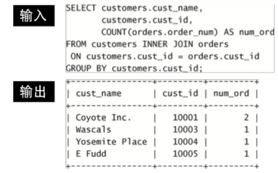
在这个例子中，使用INNER JOIN将customers和orders表互相关联。GROUP BY子句按客户分组数据，因此，函数调用COUNT (orders.order_num)对每个客户的订单计数，将它作为num_ord返回。

#### 注意事项：
1.注意所使用的联结类型。一般我们使用内部联结，但使用外部联 结也是有效的。

2.保证使用正确的联结条件，否则将返回不正确的数据。

3.应该总是提供联结条件，否则会得出笛卡儿积。

4.在一个联结中可以包含多个表，甚至对于每个联结可以采用不同的联结类型。虽然这样做是合法的，一般也很有用，但应该在一起测试它们前，分别测试每个联结。这将使故障排除更为简单。

### 第十七章 组合查询
在 MySQL 中，可以执行多条查询语句，然后对多个结果集，使用UNION语句合并成单个查询结果集返回。主要有以下两种应用场景：
1.在单个查询中从不同的表返回类似结构的数据。
2.对单个表执行多个查询，将结果集合并成一个结果集。

#### 使用UNION
例如我们需要价格小于等于5的所有物品的一个列表，而且 还想包括供应商1001和1002生产的所有物品(不考虑价格)，
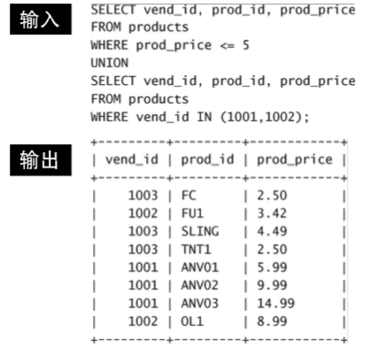

这条语句由前面的两条SELECT语句组成，语句中用UNION关键
字分隔。UNION指示MySQL执行两条SELECT语句，并把输出组 合成单个查询结果集，当然这个需求也可以使用多条WHERE语句来实现。

#### 注意事项：
1.UNION必须由两条或两条以上的SELECT语句组成，语句之间用关 键字UNION分隔(因此，如果组合4条SELECT语句，将要使用3个 UNION关键字)。

2.UNION中的每个查询必须包含相同的列、表达式或聚集函数(不过
3.列数据类型必须兼容:类型不必完全相同，但必须是DBMS可以
隐含地转换的类型(例如，不同的数值类型或不同的日期类型)。 如果遵守了这些基本规则或限制，则可以将并用于任何数据检索任务。

4.在用UNION组合查询时，如果需要对结果进行排序，只能使用一条ORDER BY子句，它必须出现在最后一条SELECT语句之后。对 于结果集，不存在用一种方式排序一部分，而又用另一种方式排序另一 部分的情况，因此不允许使用多条ORDER BY子句。

5.UNION从查询结果集中自动去除了重复的行(换句话说，它的行为与 单条SELECT语句中使用多个WHERE子句条件一样)。因为供应商1002生产 的一种物品的价格也低于5，所以两条SELECT语句都返回该行。在使用 UNION时，重复的行被自动取消。这是UNION的默认行为，但是如果允许重复，可以使用UNION ALL而不是UNION。如下图所示：
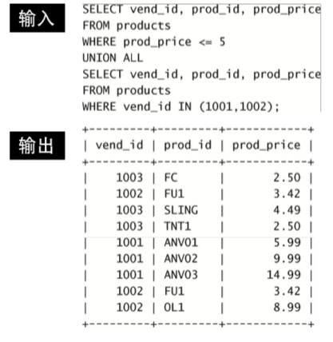

### 第十八章 组合查询
当我们需要对文本进行匹配，可以使用LIKE+通配符，或正则表达式的方式来实现，但是这样会存在很多限制：

1.性能不高——通配符和正则表达式匹配通常要求MySQL尝试匹配表中所有行(而且这些搜索极少使用表索引)。因此，由于被搜索行数不断增加，这些搜索可能非常耗时。

2.不太灵活——使用通配符和正则表达式匹配，很难(而且并不总是能)明确地控制匹配什么和不匹配什么。例如，指定一个词必须匹配，一个词必须不匹配，而一个词仅在第一个词确实匹配的情况下才可以匹配或者才可以不匹配。

3.无法智能化——虽然基于通配符和正则表达式的搜索提供了非常灵活的搜索，但它们都不能提供一种智能化的选择结果的方法。 例如，一个特殊词的搜索将会返回包含该词的所有行，而不区分包含单个匹配的行和包含多个匹配的行(按照可能是更好的匹配 来排列它们)。类似，一个特殊词的搜索将不会找出不包含该词但包含其他相关词的行。所以就有了全文搜索，为了进行全文本搜索，必须索引被搜索的列，而且要随着数据的改 变不断地重新索引。在对表列进行适当设计后，MySQL会自动进行所有 的索引和重新索引。在索引之后，SELECT可与Match()和Against()一起使用以实际执行 搜索。

#### 启用全文本搜索支持
在建表时或者建表以后使用FULLTEXT语句指定全文搜索的列，MySQL根据子句FULLTEXT(note_text)的指示对它进行索引，在之后该列增加、更新或删除行时， 索引随之自动更新
如下图所示：
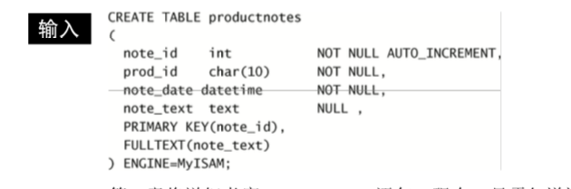

#### 注意事项：
如果正在导入数据到一个新表， 此时不应该启用FULLTEXT索引。应该首先导入所有数据，然后再修改表，定义FULLTEXT，这样花费的时间会更少。

#### 进行全文本搜索
在索引之后，使用两个函数Match()和Against()执行全文本搜索，
Match() 指定被搜索的列
Against() 指定要使用的搜索表达式
如下图所示：SELECT语句检索单个列note_text，将包含rabbit的行进行返回。(全文搜索默认不区分大小写，除非使用BINARY语句进行修饰)
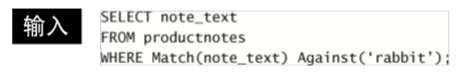
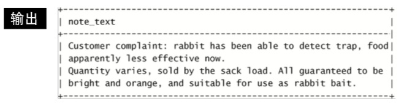

全文搜索还可以使用Rank对结果进行排序，Match()和Against() 用来建立一个计算列(别名为rank)，此列包含全文本搜索计算出的等级 值。等级由MySQL根据行中词的数目、唯一词的数目、整个索引中词的 总数以及包含该词的行的数目计算出来。不包含搜索词的行等级为0(因此不被前一例子中的WHERE子句选择)。确实包含搜索词的两个行每行都有一个等级值，文本中词靠前的行的等级值比词靠后的行的等级值高。如下图所示：
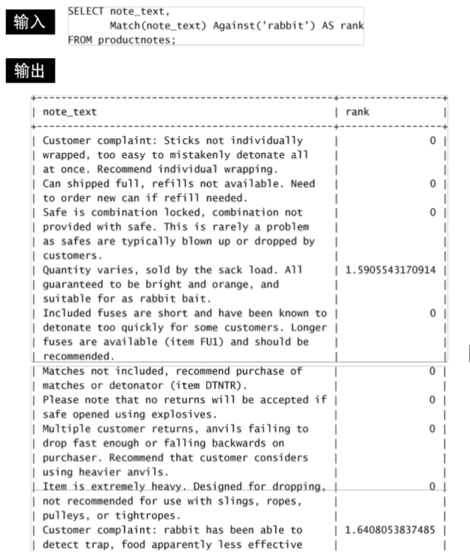
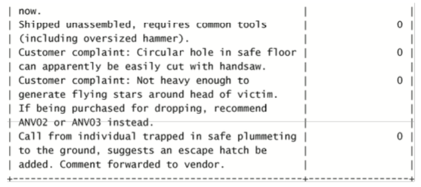

如果指定多个搜索项，则包含多数匹配词的 那些行将具有比包含较少词(或仅有一个匹配)的那些行高的 等级值。

#### 使用查询扩展

查询扩展用来设法放宽所返回的全文本搜索结果的范围，它可以先进行一个基本的全文本搜索，找出与搜索条件匹配的所有行。其次，MySQL检查这些匹配行并选择所有有用的词，再其次，MySQL再次进行全文本搜索，这次不仅使用原来的条件， 而且还使用所有有用的词。如下图所示；
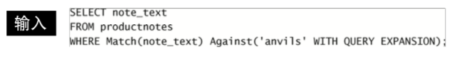
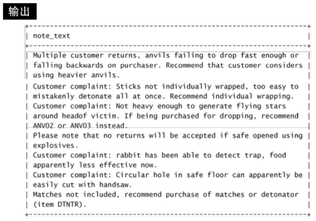

#### 布尔文本搜索
MySQL支持全文本搜索的另外一种形式，称为布尔方式(boolean
mode)。可以指定要匹配的词，要排斥的词，排列提示(指定某些词比其他词更重要，更重要的词等级更高)，表达式分组等。即使没有定义 FULLTEXT索引，也可以使用它。但这是一种非常缓慢的操作。
例如:
在下图里面的查询中，会匹配词heavy，但-rope*明确地
分析指示MySQL排除包含rope*(任何以rope开始的词，包括 ropes)的行。
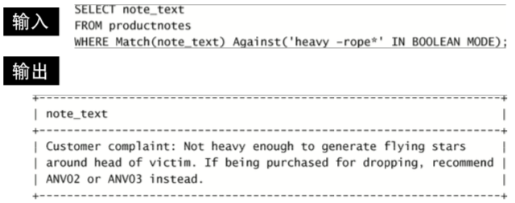

除了布尔操作符-和*，-排除一个词，而* 是截断操作符(可想象为用于词尾的一个通配符)。还有以下全文本布尔操作符：


下面是一些全文本布尔操作符使用案例：
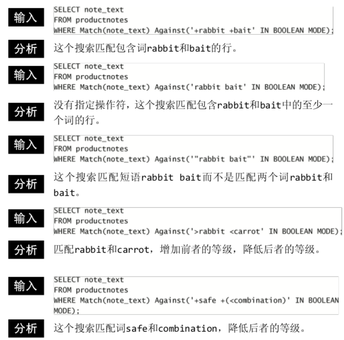

全文本搜索的使用说明

1.在索引全文本数据时，短词被忽略且从索引中排除。短词定义为 那些具有3个或3个以下字符的词(如果需要，这个数目可以更改)。

2.MySQL带有一个内建的非用词(stopword)列表，这些词在索引全文本数据时总是被忽略。如果需要，可以覆盖这个列表(请参阅MySQL文档以了解如何完成此工作)。

3.许多词出现的频率很高，搜索它们没有用处(返回太多的结果)。因此，MySQL规定了一条50%规则，如果一个词出现在50%以上的行中，则将它作为一个非用词忽略。50%规则不用于IN BOOLEAN MODE。

4.如果表中的行数少于3行，则全文本搜索不返回结果(因为每个词或者不出现，或者至少出现在50%的行中)。

5.忽略词中的单引号。例如，don't索引为dont。

6.不具有词分隔符(包括日语和汉语)的语言不能恰当地返回全文
本搜索结果。

7.如前所述，仅在MyISAM数据库引擎中支持全文本搜索。

8.没有邻近操作符，邻近搜索是许多全文本搜索支持的一个特 性，它能搜索相邻的词(在相同的句子中、相同的段落中或者 在特定数目的词的部分中，等等。MySQL全文本搜索现在还不支持邻近操作符。


### 第十九章 插入数据
使用INSERT语句插入数据，大家都很熟悉。
例如向 Customers 表插入一条name为tom，age为29的数据
一般有以下两种方式：
```
INSERT INTO Customers VALUES("tom", "29")；

INSERT INTO Customers(name, age) VALUES("tom", "29")；
```
一般推荐第二张方式，因为第一种方式的数据顺序必须与列在表中的数据保持一致，容易写错，其次是当表结构发生改变时，第一种方式需要变更数据顺序，第二种方式不需要。

#### 插入检索出的数据
INSERT一般用来给表插入一个指定列值的行。但是，INSERT还存在 另一种形式，可以利用它将一条SELECT语句的结果插入表中。如下图所示，这个例子使用INSERT SELECT从custnew表中将所有数据导入customers表
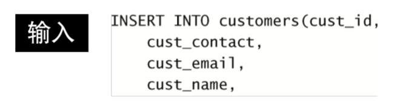
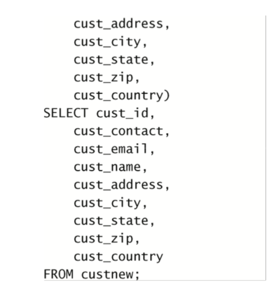


### 第二十章 更新和删除数据
#### 更新数据
使用UPDATE语句更新数据，大家都很熟练了，一般UPDATE语句组成部分如下：
```
UPDATE 表名
SET 列名 = 新值
WHERE 过滤条件;
```
如下图所示：

需要注意的是：

1.在使用UPDATE语句时，不要省略WHERE子句 ，否则就会更新表中所有行。

2.IGNORE关键字，如果用UPDATE语句更新多行，并且在更新这些行中的一行或多行时出一个现错误，则整个UPDATE操作被取消 (错误发生前更新的所有行被恢复到它们原来的值)。为即使是发生错误，也继续进行更新，可使用IGNORE关键字，如下所示: UPDATE IGNORE customers...

#### 删除数据
使用DELETE语句更新数据，大家也都很熟练了，一般DELETE语句组成部分如下：

DELETE FROM 表名
WHERE 过滤条件;

如下图所示：

需要注意的是：

1.在使用DELETE语句时，不要省略DELETE子句 ，否则会删除表中所有行。

2.DELETE语句从表中删除行，甚至是删除表中所有行。但是，DELETE不删除表本身。

3.如果想从表中删除所有行，不要使用DELETE。 可使用TRUNCATE TABLE语句，它完成相同的工作，但速度更快,因为TRUNCATE实际是删除原来的表并重新创建一个表，而不是逐行删除表中的数据

更新和删除的指导原则

1.除非确实打算更新和删除每一行，否则绝对不要使用不带WHERE 子句的UPDATE或DELETE语句。

2.保证每个表都有主键(如果忘记这个内容，请参阅第15章)，尽可能 像WHERE子句那样使用它(可以指定各主键、多个值或值的范围)。 

3.在对UPDATE或DELETE语句使用WHERE子句前，应该先用SELECT进行测试，保证它过滤的是正确的记录，以防编写的WHERE子句不正确。

4.使用强制实施引用完整性的数据库(关于这个内容，请参阅第15
章)，这样MySQL将不允许删除具有与其他表相关联的数据的行。

5.MySQL没有撤销(undo)按钮。应该非常小心地使用UPDATE和DELETE，否则你会发现自己更新或删除了错误的数据。

### 第二十一章 创建和操纵表
#### 创建表
使用CREATE语句来创建一个表，大家都很熟悉了，如下图所示
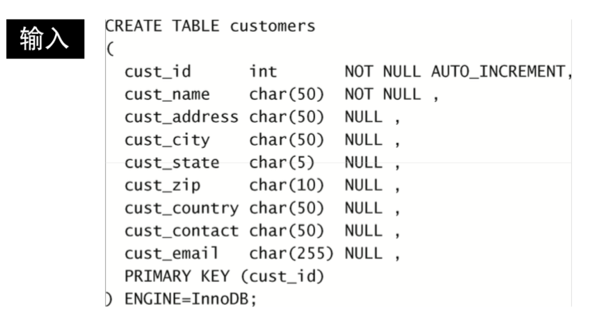

需要注意的有以下几点：

1.在建表时，每一列要么是可为NULL列，要么是NOT NULL列，如果不指定，默认为可为NULL列。 

2.主键必须保证唯一，不能为NULL。如果使用一个列作为主键，值必须唯一，如果使用多个列作为主键，那么多个列组合的值必须唯一。

3.MySQL有一个具体管理和处理数据的内部引擎，在执行SQL语句时，可以使用ENGINE语句指定引擎，如果省略ENGINE=语句，则使用默认引擎(很可能是MyISAM)，以下为MySQL常见的几个引擎：
InnoDB

是一个可 靠的事 务 处 理 引 擎 ( 参 见 第 26 章 )， 它 不 支 持 全 文 本搜索;

MEMORY

在功能等同于MyISAM，但由于数据存储在内存(不是磁盘) 中，速度很快，所以特别适合于临时表;

MyISAM

是一个性能极高的引擎，它支持全文本搜索(参见第18章)， 但不支持事务处理。

#### 更新表
在表建立以后，如果需要对表结构进行修改，我们可以使用ALTER TABLE语句对表进行修改。例如：


复杂的表结构更改一般需要手动删除过程，它涉及以下步骤: 

1.用新的列布局创建一个新表。

2.使用INSERT SELECT语句从旧表复制数据到新表。如果有必要，可使用转换函数和计算字段。

3.检验包含所需数据的新表。

4.重命名旧表(如果确定，可以删除它)。

5.用旧表原来的名字重命名新表。

6.根据需要，重新创建触发器、存储过程、索引和外键。

#### 删除表
删除表(删除整个表而不是其内容)非常简单，使用DROP TABLE语，例如:
删除customers2表
```
DROP TABLE customers2;
```
#### 重命名表
使用RENAME TABLE语句可以重命名一个表。
例如：
将表customers2名字改为customers
```
RENAME TABLE customers2 to customers;
```
### 第二十二章 使用视图
视图为虚拟的表。它们包含的不是数据而是根据需要检索数据的查 询。视图提供了一种MySQL的SELECT语句层次的封装，可用来简化数据 处理以及重新格式化基础数据或保护基础数据。

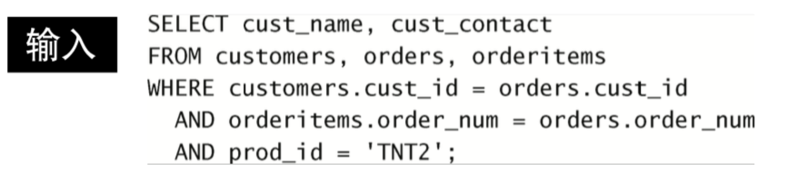
后面就可以把productcustomers视图看成一个虚拟表进行查询，如下图所示：


#### 视图主要的用途：

1.重用SQL语句。

2.简化复杂的SQL操作。在编写查询后，可以方便地重用它而不必 知道它的基本查询细节。

3.使用表的组成部分而不是整个表。

4.保护数据。可以给用户授予表的特定部分的访问权限而不是整个表的访问权限。

5.更改数据格式和表示。视图可返回与底层表的表示和格式不同的数据。 

#### 视图的规则和限制：

1.与表一样，视图必须唯一命名(不能给视图取与别的视图或表相 同的名字)。

2.对于可以创建的视图数目没有限制。

3.为了创建视图，必须具有足够的访问权限。这些限制通常由数据库管理人员授予。

4.视图可以嵌套，即可以利用从其他视图中检索数据的查询来构造一个视图。

5.ORDER BY可以用在视图中，但如果从该视图检索数据SELECT中也含有ORDER BY，那么该视图中的ORDER BY将被覆盖。

6.视图不能索引，也不能有关联的触发器或默认值。

7.视图可以和表一起使用。例如，编写一条联结表和视图的SELECT语句。

#### 常见的视图操作语句

1.视图用CREATE VIEW语句来创建。

2.使用SHOW CREATE VIEW viewname;来查看创建视图的语句。

3.用DROP删除视图，其语法为DROP VIEW viewname;。

4.更新视图时，可以先用DROP再用CREATE，也可以直接用CREATE OR REPLACE VIEW。如果要更新的视图不存在，则第2条更新语句会创建一个视图;如果要更新的视图存在，则第2条更新语句会替换原有视图。

我们上面的例子中视图的作用其实是简化复杂SQL的使用，其实视图还有其他的作用，例如：

#### 用视图重新格式化检索出的数据


#### 用视图过滤不想要的数据


#### 更新视图
视图是可更新的(也就是可以对它们使用INSERT、UPDATE和DELETE)。更新一个视图将更新其基表(可以回忆一下，视图本身没有数据)。如果你对视图增加或删除行，实际上是对其基表增加或删除行。但是当视图定义中有以下操作时，则不能进行视图的更新:

1.分组(使用GROUP BY和HAVING); 联结;

2.子查询;

3.并;

4.聚集函数(Min()、Count()、Sum()等);

5.DISTINCT;

6.导出(计算)列。

### 第二十三章 使用存储过程
存储过程，就是可以一条或多条MySQL语句的组合起来，并且可以加入一些业务逻辑。

#### 创建和执行存储过程
简单的示例：
使用CREATE PROCEDURE语句创建一个存储过程，对一个SELECT语句进行封装，之后可以使用CALL语句来执行这个存储过程。


需要注意的是，因为在存储过程中会包含一些;分隔符，而在命令行实用程序中，使用;字符来作为语句分隔符，为了避免语法错误，可以使用DELIMITER语句来定义一个新的语句结束分隔符。如下图所示：


#### 删除存储过程
 可以使用DROP PROCEDURE 语句来删除一个存储过程，例如：
删除名为productpricing的存储过程
```
DROP PROCEDURE productpricing；
```
#### 使用参数
在创建存储过程时，可以使用IN语句来存储传入参数，OUT语句来存储返回结果。
在下面这个例子中，20005是传入参数，@total是返回结果。传入参数和返回结果也可以定义多个。


#### 建立智能存储过程
在创建存储过程中，也可以使用IF，THEN，END IF语句来设置判断条件，这是存储过程与简单的语句封装最大的区别。

例如：


添加了另外一个 参数taxable，它是一个布尔值(如果要增加税则为真，否则为假)。在 存储过程体中，用DECLARE语句定义了两个局部变量。DECLARE要求指定 变量名和数据类型，它也支持可选的默认值(这个例子中的taxrate的默 认被设置为6%)。SELECT语句已经改变，因此其结果存储到total(局部 变量)而不是ototal。IF语句检查taxable是否为真，如果为真，则用另 一SELECT语句增加营业税到局部变量total。最后，用另一SELECT语句将 total(它增加或许不增加营业税)保存到ototal。
BOOLEAN值指定为1表示真，指定为0表示假(实际上，非零值 都考虑为真，只有0被视为假)。通过给中间的参数指定0或1，可以有条件地将营业税加到订单合计上。

#### 检查存储过程
可以使用 SHOW CREATE PROCEDURE 语句显示用来创建一个存储过程的 CREATE 语句也可以使用 SHOW PROCEDURE STATUS 列出所有存储过程。为限制其输出，可使用LIKE指定一个过滤模式，例如:SHOW PROCEDURE STATUS LIKE 'ordertotal';

### 第二十四章 使用游标
游标(cursor)是一个存储在MySQL服务器上的数据库查询， 它不是一条SELECT语句，而是被该语句检索出来的结果集。在存储了游 标之后，应用程序可以根据需要滚动或浏览结果集中的数据。

#### 创建游标

定义了一个名为ordernumbers的游标


#### 打开和关闭游标
打开名为ordernumbers的游标
```
OPEN ordernumbers;
```
关闭名为ordernumbers的游标
```
CLOSE ordernumbers;
```
如果不明确关闭游标，MySQL将会在到达END语句时自动关闭它。

#### 使用游标数据


这个例子使用FETCH检索当前order_num到声明的名为o的变量中。但与前一个例子不一样的是，这个 例子中的FETCH是在REPEAT内，因此它反复执行直到done为真(由UNTIL done END REPEAT;规定)。为使它起作用，用一个DEFAULT 0(假，不结 束)定义变量done。当在 FETCH 语句中引用的游标位置处于结果表最后一行之后时，SQLSTATE会为02000，这个时候done会为真，停止循环。

### 第二十五章 使用触发器
可以使用触发器是在MySQL响应 INSERT UPDATE DELETE 语句前后自动执行一条MySQL语句。

#### 创建触发器
创建触发器语句的格式一般是
CREATE TRIGGER 触发器名称 触发时机 触发操作 FOR EACH ROW 执行操作;
例如：
```
CREATE TRIGGER newproduct AFTER INSERT FOR EACH ROW SELECT 'Product added'；
```
CREATE TRIGGER用来创建名为newproduct的新触发器。触发器
可在一个操作发生之前或之后执行，这里给出了AFTER INSERT， 所以此触发器将在INSERT语句成功执行后执行。这个触发器还指定FOR EACH ROW，因此代码对每个插入行执行。在这个例子中，文本Product added将对每个插入的行显示一次。

#### 删除触发器
```
DROP TRIGGER newproduct;删除名为newproduct的触发器
```
#### INSERT触发器

1. 在INSERT触发器代码内，可引用一个名为NEW的虚拟表，访问被 插入的行;

2. 在BEFORE INSERT触发器中，NEW中的值也可以被更新(允许更改 被插入的值);

3. 对于AUTO_INCREMENT列，NEW在INSERT执行之前列的值会是0，在INSERT 执行之后包含新的自动生成值。


上面的例子中创建一个名为neworder的触发器，它按照AFTER INSERT ON orders执行。在插入一个新订单到orders表时，MySQL生 成一个新订单号并保存到order_num中。触发器从NEW. order_num取得这个值并返回它。

#### DELETE触发器

DELETE触发器在DELETE语句执行之前或之后执行，在DELETE触发器代码内，你可以引用一个名为OLD的虚拟表，访问被删除的行。OLD中的值全都是只读的，不能更新。

上面这个例子中，在任意订单被删除前将执行此触发器。它使用一条INSERT语句将OLD中的值(要被删除的订单)保存到一个名为archive_ orders的存档表中(为实际使用这个例子，你需要用与orders相同的列 创建一个名为archive_orders的表)。

#### UPDATE触发器

UPDATE触发器在UPDATE语句执行之前或之后执行。在UPDATE触发器代码中，你可以引用一个名为OLD的虚拟表访问 以前(UPDATE语句前)的值，引用一个名为NEW的虚拟表访问新 更新的值。在BEFORE UPDATE触发器中，NEW中的值可能也被更新(允许更改 将要用于UPDATE语句中的值)。OLD中的值全都是只读的，不能更新。

上面面的例子保证州名缩写总是大写(不管UPDATE语句中给出的是大 写还是小写)

#### 注意事项：

1.只有表才支持触发器，视图不支持(临时表也不 支持)。

2.如果BEFORE触发器失败，则MySQL将不执行请求的操作。此外，如果BEFORE触发器或语句本身失败，MySQL 将不执行AFTER触发器(如果有的话)。

3.与其他DBMS相比，MySQL 5中支持的触发器相当初级。未来的MySQL版本中有一些改进和增强触发器支持的计划。

4.创建触发器可能需要特殊的安全访问权限，但是，触发器的执行是自动的。如果INSERT、UPDATE或DELETE语句能够执行，则相关 的触发器也能执行。

5.应该用触发器来保证数据的一致性(大小写、格式等)。在触发器中执行这种类型的处理的优点是它总是进行这种处理，而且是透 明地进行，与客户机应用无关。

6.触发器的一种非常有意义的使用是创建审计跟踪。使用触发器， 把更改(如果需要，甚至还有之前和之后的状态)记录到另一个 表非常容易。

7.遗憾的是，MySQL触发器中不支持CALL语句。这表示不能从触发 器内调用存储过程。所需的存储过程代码需要复制到触发器内。

### 第二十六章 管理事务处理
事务处理可以用来维护数据库的完整性，它保证一组SQL语句要么完全执行，要么完全不执行。利用事务处理，可以保证一组操作不会中途停止，它们 或者作为整体执行，或者完全不执行(除非明确指示)。如果没有错误发 生，整组语句提交给(写到)数据库表。如果发生错误，则进行回退(撤 销)以恢复数据库到某个已知且安全的状态。
事务(transaction)指一组SQL语句;
回退(rollback)指撤销指定SQL语句的过程;
提交(commit)指将未存储的SQL语句结果写入数据库表;
保留点(savepoint)指事务处理中设置的临时占位符(place-
holder)，你可以对它发布回退(与回退整个事务处理不同)。

#### 控制事务处理
```
事务开始 START TRANSACTION
```
#### 使用ROLLBACK
MySQL的ROLLBACK命令用来回退(撤销)MySQL语句。例如：


从显示ordertotals表(此表在第24章中填充)的内
容开始。首先执行一条SELECT以显示该表不为空。然后开始一 个事务处理，用一条DELETE语句删除ordertotals中的所有行。另一条 SELECT语句验证ordertotals确实为空。这时用一条ROLLBACK语句回退 START TRANSACTION之后的所有语句，最后一条SELECT语句显示该表不为空。
ROLLBACK只能在一个事务处理内使用(在执行一条START TRANSACTION命令之后)。可以回退INSERT、UPDATE和 DELETE语句。不能回退SELECT，CREATE，DROP语句。

#### 使用COMMIT
一般的MySQL语句都是直接针对数据库表执行和编写的。这就是所谓的隐含提交(implicit commit)，即提交(写或保存)操作是自动进行的。但是，在事务处理块中，提交不会隐含地进行。为进行明确的提交， 使用COMMIT语句。


在这个例子中，从系统中完全删除订单20010。因为涉及更新
两个数据库表orders和orderItems，所以使用事务处理块来 保证订单不被部分删除。最后的COMMIT语句仅在不出错时写出更改。如 果第一条DELETE起作用，但第二条失败，则DELETE不会提交(会被自动撤销)。

#### 使用保留点
简单的ROLLBACK和COMMIT语句就可以写入或撤销整个事务处理。但 是，只是对简单的事务处理才能这样做，更复杂的事务处理可能需要部 分提交或回退。为了支持回退部分事务处理，必须能在事务处理块中合适的位置放 置占位符。这样，如果需要回退，可以回退到某个占位符。

#### 创建占位符
```
SAVEPOINT delete1;创建一个名称为delete1的占位符
ROLLBACK TO delete1;回退到delete1的占位符
```
保留点在事务处理完成(执行一条ROLLBACK或 COMMIT)后自动释放。自MySQL 5以来，也可以用RELEASE SAVEPOINT明确地释放保留点。

#### 更改默认的提交行为
默认的MySQL行为是自动提交所有更改。换句话说，任何 时候你执行一条MySQL语句，该语句实际上都是针对表执行的，而且所做 的更改立即生效。为指示MySQL不自动提交更改，可以使用
```
SET autocommit=0;
```
autocommit标志决定是否自动提交更改，不管有没有COMMIT
语句。设置autocommit为0(假)指示MySQL不自动提交更改 (直到autocommit被设置为真为止)。

### 第二十七章 全球化和本地化
数据库表被用来存储和检索数据。不同的语言和字符集需要以不同 的方式存储和检索。因此，MySQL需要适应不同的字符集(不同的字母 和字符)，适应不同的排序和检索数据的方法。

#### 使用字符集和校对顺序
```
show CHARACTER SET;
```
可以展示可用的字符集，MySQL 默认字符集是latin1，一般我们常用的就是utf8
```
show COLLATION;
```
可以展示所支持校对以及它们适用的字符集的完整列表，有的字符集具有不止一种校对。

通常系统管理在安装时定义一个默认的字符集和校对。此外，也可 以在创建数据库时，指定默认的字符集和校对。和校对，可以使用以下语句进行查看：
```
show VARIABLES like 'character%'；查看字符集相关的配置
show VARIABLES like 'collation%'；查看校对相关的配置
```
#### 给表指定字符集和校对

这个例子中指定了CHARACTER SET和COLLATE两者。一般，MySQL如
下确定使用什么样的字符集和校对。

1.如果指定CHARACTER SET和COLLATE两者，则使用这些值。

2.如果只指定CHARACTER SET，则使用此字符集及其默认的校对(如SHOW CHARACTER SET的结果中所示)。

3.如果既不指定CHARACTER SET，也不指定COLLATE，则使用数据库默认。

#### 对列指定字符集和校对


#### 查询时指定校对顺序

此SELECT使用COLLATE指定一个备用的校对顺序(在这个例子 中，为区分大小写的校对)。除了这里看到的在ORDERBY子 句中使用以外，COLLATE还可以用于GROUP BY、HAVING、聚集 函数、别名等。

### 第二十八章 安全管理
MySQL用户账号和信息存储在名为mysql的MySQL数据库中。
获得所有用户账号列表


#### 创建用户账号
CREATE USER ben IDENTIFIED BY 'passwOrd';
CREATE USER创建一个新用户账号。在创建用户账号时不一定需要密码，不过这个例子用IDENTIFIED BY 'passwOrd'给出了一个密码。

#### 重新命名一个用户账号
```
RENAME USER ben TO bforta;
```

#### 删除用户账号
```
DROP USER bforta;
```

#### 设置访问权限
为看到赋予用户账号的权限，使用SHOW GRANTS FOR，如下图所示:

输出结果显示用户bforta有一个权限USAGE ON *.*。此结果表示在任意数据库和任意表上对任何数据没有权限。
用户定义为user@host MySQL的权限将会把用户名和主机名结合定义。如果不指定主机名，则使用默认的主机名%(授予用户访问权限而不管主机名)。

#### GRANT语句
GRANT语句的一般格式是
GRANT 权限 ON 范围 TO 用户;
例如：
```
GRANT SELECT ON crashhouse.* TO bforta;
```
GRANT允许用户在crashcourse.*(crashcourse数据库的所
有表)上使用SELECT语句。

SHOW GRANTS可以用来显示bforta用户的权限


#### REVOKE
GRANT的反操作为REVOKE，用它来撤销特定的权限。
```
REVOKE SELECT ON crashhouse.* FROM bforta;
```
这条REVOKE语句取消刚赋予用户bforta的SELECT访问权限。被 撤销的访问权限必须存在，否则会出错。

GRANT和REVOKE可在几个层次上控制访问权限:

1.整个服务器，使用GRANT ALL和REVOKE ALL; 

2.整个数据库，使用ON database.*;

3.特定的表，使用ON database.table;

4.特定的列;

5.特定的存储过程。

下面是可以授予或撤销的每个权限：


#### 注意事项:
#### 提前授权
在使用GRANT和REVOKE时，用户账号必须存在， 但对所涉及的对象没有这个要求。这允许管理员在创建数据库 和表之前设计和实现安全措施。这样做的副作用是，当某个数据库或表被删除时(用DROP语 句)，相关的访问权限仍然存在。而且，如果将来重新创建该 数据库或表，这些权限仍然起作用。

#### 更改密码
更改特定用户的密码
```
SET PASSWORD FOR bforta = Password('123456');
```
更改当前用户的密码
```
SET PASSWORD = Password('123456');
```
### 第二十九章 数据库维护
备份数据一般有以下几种方案：

1.使用命令行实用程序 mysqldump 转储所有数据库内容到某个外部 文件。在进行常规备份前这个实用程序应该正常运行，以便能正 确地备份转储文件。

2.可用命令行实用程序 mysqlhotcopy 从一个数据库复制所有数据 (并非所有数据库引擎都支持这个实用程序)。

3.可以使用 MySQL 的 BACKUP TABLE 或 SELECT INTO OUTFILE 转储所有数据到某个外部文件。这两条语句都接受将要创建的系统文件名，此系统文件必须不存在，否则会出错。数据可以用 RESTORE TABLE 来复原。

#### 数据库维护
ANALYZE TABLE
用来检查表键是否正确,返回的状态信息如下:


CHECK TABLE
用来针对许多问题对表进行检查。在MyISAM表上还对索引进行检查。
CHECK TABLE支持一系列的检查选项（仅用于MyISAM表） :

CHANGED
检查自最后一次检查以来改动过的表

EXTENDED
执行最彻底的检查

FAST
只检查未正常关闭的表

MEDIUM
检查所有被删 除的链接并进行键检验

QUICK
只进行快速扫描
如下所示，CHECK TABLE发现和修复问题:


如果MyISAM表访问产生不正确和不一致的结果，可能需要用REPAIR TABLE来修复相应的表。这条语句不应该经常使用，如果需要经常使用，可能会有更大的问题要解决。
如果从一个表中删除大量数据，应该使用OPTIMIZE TABLE来收回所用的空间，从而优化表的性能。

#### 诊断启动问题
服务器启动问题通常在对MySQL配置或服务器本身进行更改时出现。MySQL在这个问题发生时报告错误，但由于多数MySQL服务器是作为系统进程或服务自动启动的，这些消息可能看不到。
在排除系统启动问题时，首先应该尽量用手动启动服务器。MySQL 服务器自身通过在命令行上执行mysqld启动。下面是几个重要的mysqld命令行选项:

--help
显示帮助

--safe-mode
装载减去某些最佳配置的服务器

--verbose
显示全文本消息(为获得更详细的帮助消息与--help联合使用)

--version
显示版本信息然后退出

查看日志文件 

MySQL维护管理员依赖的一系列日志文件。主要的日志文件有以下几种。

错误日志

它包含启动和关闭问题以及任意关键错误的细节。此日志通常名为hostname.err，位于data目录中。此日志名可用 --log-error命令行选项更改。

查询日志

它记录所有MySQL活动，在诊断问题时非常有用。此日志文件可能会很快地变得非常大，因此不应该长期使用它。此 日志通常名为hostname.log，位于data目录中。此名字可以用 --log命令行选项更改。

二进制日志

它记录更新过数据(或者可能更新过数据)的所有语句。此日志通常名为hostname-bin，位于data目录内。此名字 可以用--log-bin命令行选项更改。注意，这个日志文件是MySQL 5 中添加的，以前的MySQL版本中使用的是更新日志。

缓慢查询日志

顾名思义，此日志记录执行缓慢的任何查询。这 个日志在确定数据库何处需要优化很有用。此日志通常名为 hostname-slow.log，位于data目录中。此名字可以用
--log-slow-queries命令行选项更改。 在使用日志时，可用FLUSH LOGS语句来刷新和重新开始所有日志文件。

### 第三十章 改善性能
#### 改善性能的一些方法：

1.首先，MySQL(与所有DBMS一样)具有特定的硬件建议。在学习和研究MySQL时，使用任何旧的计算机作为服务器都可以。但对用于生产的服务器来说，应该坚持遵循这些硬件建议。

2.一般来说，关键的生产DBMS应该运行在自己的专用服务器上。 

3.MySQL是用一系列的默认设置预先配置的，从这些设置开始通常是很好的。但过一段时间后你可能需要调整内存分配、缓冲区大 小等。(为查看当前设置，可使用SHOW VARIABLES;和SHOW STATUS;)

4.MySQL一个多用户多线程的DBMS，换言之，它经常同时执行多个任务。如果这些任务中的某一个执行缓慢，则所有请求都会执 行缓慢。如果你遇到显著的性能不良，可使用SHOW PROCESSLIST 显示所有活动进程(以及它们的线程ID和执行时间)。你还可以用KILL命令终结某个特定的进程(使用这个命令需要作为管理员登录)。

5.总是有不止一种方法编写同一条SELECT语句。应该试验联结、并、子查询等，找出最佳的方法。

6.使用EXPLAIN语句让MySQL解释它将如何执行一条SELECT语句。 

7.一般来说，存储过程执行得比一条一条地执行其中的各条MySQL语句更快

8.应该总是使用正确的数据类型。

9.决不要检索比需求还要多的数据。换言之，不要用SELECT *(除非你真正需要每个列)。

10.有的操作(包括INSERT)支持一个可选的DELAYED关键字，如果使用它，将把控制立即返回给调用程序，并且一旦有可能就实际执行该操作。

11.在导入数据时，应该关闭自动提交。你可能还想删除索引(包括FULLTEXT索引)，然后在导入完成后再重建它们。

12.必须索引数据库表以改善数据检索的性能。确定索引什么不是一件微不足道的任务，需要分析使用的SELECT语句以找出重复的 WHERE和ORDER BY子句。如果一个简单的WHERE子句返回结果所花的时间太长，则可以断定其中使用的列(或几个列)就是需要索引的对象。

13.你的SELECT语句中有一系列复杂的OR条件吗?通过使用多条SELECT语句和连接它们的UNION语句，你能看到极大的性能改进。

14.索引改善数据检索的性能，但损害数据插入、删除和更新的性能。如果你有一些表，它们收集数据且不经常被搜索，则在有必要之前不要索引它们。(索引可根据需要添加和删除。)

15.LIKE很慢。一般来说，最好是使用FULLTEXT而不是LIKE。

16.数据库是不断变化的实体。一组优化良好的表一会儿后可能就面目全非了。由于表的使用和内容的更改，理想的优化和配置也会改变。

17.最重要的规则就是，每条规则在某些条件下都会被打破。


