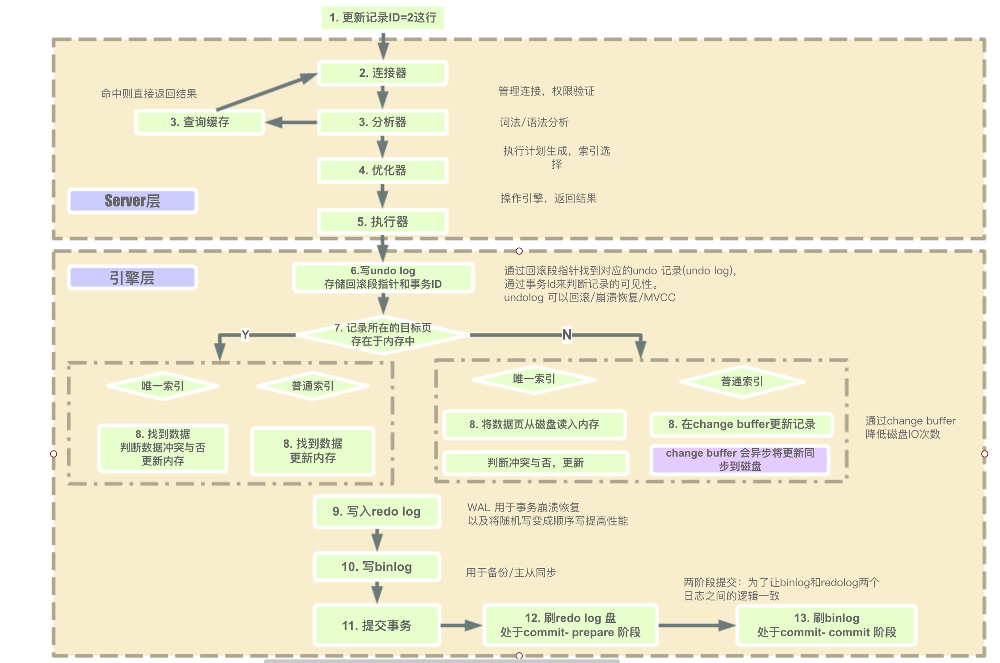
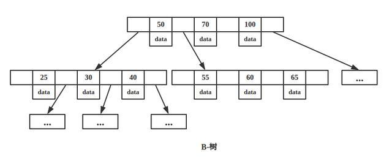
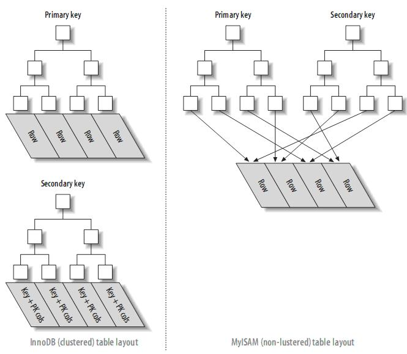
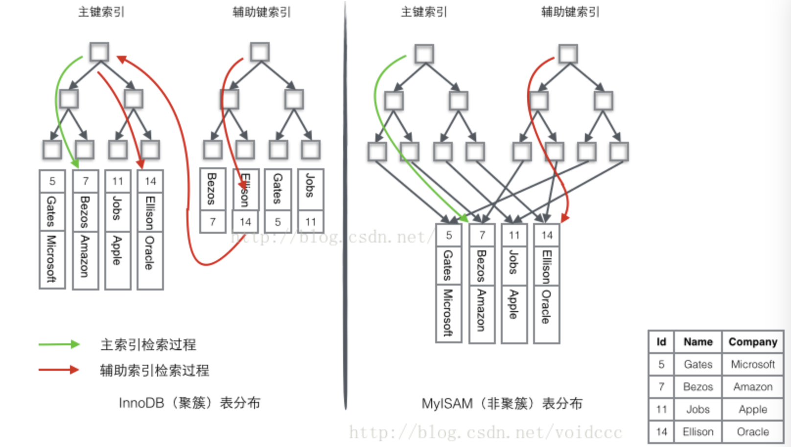
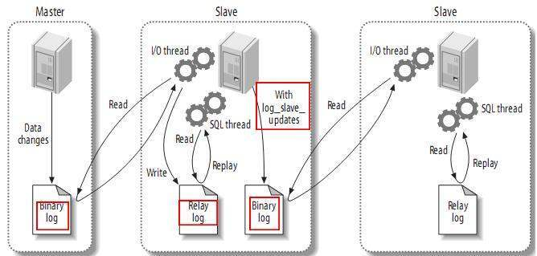
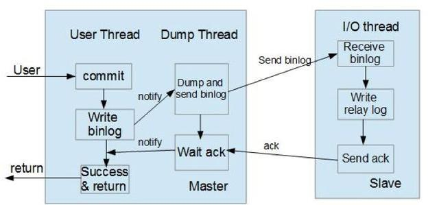
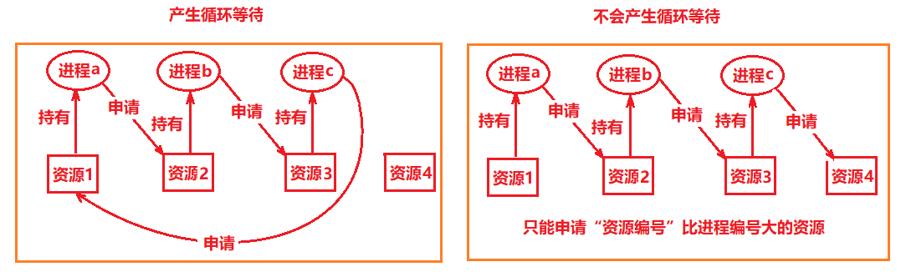
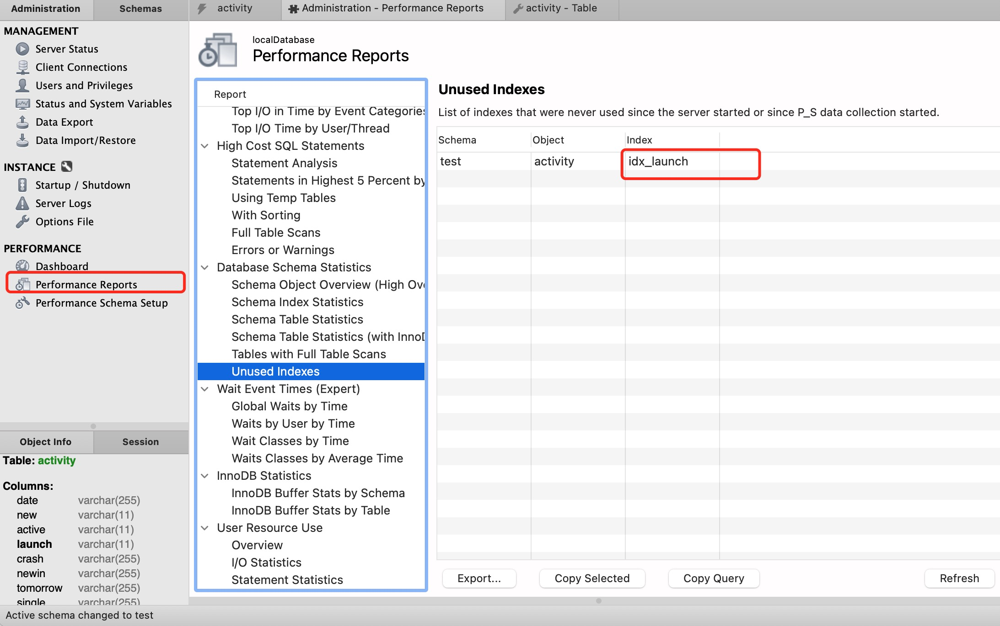
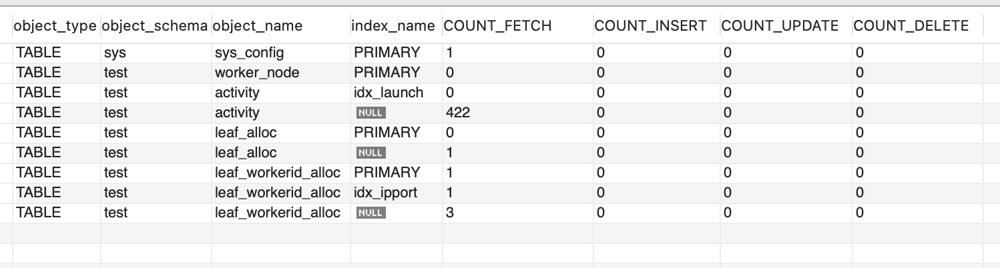

(PS：扫描首页里面的二维码进群，分享我自己在看的技术资料给大家，希望和大家一起学习进步！)

下面是主要是自己看了《高性能MySQL》及一些博客后，找了一些MySQL相关的面试题，通过翻书，查资料写的解答，之后会继续更新和完善这一部分内容。

#### [1.一条MySQL更新语句的执行过程是什么样的？](#一条MySQL更新语句的执行过程是什么样的？)

#### [2.脏页是什么？](#脏页是什么？)

#### [3.Checkpoint是什么？](#Checkpoint是什么？)

#### [4.undo log，redo log，bin log是什么？](#undolog，redolog，binlog是什么？)
#### [5.MySQL中的事务是什么？](#MySQL中的事务是什么？)
#### [6.MySQL的隔离级别是怎么样的？](#MySQL的隔离级别是怎么样的？)
#### [7.MVCC的实现原理是怎么样的？](#MVCC的实现原理是怎么样的？)
#### [8.MySQL是怎么解决幻读的问题的？](#MySQL是怎么解决幻读的问题的？)
#### [9.MySQL中有哪些锁？](#MySQL中有哪些锁？)
#### [10.B树是什么？](#B树是什么？)
#### [11.B树与B+树的区别是什么？](#B树与B+树的区别是什么？)
#### [12.索引是什么？](#索引是什么？)
#### [13.字符串索引和数字类型索引的区别？](#字符串索引和数字类型索引的区别？)
#### [14.union和union all的区别是什么？](#union和unionall的区别是什么？)
#### [15.Join的工作流程是怎么样的，怎么进行优化？](#Join的工作流程是怎么样的，怎么进行优化？)
#### [16.聚集索引是什么？](#聚集索引是什么？)
#### [17.联合索引是什么？](#联合索引是什么？)
#### [18.覆盖索引是什么？](#覆盖索引是什么？)
#### [19.哪些情况不要建索引？](#哪些情况不要建索引？)
#### [20.主键，唯一性索引，普通索引的区别是什么？](#主键，唯一性索引，普通索引的区别是什么？)
#### [21.InnoDB和MyISAM的区别是什么？](#InnoDB和MyISAM的区别是什么？)
#### [22.什么是分库分表？](#什么是分库分表？)
#### [23.怎么实现跨库分页查询？](#怎么实现跨库分页查询？)
#### [24.MySQL主从复制的工作流程是什么样的？](#MySQL主从复制的工作流程是什么样的？)
#### [25.char类型与varchar类型的区别？](#char类型与varchar类型的区别)
#### [26.查询数量SELECT Count(*)怎么优化？](#怎么优化数量查询？)
#### [27.如何优化MySQL慢查询？](#如何优化MySQL慢查询？)
#### [28.MySQL的join的实现是怎么样的？](#MySQL的join的实现是怎么样的？)

### 一条MySQL更新语句的执行过程是什么样的？



#### 1.连接验证及解析

客户端与MySQL Server建立连接，发送语句给MySQL Server，接收到后如果是查询语句会先去查询缓存中看，有的话就直接返回了，（新版本的MySQL已经废除了查询缓存，命中率太低了），如果是缓存没有或者是非查询语句，会创建一个解析树，然后进行优化，（解析器知道语句是要执行什么，会评估使用各种索引的代价，然后去使用索引，以及调节表的连接顺序）然后调用innodb引擎的接口来执行语句。

#### 2.写undo log

innodb 引擎首先开启事务，获得一个事务ID(是一直递增的)，根据执行的语句生成一个反向的语句，(如果是INSERT会生成一条DELETE语句，如果UPDATE语句就会生成一个UPDATE成旧数据的语句)，用于提交失败后回滚，将这条反向语句写入undo log，得到回滚指针，并且更新这个数据行的回滚指针和事务id。（事务提交后，Undo log并不能立马被删除，而是放入待清理的链表，由purge 线程判断是否有其他事务在使用undo 段中表的上一个事务之前的版本信息，决定是否可以清理undo log的日志空间，简单的说就是看之前的事务是否提交成功，这个事务及之前的事务都提交成功了，这部分undo log才能删除。）

#### 3.从索引中查找数据

根据索引去B+树中找到这一行数据（如果是普通索引，查到不符合条件的索引，会把所有数据查找出来，唯一性索引查到第一个数据就可以了）

#### 4.更新数据

判断数据页是否在内存中？

#### 4.1数据页在内存中

索引是普通索引还是唯一性索引？

##### 4.1.1普通索引

直接更新内存中的数据页

##### 4.1.2唯一性索引

判断更新后是否会数据冲突(不能破坏索引的唯一性)，不会的话就更新内存中的数据页。

#### 4.2 数据页不在内存中

索引是普通索引还是唯一性索引？

##### 4.2.1普通索引

将对数据页的更新操作记录到change buffer，暂时不更新到磁盘。change buffer会在空闲时异步更新到磁盘。

##### 4.2.2 唯一性索引

因为需要保证更新后的唯一性，所以不能延迟更新，必须把数据页从磁盘加载到内存，然后判断更新后是否会数据冲突，不会的话就更新数据页。

#### 5.写redo log（prepare状态）

将对数据页的更改写入到redo log，此时redo log中这条事务的状态为prepare状态。

#### 6.写bin log（同时将redo log设置为commit状态）

通知MySQL server已经更新操作写入到redo log 了，随时可以提交，将执行的SQL写入到bin log日志，将redo log 中这条事务的状态改成commit状态，事务提交成功。

https://www.cnblogs.com/yuyue2014/p/6121114.html

##### undo log

主要是保证事务的原子性，事务执行失败就回滚，用于在事务执行失败后，对数据回滚。

是逻辑日志，记录的是SQL语句。

在事务提交后，undo log日志不会立即删除，会放到一个待删除的链表中，有purge线程判断是否有其他事务在使用上一个事务之前的版本信息，然后决定是否可以清理，简单的来说就是前面的事务都提交成功了，这些undo才能删除。

##### change buffer是什么？

（change buffer就是将更新数据页的操作缓存下来）

在更新数据时，如果数据行所在的数据页在内存中，直接更新内存中的数据页。

如果不在内存中，为了减少磁盘IO的次数，innodb会将这些更新操作缓存在change buffer中，在下一次查询时需要访问这个数据页时，在执行change buffer中的操作对数据页进行更新。（或者是在MySQL Server空闲时，会将change buffer中所有操作更新到磁盘，也就是俗称的‘刷页’。）

适合写多读少的场景，因为这样即便立即写了，也不太可能会被访问到，延迟更新可以减少磁盘I/O，只有普通索引会用到，因为唯一性索引，在更新时就需要判断唯一性，所以没有必要。

##### redo log

就是为了保证事务的持久性，在做数据更新操作时，先将对数据页的更改记录到redo log，然后再去更新内存中的数据页，在下次查询数据页或者空闲时间，将操作记录更新到磁盘。这样可以将随机I/O改为顺序I/O。

优点是减少磁盘I/O次数，即便发生故障也可以根据redo log来将数据恢复到最新状态。

缺点是会造成内存脏页，后台线程会自动对脏页刷盘，或者是淘汰数据页时刷盘，此时会暂时查询操作，影响查询。

##### 二段提交制是什么？

更新时，先改内存中的数据页，将更新操作写入redo log日志，此时redo log进入prepare状态，然后通知MySQL Server执行完了，随时可以提交，MySQL Server将更新的SQL写入bin log，然后调用innodb接口将redo log设置为提交状态，更新完成。

如果只是写了bin log就提交，那么忽然发生故障，主节点可以根据redo log恢复数据到最新，但是主从同步时会丢掉这部分更新的数据。

如果只是写binlog，然后写redo log，如果忽然发生故障，主节点根据redo log恢复数据时就会丢掉这部分数据。

##### 崩溃恢复时的判断规则（以redolog是否commit或者binlog是否完整来确定）

1. 如果 redo log 里面的事务是完整的，也就是已经有了 commit 标识，则直接提交；
2. 如果 redo log 里面的事务只有完整的 prepare，则判断对应的事务 binlog 是否存在并完整：
a. 如果是，则提交事务；
b. 否则，回滚事务。

参考资料：

https://gsmtoday.github.io/2019/02/08/how-update-executes-in-mysql/

https://www.infoq.cn/article/M6g1yjZqK6HiTIl_9bex


### 脏页是什么？

就是内存数据页与磁盘内存页的内容不一致时的内存页叫做脏页。内存页数据写入磁盘后，数据一致了，就是干净页了。(其实就是将Change Buffer中缓存的更新写入到磁盘)

刷脏页的场景：

1.redo log 写满了，系统会停止所有更新操作，将checkpoint向前推进，将推进这部分日志的脏页更新到磁盘。

2.系统内存不够，需要将一部分数据页淘汰，如果是干净页，直接淘汰就行了，脏页的话，需要全部同步到磁盘。

3.MySQL自认为空闲时去刷脏页。

4.MySQL正常关闭之前，会将脏页刷入磁盘。

### Checkpoint是什么？

就是系统故障后，根据redo来恢复数据时，不需要重做所有日志，只需要重做checkpoint点之后的日志，因为redo log也不能无限大，所以当redo log空间不足时，redo log中那部分被更新到磁盘的日志可以覆盖重用。

1、缩短数据库的恢复时间；

2、缓冲池不够用时，将脏页刷新到磁盘；

3、重做日志空间不足时，刷新脏页。


### undolog，redolog，binlog是什么？
##### undo log 是什么？

undo log是一种逻辑日志，是旧数据的备份。有两个作用用于事务回滚和MVCC。

执行一条INSERT语句时，会记录一条相反的DELETE语句到日志，执行一条UPDATE语句时，会记录一条相反的UPDATE语句到日志中。

##### redo log是什么？

redo log用于保证数据的持久性。redo log记录的是数据页的物理变化，是物理日志，是新数据的备份，在事务提交前，将redo log 持久化就行，不需要将数据持久化，系统崩溃时，可以根据redo log将数据恢复到最新状态。

redo log只做顺序追加操作，当事务需要回滚时，在redo log中也不会删除之前的事务记录。

默认是每次事务提交时必须调用fsync操作将redo缓冲区的内容写入磁盘。

例如：将A=1修改为A=2，它的流程如下：

1.事务开始

2.将原始数据A=1从磁盘读取到内存，生成反向语句，写入undolog。

3.修改A=2，

4.生成一条redo log 写入到redo log 缓冲区

5.调用fsync操作将redo log 缓冲区的内容写入到磁盘，写入binlog

6.事务提交。

##### Bin log 是什么？

保存的是逻辑日志，主要是存储每一条会修改数据的SQL。

https://blog.csdn.net/qq_41652863/article/details/98800650


### MySQL中的事务是什么？

由一系列数据库操作组成的逻辑过程，可以是一个SQL查询，也可以是一组SQL查询。

具备四个特性，也就是acid。

**原子性(Atomic)**：一个事务就是最小的工作单元，要么执行成功提交，要么执行失败回滚。

**一致性(Consistence)**：就是事务的执行不会影响数据库的完整性，保证事务只能把数据库从一个有效（正确）的状态“转移”到另一个有效（正确）的状态，不能执行完一个事务后，使得数据库不符合数据库定义的规则，例如让某个有唯一性约束的字段存在两个相同的值，破坏了唯一性。

**隔离性(isolation)**：就是事务在执行过程中，两个事务之间是隔离的，事务在执行成功之前，所做的修改对其他事务是不可见的。

**持久性(durability)**：事务执行成功后，对数据的修改是永久的，即便发生故障重启也不会丢失数据。

### MySQL的隔离级别是怎么样的？

##### 未提交读

事务还没有提交的修改，其他事务都可以读取到。可能会有脏读的问题，就是读到一些未提交的脏数据。

##### 提交读

其他事务提交的修改，事务在执行过程中可以读取到，如果一个事务在执行过程中需要两次读取同一行数据，可能会不一致。一般发生在UPDATE和DELETE操作。（大部分数据库系统是采用的这个，但是mysql不是）

这个隔离级别下，读是不加锁的，写，更新，删除是加锁的，如果更新的行是可以通过索引查找到，那么是对这些行加行锁，否则会将所有行都加锁，然后返回给MySQL Server，让他来进行过滤，对于不满足条件的行解锁。

但是还是会有幻读的问题发生(幻读就是事务A在读取和写入符合的条件的记录时，其他事务又插入了一条符合条件的记录，此时事务A二次读取时会产生幻行，一般发生在INSERT操作。)

##### 可重复读

在事务开始时，记录当时的状态，在第二次读取同一行数据时，除非是本事务做的修改，否则读取的都是事务开始时的数据。可以解决脏读的问题，没法解决幻读的问题。这是MySQL的默认事务隔离级别。（MySQL在可重复读的隔离级别下，通过MVCC机制和Next-key Lock解决了幻读的问题。）

##### 可串行化

强制事务串行执行，会让读取每一行都加锁，读用读锁，写用写锁，读写锁互斥，可以解决幻读的问题。并发比较多的话可能会造成大量的超时等待和锁竞争。如果业务并发的特别少或者没有并发，同时又要求数据及时可靠的话

### MVCC的实现原理是怎么样的？

mvcc主要适用于可重复读，可以解决幻读的问题。

innodb在解决幻读的问题主要是通MVVC 多版本并发版本控制来实现的。

就是每一行数据中额外保存两个隐藏的列：

**插入或上次更新该行的事务ID**(删除也被认为是一次更新，只不过在代表删除的更新操作中，行中的特殊位被设置为将其标记为已删除。这个事务ID可以认为是数据行的修改版本号。)

**回滚指针**(指向undo log中用于事务回滚的日志记录)。

具体流程：

##### 1.插入操作

每次开始事务时，会对系统版本号+1作为当前事务的版本号。

插入数据后，将事务的版本号作为数据行的创建版本号。

##### 2.删除操作

在使用SQL语句删除行时，并不会立即将其从数据库中物理删除，只会将其标记为删除，并且修改更新该行的事务ID。（`InnoDB`只会在丢弃为删除而编写的undo log日志记录时，才物理删除相应的行及其索引记录。此删除操作称为[purge](https://dev.mysql.com/doc/refman/5.7/en/glossary.html#glos_purge)，它非常快，通常花费与执行删除操作的SQL语句相同的时间顺序。）

##### 4.或更新操作

将当前的事务版本号作为数据行的更新版本号。

##### 5.查询操作

数据行要被查询出来必须满足两个条件，

数据行没有标记为删除或者标记为删除但是删除的事务ID>当前事务ID的数据（否则数据已经被标记删除了)

更新事务ID<=当前事务ID的数据（否则数据是后面的事务创建出来的，或者是被修改过的，那么需要去undo log中找上次的快照数据。）

如果查询时，该行数据被加了X锁，那么读数据的事务不会进行等待，而是会根据该行数据中的回滚指针undo log日志中读之前版本的数据（这里存储的数据本身是用于回滚的），在可重复读的隔离级别下，从undo log中读取的数据总是事务开始时的快照数据(也就是版本号小于当前事务id的数据)，在提交读的隔离级别下，从undo log中读取的总是最新的快照数据。

参考文档：

https://dev.mysql.com/doc/refman/5.7/en/innodb-multi-versioning.html

https://blog.csdn.net/qq_41652863/article/details/98800650

### MySQL是怎么解决幻读的问题的？

幻读就是事务执行过程中，在查询一个范围的数据时，有新的数据插入到这个范围，导致两次查询的数据不一致。因为读分为快照读和实时读，

**快照读**

我们普通的SELECT语句都是普通读，也就是读取的数据都是事务开始时那个状态的数据，普通读的幻读问题主要是通过MVCC来解决的，具体可以看上面的MVCC中的查询操作。

**实时读**

SELECT *** FOR UPDATE 在查询时会先申请X锁

SELECT *** IN SHARE MODE 在查询时会先申请S锁

就是实时读，就是读取的是实时的数据，而不快照数据，读的时候会加Next-Key Lock锁住当前的记录，以及左右两个区间的间隙，这样在读的时候就不能往我们的查询范围插入数据了。


### MySQL中有哪些锁？

#### 全局锁

就是对整个数据库加锁，让整个数据库处于只读状态，所有更新操作停止。（如果是主库就不能执行更新语句，从库也不能执行同步过来的bin log）

最常用的场景是对数据库加锁，让数据库只能读，然后对整个数据库做逻辑备份（就是将所有数据生成SQL写入备份文件。）

做逻辑备份有三种方式：

##### 1.全局锁

对数据库执行

`Flush tables with read lock`命令让整个库处于只读状态。

##### 2.利用innodb的事务隔离性（可重复读）

就是通过官方自带的逻辑备份工具mysqldump来进行逻辑备份时，可以设置一个参数-single-transaction，这样导数据的时候就会开启一个事务，这样利用innodb的mvcc机制可以保证在事务执行过程中，读到的数据都跟事务开始时的一致，并且执行过程中，其他事务可以执行更新操作， 不会对他造成影响。这种方法必须要求数据库所有表的引擎都是innodb才行。

##### 3.set global readonly=true

执行这个命令也可以让全库只能读，但是第一有些系统会使用readonly来做一个操作，例如根据readonly是否为true判断数据库是否是从库，第二是如果执行这个命令后，客户端断开连接后，数据库会一直处于只读状态，如果是FTWRL命令发送异常会释放全局锁。（如果是从库，设置read-only对super user权限无效）

### 表级锁
表级别的锁有两种，一种是表锁，一种是元数据锁MDL。
##### 表锁 lock table

就是使用lock table user_table read/write命令来对表进行加读锁或者写锁
加读锁后，表对所有线程都是只能读，即便是当前线程也只能读表，不然会数据不一致。
加写锁后，表是对当前线程写，其他线程不能读，不然会数据不一致。
可以通过unlock tables来解锁，客户端断开时也会自动释放锁，但是影响所有线程，影响面太大了。

##### 元数据锁MDL(MetaData Lock)

分为读锁和写锁，加读锁时，所有的线程都可以读表，加写锁时，只能一个线程写，其他的不能读。
锁不用显式使用，是访问一个表时，自动加上的。
对表执行普通SQL语句对表数据进行增删改查时，会加读锁。
对表结构做修改时，会加写锁。

元数据锁是为了修改表结构不会出现问题而设计的，因为一边修改表结构一边读数据可能会读到脏数据，所以在增删改查时会申请读锁，在这个期间不能修改表结构，要修改表结构需要先申请写锁，申请成功后对表结构进行修改，在这个期间不能进行增删改查。

##### 自增锁

插入语句主要分为两种：
1.能确定插入行数的，例如插入一条或者多条数据，INSERT...
2.不能确定行数的，例如从一个表查询出满足条件的数据，然后插入另外一个表，INSERT...SELECT

在所有模式中，如果一个事务回滚，这些自增值将被“丢失”。

innodb_autoinc_lock_mode为0
这种是tradition模式，每次执行一条插入语句时都会去申请表级别的auto_increment锁

innodb_autoinc_lock_mode为1
这种是consecutive模式，执行不确定数量的插入语句时，才会去申请表级别的auto_increment锁，
执行确定数量的插入语句时，只需要执行前去获取 AUTO_INCREMENT 计数器的互斥锁并在获取主键后直接释放，
不需要等待当前语句执行完成。

innodb_autoinc_lock_mode为2
交叉模式 所有的插入语句都不需要获取表级别的 AUTO_INCREMENT 锁，
如果binlog_format为statement模式，如果从服务器上的计数器的值可能会与主服务器不一致，
可能会有同一行数据在主从数据库上id不一样的情况，如果binlog_format为row模式，那么就不影响。


##### 意向锁

意向锁定的主要目的是表明有人正在锁定表中的行，或者打算锁定表中的行。意向锁的作用主要在于，当一个事务去申请表级别的排斥锁X，共享锁S时，需要去判断是否有其他事务在修改数据行，或者让数据行处于只读状态。假如没有意向锁，可能需要查询每一行数据，判断是否加了行锁。而如果有意向锁的情况下，可以快速进行判断，只需要判断当前表是否有加意向锁就可以了，减小了性能开销。

**意向共享锁（IS锁）**

事务让一行数据只能读，需要申请对这行数据加行级别的锁共享锁S，在申请S锁之前会主动申请表级别的共享意向锁IS锁。

**意向排斥锁(IX锁)**

事务在更新某一行数据时，需要申请对这行数据加行级别的锁排斥锁X，在申请X锁之前会申请IX

意向锁之间是兼容的，IS锁和IX是兼容，因为可能我们对第一行数据加S锁，那么会申请IS锁，对第二行数据加X锁，此时跟第一行的数据的S锁不冲突，所以也会先申请IX锁，由此可见，IS锁和IX之间不冲突，IS锁，IX锁与行级别的S，行级别的X之间也不冲突。


意向锁只是跟表级别的S，X锁可能会冲突，

场景1：假设一个事务要加表级别的S锁，让整个表只能被读。那么如果当前有意向锁IX，说明有其他事务在改数据，那么不能加，只能进行等待，等事务改完是否意向锁IX。

场景2：假设当前事务要加表级别的S锁时，让整个表只能被读。只有IS意向锁，没有IX锁，说明只是有其他事务在让数据只能被读取，不能被修改，那么加表级别S锁，也不会其他事务造成影响。

场景3：假设当前事务要加表级别的X锁时，让整个表只能被这个事务写，不能被其他事务读。如果现在有其他事务加了意向读锁IS，说明有其他事务在让一些数据行只能被读，或者是一些写锁IX，说明其他事务让一些数据行正在被修改。那么当前要加表级别的X锁就不行，会跟其他事务冲突，只能等其他事务执行完毕才能申请成功。

|            | 表级别的S锁 | 表级别的X锁 |
| ---------- | ----------- | ----------- |
| 意向读锁IS | 兼容        | 不兼容      |
| 意向写锁IX | 不兼容      | 不兼容      |

##### 那么意向锁的作用是什么呢？

假如没有意向锁，我们执行lock table read命令来申请表锁，让整个表只能读，在获得表级别的只读锁之前，需要执行的步骤是：

1.数据库会先判断当前表是否加了表级别的排斥锁，因为这个时候要是加了排斥锁，是只能由加了那个排斥锁的事务来更新数据，其他事务都不能读数据，只能阻塞等待。

2.如果当前表没有加表级别的排斥锁，那么就需要对每一行数据进行判断，判断是否加了行级别的X锁，如果加了只能阻塞等待，这样需要对一行进行判断，性能开销太大了。

所以才有了意向锁，在获得表级别的只读锁之前，需要执行的步骤是：

1.第一步还是跟上面的步骤一一样

2.第二步只需要判断当前锁是否加了表级别的意向排斥锁，因为如果加了意向排斥锁，说明正在有事务在对数据加行锁，对数据进行更新，这样避免了对每一行数据进行判断，判断是否加了行锁。

#### Innodb的锁

##### 行锁

* 共享锁 S锁，就是读锁，允许事务读一行数据，不能被修改。所以读锁之间不排斥

* 互斥锁 X锁，就是写锁，就是让当前事务可以修改这行数据，其他事务不能修改这行数据

##### 记录锁 record lock

 记录锁定是对单条索引记录的锁定。例如， `SELECT c1 FROM t WHERE c1 = 10 FOR UPDATE;` 可以防止从插入，更新或删除行。

##### 间隙锁 gap lock

间隙锁就会对记录之间的间隙加锁，防止数据插入。就是我们在使用实时读(SELECT  FOR … UPDATE)或者更新，为了防止读的过程中有新的数据插入，会对我们读的数据的左右区间进行加锁，防止其他事务插入数据，所以间隙锁之间是不排斥的，间隙锁排斥的只是插入数据的操作。

##### 下一键锁 next-key lock

 next-key lock就是会锁记录以及记录之间的间隙，就是 record lock 和 gap lock的组合，就是会对索引记录加记录锁 + 索引记录前面间隙上的锁”，就是对要更新的数据的左右两个端点加间隙锁，

例如num是一个普通索引，非唯一性索引，已有数据是1，5，10，20，30

那么 next-key lock可以锁定的区间是
```java

(负无穷,1]

(1,5]

(5,10]

(10,20]

(20,30]

(30,正无穷)
```

```java
//更新操作
update table set note = '1' where num = 10;
//或者是使用实时读
SELECT * FROM table WHERE num = 10 for UPDATE;
```

如果num是唯一性索引，那么只需要对num为10的这条索引加锁就行了（就加一个Record lock锁），因为不用担心其他事务再插入一条num为10的数据，因为会有唯一性判断。但是如果num是非唯一性索引，为了防止事务执行过程中有num为10的数据插入，那么会对（5，10]和（10，20]这两个区间加锁。

#### B树是什么？



平衡二叉树就是每个节点左右子树的高度差小于等于1，B树其实是一个平衡多路查找树，假设是M阶的，

1.根节点至少有一个关键字。(这里的关键字可以理解为每个节点的子节点)

2.非根非页节点的关键字数是  需要<=m-1并且>ceil(m/2)-1。

3.节点内的元素从左到右递增，左边节点的所有元素值<右边节点的所有元素值。

4.叶子节点在同一层，高度一致。

跟二叉树相比，因为每个节点关键字会多很多，所以相同的关键字数时，层级会少很多，会减少查找时间和复杂度。

https://segmentfault.com/a/1190000020416577

https://blog.csdn.net/chai471793/article/details/99563704

### B树与B+树的区别是什么？

B+树是为磁盘存储专门设计的一M阶多路平衡查找树(阶数可以理解为每个节点最多的孩子节点的个数，二叉树就是2阶)，所有记录节点都是按照从小到大顺序存放在最后一层的叶子节点上，由各叶子节点的指针相连接。可以认为一个叶子节点就是一个内存页(默认情况下，一个内存页大小为16K)，每个内存页里面存储多个数据行，内存页直接通过指针连接，形成一个**双向链表**，所以叶子节点在**逻辑上是连续的**，在**物理上不是连续存储的**，就是每个叶子节点可以存储在不同地址上，通过指针相互连接。每个非叶子节点(也就是索引节点)也是一个内存页，里面存储了很多索引节点的值，但是B+树索引节点只存索引值，不存数据行的数据，这样可以让每个索引内存页存储更多的索引值，这样可以使得B+树的层数更少（这也是B+树比B树更优的地方）。B+树在数据库的中实现一般是只有2到4层，机械磁盘一般1秒可以进行100次IO，也意味着每次在B+树中的查询操作可以在20ms到40ms之间完成。


1.B树每个节点会保存关键字，索引和数据。而B+树只有叶子节点保存数据，其他节点只保存关键字和索引。所以相同的内存空间可以容纳更多的索引节点。

2.B+树的所有数据都存在叶子节点上，所以查询会更加稳定，而且相邻的叶子节点都是连接在一起的，更加适合区间查找和搜索。

##### B+树与二叉树区别是什么？为什么不用红黑树？

红黑树是一个平衡的二叉查找树。有以下几个性质：

1.根节点和叶子节点都是黑色的（这里的叶子节点指的是普通的节点增加的一个黑色的空节点）。

2.红色节点的子节点必须是黑色的，也就是不能有两个红色节点连续。

3.黑色的节点可以连续，但是从根节点到叶子节点的所有路径包含的黑色节点的个数是一致的。(所以**根节点到叶子节点的最长路径<=最短路径的两倍**)

红黑树是二叉查找树（也就是每个节点的左子树<当前节点的值，右子树所有节点>=当前节点值），但不是严格意义上的平衡二叉树，因为平衡二叉树要求任何节点的左右子树高度差是<=1，红黑树根节点到叶子节点的最长路径会<=最短路径的两倍,所有他是大致意义上的平衡树。

相比于AV树（也就是自平衡的二叉查找树，左右子树高度差不超过1），红黑树插入，删除效率更高。因为不需要保证绝对的平衡，任何不平衡需要的旋转次数不超过3次，即便在最坏的情况下，红黑树能够以O(log(N))的时间复杂度进行搜索、插入、删除操作。

##### 与红黑树的比较

红黑树等平衡树也可以用来实现索引，但是文件系统及数据库系统普遍采用 B+ Tree 作为索引结构，主要有以下两个原因：

（一）更少的查找次数

平衡树查找操作的时间复杂度和树高 h 相关，O(h)=O(logdN)，其中 d 为每个节点的出度。

红黑树的出度为 2，而 B+ Tree 的出度一般都非常大，所以红黑树的树高 h 很明显比 B+ Tree 大非常多，查找的次数也就更多。

（二）利用磁盘预读特性

为了减少磁盘 I/O 操作，磁盘往往不是严格按需读取，而是每次都会预读。而B+数中存储的叶子节点在内存中是相邻的，这样可以读取会快一些。

（三）存储更多的索引节点

B+树跟B树的区别就是B+是叶子节点存储数据，非叶子节点(也就是索引节点)只存储索引项，B树是所有节点都存储数据，而每个节点都是磁盘的一个内存页，内存页大小是固定，B+树的每个索引节点可以容纳的索引值更多，与B树相比，B+树的层数更少。

### 索引是什么？

索引可以让服务器快速定位到表的指定位置。

优点是

1.大大减少了服务器需要扫描的数据量。

2.帮助服务器避免排序带来的性能开销。

3.将随机IO变成顺序IO。

### 字符串索引和数字类型索引的区别？

因为字符串索引在索引树上两个节点比较会比较慢，数字类型的索引会快一些，

如果非要用字符串索引可以采用以下解决方法。

1.对字符串的前n个字符建立前缀索引，前缀索引不能使用order by。

2.增加一列，对字符串转换为整型的hash值address_key=hashToInt(address)，对address_key建立索引，查询时同时限定hash值也限定地址。可以用如下查询where address_key = hashToInt(‘beijing,china’) and address = ‘beijing,china’;

效率的话，100万的数据量，字符串索引查询600ms，数字查询20ms。

### union和unionall的区别是什么？

union就是将两个SELECT语句查询的结果集合并(两个SELECT可以是同一个表，也可以是不同表)，如果需要排序，在第二个SELECT语句后加ORDER BY语句，会对所有结果进行排序。

union默认是会去除重复的数据的，会对结果集做去重处理，union all不会做去重处理。

所以union效率慢一些，如果能确定结果不会重复或者需要不去重的结果，那么应该使用union all，效率会高一些。


### 不设置MySQL主键会怎么样？

如果没有设置主键，innodb会选择第一个非空唯一索引作为聚集索引。

如果没有设置主键，也没有合适的唯一索引，那么会生成一个隐藏的id作为索引的主键，这个值会随着插入而自增。

主键如果是自增的，那么插入数据的位置是已知的，而且不用移动已有数据。如果是非自增的，首先需要查找到要插入的位置，近似于随机查找，然后将后面的数据向后移动。

### 聚集索引是什么？

聚集索引与非聚集索引的最主要的区别是：叶节点是否存放一整行记录

##### innodb的聚集索引

innodb的索引是聚集索引，就是所有数据都存在聚集索引的的叶子节点中，其他二级索引的的叶子节点值存储KEY字段加对应列的主键值，如果使用二级索引查找数据，先根据索引查到二级索引对应的行的主键id，然后根据主键id去聚集索引中查找对应的行的数据。（所以innodb必须要有主键）。

聚集索引示意图一：

聚集索引是依据B+树来实现的，索引节点(也就是非叶子节点)只存储索引值，叶子节点才会存具体的数据行，每个索引节点都是一个内存页(由于只存索引值，相比B树，B+树的每个索引节点的内存页可以存储更多的索引值)，每个叶子节点也都是一个内存页，内存页里面数据行按主键id从小到大的顺序存储，然后叶子节点之间是通过指针连接的，形成一个双向链表。所以聚集索引的叶子节点在逻辑上是存储在一起的，在物理上是并不是连续的，而是通过双向链表连接的。假设说叶子节点在物理上的存储也是连续，那么如果中间的叶子节点中大量插入数据行，导致叶子节点的内存页容量不够时，需要后面的叶子节点全部后移，这样维护成本会很高。如果叶子节点只是通过双向链表进行连接，当中间的叶子节点容量不够时，可以新增一个内存页，插入在其中，作为一个叶子节点，只需要修改双向链表中的指针即可。


聚集索引示意图二：





1.对于**聚集索引表**来说（左图），表数据是和主键一起存储的，主键索引的叶结点存储行数据(包含了主键值)，其他列，事务ID，回滚指针，二级索引的叶结点存储行的主键值。使用的是B+树作为索引的存储结构，非叶子节点都是索引关键字，但非叶子节点中的关键字中不存储对应记录的具体内容或内容地址。叶子节点上的数据是主键与具体记录(数据内容)。

2.对于**MyISAM的非聚集索引表**来说（右图），表数据和索引是分成两部分存储的，主键索引和二级索引存储上没有任何区别。使用的是B+树作为索引的存储结构，所有的节点都是索引，叶子节点存储的是索引+指向索引对应的记录的数据的指针。

##### 聚集索引的优点

1.当你需要取出一定范围内的数据时，用聚集索引也比用非聚集索引好。

2.当通过聚集索引查找目标数据时理论上比非聚集索引要快，因为非聚集索引定位到对应主键时还要多一次目标记录寻址,即多一次I/O。

3.使用覆盖索引扫描的查询可以直接使用页节点中的主键值。

##### 聚集索引的缺点

1.**随机插入容易造成页分裂**，按照主键的顺序插入是最快的方式，否则将会出现页分裂(就是存储数据行的内存页容量不够，需要新申请一个内存页分担一部分数据行)，影响性能。因此，对于InnoDB表，我们一般都会定义一个自增的ID列为主键。

2.**更新主键的代价很高，因为将会导致被更新的行移动**。因此，对于InnoDB表，我们一般定义主键为不可更新。

3.**二级索引访问需要两次索引查找，第一次找到主键值，第二次根据主键值找到行数据。**

二级索引的叶节点存储的是主键值，而不是行指针（非聚集索引存储的是指针或者说是地址），这是为了减少当出现行移动或数据页分裂时二级索引的维护工作，但会让二级索引占用更多的空间。

4.**采用聚集索引插入新值比采用非聚集索引插入新值的速度要慢很多**，因为插入要保证主键不能重复，判断主键不能重复，采用的方式在不同的索引下面会有很大的性能差距，聚集索引遍历所有的叶子节点，非聚集索引也判断所有的叶子节点，但是聚集索引的叶子节点除了带有主键还有记录值，记录的大小往往比主键要大的多。这样就会导致聚集索引在判定新记录携带的主键是否重复时进行昂贵的I/O代价。

### 联合索引是什么？

联合索引就是多列索引，就是可以多个字段建立一个索引，并且是最左前缀匹配元素，

```
create index a_b_c on user(a,b,c)
这样相当于是创建三个索引
a
a,b
a,b,c
```

就是在非聚集索引对应的B+树中，索引的排序是先比较a的大小，再比较b的大小然后再比较c的大小。并且是遇到范围比较时就会停止匹配。

1. 最左前缀匹配原则，MySQL会一直向右匹配直到遇到范围查询（>、<、between、like）就停止匹配，比如 a="3" and="" b="4" c="">5 and d=6,如果建立(a,b,c,d)顺序的索引，d是无法使用索引的，如果建立(a,b,d,c)的索引则都可以使用到，a、b、d的顺序可以任意调整。
2. =和in可以乱序，比如 a=1 and b=2 and c=3 建立(a,b,c)索引可以任意顺序，MySQL的查询优化器会帮你优化成索引可以识别的形式。

例如：

```
select * from user where a > 1;
SELECT * FROM user WHERE a='2222' OR b='13281899972'//这个就不会走联合索引，因为只是查询b时不能根究索引查询，所以还是需要全表扫描，所以干脆a也不用索引了。
如果a，b都有索引，那么会单独根据a，b来查询，然后将结果集合并
关于or查询的真相是：
所谓的索引失效指的是：假如or连接的俩个查询条件字段中有一个没有索引的话,引擎会放弃索引而产生全表扫描。
```

这样的语句可以走联合索引，但是不会走联合索引，因为符号这个范围的数据很多，查出之后，只能获得这些数据的主键，还需要根据主键去聚集索引中查，效率比较低，还不如直接全部扫描，所以直接去聚集索引下顺序得对全表进行扫描。

```sql
SELECT * FROM user WHERE age=1 and height = 2

SELECT * FROM user WHERE age=1 and weight=7

SELECT * FROM user WHERE weight=7 and age=1
```

这些是可以走联合索引的，

```sql
SELECT * FROM user WEHRE age=1 and height>2 and weight=7
```

这个也会走联合索引，查出age=1的索引，然后查出height>2的所有数据，因为height是一个范围查找，所以到weight就不会用索引，会将将这些数据载入内存，根据weight进行筛选。

##### 索引没有被采用？

1、根据搜索条件，找出所有可能使用的索引
2、计算全表扫描的代价
3、计算使用不同索引执行查询的代价
4、对比各种执行方案的代价，找出成本最低的那一个 。

### 覆盖索引是什么？
就是假如有一个联合索引(a,b,c)，如果我们只是需要a,b,c这几个字段的数据，查询时就不需要根据主键id去聚集索引里面回表查询了。

```SQL
SELECT a,b,c FROM user where a = 1
```

哪些情况需要建索引：
1. 主键，唯一索引
2. 经常用作查询条件的字段需要创建索引
3. 经常需要排序、分组和统计的字段需要建立索引
4. 查询中与其他表关联的字段，外键关系建立索引

### 哪些情况不要建索引？

1. 表的记录太少，百万级以下的数据不需要创建索引

2. 经常增删改的表不需要创建索引

3. 数据重复且分布平均的字段不需要创建索引，如 true,false 之类。

4. 频发更新的字段不适合创建索引

5. where条件里用不到的字段不需要创建索引

### 主键，唯一性索引，普通索引的区别是什么？

一个表中可以有多个唯一性索引，但只能有一个主键。

1.在查询时，如果是使用的是主键，或者是唯一性索引查询，查到后就返回了，普通索引还会继续向后遍历，直到第一个不满足条件的才会返回，普通索引会多检索几次。几乎没有什么影响。

2.更新时普通索引需要判断唯一性。

3.主键是聚集索引，普通所以是非聚集索引。

### InnoDB和MyISAM的区别是什么？
##### InnoDB

是 MySQL 默认的事务型存储引擎，只有在需要它不支持的特性时，才考虑使用其它存储引擎。

实现了四个标准的隔离级别，默认级别是可重复读（REPEATABLE READ）。在可重复读隔离级别下，通过多版本并发控制（MVCC）+ Next-Key Locking 防止幻影读。

主索引是聚集索引，在索引中保存了数据，从而避免直接读取磁盘，因此对查询性能有很大的提升。其次是聚集索引每个叶子节点按照主键id从小到大顺序存储了大量数据行，而每个叶子节点在实现上是一个内存页，磁盘IO读取时是读取一个内存页，会进行一定的预读，所以在进行范围查找时，InnoDB引擎效率更高，而MyISAM则需要对查找范围内所有数据行进行随机读取。(每条数据都是存储在不同地址上)

内部做了很多优化，包括从磁盘读取数据时采用的可预测性读、能够加快读操作并且自动创建的自适应哈希索引、能够加速插入操作的插入缓冲区等。

支持真正的在线热备份。其它存储引擎不支持在线热备份，要获取一致性视图需要停止对所有表的写入，而在读写混合场景中，停止写入可能也意味着停止读取。

##### MyISAM

不支持事务，不支持行级锁，只能全表加锁，读取时会对所有表加共享锁，写入时会对表加排他锁。

### 什么是分库分表？

一般认为单表数据量在1000万时，查询效率是最合适的，如果超过1000万，执行性能就会下降，可以考虑分库分表。

##### 垂直切分

就是根据列进行分表，例如根据业务，来对表进行拆分成不同的表，或者根据使用频率，将常用的列分在一个表里面，将不常用的列分在一个表里面。

##### 水平切分 

将表根据行来进行分表，将一个表拆分成多个表结构相同的表。

第一种 一般是用主键ID对数据表的数量进行取模运算，得到的余数就是新表的位置。（如果是字段是字符串，那么就根据字符串计算出哈希值，然后除以表的数量，得到新库的位置）

第二种 根据时间来拆分，主表只存储最近两个月的数据，副表存储之前的数据。这种主要是适合哪种访问的数据跟时间相关性比较大的情况，例如统计，我有看某新闻网站他们的技介绍，他们的文章会有一个PV，UV统计表，就是每天大概有200万的文章有PV，UV，也就是数据库每天会新增200万行的数据，一般来说查文章近期的UV，PV会多一些，查昨日PV，一周PV，或者一个月的PV会多一些。所以是安装时间来划分热库和冷库，一月一个表，或者一天一表。

##### 问题 

1.事务问题，如果在事务里面操作一个表，然后再操作另外一个表，效率会比较低，然后也比较麻烦。

2.跨库join的问题

在拆分之前，系统中很多列表和详情页所需的数据是可以通过sql join来完成的。而拆分后，数据库可能是分布式在不同实例和不同的主机上，join将变得非常麻烦。而且基于架构规范，性能，安全性等方面考虑，一般是禁止跨库join的。那该怎么办呢？首先要考虑下垂直分库的设计问题，如果可以调整，那就优先调整。（就是尽量不要去分库）如果无法调整的情况，下面有几种解决方案：

1.全局表

所谓全局表，就是有可能系统中所有模块都可能会依赖到的一些表。比较类似我们理解的“数据字典”。为了避免跨库join查询，我们可以将这类表在其他每个数据库中均保存一份。同时，这类数据通常也很少发生修改（甚至几乎不会），所以也不用太担心“一致性”问题。

##### 分库分表具体实施

1.停机迁移法

2.迁移历史数据，新的更新发kafka消息

就是对updatet_time小于某个时间点的数据全部拷贝出来，迁移到新的数据库，同时项目在执行增删改相关的SQL时，同时往Kafka中发一份，迁移结束后，用订阅程序消费kafka消息，更新新库，消费完之后，然后校验一致性切数据库。

缺点就算侵入性太强了，所有更新数据库的业务项目都需要改动，然后给kafka发消息。

3.迁移历史数据，订阅bin log接受更新

还是先迁移数据，迁移完之后用订阅程序消费bin log消息，更新新库，消费完之后，然后校验一致性，切数据库。

### 怎么验数据一致性

这里大概介绍一下吧，这篇的篇幅太长了，大家心里有底就行。
(1)先验数量是否一致，因为验数量比较快。
至于验具体的字段，有两种方法:
(2.1)有一种方法是，只验关键性的几个字段是否一致。

随机取小批量数据，编码后比较。

(2.2)还有一种是 ，一次取50条(不一定50条，具体自己定，我只是举例),然后像拼字符串一样，拼在一起。用md5进行加密，得到一串数值。新库一样如法炮制，也得到一串数值，比较两串数值是否一致。如果一致，继续比较下50条数据。如果发现不一致，用二分法确定不一致的数据在0-25条，还是26条-50条。以此类推，找出不一致的数据，进行记录即可。


### 怎么实现跨库分页查询？

##### 全局视野法

就是例如要查询第三页的数据，那么把每个库里面前三页的数据都查询出来，然后排序，

优点是比较准确，也比较简单

问题就是每个库返回的页数很多，网络传输量很大，而且收到数据后的需要二次排序，排序的性能消耗也比较大。

```
要查order by time offset offset_value limit num时
对每个库查 order by time offset 0 limit offset_value + num然后进行排序
```

##### 最大时间法

就是禁止跳页查询，就是如果业务不需要跳页查询的话，一开始查第一页的时候，从每个库取一页数据回来进行排序后返回。

查第二页数据时根据第一页结果中最大的时间去每个库再取一页数据，然后进行排序得到第二页数据。

优点是是每次直插一页，传输数据量小，排序的数据量也小，

缺点是由于查第二页及以后的页数都需要知道上一页最大时间。

```java
要查order by time offset offset_value limit num时
获得上一页的最大时间
对每个库查 where time >lastTime order by time offset 0 limit num然后进行排序
```

##### 每库平均取法

假设数据分布足够平均，每个库的数据分布都是平均的，假设有四个库，查第一页数据时，每个库都取前0.25页数据，然后合并后返回，取第二页数据时，每个库再都取0.25页。但是这样取得是不准的数据。

```
将order by time offset X limit Y，改写成order by time offset X/N limit Y/N
```

##### 二次查询法

假如要取offset 为X，limitY的数据，

1.假设有四个库，需要去每个库查offset为X/4，limit为Y的数据，然后得到四个结果集，每个结果集的time都有一个时间最小的time_min，时间最大的time_max结果，取四个结果集中最小的time_min

2.然后去每个库去查between time_min到之前每个库的time_max的结果集，

3.因为之前每个库的time_max的offset都是X/4+Y，所以可以反推出time_min在每个库里的offset，然后得到全局offset，

4.然后根据全局offset可以计算我们想到的offset X后Y个数据，就是以time_min为起点到距离我们offset的差值。

关键在于两次查询中间，如果数据库删除过这个区间内的数据，time_min到time_max之间删除过数据，这样就不准，

```sql
（1）将order by time offset X limit Y，改写成order by time offset X/N limit Y

（2）找到最小值time_min

（3）between二次查询，order by time between time_min and time_i_max

（4）设置虚拟time_min，找到time_min在各个分库的offset，从而得到time_min在全局的offset

（5）得到了time_min在全局的offset，自然得到了全局的offset X limit Y
```

首先需要查询两次，而且如果表数据是按照分段来查询的，会有问题。

参考链接：

https://blog.csdn.net/uiuan00/article/details/102716457

##### Zset记录法

例如像百度贴吧，假设一个吧里面允许跳页查询的页数为前100页，每页为20个，，每次顶贴都会把贴子顶到最前面，那么可以使用一个Zset来存储最近的2000个帖子的基本信息(id,标题，图片，等足够贴吧列表页展示的信息)，每个帖子的score就是最近更新时间，帖子在Zset中按照更新时间排序。然后每次顶贴都来维护这个Zset就可以了。跳页也可以直接以Log(N)复杂度去Zset中查询到这个帖子。

### 怎么为订单系统设计数据库的表？

假设说一个订单系统，用户发起一个订单后，在用户端的需要查看个人订单列表。在商家端也需要查看这个商家最近订单列表。如果用户量比较大肯定是会需要分库分表，比较好的方案是在用户订单表user_order里面存储一个订单表(主键id可以是每个分库自己自增的，也可以是使用snowflake算法生成的)，但是用户订单表user_order会根据用户uid进行取模运算，进行分库分表。也就是同一个用户的所有订单都在一个数据库的表中，避免查询时需要多库多表查询。

但是此时商家去查询订单列表时，各个订单还是分布在每个分库的user_order表中，为了避免多库查询，还会维护一个商家表business_order，(主键id可以是每个分库自己自增的，也可以是使用snowflake算法生成的)，但是商家订单表business_order会根据商家id进行取模运算，得到一个数字，每个商家的订单都存在同一个表中，以此实现分库分表。

一般来说user_order可以存所有的订单信息，business_order表只存储少量商家需要的订单信息。

### MySQL主从复制的工作流程是什么样的？

就是将主节点的数据复制到从节点。

用途：

1.可以读写分离，主库用来写数据，从库用来读数据。在更新数据时，会对整个表加锁，如果是读写分离的，可以去从表读取数据，这样就不会有问题。

2.做备份，主库出故障后，进行故障转移，让从库代替主库，提供服务。

##### 实现原理

**主节点日志发送线程**

当主节点和从节点建立连接后，主服务器上会起一个bin log dump线程，用于给从节点发送bin log日志(日志所包含的信息之外，还包括本次返回的信息的bin-log file 的以及bin-log position)，在读取bin log日志时，会对日志文件加锁，读取完成后会解锁。

**从节点I/O线程**

从节点与主节点建立连接后会起一个I/O线程来接受主节点发送过来的bin log日志内容，并且保存在从节点的relay log文件中，保存成功后就会给主节点回复ACK消息，表明接收成功。

**从节点SQL线程**

从节点同时会起一个SQL线程，来读取 relay log 中的内容，解析成SQL，并且在从节点上执行，保证和主节点的数据一致性。




复制模式

##### 异步模式（默认的模式）

主节点不会主动push bin log给从节点，也不会管从节点的同步情况，默认就是这种模式。

##### 半同步模式（MySQL 5.5之后提供）

主节点给从节点发送bin log 之后，会一直等待回应，只要一个从节点接受bin log，并且写入relay log 成功，给主节点返回接受成功的ACK信息，主节点就认为成功，提交事务。

##### 全同步模式

就是需要所有的从节点接受日志，并且写入relay log 成功，给主节点返回接受成功的ACK信息，主节点才认为成功，提交事务。

### bin log格式

**Statement-base Replication (SBR)语句模式**

就是执行什么更新的SQL，就将这些SQL保存到 bin log日志文件中。

缺点在于可能某些情况下导致数据不一致，例如根据now()当前服务器的时间，可能从节点执行语句时的时间跟主节点的语句时间不一样。

**Row-based Relication(RBR) 数据行模式**

就是更新那些数据行，将这些更新的数据行生成SQL，保存在bin log日志文件中。

优点是能确保数据的精准，缺点是会产生大量的日志，日志内容会变大，尤其是一行SQL对大量数据行更新时，而且也不能通过bin log解析当时执行的SQL语句。

**Mixed-format Replication(MBR)混合模式**

MySQL NDB cluster 7.3 和7.4 使用的MBR。是以上两种模式的混合，对于一般的复制使用STATEMENT模式保存到binlog，对于STATEMENT模式无法复制的操作则使用ROW模式来保存，MySQL会根据执行的SQL语句选择日志保存方式

**支持版本**

MySQL 5.1.5 之前 binlog 的格式只有 STATEMENT，5.1.5 开始支持 ROW 格式的 binlog，从 5.1.8 版本开始，MySQL 开始支持 MIXED 格式的 binlog。

MySQL 5.7.7 之前，binlog 的默认格式都是 STATEMENT。

在 5.7.7 及更高版本中，binlog 的默认格式才是 ROW。



#### 死锁

要发生死锁，一般需要满足以下四个必要条件：

1**.资源互斥**：就是资源不能共享，提现在InnoDB中就是一个事务申请了锁，其他事务就不能申请。

2.**不可抢占**：就是一个事务没有获得锁，只能等待拥有锁的事务释放锁，而不能去直接抢占锁。

3.**占有且等待**：就是没有获得锁的事务只能进行等待，并且也不会释放自己已拥有的锁。

4.**循环等待**：就是事务之间拥有的资源必须形成了一个环，例如事务A拥有一些事务B需要的资源，同时事务A也在申请事务B当前拥有的一些资源。

**一、预防死锁的方法：**

预防死锁的思路主要还是从破坏死锁发生需要的必要条件入手，**资源互斥**这个条件没法去破坏，

**1.破坏不可抢占条件**：就是当一个进程发现自己申请不到某个资源时，那么就把当前持有的资源全部释放掉，待以后需要使用的时候再重新申请。这意味着进程已占有的资源会被短暂地释放或者说是被抢占了。

该种方法实现起来比较复杂，且代价也比较大。释放已经保持的资源很有可能会导致进程之前的工作白费了，反复的申请和释放资源会导致进程的执行被无限的推迟，这不仅会延长进程的周转周期，还会影响系统的吞吐量。

**2.破坏占有且等待条件**：

**方法1：执行前申请所有资源**

所有的进程在开始运行之前，必须一次性地申请其在整个运行过程中所需要的全部资源，申请成功，进程才能启动。

​      优点：简单易实施且安全。

​      缺点：因为某项资源不满足，进程无法启动，而其他已经满足了的资源也不会得到利用，严重降低了资源的利用率，可能会造成每次能启动并运行的进程过少，造成资源浪费。

**方法2：边执行边释放资源**

该方法是对第一种方法的改进，允许进程只获得运行初期需要的资源，便开始运行，在运行过程中逐步释放掉分配到的已经使用完毕的资源，然后再去请求新的资源。这样的话，资源的利用率会得到提高，也会减少进程的饥饿问题。

**3.破坏“循环等待”条件**

可将每个资源编号，当一个进程占有编号为i的资源时，那么它下一次申请资源只能申请编号>i的资源。这样资源之间就不会形成环。但是也会造成资源利用率的降低，例如有些进程一开始申请了资源2，哪怕不存在进程竞争，它后续如果需要资源1也申请不到。如下图所示：



**二、避免死锁 ----- 在使用前进行判断，只允许不会产生死锁的进程申请资源**

这种方法就是在进程申请资源时，系统首先判断**当前可用资源是否够申请**，不够就肯定没法让这个进程运行，就让进程继续等待。够的话继续进行判断，假设把这些资源分配给这个进程，然后通过银行家算法判断**系统是否处于安全状态**，不安全那就不分配，让进程继续等待。

银行家算法判断流程：

假设进程队列里面有P1，P2，P3三个队列，它们持有了一些资源，并且后续执行时还需要资源才能执行完成，假设此时来另一个进程P0，系统判断是否需要给P0分配资源银行家算法先**试探**的分配给它（当然先要看看当前资源池中的资源数量够不够），若申请的资源数量小于等于Available，然后接着判断分配给P0后剩余的资源，能不能使进程队列的某个进程执行完毕，若没有进程可执行完毕，则系统处于不安全状态（即此时没有一个进程能够完成并释放资源，随时间推移，系统终将处于死锁状态）。

若有进程可执行完毕，则假设这个进程执行完毕，然后释放已分配给它的资源（剩余资源数量增加），把这个进程标记为可完成，并继续判断队列中的其它进程能否在现有资源数量下执行完毕，**若所有进程都可执行完毕，则系统处于安全状态，并根据可完成进程的分配顺序生成安全序列**（如{P0，P3，P2，P1}表示将P0需要的资源先分配给P0–>P0执行完毕后，P0的资源被回收–>P3所需资源<现有资源，P3执行完毕–>P3的所有资源被回收–>分配给P2–>······满足所有进程执行完毕）。

**死锁的检测及解除**

死锁预防和避免都是对资源分配进行适当限制，属于事前措施，并不利于系统资源的充分共享。而死锁检测不会试图阻止死锁，即在死锁发生前不会做任何操作，只是通过设置的检测机制，检测当前是否发生死锁。若发生死锁，则采取一些措施来解除死锁。

判断死锁的法则主要基于第四条死锁的必要条件：

1.资源分配路径中没有环路，则系统不会出现死锁

2.资源分配路径中存在环路，则系统可能出现死锁（如果环路中每种资源只有一个，那么就肯定形成死锁了，如果每种资源有多个，就可能发生死锁）

解决死锁的方法：

1.资源剥夺法：剥夺陷入死锁的进程所占用的资源，但并不撤销此进程，再将这些资源分配给需要的进程，直至死锁解除。

2.进程撤销法

一次性撤销陷入死锁的所有进程，回收所有占用的资源，等死锁解除后，再重新运行进程。

逐个撤销陷入死锁的进程，依次回收其资源并重新分配，直至死锁解除。可以优先撤销优先级低、预计剩余执行时间最长、CPU消耗时间少的进程。

##### MySQL中的死锁

在MySQL中，死锁就是两个或多个事务在同一资源上相互占用，并且请求对方的占用的资源。InnoDB目前处理死锁的方法就是将持有最少行级排他锁的事务进行回滚。

除了单条更新语句外，事务获取行锁都是逐步获取的，所以有可能会造成死锁。
解决死锁有两种策略：
1.超时放弃等待
innodb_lock_wait_timeout,默认是50s,超时会报错。
2.死锁检测
innodb会有死锁检测，但是会消耗一些cpu资源，检测到死锁会让占有锁最少的事务回滚，然后释放锁。
3.控制并发度
就是控制访问相同资源的并发事务量。例如将长事务拆分成短事务，这样每次事务占用时间也少，也可以减少其他事务的等待时间，减少死锁发生的概率。


### 怎么优化数量查询？
在innodb引擎下，
##### COUNT(*)和Count(id) 
SELECT Count(\*)其实是跟SELECT Count(id)是等价的，会去主键的聚集索引下扫描每一行，然后判断行是否为Null，不为Null计入Count。
##### Count(col)
也是全表扫描，判断这一行的col值是否为null，不为null，计入Count
##### 怎么优化count(\*)？
可以使用查询一个非空的唯一索引键的数量来替代count(\*),因为count(\*)需要遍历主键的聚集索引的叶子节点，读取每一行的数据，而Count(unique_key)会去unique_key的索引下读取每个叶子的节点，因为每个叶子节点只包含unique_key和主键id，数据大小比聚集索引下的叶子节点下，IO会小一些。

##### Myisam可以缓存count，而innodb不能缓存count
因为innodb有事务的概念，如果是在PR的隔离级别下，每个事务查询的count应该等于事务开始时count+本事务执行过程中对count的改变，但是由于每个事务可以单独设置会话隔离级别，所以很难实现对count的缓存。

##### 怎么优化慢查询？

1.首先根据explain+SELECT语句执行，查看结果，

```
EXPLAIN SELECT * FROM res_user ORDER BYmodifiedtime LIMIT 0,1000
```
```

得到如下结果：  

table |  type | possible_keys | key |key_len  | ref | rows | Extra  EXPLAIN列的解释：   

- table   显示这一行的数据是关于哪张表的           
- type    这是重要的列，显示连接使用了何种类型。从最好到最差的连接类型为const、eq_reg、ref、range、index和ALL
- ref    表里面的哪个索引被用到了
- rows   显示需要扫描行数
- key     使用的索引

   const就是针对主键或者唯一性索引的等值查询，通过索引查找一次就行了。仅仅是查一条数据。

   ref_eq 唯一性索引查询，一般使用一个表去join另外一个表的唯一性索引字段时，就是ref_eq

   ref 非唯一性索引查询，就是根据普通索引去查找数据，例如查询条件是where a = 1，a是普通索引，但是不是唯一性索引

   range: 表示有范围条件的全索引范围查询，跟index全索引扫描相比就是有查询条件，可以减少一些扫描的数据量。同时除了显而易见的between，and以及'>','<'外，in和or也是索引范围扫描。

   index: 表示全索引扫描(full index scan), 这是另外一种全表扫描，例如order by 字段是索引字段，如果是直接去聚集索引下全表扫描，那么查询出来的结果集还需要在内存中排序一边，如果是去非聚集索引下进行全表扫描，然后按照扫描顺序进行回表，回表的顺序就是order by的顺序，可以减少排序的时间，但是会有回表的开销。

   all：这个就是全表扫描数据文件，然后再在server层进行过滤返回符合要求的记录。
```

https://blog.csdn.net/dennis211/article/details/78170079

主要分为以下几个方法：

**1.减少请求的数据量**

列方面，避免使用SELECT *，只返回必要的列。

行方面，使用limit语句来限制返回的数据行数。

对频繁访问的数据加缓存，存在redis中。

**2.减少表扫描的行数**

主要通过使用索引和命中索引来实现，例如如果需要根据发布时间查询最近一天的文章，那么可以根据postTime建立辅助索引，避免进行全表扫描。

对于一些常用的条件查询字段，建立联合索引，使用一些联合索引，可以减少查询次数，也可以减少磁盘空间占用。而且当查询的字段在索引中已经包含时，就会使用到覆盖索引,此时在辅助索引中查到需要的字段后就不用再根据主键id进行回表查询了。

**4.避免在查询时，对索引字段进行计算和使用函数。**

这样会导致不通过索引查询，将一些varchar类型的字段与整型数据进行比较时，会触发隐式类型转换，从而使用函数。

**5.切分大查询**

因为大查询在查询时可能会锁住很多数据，也需要获取到这些数据的行锁才能进行查询，切分成小查询可以减少锁竞争，减少等待获取锁的时间。

##### 1.使用show profile对一条SQL查询分析当前会话中语句执行的资源消耗情况

1.profiling配置默认是不开启的，可以使用set profiling = ON;命令将配置暂时打开。

2.执行一条查询SQL

3.使用show profiles可以查看最近15条查询SQL及对应的查询idquery id

4.假设查询id为9，使用这个命令show profile for query 9;可以查看每个步骤及其消耗的时间。

```
mysql> show PROFILE for QUERY 9;
+----------------------+----------+
| Status               | Duration |
+----------------------+----------+
| starting             | 0.000054 |
| checking permissions | 0.000007 |
| Opening tables       | 0.000116 |
| init                 | 0.000019 |
| System lock          | 0.000009 |
| optimizing           | 0.000004 |
| statistics           | 0.000011 |
| preparing            | 0.000010 |
| executing            | 0.000002 |
| Sending data         | 0.000061 |
| end                  | 0.000005 |
| query end            | 0.000006 |
| closing tables       | 0.000006 |
| freeing items        | 0.000031 |
| cleaning up          | 0.000010 |
+----------------------+----------+
```

https://www.cnblogs.com/116970u/p/11004431.html

https://www.jianshu.com/p/1efdddf3d461

### char类型与varchar类型的区别？

char类型

char类型是定长的，在内部存储时实际使用长度较短时会在右边用空格填充，所以插入的数据如果右边有空格会自动截断，因为没有办法知道是自带的还是填充的。

对英文字符（ASCII）占用1个字节，对一个汉字占用两个字节。

适合每行数据的长度比较平均的情况，否则会造成存储空间的浪费。

varchar类型

是不定长的，有一个字节用来存储长度(当长度大于255时，使用两个字节来存储长度)，内部存储时，使用多少长度，内存中就占用多少长度，不会有空余，所以比较节省空间。

varchar的存储方式是，对每个英文字符占用2个字节，汉字也占用2个字节。

效率上其实varchar会好一点，其实网上没有比较详尽的测试，看一个博客对1000w的数据进行测试时，varchar会略高一点。

###  如何优化MySQL慢查询？
首先对EXPLAIN 分析查询语句后extral字段中出现的一些参数进行说明：
##### Using index 
使用了索引进行查询。
##### Using where

一般就是where条件中一些判断字段没有索引，那么这个条件的过滤就会在Server端进行 在innodb数据引擎将结果返回给Server层后，MySQL Server层对数据进行进一步的过滤，然后返回结果。

例如：

假设test表只有主键id有索引，name没有索引，那么查询时就是把所有满足id > 100的数据行返回给Server层，然后Server层根据name='123'进行过滤，所有使用explain时会发现extra那里显示的是Using where

```sql
SELECT * FROM test where id > 100 AND name = '123'
```

##### Using index condition

这个就是在MySQL5.6以后，做的一个优化，例如有一个联合索引(a，b，c)

查询条件为**where a = '123' AND b like '%aa% AND c like '%cc%'**时，按照联合索引的最左匹配法则，只有a可以用上索引，以前版本的MySQL中，innodb存储引擎就会在联合索引把满足a = '123'的数据的主键id找出来，然后回表，然后把所有数据发送给Sever端，Server端根据b like '%aa% AND c like '%cc%'对数据进行过滤，

现在有这个push down优化，因为联合索引中有b和c两个字段的信息，innodb在联合索引查找时就会考虑到b like '%aa% AND c like '%cc%'条件，所有回表的数据就都会是满足这三个条件的，然后返回给Server端的也都是满足条件的数据行，Server端就不会再自己进行数据过滤了。

https://dev.mysql.com/doc/refman/5.7/en/index-condition-pushdown-optimization.html

##### Using filesort

如果在关联表查询时，Order By的所有字段都来自第一个表(也就是驱动表)，那么在处理驱动表时，从驱动表中取出满足条件的结果集时就会进行排序，不需要使用临时表存储数据行进行重排序，extral那一列就会显示是Using index。如果Order By的字段不在索引中，那么就需要在查找出结果集后，进行重排序，就会显示Using filesort。
##### Using temporary; Using fileSort

再进行关联表查询时，如果Order By中的字段不全是来自驱动表，也就是使用了被驱动表中的字段进行排序，那么会把关联结果全部查找出来，存放在临时表中，等所有的关联都结束后，再在内存中对数据行进行排序。

##### 优化的方法：

1.优化索引使用情况。使用explain SQL查看解析结果，首先看结果中Extra那一列是否有Using Index，如果没有看是否是where判断条件的字段没有添加索引，不能使用索引。如果出现的是Using Where，可能是where子句里面判断的字段没有加索引，这样innodb就会把所有数据行查询出来，返回给MySQL Server层，Server层做的过滤。

2.减少扫描的行数。查看explain SQL解析结果中rows那一列，看行数是不是特别多，通过添加索引的方式减少扫描的行数。

3.只查询我们需要的列。看SQL中的查询字段是不是都是我们需要的，只选取我们需要的字段，而不是所有查询SQL都是使用SELECT *，这些多的字段的存在，会增大查询的时间，以及网络传输的数据量。

4.优化join的方式，一般join的字段在被驱动表中有索引，那么join使用的算法就会是index  Nested-Loop Join，如果没有索引那么就是block  Nested-Loop Join。尽量让join的字段有索引可以使用，是在不行，可以增加join buffer Size的大小(默认是256K)。

5.如果单表数据量大于1000万，考虑进行分库分表。

### 索引的创建步骤是怎么样的？

通过ALTER TABLE ADD/DROP或者CREATE/DROP INDEX 可以创建和删除索引。

```java
//ALTER 命令可以为表增加主键索引，唯一性索引，普通索引
ALTER TABLE table_name add primary key (column_list) ;
ALTER TABLE table_name ADD INDEX index_name (column list);
ALTER TABLE table_name DROP INDEX index_name (column list);
//CREATE 命令可以为表增加唯一性索引，普通索引
CREATE index index_name on table_name (column_list);
DROP index index_name on table_name (column_list);
```

MySQL接受到创建索引的命令后，会进行创建索引

##### Fast Index Creation

在MySQL 5.5之前创建索引主要是通过

1.创建临时表，表结构是添加索引后的表结构

2.将原表数据导入到临时表

3.删除原表

4.将临时表重命名成原来的表名

Innodb在1.0之后支持Fast Index Creation，就是添加辅助索引（主键以外的索引），不需要重建表，只需要对表加S锁（加锁期间表只能读，不能写），然后创建索引，对主键加索引还是需要重建表。

##### Online DDL

就是innodb在创建索引时，会将数据库的增删改命令写入缓存日志，创建完毕后通过重放日志来保持数据库的最终一致性。

### MySQL的join的实现是怎么样的？

1.什么是Nested-Loop Join？
2.Index Nested-Loop Join怎么优化连接？
3.Block Nested-Loop Join怎么优化连接？

**Nested-Loop Join**
在Mysql中，使用Nested-Loop Join的算法思想去优化join，Nested-Loop Join翻译成中文则是“嵌套循环连接”。

举个例子：
```SQL
select * from t1 inner join t2 on t1.id=t2.tid
```
（1）t1称为外层表，也可称为驱动表。
（2）t2称为内层表，也可称为被驱动表。

//伪代码表示：
```java
List<Row> result = new ArrayList<>();
for(Row r1 in List<Row> t1){
	for(Row r2 in List<Row> t2){
		if(r1.id = r2.tid){
			result.add(r1.join(r2));
		}
	}
}
```
在Mysql的实现中，Nested-Loop Join具体有3种实现的算法：

Simple Nested-Loop Join：SNLJ，简单嵌套循环连接
Index Nested-Loop Join：INLJ，索引嵌套循环连接
Block Nested-Loop Join：BNLJ，缓存块嵌套循环连接
在选择Join算法时，会有优先级，理论上会优先判断能否使用INLJ、BNLJ：
Index Nested-LoopJoin > Block Nested-Loop Join > Simple Nested-Loop Join

##### 一.Simple Nested-Loop

简单嵌套循环连接实际上就是简单粗暴的嵌套循环，如果table1有1万条数据，table2有1万条数据，那么数据比较的次数=1万 * 1万 =1亿次，这种查询效率会非常慢。实现伪代码就跟上面的一样。

所以Mysql继续优化，然后衍生出Index Nested-LoopJoin、Block Nested-Loop Join两种NLJ算法。在执行join查询时mysql会根据情况选择两种之一进行join查询。
##### 二.Index Nested-LoopJoin（减少内层表数据的匹配次数）

索引嵌套循环连接是基于索引进行连接的算法，索引是基于内层表的，通过外层表匹配条件直接与内层表索引进行匹配，避免和内层表的每条记录进行比较， 从而利用索引的查询减少了对内层表的匹配次数，优势极大的提升了 join的性能：
**原来的匹配次数 = 外层表行数 * 内层表行数**
**优化后的匹配次数= 外层表的行数 * 内层表索引的高度**

伪代码实现：

```java
select * from t1 inner join t2 on t1.id=t2.tid
/*
假设要执行上面的这个查询，然后t1作为外层表(也就是驱动表)，每次从t1表中取一行数据出来，然后根据t1.id去t2表的聚集索引下查询主键id等于t1.id的数据行，如果存在，就添加到结果集中，所以
  每次查询的匹配次数=t2表的聚集索引的层数
	总的查询匹配次数=外层表t1的行数 * t2表的聚集索引的层数
	*/
List<Row> result = new ArrayList<>();
for(Row r1 in List<Row> t1){
   Row> r2 = searchBTree(t1.id);
	 result.add(r1.join(r2));
}
```

使用场景：只有内层表join的列有索引时，才能用到Index Nested-Loop Join进行连接。

使用**Index Nested-Loop Join**算法时SQL的EXPLAIN结果extral列是**Using index**。

由于用到索引，如果索引是辅助索引而且返回的数据还包括内层表的其他数据，则会回内层表查询数据，多了一些IO操作。

##### 三.Block Nested-Loop Join（减少内层表数据的循环次数）

当有时候Join字段没法使用索引的时候，那样就不能用Index Nested-Loop Join的时候，次数默认就会使用Block Nested-Loop Join。

大体的原理

Block Nested-Loop Join通过一次性缓存多条数据，把参与查询的列缓存到Join Buffer 里，然后拿join buffer里的数据批量与内层表的数据进行匹配，从而减少了内层循环的次数（遍历一次内层表就可以批量匹配一次Join Buffer里面的外层表数据）。

伪代码表示

```java
select * from t1 inner join t2 on t1.tid=t2.tid
假设字段tid在t1表，t2表中都没有建立索引，那么查找时就不能使用索引了，采用Block Nested-Loop Join算法就是每次从驱动表t1中加载一部分数据行到内存缓冲区Join Buffer 中来，然后对t2表进行全表扫描，扫描时每次拿t2表中的数据行与Join Buffer中的数据进行匹配，匹配完成就添加到结果集。
  所以全表扫描的次数=驱动表t1的行数/Join Buffer的大小。
因为Join Buffer是内存缓冲区，在内存中进行元素比较是比较快的，而对t2表进行全表扫描是磁盘Io，是比较慢的，所以应该是尽可能减少全表扫描的次数。所以优化的方式一般是增大Join Buffer的大小，或者是选取数据量小的表作为驱动表，这样可以减少全表扫描的次数，减少磁盘IO。
  
List<Row> result = new ArrayList<>();
//可以把subList理解为每次从t1表中取出，加载到join buufer的那一部分数据
for( List<Row> subList in List<Row> t1){
	for(Row r2 in List<Row> t2){
		if(subList.contains(r2.tid){
			result.add(r1.join(r2));
		}
	}
}
```

使用**Block Nested-Loop Join**算法时SQL的EXPLAIN结果extral列是**Using join buffer** 

什么是Join Buffer？
（1）Join Buffer会缓存所有参与查询的列而不是只有Join的列。
（2）可以通过调整join_buffer_size缓存大小
（3）join_buffer_size的默认值是256K，join_buffer_size的最大值在MySQL 5.1.22版本前是4G，而之后的版本才能在64位操作系统下申请大于4G的Join Buffer空间。
（4）使用Block Nested-Loop Join算法需要开启优化器管理配置的optimizer_switch的设置block_nested_loop为on，默认为开启。

https://blog.csdn.net/u010841296/article/details/89790399

https://mp.weixin.qq.com/s/8W3RzKE1HjKifGzJvzBYzA

##### 怎么如何优化Join速度？
1.用小结果集驱动大结果集，减少外层循环的数据量：
如果小结果集和大结果集连接的列都是索引列，mysql在内连接时也会选择用小结果集驱动大结果集，因为索引查询的成本是比较固定的，这时候外层的循环越少，join的速度便越快。
为匹配的条件增加索引：争取使用Index Nested-Loop Join，减少内层表的循环次数
2.增大join buffer size的大小：当使用BNLJ时，一次缓存的数据越多，那么外层表循环的次数就越少。
3.减少不必要的字段查询：
（1）当用到BNLJ时，字段越少，join buffer 所缓存的数据就越多，外层表的循环次数就越少；
（2）当用到INLJ时，如果可以不回表查询，即利用到覆盖索引，则可能可以提示速度。（未经验证，只是一个推论）

4.排序时尽量使用驱动表中的字段

因为如果使用的是非驱动表中的字段会对非驱动表（的字段排序）需要对循环查询的合并结果（临时表）进行排序，比较耗时，使用Explain时会发现出现Using temporary。

参考文档
https://www.wengbi.com/thread_99558_1.html
https://www.cnblogs.com/starhu/p/6418842.html
https://www.cnblogs.com/starhu/p/6418833.html

### Join的工作流程是怎么样的，怎么进行优化？

##### join的大概使用是怎么样的？

full outer join 会包含两个表不满足条件的行

left join 会包含左边的表不满足条件的行，一般会使用左边的表作为驱动表。

right join 会包含右边的表不满足条件的行，一般会使用右边的表作为驱动表。

inner join 就是只包含满足条件的行

cross join 从表A循环取出每一条记录去表B匹配，cross join 后面不能跟on，只能跟where

##### exits 和in，join的区别是什么？

exists是拿外表作为驱动表，外表的数据做循环，每次循环去内表中查询数据，使用适内表比较大的情况

例如

select * from t1 where t1.tid exists (select t2.tid from t2)

转换为伪代码为：

```java
//就是t1作为驱动表
List<Row> result = new ArrayList<>();
for(Row r1 in List<Row> t1){
	for(Row r2 in List<Row> t2){
		if(r1.id = r2.tid){
			result.add(r1.join(r2));
		}
	}
}
```

而 in的话正好相反，是那内表作为驱动表，内表的数据做循环，每次循环去外表查询数据，适合内表比较小的情况。

```
select * from A where cc in (select cc from B) 
-- 效率低，用到了A表上cc列的索引；

select * from A where exists(select cc from B where cc=A.cc) 
-- 效率高，用到了B表上cc列的索引。
```

not in 和not exists如果查询语句使用了not in 那么内外表都进行全表扫描，没有用到索引；而not extsts 的子查询依然能用到表上的索引。所以无论那个表大，用not exists都比not in要快。

join的实现其实是先从一个表中找出所有行（或者根据where子句查出符号条件的行)，然后去下一个表中循环寻找匹配的行，依次下去，直到找到所有匹配的行，使用join不会去创建临时表，使用in的话会创建临时表，销毁临时表

所以不管是in子查询，exists子查询还是join连接查询，底层的实现原理都是一样的，本质上是没有任何区别的，关键的点在关联表的顺序，如果是join连接查询，MySQL会自动调整表之间的关联顺序，选择最好的一种关联方式。和上面in和exists比较的结论一样，小表驱动大表才是最优的选择方式。

### MySQL怎么排查使用率低的索引？

MySQL 5.5以后，有一个`performance_schema`的配置，默认为不开启，开启后，可以统计MySQL数据库的性能进行监测统计，会将内存使用情况，SQL语句使用情况，IO读取情况等等进行统计，并将统计结果写入到performance_schema这个数据库中，这个数据库里面有很多表，记录了性能统计结果。在MySQL bentch中有一个界面会展示出没有使用到索引的结果。

例如图中就是我们test数据库中有一个activity表有一个index索引没有使用到。



这个界面的数据来源也是来自于`performance_schema`这个数据库，里面总共有52个性能统计结果表，其中有一个table_io_waits_summary_by_index_usage表，里面统计了索引使用情况，里面有统计索引在查询，插入，更新，删除语句中使用到的次数。

```SQL
SELECT
 object_type,//类型，这里是table
 object_schema,//索引所在的数据库名
 object_name,//索引所在的表名
 index_name,//索引名称
COUNT_FETCH,//这个索引在查询语句中使用到的的次数
COUNT_INSERT,//这个索引在插入语句中使用到的的次数
COUNT_UPDATE,//这个索引在更新语句中使用到的的次数
COUNT_DELETE//这个索引在删除语句中使用到的的次数
FROM
 PERFORMANCE_SCHEMA.table_io_waits_summary_by_index_usage;
```

这个是查询结果，可以看到idx_ipport这个索引在查询语句中用到了1次。



table_io_waits_summary_by_index_usage这个表里面还有更详细的统计数据，具体可以看看下面这个链接，里面有介绍

参考链接

https://www.cnblogs.com/cchust/p/5057498.html

https://www.cnblogs.com/cchust/p/5061131.html

### 数据库设计的三大范式是什么？

1.确保数据库表的每一列的原子性

保证每一列的值是原子性的，不可分割的，而不是在查询时需要分割使用函数来查询，降低查询效率。

例如说有一个列是存储地址，如果你要根据省份查询，直接从地址中查可能会使用到函数，降低查询效率，最好是单独将省份另外存一份。

2.确保数据库表的每一列都与主键相关

就是表里面只应该存储一种数据，而不是多种数据，例如订单表就应该存储订单，其中包含商品的id就行了，而不是存储一些商品的具体名称，价格等信息。避免数据冗余，增大维护成本。

3.确保数据库表的每一列直接依赖主键，而不是间接依赖主键。

这一条其实更第二范式差不多。

https://www.cnblogs.com/linjiqin/archive/2012/04/01/2428695.html