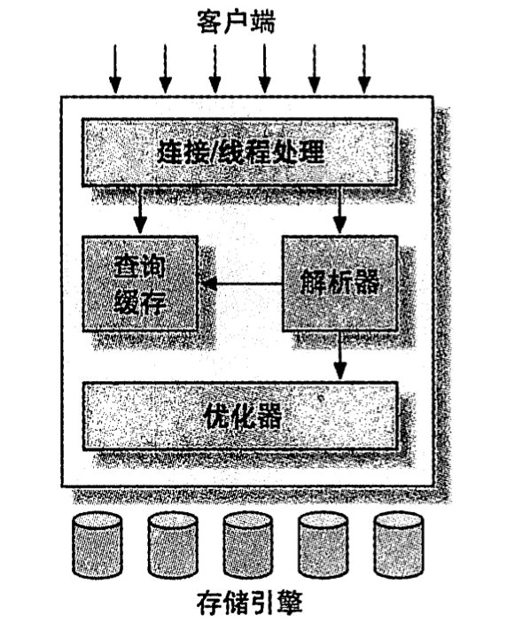

MySQL逻辑架构



##### 三层架构

第一层网络处理层 

负责连接的处理，安全认证等。

第二层是mysql的核心功能层，

负责查询，优化，缓存等，以及mysql的内置函数，存储过程等。

第三层 数据库的存储引擎 

负责数据的存储和提取，不同的存储引擎适用不同场景，各有优缺点。服务器通过API和存储引擎通信。


##### 查询过程

客户端连接到服务器时，服务器会进行安全认证，并且检验语句的访问权限，接受到语句后，(如果是SELECT语句会先去查询缓存里面查找看有没有，有的话直接返回,没有就继续解析)，服务器会对语句进行解析查询，创建一个解析树，对其进行优化（例如重写查询，修改表的访问顺序，以及选择合适的索引）


##### 锁

共享锁 是可以共享的，多个线程可以同时读取一个资源，相互不阻塞。

排他锁 会阻塞其他锁，同一时间只有一个线程在读写资源。


##### 事务

由一系列数据库操作组成的逻辑过程，可以是一个SQL查询，也可以是一组SQL查询。

具备四个特性，也就是acid

原子性，一个事务就是最小的工作单元，要么执行成功提交，要么执行失败回滚。

一致性，就是事务的执行不会影响数据库的完整性，例如执行到一半时发生故障，那么已经进行的修改会回滚。

隔离性，就是事务在执行过程中，两个事务之间是隔离的，事务在执行成功之前，所做的修改对其他事务是不可见的。

持久性，事务执行成功后，对数据的修改是永久的，即便故障也不会丢失。


#### 隔离级别

##### 未提交读

事务还没有提交的修改，其他事务都可以读取到。可能会有脏读的问题，就是读到一些未提交的脏数据。

##### 提交读

其他事务提交的修改，事务在执行过程中可以读取到，如果一个事务在执行过程中需要两次读取同一行数据，可能会不一致。一般发生在UPDATE和DELETE操作。（大部分数据库系统是采用的这个，但是mysql不是）

这个隔离级别下，读是不加锁的，写，更新，删除是加锁的，如果更新的行是可以通过索引查找到，那么是对这些行加行锁，否则会将所有行都加锁，然后返回给Mysql Server，让他来进行过滤，对于不满足条件的行解锁。

##### 可重复读

在事务开始时，记录当时的状态，在第二次读取同一行数据时，除非是本事务做的修改，否则读取的都是事务开始时的数据。可以解决脏读的问题，没法解决幻读的问题。这是mysql的默认事务隔离级别。但是还是会有幻读的问题(幻读就是事务A在读取和写入符合的条件的记录时，其他事务又插入了一条符合条件的记录，此时事务A读取时会产生幻行，一般发生在INSERT操作。)

##### 可串行化

强制事务串行执行，会让读取每一行都加锁，读用读锁，写用写锁，读写锁互斥，可以解决幻读的问题。并发比较多的话可能会造成大量的超时等待和锁竞争。如果业务并发的特别少或者没有并发，同时又要求数据及时可靠的话

##### MVCC

mvcc主要适用于提交读，可重复读，可以解决幻读的问题。

innodb在解决幻读的问题主要是通MVVC 多版本并发版本控制来实现的

就是每一行数据中额外保存两个隐藏的列，创建时的版本号，删除时的版本号（可能为空），滚动指针(指向undo log中用于事务回滚的日志记录)

1.事务在对数据修改后，进行保存时，如果数据行的当前版本号与事务开始取得数据的版本号一致就保存成功，否则保存失败。

插入操作

每次开始事务时，会对系统版本号+1作为当前事务的版本号。

插入数据后，将事务的版本号作为数据行的创建版本号。

删除操作

将当前的事务版本号作为数据行的删除版本号。

更新操作

插入一条新的数据，将事务的版本号作为数据行的创建版本号，并且将当前事务版本号作为旧数据的删除版本号。

查询操作

数据行要被查询出来必须满足两个条件，

删除版本号为空或者>当前事务版本号的数据(否则数据已经被标记删除了)

创建版本号<=当前事务版本号的数据（否则数据是后面的事务创建出来的）

##### 脏页

就是内存数据页与磁盘内存页的内容不一致时的内存页叫做脏页。内存页数据写入磁盘后，数据一致了，就是干净页了。

刷脏页的场景

1.redo log 写满了，系统会停止所有更新操作，将checkpoint向前推进，将推进这部分日志的脏页更新到磁盘。

2.系统内存不够，需要将一部分数据页淘汰，如果是干净页，直接淘汰就行了，脏页的话，需要全部同步到磁盘。

3.MySQL自认为空闲时去刷脏页。

4.MySQL正常关闭之前，会将脏页刷入磁盘。

##### Checkpoint

就是系统故障后，根据redo来恢复数据时，不需要重做所有日志，只需要重做checkpoint点之后的日志，因为redo log也不能无限大，所以当redo log空间不足时，redo log中那部分被更新到磁盘的日志可以覆盖重用。

1、缩短数据库的恢复时间；

2、缓冲池不够用时，将脏页刷新到磁盘；

3、重做日志空间不足时，刷新脏页。


#### undo log

undo log是一种逻辑日志，是旧数据的备份。有两个作用用于事务回滚和MVCC。

执行一条INSERT语句时，会记录一条相反的DELETE语句到日志，执行一条UPDATE语句时，会记录一条相反的UPDATE语句到日志中。


#### redo log

redo log用于保证数据的持久性。redo log记录的是数据页的物理变化，是新数据的备份，在事务提交前，将redo log 持久化就行，不需要将数据持久化，系统崩溃时，可以根据redo log将数据恢复到最新状态。

redo log只做顺序追加操作，当事务需要回滚时，在redo log中也不会删除之前的事务记录。

默认是每次事务提交时必须调用fsync操作将redo缓冲区的内容写入磁盘

例如将A=1修改为A=2

事务开始

将原始数据A=1从磁盘读取到内存，

修改A=2，

生成一条redo log 写入到redo log 缓冲区

调用fsync操作将redo log 缓冲区的内容写入到磁盘

事务提交。

##### Bin log

保存的是逻辑日志，主要是存储每一条会修改数据的SQL。


##### 死锁

死锁就是两个或多个事务在同一资源上相互占用，并且请求对方的占用的资源。InnoDB目前处理死锁的方法就是将持有最少行级排他锁的事务进行回滚。


##### 平衡二叉树

每个节点左右子树的高度差小于等于1


#### B数


其实是一个平衡多路查找树，假设是M阶的，

1.根节点至少有一个关键字

2.非根非页节点的关键字数是  需要<=m-1并且>ceil(m/2)-1，

3.节点内的元素从左到右递增，左边节点的所有元素值<右边节点的所有元素值

4.叶子节点在同一层，高度一致。

跟二叉树相比，因为每个节点关键字会多很多，所以相同的关键字数时，层级会少很多，会减少查找时间和复杂度。

https://segmentfault.com/a/1190000020416577

https://blog.csdn.net/chai471793/article/details/99563704

#### B+树


B树与B+树的区别？

1.B树每个节点会保存关键字，索引和数据。而B+树只有叶子节点保存数据，其他节点只保存关键字和索引。所以相同的内存空间可以容纳更多的节点元素。

2.B+树的所有数据都存在叶子节点上，所以查询会更加稳定，而且相邻的叶子节点都是连接在一起的，更加适合区间查找和搜索，

##### B+树与二叉树区别，优点？为什么不用红黑树？

红黑树是一个平衡的二叉查找树。即便在最坏的情况下，红黑树能够以O(log(N))的时间复杂度进行搜索、插入、删除操作，

##### 与红黑树的比较

红黑树等平衡树也可以用来实现索引，但是文件系统及数据库系统普遍采用 B+ Tree 作为索引结构，主要有以下两个原因：

（一）更少的查找次数

平衡树查找操作的时间复杂度和树高 h 相关，O(h)=O(logdN)，其中 d 为每个节点的出度。

红黑树的出度为 2，而 B+ Tree 的出度一般都非常大，所以红黑树的树高 h 很明显比 B+ Tree 大非常多，查找的次数也就更多。

（二）利用磁盘预读特性

为了减少磁盘 I/O 操作，磁盘往往不是严格按需读取，而是每次都会预读。而B+数中存储的叶子节点在内存中是相邻的，这样可以读取会快一些。

##### 索引

索引可以让服务器快速定位到表的指定位置

优点是

1.大大减少了服务器需要扫描的数据量。

2.帮助服务器避免排序带来的性能开销。

3.将随机IO变成顺序IO。

##### 字符串索引和数字类型索引

因为字符串索引在索引树上两个节点比较会比较慢，数字类型的索引会快一些，

如果非要用字符串索引可以采用以下解决方法。

1.对字符串的前n个字符建立前缀索引，前缀索引不能使用order by。

2.增加一列，对字符串转换为整型的hash值address_key=hashToInt(address)，对address_key建立索引，查询时同时限定hash值也限定地址。可以用如下查询where address_key = hashToInt(‘beijing,china’) and address = ‘beijing,china’;

效率的话，100万的数据量，字符串索引查询600ms，数字查询20ms。

##### 解决慢查询

1.只返回需要的列，不要用SELECT *

2.只返回必要的行，使用LIMIT来限制返回结果

3.使用索引

##### union和union all

union就是将两个SELECT语句查询的结果集合并(两个SELECT可以是同一个表，也可以是不同表)，如果需要排序，在第二个SELECT语句后加ORDER BY语句，会对所有结果进行排序。

union默认是会去除重复的数据的，如果需要不去重的结果，那么应该使用union all。


#### join

full outer join 会包含两个表不满足条件的行

left outer join 会包含左边的表不满足条件的行

right outer join 会包含右边的表不满足条件的行

inner join 就是只包含满足条件的行


cross join 从表A循环取出每一条记录去表B匹配，cross join 后面不能跟on，只能跟where


##### exits 和in，join

exists是拿外表的数据做循环，每次循环去内表中查询数据，使用适内表比较大的情况

而 in的话正好相反，是那内表的数据做循环，每次循环去外表查询数据，适合内表比较小的情况。

```
select * from A where cc in (select cc from B) 
-- 效率低，用到了A表上cc列的索引；

select * from A where exists(select cc from B where cc=A.cc) 
-- 效率高，用到了B表上cc列的索引。
```

not in 和not exists如果查询语句使用了not in 那么内外表都进行全表扫描，没有用到索引；而not extsts 的子查询依然能用到表上的索引。所以无论那个表大，用not exists都比not in要快。

join的实现其实是先从一个表中找出所有行（或者根据where子句查出符号条件的行)，然后去下一个表中循环寻找匹配的行，依次下去，直到找到所有匹配的行，使用join不会去创建临时表，使用in的话会创建临时表，销毁临时表

所以不管是in子查询，exists子查询还是join连接查询，底层的实现原理都是一样的，本质上是没有任何区别的，关键的点在关联表的顺序，如果是join连接查询，MySQL会自动调整表之间的关联顺序，选择最好的一种关联方式。和上面in和exists比较的结论一样，小表驱动大表才是最优的选择方式


##### MySQL主键

如果没有设置主键，innodb会选择第一个非空唯一索引作为聚集索引。

如果没有设置主键，也没有合适的唯一索引，那么会生成一个隐藏的id作为索引的主键，这个值会随着插入而自增。

主键如果是自增的，那么插入数据的位置是已知的，而且不用移动已有数据。如果是非自增的，首先需要查找到要插入的位置，近似于随机查找，然后将后面的数据向后移动。

##### 聚集索引

聚集索引与非聚集索引的区别是：叶节点是否存放一整行记录

innodb

就是innodb的索引是聚簇索引，就是所有数据都存在聚集索引的的叶子节点中，其他二级索引的的叶子节点值存储KEY字段加对应列的主键值，如果使用二级索引查找数据，先根据索引查到二级索引对应的行的主键id，然后根据主键id去聚集索引中查找对应的行的数据。（所以innodb必须要有主键）


1.对于**聚簇索引表**来说（左图），表数据是和主键一起存储的，主键索引的叶结点存储行数据(包含了主键值)，其他列，事务ID，回滚指针，二级索引的叶结点存储行的主键值。使用的是B+树作为索引的存储结构，非叶子节点都是索引关键字，但非叶子节点中的关键字中不存储对应记录的具体内容或内容地址。叶子节点上的数据是主键与具体记录(数据内容)。

2.对于**非聚簇索引表**来说（右图），表数据和索引是分成两部分存储的，主键索引和二级索引存储上没有任何区别。使用的是B+树作为索引的存储结构，所有的节点都是索引，叶子节点存储的是索引+指向索引对应的记录的数据的指针。

##### 聚簇索引的优点

1.当你需要取出一定范围内的数据时，用聚簇索引也比用非聚簇索引好。

2.当通过聚簇索引查找目标数据时理论上比非聚簇索引要快，因为非聚簇索引定位到对应主键时还要多一次目标记录寻址,即多一次I/O。

3.使用覆盖索引扫描的查询可以直接使用页节点中的主键值。

###### 聚簇索引的缺点

1.**插入速度严重依赖于插入顺序**，按照主键的顺序插入是最快的方式，否则将会出现页分裂，严重影响性能。因此，对于InnoDB表，我们一般都会定义一个自增的ID列为主键。

2.**更新主键的代价很高，因为将会导致被更新的行移动**。因此，对于InnoDB表，我们一般定义主键为不可更新。

3.**二级索引访问需要两次索引查找，第一次找到主键值，第二次根据主键值找到行数据。**

二级索引的叶节点存储的是主键值，而不是行指针（非聚簇索引存储的是指针或者说是地址），这是为了减少当出现行移动或数据页分裂时二级索引的维护工作，但会让二级索引占用更多的空间。

4.**采用聚簇索引插入新值比采用非聚簇索引插入新值的速度要慢很多**，因为插入要保证主键不能重复，判断主键不能重复，采用的方式在不同的索引下面会有很大的性能差距，聚簇索引遍历所有的叶子节点，非聚簇索引也判断所有的叶子节点，但是聚簇索引的叶子节点除了带有主键还有记录值，记录的大小往往比主键要大的多。这样就会导致聚簇索引在判定新记录携带的主键是否重复时进行昂贵的I/O代价。

##### 联合索引

联合索引就是多列索引，就是可以多个字段建立一个索引，并且是最左前缀匹配元素，

```
create index a_b_c on user(a,b,c)
这样相当于是创建三个索引
a
a,b
a,b,c
```

就是在非聚簇索引对应的B+树中，索引的排序是先比较a的大小，再比较b的大小然后再比较c的大小。并且是遇到范围比较时就会停止匹配。

1. 最左前缀匹配原则，MySQL会一直向右匹配直到遇到范围查询（>、<、between、like）就停止匹配，比如 a="3" and="" b="4" c="">5 and d=6,如果建立(a,b,c,d)顺序的索引，d是无法使用索引的，如果建立(a,b,d,c)的索引则都可以使用到，a、b、d的顺序可以任意调整。
2. =和in可以乱序，比如 a=1 and b=2 and c=3 建立(a,b,c)索引可以任意顺序，MySQL的查询优化器会帮你优化成索引可以识别的形式。

例如：

```
select * from user where a > 1;
SELECT * FROM user WHERE a='2222' OR b='13281899972'//这个就不会走联合索引，因为只是查询b时不能根究索引查询，所以还是需要全表扫描，所以干脆a也不用索引了。
如果a，b都有索引，那么会单独根据a，b来查询，然后将结果集合并
关于or查询的真相是：
所谓的索引失效指的是：假如or连接的俩个查询条件字段中有一个没有索引的话,引擎会放弃索引而产生全表扫描。
```

这样的语句可以走联合索引，但是不会走联合索引，因为符号这个范围的数据很多，查出之后，只能获得这些数据的主键，还需要根据主键去聚集索引中查，效率比较低，还不如直接全部扫描，所以直接去聚集索引下顺序得对全表进行扫描。

```
SELECT * FROM user WHERE age=1 and height = 2

SELECT * FROM user WHERE age=1 and weight=7

SELECT * FROM user WHERE weight=7 and age=1
```

这些是可以走联合索引的，

```
SELECT * FROM user WEHRE age=1 and height>2 and weight=7
```

这个也会走联合索引，查出age=1的索引，然后查出height>2的所有数据，因为height是一个范围查找，所以到weight就不会用索引，会将将这些数据载入内存，根据weight进行筛选。

索引没有被采用？
1、根据搜索条件，找出所有可能使用的索引
2、计算全表扫描的代价
3、计算使用不同索引执行查询的代价
4、对比各种执行方案的代价，找出成本最低的那一个 。

##### 覆盖索引
就是假如有一个联合索引(a,b,c)，如果我们只是需要a,b,c这几个字段的数据，查询时就不需要根据主键id去聚集索引里面回表查询了

```
SELECT a,b,c FROM user where a = 1
```

这个就是覆盖索引。

https://mp.weixin.qq.com/s?src=11&timestamp=1586078743&ver=2260&signature=s1B5IvEAHXmba8XNgw2q4VXKTN8CpXfX1gjQA*Rcm1M4VpRlWzXAbExHcyLoI2hqJQWNSFZCJ3xdeZsRaph1ZpIAlYt-uTvlgX93gGXhKNiMTm1LCyGosANoDYRHe49N&new=1

哪些情况需要建索引：
1. 主键，唯一索引
2. 经常用作查询条件的字段需要创建索引
3. 经常需要排序、分组和统计的字段需要建立索引
4. 查询中与其他表关联的字段，外键关系建立索引


哪些情况不要建索引：
1. 表的记录太少，百万级以下的数据不需要创建索引

2. 经常增删改的表不需要创建索引

3. 数据重复且分布平均的字段不需要创建索引，如 true,false 之类。

4. 频发更新的字段不适合创建索引

5. where条件里用不到的字段不需要创建索引

##### 主键，唯一性索引，普通索引

一个表中可以有多个唯一性索引，但只能有一个主键。

1.在查询时，如果是使用的是主键，或者是唯一性索引查询，查到后就返回了，普通索引还会继续向后遍历，直到第一个不满足条件的才会返回，普通索引会多检索几次。几乎没有什么影响。

2.更新时普通索引需要判断唯一性。

3.主键是聚集索引，普通所以是非聚集索引。

###### InnoDB

是 MySQL 默认的事务型存储引擎，只有在需要它不支持的特性时，才考虑使用其它存储引擎。

实现了四个标准的隔离级别，默认级别是可重复读（REPEATABLE READ）。在可重复读隔离级别下，通过多版本并发控制（MVCC）+ Next-Key Locking 防止幻影读。

主索引是聚簇索引，在索引中保存了数据，从而避免直接读取磁盘，因此对查询性能有很大的提升。

内部做了很多优化，包括从磁盘读取数据时采用的可预测性读、能够加快读操作并且自动创建的自适应哈希索引、能够加速插入操作的插入缓冲区等。

支持真正的在线热备份。其它存储引擎不支持在线热备份，要获取一致性视图需要停止对所有表的写入，而在读写混合场景中，停止写入可能也意味着停止读取。

##### MyISAM

不支持事务，不支持行级锁，只能全表加锁，读取时会对所有表加共享锁，写入时会对表加排他锁。

#### 分库分表

一般认为单表数据量在1000万时，查询效率是最合适的，如果超过1000万，执行性能就会下降，可以考虑分库分表

##### 垂直切分

就是根据列进行分表，例如根据业务，来对表进行拆分成不同的表，或者根据使用频率，将常用的列分在一个表里面，将不常用的列分在一个表里面。

##### 水平切分 

将表根据行来进行分表，将一个表拆分成多个表结构相同的表。

第一种 一般是用主键ID对数据表的数量进行取模运算，得到的余数就是新表的位置。（如果是字段是字符串，那么就根据字符串计算出哈希值，然后除以表的数量，得到新库的位置）

第二种 根据时间来拆分，主表只存储最近两个月的数据，副表存储之前的数据。这种主要是适合哪种访问的数据跟时间相关性比较大的情况，例如统计，我有看搜狐网他们的技术文档，文章PV，UV统计表，就是每天大概有200万的文章有PV，UV，也就是数据库每天会新增200万行的数据，一般来说查文章近期的UV，PV会多一些，查昨日PV，一周PV，或者一个月的PV会多一些。所以是安装时间来划分热库和冷库，一月一个表，或者一天一表。

问题 

事务问题，如果在事务里面操作一个表，然后再操作另外一个表，效率会比较低，然后也比较麻烦。

join

跨库join的问题

在拆分之前，系统中很多列表和详情页所需的数据是可以通过sql join来完成的。而拆分后，数据库可能是分布式在不同实例和不同的主机上，join将变得非常麻烦。而且基于架构规范，性能，安全性等方面考虑，一般是禁止跨库join的。那该怎么办呢？首先要考虑下垂直分库的设计问题，如果可以调整，那就优先调整。（就是尽量不要去分库）如果无法调整的情况，下面有几种解决方案：

1. 全局表

所谓全局表，就是有可能系统中所有模块都可能会依赖到的一些表。比较类似我们理解的“数据字典”。为了避免跨库join查询，我们可以将这类表在其他每个数据库中均保存一份。同时，这类数据通常也很少发生修改（甚至几乎不会），所以也不用太担心“一致性”问题。

##### 分库分表具体实施

1.停机迁移法

2.迁移历史数据，新的更新发kafka消息

就是对updatet_time小于某个时间点的数据全部拷贝出来，迁移到新的数据库，同时项目在执行增删改相关的SQL时，同时往Kafka中发一份，迁移结束后，用订阅程序消费kafka消息，更新新库，消费完之后，然后校验一致性切数据库。

缺点就算侵入性太强了，所有更新数据库的业务项目都需要改动，然后给kafka发消息。

3.迁移历史数据，订阅bin log接受更新

还是先迁移数据，迁移完之后用订阅程序消费bin log消息，更新新库，消费完之后，然后校验一致性，切数据库。

### 怎么验数据一致性

这里大概介绍一下吧，这篇的篇幅太长了，大家心里有底就行。
(1)先验数量是否一致，因为验数量比较快。
至于验具体的字段，有两种方法:
(2.1)有一种方法是，只验关键性的几个字段是否一致。

随机取小批量数据，编码后比较。

(2.2)还有一种是 ，一次取50条(不一定50条，具体自己定，我只是举例),然后像拼字符串一样，拼在一起。用md5进行加密，得到一串数值。新库一样如法炮制，也得到一串数值，比较两串数值是否一致。如果一致，继续比较下50条数据。如果发现不一致，用二分法确定不一致的数据在0-25条，还是26条-50条。以此类推，找出不一致的数据，进行记录即可。


##### 怎么实现跨库分页查询？

##### 全局视野法

就是例如要查询第三页的数据，那么把每个库里面前三页的数据都查询出来，然后排序，

优点是比较准确，也比较简单

问题就是每个库返回的页数很多，网络传输量很大，而且收到数据后的需要二次排序，排序的性能消耗也比较大。

```
要查order by time offset offset_value limit num时
对每个库查 order by time offset 0 limit offset_value + num然后进行排序
```

##### 最大时间法

就是禁止跳页查询，就是如果业务不需要跳页查询的话，一开始查第一页的时候，从每个库取一页数据回来进行排序后返回。

查第二页数据时根据第一页结果中最大的时间去每个库再取一页数据，然后进行排序得到第二页数据。

优点是是每次直插一页，传输数据量小，排序的数据量也小，

缺点是由于查第二页及以后的页数都需要知道上一页最大时间。

```
要查order by time offset offset_value limit num时
获得上一页的最大时间
对每个库查 where time >lastTime order by time offset 0 limit num然后进行排序
```

##### 每库平均取法

假设数据分布足够平均，每个库的数据分布都是平均的，假设有四个库，查第一页数据时，每个库都取前0.25页数据，然后合并后返回，取第二页数据时，每个库再都取0.25页。但是这样取得是不准的数据

```
将order by time offset X limit Y，改写成order by time offset X/N limit Y/N
```

##### 二次查询法

假如要取offset X后，Y个数据，

1.假设有四个库，需要去每个库查offset X/4 后Y个的数据，然后得到四个结果集中time最小值time_min，

2.然后去每个库去查between time_min到之前每个库的time_max的结果集，

3.因为之前每个库的time_max的offset都是X/4+Y，所以可以反推出time_min在每个库里的offset，然后得到全局offset，

4.然后根据全局offset可以计算我们想到的offset X后Y个数据，就是以time_min为起点到距离我们offset的差值。

关键在于第二步，如果数据库删除过数据，time_min到time_max之间删除过数据，这样就不准，

```
（1）将order by time offset X limit Y，改写成order by time offset X/N limit Y

（2）找到最小值time_min

（3）between二次查询，order by time between time_min and time_i_max

（4）设置虚拟time_min，找到time_min在各个分库的offset，从而得到time_min在全局的offset

（5）得到了time_min在全局的offset，自然得到了全局的offset X limit Y
```

首先需要查询两次，而且如果表数据是按照分段来查询的，会有问题。


#### mysql 主从复制

就是将主节点的数据复制到从节点。

用途

1.可以读写分离，主库用来写数据，从库用来读数据。在更新数据时，会对整个表加锁，如果是读写分离的，可以去从表读取数据，这样就不会有问题。

2.做备份，主库出故障后，进行故障转移，让从库代替主库，提供服务。

##### 实现原理

主节点日志发送线程

当主节点和从节点建立连接后，主服务器上会起一个bin log dump线程，用于给从节点发送bin log日志(日志所包含的信息之外，还包括本次返回的信息的bin-log file 的以及bin-log position)，在读取bin log日志时，会对日志文件加锁，读取完成后会解锁。

从节点I/O线程

从节点与主节点建立连接后会起一个I/O线程来接受主节点发送过来的bin log日志内容，并且保存在从节点的relay log文件中。

从节点SQL线程

从节点同时会起一个SQL线程，来读取 relay log 中的内容，解析成SQL，并且在从节点上执行，保证和主节点的数据一致性。


复制模式

##### 异步模式（默认的模式）

主节点不会主动push bin log给从节点，也不会管从节点的同步情况，默认就是这种模式。

##### 半同步模式（MySQL 5.5之后提供）

主节点给从节点发送bin log 之后，会一直等待回应，只要一个从节点接受bin log，并且写入relay log 成功，给主节点返回接受成功的ACK信息，主节点就认为成功，提交事务。

##### 全同步模式

就是需要所有的从节点接受日志，并且写入relay log 成功，给主节点返回接受成功的ACK信息，主节点才认为成功，提交事务。

bin log格式

Statement-base Replication (SBR)语句模式

就是执行什么更新的SQL，就将这些SQL保存到 bin log日志文件中。

缺点在于可能某些情况下导致数据不一致，例如根据now()当前服务器的时间，可能从节点执行语句时的时间跟主节点的语句时间不一样。

Row-based Relication(RBR) 数据行模式

就是更新那些数据行，将这些更新的数据行生成SQL，保存在bin log日志文件中。

优点是能确保数据的精准，缺点是会产生大量的日志，日志内容会变大，尤其是一行SQL对大量数据行更新时，而且也不能通过bin log解析当时执行的SQL语句。

Mixed-format Replication(MBR)，MySQL NDB cluster 7.3 和7.4 使用的MBR。是以上两种模式的混合，对于一般的复制使用STATEMENT模式保存到binlog，对于STATEMENT模式无法复制的操作则使用ROW模式来保存，MySQL会根据执行的SQL语句选择日志保存方式


#### MySQL更新语句的执行过程

https://gsmtoday.github.io/2019/02/08/how-update-executes-in-mysql/

https://www.infoq.cn/article/M6g1yjZqK6HiTIl_9bex

#### 1.连接验证及解析

客户端与MySQL Server建立连接，发送语句给MySQL Server，接收到后如果是查询语句会先去查询缓存中看，有的话就直接返回了，（新版本的MySQL已经废除了查询缓存，命中率太低了），如果是缓存没有或者是非查询语句，会创建一个解析树，然后进行优化，（解析器知道语句是要执行什么，会评估使用各种索引的代价，然后去使用索引，以及调节表的连接顺序）然后调用innodb引擎的接口来执行语句。

#### 2.写undo log

innodb 引擎首先开启事务，对旧数据生成一个UPDATE的语句(如果是insert会生成delete语句)，用于提交失败后回滚，写入undo log，得到回滚指针，并且更新这个数据行的回滚指针和事务id。（事务提交后，Undo log并不能立马被删除，而是放入待清理的链表，由purge 线程判断是否有其他事务在使用undo 段中表的上一个事务之前的版本信息，决定是否可以清理undo log的日志空间，简单的说就是看之前的事务是否提交成功，这个事务及之前的事务都提交成功了，这部分undo log才能删除。）

#### 3.从索引中查找数据

根据索引去B+树中找到这一行数据（如果是普通索引，查到不符合条件的索引，会把所有数据查找出来，唯一性索引查到第一个数据就可以了）

#### 4.更新数据

判断数据页是否在内存中

#### 4.1数据页在内存中

索引是

##### 4.1.1普通索引

直接更新内存中的数据页

##### 4.1.2唯一性索引

判断更新后是否会数据冲突，不会的话就更新内存中的数据页。

#### 4.2 数据页不在内存中

索引是

##### 4.2.1普通索引

将对数据页的更新操作记录到change buffer，change buffer会在空闲时异步更新到磁盘。

##### 4.2.2唯一性索引

因为需要保证更新后的唯一性，所以不能延迟更新，必须把数据页从磁盘加载到内存，然后判断更新后是否会数据冲突，不会的话就更新数据页。

#### 5.写undo log（prepare状态）

将对数据页的更改写入到redo log，将redo log设置为prepare状态。

#### 6.写bin log（commit状态）

通知MySQL server已经更新操作写入到redo log 了，随时可以提交，将执行的SQL写入到bin log日志，将redo log改成commit状态，事务提交成功。

#### undo log

主要是保证事务的原子性，事务执行失败就回滚，用于在事务执行失败后，对数据回滚。

是逻辑日志，记录的是SQL

在事务提交后，undo log日志不会立即删除，会放到一个待删除的链表中，有purge线程判断是否有其他事务在使用上一个事务之前的版本信息，然后决定是否可以清理，简单的来说就是前面的事务都提交成功了，这些undo才能删除。

##### change buffer是什么（就是将更新数据页的操作缓存下来）

在更新数据时，

如果数据行所在的数据页在内存中，直接更新内存中的数据页。

如果不在内存中，为了减少磁盘IO的次数，innodb会将这些更新操作缓存在change buffer中，在下一次查询时需要访问这个数据页时，在执行change buffer中的操作对数据页进行更新。

适合写多读少的场景，因为这样即便立即写了，也不太可能会被访问到，延迟更新可以减少磁盘I/O，只有普通索引会用到，因为唯一性索引，在更新时就需要判断唯一性，所以没有必要。

##### redo log

就是为了保证事务的持久性，在做数据更新操作时，先将对数据页的更改记录到redo log，然后再去更新内存中的数据页，在下次查询数据页或者空闲时间，将操作记录更新到磁盘。这样可以将随机I/O改为顺序I/O。

优点是减少磁盘I/O次数，即便发生故障也可以根据redo log来将数据恢复到最新状态。

缺点是会造成内存脏页，后台线程会自动对脏页刷盘，或者是淘汰数据页时刷盘，此时会暂时查询操作，影响查询。

#### 二段提交制

更新时，先改内存中的数据页，将更新操作写入redo log日志，此时redo log进入prepare状态，然后通知MySQL Server执行完了，随时可以提交，MySQL Server将更新的SQL写入bin log，然后调用innodb接口将redo log设置为提交状态，更新完成。

如果只是写了bin log就提交，那么忽然发生故障，主节点可以根据redo log恢复数据到最新，但是主从同步时会丢掉这部分更新的数据。

如果只是写binlog，然后写redo log，如果忽然发生故障，主节点根据redo log恢复数据时就会丢掉这部分数据。

##### 崩溃恢复时的判断规则（以redolog是否commit或者binlog是否完整来确定）

1. 如果 redo log 里面的事务是完整的，也就是已经有了 commit 标识，则直接提交；
2. 如果 redo log 里面的事务只有完整的 prepare，则判断对应的事务 binlog 是否存在并完整：
a. 如果是，则提交事务；
b. 否则，回滚事务。


## MySQL 锁

### 全局锁

就是对整个数据库加锁，让整个数据库处于只读状态，所有更新操作停止。（如果是主库就不能执行更新语句，从库也不能执行同步过来的bin log）

最常用的场景是对整个数据库做逻辑备份（就是将所有数据生成SQL写入备份文件。）

做逻辑备份有三种方式：

##### 1.全局锁

对数据库执行

Flush tables with read lock命令让整个库处于只读状态。

##### 2.利用innodb的事务隔离性（可重复读）

就是通过官方自带的逻辑备份工具mysqldump来进行逻辑备份时，可以设置一个参数-single-transaction，这样导数据的时候就会开启一个事务，这样利用innodb的mvcc机制可以保证在事务执行过程中，读到的数据都跟事务开始时的一致，并且执行过程中，其他事务可以执行更新操作， 不会对他造成影响。这种方法必须要求数据库所有表的引擎都是innodb才行。

##### 3.set global readonly=true

执行这个命令也可以让全库只能读，但是第一有些系统会使用readonly来做一个操作，例如根据readonly是否为true判断数据库是否是从库，第二是如果执行这个命令后，客户端断开连接后，数据库会一直处于只读状态，如果是FTWRL命令发送异常会释放全局锁。（如果是从库，设置read-only对super user权限无效）

### 表级锁
表级别的锁有两种，一种是表锁，一种是元数据锁MDL。
##### 表锁
就是使用lock table user_table read/write命令来对表进行加读锁或者写锁
加读锁后，表对所有线程都是只能读，即便是当前线程也只能读表，不然会数据不一致。
加写锁后，表是对当前线程写，其他线程不能读，不能回数据不一致。
可以通过unlock tables来解锁，客户端断开时也会自动释放锁，但是影响所有线程，影响面太大了。

##### 元数据锁MDL
分为读锁和写锁，加读锁时，所有的线程都可以读表，加写锁时，只能一个线程写，其他的不能读。
锁不用显式使用，是访问一个表时，自动加上的。
对表进行增删改查时，会加读锁。
对表结构做修改时，会加写锁。

目的是为了在增删改查时不能修改表结构，修改表结构时不能去增删改查。

####Innodb的锁

##### 行锁

* 共享锁 S锁，就是读锁，让这行数据只能读，不能被修改。所以读锁直接不排斥

* 互斥锁 X锁，就是写锁，就是让当前事务可以修改这行数据，其他事务不能修改这行数据

##### 记录锁 record lock

  记录锁定是对单条索引记录的锁定。例如， `SELECT c1 FROM t WHERE c1 = 10 FOR UPDATE;` 可以防止从插入，更新或删除行。

##### 间隙锁 gap lock

就是在进行范围查找时，对这个范围内所有的索引进行加锁，防止其他事务插入数据，所以间隙锁之间是不排斥的，间隙锁排斥的只是插入数据的操作。

`SELECT c1 FROM t WHERE c1 BETWEEN 10 and 20 FOR UPDATE;`防止其他事务将value `15`插入column中`t.c1`，无论该列中是否已有这样的值，因为该范围中所有现有值之间的间隙都是锁定的，会对这个范围加锁。

```sql
SELECT * FROM child WHERE id = 100;
```

如果id是唯一性索引，那么不会加锁，如果id不是唯一性索引，那么会锁定前面的范围。

##### 下一键锁 next keylock

就是 record lock 和 gap lock的组合，就是会对索引记录加记录锁 + 索引记录前面间隙上的锁”，就是对要更新的数据的左右两个端点加间隙锁，

例如num已有数据是5，10，20

```
update a set note = '1' where num = 10;
```

会对（5，10]和（10，20]这个区间加锁。

##### 表锁

自增锁，意向锁 

意向锁定的主要目的是表明有人正在锁定表中的行，或者打算锁定表中的行。

意向锁不会阻止除全表锁（例如[`LOCK TABLES ... WRITE`](https://dev.mysql.com/doc/refman/5.7/en/lock-tables.html)）以外的任何内容。

在加行锁前必须要获得意向锁：

* 意向共享锁-事务打算读某一行数据时会对这行数据加S锁，在加S锁之前必须加IS锁

* 意向互斥锁-事务在打算修改某一行数据时会对这行数据加X锁，再加X锁之前必须加IX锁。

  例如，[`SELECT ... LOCK IN SHARE MODE`](https://dev.mysql.com/doc/refman/5.7/en/select.html)设置一个`IS`锁，然后[`SELECT ... FOR UPDATE`](https://dev.mysql.com/doc/refman/5.7/en/select.html)设置一个`IX`锁。

  如果一个锁与现有锁兼容，则将其授予请求的事务，但如果与现有锁冲突，则不授予该锁。事务等待直到冲突的现有锁被释放。如果锁定请求与现有锁定发生冲突，并且由于可能导致[死锁](https://dev.mysql.com/doc/refman/5.7/en/glossary.html#glos_deadlock)而无法被授予许可 ，则会发生错误。

意向锁之间是兼容的，不排斥，因为只是有意向去获得锁

|      | IS   | IX   |
| ---- | ---- | ---- |
| IS   | 兼容 | 兼容 |
| IX   | 兼容 | 兼容 |

但是意向锁与行锁之间是排斥的，除非是IS锁和S锁，因为读锁是随便加，可以重复加，不影响效果。

|      | S      | X      |
| ---- | ------ | ------ |
| IS   | 兼容   | 不兼容 |
| IX   | 不兼容 | 不兼容 |


行锁是innodb实现的，myisam不支持行锁，所以myisam在每一时间点只能有一个线程在更新数据。行锁就是在执行update，delete，insert操作时，innodb会给相关的数据行加排他锁，这样其他事务就不能更新这些数据行，需要一直等到事务执行结束，释放锁。（最好将锁更多行的锁放在后面）

- 对于[锁定读取](https://dev.mysql.com/doc/refman/5.7/en/glossary.html#glos_locking_read) （[`SELECT`](https://dev.mysql.com/doc/refman/5.7/en/select.html)使用`FOR UPDATE`或`LOCK IN SHARE MODE`）， [`UPDATE`](https://dev.mysql.com/doc/refman/5.7/en/update.html)和 [`DELETE`](https://dev.mysql.com/doc/refman/5.7/en/delete.html)语句，锁定取决于该语句是使用具有唯一搜索条件的唯一索引还是范围类型搜索条件。
  - 对于具有唯一搜索条件的唯一索引， `InnoDB`仅锁定找到的索引记录，而不锁定其 前的[空白](https://dev.mysql.com/doc/refman/5.7/en/glossary.html#glos_gap)。
  - 对于其他搜索条件，`InnoDB` 使用[间隙锁定](https://dev.mysql.com/doc/refman/5.7/en/glossary.html#glos_gap_lock)或 [下一键锁定](https://dev.mysql.com/doc/refman/5.7/en/glossary.html#glos_next_key_lock) 来[锁定](https://dev.mysql.com/doc/refman/5.7/en/glossary.html#glos_gap_lock)扫描的索引范围， 以阻止其他会话插入该范围所覆盖的间隙。有关间隙锁定和下一键锁定的信息，请参见 [第14.7.1节“ InnoDB锁定”](https://dev.mysql.com/doc/refman/5.7/en/innodb-locking.html)。
- 

#### 死锁
除了单条更新语句外，事务获取行锁都是逐步获取的，所以有可能会造成死锁。
解决死锁有两种策略：
1.超时放弃等待
innodb_lock_wait_timeout,默认是50s,超时会报错
2.死锁检测
innodb会有死锁检测，但是会消耗一些cpu资源，检测到死锁会让占有锁最少的事务会滚，释放锁。
3.控制并发度
就是控制访问相同资源的并发事务量。例如将长事务拆分成短事务，这样每次事务占用时间也少，也可以减少其他事务的等待时间。

##### 怎么优化慢查询？

1.首先根据explain+SELECT语句执行，查看结果，

```
EXPLAIN SELECT * FROM res_user ORDER BYmodifiedtime LIMIT 0,1000
```
```

得到如下结果：  

table |  type | possible_keys | key |key_len  | ref | rows | Extra  EXPLAIN列的解释：   

- table   显示这一行的数据是关于哪张表的           
- type    这是重要的列，显示连接使用了何种类型。从最好到最差的连接类型为const、eq_reg、ref、range、indexhe和ALL
- rows   显示需要扫描行数
- key     使用的索引

const就是针对主键或者唯一性索引的等值查询，通过索引查找一次就行了。仅仅是查一条数据。

eq_ref 唯一性索引键扫描，对于每个索引键，表中只有一条数据与其对应，例如join查询时，对于前表查出的结果集，每个结果在第二个表只有一条数据对应。

ref 非唯一性索引查询

  ref : 此类型通常出现在多表的 join 查询, 针对于非唯一或非主键索引, 或者是使用了 `最左前缀` 规则索引的查询. 关键字:非唯一性索引

   ref_or_null：与ref方法类似，只是增加了null值的比较。

   `range`: 表示使用索引范围查询, 通过索引字段范围获取表中部分数据记录. 这个类型通常出现在 =, <>, >, >=, <, <=, IS NULL, <=>, BETWEEN, IN() 操作中.

   `index`: 表示全索引扫描(full index scan), 关键字:查询字段和条件都是索引本身

   index_merge：表示查询使用了两个以上的索引，最后取交集或者并集，常见and ，or的条件使用了不同的索引.效率不是很高 关键字:索引合并

   unique_subquery：用于where中的in形式子查询，子查询返回不重复值唯一值

   index_subquery：用于in形式子查询使用到了辅助索引或者in常数列表，子查询可能返回重复值，可以使用索引将子查询去重。

   fulltext：全文索引检索，要注意，全文索引的优先级很高，若全文索引和普通索引同时存在时，mysql不管代价，优先选择使用全文索引

   all：这个就是全表扫描数据文件，然后再在server层进行过滤返回符合要求的记录。
```

主要分为三个方面

* 1.减少请求的数据量

列方面，避免使用SELECT *，只返回必要的列。

行方面，使用limit语句来限制返回的数据行数。

对频繁访问的数据加缓存，存在redis中。

* 2.减少服务端扫描的行数，主要通过使用索引和命中索引来实现。

使用索引方面，就是去添加一些索引，以及

2.1对于一些常用的条件查询字段，建立联合索引，使用一些联合索引，可以减少查询次数，也可以减少磁盘空间占用。而且当查询的字段在索引中已经包含时，就会使用到覆盖索引。此时在索引中查到数据后就不用在回表了。

2.2避免在查询时，对索引字段进行计算和使用函数，这样会导致不通过索引查询，将一些varchar类型的字段与整型数据进行比较时，会触发隐式类型转换，从而使用函数。

* 3.切分大查询，因为大查询在查询时可能会锁住很多数据，也需要获取到这些数据的行锁才能进行查询，切分成小查询可以减少锁竞争，减少等待获取锁的时间。


##### 设计下缓存吧，如果数据库写成功了，但是缓存更新失败了，读到了脏数据怎么办？

答：写库前先更新缓存，使缓存失效，缓存失效后再更新数据库，数据库异步去更新缓存，同时将状态更新为有效。
https://hadyang.github.io/interview/docs/architecture/design/seckill/

#### 对 uuid 的理解？知道哪些 GUID、Random 算法？

Universally Unique Identifier

uuid是为了让分布式系统不借助中心节点，生成一个唯一ID的解决方案。一般用的都是randomUUID，根据随机数算出来的。重复的可能性极小。是一个8字节的数，在16进制下有32位。一般

GUID是微软对UUID的一种实现。


UUID有五个版本，

**版本1** 时间戳+Mac地址

基于时间戳、机器MAC地址生成，缺点还是会暴露生成时间和机器的mac地址。

**版本2 **DCE安全的UUID

会把时间戳前四位用POSIX的UID或GID值来替换掉，一般UUID的实现都没有提供这种方法。

**版本3** 基于名字空间的UUID

就是可以传入一个自定义的字符串，通过MD5加密，得到一个UUID。

```css
System.out.println(UUID.nameUUIDFromBytes("myString".getBytes("UTF-8")).toString());
```

**版本4** 基于随机数的UUID

这一版的UUID主要是根据随机数来生成的。一般用的也就是第四种

```css
System.out.println(UUID.randomUUID().toString());
```

**版本5**：基于名字空间的UUID（SHA1）

跟版本三一样，不过是通过SHA1加密，也是一种不可逆的加密方式

https://mp.weixin.qq.com/s?src=3&timestamp=1586142782&ver=1&signature=xqjBIqXRrTSrhO9bVfPMKw*Gg90a6ZTGaG2SA1uH4jPnPOsr1Ym5aOtx0uDgBRkFsuzgpM-KK7Nwl9lp44lE3qX8GPHZb5j9JdT2nbMR9UjU6tfBxWFHxqiLnHdbnafOVkI0j7BZ*fKcQCxBFHvJ-X-JxfaHoC44q4B9PcjkA18=

https://www.cnblogs.com/yjmyzz/p/why_paging_so_tough_with_sharding.html


#### 悲观锁和乐观锁

##### 悲观锁

就是假定在每次取数据的时候会修改这个数据，所以在取数据的时候就会进行加锁，这样其他调用者就不能取数据，阻塞等待，一直到获取到锁。Java中的同步锁sychronized和ReentrantLock就是悲观锁思想的实现。

##### 乐观锁

就是假定在每次取数据时不会修改这个数据，所以在取数据的时候不会加锁，只有在真正修改数据时才加锁。Java中的atomic原子变量类就是乐观锁的实现。

##### 区别

##### 悲观锁适合多写的场景，

乐观锁适合多读的场景，这样只有读写冲突会发生的比较少，减少加锁的性能开销。但是如果是多写的场景，这样会导致上层应用一直重试，增加性能开销。


### 乐观锁的实现

#### 版本号机制

使用版本号来实现，对数据加上一个版本号，代表修改次数，每次修改后+1，修改数据时判断数据的版本号跟之前取的是否一致，一致才修改，不一致就重试，直到更新成功。

#### CAS操作

就是在更新数据时会传入之前取的值，在内存中判断当前内存中的值跟之前的值是否一致，一致再更新，（比较和更新都是在一个原子操作中）。

##### ABA问题

但是没法解决ABA的问题，就是其他调用方对数据修改成其他值后又改回原来的值。AtomicStampedReference的compareAndSet会先判断对象的引用是否相同，相同才进行CAS更新。实现原理主要是AtomicStampedReference会保存之前对象的的引用，及一个修改版本号，只有当引用和版本号都相等的情况下，才会进行CAS更新操作。

##### 循环时间长开销大

自旋CAS操作如果不成功就一直循环执行直到成功，如果长时间不成功，会给CPU带来非常大的执行开销

##### CAS 只对单个共享变量有效

多个变量放在一个对象里来进行 CAS 操作.所以我们可以使用锁或者利用`AtomicReference类`把多个共享变量合并成一个共享变量来操作

#### Java的原子类

原子类一共有以下四种

- 1.基本类型: AtomicInteger, AtomicLong, AtomicBoolean ;
- 2.数组类型: AtomicIntegerArray, AtomicLongArray, AtomicReferenceArray ;
- 3.引用类型: AtomicReference, AtomicStampedRerence, AtomicMarkableReference ;
- 4.对象的属性修改类型: AtomicIntegerFieldUpdater, AtomicLongFieldUpdater, AtomicReferenceFieldUpdater 。

##### AtomicInteger

主要是对Integer的封装，提供了一些原子性的操作，因为如果是使用Integer来完成i=i+1;操作，在内存中是三个步骤，先将从内存中取出i，放到寄存器中，然后将寄存器中的值与1相加，然后将结果写入内存，一共是三个步骤，所以不是原子性的，并发时会造成数据不一致的问题。

主要实现原理是AtomicInteger类有一个unsafe属性，可以通过unsafe来调用Unsafe类的一些原子性的方法Unsafe.compareAndSwapInt来实现原子性的加减运算。

其次是使用volatile来修饰value属性，保证一个内存可见性

```
//compareAndSwapInt有四个参数，第一个是待运算的对象，第二个是对象中用于运算的属性的偏移量，第三个是期望值，第四个是更新的值。
unsafe.compareAndSwapInt(this, valueOffset, expect, update)
```

```
public class AtomicInteger extends Number implements java.io.Serializable {
    private static final long serialVersionUID = 6214790243416807050L;

    // setup to use Unsafe.compareAndSwapInt for updates
    private static final Unsafe unsafe = Unsafe.getUnsafe();
    private static final long valueOffset;

    static {
        try {
            valueOffset = unsafe.objectFieldOffset
                (AtomicInteger.class.getDeclaredField("value"));
        } catch (Exception ex) { throw new Error(ex); }
    }

    private volatile int value;//使用volatiole来保证value的内存可见性
}

```

在Unsafe类中，compareAndSwapInt和getAndAddInt的区别在于，getAndAddInt会一直重试直到成功，compareAndSwapInt如果更新失败，只会返回false

```
public final int getAndAddInt(Object var1, long var2, int var4) {
    int var5;
    do {
        var5 = this.getIntVolatile(var1, var2);
    } while(!this.compareAndSwapInt(var1, var2, var5, var5 + var4));

    return var5;
}
```

####volatile 关键字有什么用？怎么理解可见性，一般什么场景去用可见性？

当线程进行一个volatile变量的写操作时，JIT编译器生成的汇编指令会在写操作的指令前在上一个“lock”前缀。“lock”有两个作用：

1.将当前CPU缓存行的数据会写回到主存。
2.这个写回内存的操作会引起在其他CPU中对这个变量的缓存失效。

3.确保指令重排序时，内存屏障前的指令不会排到后面去，内存屏障后的指令不会排到前面去。

可见性可以理解为一个线程的写操作可以立即被其他线程得知。

##### 使用场景

##### 读写锁

如果需要实现一个读写锁，每次只能一个线程去写数据，但是有多个线程来读数据，就synchronize同步锁来对set方法加锁，get方法不加锁， 使用volatile来修饰变量，保证内存可见性，不然多个线程可能会在变量修改后还读到一个旧值。

##### 状态位

用于做状态位标志，如果多个线程去需要根据一个状态位来执行一些操作，使用volatile修饰可以保证内存可见性。

用于单例模式用于保证内存可见性，以及防止指令重排序。

#### 单例模式

三种写法

正确并且可以做到延迟加载的写法其实就是三种：

##### 使用volatile修饰变量并且双重校验的写法

```
public class Singleton {               
    private volatile static Singleton instance;              
    public static Singleton getInstance() {              
        if (instance == null) {                        
            synchronized (Singleton.class) { 
                if (instance == null)//双重检查存在的一样在于可能会有多个线程进入第一个判断，然后竞争同步锁，线程A得到了同步锁，创建了一个Singleton实例，赋值给instance，然后释放同步锁，此时线程B获得同步锁，又会创建一个Singleton实例，造成初始化覆盖。
                    instance = new Singleton();          
            }                                   
        }                                      
        return instance;                        
    }                                                 
} 
```


##### 使用静态内部类来实现

（类A有一个静态内部类B，类B有一个静态变量instance，类A的getInstance()方法会返回类B的静态变量instance，因为只有调用getInstance()方法时才会加载静态内部类B，这种写法缺点是不能传参。）

```
 public static class Signleton {
    private static class Instance {
        private static Instance instance = new Instance();
    }

    public static Instance getInstance() {
        return Instance.instance ;  // 这里将导致 Signleton 类被初始化 
    }
}
```

##### 使用枚举来实现

```
public enum Singleton {
		Instance;
		//自定义的一些方法
    public void method(){}
}
```


#### 分库分表唯一ID生成方案

##### UUID

UUID 优点是可以基本保证唯一。

但是缺点是无序的，不是递增的，插入数据效率会低一些，如果主键是字符串的话，查询效率也比较低，而且32位的字符串，查询效率低，没

##### MySQL主键自增

优点是数字化，插入和查询效率高，具有一定的业务可读性，id小的创建时间更早。

缺点是只能单机，不能用于分库分表。

##### MySQL多实例主键自增

可以设置mysql表每次自增时的步长，

```sql
CREATE TABLE table (...) AUTO_INCREMENT = n;
alter table <table name> auto_increment=2;
```

优点是解决了每次自增是1的问题，缺点是一旦设置了步长，就不方便扩容了，因为分库分表的表的数量已经定下来了。

##### snowflake算法

是推特开源分布式ID生成算法，一共有64位，

第一位是0，标志位

接下来41位是13位的毫秒时间戳，最大可以到2039年9月

接下来10个二进制位是服务器的id

后面12位是业务序列号

意味着每毫秒最大可以生成2的12次方个id，4096个，支持每个机器每毫秒生成4096个id，每秒可以生成400多万的id

优点是比较快，不依赖mysql去生成

缺点是

1.趋势递增，容易被猜到订单量，第一条下单多少，第二条下单多少，可以自己加随机数。

2.依赖机器时间，如果机器时间出现回拨，变成以前的时间，可能会导致id重复。

解决回拨的问题

就是机器需要同步时间，不一致会对时间回拨，可能会导致id重复，像百度的snowflake是几台特定的服务器，每次的机器id也是从数据库里面生成的，所以不需要做时间同步。

## 百度的uid-generator

##### 默认模式

每次启动时向数据库插入一条数据，这行数据的主键是自增的，主键id就是workId，

因为默认是snowflake算法是1标志位+41位时间戳+10位机器号+12位序列号，

因为百度的是每次启动都获取新的机器号，所以它修改了这些位数配比，是

1标志位+28位的时间差+22位的机器号+13位的序列号，所以总共支出2的22次方次启动，也就是400万次启动。

解决时间回拨问题：

* 启动时时间回拨

因为是每次都用新的机器号，所以当前机器号都是之前没有的，所以即便时间戳回拨也不影响。

* 运行时时间回拨

会使用lastSecond来记录上次生成id的时间戳，如果当前时间戳比lastSecond还小，就抛出异常。

##### 缓存模式

主要继承自默认模式，只是用一个环形数组来存储生成好的id，每次去环形数组中去，默认大小是2的13次方，8192。这种模式使用的时间取得不是实时的系统时间，而且使用启动时的时间，每次生成一组id时，对之前保存的时间+1。

阀值检测，然后填充

取id时，可用id数小于阀值50%时，去填充

定期填充

会去检查环形数组中id使用情况，然后生成一组最大序列号个数的id(默认是8192个)，然后进行填充，多的直接丢弃掉，

### 美团的leaf

snowflake模式

1位的符号位+41位的时间戳+10位的workID+10位的序列号


#### 1 时钟回拨问题

若机器出现时钟回拨，会产生重复id

##### 1）启动时回拨

启动时获取其他机器的时间，计算出平均时间后，将本机时间与平均时间比较，若超过阈值则启动失败。

##### 2）运行时回拨

1. 直接拒绝，抛异常

2. 若回拨时间小于阈值，则睡眠

3. 若回拨时间大于阈值，直接拒绝服务并报错，或者更换机器号，或者利用拓展位

   

##### 时间类型

- 时间戳：自1970.01.01起（今日头条）
- 时间差：自选起始时间（百度、美团）

##### 2）时间精度

- 秒级：支持峰值更高（今日头条、百度）
- 毫秒级：记录时间粒度更细（美团）

汽车之家是自增的id，只是作品类型不同，文章，视频等

头条，百度，美团也是使用了snowFlake只是改变了位数占比。

比如头条是去掉了符号标示位，缩短了时间戳，前31位是秒级时间戳+自定义的序列（可能是机器id+递增的数），记录的时间粒度会粗一些，每一秒生成的id会少一些，但是支持的峰值会高一些，时间戳也可以不从1970年开始选，也可以从自定义的时间开始选，这样支持的年长会多一些。

#### 3 机器号

纯机器号，或，机房号+机器号

##### 1）物理机

- 手动配置
- zookeeper（美团）
  在zookeeper如未注册则创建持久顺序节点，顺序号当机器号，并本地缓存

##### 2）虚拟机

- redis
  利用redis原子计数器，虚拟机启动后，请求计数器，按机器号位数取余
- zookeeper
  从0到机器号上限，在zookeeper尝试创建临时节点，成功则为当前机器号
- 数据库（百度）
  利用系统变量的host和port为唯一索引，在数据库中存取，主键作为机器id