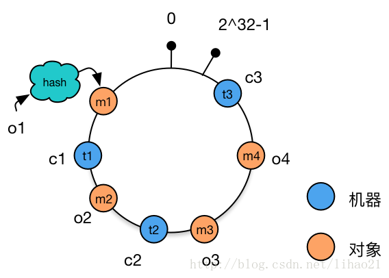
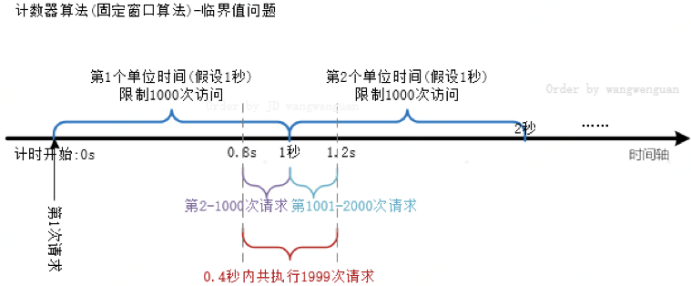
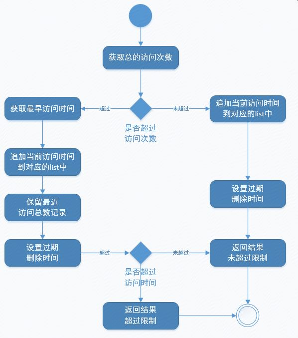

(PS：扫描[首页里面的二维码](README.md)进群，分享我自己在看的技术资料给大家，希望和大家一起学习进步！)

#### [1.nginx负载均衡算法有哪些？](#nginx负载均衡算法有哪些？)
#### [2.一致性hash是什么？](#一致性hash是什么？)
#### [3.有哪些实现限流的技术方案？](#有哪些实现限流的技术方案？)

### nginx负载均衡算法有哪些？

##### 1、轮询（默认）

每个请求按时间顺序逐一分配到不同的后端服务，如果后端某台服务器死机，自动剔除故障系统，使用户访问不受影响。

例如：
```
upstream bakend {  
    server 192.168.0.1;    
    server 192.168.0.2;  
}
```
##### 2、weight（根据权值分配）

weight的值越大分配到的访问概率越高，主要用于后端每台服务器性能不均衡的情况下。或者仅仅为在主从的情况下设置不同的权值，达到合理有效的地利用主机资源。

指定轮询几率，weight和访问比率成正比，用于后端服务器性能不均的情况。
例如：
```
upstream bakend {  
    server 192.168.0.1 weight=10;  
    server 192.168.0.2 weight=10;  
}
```
##### 3、ip_hash（根据ip地址分配）

每个请求按访问IP的哈希结果分配，这样来自同一个IP的请求固定访问一台后端服务器，并且可以有效解决动态网页存在的session共享问题。

每个请求按访问ip的hash结果分配，这样每个访客固定访问一个后端服务器，可以解决session的问题。
例如：
```
upstream bakend {  
    ip_hash;  
    server 192.168.0.1:88;  
    server 192.168.0.2:80;  
} 
```
##### 4、fair（优先分配给响应时间段的服务器）

比 weight、ip_hash更加智能的负载均衡算法，fair算法可以根据页面大小和加载时间长短智能地进行负载均衡，也就是根据后端服务器的响应时间来分配请求，响应时间短的优先分配。Nginx本身不支持fair，如果需要这种调度算法，则必须安装upstream_fair模块。

按后端服务器的响应时间来分配请求，响应时间短的优先分配。
例如：
```
upstream backend {  
    server 192.168.0.1:88;  
    server 192.168.0.2:80;  
    fair;  
}
```
##### 5、url_hash（根据url分配）

按访问的URL的哈希结果来分配请求，使每个URL定向到一台后端服务器，可以进一步提高后端缓存服务器的效率。Nginx本身不支持url_hash，如果需要这种调度算法，则必须安装Nginx的hash软件包。

按访问url的hash结果来分配请求，使每个url定向到同一个后端服务器，后端服务器为缓存时比较有效。

注意：在upstream中加入hash语句，server语句中不能写入weight等其他的参数，hash_method是使用的hash算法。

例如：
```
upstream backend {  
    server 192.168.0.1:88;  
    server 192.168.0.2:80;  
    hash $request_uri;  
    hash_method crc32;  
}
```

### 一致性hash是什么？

nginx 普通的hash算法支持配置http变量值（例如url或者请求参数）作为hash值计算的key，通过hash计算得出的hash值和总权重的余数作为挑选server的依据。缺点是

1.可能对于给后端服务器分配请求时分配得不均匀，有的upstream server负载很低，有的upstream server负载较高。

2.增加或者减少upstream server后，所有的请求可能分配的upstream server会发生变化，跟之前不同。

所以有了一致性hash，一致性hash就是创建出n个虚拟节点，n个虚拟节点构成一个环，从n个虚拟节点中，挑选出一些节点当成真实的upstream server节点。构成一个每次将计算得到的hash%n，得到请求分配的虚拟节点的位置c，从位置c顺时针移动，获得离c最近的真实upstream server节点。

这样请求分配时就会比较均匀，而且upstream server的数量变化只会影响计算出key值hash与其”最近”的预分配的虚拟节点。

例如在下面这个图中：

真实的机器节点是t1，t2，t3。

按照一致性hash的规则，请求m4，m3是分配给机器节点t2，请求m2是分配给机器节点t1，请求m1是分配给机器节点t3。

一旦有机器节点增加或者减少，只会附近的一个节点。例如如果t2节点被移除了，只会将原本由t2节点处理的请求分配给t1，而其他机器节点不会受影响。



```bash
upstream somestream {
    consistent_hash $request_uri;
    server 10.50.1.3:11211;
    server 10.50.1.4:11211;
    server 10.50.1.5:11211;
}
```

### 有哪些实现限流的技术方案？

#### 1.计数器（固定窗口限流+滑动窗口限流）

固定窗口限流：

固定窗口算法指每个单位时间相对隔离，一个单位区间的请求量统计跟其他单位区间的请求量统计完全独立。当一个单位时间过期，自动进入下一个时间阶段重新进行计数，固定窗口计数器算法逻辑图如下，固定窗口计数器算法相对简单，但会存在临界问题（用户流量并不会像我们所期望的匀速请求，而是可能在某个时间点集中爆发，在一个窗口快结束的时候来了大量的请求，然后消耗完这个窗口的次数，然后在下个窗口刚开始又来了大量的请求，消耗完这个窗口的次数，这样在这个很短的时间间隔内，处理的请求数会超过>单个窗口的次数限制）




#### 2.滑动窗口限流：

为了解决固定窗口算法的临界问题，有了滑动窗口限流，这种算法每次统计当前时间往前推一个单位的时间，统计这个单位时间内的请求量，是否超出阀值。（可以使用Redis中的有序集合sorted set来实现，就是每个member存储请求的信息，member的score就是请求发生的时间戳，每次接受请求时，先去查询有序集合的大小，如果数量超出，就删除时间戳过期的（也就是超出当前时间窗口的请求），删除后还是超出，就限流，否则就不限流，并且有一个定时任务定时删除时间戳过期的。）

但是由于每次都需要统计单位时间的请求量，开销远大于固定窗口算法，所以在真实的业务环境中需要慎重使用滑动窗口算法。





#### 2.令牌桶算法：

令牌以固定速率产生，并缓存到令牌桶中，令牌桶放满时，多余的令牌被丢弃。请求要获取令牌才能被处理，获取不到令牌时，请求被缓存。（Guava框架中的RateLimiter类就是令牌桶算法的解决方案）

#### 3.漏桶算法：

可以认为这种算法有一定固定长度的队列，来缓存请求，消费端每次以固定的速率从队列取出请求进行处理，当队列满了时，请求就只能丢弃。

#### 区别:

漏桶算法和令牌桶算法都是限制数据的平均传输速率，区别在于，令牌桶算法能够在限制数据的平均传输速率的同时还允许某种程度的突发传输。

就是假设漏桶每秒钟处理10个请求，使用漏桶法，我们设置桶的大小为10，流出的速率为0.1s流出一个请求，也就是每0.1s能处理一个请求，在第一个0.1s内只处理了1个请求，后面的9个请求都在桶内等待，每过0.1s，处理一个。

而使用令牌桶的话，我们会设置每1s向桶中放入10个令牌，假设之前没有请求，桶内有10个令牌，那么来10个请求都可以获得令牌，然后直接进行处理，来第11个请求，如果桶内没有令牌才需要等待。

Nginx官方版本限制IP的连接和并发分别有两个模块：

#### 1.限制请求数

- `limit_req_zone` 用来限制单位时间内的请求数，即速率限制，默认采用的漏桶算法 ，也就是超出限制的请求会丢弃，如果设置了burst就会变成令牌桶算法，使用一个长度为burst的队列来存储这些超出限制的请求。（nginx使用的漏桶算法）

  例子：

  限制访问速度

  ```nginx
  http {
      limit_req_zone $binary_remote_addr zone=one:10m rate=1r/s;
      server {
          location /search/ {
              limit_req zone=one burst=5 nodelay;
          }
  }        
  ```

  这个例子中主要是限制每个IP请求的次数，

  limit_req_zone中的参数

  * 第一个参数：$binary_remote_addr 表示通过用户请求的ip地址这个标识来做限制，使用binary_remote_addr 而不是remote_addr目的是使用二进制格式的ip地址，可以缩小内存占用量。

  * 第二个参数：zone=one:10m表示生成一个大小为10M，名字为one的内存区域，用来存储访问的频次信息。

  * 第三个参数：rate=1r/s表示允许相同标识的客户端的访问频次，这里限制的是每秒1次只允许请求一次，还可以有比如30r/m的。

  limit_req_zone中的参数

  - 第二个参数：**burst=5**，burst是爆发的意思，这个配置的意思是设置一个大小为5的缓冲区当有大量请求（爆发）过来时，超过了访问频次限制的请求可以先放到这个缓冲区内先进行处理，处理完之后后面的请求还是需要等待生成令牌的速度跟上了之后才能处理。
  
- 第三个参数：**nodelay**，如果没有设置，那么超出缓存区的所有请求会进行排队等待等待，如果设置nodelay，超过访问频次而且缓冲区也满了的时候就会直接返回503。
  

默认情况下，当某个客户端超过它的限流，NGINX用**503（Service Temporarily Unavailable**状态码来响应。使用***limit_req_status\***指令设置一个不同的状态码，例如limit_req_status  444;

##### 实战案例

  ```nginx
  limit_req_zone $binary_remote_addr zone=mylimiter:10M rate=2r/s;
  server {
  		location /search {
  				limit_req_zone=mylimiter;
  		}
  }
  ```

  这个例子是限制同一ip地址请求/search接口时，限制每秒转发2个请求，也就是500ms转发一个。如果瞬间同一ip来了6个请求，只有第一个请求会成功，后面5个请求会被拒绝，因为nginx的限流统计是基于毫秒的，设置的速度是2r/s，转换一下就是500ms内单个IP只允许通过1个请求，从501ms开始才允许通过第二个请求。(此时也是默认的漏桶的算法)

  ```nginx
  limit_req_zone $binary_remote_addr zone=mylimiter:10M rate:2r/s;
  server {
  		location /search {
  				limit_req_zone=mylimiter burst=4;
  		}
  }
  ```

  多了一个burst参数，可以认为burst是一个缓冲队列，可以将多余的请求缓存请求，这些请求也不会立即处理，只能等着慢慢被处理。假设同一ip来了6个请求，第一个请求会被立即处理，然后会有4个请求被缓存在队列中，然后每0.5s会从队列中取出一个进行处理。而最后一个请求，由于队列满了，是会被拒绝，返回503。

  ```nginx
  limit_req_zone $binary_remote_addr zone=mylimiter:10M rate:2r/s;
  server {
  		location /search {
  				limit_req_zone=mylimiter burst=4 nodelay;
  		}
  }
  ```

多了一个nodelay参数，就是快速转发的意思，不会增加每秒能处理的请求数，但是可以让处于burst队列中请求，就会立即被后台worker处理。假设同一ip来了6个请求，那么第一个请求会被立即处理，然后会有4个请求被缓存在队列中，缓存队列中的请求也是立即被转发处理，第六个请求则是由于队列满了，被拒绝，返回503。  

https://www.cnblogs.com/CarpenterLee/p/8084533.html

  #### 2.限制并发连接数

  Nginx 的 **ngx_http_limit_conn_module**模块提供了对资源连接数进行限制的功能。

  例如：一次只允许每个IP地址一个连接。

  ```
  limit_conn_zone $binary_remote_addr zone=addr:10m;
  
  server {
      location /download/ {
      		limit_conn addr 1;
      }
  }
  ```

#### Guava实现限流

guava的RateLimiter主要使用令牌桶算法实现限流，可以设置一个令牌生产速率来生产令牌，然后调用acquire()来获得令牌，当调用时桶内令牌不够可以进行预支，并且下一个请求调用acquire()方法时需要等待令牌还完之后才能获得令牌。

```java
public static void main(String[] args) {
        RateLimiter limiter = RateLimiter.create(1);
        for(int i = 1; i < 10; i = i + 1 ) {
            double waitTime = limiter.acquire(10);
            System.out.println("cutTime=" + System.currentTimeMillis() + " acq:" + i + " waitTime:" + waitTime);
        }
}
```

例如每秒生产1个令牌，第一次一次性获得10个令牌，等待时间是0s，后面下一次获得令牌时需要将10个令牌全部还完才能获得令牌，也就是需要等待10s左右。

输出如下：

```java
cutTime=1591437767990 acq:1 waitTime:0.0
cutTime=1591437777994 acq:2 waitTime:9.99607
cutTime=1591437787991 acq:3 waitTime:9.994006
```

参考链接：

[死磕nginx系列--nginx 限流配置](https://www.cnblogs.com/biglittleant/p/8979915.html)

[字节跳动工作总结：高并发系统中的限流算法](https://mp.weixin.qq.com/s?src=11&timestamp=1591424755&ver=2383&signature=sEx-P1P2FbqGV-QSWPw3TRzOkCAp26w7rTjU2y6ab49GRumif0GpPOn2XclKx3SqC7*zNrRMvVVaEkpwXqcWZnFA6ouIPzg5mo1e-Mnp7vNKLm1ZroOMfoBlNX3wkHvc&new=1)

### RateLimiter深度使用

使用RateLimiter完成简单的大流量限流，抢购秒杀限流。
RateLimiter是guava提供的基于令牌桶算法的实现类，可以非常简单的完成限流特技，并且根据系统的实际情况来调整生成token的速率。
通常可应用于抢购限流防止冲垮系统；限制某接口、服务单位时间内的访问量，譬如一些第三方服务会对用户访问量进行限制；限制网速，单位时间内只允许上传下载多少字节等。
下面来看一些简单的实践demo，需要先引入guava的maven依赖。
Demo1.有很多任务，但希望每秒不超过N个

```java
    /** 
     *  
     * 有很多个任务，但希望每秒不超过X个，可用此类 
     */  
    public class Demo1 {  
        public static void main(String[] args) {  
            //0.5代表一秒最多多少个  
            RateLimiter rateLimiter = RateLimiter.create(0.5);  
            List<Runnable> tasks = new ArrayList<Runnable>();  
            for (int i = 0; i < 10; i++) {  
                tasks.add(new UserRequest(i));  
            }  
            ExecutorService threadPool = Executors.newCachedThreadPool();  
            for (Runnable runnable : tasks) {  
                System.out.println("等待时间：" + rateLimiter.acquire());  
                threadPool.execute(runnable);  
            }  
        }  

        private static class UserRequest implements Runnable {  
            private int id;  

            public UserRequest(int id) {  
                this.id = id;  
            }  

            public void run() {  
                System.out.println(id);  
            }  
    }  
}
```

Demo2.抢购场景限流
如我们预估数据库能承受并发10，超过了可能会造成故障，我们就可以对该请求接口进行限流。

```java
    @RestController  
    public class IndexController {  
        @Resource(name = "db")  
        private GoodInfoService goodInfoService;  

        RateLimiter rateLimiter = RateLimiter.create(10);  

        @RequestMapping("/miaosha")  
        public Object miaosha(int count, String code) {  
            System.out.println("等待时间" + rateLimiter.acquire());  
            if (goodInfoService.update(code, count) > 0) {  
                return "购买成功";  
            }  
            return "购买失败";  
        }  
        @RequestMapping("/add")  
        public Object add() {  
            for (int i = 0; i < 100; i++) {  
                GoodInfo goodInfo = new GoodInfo();  
                goodInfo.setCode("iphone" + i);  
                goodInfo.setAmount(100);  
                goodInfoService.add(goodInfo);  
            }  
            return "添加成功";  
        }  
    }  
```

Demo3.抢购场景降级

```java
     /** 
     * tryAcquire(long timeout, TimeUnit unit) 
     * 从RateLimiter 获取许可如果该许可可以在不超过timeout的时间内获取得到的话， 
     * 或者如果无法在timeout 过期之前获取得到许可的话，那么立即返回false（无需等待） 
     */  
    @RequestMapping("/buy")  
    public Object miao(int count, String code) {  
        //判断能否在1秒内得到令牌，如果不能则立即返回false，不会阻塞程序  
        if (!rateLimiter.tryAcquire(1000, TimeUnit.MILLISECONDS)) {  
            System.out.println("短期无法获取令牌，真不幸，排队也瞎排");  
            return "失败";  
        }  
        if (goodInfoService.update(code, count) > 0) {  
            System.out.println("购买成功");  
            return "成功";  
        }  
        System.out.println("数据不足，失败");  
        return "失败";  
    }  
```

### rediscell的使用

 Redis 4.0 版本中提供的 Redis-Cell 模块，该模块使用的是漏斗算法，并且提供了原子的限流指令，而且依靠 Redis 这个天生的分布式程序就可以实现比较完美的限流了。Redis-Cell 实现限流的方法也很简单，只需要使用一条指令 cl.throttle 即可，使用示例如下：

```
> cl.throttle mylimit 15 30 60
1）（integer）0 # 0 表示获取成功，1 表示拒绝
2）（integer）15 # 漏斗容量
3）（integer）14 # 漏斗剩余容量
4）（integer）-1 # 被拒绝之后，多长时间之后再试（单位：秒）-1 表示无需重试
5）（integer）2 # 多久之后漏斗完全空出来
```


