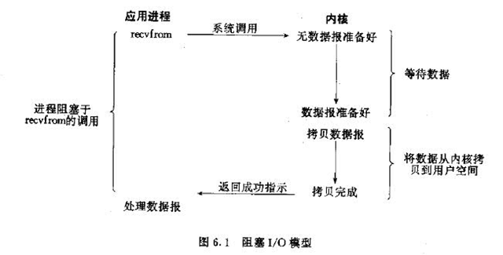
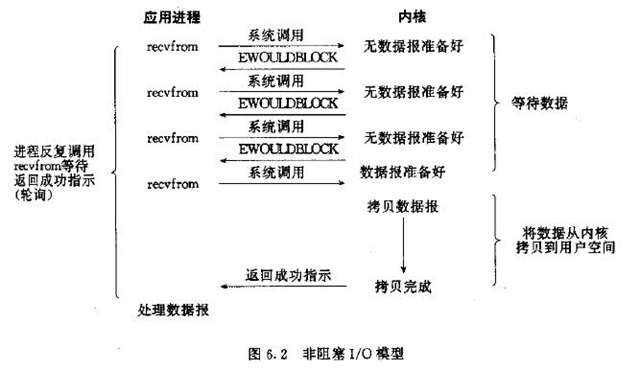
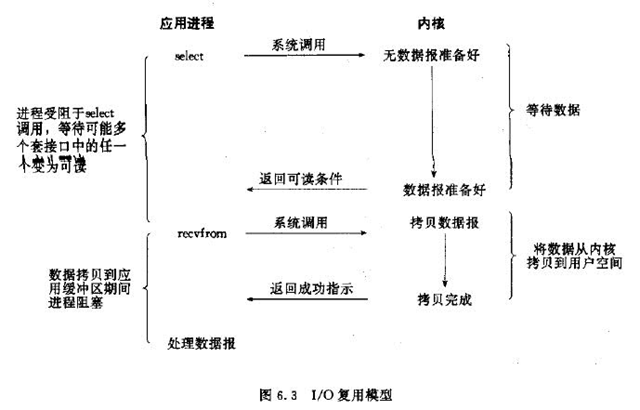
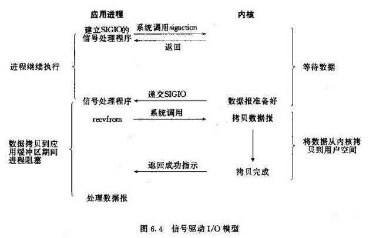
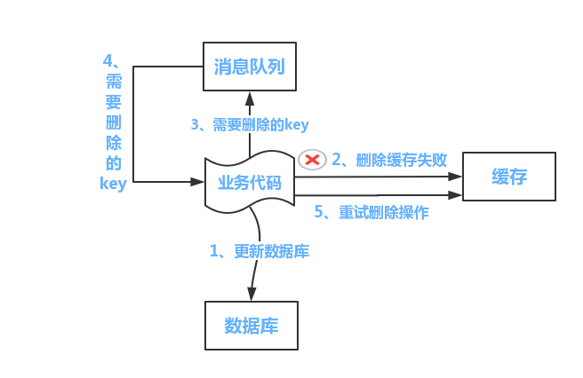

(PS：扫描[首页里面的二维码](README.md)进群，分享我自己在看的技术资料给大家，希望和大家一起学习进步！)


下面是主要是自己看完《Redis设计与实现》，《Redis深度历险：核心原理与应用实践》后，为了更好得掌握Redis，网上找了一些面试题，查阅书籍和资料后，写的解答。

#### [1.Redis是什么？](#Redis是什么？)

#### [2.Redis过期key是怎么样清理的？](#Redis过期key是怎么样清理的？)
#### [3.Redis为什么是单线程的？](#Redis为什么是单线程的？)
#### [4.Redis的性能为什么这么高？](#Redis的性能为什么这么高？)
#### [5.Linux中IO模型一共有哪些？](#Linux中IO模型一共有哪些？)
#### [6.同步与异步的区别是什么？](#同步与异步的区别是什么？)
#### [7.阻塞与非阻塞的区别是什么？](#阻塞与非阻塞的区别是什么？)
#### [8.如何解决Redis缓存穿透问题？](#如何解决Redis缓存穿透问题？)
#### [9.如何解决Redis缓存击穿问题？](#如何解决Redis缓存击穿问题？)
#### [10.如何解决Redis缓存雪崩问题？](#如何解决Redis缓存雪崩问题？)
#### [11.如何解决缓存与数据库的数据一致性问题？](#如何解决缓存与数据库的数据一致性问题？)


### Redis是什么？
Redis是一个开源的，基于内存的，也可进行持久化的，使用C语言编写的键值对存储数据库。

### Redis过期key是怎么样清理的？

##### (1)惰性清除

在访问key时，如果发现key已经过期，那么会将key删除。

##### (2)定时清理

Redis配置项hz定义了serverCron任务的执行周期，默认每次清理时间为25ms，每次清理会依次遍历所有DB，从db的expires字典(里面保存了设置了过期时间的键值对，key就是指向键对象，value是过期时间)中随机取出20个key，如果过期就删除，如果其中有5个key过期，说明过期率超过了25%，那么就继续对这个db进行清理，否则开始清理下一个db。

##### (3)内存不够时清理

当执行写入命令时，如果发现内存不够，那么就会按照配置的淘汰策略清理内存，淘汰策略一般有6种，Redis4.0版本后又增加了2种，主要由分为三类

* 第一类 不处理，等报错(默认的配置)

  * noeviction，发现内存不够时，不删除key，执行写入命令时发现内存不够直接返回错误信息。（Redis默认的配置就是noeviction）

* 第二类  从所有结果集中的key中挑选，进行淘汰(随机，lru，lfu三种)

  * allkeys-random 就是从所有的key中随机挑选key，进行淘汰
  * allkeys-lru 就是从所有的key中挑选最近使用时间距离现在最远的key，进行淘汰
  * allkeys-lfu 就是从所有的key中挑选使用频率最低的key，进行淘汰。（这是Redis 4.0版本后新增的策略）

* 第三类 从设置了过期时间的key中挑选，进行淘汰(随机，lru，ttl，lfu)

  这种就是从设置了expires过期时间的结果集中选出一部分key淘汰，挑选的算法有：

  * volatile-random 从设置了过期时间的结果集中随机挑选key删除。
  * volatile-lru 从设置了过期时间的结果集中挑选上次使用时间距离现在最久的key开始删除
  * volatile-ttl 从设置了过期时间的结果集中挑选可存活时间最短的key开始删除(也就是从哪些快要过期的key中先删除)

  * volatile-lfu 从过期时间的结果集中选择使用频率最低的key开始删除（这是Redis 4.0版本后新增的策略）
  
##### LRU算法
LRU算法的设计原则是如果一个数据近期没有被访问到，那么之后一段时间都不会被访问到。所以当元素个数达到限制的值时，优先移除距离上次使用时间最久的元素。

可以使用双向链表Node+HashMap<String, Node>来实现，每次访问元素后，将元素移动到链表头部，当元素满了时，将链表尾部的元素移除，HashMap主要用于根据key获得Node以及添加时判断节点是否已存在和删除时快速找到节点。

PS:使用单向链表能不能实现呢，也可以，单向链表的节点虽然获取不到pre节点的信息，但是可以将下一个节点的key和value设置在当前节点上，然后把当前节点的next指针指向下下个节点，这样相当于把下一个节点删除了

```java
//双向链表
    public static class ListNode {
        String key;//这里存储key便于元素满时，删除尾节点时可以快速从HashMap删除键值对
        Integer value;
        ListNode pre = null;
        ListNode next = null;
        ListNode(String key, Integer value) {
            this.key = key;
            this.value = value;
        }
    }

    ListNode head;
    ListNode last;
    int limit=4;
    
    HashMap<String, ListNode> hashMap = new HashMap<String, ListNode>();

    public void add(String key, Integer val) {
        ListNode existNode = hashMap.get(key);
        if (existNode!=null) {
            //从链表中删除这个元素
            ListNode pre = existNode.pre;
            ListNode next = existNode.next;
            if (pre!=null) {
               pre.next = next;
            }
            if (next!=null) {
               next.pre = pre;
            }
            //更新尾节点
            if (last==existNode) {
                last = existNode.pre;
            }
            //移动到最前面
            head.pre = existNode;
            existNode.next = head;
            head = existNode;
            //更新值
            existNode.value = val;
        } else {
            //达到限制，先删除尾节点
            if (hashMap.size() == limit) {
                ListNode deleteNode = last;
                hashMap.remove(deleteNode.key);
              //正是因为需要删除，所以才需要每个ListNode保存key
                last = deleteNode.pre;
                deleteNode.pre = null;
                last.next = null;
            }
            ListNode node = new ListNode(key,val);
            hashMap.put(key,node);
            if (head==null) {
                head = node;
                last = node;
            } else {
                //插入头结点
                node.next = head;
                head.pre = node;
                head = node;
            }
        }

    }

    public ListNode get(String key) {
        return hashMap.get(key);
    }

    public void remove(String key) {
        ListNode deleteNode = hashMap.get(key);
        ListNode preNode = deleteNode.pre;
        ListNode nextNode = deleteNode.next;
        if (preNode!=null) {
            preNode.next = nextNode;
        }
        if (nextNode!=null) {
            nextNode.pre = preNode;
        }
        if (head==deleteNode) {
            head = nextNode;
        }
        if (last == deleteNode) {
            last = preNode;
        }
        hashMap.remove(key);
    }
```

##### LFU算法
LFU算法的设计原则时，如果一个数据在最近一段时间被访问的时次数越多，那么之后被访问的概率会越大，实现是每个数据都有一个引用计数，每次数据被访问后，引用计数加1，需要淘汰数据时，淘汰引用计数最小的数据。在Redis的实现中，每次key被访问后，引用计数是加一个介于0到1之间的数p，并且访问越频繁p值越大，而且在一定的时间间隔内，如果key没有被访问，引用计数会减少。

### Redis为什么是单线程的？
Redis官方FAQ回答: 

Redis是基于内存的操作，读取数据很快，不需要在某个线程读取数据时，切换到另一个线程来执行来提高CPU利用率，所以CPU不会成为瓶颈所在，Redis的瓶颈最有可能是机器内存的大小或者网络带宽。既然单线程容易实现，而且CPU不会成为瓶颈，那就顺理成章地采用单线程的方案了。
（这里的单线程指的是处理客户端发送的请求命令的文件处理器模块是单线程，其他模块不一定是单线程的。从Redis 4.0版本后，Redis又逐渐引入了多线程。）

##### Redis采用单线程的优势:

1.Redis项目的代码会更加清晰，处理逻辑会更加简单。

2.不用考虑多个线程修改数据的情况，修改数据时不用加锁，解锁，也不会出现死锁的问题，导致性能消耗。

3.不存在多进程或者多线程导致的切换而造成的一些性能消耗。

##### Redis采用单线程的劣势:

1.无法充分发挥多核机器的优势，不过可以通过在机器上启动多个Redis实例来利用资源。（但是启动多个Redis实例可能会导致在进行AOF重写时，竞争IO资源，导致磁盘写入压力过大，所以可以使用脚本来触发实例的AOF重写，让所有实例的 AOF 串行执行。）

### Redis的性能为什么这么高？
根据官网的介绍，Redis单机可以到到10W的QPS(每秒处理请求数)，Redis这么快的原因主要有以下几点：

1.完全基于内存，数据全部存储在内存中，内存读取时没有磁盘IO，所以速度非常快。

2.Redis采用单线程的模型，没有上下文切换的开销，也没有竞态条件，不用去考虑各种锁的问题，不存在加锁释放锁操作，没有因为可能出现死锁而导致的性能消耗。

3.Redis项目中使用的数据结构都是专门设计的，例如SDS(简单动态字符串)是对C语言中的字符串频繁修改时，会频繁地进行内存分配，十分消耗性能，而SDS会使用空间预分配和惰性空间释放来避免这些问题的出现。
空间预分配技术: 对SDS进行修改时，如果修改后SDS实际使用长度为len，

当len<1M时,分配的空间会是2*len+1，也就是会预留len长度的未使用空间，其中1存储空字符

当len>1M时,分配的空间会是len+1+1M，也就是会预留1M长度的未使用空间，其中1存储空字符

4.采用多路复用IO模型，可以同时监测多个流的IO事件能力，在空闲时，会把当前线程阻塞掉，当有一个或多个流有I/O事件时，就从阻塞态唤醒，轮询那些真正发出了事件的流，并只依次顺序的处理就绪的流。可以让单个线程高效的处理多个连接请求（尽量减少网络 I/O 的时间消耗)。

### Linux中IO模型一共有哪些？

IO模型主要由阻塞式I/O模型，非阻塞式I/O模型，I/O复用模型，信息驱动式I/O模型，异步I/O模型。
##### 阻塞式I/O模型(也就是BIO，Blocking IO)



用户态进程发出一个IO请求时，会调用recvfrom系统调用去获取数据，如果当前内核中数据没有准备好，那么会让出CPU时间片，一直阻塞等待，不会进行其他操作。直到内核中的数据准备好，将数据拷贝到用户空间内存，然后recvfrom返回成功的信号，此时用户态进行才解除阻塞的状态，处理收到的数据。

##### 非阻塞时I/O模型



在非阻塞式I/O模型中，当进程等待内核的数据，而当该数据未到达的时候，进程会不断询问内核，直到内核准备好数据。
用户态进程调用recvfrom接收数据，当前并没有数据报文产生，此时recvfrom返回EWOULDBLOCK，用户态进程会一直调用recvfrom询问内核，待内核准备好数据的时候，之后用户态进程不再询问内核，待数据从内核复制到用户空间，recvfrom成功返回，用户态进程开始处理数据。

##### I/O多路复用模型



I/O复用指的是多个I/O连接复用一个进程。

**基础版的I/O复用模型**

最初级的I/O复用，就是**一个进程**对应**多个Socket**连接，每次从头至尾进行遍历，判断是否有I/O事件准备好了，需要处理，有的话就进行处理，缺点是效率比较低，如果一直没有事件进来，会导致CPU空转。

**升级版的I/O复用模型：**

**select和poll**

当没有I/O事件时，进程处于阻塞状态，当有I/O事件时，就会有一个代理去唤醒进程，对所有的文件描述符进行轮询(一个文件描述符对应一个Socket连接)，来处理I/O事件。（这里的代理也就是select和poll，select只能观察1024个连接，poll可以观察无限个连接，因为poll是基于链表来实现的）

**epoll**

epoll是对select和poll的升级版，解决了很多问题，是线程安全的，而且可以通知进程是哪个Socket连接有I/O事件,不需要进行全部连接进行遍历，提高了查找效率。

epoll和select/poll最大区别是

(1)epoll内部使用了mmap共享了用户和内核的部分空间，避免了数据的来回拷贝。
(2)epoll基于事件驱动，epoll_wait只返回发生的事件避免了像select和poll对事件的整个轮寻操作（时间复杂度为O(N)），epoll时间复杂度为O（1）。

##### 信息驱动式I/O模型



是非阻塞的，当需要等待数据时，用户态进程会给内核发送一个信号，告知自己需要的数据，然后就去执行其他任务了，内核准备好数据后，会给用户态发送一个信号，用户态进程收到之后，会立马调用recvfrom，等待数据从从内核空间复制到用户空间，待完成之后recvfrom返回成功指示，用户态进程才处理数据。

##### 异步I/O模型
与信息驱动式I/O模型区别在于，是在数据从内核态拷贝到用户空间之后，内核才通知用户态进程来处理数据。在复制数据到用户空间这个时间段内，用户态进程也是不阻塞的。

参考链接：

http://blog.csdn.net/lzb348110175/article/details/98941378

https://xie.infoq.cn/article/b3816e9fe3ac77684b4f29348

### epoll水平触发和边缘触发的区别？

**水平触发**和**边缘触发**两种：

- LT，默认的模式（水平触发） 只要该fd还有数据可读，每次 `epoll_wait` 都会返回它的事件，提醒用户程序去操作，
- ET是“高速”模式（边缘触发） 

 只会提示一次，直到下次再有数据流入之前都不会再提示，无论fd中是否还有数据可读。所以在ET模式下，read一个fd的时候一定要把它的buffer读完，即读到read返回值小于请求值或遇到EAGAIN错误

epoll使用“事件”的就绪通知方式，通过`epoll_ctl`注册fd，一旦该fd就绪，内核就会采用类似回调机制激活该fd，`epoll_wait`便可收到通知。

### 同步与异步的区别是什么？
同步与异步的区别在于调用结果的通知方式上。
同步执行一个方法后，需要等待结果返回轮询调用结果才能继续执行，然后继续执行下去。
异步执行一个方法后，不会等待结果的返回，被调用方在执行完成后通过回调来通知调用方继续执行。

### 阻塞与非阻塞的区别是什么？
阻塞与非阻塞的区别在于进程/线程在等待消息时，进程/线程是否是挂起状态。

##### 阻塞调用
在消息发出去后，消息返回之前，当前进程/线程会被挂起，直到有消息返回，当前进/线程才会被激活。
##### 非阻塞调用

在消息发出去后，不会阻塞当前进/线程，而会立即返回，可以去执行其他任务。

### BIO，NIO，AIO有什么区别？

一次IO的读操作分为等待就绪和IO操作两个阶段，等待就绪就是等待TCP RecvBuffer里面的数据就绪好，也就是发送方的数据全部发送到网卡里面来，操作就是CPU将数据从网卡拷贝到用户空间。

**BIO(同步阻塞型)**

以Java中的IO方式为例，BIO就是同步阻塞型的IO，当一个Socket连接发送数据过来以后，需要为这个Socket连接创建一个线程，由线程调用Socket的read()方法读取数据，需要先把数据从网卡拷贝到内核空间，再拷贝到用户态的内存空间，在数据读取完成前，线程都是阻塞的。这种IO方式就是比较消耗资源，假设有1000个活跃的Socket连接，需要创建出1000个线程来读取数据，读取时都是阻塞的，每个线程有自己独有的线程栈，默认大小是1M。

**NIO(同步非阻塞型)**

nio就是多路io复用，就是一个线程来处理多个Socket连接，节省线程资源。以select为例，就是有一个长度为1024的数组，每个元素对应一个Socket连接，线程轮询这个数据，判断哪个Socket连接的数据是出于就绪状态，此时就将数据拷贝到用户空间然后进行处理。由于IO操作阶段是需要等待数据拷贝到用户空间完成才能返回，所以是同步的。由于每次判断内核中Socket缓冲区的数据是否就绪的函数是直接返回的，如果就绪就返回有数据，不是就绪就返回0，线程不需要阻塞等待，所以是非阻塞的。

**AIO(异步非阻塞型)**

AIO就是NIO的升级版，在数据处于就绪状态时，也是异步将Socket缓冲区中的数据拷贝到用户空间，然后执行异步回调函数，所以在IO操作阶段也是异步的。


BIO里用户最关心“我要读”，NIO里用户最关心"我什么时候可以读了"，在AIO模型里用户更需要关注的是“什么时候读完了，我可以直接进行处理了”。

https://zhuanlan.zhihu.com/p/23488863

https://www.cnblogs.com/sxkgeek/p/9488703.html

https://blog.csdn.net/weixin_34378045/article/details/91930797

### 如何解决Redis缓存穿透问题？
Redis 缓存穿透指的是攻击者故意大量请求一些Redis缓存中不存在key的数据，导致请
求打到数据库上，导致数据库压力过大。

#####  解决方案如下：

1.做好参数校验，无效的请求直接返回，只能避免一部分情况，攻击者总是可以找到一些没有覆盖的情况。

2.对缓存中找不到的key，需要去数据库查找的key，缓存到Redis中，但是可能会导致Redis中缓存大量无效的key，可以设置一个很短的过期时间，例如1分钟。

3.也可以使用布隆过滤器，将所有可能的存在的数据通过去hash值的方式存入到一个足够大的bitmap中去，处理请求时，通过在bitmap中查找，可以将不存在的数据拦截掉。

### 如何解决Redis缓存击穿问题？

缓存击穿主要指的是某个热点key失效，导致大量请求全部转向数据库，导致数据库压力过大。

##### 解决方案：

1.对热点key设置永不过期。

2.加互斥锁，缓存中没有热点key对应的数据时，等待100ms，由获得锁的线程去读取数据库然后设置缓存。

### 如何解决Redis缓存雪崩问题？

缓存雪崩主要指的是短时间内大量key失效，导致所有请求全部转向数据库，导致数据库压力过大。

##### 解决方案：

1.在给缓存设置失效时间时加一个随机值，避免集体失效。

2.双缓存机制，缓存A的失效时间为20分钟，缓存B的失效时间会比A长一些，从缓存A读取数据，缓存A中没有时，去缓存B中读取数据，并且启动一个异步线程来更新缓存A(如果已经有异步线程正在更新了，就不用重复更新了)。以及更新缓存B，以便延迟B的过期时间。

### 如何解决缓存与数据库的数据一致性问题？

首先需要明白会导致缓存与数据库的数据不一致的几个诱因：
多个写请求的执行顺序不同导致脏数据。
更新时正好有读请求，读请求取到旧数据然后更新上。或者数据库是读写分离的，在主库更新完之后，需要一定的时间，从库才能更新。

##### 1.先更新数据库，后更新缓存
1.两个写请求，写请求A，写请求B，A先更新数据库，B后更新数据库，但是可能B会先更新缓存，A后更新缓存，这样就会导致缓存里面的是旧数据。
2.更新缓存时失败也有可能导致缓存是旧数据。

##### 2.先删除缓存，在更新数据库
1.删除缓存后，更新数据库之前假如正好有读请求，读请求把旧数据设置到缓存了。
##### 3.先更新数据库，再删除缓存
1.更新后删除缓存时，网络不好，删除失败也有可能导致缓存是旧数据。

2.写请求A更新数据库然后删除缓存，读请求B读数据时发现缓存中没有数据，就从数据库拿到旧数据准备设置到缓存上去时，如果整个架构是读写分离的，写请求更新数据是在主库上更新，读请求B是去从库上读数据，如果此时主库上的新数据还没有同步到从库，这样读请求B在从库读到旧数据，设置到缓存上，导致缓存里面是旧数据。

#### 正确的方案

##### 1.写请求串行化

将写请求更新之前先获取分布式锁，获得之后才能更新，这样实现写请求的串行化，但是会导致效率变低。
##### 2.先更新数据库，异步删除缓存，删除失败后重试

 先更新数据库，异步删除缓存，删除缓存失败时，继续异步重试，或者将操作放到消息队列中，再进行删除操作。（如果数据库是读写分离的，那么删除缓存时需要延迟删除，否则可能会在删除缓存时，从库还没有收到更新后的数据，其他读请求就去从库读到旧数据然后设置到缓存中。）



##### 3.业务项目更新数据库，其他项目订阅binlog更新

业务项目直接更新数据库，然后其他项目订阅binlog，接收到更新数据库操作的消息后，更新缓存，更新缓存失败时，新建异步线程去重试或者将操作发到消息队列，然后后续进行处理。但是这种方案更新mysql后还是有一定延迟，缓冲中才是新值。


参考资料：https://www.cnblogs.com/rjzheng/p/9041659.html