##客官，这是一份精心编写的《Redis设计与实现》读书心得（上篇）

### 第一部分 数据结构与对象

#### 第二章 简单动态字符串
Redis没有使用C语言的char数组的方式来存储字符串，而是自己定义了一个简单动态字符串结构体类型SDS(simple dynamic string),
```
struct sdshdr {
  int len;//字符串长度
  int free;//剩余使用空间,也就是buf数组中未使用的字节数
  char buf[];//字节数组，用于保存字符串
}
```
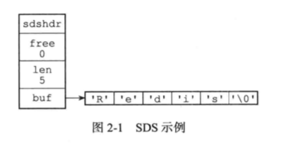

在上面例子中，使用SDS保存了字符串Redis，SDS的情况如下：
·free属性的值为0，表示这个SDS没有分配任何未使用空间。
·len属性的值为5，表示这个SDS保存了一个五字节长的字符串。
·buf属性是一个char类型的数组，数组的前五个字节分别保存了'R'、'e'、'd'、'i'、's'五个字符，而最后一个字节则保存了空字符'\0'。”遵从结尾使用空字符这一惯例的好处是，SDS可以直接重用一部分C字符串函数库里面的函数。
##### SDS 与 C字符串的区别
1.可以使用常数级别的时间复杂度获取字符串长度
因为SDS结构体使用len变量保存长度，而C语言字符串需要遍历字符数组获取长度
2.防止缓冲区溢出
因为C语言字符串不记录自身长度，拼接时是直接将字符串拼接在字符串后面，所以后面如果有其他字符串的话，会把其他字符串的内容覆盖。如果后面是不可写的内存，则会报错。如果SDS，拼接时会判断长度，长度不够会进行扩容。
3.减少修改字符串带来的内存重分配次数
对于C语言字符串，底层是一个N+1的字符数组，是用多少，分配多少，所以字符串的拼接和截断都会导致内存重分配。

对于SDS，进行扩容时，会多分配空间以减少内存重分配的次数。
当使用长度len<1MB时，分配的总空间为len+len+1，也就是剩余空间为与使用长度相同，再加上额外1字节保存空字符
当使用长度len>1MB时,分配的总空间为len+1MB+1，也就是剩余空间为1MB，再加上额外1字节保存空字符

SDS进行字符串截断时，会延迟字符串剩余空间的释放时机
字符串进行截断后，程序并不立即进行内存重分配来回收多余的字节，而是使用free变量进行记录，将空间闲置，便于以后使用，当然也可以显式调用函数对空间进行释放

4.SDS可以保存二进制数据
C字符串中的字符必须符合某种编码（比如ASCII），并且除了字符串的末尾之外，字符串里面不能包含空字符，否则最先被程序读入的空字符将被误认为是字符串结尾，这些限制使得C字符串只能保存文本数据，而不能保存像图片、音频、视频、压缩文件这样的二进制数据。

5.兼容部分C字符串函数
因为遵循C字符串以空字符结尾的惯例，所以可以使用部分C字符串函数

#####第3章 链表
因为C语言没有提供链表的实现，所以Redis自己实现了链表。
//链表的数据结构 
```
typedef struct list {
  listNode *head;//表头指针
  listNode *tail;//表尾指针
  unsigned long len;//总节点数量
  void *(*dup) (void *ptr);//节点值复制函数，复制节点保存的值
  void (*free)(void *ptr);//节点值释放函数，释放节点保存的值
  int (*match)(void *ptr, void *key);//节点值对比函数，用与比较节点值与输入值
}list
```
//链表节点的数据结构
```
typedef struct listNode {
  struct listNode *prev;//指向前一个节点的指针
  struct listNode *next;//指向后一个节点的指针
  void *value;//节点保存的值
}listNode
```
这是一个包含三个节点的链表
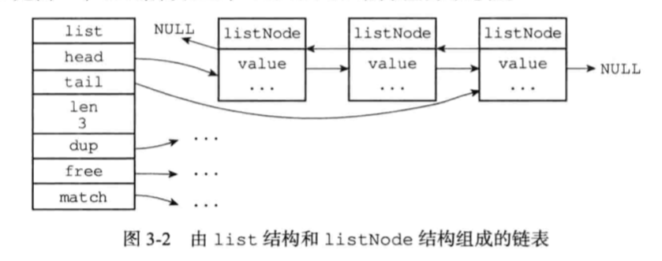
Redis中的链表具备以下特点：
双端：每个节点保存了指向前后两个节点的指针
无环：表头节点的prev为NULL，表尾节点的next为NULL
有表头指针和表尾指针
记录了链表长度
多态：链表节点listNode使用指针void *保存节点的值，而链表list使用dup、free和match指针来根据链表中存放的对象的不同从而实现不同的方法。

###字典
字典是一种用于保存键值对的抽象数据结构。因为C语言没有提供字典的实现，所以Redis使用哈希表实现了字典这种数据结构。
下图为一个空的哈希表示意图：
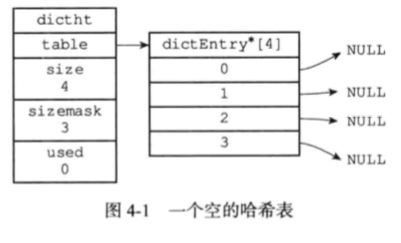
下图是普通状态(非rehash期间)下，保存了两个键值对的字典：


哈希表节点的数据结构如下：
```
typedef struct dictEntry {
  //键  
  void *key;
  //值，可以是一个指针，也可以是一个uint64_t整数，也可以是int64_t的整数
  union {
    void *val;
    uint64_tu64;
    int64_ts64;
  } v；
  //指向下一个节点的指针
  struct dictEntry *next;
} dictEntry；
```

Redis使用的哈希表数据结构如下：
```
typedef struct dictht {
  //哈希表数组，每个元素存储的是哈希表节点链表
  dictEntry **table;
  //哈希表大小，也就是table数组的大小
  unsigned long size;
  //哈希表大小掩码，总是等于size-1,用于计算哈希表节点在table中存储的位置
  usigned long sizemask;
  //当前存储的节点总数
  unsigned long used;
} dictht;
```

Redis字典的数据结构如下：
```
typedef struct dict {
  //类型特定函数，type是一个指向dictType结构的指针，每个dictType保存了一系列用于操作特定类型键值对的函数，不同的字典会有不同的类型特定函数
  dictType *type;
  //私有数据，privatedata保存了一些需要传给类型特定函数的可选参数
  void *privatedata;
  //哈希表数组，ht是一个数组，保存了两个哈希表，一般情况下，字典只使用ht[0]哈希表，ht[1]哈希表只会在对ht[0]哈希表进行rehash时使用。
  dictht ht[2];
  //rehash索引，当不进行rehash时，值为-1
  int rehashindex;
}
```

类型特定函数的数据结构
```
typedef struct dictType {
    // 
计算哈希值的函数
    unsigned int (*hashFunction)(const void *key);
    // 
复制键的函数
    void *(*keyDup)(void *privdata, const void *key);
    // 
复制值的函数
    void *(*valDup)(void *privdata, const void *obj);
    // 
对比键的函数
    int (*keyCompare)(void *privdata, const void *key1, const void *key2);
    // 
销毁键的函数
    void (*keyDestructor)(void *privdata, void *key);
    // 
销毁值的函数
    void (*valDestructor)(void *privdata, void *obj);
} dictType;
```
##### 哈希算法
当要将一个新的键值对添加到字典里面时，Redis先根据键值对的键计算出哈希值，
```
hash = dict->type->hashFunction(key);
```
然后根据哈希值计算得到索引值
```
index = hash & dict->ht[x].sizemask;
```
再根据索引值，将包含新键值对的哈希表节点放到哈希表数组的指定索引上面。
##### 解决键冲突
Redis的哈希表使用链地址法（separate chaining）来解决键冲突，每个哈希表节点都有一个next指针，多个哈希表节点可以用next指针构成一个单向链表，被分配到同一个索引上的多个节点可以用这个单向链表连接起来，这就解决了键冲突的问题。
##### rehash（扩容和收缩）
为了让哈希表的负载因子（load factor）维持在一个合理的范围之内，当哈希表保存的键值对数量太多或者太少时，程序需要对哈希表的大小进行相应的扩展或者收缩。
扩展和收缩哈希表的工作可以通过执行rehash（重新散列）操作来完成，Redis对字典的哈希表执行rehash的步骤如下：
1.为字典的ht[1]哈希表分配空间，这个哈希表的空间大小取决于要执行的操作，以及ht[0]当前包含的键值对数量（也即是ht[0].used属性的值）：
(1) 如果执行的是扩展操作，那么ht[1]的大小为第一个大于等于ht[0].used*2的2的n次方幂；
(2) 如果执行的是收缩操作，那么ht[1]的大小为第一个大于等于ht[0].used的2的n次方幂；
2.将保存在ht[0]中的所有键值对rehash到ht[1]上面：rehash指的是重新计算键的哈希值和索引值，然后将键值对放置到ht[1]哈希表的指定位置上。
3.当ht[0]包含的所有键值对都迁移到了ht[1]之后（ht[0]变为空表），释放ht[0]，将ht[1]设置为ht[0]，并在ht[1]新创建一个空白哈希表，为下一次rehash做准备。
##### 哈希表扩展和收缩的触发条件
扩展操作：
1.服务器目前没有在执行BGSAVE命令或者BGREWRITEAOF命令，并且哈希表的负载因子大于等于1。
2.服务器目前正在执行BGSAVE命令或者BGREWRITEAOF命令，并且哈希表的负载因子大于等于5。
Redis需要创建当前服务器进程的子进程，而大多数操作系统都采用写时复制（copy-on-write）技术来优化子进程的使用效率，所以在子进程存在期间，服务器会提高执行扩展操作所需的负载因子，从而尽可能地避免在子进程存在期间进行哈希表扩展操作，这可以避免不必要的内存写入操作，最大限度地节约内存。
收缩操作：
当哈希表的负载因子小于0.1时，程序自动开始对哈希表执行收缩操作。
##### 渐进式rehash
当键值对比较多时，如果要一次性完成rehash那么会对性能产生影响，所以可以分多次，渐进式地完成rehash操作。
哈希表渐进式rehash的详细步骤：
1）为ht[1]分配空间，让字典同时持有ht[0]和ht[1]两个哈希表。
2）在字典中维持一个索引计数器变量rehashidx，并将它的值设置为0，表示rehash工作正式开始。
3）在rehash进行期间，每次对字典执行添加、删除、查找或者更新操作时，程序除了执行指定的操作以外，还会顺带将ht[0]哈希表在rehashidx索引上的所有键值对rehash到ht[1]，当rehash工作完成之后，程序将rehashidx属性的值增一。
4）随着字典操作的不断执行，最终在某个时间点上，ht[0]的所有键值对都会被rehash至ht[1]，这时程序将rehashidx属性的值设为-1，表示rehash操作已完成。
渐进式rehash的好处在于它采取分而治之的方式，将rehash键值对所需的计算工作均摊到对字典的每个添加、删除、查找和更新操作上，从而避免了集中式rehash而带来的庞大计算量。

##第5章 跳跃表
跳跃表是一种有序数据结构，通过在每个节点中维持多个指向它3前面节点的指针，来达到快速访问节点的目的。Redis在两个地方用到了跳跃表，一个是在实现有序集合键时，当一个有序集合的元素数量比较多或者元素的成员是比较长的字符串时，会采用跳跃表作为有序集合键的底层实现。一个是在集群节点中用作内部数据结构。

上图是一个跳跃表，最左边的是zskiplist结构，用于保存跳跃表相关的信息，包含以下属性：

```
typedef struct zskiplist {
    // 表头节点和表尾节点
    structz skiplistNode *header, *tail;
    // 表中节点的数量，头结点不计算在内
    unsigned long length;
    // 表中层数最大的节点的层数
    int level;
} zskiplist;

```
位于zskiplist结构右方的是四个zskiplistNode结构，该结构包含以下属性：
```
typedef struct zskiplistNode {
    // 层，level是一个数组，在创建跳跃表节点的时候，程序都根据幂次定律（power law，越大的数出现的概率越小）随机生成一个介于1和32之间的值作为level数组的大小，这个大小就是层的“高度”
    struct zskiplistLevel {
        // 前进指针:用于访问位于表尾方向的其他节点
        struct zskiplistNode *forward;
        // 跨度:当前节点和前进指针所指向节点的距离
        unsigned int span;
    } level[];
    // 后退指针：指向位于当前节点的前一个节点。后退指针在程序从表尾向表头遍历时使用。
    struct zskiplistNode *backward;
    // 分值，跳跃表所有节点都是按照分值从小到大排序的，分值相同时，则按照成员对象在字典序中的大小进行排序
    double score;
    // 成员对象，每个节点所保存的成员对象都是唯一的
    robj *obj;
} zskiplistNode;
```
跳跃表遍历过程：
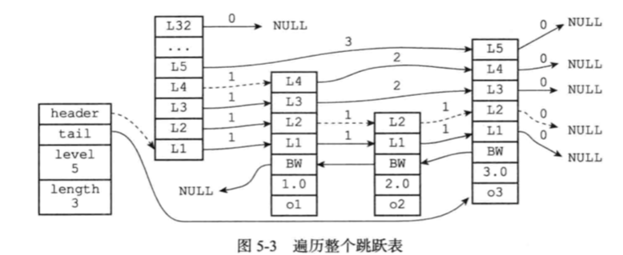
1）迭代程序首先访问跳跃表的第一个节点（表头），然后从第四层的前进指针移动到表中的第二个节点。
2）在第二个节点时，程序沿着第二层的前进指针移动到表中的第三个节点。
3）在第三个节点时，程序同样沿着第二层的前进指针移动到表中的第四个节点。
4）当程序再次沿着第四个节点的前进指针移动时，它碰到一个NULL，程序知道这时已经到达了跳跃表的表尾，于是结束这次遍历。

## 第6章 整数集合
当一个集合只包含整数值元素时，Redis就会使用整数集合作为集合键的底层实现。
整数集合的数据结构
```
typedef struct intset {
  //编码方式，决定contents数组的类型，encoding的值是INTSET_ENC_INT16,那么代表contents数组的类型是int16_t类型
    uint32_t encoding;
//集合元素的个数，也就是contents数组的长度
    uint32_t length;
//contents数组会按照从小到大的顺序来存储集合元素
    int8_t contents[];
}intset;
```
下图是一个包含五个int16_t类型整数值的整数集合
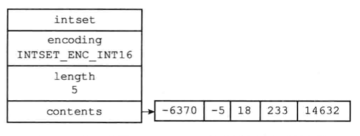

##### 升级
当我们将一个新元素添加到整数集合里面时，如果新元素的类型比整数集合的contents数组的类型要大时，会对集合进行升级。
升级步骤：
1）根据新元素的类型，扩展整数集合底层数组的空间大小，并为新元素分配空间。
2）将底层数组现有的所有元素都转换成与新元素相同的类型，并将类型转换后的元素放置到正确的位上，而且在放置元素的过程中，需要继续维持底层数组的有序性质不变，升级后的元素在数组中存储的位置也是按照从小到大排序的。
3）将新元素添加到底层数组里面。
##### 升级的好处
1.提升灵活性。
因为C语言是静态类型语言，为了避免类型错误，我们通常不会将两种不同类型的值放在同一个数据结构里面。整数集合可以通过自动升级底层数组来适应新元素，所以我们可以随意地将int16_t、int32_t或者int64_t类型的整数添加到集合中，而不必担心出现类型错误，这种做法非常灵活。
2.节约内存
要让一个数组可以同时保存int16_t、int32_t、int64_t三种类型的值，最简单的做法就是直接使用int64_t类型的数组作为整数集合的底层实现。不过这样一来，即使添加到整数集合里面的都是int16_t类型或者int32_t类型的值，数组都需要使用int64_t类型的空间去保存它们，从而出现浪费内存的情况。而整数集合现在的做法既可以让集合能同时保存三种不同类型的值，又可以确保升级操作只会在有需要的时候进行，这可以尽量节省内存。
##### 降级
整数集合不支持降级操作，一旦对数组进行了升级，编码就会一直保持升级后的状态。

## 第7章 压缩列表
压缩列表是Redis为了节约内存而开发的，是由一系列特殊编码的连续内存块组成的顺序型（sequential）数据结构。一个压缩列表可以包含任意多个节点（entry），每个节点可以保存一个字节数组或者一个整数值，它是列表键和哈希键的底层实现之一。
列表
当一个列表键只包含少量列表项，并且每个列表项要么就是小整数值，要么就是长度比较短的字符串，那么Redis就会使用压缩列表来做列表键的底层实现。
哈希表
当一个哈希键只包含少量键值对，比且每个键值对的键和值要么就是小整数值，要么就是长度比较短的字符串，那么Redis就会使用压缩列表来做哈希键的底层实现。
##### 压缩列表构成
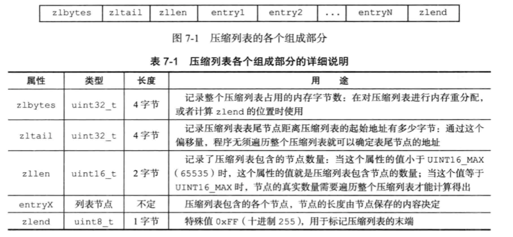
下图展示了一个包含三个节点的压缩列表
列表zlbytes属性的值为0x50（十进制80），表示压缩列表的总长为80字节。
列表zltail属性的值为0x3c（十进制60），这表示如果我们有一个指向压缩列表起始地址的指针p，那么只要用指针p加上偏移量60，就可以计算出表尾节点entry3的地址。
列表zllen属性的值为0x3（十进制3），表示压缩列表包含三个节点。
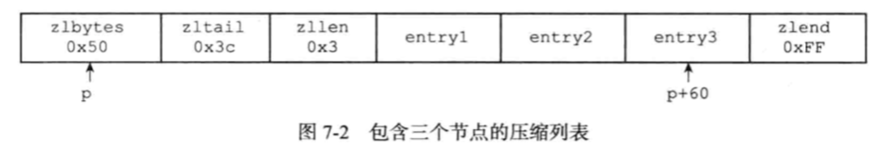

###### 压缩表节点构成
每个压缩列表节点都由previous_entry_length、encoding、content三个部分组成，每个压缩列表节点可以保存一个字节数组或者一个整数值，其中，字节数组可以是以下三种长度的其中一种：
·长度<=63（2^6–1）字节的字节数组；
·长度<=16383（2^14–1）字节的字节数组；
·长度<=4294967295（2^32–1）字节的字节数组；
而整数值则可以是以下六种长度的其中一种：
·4位长，介于0至12之间的无符号整数；
·1字节长的有符号整数；
·3字节长的有符号整数；
·int16_t类型整数；
·int32_t类型整数；
·int64_t类型整数。
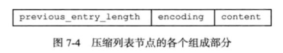

##### previous_entry_length
因为节点的previous_entry_length属性记录了前一个节点的长度，所以程序可以通过指针运算，根据当前节点的起始地址来计算出前一个节点的起始地址。
·如果前一节点的长度<=254字节，那么previous_entry_length属性的长度为1字节：前一节点的长度就保存在这一个字节里面。
·如果前一节点的长度>=254字节，那么previous_entry_length属性的长度为5字节：其中属性的第一字节会被设置为0xFE（十进制值254），而之后的四个字节则用于保存前一节点的长度。
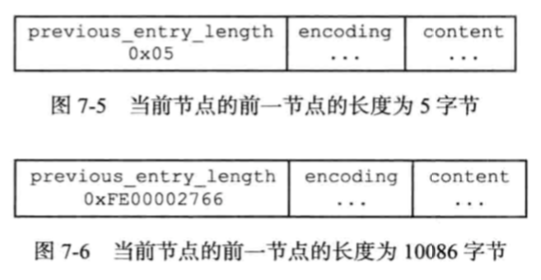
图7-5展示了一个包含一字节长previous_entry_length属性的压缩列表节点，属性的值为0x05，表示前一节点的长度为5字节。
图7-6展示了一个包含五字节长previous_entry_length属性的压缩节点，属性的值为0xFE00002766，其中值的最高位字节0xFE表示这是一个五字节长的previous_entry_length属性，而之后的四字节0x00002766（十进制值10086）才是前一节点的实际长度。

##### encoding
节点的encoding属性记录了节点的content属性所保存数据的类型以及长度：
·一字节、两字节或者五字节长，值的最高位为00、01或者10的是字节数组编码：这种编码表示节点的content属性保存着字节数组，数组的长度由编码除去最高两位之后的其他位记录；
·一字节长，值的最高位以11开头的是整数编码：这种编码表示节点的content属性保存着整数值，整数值的类型和长度由编码除去最高两位之后的其他位记录；
下图中表7-2记录了所有可用的字节数组编码，而表7-3则记录了所有可用的整数编码”
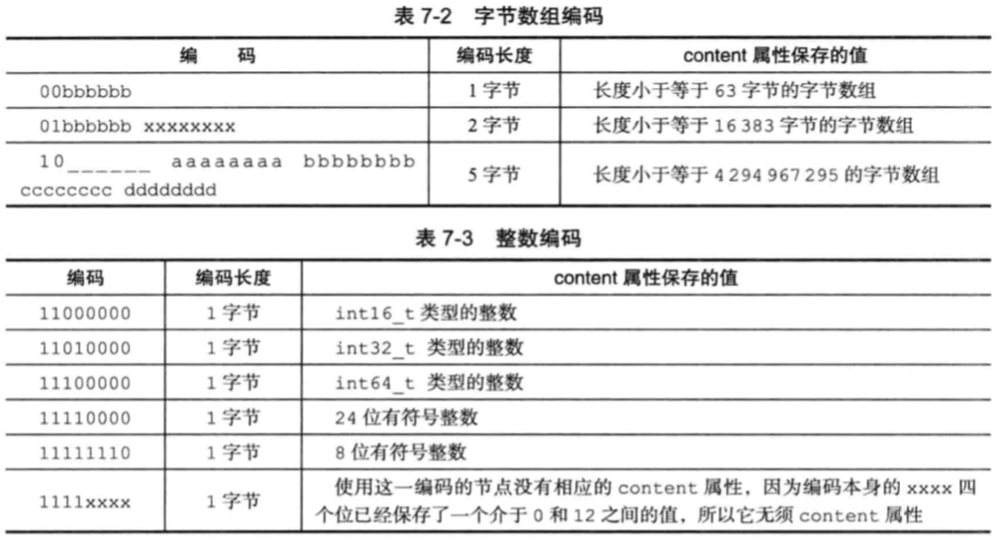

##### content
节点的content属性负责保存节点的值，节点值可以是一个字节数组或者整数，值的类型和长度由节点的encoding属性决定。
下图中展示了一个保存字节数组的节点示例：
·编码的最高两位00表示节点保存的是一个字节数组；
·编码的后六位001011记录了字节数组的长度11；
·content属性保存着节点的值"hello world"。
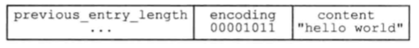
下图中展示了一个保存整数值的节点示例
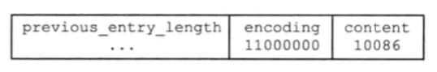

##### 连锁更新
前面说过，每个节点的previous_entry_length属性都记录了前一个节点的长度：
·如果前一节点的长度小于254字节，那么previous_entry_length属性需要用1字节长的空间来保存这个长度值。
·如果前一节点的长度大于等于254字节，那么previous_entry_length属性需要用5字节长的空间来保存这个长度值。
现在，考虑这样一种情况：在一个压缩列表中，有多个连续的、长度介于250字节到253字节之间的节点e1至eN，因为e1至eN的所有节点的长度都小于254字节，所以记录这些节点的长度只需要1字节长的previous_entry_length属性，换句话说，e1至eN的所有节点的previous_entry_length属性都是1字节长的。
这时，如果我们将一个长度大于等于254字节的新节点new设置为压缩列表的表头节点，那么new将成为e1的前置节点，因为e1的previous_entry_length属性仅长1字节，它没办法保存新节点new的长度，所以程序将对压缩列表执行空间重分配操作，并将e1节点的previous_entry_length属性从原来的1字节长扩展为5字节长。
现在，麻烦的事情来了，e1原本的长度介于250字节至253字节之间，在为previous_entry_length属性新增四个字节的空间之后，e1的长度有可能变成了介于254字节至257字节之间，这样的话，如果要让e2的previous_entry_length属性可以记录下e1的长度，程序需要再次对压缩列表执行空间重分配操作。“正如扩展e1引发了对e2的扩展一样，扩展e2也会引发对e3的扩展，而扩展e3又会引发对e4的扩展……为了让每个节点的previous_entry_length属性都符合压缩列表对节点的要求，程序需要不断地对压缩列表执行空间重分配操作，直到eN为止。
Redis将这种在特殊情况下产生的连续多次空间扩展操作称之为“连锁更新”（cascade update）
除了添加新节点可能会引发连锁更新之外，删除节点也可能会引发连锁更新。”
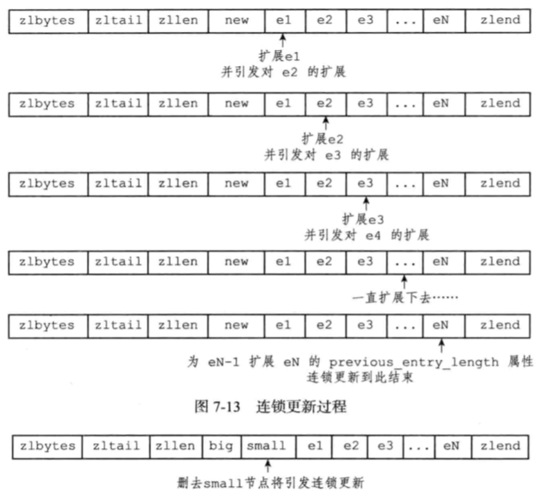
因为连锁更新在最坏情况下需要对压缩列表执行N次空间重分配操作，而每次空间重分配的最坏复杂度为O（N），所以连锁更新的最坏复杂度为O（N^2）。
要注意的是，尽管连锁更新的复杂度较高，但它真正造成性能问题的几率是很低的：
·首先，压缩列表里要恰好有多个连续的、长度介于250字节至253字节之间的节点，连锁更新才有可能被引发，在实际中，这种情况并不多见；
·其次，即使出现连锁更新，但只要被更新的节点数量不多，就不会对性能造成任何影响：比如说，对三五个节点进行连锁更新是绝对不会影响性能的；
因为以上原因，ziplistPush等命令的平均复杂度仅为O(N)，在实际中，我们可以放心地使用这些函数，而不必担心连锁更新会影响压缩列表的性能。

## 第8章 对象
Redis基于C语言实现了简单动态字符串，双端链表，字典，压缩列表，整数集合等数据结构，基于这些数据结构实现了五种对象，字符串对象，列表对象，哈希对象，集合对象，有序集合对象。
一个Redis对象至少包含type，encoding，ptr三个属性
```
typedef struct redisObject {
    //类型，区分对象是五种对象中的哪一张
   unsigned type:4;
    //编码
   unsigned encoding:4;
  //指向底层实现数据结构的指针 
   void *ptr;
  // ...
}
```
##### 类型
type取值范围如下：
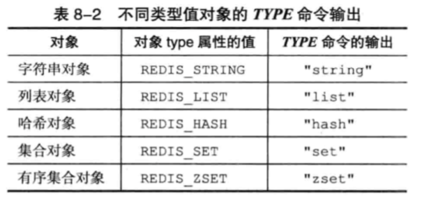

##### 编码和底层实现
Redis可以根据使用场景，对每种Redis对象使用不同底层数据结构来做为实现，而使用哪种数据结构作为底层实现用encoding属性标识
编码对应表如下：
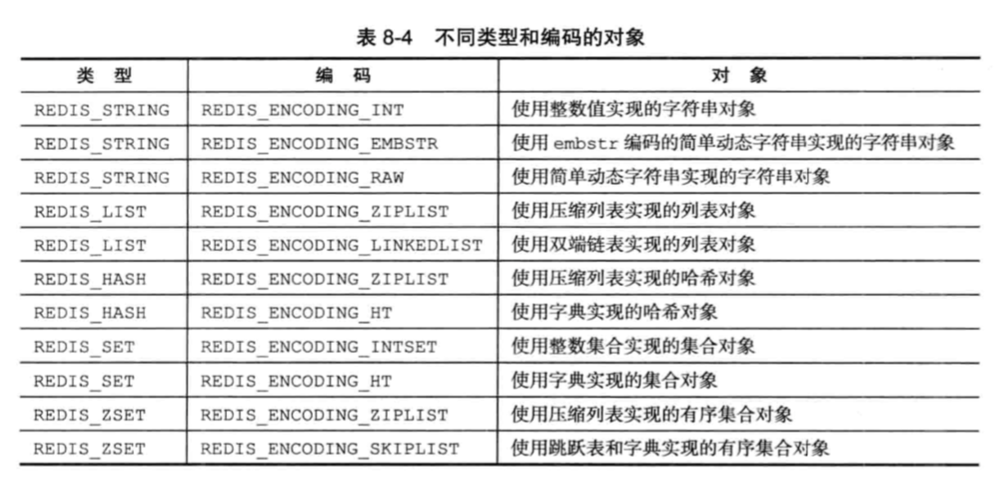

##### 字符串对象
字符串对象的编码可以是int，raw或者embstr，具体如下图所示：
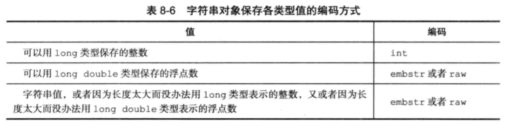

int
当字符串对象保存的是一个整数值，并且可以使用long类型表示，那么字符串对象就会把整数值保存在字符串对象的 ptr 属性里面。这样做的优点是：
 1、节省内存
 2、对于整数值的字符串对象可能会被执行INCR操作，SDS需要先将字符串转成整形，在执行加减操作，再将结果转成字符串保存如果底层保存一个整形变量就不需要做类型转换了(将void*转换成long)
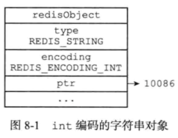

raw
如果字符串对象保存的是一个字符串，并且字符串值的长度大于32，那么字符串对象将使用一个简单动态字符串来保存这个字符串值，并将对象的编码设置为raw。
下图是一个使用raw编码的字符串对象
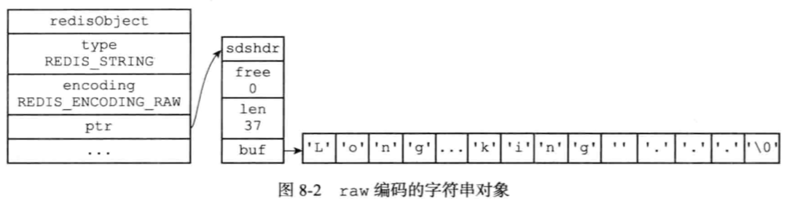

embstr
embstr编码是一种专门用于保存短字符串的优化编码方式，这种编码和raw编码一样，都是使用redisObject和sdshdr结构来表示字符串对象，但是raw编码会调用两次内存分配函数来分别创建redisObject和sdshdr结构，而embstr编码是通过调用一次内存分配函数来分配一块连续的空间。除此以外，因为所有数据都保存在一块连续的内存里面，可以更好利用缓存带来的优势。

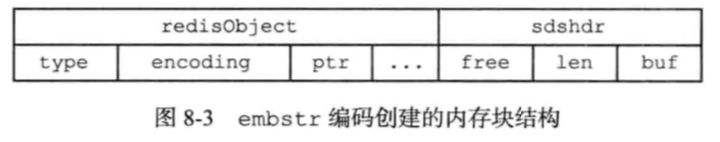

最后，如果是浮点数，在Redis中也是使用字符串来进行表示的，在有需要进行数值计算时，会将字符串转换为浮点数，然后进行计算。

##### 列表对象
列表对象的底层实现可以是ziplist或者linkedlist，当列表对象保存的字符串长度小于64字节时且元素个数小于512个时，列表对象会使用ziplist编码来实现，否则会使用linkedlist来实现。（这两个上限值可以通过配置参数修改）
下图是保存了1，"three"，5三个元素的列表对象，使用ziplist实现，
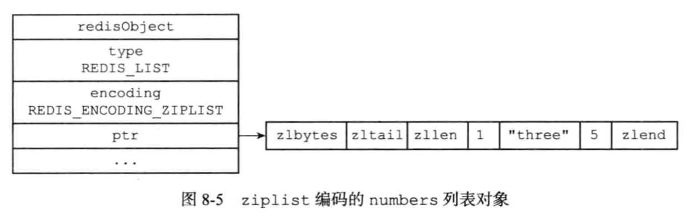

下图是保存了1，"three"，5三个元素的列表对象，使用linkedlist实现，linkedlist的双端链表结构包含了多个字符串对象，字符串对象是五种类型中唯一一种会被其他四种类型对象嵌套的对象。
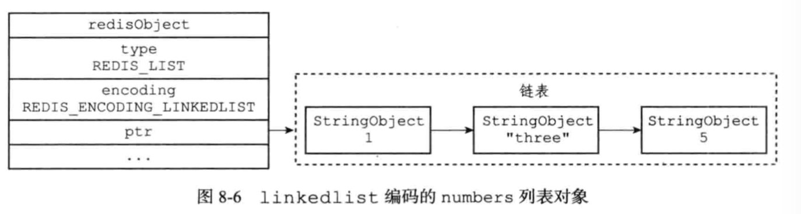

##### 哈希对象
哈希对象的底层实现可以是ziplist或者hashtable，当哈希对象保存的字符串长度小于64字节时且元素个数小于512个时，哈希对象会使用ziplist编码来实现，否则会使用hashtable来实现。（这两个上限值可以通过配置参数修改）
当使用ziplist实现的列表对象时，当有新的键值对要加入到哈希表时，Redis会先将键推入压缩列表表尾，然后再将值加入压缩列表表尾，保证同一键值对的两个节点紧挨在一起。如下图所示：

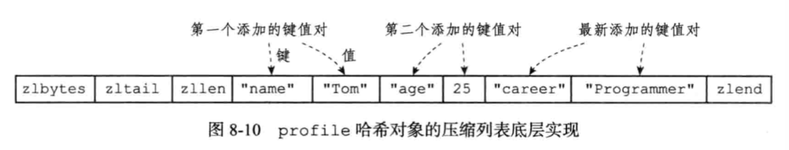
当使用hashtable实现哈希对象时，哈希对象中的每个键值对都是使用一个字典键值对来保存，字典的每个键和值都是一个字符串对象，如下图所示：
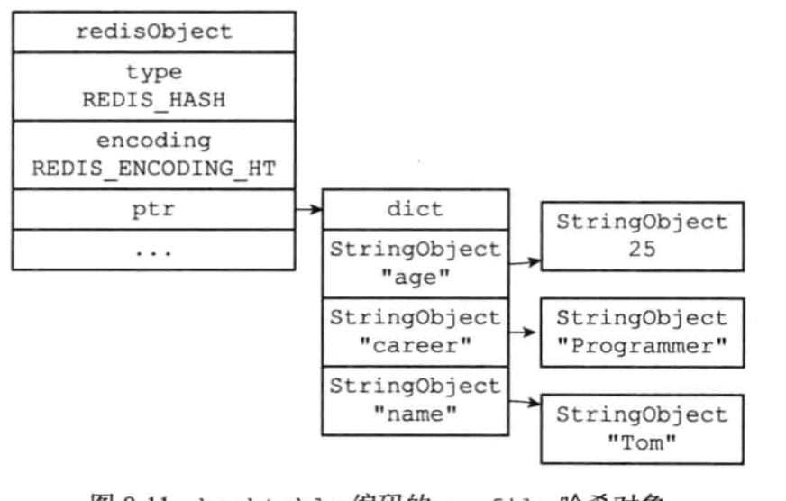

##### 集合对象
集合对象的底层实现可以是inset或者hashtable，当集合对象保存的都是整数值且元素个数小于512个时，集合对象会使用inset编码来实现，否则会使用hashtable来实现。（这两个上限值可以通过配置参数修改）
inset编码的集合对象使用整数集合作为底层实现，所有元素都保存在整数集合里面。如下图所示：
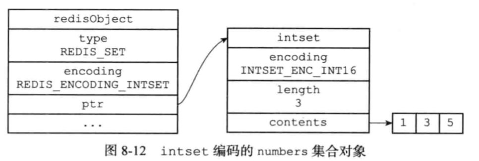
hashtable编码的结婚对象使用字典作为底层实现，字典的每个键是一个字符串对象，保存集元素，字典的值则全部被设置为NULL。如下图所示：
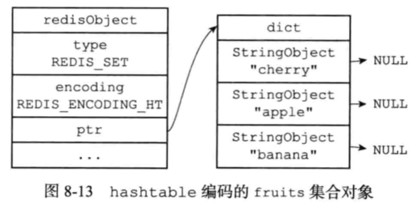

##### 有序集合对象
有序集合对象的底层实现可以是ziplist或者skiplist，当有序集合对象保存的元素长度都小于64字节且元素个数小于512个时，集合对象会使用ziplist编码来实现，否则会使用skiplist来实现。（这两个上限值可以通过配置参数修改）
ziplist
当有序集合对象使用ziplist作为底层实现时，每个集合元素使用两个挨在一起的压缩列表节点报错，第一个节点保存元素的成员，第二个节点保存元素的分值，压缩列表内按分值从小到大排序，分值较小的放置在靠近表头的位置，分值较大的放置在靠近表尾的方向。如下图所示：

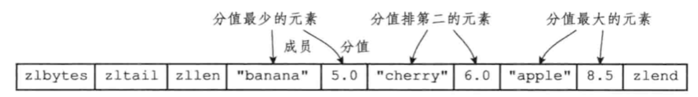
skiplist
skiplist编码的有序集合对象使用zset结构作为底层实现，一个在set结构同时包含一个字典和一个跳跃表：

```
typedef struct zset {
  zskiplist *zsl;
  dict *dict;
} zset;
```
zset结构中的zsl跳跃表按分值从小到大保存了所有集合元素，每个跳跃表节点保存了一个集合元素，跳跃表节点object属性保存了元素的成员，score属性保存了分值。可以以O(NlogN)的复杂度来实现范围型查找操作
zset结构中的dict字典为有序结合创建了一个从成员到分支的映射，字典的键保存了元素的成员，值保存了元素的分值。
有序集合之所以采用字典和跳跃表两个数据结构的原因是字典可以以O(1)复杂度查找成员的分值，而跳跃表可以以O(NlogN)的复杂度来实现范围型查找操作，缺一不可。
有序集合如下图所示：
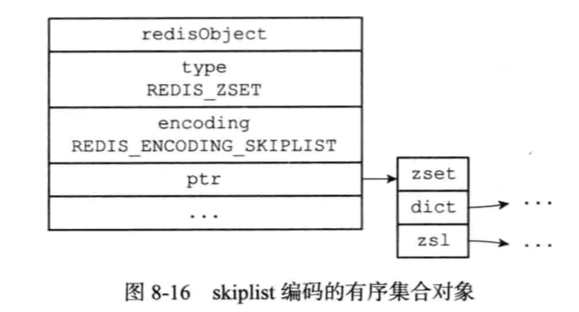

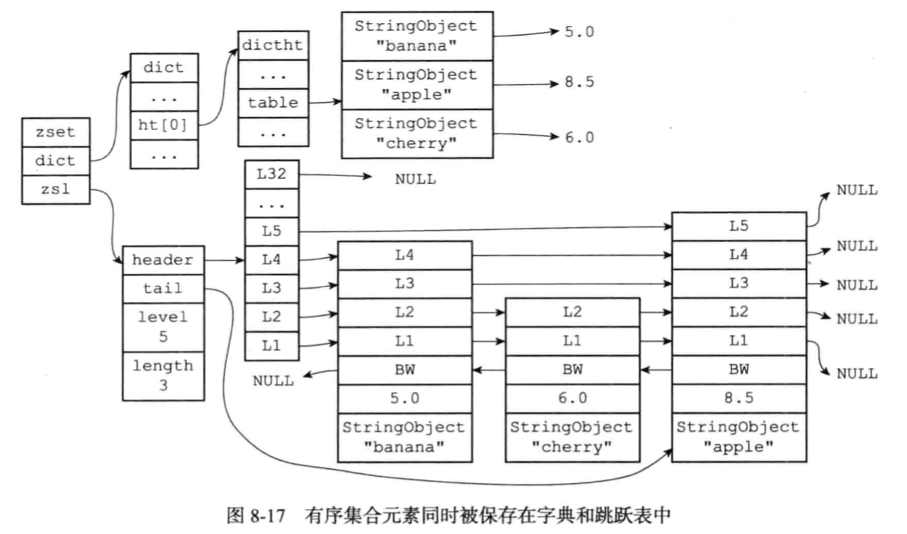

##### 对象共享
当一个键已经创建了一个整数值的字符串对象时，后续其他键也需要这个整数值的字符串对象时，不会重新创建一个新的整数值的字符串对象，而是将字符串对象的引用计数加一，两个键一起使用这些共享对象。Redis会在初始化服务器时，创建一万个字符串对象，这些对象包含了从0到9999的所有整数值）
这些共享对象不单单只有字符串键可以使用，那些在数据结构中嵌套了字符串对象的对象（linkedlist编码的列表对象、hashtable编码的哈希对象、hashtable编码的集合对象，以及zset编码的有序集合对象）都可以使用这些共享对象。
目前对象共享只对保存整数值的字符串对象有效，因为当服务器考虑将一个共享对象设置为键的值对象时，程序需要先检查给定的共享对象和键想创建的目标对象是否完全相同，只有在共享对象和目标对象完全相同的情况下，程序才会将共享对象用作键的值对象，而一个共享对象保存的值越复杂，验证共享对象和目标对象是否相同所需的复杂度就会越高，消耗的CPU时间也会越多。
如果共享对象是保存整数值的字符串对象，那么验证操作的复杂度为O（1）；
如果共享对象是保存字符串值的字符串对象，那么验证操作的复杂度为O（N）；
如果共享对象是包含了多个值（或者对象的）对象，比如列表对象或者哈希对象，那么验证操作的复杂度将会是O（N 2）。
##### 对象空转时长
除了前面介绍过的type、encoding、ptr和refcount四个属性之外，redisObject结构包含的最后一个属性为lru属性，该属性记录了对象最后一次被命令程序访问的时间。
键的空转时长主要用于内存回收，如果服务器打开了maxmemory选项，并且服务器用于回收内存的算法为volatile-lru或者allkeys-lru，那么当服务器占用的内存数超过了maxmemory选项所设置的上限值时，空转时长较高的那部分键会优先被服务器释放，从而回收内存。


## 第9章 数据库
Redis是一个键值对数据库服务器，服务器默认会创建16个数据库。可以使用SELECT命令进行数据库切换，例如 SELECT 2切换到数据2号数据库。
数据库键空间
每个数据库都使用redisDb接个进行表示
```
typedef struct redisDb {
  dict *dict;
}
```
dict保存了数据库中的所有键值对，每个键都是字符串对象，每个值可以是字符串对象，列表对象，哈希表对象，集合对象，有序集合对象。
下图是数据库键空间例子，
·alphabet是一个列表键，键的名字是一个包含字符串"alphabet"的字符串对象，键的值则是一个包含三个元素的列表对象。
·book是一个哈希表键，键的名字是一个包含字符串"book"的字符串对象，键的值则是一个包含三个键值对的哈希表对象。
·message是一个字符串键，键的名字是一个包含字符串"message"的字符串对象，键的值则是一个包含字符串"hello world"的字符串对象。
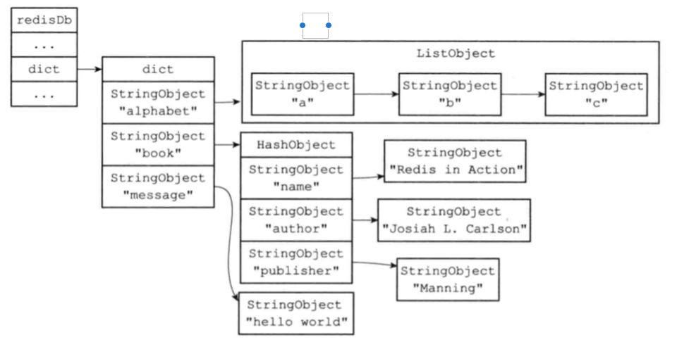

##### 读写键空间的维护操作
(1)读写一个建时，会根据键是否存在来更新键空间命中次数和不命中次数
(2)如果读写的键存在，那么会更新建的LRU(最近一次的使用时间)
(3)如果读写的键已过期，会先删除这个过期键，然后执行其他操作
(4)如果有客户端使用WATCH命令监视了某个键，那么服务器在对被监视的键进行修改之后，会将这个键标记为脏（dirty），从而让事务程序注意到这个键已经被修改过
(5)服务器每次修改一个键之后，都会对脏（dirty）键计数器的值增1，这个计数器会触发服务器的持久化以及复制操作
(6)如果服务器开启了数据库通知功能，那么在对键进行修改之后，服务器将按配置发送相应的数据库通知
##### 设置过期时间
通过EXPIRE命令或者PEXPIRE命令，客户端可以以秒或者毫秒精度为数据库中的某个键设置生存时间（Time To Live，TTL）
redisDb结构的expires字典保存了数据库中所有键的过期时间，过期字典的键是一个指针，这个指针指向键空间中的某个键对象（也即是某个数据库键）。过期字典的值是一个long long类型的整数，这个整数保存了键所指向的数据库键的过期时间——一个毫秒精度的UNIX时间戳。
下图展示了一个带有过期字典的数据库例子：
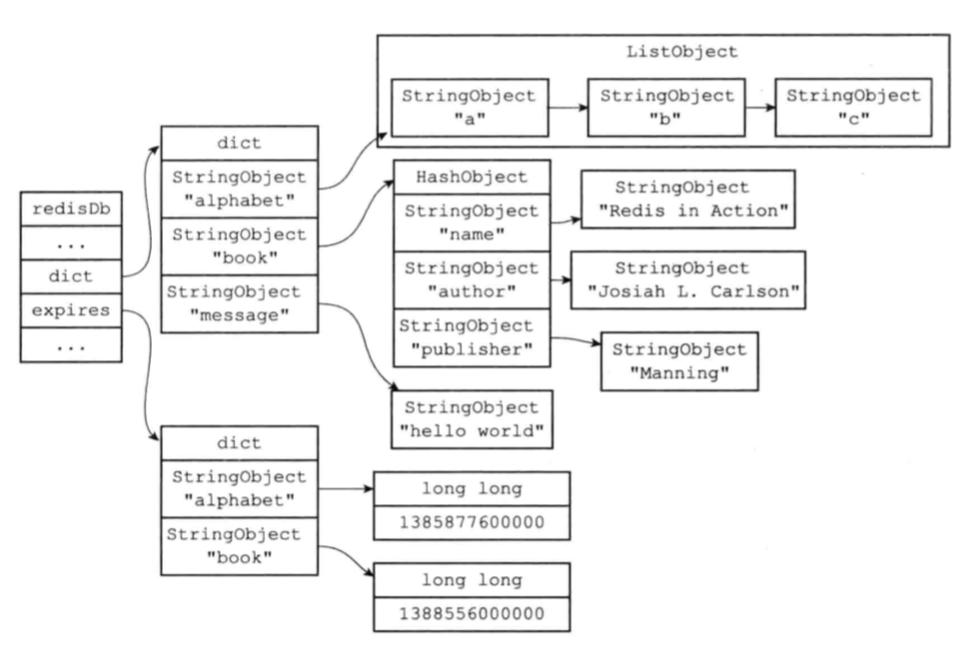
第一个键值对的键为alphabet键对象，值为1385877600000，这表示数据库键alphabet的过期时间为1385877600000（2013年12月1日零时）。
·第二个键值对的键为book键对象，值为1388556000000，这表示数据库键book的过期时间为1388556000000（2014年1月1日零时）。

##### 其他命令
使用PERSIST命令可以移除一个键的过期时间。
```
redis> PEXPIREAT message 1391234400000
(integer) 1
redis> TTL message
(integer) 13893281
redis> PERSIST message
(integer) 1
redis> TTL message
(integer) -1
```
TTL命令以秒为单位返回键的剩余生存时间，而PTTL命令则以毫秒为单位返回键的剩余生存时间
```
redis> PEXPIREAT alphabet 1385877600000
(integer) 1
redis> TTL alphabet
(integer) 8549007
redis> PTTL alphabet
(integer) 8549001011
```
##### 过期键删除策略
定时删除：设置键过期时间时创建定时器，键过期时，定时器会执行键删除操作。优点是节约内存，缺点是会占用很多CPU时间，创建一个定时器需要用到时间事件，而查找事件的复杂度为O(N)
惰性删除：每次获取键时，判断是否过期，如果过期进行删除。缺点是浪费内存。
定期删除：每个一段时间，检查数据库，删除里面的过期键。
Redis的过期键删除策略是采用惰性删除和定期删除相结合的方式，每次读写键时会判断键是否过期，如果过期会对键进行删除。并且会定期在一个规定时间内，多次遍历各个数据库，从expires字典中随机检查一定数量的键的过期时间，如果过期会对键进行删除。（默认会检查16个数据库，对每个数据库随机检查20个键）
##### AOF、RDB和复制功能对过期键的处理
生成RDB文件
在执行SAVE命令或者BGSAVE命令创建一个新的RDB文件时，Redis会对键进行检查，过期的键不会被保存到新创建的RDB文件中去。
载入RDB文件
主服务器：不会载入过期的建
从服务器：会载入所有键，包含过期的键
因为主从服务器进行数据同步时，从服务器的数据库就会被清空
AOF文件写入
当服务器以AOF持久化模式运行时，如果数据库中的某个键已经过期，但它还没有被惰性删除或者定期删除，那么AOF文件不会因为这个过期键而产生任何影响。
当过期键被惰性删除或者定期删除之后，程序会向AOF文件追加（append）一条DEL命令，来显式地记录该键已被删除。
AOF重写
和生成RDB文件时类似，在执行AOF重写的过程中，程序会对数据库中。
复制
当服务器运行在复制模式下时，从服务器的过期键删除动作由主服务器控制：
·主服务器在删除一个过期键之后，会显式地向所有从服务器发送一个DEL命令，告知从服务器删除这个过期键。
·从服务器在执行客户端发送的读命令时，即使碰到过期键也不会将过期键删除，而是继续像处理未过期的键一样来处理过期键。
·从服务器只有在接到主服务器发来的DEL命令之后，才会删除过期键。
通过由主服务器来控制从服务器统一地删除过期键，可以保证主从服务器数据的一致性，也正是因为这个原因，当一个过期键仍然存在于主服务器的数据库时，这个过期键在从服务器里的复制品也会继续存在。
##### 数据库通知
键空间通知主要监听某个键执行哪些命令。
以下代码展示了客户端如何获取0号数据库中针对message键执行的所有命令,根据发回的通知显示，先后共有SET、EXPIRE、DEL三个命令对键message进行了操作。
```
127.0.0.1:6379> SUBSCRIBE _ _keyspace@0_ _:message
Reading messages... (press Ctrl-C to quit)
1) "subscribe"  // 订阅信息
2) "__keyspace@0__:message"     
3) (integer) 1  
1) "message"    //执行SET命令
2) "_ _keyspace@0_ _:message"   
3) "set"        
1) "message"    //执行EXPIRE命令
2) "_ _keyspace@0_ _:message"   
3) "expire"     
1) "message"    //执行DEL命令
2) "_ _keyspace@0_ _:message"   
3) "del"        
```
键事件通知主要是监听某个命令被哪些键执行了。
以下是一个键事件通知的例子，代码展示了客户端如何获取0号数据库中所有执行DEL命令的键，根据发回的通知显示，key、number、message三个键先后执行了DEL命令。
```
127.0.0.1:6379> SUBSCRIBE _ _keyevent@0_ _:del
Reading messages... (press Ctrl-C to quit)
1) "subscribe"  // 订阅信息
2) "_ _keyevent@0_ _:del"
3) (integer) 1
1) "message"    //键key执行了DEL命令
2) "_ _keyevent@0_ _:del"
3) "key"
1) "message"    //键number执行了DEL命令
2) "_ _keyevent@0_ _:del"
3) "number"
1) "message"    //键message执行了DEL命令
2) "_ _keyevent@0_ _:del"
3) "message"
```
##第10章 RDB持久化
RDB文件是保存了某个时间点数据库所有的键值对信息的压缩文件。
RDB文件的创建
可以使用SAVE命令创建RDB文件，在创建过程中，服务器进程会被阻塞，不能处理任何命令请求。
也可以使用BGSAVE命令创建RDB文件，会派生出一个子进程，然后由子进程创建RDB文件，父进程继续处理命令，父进程在修改数据时，数据所在的内存页会被复制，父进程改的是复制后的数据，不影响子进程生成RDB文件。
还原数据时的优先级
因为AOF更新频率比RDB高，所以在还原数据时，优先使用AOF进行数据还原，然后再使用RDB文件进行数据还原。还原数据时，服务器也是属于阻塞状态，无法处理请求。
生成RDB过程时的服务器状态
在执行BGSAVE过程中，客户端发送的SAVE命令，BGSAVE命令会被拒绝，客户端发送的BGREWRITEAOF命令会被延迟到BGSAVE命令执行完毕后执行。
BGREWRITEAOF执行过程中，客户端发送BGSAVE会被拒绝，BGREWRITEAOF和BGSAVE的工作都由子进程执行，操作中没有设密码冲突，主要是基于性能考虑。
自动间歇性保存
可以手动调用SAVE或BGSAVE命令生成RDB文件，也可以配置Redis服务器的save选项，让服务器在满足一定条件时自动执行BGSAVE命令，默认的save选项如下：
```
save 900 1
save 300 10
save 60 10000
```
也就是当服务器满足900秒内执行了10次修改命令，或300秒内执行了10次修改命令，或60秒内执行了10000次修改命令时，服务器自动执行BGSAVE命令。
```
struct redisServer {
    // ...
    // 
记录了保存条件的数组
    struct saveparam *saveparams;
    // ...
};
```
RedisServer使用saveparam数据结构来保存这些触发条件，
```
struct saveparam {
    // 秒数
    time_t seconds;
    // 修改数
    int changes;
};
```
如果save选项的值为以下条件时，那么服务器状态中的saveparams数组将会是下图的样子。
```
save 900 1
save 300 10
save 60 10000”
```
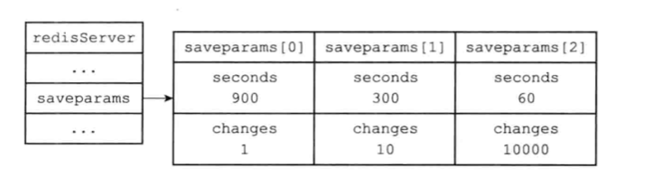
#####dirty计数器和lastsave属性
Redis执行了修改命令后，会对dirty计数器+1，lastsave属性记录了上次成功执行SAVE和BGSAVE命令的时间。
Redis的服务器周期性操作函数serverCron默认每隔100毫秒就会执行一次，该函数用于对正在运行的服务器进行维护，它的其中一项工作就是根据检查dirty计数器和lastsave属性来判断save选项所设置的保存条件是否已经满足，如果满足的话，就执行BGSAVE命令。
#####RDB文件结构
一个RDB文件由Redis字符串，db_version,database,EOF,check_sum五部分组成。如下图所示：

REDIS部分
RDB最开始的是REDIS部分，长度是5字节，保存了'REDIS'五个字符，用于载入文件时快速判断是否是RDB文件。
db_version部分
db_version是四个字节，存储的是RDB文件的版本号
databases部分
databases部分包含了零个或多个数据库，以及各个数据库里的键值对数据。如果所有数据为空，那么这部分长度为0字节。
EOF部分
EOF常量长度为1字节，标志这个RDB文件正文结束。
check_sum部分
check_sum是一个8字节长的无符号整数，保存着一个校验和，这个校验和是程序通过对REDIS、db_version、databases、EOF四个部分的内容进行计算得出的。服务器在载入RDB文件时，会将载入数据所计算出的校验和与check_sum所记录的校验和进行对比，以此来检查RDB文件是否有出错或者损坏的情况出现。

#####database部分
database部分会包含一个或多个数据库，如下图所示：
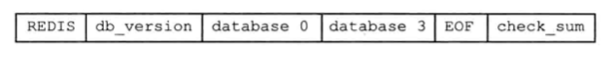
每个数据库由SELECTDB，db_number、key_value_pairs三个部分组成，

SELECTDB常量是一个字节，用于标识，接下来的内容是数据库号码。
db_number是一个数据库号码，可以是1字节，2字节或5字节。
key_value_pairs保存了数据库的所有键值对，键值对分为不包含过期时间的键值对和包含过期时间的键值对，如下图所示，

#####不包含过期时间的键值对
主要由type，key，value组成
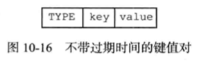
type取值范围由以下几种,在还原数据时，读取键值对时，程序会根据type的取值来解析后面value。

```
·REDIS_RDB_TYPE_STRING
·REDIS_RDB_TYPE_LIST
·REDIS_RDB_TYPE_SET
·REDIS_RDB_TYPE_ZSET
·REDIS_RDB_TYPE_HASH
·REDIS_RDB_TYPE_LIST_ZIPLIST
·REDIS_RDB_TYPE_SET_INTSET
·REDIS_RDB_TYPE_ZSET_ZIPLIST
·REDIS_RDB_TYPE_HASH_ZIPLIST
```
#####包含过期时间的键值对
由EXPIRETIME_MS，ms，TYPE，key，value组成
EXPIRETIME_MS是1字节，用于标识，告知程序接下来的内容是一个以毫秒为单位的过期时间，ms是过期时间。
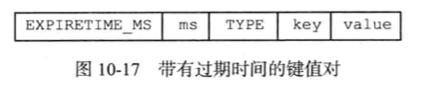
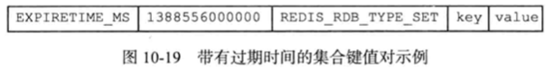

#####value的编码
value部分保存的是值对象，根据类型的不同，value部分的结构也不太一样。
#####字符串对象
字符串对象保存的是整数值时，
value结构如下：
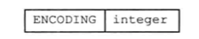
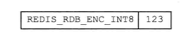
ENCODING可以是REDIS_RDB_ENC_INT8、REDIS_RDB_ENC_INT16或者REDIS_RDB_ENC_INT32三个常量的其中一个，它们分别代表RDB文件使用8位（bit）、16位或者32位来保存整数值integer
字符串对象保存的是字符串时，字节小于20字节时，会原样保存，否则会进行压缩，结构如下图所示：
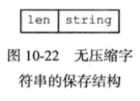
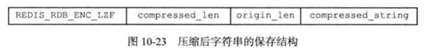
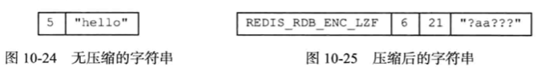
“REDIS_RDB_ENC_LZF常量标志着字符串已经被LZF算法压缩过了，读入程序在碰到这个常量时，会根据之后的compressed_len压缩字符串长度、origin_len原字符串长度和compressed_string压缩字符串三部分，对字符串进行解压缩。

#####列表对象

如果TYPE的值为REDIS_RDB_TYPE_LIST，那么value保存的就是一个REDIS_ENCODING_LINKEDLIST编码的列表对象，结构如下图所示，list_length记录了列表的长度，它记录列表保存了多少个项（item),读入程序可以通过这个长度知道自己应该读入多少个列表项。
图中以item开头的部分代表列表的项，因为每个列表项都是一个字符串对象，所以程序会以处理字符串对象的方式来保存和读入列表项。示例中第一个数字3是列表的长度，之后跟着的分别是第一个列表项、第二个列表项和第三个列表项，其中：
·第一个列表项的长度为5，内容为字符串"hello"。
·第二个列表项的长度也为5，内容为字符串"world"。
·第三个列表项的长度为1，内容为字符串"！"。

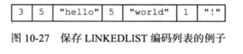

#####集合对象
如果TYPE的值为REDIS_RDB_TYPE_SET，那么value保存的就是一个REDIS_ENCODING_HT编码的集合对象，结构跟列表结构类似，也是集合大小，然后后面是集合元素。如下图所示。结构中的第一个数字4记录了集合的大小，之后跟着的是集合的四个元素：
·第一个元素的长度为5，值为"apple"。
·第二个元素的长度为6，值为"banana"。
·第三个元素的长度为3，值为"cat"。
·第四个元素的长度为3，值为"dog"。
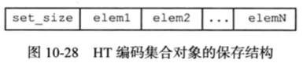
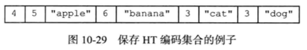

#####哈希表对象
如果TYPE的值为REDIS_RDB_TYPE_HASH，那么value保存的就是一个REDIS_ENCODING_HT编码的集合对象，由hash_size和key_value_pair组成。
·hash_size记录了哈希表的大小，也即是这个哈希表保存了多少键值对，读入程序可以通过这个大小知道自己应该读入多少个键值对。
·以key_value_pair开头的部分代表哈希表中的键值对，键值对的键和值都是字符串对象，所以程序会以处理字符串对象的方式来保存和读入键值对。

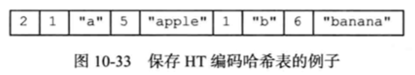

#####有序集合对象
如果TYPE的值为REDIS_RDB_TYPE_ZSET，那么value保存的就是一个REDIS_ENCODING_SKIPLIST编码的有序集合对象，结构如下图所示，
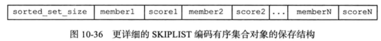
在下图中，第一个数字2记录了有序集合的元素数量，之后跟着的是两个有序集合元素：
·第一个元素的成员是长度为2的字符串"pi"，分值被转换成字符串之后变成了长度为4的字符串"3.14"。
·第二个元素的成员是长度为1的字符串"e"，分值被转换成字符串之后变成了长度为3的字符串"2.7"。”
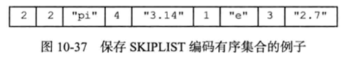

#####INTSET编码的集合
如果TYPE的值为REDIS_RDB_TYPE_SET_INTSET，那么value保存的就是一个整数集合对象，RDB文件保存这种对象的方法是，先将整数集合转换为字符串对象，然后将这个字符串对象保存到RDB文件里面。
如果程序在读入RDB文件的过程中，碰到由整数集合对象转换成的字符串对象，那么程序会根据TYPE值的指示，先读入字符串对象，再将这个字符串对象转换成原来的整数集合对象。
#####ZIPLIST编码的列表、哈希表或者有序集合
如果TYPE的值为REDIS_RDB_TYPE_LIST_ZIPLIST、REDIS_RDB_TYPE_HASH_ZIPLIST或者REDIS_RDB_TYPE_ZSET_ZIPLIST，那么value保存的就是一个压缩列表对象，RDB文件保存这种对象的方法是：
1）将压缩列表转换成一个字符串对象。
2）将转换所得的字符串对象保存到RDB文件。
如果程序在读入RDB文件的过程中，碰到由压缩列表对象转换成的字符串对象，那么程序会根据TYPE值的指示，执行以下操作：
读入字符串对象，并将它转换成type对应的压缩列表对象。
###AOF持久化
Redis服务器除了可以通过生成RDB文件来实现数据库持久化以外，还可以通过保存所有修改数据库的写命令请求来记录服务器的数据库状态，这就是AOF持久化。
#####命令追加
```
struct redisServer {
  sds aof_buf;
}
```
redis服务器执行一个写命令以后，会以Redis文本协议的方式将写命令写入字符串对象aof_buf的末尾，例如
那么服务器在执行这个SET命令之后，
```
redis> SET KEY VALUE
OK
```
会将以下协议内容追加到aof_buf缓冲区的末尾：
*3\r\n$3\r\nSET\r\n$3\r\nKEY\r\n$5\r\nVALUE\r\n
#####AOF文件写入和同步
Redis服务器进程是一个事件循环，会依次接收客户端的命令请求，向客户端发送命令回复，及执行定时任务。循环结束之前会调用flushAppendOnlyFile函数，判断是否需要将aof_buf缓冲区的内容写入和保存到AOF文件中去。
```
“def eventLoop():
    while True:
        # 处理文件事件，接收命令请求以及发送命令回复
        # 处理命令请求时可能会有新内容被追加到 aof_buf 缓冲区中
        processFileEvents()
        # 处理时间事件
        processTimeEvents()
        # 考虑是否要将 aof_buf 中的内容写入和保存到 AOF 文件里面
        flushAppendOnlyFile()
```
在现代操作系统中，为了提高文件写入效率，调用write函数时，并不立即将数据写入磁盘，而是将写入数据保存在一个内存缓冲区，当缓冲区满了或超过指定的时间，才真正将缓冲区的数据写入到磁盘。
所以flushAppendOnlyFile会根据服务器配置的appendfsync选项的值来决定同步的时机（也就是将数据真正写入磁盘中AOF文件的时机）
```
appendfsync的三种选项：
always：服务器在每个事件循环都将aof_buf中所有内容写入AOF文件，并且同步AOF文件。（意味着出现故障停机，最多损失数据也就是一个事件循环的数据）
everysec:服务器在每个事件循环都将aof_buf中所有内容写入AOF文件，子线程每隔1s同步AOF文件。（意味着出现故障停机，最多损失数据也就是1s的数据）
no：服务器在每个事件循环都将aof_buf中所有内容写入AOF文件，由操作系统决定同步时间。
```
#####AOF文件载入和还原
因为AOF文件里面包含了重建数据库状态所需的所有写命令，所以服务器只要读入并重新执行一遍AOF文件里面保存的写命令，就可以还原之前的数据库状态。
#####AOF文件重写
随着服务器的运行，执行过的写命令越来越多，AOF文件也会越来越大。Redis提供了AOF文件重写功能，通过对读取当前的服务器状态生成需要的写命令，写入到一个新的AOF文件，然后替换旧的AOF文件。
注意事项：
1.在目前版本中，REDIS_AOF_REWRITE_ITEMS_PER_CMD常量的值为64，这也就是说，一个写命令最多包含64个元素。如果一个集合键包含了超过64个元素，那么重写程序会用多条SADD命令来记录这个集合。
#####AOF后台重写
AOF重写命令aof_rewrite函数可以很好地完成创建一个新AOF文件的任务，但是，因为这个函数会进行大量的写入操作，所以调用这个函数的线程将被长时间阻塞，因为Redis服务器使用单个线程来处理命令请求，所以如果由服务器直接调用aof_rewrite函数的话，那么在重写AOF文件期间，服务期将无法处理客户端发来的命令请求。所以可以使用BGREWRITEAOF命令在后台进行aof文件重写。Redis会fork一个子进程对aof文件进行重写，父进程可以继续处理客户端的请求，当父进程执行写命令时，会对数据所在的内存页进行拷贝，修改的就是内存页的副本，不影响子进程的写入。在写入期间，当Redis服务器接收到写命令后，会进行如下操作：
1）执行客户端发来的命令。
2）将执行后的写命令追加到AOF缓冲区。（以防aof重写失败后，不影响旧的aof文件）。
3）将执行后的写命令追加到AOF重写缓冲区。（便于aof重写成功后，将重写期间执行的写命令添加到新的aof文件）。
当子进程完成AOF重写工作之后，它会向父进程发送一个信号，父进程在接到该信号之后，会调用一个信号处理函数，并执行以下工作：
1）将AOF重写缓冲区中的所有内容写入到新AOF文件中，这时新AOF文件所保存的数据库状态将和服务器当前的数据库状态一致。
2）对新的AOF文件进行改名，原子地（atomic）覆盖现有的AOF文件，完成新旧两个AOF文件的替换。
这个信号处理函数执行完毕之后，父进程就可以继续像往常一样接受命令请求了。
### 第13章 客户端
Redis服务器保存了一个clients属性，是一个链表，保存了所有与服务器连接的客户端的状态信息，对客户端批量操作，查找某个指定客户端，都可以通过遍历clients链表完成。
```
struct redisServer {
  list *client;
}
```
#####客户端属性
客户端状态包含的属性分为通用属性和与执行特定功能相关的属性。(比如操作数据库时需要用到的db属性和dictid属性，执行事务时需要用到的mstate属性，以及执行WATCH命令时需要用到的watched_keys属性等等）
```
typedef struct redisClient {
  int fd;//Socket描述符
  robj *name;//名称，不设置名字时，默认为NULL
  int flags;//标志，用于标识客户端的状态
  sds querybuf;//输入缓冲区
  robj **argv;//保存要执行的命令及传给命令的参数
  int argc;//记录argv数组的长度
  struct redisCommand *cmd;//将要执行的命令的实现
}
```
Socket描述符
fd是Socket描述符，会记录客户端正在使用的Socket描述符，一般是一个大于-1的整数，当为-1时，代表当前客户端是伪客户端，不需要Socket连接，(“会在两个地方用到伪客户端，一个用于载入AOF文件并还原数据库状态，而另一个则用于执行Lua脚本中包含的Redis命令)
以下是一些flags属性的例子：
```
# 客户端是一个主服务器
REDIS_MASTER
# 客户端正在被列表命令阻塞
REDIS_BLOCKED
# 客户端正在执行事务，但事务的安全性已被破坏
REDIS_MULTI | REDIS_DIRTY_CAS
# 客户端是一个从服务器，并且版本低于Redis 2.8 
REDIS_SLAVE | REDIS_PRE_PSYNC
# 这是专门用于执行Lua脚本包含的Redis命令的伪客户端
# 它强制服务器将当前执行的命令写入AOF文件，并复制给从服务器
REDIS_LUA_CLIENT | REDIS_FORCE_AOF| REDIS_FORCE_REPL
```
输入缓冲区
是一个Redis字符串对象，保存了客户端向服务端发送的命令，输入缓冲区的大小会根据输入内容动态地缩小或者扩大，但它的最大大小不能超过1GB，否则服务器将关闭这个客户端。“如果客户端向服务器发送了以下命令请求：
SET key value
那么客户端状态的querybuf属性将是一个包含以下内容的SDS值：
*3\r\n$3\r\nSET\r\n$3\r\nkey\r\n$5\r\nvalue\r\n
命令与命令参数
在服务器将客户端发送的命令请求保存到客户端状态的querybuf属性之后，服务器将对命令请求的内容进行分析，并将得出的命令参数以及命令参数的个数分别保存到客户端状态的argv属性和argc属性。如下图所示：
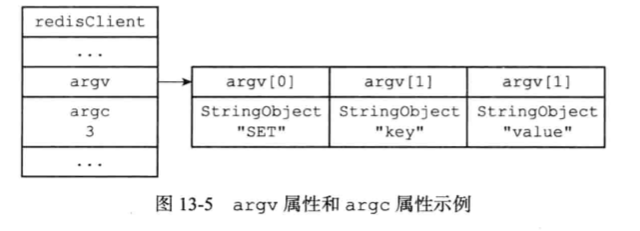
命令的实现函数
当服务器从协议内容中分析并得出argv属性和argc属性的值之后，服务器将根据项argv[0]的值，在命令表中查找命令所对应的命令实现函数，找到后将redisClient中的cmd属性指向对应的命令实现函数。
命令表是一个字典，字典的键是一个SDS结构，保存了命令的名字，字典的值是命令所对应的redisCommand结构，这个结构保存了命令的实现函数、命令的标志、命令应该给定的参数个数、命令的总执行次数和总消耗时长等统计信息。如下图所示：

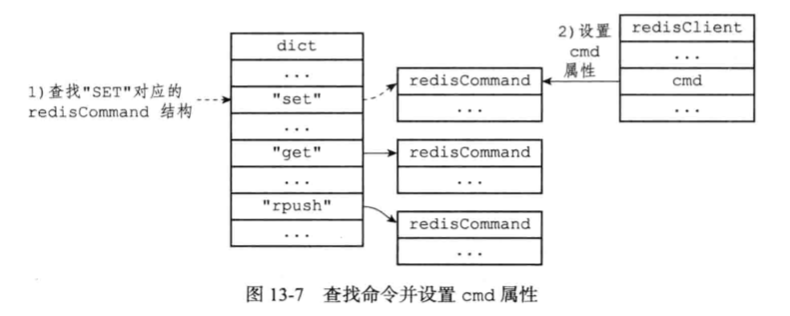

输出缓冲区
每个客户端都有两个输出缓冲区可用，一个缓冲区的大小是固定的，另一个缓冲区的大小是可变的，用于保存执行命令后的回复。
固定大小的缓冲区用于保存那些长度比较小的回复，比如OK、简短的字符串值、整数值、错误回复等等。
可变大小的缓冲区用于保存那些长度比较大的回复，比如一个非常长的字符串值，一个由很多项组成的列表，一个包含了很多元素的集合等等。
客户端的固定大小缓冲区由buf和bufpos两个属性组成：
typedef struct redisClient {
    char buf[REDIS_REPLY_CHUNK_BYTES];
    int bufpos;
} redisClient;
buf是一个大小为REDIS_REPLY_CHUNK_BYTES字节的字节数组，而bufpos属性则记录了buf数组目前已使用的字节数量。
REDIS_REPLY_CHUNK_BYTES常量目前的默认值为16*1024，也即是说，buf数组的默认大小为16KB。
身份验证
```
typedef struct redisClient {
    int authenticated;
}
```
redisClient的authenticated属性用于记录客户端是否通过了身份验证,authenticated的值为0，那么表示客户端未通过身份验证，只能服务器只会执行AUTH命令，其他命令都会被拒绝执行。
时间
```
typedef struct redisClient {
    time_t ctime;//ctime属性记录了创建客户端链接的时间
    time_t lastinteraction;//lastinteraction属性记录了客户端与服务器最后一次进行互动的时间
    time_t obuf_soft_limit_reached_time;//记录了输出缓冲区第一次到达软性限制（soft limit）的时间
}
```
客户端的创建与关闭
如果客户端是通过网络连接与服务器进行连接的普通客户端，那么在客户端使用connect函数连接到服务器时，服务器就会调用连接事件处理器（在第12章有介绍），为客户端创建相应的客户端状态，并将这个新的客户端状态添加到服务器状态结构clients链表的末尾。
一个普通客户端可以因为多种原因而被关闭，客户端进程退出或被杀死等，也可以是因为回复过大，占用过多的服务器资源，导致输出缓冲区超出范围，被执行相应的限制操作。有两种模式可以限制客户端输出缓冲区的大小
硬性限制，超出硬性限制所设置的大小时，立即关闭客户端。
软性限制，超出软性限制所设置的大小，但没有超过超出硬性限制所设置的大小时，会使用服务器将使用客户端状态结构的obuf_soft_limit_reached_time属性记录下客户端到达软性限制的起始时间；之后服务器会继续监视客户端，如果输出缓冲区的大小一直超出软性限制，并且持续时间超过服务器设定的时长，那么服务器将关闭客户端；相反地，如果输出缓冲区的大小在指定时间内，不再超出软性限制，那么客户端就不会被关闭，并且obuf_soft_limit_reached_time属性的值也会被清零。
伪客户端
服务器会在初始化时创建负责执行Lua脚本中包含的Redis命令的伪客户端，并将这个伪客户端关联在服务器状态结构的lua_client属性中，lua_client伪客户端在服务器运行的整个生命期中会一直存在，只有服务器被关闭时，这个客户端才会被关闭。在载入AOF文件时，服务器会创建用于执行AOF文件包含的Redis命令的伪客户端，并在载入完成之后，关闭这个伪客户端。
### 第14章 服务器
这一章主要讲服务器处理命令请求的整个过程及对serverCron函数的介绍。
##### 命令执行的过程
(以SET KEY VALUE命令为例)
1.用户在客户端输入了"SET KEY VALUE"命令，客户端会将命令请求转换为文本协议格式
*3\r\n$3\r\nSET\r\n$3\r\nKEY\r\n$5\r\nVALUE\r\n
然后通过连接到服务器的Socket，将文本协议格式的命令请求发送给服务器。
2.服务器通过Socket接收到文本协议格式的命令请求后，将其保存到redisClient的输入缓冲区。
3.对输入缓冲区中的命令请求进行分析，提取出相应的命令及命令请求的参数，将命令，命令参数保存到redisClient的argv数组中去，并且对argv数组的长度属性argc进行赋值。
4.调用命令执行器执行命令，命令执行器首先根据argv[0]的值去命令表中查找相应命令，并且将找到的命令保存到redisClient中的cmd属性里面。(命令表是一个字典，key保存了命令的名字，value则是redisCommand结构，保存了命令相关的信息，下面的图展示了redisCommand的属性及区分命令类型的sflags属性)
5.服务器已经将执行命令所需的命令实现函数（保存在客户端状态的cmd属性）、参数（保存在客户端状态的argv属性）、参数个数（保存在客户端状态的argc属性）都收集齐了，但是在真正执行命令之前，程序还需要进行检查（例如检查cmd属性的值是否为NULL），保证命令可以正确执行。
6.因为执行命令的实现保存在redisClient的cmd属性中，参数和参数个数保存在redisClient的argv，argc属性中，所以真正执行时，只要执行以下语句就行
```
client->cmd->proc(client);
```
7.实现函数执行完毕后，服务器还需要执行一些后续工作：
·如果服务器开启了慢查询日志功能，那么慢查询日志模块会检查是否需要为刚刚执行完的命令请求添加一条新的慢查询日志。
·根据刚刚执行命令所耗费的时长，更新被执行命令的redisCommand结构的milliseconds属性，并将命令的redisCommand结构的calls计数器的值增一。
·如果服务器开启了AOF持久化功能，那么AOF持久化模块会将刚刚执行的命令请求写入到AOF缓冲区里面。
·如果有其他从服务器正在复制当前这个服务器，那么服务器会将刚刚执行的命令传播给所有从服务器。
当以上操作都执行完了之后，服务器对于当前命令的执行到此就告一段落了，之后服务器就可以继续从文件事件处理器中取出并处理下一个命令请求了。
8.命令实现函数将命令回复保存到客户端的输出缓冲区里面，并为客户端的Socket关联命令回复处理器，当客户端套接字变为可写状态时，服务器就会执行命令回复处理器，将保存在客户端输出缓冲区中的命令回复发送给客户端。当命令回复发送完毕之后，回复处理器会清空redisClient的输出缓冲区，为处理下一个命令请求做好准备。
9.当客户端接收到协议格式的命令回复之后，它会将这些回复转换成人类可读的格式，并打印给用户观看。
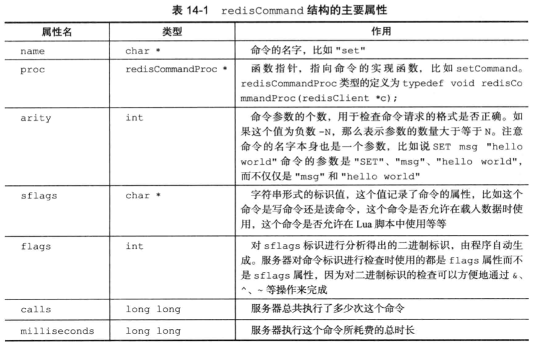
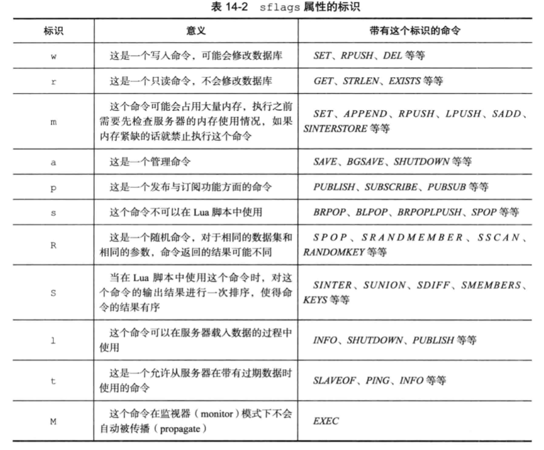

###serverCron函数
Redis服务器中的serverCron函数默认每隔100毫秒执行一次，这个函数负责管理服务器的资源，并保持服务器自身的良好运转，在serverCron函数中会对以下属性进行更新：
1.缓存的秒级精度系统时间和毫秒级精度系统时间（默认100毫秒更新一次）
2.缓存的lrulock属性，保存了服务器的LRU时钟，主要用于给对象计算键空转时间（空转时间=对象LRU时间-服务器的lrulock属性）。（默认10s更新一次）
3.更新服务器每秒执行命令次数instantaneous_ops_per_sec，是通过计算服务器每1毫秒内执行命令数*1000估算出来的。
4.更新服务器内存峰值记录。
5.在启动服务器时，Redis会为服务器进程的SIGTERM信号关联处理器sigtermHandler函数，这个信号处理器负责在服务器接到SIGTERM信号时，打开服务器状态的shutdown_asap标识，“每次serverCron函数运行时，程序都会对服务器状态的shutdown_asap属性进行检查，并根据属性的值决定是否关闭服务器。（关闭之前会进行RDB持久化）
6.管理客户端资源，serverCron函数每次执行都会调用clientsCron函数，clientsCron函数会对一定数量的客户端进行以下两个检查：
·如果客户端与服务器之间的连接已经超时（很长一段时间里客户端和服务器都没有互动），那么程序释放这个客户端。
·如果客户端在上一次执行命令请求之后，输入缓冲区的大小超过了一定的长度，那么程序会释放客户端当前的输入缓冲区，并重新创建一个默认大小的输入缓冲区，从而防止客户端的输入缓冲区耗费了过多的内存。
7.管理数据库资源。对数据库进行检查，删除过期键。
8.在服务器执行BGSAVE命令的期间，如果客户端向服务器发来BGREWRITEAOF命令，那么服务器会将BGREWRITEAOF命令的执行时间延迟到BGSAVE命令执行完毕之后，serverCron函数会检查是否有被延迟执行的BGREWRITEAOF命令，如果有，并且当前没有BGSAVE和BGREWRITEAOF命令在执行，那么就会执行BGREWRITEAOF命令。
9.持久化操作检查。serverCron函数会检查rdb_child_pid和aof_child_pid两个属性来判断当前是否在在进行持久化操作，在的话，执行wait3函数，检查子进程是否有信号发来服务器进程：
·如果有信号到达，那么表示新的RDB文件已经生成完毕（对于BGSAVE命令来说），或者AOF文件已经重写完毕（对于BGREWRITEAOF命令来说），服务器需要进行相应命令的后续操作，比如用新的RDB文件替换现有的RDB文件，或者用重写后的AOF文件替换现有的AOF文件。
·如果没有信号到达，那么表示持久化操作未完成，程序不做动作。
如果没有在进行持久化，那么会判断当前是否满足进行RDB持久话或者AOF持久化的条件，满足就执行相关操作。如下图所示：
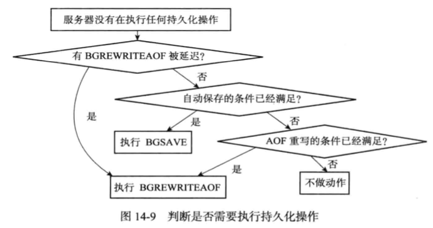
10.如果服务器开启了AOF持久化功能，并且AOF缓冲区里面还有待写入的数据，那么serverCron函数会调用相应的程序，将AOF缓冲区中的内容写入到AOF文件里面。
11.关闭异步客户端，服务器会关闭那些输出缓冲区大小超出限制的客户端。
12.增加cronloops计数器的值。服务器状态的cronloops属性记录了serverCron函数执行的次数，主要用于复制模块中实现“每执行serverCron函数N次就执行一次指定代码”的功能。

#####初始化服务器
一个Redis服务器从启动到能够接受客户端的命令请求，需要经过一系列的初始化和设置过程。主要由以下步骤：
1.初始化服务器状态结构
初始化服务器的第一步就是创建一个struct redisServer类型的实例变量server作为服务器的状态，并为结构中的各个属性设置默认值。
2.载入配置选项
在启动服务器时，用户可以通过给定配置参数或者指定配置文件来修改服务器的默认配置
3.初始化服务器数据结构
在之前执行initServerConfig函数初始化server状态时，程序只创建了命令表一个数据结构，不过除了命令表之外，服务器状态还包含其他数据结构。
4.还原数据库状态
在完成了对服务器状态server变量的初始化之后，服务器需要载入RDB文件或者AOF文件，并根据文件记录的内容来还原服务器的数据库状态。
5.以上步骤执行完后，开始执行事件循环。

