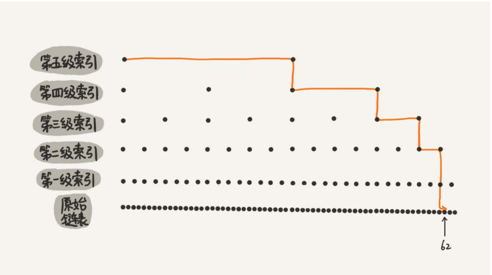
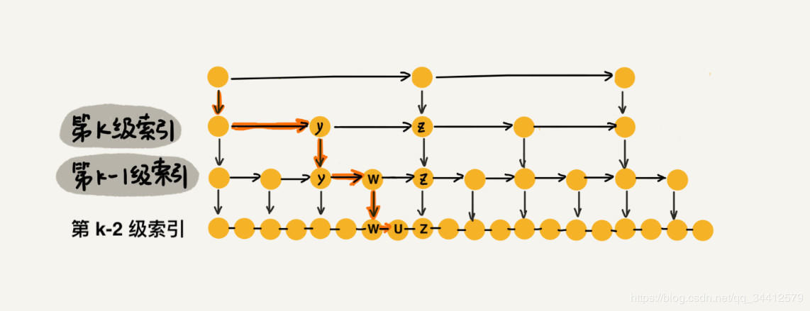
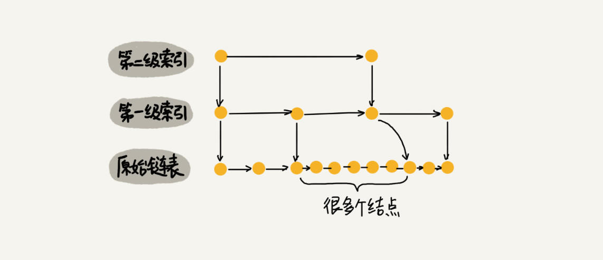
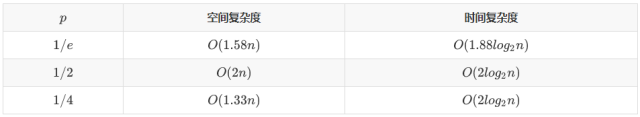

#### [1.Redis常见的数据结构有哪些？](#Redis常见的数据结构有哪些？)

#### [2.谈一谈你对Redis中简单动态字符串的理解？](#谈一谈你对Redis中简单动态字符串的理解？)

#### [3.谈一谈你对Redis中hash对象的理解？](#谈一谈你对Redis中hash对象的理解？)
#### [4.谈一谈你对Redis中List的理解？](#谈一谈你对Redis中List的理解？)
#### [5.谈一谈你对Redis中Set的理解？](#谈一谈你对Redis中Set的理解？)
#### [6.谈一谈你对Redis中有序集合ZSet的理解？](#谈一谈你对Redis中有序集合ZSet的理解？)

### Redis常见的数据结构有哪些？

Redis中主要的数据结构有字符串，Hash哈希表，List列表，Set集合，ZSet有序集合。
### 谈一谈你对Redis中简单动态字符串的理解？
Redis中的简单动态字符串其实是对C语言中的字符串的封装和优化，

##### 因为C语言的字符串有两个缺点：

1.不是二进制安全的（因为字符串以空字符作为结束的标志，字符串中间不能有空字符)。

2.频繁修改一个字符串时，会涉及到内存的重分配，比较消耗性能。（Redis中的简单动态字符串会有内存预分配和惰性空间释放）。

所以Redis中的简单动态字符串结构，除了包含一个字符数组的属性，还包含数组的长度，数组的实际使用长度等属性，通过增加长度属性，可以保证字符串是二进制安全的，从而可以保存任意类型的数据，例如一张图片，对象序列化后的数据等等。

##### 字符串使用场景如下：

1.字符串可以保存一些字符串数据，也可以保存一些数字类型的数据，所以可以使用INCR, DECR, INCRBY对数字进行加减，所以可以把字符串当成计数器使用。

2.同时因为在C语言中，每个字符是一个字节，是8个二进制位，所以可以把简单动态字符串作为一个位数组来使用，通过setbit，getbit命令来对位数组进行赋值，取值，可以以很小的空间来保存用户一年的每日签到数据，以及Redis中的布隆过滤器也是通过位数组来实现的。

##### 字符串的底层存储

在Redis中，每一个Value都是一个Redis对象，对应的都是RedisObject结构，在RedisObject结构中，保存了对象的类型type，底层的编码encoding等一些属性，也拥有一个ptr指针，指向对象具体的存储地址。
```
struct RedisObject {
    int4 type; 
    int4 encoding; 
    int24 lru; 
    int32 refcount; 
    void *ptr; 
} robj;
```
在Redis中，字符串有两种存储方式，int编码，embstr编码和raw编码。
##### int编码
当value是一个整数，并且可以使用long类型（8字节）来表示时，那么会属于int编码，ptr直接存储数值。（并且Redis会进行优化，启动时创建0~9999的字符串对象作为共享变量。）
##### embstr和raw编码
两种存储方式下，都RedisObject和SDS结构(简单动态字符串)来存储字符串，区别在于，embstr对象用于存储较短的字符串，embstr编码中RedisObject结构与ptr指向的SDS结构在内存中是连续的，内存分配次数和内存释放次数均是一次，而raw编码会分别调用两次内存分配函数来分别创建RedisObject结构和SDS结构。

### 谈一谈你对Redis中hash对象的理解？
在Redis中，value可以是一个hash表，底层编码可以是ziplist，也可以是hashtable（默认情况下，当元素小于512个时，底层使用ziplist存储数据）
#### ziplist
元素保存的字符串长度较短且元素个数较少时(小于64字节，个数小于512)，出于节约内存的考虑，hash表会使用ziplist作为的底层实现，ziplist是一块连续的内存，里面每一个节点保存了对应的key和value，然后每个节点很紧凑地存储在一起，优点是没有冗余空间，缺点插入新元素需要调用realloc扩展内存。（可能会进行内存重分配，将内容拷贝过去，也可能在原有地址上扩展）。

#### hashtable
元素比较多时就会使用hashtable编码来作为底层实现，这个时候RedisObject的ptr指针会指向一个dict结构，dict结构中的ht数组保存了ht[0]和ht[1]两个元素，通常使用ht[0]保存键值对，ht[1]只在渐进式rehash时使用。hashtable是通过链地址法来解决冲突的，table数组存储的是链表的头结点（添加新元素，首先根据键计算出hash值，然后与数组长度取模之后得到数组下标，将元素添加到数组下标对应的链表中去）。
```
struct dict {
    int rehashindex;
    dictht ht[2]; 
}
struct dictht {
    dictEntry** table; // 二维
    long size; // 第一维数组的长度 
    long used; // hash 表中的元素个数 ...
}
typedef struct dictEntry {
  //键  
  void *key;
  //值，可以是一个指针，也可以是一个uint64_t整数，也可以是int64_t的整数
  union {
    void *val;
    uint64_tu64;
    int64_ts64;
  } v；
  //指向下一个节点的指针
  struct dictEntry *next;
} dictEntry；
```

#### 渐进式rehash

进行当负载因子>=1时，会进行哈希表扩展操作（如果是在执行BGSAVE或BGREWRITEAOF命令期间，那么需要>=5才会进行扩展）。

进行当负载因子<0.1时，会进行哈希表收缩操作。

因为直接一次性完成rehash会对性能产生影响，所以可以渐进式rehash，具体执行步骤是:

##### 初始化
1.首先将对dict结构中ht[1]哈希表分配空间(大小取决于最接近实际使用空间的2的n次方幂)，然后将rehashindex属性设置为0。

##### 转移
2.然后每次对ht[0]中的元素查找，修改，添加时，除了执行指定操作外，还会将对应下标的所有键值对rehash到ht[1],并且会将rehashindex+1。

##### 更改指针指向
3.当ht[0]中所有键值对都是rehash到ht[1]中后，那么会ht[1]和ht[0]的指针值进行交换，将rehashindex设置为-1，代表rehash完成。
（整个rehash期间，查找，更新，删除会先去ht[0]中执行，没有才会到ht[1]中执行，新添加键值对是会被保存到ht[1]中）。

### 谈一谈你对Redis中List的理解？

在Redis中，存储的value可以是一个列表List，跟Java中的LinkedList很像，底层数据结构是一个链表，插入和删除很快，随机访问较慢，时间复杂度是O(N)。Java中的列表数据进行缓存时一般是序列化成JSON，以字符串的形式存储在Redis上，而不是使用Redis中的List来进行存储。Redis中的List可以作为一个队列来使用，也可以作为一个栈来使用。在实际使用中，常用来做异步队列使用，将可以延时处理的任务序列化成字符串塞进Redis的列表，另外一个线程从列表中轮询数据进行处理
#### quicklist

老版本中的Redis，元素较少时，使用ziplist来作为底层编码，元素较多时使用双向链表linkedList作为底层编码。因为链表每个节点需要prev，next指针，需要占用16字节，而且每个节点内存都是单独分配，加剧内存碎片化，所以新版本使用quiklist作为底层编码，quicklist的是一个双向链表，但是它的每一个节点是一个ziplist。（默认每个ziplist最大长度为8k字节）

### 谈一谈你对Redis中Set的理解？
Set是一个无序的，不重复的字符串集合，底层编码有inset和hashtable两种。

##### inset

当元素都为整数，且元素个数较少时会使用inset作为底层编码，inset结构中的有一个contents属性，content是是一个整数数组，从小到大保存了所有元素。

##### hashtable

当元素个数较多时，Set使用hashtable来保存元素，元素的值作为key，value都是NULL。

### 谈一谈你对Redis中有序集合ZSet的理解？
Zset与Set的区别在于每一个元素都有一个Score属性，并且存储时会将元素按照Score从低到高排列。底层是通过跳跃表实现的。

##### ziplist

当元素较少时，ZSet的底层编码使用ziplist实现，所有元素按照Score从低到高排序。

##### skiplist+dict

当元素较多时，使用skiplist+dict来实现，
skiplist存储元素的值和Score，并且将所有元素按照分值有序排列。便于以O(logN)的时间复杂度插入，删除，更新，及根据Score进行范围性查找。

dict存储元素的值和Score的映射关系，便于以O(1)的时间复杂度查找元素对应的分值。

### 布隆过滤器是什么？
布隆过滤器可以理解为一个有误差的set结构，使用布隆过滤器来判断元素是否存在其中时，如果返回结果是存在，实际可能存在也可能不存在，返回结果不存在时，实际结果肯定是不存在。布隆过滤器实际上是一个大型的位数组，添加key时，通过几个hash函数对key计算得到多个hash值，将每个hash值与布隆过滤器的位数组的size取模得到下标，然后将数组中这些下标位置的值都设置为1。

创建key为userid的布隆过滤器，0.01是误判率，10000是初始大小

```
127.0.0.1:6379> bf.reserve userid 0.01 100000
```

调用exist指令判断181920是否存在于布隆过滤器，如果返回0，不存在，那么说明一定不存在，如果返回1，代表可能存在，也可能不存在。

```
127.0.0.1:6379> bf.add userid '181920'
(integer) 1
```

参考链接：

https://blog.csdn.net/lifetragedy/article/details/103945885

### 谈一谈你对跳跃表的理解？

就是单链表的查找的时间复杂度为O(N)，为了提高查询效率，可增加一些索引节点，让查询时间复杂度降低为O(logN)。（只有底层单链表会保存节点数据，上层的节点之后保存几个索引项和分数，也就是向左指向前一个节点的索引，向右指向后一个节点的索引，向下指向上一级的索引。）

时间复杂度的推理过程可以认为，从每一级索引中两个节点中选一个节点作为下一级索引的节点，让下一级索引的节点数量为本级索引节点数量的一半。假设原始链表的长度为n，第一级索引节点个数为n/2,第二级为n/4，一直到最高层。
```
假设h为层数，f(h)为该层索引节点数量。
f(h)=n/(2^h)
而最高层的索引节点会是只有两个索引节点。
也就是f(maxH)=n/(2^maxH)=2，所以最大层数maxH= log(n) - 1层 ，加上单链表的层数，总层数也就是log(n)层。
例如我们的单链表是1-19的，建立的多层索引如下，
如果我们要查找19，一开始在第四层遍历1，发现19>1,向右走，发现19>9,那么需要到上一级索引去找，然后发现19>13，继续到下一层，一直到第一层，发现19>17，然后往右走遍历17，18，19
所以每一层遍历的节点其实是
1 9
9 13
13 15 17
17 18 19
所以每一层最多遍历的节点数是<=3,这是由于每一层索引节点数是上一层的节点数的一半来得到的，每两个节点的区间，在上一层中都是两个区间，就是第三层的 1  5区间对应上一层的1  3 区间和3  5 区间。
所以时间复杂度=总层数*每层遍历节点数=3logN,去掉常数后是log(N)

第四层 1               9 
第三层 1       5       9          13
第二层 1   3   5   7   9    11    13    15    17
第一层 1 2 3 4 5 6 7 8 9 10 11 12 13 14 15 16 17 18 19
```






但是这种全索引的结构有缺点，就是之后在插入新节点时，是没有办法为新节点添加一些新的索引节点的。所以有可能会导致一个小区间内有很多个节点，查找时近似于单链表，这样时间复杂度就变成O(N)了，所以Redis对跳跃表做了一些优化，可以简单认为会计算出一个随机数，代表这个添加添加的索引层数，然后进行添加。同时假设节点拥有k层索引的概率f(k)，节点拥有k-1层索引结构的概率为f(k-1)，f(k) = f(k-1)*P,假设p为1/2，那么也就是f(k)=f(k-1)\*0.5，那么第k层的索引节点数也就是为k-1层的0.5倍。最终索引结构跟上面的这种全索引结构是类似的，只是索引节点不一定分布均匀。空间复杂度=每一层索引节点数=n+n/2+n/4….=2n。Redis做了优化，发现P取1/4时，时间复杂度跟P取1/2是一样的，并且空间复杂度更低。

```
private int randomLevel() {
  int level = 1;
  // 当 level < MAX_LEVEL，且随机数小于设定的晋升概率时，level   1
  while (Math.random() < SKIPLIST_P && level < MAX_LEVEL)//MAX_LEVEL为32
    level += 1;
  return level;
}
```

新插入了很多节点后带来的问题：



时间复杂度与空间复杂度



参考链接：

https://mp.weixin.qq.com/s?src=11&timestamp=1596288497&ver=2496&signature=aMU7ZuVHPH9gm8nsLB7f4t9FKmR16T1fvFw0v7ysunLqiGzxM8N7SAtacGTyxFagRaIC5K0iws0uodub4SUYYxL9OgxXzy7Ns0fAMK4586dsnZTlaS2M9oIbQ9ygbN2B&new=1