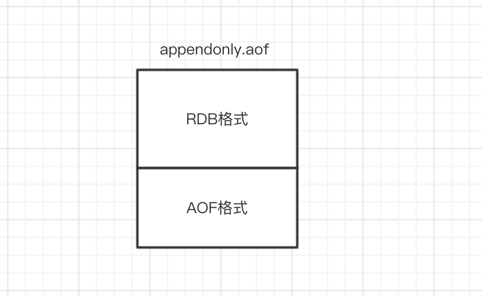

(PS：扫描[首页里面的二维码](README.md)进群，分享我自己在看的技术资料给大家，希望和大家一起学习进步！)

下面是主要是自己看完《Redis设计与实现》，《Redis深度历险：核心原理与应用实践》后，为了更好得掌握Redis，网上找了一些面试题，查阅书籍和资料后，写的解答。

#### [1.Redis的持久化是怎么实现的？](#Redis的持久化是怎么实现的？)

#### [2.AOF和RDB的区别是什么？](#AOF和RDB的区别是什么？)

#### [3.怎么防止AOF文件越来越大？](#怎么防止AOF文件越来越大？)
#### [4.Redis持久化策略该如何进行选择？](#Redis持久化策略该如何进行选择？)


### Redis的持久化是怎么实现的？
因为Redis是基于内存的数据库，一旦断电，所有实例都会关机，所有数据都会丢失，在运行期间，可以通过开启Redis的持久化功能，将数据写入磁盘，供实例重启时恢复数据。Redis的持久化主要通过AOF和RDB实现持久化。

#### AOF持久化

AOF持久化主要是Redis在修改相关的命令后，将命令添加到aof_buf缓存区（aof_buf是Redis中的SDS结构，SDS结构可以认为是对C语言中字符串的扩展）的末尾，然后在每次事件循环结束时，根据appendfsync的配置（always是每次事件循环都将aof_buf缓冲区的内容写入，everysec是每秒写入，no是根据操作系统来决定何时写入），判断是否需要将aof_buf写入AOF文件。生产环境中一般用默认配置everysec，也就是每秒写入一次，一旦挂机会丢掉1分钟的数据。

```c
struct redisServer {
 /* AOF buffer, written before entering the event loop */
 sds aof_buf;//aof_buf缓冲区其实就是Redis的一个简单动态字符串
 }
struct sdshdr {
    unsigned int len;
    unsigned int free;
    char buf[];
};
```

#### RDB持久化

##### 基本定义
RDB持久化指的是在满足一定的触发条件时（在一个的时间间隔内执行修改命令达到一定的数量，或者手动执行SAVE和BGSAVE命令），对这个时间点的数据库所有键值对信息生成一个压缩文件dump.rdb，然后将旧的删除，进行替换。（在Redis默认的配置下，RDB是开启的，AOF持久化是关闭的）

##### 实现原理
实现原理是fork一个子进程，然后对键值对进行遍历，生成rdb文件，在生成过程中，父进程会继续处理客户端发送的请求，当父进程要对数据进行修改时，会对相关的内存页进行拷贝，修改的是拷贝后的数据。（也就是COPY ON WRITE，写时复制技术，就是当多个调用者同时请求同一个资源，如内存或磁盘上的数据存储，他们会共用同一个指向资源的指针，指向相同的资源，只有当一个调用者试图修改资源的内容时，系统才会真正复制一份专用副本给这个调用者，其他调用者还是使用最初的资源,在CopyOnWriteArrayList的实现中，也有用到，添加或者插入一个新元素时过程是，加锁，对原数组进行复制，然后添加新元素，然后替代旧数组，解锁）

```java
	//CopyOnWriteArrayList的添加元素的方法
	public boolean add(E e) {
        final ReentrantLock lock = this.lock;
        lock.lock();
        try {
            Object[] elements = getArray();
            int len = elements.length;
            Object[] newElements = Arrays.copyOf(elements, len + 1);
            newElements[len] = e;
            setArray(newElements);
            return true;
        } finally {
            lock.unlock();
        }
    }
```

### AOF和RDB的区别是什么？

AOF因为是保存了所有执行的修改命令，粒度更细，进行数据恢复时，恢复的数据更加完整，但是由于需要对所有命令执行一遍，效率比较低，同样因为是保存了所有的修改命令，同样的数据集，保存的文件会比RDB大，而且随着执行时间的增加，AOF文件可能会越来越大，所有会通过执行BGREWRITEAOF命令来重新生成AOF文件，减小文件大小。Redis服务器故障重启后，默认恢复数据的方式首选是通过AOF文件恢复，其次是通过RDB文件恢复。

RDB是保存某一个时间点的所有键值对信息，所以恢复时可能会丢失一部分数据，但是恢复效率会比较高。

### 怎么防止AOF文件越来越大？
为了防止AOF文件越来越大，可以通过执行BGREWRITEAOF命令进行**AOF重写**，会fork子进程出来，读取当前数据库的键值对信息，生成所需的写命令，写入新的AOF文件。在生成期间，父进程继续正常处理请求，执行修改命令后，不仅会将命令写入aof_buf缓冲区，还会写入重写aof_buf缓冲区。当新的AOF文件生成完毕后，子进程父进程发送信号，父进程将重写aof_buf缓冲区的修改命令写入新的AOF文件，写入完毕后，对新的AOF文件进行改名，原子地（atomic）地替换旧的AOF文件。

AOF重写命令可以手动执行，在满足一些条件时，Redis也会自动触发。自动触发的条件如下：

1. 没有 BGSAVE 命令在执行。
2. 没有 BGREWRITEAOF 在执行。
3. 当前AOF文件大小 > server.aof_rewrite_min_size(默认为1MB)。
4. 当前AOF文件大小和最后一次AOF重写后的大小之间的比率大于等于指定的增长百分比(默认为1倍，100%，也就是当前AOF文件大小>=上次重写后文件的2倍后)

### Redis持久化策略该如何进行选择？
RDB持久化的特点是：
文件小，恢复快，不影响性能，实时性低，兼容性差（老版本的Redis不兼容新版本的RDB文件）
AOF持久化的特点是：
文件大，恢复慢，性能影响大，实时性高。是目前持久化的主流(主要是当前项目开发不太能接受大量数据丢失的情况)。
需要了解的是持久化选项的开启必然会造成一定的性能消耗。

两种持久化方式的缺点：

RDB持久化主要在于bgsave在进行fork操作时，会阻塞Redis的主线程。以及向硬盘写数据会有一定的I/O压力。

AOF持久化主要在于将aof_buf缓冲区的数据同步到磁盘时会有I/O压力，而且向硬盘写数据的频率会高很多。其次是，AOF文件重写跟RDB持久化类似，也会有fork时的阻塞和向硬盘写数据的压力。

#### 以下是几种持久化方案选择的场景：

##### 1.不需要考虑数据丢失的情况
那么不需要考虑持久化。

#####  2.单机实例情况下

可以接受丢失十几分钟及更长时间的数据，可以选择RDB持久化，对性能影响小，如果只能接受秒级的数据丢失，只能选择AOF持久化。

##### 3.在主从环境下

因为主服务器在执行修改命令后，会将命令发送给从服务器，从服务进行执行后，与主服务器保持数据同步，实现数据热备份，在master宕掉后继续提供服务。同时也可以进行读写分离，分担Redis的读请求。

那么在从服务器进行数据热备份的情况下，是否还需要持久化呢？
需要持久化，因为不进行持久化，主服务器，从服务器同时出现故障时，会导致数据丢失。（例如：机房全部机器断电）。如果系统中有自动拉起机制（即检测到服务停止后重启该服务）将master自动重启，由于没有持久化文件，那么master重启后数据是空的，slave同步数据也变成了空的。应尽量避免“自动拉起机制”和“不做持久化”同时出现。

所以一般可以采用以下方案：

主服务器不开启持久化，使得主服务器性能更好。

从服务器开启AOF持久化，关闭RDB持久化，并且定时对AOF文件进行备份，以及在凌晨执行bgaofrewrite命令来进行AOF文件重写，减小AOF文件大小。（当然如果对数据丢失容忍度高也可以开启RDB持久化，关闭AOF持久化）

##### 4.异地灾备

一般性的故障（停电，关机）不会影响到磁盘，但是一些灾难性的故障（地震，洪水）会影响到磁盘，所以需要定时把单机上或从服务器上的AOF文件，RDB文件备份到其他地区的机房。

### 什么是AOF文件追加阻塞？

修改命令添加到aof_buf之后，如果配置是everysec，那么会有一个线程每秒执行fsync操作，调用write写入磁盘一次，但是如果此时来了很多Redis请求，Redis主线程持续高速向aof_buf写入命令，硬盘的负载可能会越来越大，IO资源消耗更快，fsync操作可能会超过1s，aof_buf缓冲区堆积的命令会越来越多，所以Redis的处理逻辑是会对比上次fsync成功的时间，如果超过2s，则主线程阻塞直到fsync同步完成，所以最多可能丢失2s的数据，而不是1s。（每当 AOF 追加阻塞事件发生时，在 info Persistence 统计中，aof_delayed_fsync 指标会累加，查看这个指标方便定位 AOF 阻塞问题。）

### 什么是RDB-AOF混合持久化？

redis4.0相对与3.X版本其中一个比较大的变化是4.0添加了新的混合持久化方式。前面已经详细介绍了AOF持久化以及RDB持久化，这里介绍的混合持久化就是同时结合RDB持久化以及AOF持久化混合写入AOF文件。这样做的好处是可以结合 rdb 和 aof 的优点, 快速加载同时避免丢失过多的数据，缺点是 aof 里面的 rdb 部分就是压缩格式不再是 aof 格式，可读性差。

#### 开启混合持久化

4.0版本的混合持久化默认关闭的，通过aof-use-rdb-preamble配置参数控制，yes则表示开启，no表示禁用，默认是禁用的，可通过config set修改。

#### 混合持久化过程

了解了AOF持久化过程和RDB持久化过程以后，混合持久化过程就相对简单了。

混合持久化同样也是通过BGREWRITEAOF完成的，不同的是当开启混合持久化时，fork出的子进程先将共享的内存副本全量的以RDB方式写入aof文件，然后在将重写缓冲区的增量命令以AOF方式写入到文件，写入完成后通知主进程更新统计信息，并将新的含有RDB格式和AOF格式的AOF文件替换旧的的AOF文件。简单的说：新的AOF文件前半段是RDB格式的全量数据后半段是AOF格式的增量数据，如下图：



 

#### 数据恢复

当我们开启了混合持久化时，启动redis依然优先加载aof文件，aof文件加载可能有两种情况如下：

- aof文件开头是rdb的格式, 先加载 rdb内容再加载剩余的 aof。
- aof文件开头不是rdb的格式，直接以aof格式加载整个文件。

#### 优缺点

优点：

1. 混合持久化结合了RDB持久化和 AOF 持久化的优点, 由于绝大部分都是RDB格式，生成的AOF文件体积更小，加载速度快，同时结合AOF，增量的数据以AOF方式保存了，数据更少的丢失。

缺点：

1. 兼容性差，一旦开启了混合持久化，在4.0之前版本都不识别该aof文件，同时由于前部分是RDB格式，阅读性较差