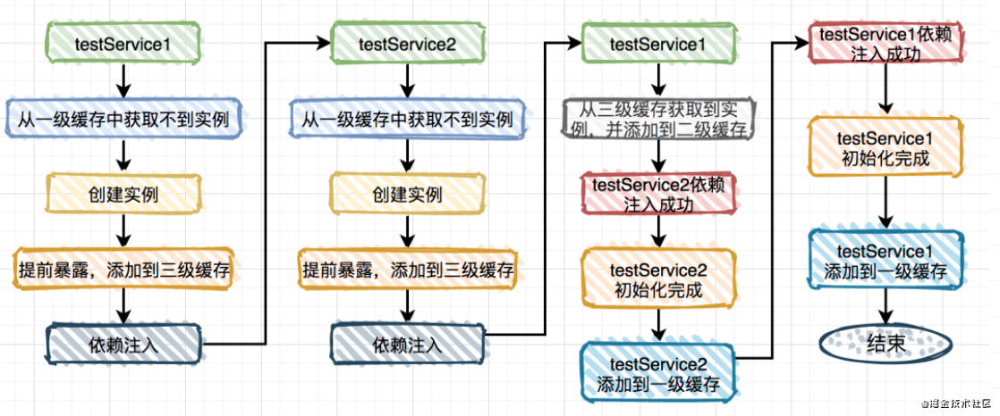
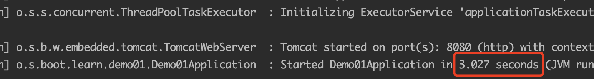

(PS：扫描[首页里面的二维码](README.md)进群，分享我自己在看的技术资料给大家，希望和大家一起学习进步！)

#### [1.SpringAOP是怎么实现的？](#SpringAOP是怎么实现的？)
### SpringAOP是怎么实现的？

Spring Aop是一种可以减少大量重复代码的一种编程技术，可以设置一个切面，比如说是某个包下面的所有方法，这些方法在执行的时候就会调用我们写的拦截方法，我们可以做一些类似于日志打印等一些操作。

实现AOP有三种方式：静态代理，使用JDK的Proxy类实现动态代理，使用CGLIB实现动态代理。

#### 静态代理

就是在代码里面创建一个代理类，实现目标类的接口，目标对象是代理类的成员变量，外界需要执行方法时，调用代理类的方法，代理类的方法内部先执行额外的操作，日志记录等，然后再调用目标类的方法。

```java
public interface IUserDao {
    void save();
}
public class UserDao implements IUserDao {
    public void save() {
        System.out.println("已经保存数据...");
    }
}
//代理类
public class UserDaoProxy implements IUserDao {
    private IUserDao target;
    public UserDaoProxy(IUserDao iuserDao) {
        this.target = iuserDao;
    } 
    public void save() {
        System.out.println("开启事务...");
        target.save();
        System.out.println("关闭事务...");
    }
}
```

### JDK动态代理

通过调用Proxy.newProxyInstance()方法可以为目标类创建一个代理类，然后调用代理类的方法时会调用InvocationHandler的invoke()方法，然后我们可以在invoke()方法里面做一些日志记录之类的额外操作，然后再调用真正的实现方法，也就是目标类的方法。

目标类必须有对应的接口类，我们拦截的方法必须是接口中定义的方法。

```java
public class Test implements TestInterface {
    public void test(Integer a) {
        System.out.printf("111111");
    }
}
public interface TestInterface {
    void test(Integer a);
}
//创建一个类，继承InvocationHandler，重写invoke()方法，在这个方法里面做一些日志打印的操作后，然后通过反射的API调用method.invoke(target, args);本来的方法。
public static class CustomInvocationHandler implements InvocationHandler {
    Object target;
    public CustomInvocationHandler(Object target) {
        this.target = target;
    }
    @Override
    public Object invoke(Object proxy, Method method, Object[] args) throws Throwable {
        System.out.println("before");
      	//调用本来的方法
        Object result = method.invoke(target, args);
        System.out.println("after");
        return null;
    }
}
```


```java
Test test = new Test();
TestInterface proxyInstance = (TestInterface) Proxy.newProxyInstance(test.getClass().getClassLoader(), test.getClass().getInterfaces(), new CustomInvocationHandler(test));
proxyInstance.test(11);
```

实现原理：就是在调用Proxy.newProxyInstance()时会根据类加载器和目标类Class对象动态创建一个代理类出来，动态代理类的所有方法的实现都是向下面这样，方法内部都是调用invocationHandler的invoke()方法

```java
 public final void test(){
     throws 
    {
      try
      {
      /* h就是handler，m3是Method对象，在静态代码块里面有一行这样的代码
      m3 = Class.forName("com.proxy.main.Test").getMethod("test", new Class[0]);
      */
        this.h.invoke(this, m3, null);
        return;
      }
      catch (RuntimeException localRuntimeException)
      {
        throw localRuntimeException;
      }
      catch (Throwable localThrowable)
      {
      }
      throw new UndeclaredThrowableException(localThrowable);
    }
```

### CGLIB动态代理

CGLIB主要是通过创建一个代理类，继承原来的类，并且重写父类的方法，然后将代理类实例返回，后续调用代理类的方法时，先执行一些额外的AOP相关的记录操作，然后再去执行父类的方法。（由于在Java中子类只能继承父类的非private的属性和方法，所以**由CGLIB创建的代理类，不会包含父类中的final或者private修饰的方法，**aop也无法捕获private相关的方法）

创建一个类，继承MethodInterceptor类，重写intercept方法，接受方法调用。创建一个Enhancer实例，设置代理类的父类为目标类，设置回调。

```java
public static void main(final String[] args) {
    System.setProperty(DebuggingClassWriter.DEBUG_LOCATION_PROPERTY, "/Users/ruiwendaier/Downloads/testaop");
    Enhancer enhancer = new Enhancer();
    enhancer.setSuperclass(Test.class);
    enhancer.setCallback(new MyMethodInterceptor());
    Test test1 = (Test)enhancer.create();
    test1.test();

}
public static class MyMethodInterceptor implements MethodInterceptor {
    @Override
    public Object intercept(Object o, Method method, Object[] objects, MethodProxy methodProxy) throws Throwable {
        System.out.println("Before: "  + method.getName());
        Object object = methodProxy.invokeSuper(o, objects);
        System.out.println("After: " + method.getName());
        return object;
    }
}
public static class Test implements TestInterface {
    public void test() {
        System.out.printf("111111");
    }
}
```

生成的代理类中，对于父类中每一个能够继承重写的方法，动态代理类都会生成两个相应的方法。一个是方法内是直接调用父类(也就是目标类的方法)，一个是生成的对应的动态代理的方法，里面会先调用代理类设置的intercept回调方法，然后再调用父类的方法。在调用时，会直接先调用重写的方法。

```java
//代理生成的方法  直接调用的父类(目标类的方法)
  final String CGLIB$test$0(){
    return super.test();
  }
 
  //方法重写 测试样例中就是调用的这里的test方法
  public final String test()
  {
	//判断目标类是否有设置回调：enhancer.setCallback(this);
    MethodInterceptor tmp4_1 = this.CGLIB$CALLBACK_0;
    if (tmp4_1 == null){
      tmp4_1;
      CGLIB$BIND_CALLBACKS(this);
    }
    MethodInterceptor tmp17_14 = this.CGLIB$CALLBACK_0;
	//设置了方法的回调则调用拦截器方法intercept
    if (tmp17_14 != null)
      return (String)tmp17_14.intercept(this, CGLIB$test$0$Method, CGLIB$emptyArgs, CGLIB$test$0$Proxy);
    return super.test();
  }

```

### 区别

目标类必须有对应的接口类，然后JDK动态代理动态创建了一个类，实现了接口中的方法，不能对没有接口类的普通的类进行代理（因为所有生成的代理类的父类为Proxy，Java类继承机制不允许多重继承）；CGLIB能够代理普通类；
Java动态代理只能对有接口类的类进行代理，并且使用Java原生的反射API进行操作，在生成类上比较高效，但是执行会效率低一些。CGLIB使用ASM框架直接对字节码进行操作，在类的执行过程中比较高效。

参考链接：

https://blog.csdn.net/gyshun/article/details/81000997

### Spring IOC是什么？

IOC就是invention of control，就是控制反转，将对象获取外界依赖资源的方式反转了。假设一个对象A依赖于对象B，在没有IOC以前，就是在对象A需要使用对象B时，去用代码显式地创建一个对象B。有了IOC以后，可以由Spring IOC容器来负责对象B的创建和销毁，创建后放在容器中，在对象A需要的时候再来取。
DI(Dependency Injection，依赖注入)其实就是IOC的另外一种说法，就是IOC是通过依赖注入技术实现的。
《跟我学spring3系列》https://www.iteye.com/blog/jinnianshilongnian-1413851
https://www.cnblogs.com/xdp-gacl/p/4249939.html

### Spring IOC是怎么解决循环依赖问题的？

Spring IOC只能解决属性注入之间的循环依赖问题，如果是构造器之间的循环依赖，只会抛出BeanCurrentlyInCreationException异常。

Spring使用了3个Map来保存Bean，俗称为三级依赖：

singletonObjects 一级缓存，用于保存实例化、注入、初始化完成的bean实例，可以使用的。

earlySingletonObjects 二级缓存，bean刚刚构造完成，但是还没有进行属性填充。

singletonFactories 三级缓存，用于保存正在创建中的bean，以便于后面扩展有机会创建代理对象，此时的bean是没有完成属性填充的。

假设A类和B类相互依赖，A中有一个B类的属性，B中有一个A类的属性。那么在初始化A的Bean时，首先会依次去一级依赖，去二级依赖，三级依赖中去找，都没有就调用创建方法创建实例A，将A添加到三级依赖中，然后对A的属性进行依赖注入，填充属性时，发现B的Bean在各级依赖中都没有，就创建B的bean添加到三级依赖，然后对B的属性进行填充，填充B的属性A时，会从三级依赖中取出A，填充完放到二级依赖，然后对B进行初始化，初始化完成添加到一级依赖。B初始化完成后，将B从一级依赖中，填充到实例A，A可以进入到二级依赖，完全初始化完成后，A进入到一级依赖，供用户代码使用。




https://juejin.cn/post/6911692836714840077

https://segmentfault.com/a/1190000015221968

https://blog.csdn.net/qq_35165000/article/details/108185093?spm=1001.2014.3001.5501

### Bean的生命周期是怎么样的？

Bean的生命周期主要分为以下四个阶段：

1.**Bean的实例化阶段**-主要是在createBeanInstance()方法中，调用类的构造器方法来创建一个Bean实例。用户可以自定义一个类，继承InstantiationAwareBeanPostProcessorAdapter，重写它的两个方法，对Bean的实例化前后做一些额外的操作，例如打印日志。

```java
public class MyInstantiationAwareBeanPostProcessorAdapter extends InstantiationAwareBeanPostProcessorAdapter {
   @Override
   public Object postProcessBeforeInstantiation(Class<?> beanClass, String beanName) throws BeansException {
      if (beanName.equals("car")) {
         System.out.println(beanName + "在实例化之前");
      }
      return super.postProcessBeforeInstantiation(beanClass, beanName);
   }
   @Override
   public boolean postProcessAfterInstantiation(Object bean, String beanName) throws BeansException {
      if (beanName.equals("car")) {
         System.out.println(beanName + "在实例化之后");
      }
      return super.postProcessAfterInstantiation(bean, beanName);
   }
}
```

2.**属性赋值阶段**-主要是在populateBean()方法中，对Bean的各项属性进行赋值。

3.**Bean的初始化阶段**-主要调用用户自定义的初始化方法init-Method()

用户可以自定义一个类，继承BeanPostProcessor，重写它的两个方法，对Bean的初始化前后做一些额外的操作，例如打印日志。

```java
public class NdBeanPostProcessor implements BeanPostProcessor {
   public Object postProcessBeforeInitialization(Object bean, String beanName) throws BeansException {
      System.out.println("NdBeanPostProcessor 在" + beanName + "对象初始化之前调用......");
      if (beanName.equals("car")) {
         return new CglibInterceptor().getIntance(bean.getClass());
      }
      return bean;
   }
   public Object postProcessAfterInitialization(Object bean, String beanName) throws BeansException {
      System.out.println("NdBeanPostProcessor 在" + beanName + "对象初始化之后调用......");
      return bean;
   }
}
```

4.**Bean销毁阶段**，用户可以自定义destroyMethod()方法，在Bean被销毁时被调用。

### BeanFactory和FactoryBean有什么区别？

**BeanFactory**是一个接口，定义了IOC容器的最基本的规范，并提供了IOC容器应遵守的的最基本的方法。在Spring代码中，BeanFactory只是个接口，并不是IOC容器的具体实现，但是Spring容器给出了很多种实现，如 DefaultListableBeanFactory、XmlBeanFactory、ApplicationContext等，都是附加了某种功能的实现。

```java
package org.springframework.beans.factory;  
import org.springframework.beans.BeansException;  
public interface BeanFactory {  
    String FACTORY_BEAN_PREFIX = "&";  
    Object getBean(String name) throws BeansException;  
    <T> T getBean(String name, Class<T> requiredType) throws BeansException;  
    <T> T getBean(Class<T> requiredType) throws BeansException;  
    Object getBean(String name, Object... args) throws BeansException;  
    boolean containsBean(String name);  
    boolean isSingleton(String name) throws NoSuchBeanDefinitionException;  
    boolean isPrototype(String name) throws NoSuchBeanDefinitionException;  
    boolean isTypeMatch(String name, Class<?> targetType) throws NoSuchBeanDefinitionException;  
    Class<?> getType(String name) throws NoSuchBeanDefinitionException;  
    String[] getAliases(String name);  
}  
```

**FactoryBean**是一个接口，有一个创建bean对象的方法getObject()，当一些bean对象不能由ioc容器简单得调用类的构造器方法来创建实例对象时使用，可以将Bean类实现FactoryBean接口，实现getObject()方法，供ioc容器调用来创建bean对象。

```java
public interface FactoryBean<T> {
    @Nullable
    T getObject() throws Exception;

    @Nullable
    Class<?> getObjectType();

    default boolean isSingleton() {
        return true;
    }
}
```

https://www.cnblogs.com/aspirant/p/9082858.html

### Springboot启动过程

##### 构造SpringApplication实例

1.首先会调用SpringApplication的静态方法run()，在这个方法里面会调用构造器方法创建出一个SpringApplication实例，在构造器中会确定当前web应用类型，是reactive web类型，还是servlet web类型，还是none类型。以及设置监听器等等，完成一些初始化操作。(监听器就是来监听SpringApplication启动过程的，在开始启动，创建上下文，启动失败等生命周期事件时都会调用监听器相关的方法)

##### 执行run()方法

2.然后去执行实例的run()方法，首先会创建一个StopWatch计时器器，来统计run()方法的启动耗时，在日志里面会显示启动时间，那个时间就是在这里统计的。然后处理环境参数，就是`java -jar ***.jar`启动命令中带的那些jvm参数。



##### 创建applicationContext

3.会创建出一个ApplicationContext，一般servlet的应用的context类型是AnnotationConfigServletWebServerApplicationContext。(可以认为beanFactory就是ioc容器，但是我们一般不直接使用beanFactory获取bean，而是通过applicationContext来获取，ioc容器beanFactory是应用上下文applicationContext的一个属性，applicationContext也实现了BeanFactory接口，可以认为applicationContext是一个高级容器，applicationContext支持国际化，默认是启动时加载所有bean，而不是用到时才进行懒加载，以及支持事件机制。)

##### 执行prepareContext()方法

4.然后会调用prepareContext()方法来为应用上下文做一些准备工作，会将运行时的参数封装成bean，注册到beanFactory中去，以及使用load方法加载启动类。

##### 执行refreshContext()方法

5.在这里会启动容器，也就是会为beanFactory做很多配置，注册BeanPostProcessors，设置类加载器等等。在这一步也会解析启动类中@SpringBootApplication这个组合注解。

##### afterRefresh()方法

6.这个方法里面会把容器里面所有ApplicationRunner自定义子类和CommandLineRunner自定义子类的Bean全部取出来，执行它们的run()方法。(就是有时候如果需要在应用启动后执行一些我们自定义的初始化操作，可以通过自定义一个类，继承ApplicationRunner类来实现。)

之后会调用listeners.started()方法，通知所有Listener，application已经启动完成了，以及调用listeners.running()方法通知所有Listener，application已经运行了。

```java
//系统启动完可以做一些业务操作
@Component
//如果有多个runner需要指定一些顺序
@Order(1)
public class SimosApplicationRunner implements ApplicationRunner {
@Autowired
SystemInitService systemInitService;
@Override
public void run(ApplicationArguments args) throws Exception {
    systemInitService.systemInit();
}
}
```

https://my.oschina.net/funcy/blog/4873261

https://www.imooc.com/article/264722