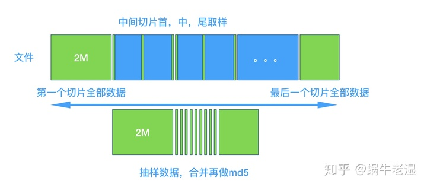
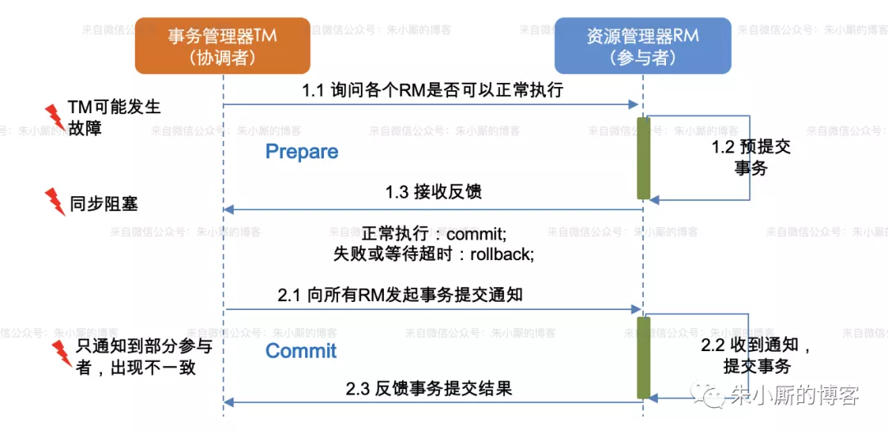
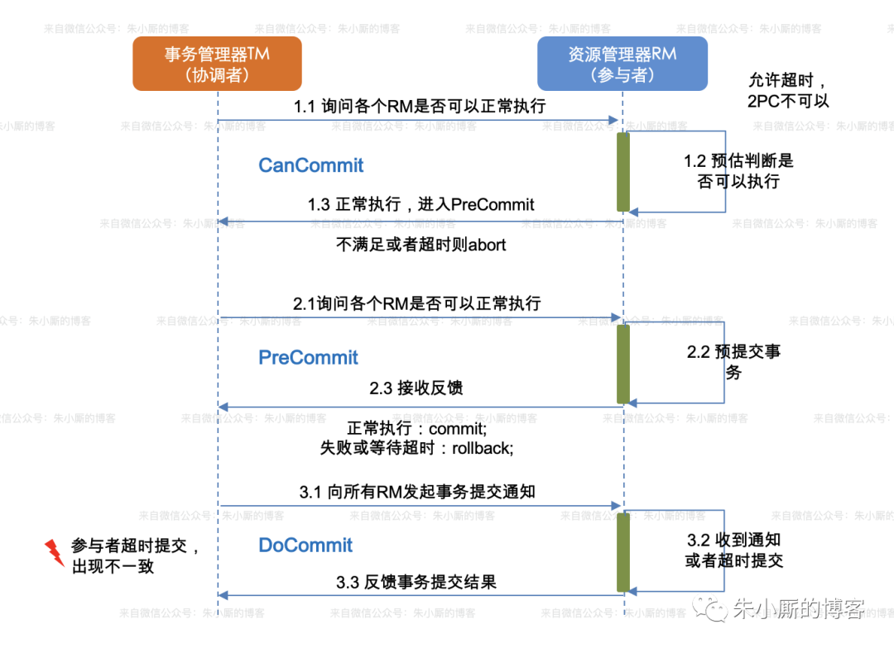
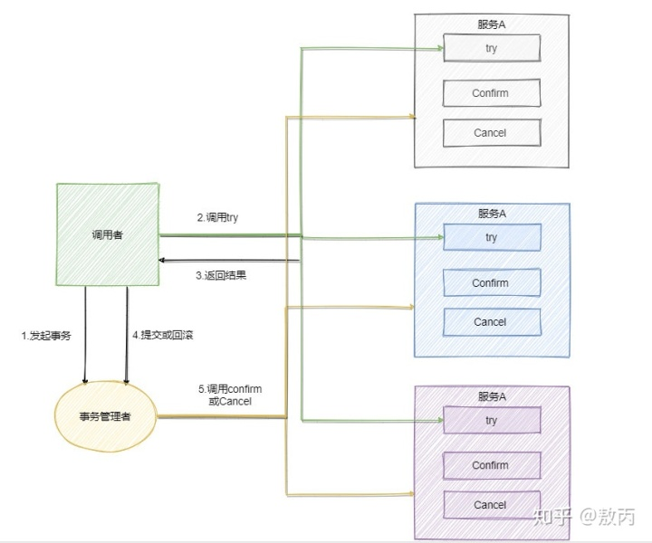
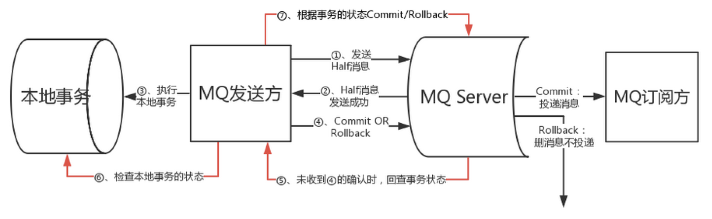

(PS：扫描[首页里面的二维码](README.md)进群，分享我自己在看的技术资料给大家，希望和大家一起学习进步！)

#### [1.怎么设计一个大文件上传的功能？](#怎么设计一个大文件上传的功能？)

#### [2.谈一谈分布式ID生成方案的了解？](#谈一谈分布式ID生成方案的了解？)

### 怎么设计一个大文件上传的功能？

首先如果是大文件上传，考虑到网络不稳定容易造成上传失败，或者需要做断点续传功能，是不是对整个文件直接进行上传的。
#### 1.计算hash

首先是让前端对大文件计算hash值，主要是用于后端去判断这个文件在服务器上是否已经存在，其次是这个hash值可以作为上传文件的一个标识。
如果是直接对整个文件计算hash值，文件过大时，可能会比较慢，通常是对文件进行抽样计算。根据hash值判断文件是否在后端已经存在，已存在就不进行上传了。

##### 影分身Hash
就是把文件切分成2M的分片，然后对首文件+中间每个文件的首中尾取2个字节+尾文件，进行合并，计算合并文件的MD5值，作为文件的hash值。

如果这个hash值在后端存在：
说明这个文件可能存在也可能不存在。准确性不是100%。

如果这个hash值在后端不存在：
说明这个文件一定不存在。准确性是100%。

通过这种方式判断的思路跟布隆过滤器比较像。

#### 2.分片上传

上传时不能一窝蜂地把所有分片文件发给后端，是把每个分片包装成一个网络请求，使用异步线程对从队列里面每次取一个分片进行上传。
每个分片文件都有一个唯一标识，就是hash值+分片编号。这样如果上传中断了，下次再进行上传时，后端可以知道哪些分片已经上传，把未上传的分片唯一标识返回给前端，前端只需要上传上次未上传的分片，这也就是断点续传。

https://zhuanlan.zhihu.com/p/104826733

#### 3.合并请求
有两种方案，一种是后端记录所有分片的上传状态，当所有分片全部上传完毕后，自动合并文件。另外一种就是前端发现传完所有文件后，调用接口通知后端去合并。

### 谈一谈分布式ID生成方案的了解？
首先ID生成方案的技术考虑点：
唯一性：不能重复。
趋势递增：保证id作为主键时，插入数据库时的顺序性，避免随机插入。
单调递增：满足某些特殊业务的要求，保证后一秒请求生成的id比前一秒的大。
信息安全性：不要像UUID一样泄露mac地址，也不要像数据库主键ID自增完全连续，泄露每日id生成数据量。

#### 1.UUID模式

太长，占用存储空间过大
id是字符串类型，查询成本高于数字类型
如果是包含mac地址的UUID会泄密

#### 2.单机数据库主键自增模式

id生成的量受限于单机MySQL数据库的性能
强依赖于数据库，主从切换时容易导致重复发号
容易泄露id生成量

#### 3.多机数据库主键自增模式

主要是将每个数据库的步长设置为一样，但是起始值不一样，以此错开生成的id，不便于扩展。

##### 4.Leaf号段模式模式

就是数据库存储一个maxId代表已经发放的id最大值，每次将maxId更新为max+step，取step数量的id发放。
优点：
1.便于扩展，发号性能取决于step，可以动态调整。(Leaf做了Step动态调整策略，一个号段使用时间<15分钟，就让号段拥有的id量step翻倍(直到最大阀值100万)，一个号段使用时间>30分钟,step减半(直到最低阀值，初始号段id量)。)
2.即便主节点的宕机，短时间Leaf也能继续提供服务，其次是主从切换时影响较小。
缺点：
1.当号段里面的id用完时，会去数据库取新的号段，此时如果来了获取id的请求会需要进行等待。(Leaf做了双Buffer优化，使用了双Buffer各存储一个号段，当一个号段使用量达到10%后，就触发另一个号段去数据库取新号段进行更新，以便于当一个号段使用完时，可以直接切换到未使用的号段。)
2.id是连续的，容易泄密。(可以自定义抛弃策略，取号段时的时候抛弃一些id，或者定时抛弃掉一些id。)

#### 5.Leaf-snowflake模式

就是沿用了snowflake原本的位数分配算法，1标志位+41位毫秒时间戳+10位机器位+12位序列号。使用zookeeper作为注册中心，id生成服务启动时，去指路径下获取所有节点的列表，判断当前ip+port是否有对应的workid存在，有就使用，没有就往插入一个新的永久顺序节点，序号则为workId(并且会将workid缓存到本地磁盘上)。运行期间每过3s，都会上报最新的时间戳到zookeeper。
**时钟回滚的处理：**
**启动时：**
zookeeper里面会存上次生成id的时间戳，如果上次存储的时间戳>当前系统时间戳，那么就抛出异常，启动失败。
**运行时：**
如果获取id时，发现上次生成id时的时间戳>当前系统时间戳，那么说明运行时发生了时钟回滚，如果回滚的时间差<5ms，就调用wait()方法等待10ms，然后再获取id，时间差>5ms，就抛出异常。

优点：

**时钟回滚优化**

1.对时钟回滚做了特殊处理。

**zookeeper弱依赖**

2.为了减轻了zookeeper的弱依赖，实现在zookeeper挂了的情况下，id生成服务也能启动，每次启动后，在本地也缓存workid配置，一旦启动时，发现zookeeper连接不上，就通过从本地缓存配置中读取workid。(但是这样也有问题，本地缓存配置只存了workid，没有存上次生成id的最大时间戳，所以一旦启动前发生了时钟回滚，或者是修改了系统时间，这样从本地缓存配置中读取workid生成的id就可能是重复的。)

**时间差优化**

3.做了时间差优化，就是默认的时间戳是从1970年开始的，leaf是自己选定了2010年的一个时间点，以此来计算时间戳，这样可以在时间位数固定的情况下，增长服务最大运行时间。在毫秒时间戳为41位的情况下，时间差最大是69年，如果以1970年为起点，那么最大时间就是1970+69年，如果以2010年为起点就是2010+69年。

**序列号优化**

4.为了防止生成的id的序列号部分都是从0开始，导致插入数据库时，有数据倾斜的问题，所以每次用新的毫秒时间戳时，序列号不是从0开始，而是计算一个0到100之间的随机数作为起点。

缺点：

1.注册中心只支持Zookeeper

2.潜在的时钟回拨问题

3.时间差过大时，生成id为负数。

### 6.百度的uid-generator模式

#### 默认模式

每次启动时向数据库插入一条数据，这行数据的主键是自增的，主键id就是workId，

因为默认是snowflake算法是**1标志位+41位时间戳+10位机器号+12位序列号**，

因为百度的是每次启动都获取新的机器号，所以它修改了这些位数配比，是

**1标志位+28位的秒级时间差+22位的机器号+13位的序列号**，所以总共支出2的22次方次启动，也就是400万次启动。最大服务支持时间是2*28次方，也就是8.7年。（优化点是修改位数分配，让服务时间更长，我们的位数分配是**30位秒级时间差+16位机器号+7位序列号**，最长服务时间支持34年，6.5w次机器启动，每个机器每秒128个并发，总共位数没有用到64位，只用到53位，这样生成的id转化为10进制更小。）

解决时间回拨问题：

* 启动时时间回拨

因为是每次都用新的机器号，所以当前机器号都是之前没有的，所以即便时间戳回拨也不影响。

* 运行时时间回拨

会使用lastSecond来记录上次生成id的时间戳，如果当前时间戳比lastSecond还小，就抛出异常。（优化点就是**回拨时间差较小时进行等待**，较长时再抛出异常。）

缺点：

1.默认的最大服务年限太短，只有8年。

2.回拨时间差较小时也是抛出异常，没有额外的判断逻辑。

3.没有像Leaf一样做序列号优化，可能生成的id序列号部分都是从0开始的多一些，可能会存在数据倾斜的问题。

#### 缓存模式

主要继承自默认模式，只是用一个环形数组来存储生成好的id，每次去环形数组中去，默认大小是2的13次方，8192。这种模式使用的时间取得不是实时的系统时间，而且使用启动时的时间，每次生成一组id时，对之前保存的时间+1。

**阀值检测预填充**：取id时，发现可用id数小于阀值50%时，就对后面已经使用的id进行再填充。

**定期填充**：每5分钟定期会去检查环形数组中id使用情况，然后生成一组最大序列号个数的id(默认是8192个)，然后进行填充，多的直接丢弃掉。

**缺点**：

1.id只有在定期填充时，会丢弃掉一些id，其他情况下，id是完全连续的。假如每次使用量比较大，大部分时候都是5分钟内能用掉50%的话，那么就就不会触发定期填充，也没有id丢弃，导致id会一直连续，容易泄露数据信息，所以最好自定义丢弃逻辑。

2.其次是id跟生成id时系统的时间戳无关了，可能无法满足一些特殊业务的需求。

### 自己的方案

我们自己的主要是根据uid-generator来做的，因为只是启动的时候依赖数据库，不需要引进新的依赖。做的优化主要是修改了位数分配，使得支持最大服务年限更长，30位时间差+16位机器号+7位序列号。做了时钟回拨优化，回拨差值较小时进行等待。以及做了序列号丢弃的优化。

### 谈一谈你对分布式事务的理解？

#### 2PC方案(2阶段提交制)

这种方案就是引入了一个协调者，主要分为prepare和commit两个阶段，在第一阶段其实就是协调者给各个业务系统发送命令，业务系统收到后，就会开始执行这个子事务的具体操作，然后给协调者反馈，子事务执行成功还是失败，发送后，业务系统就会同步阻塞等待协调者的第二阶段的指令。

协调者第一阶段发送指令会进入超时等待状态，等待各个业务系统返回子事务的执行结果。

**执行成功，提交**

如果所有业务系统都执行成功了，并且协调者收到了反馈，那么就认为整个事务执行成功了，就会通知各个业务系统进行提交。

**执行失败，回滚**
如果超过时间还没有收到所有业务系统返回的结果，或者是有业务系统返回了执行失败的结果，那么协调者就认为执行失败了，通知各个业务系统进行回滚，如果此时网络出现阻塞，业务系统收不到通知，那么协调者就会一直重试发送回滚的指令。

**缺点**

1.单点问题：就是一旦协调者挂掉，所有子系统都会进入阻塞等待状态。

2.数据不一致的问题：如果在第二阶段协调者给子系统发送commit指令时，发生了局部网络异常，就会导致接收到commit的指令的子系统提交事务，而没有接收到commit指令的子系统没有提交事务，导致数据不一致。

3.同步阻塞：由于子系统在执行阶段都是同步阻塞的，自身没有超时的机制，一旦与协调者之间的网络断开，只能一直阻塞等待，等待协调者的指令。

#### 3PC三段提交制

这种方案就是分为三个阶段，canCommit，preCommit，doCommit三个阶段。

第一阶段是询问阶段

协调者会给参与者发送canCommit指令，询问能否正常执行，如果满足执行的条件的话，参与者就会返回ACK。

第二阶段是预执行阶段

协调者会给参与者发送preCommit指令，让参与者执行事务，但是执行完成不提交，参与者执行成功后会给协调者发送ACK。

第三阶段就是提交阶段

协调者如果收到所有参与者给他返回执行成功的ACK，那么他就会给所有协调者发送doCommit指令，让参与者提交。如果在第二阶段有一个参与者执行失败，给协调返回执行失败的结果，那么在第三阶段，协调者就会给参与者发送Abort指令，让参与者回滚。

**与2PC的区别：**

1.3pc是一个非阻塞的协议，为参与者引入了超时机制，在第一阶段或者第二阶段，参与者等待协调者的指令超时了，会进行回滚，第三阶段等待协调者的指令超时了，会进行自动提交。而2pc协议，如果协调者一直没有给参与者发指令，导致超时，参与者会一直进行阻塞等待。

2.2pc协议里面，第二阶段协调者挂了，选举出新的协调者是不知道参与者执行的事务是提交事务还是回滚事务。3pc里面到了第三阶段那么一定是执行提交事务。

**3pc的问题：**

第三阶段如果发送的是abort回滚指令，假设有些参与者由于网络原因没有收到指令，超时后会进行自行提交事务，那么也会导致数据不一致的问题。

https://honeypps.com/architect/introduction-of-distributed-transaction/

https://www.infoq.cn/article/2018/08/rocketmq-4.3-release

#### TCC

TCC分为Try预留阶段，Confirm确认阶段，Cancel撤销阶段三个阶段。

比如某个事务需要A，B，C三个业务系统各自执行一些操作，那么事务管理器会发送Try指令，会让A，B，C三个业务系统各自去申请执行操作所需的一些资源，冻结库存之类的。A，B，C预留资源成功了就会通知事务管理器Try阶段执行成功了。那么事务管理器就会发送Confirm指令给三个业务系统，告诉他们进入到Confirm阶段，让A，B，C业务系统各自执行自己真正的事务操作。如果三个业务系统都执行成功，那么事务管理器就认为执行成功，如果有一个失败那么事务管理器就认为执行失败了，会通知每个业务执行Cancel操作，进行回滚。

（万一某个服务的 Cancel 或者 Confirm 逻辑执行一直失败怎么办呢？

 Cancel 或者 Confirm 一直没成功，会不停的重试调用它的 Cancel 或者 Confirm 逻辑，务必要它成功。）

TCC框架主要有ByteTCC，TCC-transaction，Himly。

缺点：

1.侵入性太强，每个业务系统还需要写Cancel对应的数据回滚相关的逻辑代码。

https://www.cnblogs.com/jajian/p/10014145.html

##### 本地消息表法

就是上游服务先执行操作，将操作记录到数据库中的本地消息表，并且此时这条操作记录的status设置为0，也就是未通知成功。然后将操作记录封装成Kafka消息发送到消息队列，下游系统接受到，进行消费，然后消费成功后调用上游服务的接口，通知他消费成功了，上游系统将本地消息表中这条记录的status设置为1，代表通知成功。

并且上游系统会定时扫描本地消息表，将status为0的操作记录，封装成Kafka消息，发送到消息队列。

并且下游系统是通过消息中操作记录的主键id来防止不重复消费，保证幂等性的。就是消费消息时，发送操作记录的id已经在数据库中存在了，就代表之前已经处理过了，不处理这条消息了。

##### 可靠消息最终一致性方案

RocketMQ在4.3以后，增加了对分布式事务的支持，就是将事务的执行状态保存在RocketMQ中，由RocketMQ去负责将commit状态的消息推送给下游系统。

1.上游系统发送prepare消息到RocketMQ。

2.prepare消息发送到RocketMQ成功后，上游系统开始执行本地事务。

3.如果上游系统本地事务执行成功，会发送commit消息到RocketMQ，RocketMQ会将这个消息提交，推送给消费者（也就是下游系统）。如果上游系统本地事务执行失败，会发送rollback消息到RocketMQ，RocketMQ会将这个消息撤销，不推送给消费者。

4.如果一个prepare消息一直没有接受到上游系统的commit或者rollback指令，这样就判定prepare消息超时了，RocketMQ会去查询上游系统的这个事务的执行状态，是成功了，还是失败，做下一步的处理。

**底层实现原理**

RocketMQ使用了Half topic队列来保存所有prepare消息，使用Operation Topic队列来保存commit消息和rollback消息。这样通过Operation Topic就知道哪些消息commit了，可以推送给消费者，哪些消息rollback了，不需要推送给消费者。以及那些在Half topic中有，在Operation Topic中没有的消息，就是事务超时的消息。

https://www.infoq.cn/article/2018/08/rocketmq-4.3-release

##### 最大努力通知方案

业务系统 A 执行本地事务完成后，发送个消息到 MQ，有一个个专门消费 MQ 的服务，来消费MQ的消息，消费完会在数据库中记录下来(或者放入到内存队列)，之后就一直调用系统 B 的接口，要是系统 B 执行成功就提交，执行失败或者调用超时就一直重试，直到业务系统B执行成功。

### 如何设计秒杀系统？

1.前端页面
提前把静态资源部署到CDN，减少静态资源访问的压力，其次是可以为静态资源的header设置成强缓存cache-control，2分钟后才过期，这样当第一次请求完静态资源后，再次刷新时，就会使用浏览器里面的缓存的静态资源，而不是再发请求。
2.nginx层面
使用limit_req_zone模块针对用户id为key，进行限流，放在同一个用户恶意发起多个请求，限制每个用户每5分钟只能请求100次接口。
3.业务系统设置限流熔断
当业务系统收到的请求达到一定限制后，停止接受请求，可以使用hystrix进行限流。如果是秒杀商品，当Redis里面存的商品库存减完时，就对所有用户返回统一的状态码，告诉前端商品被抢光了，不再进行后面的业务逻辑。
4.使用消息队列削峰
就是如果秒杀请求对应的业务逻辑处理时间如果过长，例如减库存，生成订单等，业务系统可以先将用户的秒杀请求封装成Kafka消息，发送到消息队列，由其他业务系统消费Kafka消息，完成生成订单等耗时操作。
https://www.zhihu.com/question/54895548/answer/1352510403