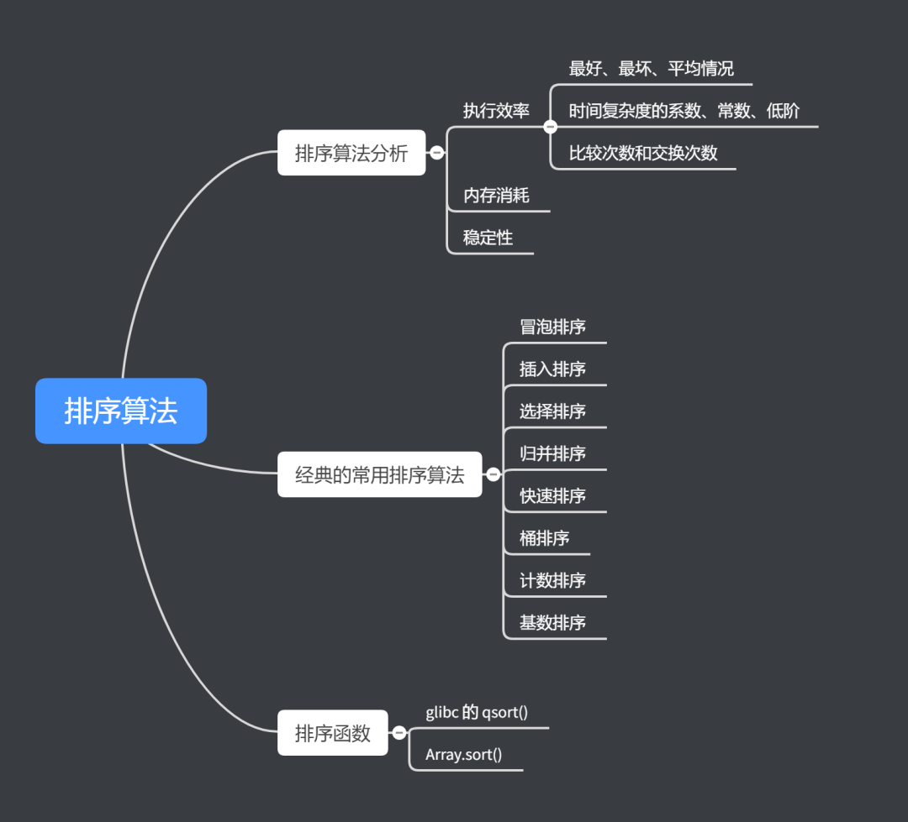
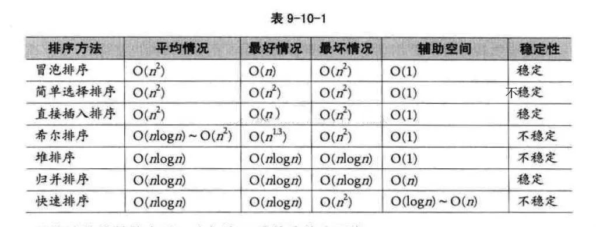
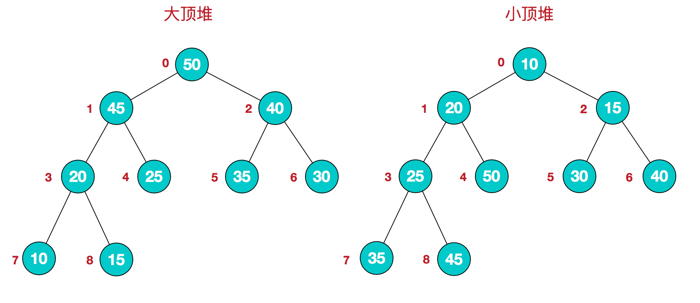
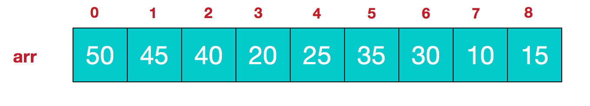

高频算法面试题集合

#### [1.常见的排序算法](#常见的排序算法)

#### [2.二分查找](#二分查找)

#### [3.查找链表倒数第K个节点](#查找链表倒数第K个节点)

#### [4.链表反转](#链表反转)

#### [5.查找第K大的数](#查找第K大的数)

#### [6.有一个1G大小的一个文件，里面每一行是一个词，词的大小不超过16字节，内存限制大小是1M，返回频数最高的100个词](#有一个1G大小的一个文件，里面每一行是一个词，词的大小不超过16字节，内存限制大小是1M，返回频数最高的100个词)

#### [7.9个硬币中有一个劣币，用天平秤，最坏几次？](#9个硬币中有一个劣币，用天平秤，最坏几次？)

#### [8.编辑距离](#编辑距离)

#### [9.打印杨辉三角](#打印杨辉三角)

#### [10.LRU算法](#LRU算法)

#### [11.【面试算法题】阿拉伯数字转化为中文读法](#[面试算法题]阿拉伯数字转化为中文读法)

### 常见的排序算法




## 冒泡排序

对从[0,length-1]范围内的元素进行比较和交换，将大的元素交换到后面去，一次遍历后就可以将最大的元素交换至末尾，然后下次遍历范围将减1，在[0,length-2]范围内进行，一直到最后。

#### 优化

使用冒泡排序的过程中，如果有一趟冒泡过程中元素之间没有发生交换，那么就说明已经排序好了，可以直接退出不再继续执行后续的冒泡操作了。

```java
int[] sorted(int[] array) {
  if (array == null || array.length ==0 || array.length ==1) {return array;}
  for(int i = array.length;i>0;i--) {//i代表遍历的最大范围
    int sortedFlag = 0;
    for(int j = 1;j<i;j++) {//每次在1到i范围内交换,
      if(array[j-1]>array[j]) {//进行比较，将大的元素交换到后面去
        int temp = array[j];
        array[j] = array[j-1];
        array[j-1]=temp;
        sortedFlag=1;
      }
    }
     // 该趟排序中没有发生，表示已经有序
    if (0 == sortedFlag) {
      break;
    }
  }
  return array;
}
```

## 插入排序

就是每次从未排好序的序列中，每次取出一个元素，插入到已排好序的序列中去。比较好的写法就是数组前面一段是排好序的，这一段往前面进行比较然后互换。

```java
int[] sorted2(int[] array) {
  if(array == null || array.length==0 || array.length==1) {return array;}
  for(int i=1;i<array.length;i++) {
    //此时的0到都是排好序的序列了，把array[i]在0到i-1中找到一个合适的位置
        for(int j = i;j>0;j--) {
          if(array[j]<array[j-1]) {//小于就交换
            int temp = array[j];
            array[j] = array[j-1];
            array[j-1] = temp;
          } else {//如果是大于说明是已经处于排序好的序列中合适的位置了
            break;
          }
      }
  }
  return array;
}
```

## 选择排序

就每次从为排好序的序列中选择一个最小值出来，然后放到已排序的序列末尾。

```java
int[] sorted3(int[] array) {
      if(array == null || array.length==0 || array.length==1) {return array;}
      for(int i= 0;i<array.length-1;i++) {
        int minIndex = i;
        //每次遍历选出最小值，并且放在数组下标为i的位置
        for(int j = i+1;j<array.length;j++) {
          if(array[j]<array[minIndex]){
            minIndex = j;
          }
        }
        int temp = array[i];
        array[i] = array[minIndex];
        array[minIndex] = temp;
      }
      return array;
}
```

## 归并排序

思路就是先递归对数组进行分组，一直到每个组只有一个元素，然后每个组按大小进行合并，形成一个新的组。每次合并的时间复杂度是N，大概需要合并log(N)次，所以总时间复杂度是 Nlog(N)，空间复杂度为N的一种写法,只使用一个临时数组temp来进行过度，

```java
void sort(int[] array) {
      if (array==null||array.length==0) { return; }
    //临时数组主要用于归并过程中的临时存放排序数组
    int[] tempArray = new int[array.length];
    mergeSort(array,0,array.length-1,tempArray);
}
void mergeSort(int[] array, int start, int end,int[] tempArray) {
    if (start>=end) { return; }
    //进行分组，一直分到只有两个元素，在小组内进行归并
    int middle = start + (end - start)/2;
    mergeSort(array,start,middle,tempArray);
    mergeSort(array,middle+1,end,tempArray);

    //进行合并
    int i = start;
    int j = middle+1;
    int currentIndex = start;
    //进行合并，每次取最小值
    while (i <= middle && j<= end) {
      	tempArray[currentIndex++] = array[i] < array[j] ? array[i++] : array[j++];
    }
    //对剩余元素进行归并
    while (i <= middle) {
      	tempArray[currentIndex++] = array[i++];
    }
    //对剩余元素进行归并
    while (j <= end) {
      	tempArray[currentIndex++] = array[j++];
    }
    //将排序好的数组拷贝回原数组
    for (int k = start; k <= end; k++) {
      	array[k] = tempArray[k];
    }
}
```

### 快速排序

先取第一个元素作为中间值，小于中间值的元素放一组，大于中间值的元素放一组，然后继续对每一组进行递归排序，最终让数组有序。

```java
int[] quickSorted(int [] array, int start,int end) {
//如果start和end相等就直接结束循环
    if(start>=end) {return array;}
//取第一个元素作为基准值
    int base = array[start];
    int i = start;//左边从第一个元素开始，如果取得基准值正好是最小值，然后遍历从第二个开始，会导致第二个位置的值与基准值交换，而第二个位置的值是>基准值的
    int j = end;//右边从最后一个元素开始
    //只要i<j就一直循环
    while(i<j) {
            //从右边找出一个元素小于基准值的元素
            while(array[j] > base && i<j) {j--;}
            //从左边找出一个大于基准值的元素
            while(array[i]<=base&&i<j) {i++;}
            //进行交换
            int temp =array[j];
            array[j] = array[i];
            array[i] = temp;
    }
    //将中间值换成基准元素
    array[start] = array[i];
    array[i] = base;
    //左边的组继续进行快排
    quickSorted(array,start,i-1);
    //右边的组继续进行快排
    quickSorted(array,i+1,end);
    return array;
}
```

- 由于分区点很重要，因此可以想方法寻找一个好的分区点来使得被分区点分开的两个分区中，数据的数量差不多。下面介绍两种比较常见的算法：
- - **三数取中法。就是从区间的首、尾、中间分别取出一个数，然后对比大小，取这 3 个数的中间值作为分区点。**但是，如果排序的数组比较大，那“三数取中”可能不够了，可能就要“五数取中”或者“十数取中”，也就是间隔某个固定的长度，取数据进行比较，然后选择中间值最为分区点。
  - 随机法。随机法就是从排序的区间中，随机选择一个元素作为分区点。随机法不能保证每次分区点都是比较好的，但是从概率的角度来看，也不太可能出现每次分区点都很差的情况。所以平均情况下，随机法取分区点还是比较好的。
- 递归可能会栈溢出，最好的方式是使用非递归的方式；

### 堆排序

大顶堆的定义是，每个节点的值大于左右子节点的值。

堆排序步骤：

1.先建一个大顶堆，建堆方式主要通过从最后一个非叶子节点开始调整位置（调整时主要是通过将节点A与它的最大子节点进行交换，一直交换下去，知道都大于左右子节点）

2.每次将堆顶的元素与最后一个元素交换，相当于取出最大元素，放到最后面，然后对堆进行调整，重新成为大顶堆，一直到最后。





因为大顶堆都是完全二叉树，

某节点下标为i，

左子节点下标=2i+1，

右节点=2i+2，   

因为最后一个数组下标是length-1，而它的父节点至少会拥有左节点，不一定会拥有左节点，所以假设父节点的下标为i，满足公式length-1=2*i +1，i就等于length/2 - 1。（假设最后一个元素是右节点，这个公式也是成立的，因为length会是奇数，相当于length/2的时候舍去了一个1）

```java
    //堆排，每次调整的时间复杂度是log(N),然后需要调整N次，所以总时间复杂度是N*log(N)
    int[] heapSort(int[] array) {
        if (array==null||array.length==0) {
            return array;
        }
        //1.对所有非叶子节点进行调整,建立大顶堆
        for (int i = array.length/2 - 1; i >= 0 ; i--) {
            adjustHeap(array,i,array.length);
        }
        //2.大顶堆建立完毕后，堆顶就是最大值，交换到数组末尾
        for (int i = array.length-1; i > 0 ; i--) {
            //每次调整完毕后堆顶都是最大值
            swap(array,0,i);
            //对0到i-1范围内的元素看成一个堆，进行大顶堆调整
            adjustHeap(array,0,i);
        }
        return array;
    }
    //调整大顶堆，需要调整节点i，
    //使节点i与它的子节点都满足大顶堆的性质(就是父节点>左节点和右节点)
    void adjustHeap(int[] array,int i,int length) {
         //循环结束的条数是节点i存在左节点
        while (2*i+1<length) {//左节点存在
            int left = 2*i+1;
            int right = 2*i+2;
            //max就是i left right 三个节点中的最大值的下标
            int max = array[i] > array[left] ? i : left;
            if (right<length && array[right] > array[max]) {//右节点存在，并且还比最大值大
                max = right;
            }
            if (max == i) {//当前已经是最大值
                break;
            } else {//左节点或者右节点是最大值，那么就将当前节点与最大的节点交换
                swap(array,i,max);
                i = max;
            }
        }
    }
    //交换元素
    void swap(int[] array,int a,int b){
        int temp = array[a];
        array[a] = array[b];
        array[b] = temp;
    }
```

### 桶排序

核心思想就是将要排序的数据分到几个有序的桶里，每个桶里的数据再单独进行排序。桶内排序完成之后，再把每个桶里的数据按照顺序依次取出，组成的序列就是有序的了。一般步骤是：

- 先遍历一边序列，获得最大值和最小值，确定要排序的数据的范围，然后分为n个范围；
- 然后根据范围将数据分到桶中（可以选择桶的数量固定，也可以选择桶的大小固定）；
- 之后对每个桶进行排序；
- 之后将桶中的数据进行合并；

桶排序适合应用在外部排序（数据存储在磁盘中，数据量比较大，内存有限，无法将数据全部加载到内存中。）中。比如要排序的数据有 10 GB 的订单数据，但是内存只有几百 MB，无法一次性把  10GB 的数据全都加载到内存中。这个时候，就可以先扫描 10GB 的订单数据，然后确定一下订单数据的所处的范围。比如订单的范围位于 1~10 万元之间，那么可以将所有的数据划分到 100 个桶里。再依次扫描 10GB 的订单数据，把 1~1000 元之内的订单存放到第一个桶中，1001~2000 元之内的订单数据存放到第二个桶中，每个桶对应一个文件，文件的命名按照金额范围的大小顺序编号如 00、01，即第一个桶的数据输出到文件 00 中。

理想情况下，如果订单数据是均匀分布的话。但是，订单数据不一定是均匀分布的。划分之后可能还会存在比较大的文件，那就继续划分。比如订单金额在 1~1000 元之间的比较多，那就将这个区间继续划分为 10 个小区间，1~100、101~200 等等。如果划分之后还是很大，那么继续划分，直到所有的文件都能读入内存。

### 二分查找

查找数组中是否存在某元素的算法

```java
int findByHalf(int[] array, int target) {
        if (array == null || array.length==0) {
            return -1;//代表没有合适的元素
        }
        int left = 0;
        int right = array.length-1;
        while(left<=right) {//需要注意是小于等于right，否则查找范围会是[left,right),会漏掉对最后一个元素的比较
                int middle = left + (right - left)/2;
                if(array[middle]<target) {
                    left = middle+1;//跳过middle
                } else if (array[middle]>target) {
                    right = middle-1;
                } else {
                    return middle;
                }
        }
        return -1;//代表没有合适的元素
}
```

二分查找左边界算法

左边界的定义是第一个>=目标值的下标，如果所有元素都<目标值，那么返回的会是最后一个元素的下标+1
```java
//1,2,3,4,5,6,7,8,9
int find_left_bound(int[] array,double target) {
		if(array == null|| array.length==0) {return -1;}
		int left = 0;
		int right = array.length-1;
		while(left<=right) {
			int middle = left+(right-left)/2;
			if(array[middle]==target) {
					right = middle-1;
			} else if (array[middle] > target) {
					right = middle-1;
			} else if (array[middle] < target) {
					left = middle + 1;
			}
		}
	 if (left >= nums.length)//如果所有元素都比target小，left会等于nums.length，此时是越界的
        {return -1;}
   return left;
}
```

寻找左边界的二分查找算法

```java
int findLeft(int[] array,int target) {
        if (array==null|| array.length==0) {
            return -1;
        }
        int left = 0;
        int right = array.length-1;
        while (left<=right) {
            int mid = (left+right)/2;
            if (array[mid] == target) {
                if (mid==0 || array[mid-1]<target) {//取的已经是左边界的值了
                    return mid;
                }
                right = mid-1;
            } else if(array[mid] < target) {//中间值小于target
                left = mid+1;
            } else {//中间值大于target
                right = mid-1;
            }
        }
        return -1;
    }
```

### 查找链表倒数第K个节点

```java
public ListNode findKNode(ListNode node，int k) {
        if (head==null || k <= 0) {//空链表，或者k小于等于0
        return null;
       }
        ListNode quickNode = node;
        for(int i=0;i<k;i++) {
                if(quickNode == null) {
                        return null;
                } else {
                    quickNode = quickNode.next;
                }
        }
        ListNode slowNode = node;
        while(quickNode != null) {
                    slowNode = slowNode.next;
                    quickNode = quickNode.next;
        }
        return slowNode;
    }
```

### 链表反转

```java
public ListNode reverseNode(ListNode node) {
        if(node==null ||node.next ==null) {
                return node;
        }
        //至少有两个节点
        ListNode first = node;
        ListNode second = node.next;
        ListNode three = second.next;
        first.next = null;
        while(second!=null) {
                second.next = first;
                first = second;
                second = three;
                if (three == null){break};
                else {
                    three = three.next;
                }
        }
        return first;
}
```

### 查找第K大的数

#### 快排解法

就是选左边的下标作为基准版，从首尾进行遍历，对元素交换，将大的元素交换到前面来，让序列变成递减的序列。然后根据当前的基准元素的下标i+1得到基准元素在序列中是第index大的元素，然后判断index与K的大小，相等就返回基准元素，index>K，说明第K大的数在左边，继续从左边的子序列中找，index<K，说明在右边，去右边的子序列中找。

平均时间复杂度O(2N)，最坏时间复杂度O(N^2)

```java
 public static Integer findK(int[] array,int start,int end,int K) {
        if (array==null||array.length ==0|| start>=end) {
            return null;
        }

        int base = array[start];
        int i = start;
        int j = end;
        while (i<j) {
            while (array[j] < base && i<j) {j--;}
            while (array[i] >= base && i<j) {i++;}
            if (i<j) {
                int temp = array[i];
                array[i] = array[j];
                array[j] = temp;
            }
        }
        array[start] = array[i];
        array[i] = base;
        int index = i+1;//index代表array[i]是第几大的数
        if (index == K) {//如果array[]
            return array[i];
        } else if (index>K) {//说明数在左边的区间
            return findK(array, start, i-1, K);
        } else {//说明数在右边的区间
            return findK(array,i+1,end, K);
        }
 }
```

#### 堆排写法

PriorityQueue是一个优先级队列，可以认为是一个小顶堆，每次poll元素出来都是poll出最小的元素，所以queue中包含K个元素，每次遍历时将元素添加到queue中，并且将最小的元素poll出。

```java
private static Integer findKWayTwo(int array[], int K) {
                PriorityQueue<Integer> queue = new PriorityQueue<Integer>();
        for (int i = 0; i < array.length; i++) {
            queue.add(array[i]);
            if (queue.size()>K) {
                queue.poll();
            }
        }
        return queue.peek();
}
```

#### 插入排序解法

就是一个长度为K的排序好的序列，每次遍历时拿元素A与这个序列里面的最小元素B进行比较，A>B，就将A往排序好的序列里面插入。

```java
public static Integer findKByPickSort(int[] input, int k) {
        ArrayList<Integer> arrayList = new ArrayList<Integer>();
        if(input==null || input.length==0 ||input.length<k || k == 0) {
            return null;
        }
        arrayList.add(input[0]);
        for (int i = 1; i < input.length; i++) {
            if (arrayList.size() < k) {//子数组个数没有达到K
                arrayList.add(input[i]);
            } else if (input[i] > arrayList.get(arrayList.size()-1)) {//子数组个数达到了K，并且当前数比子数组最后一个数小
                arrayList.remove(arrayList.size()-1);
                arrayList.add(input[i]);
            } else {
                continue;
            }
            //将最后一个元素移动合适的位置
            for (int j = arrayList.size()-1; j > 0 ; j--) {
                if (arrayList.get(j) > arrayList.get(j-1)) {
                    int temp = arrayList.get(j);
                    arrayList.set(j, arrayList.get(j-1));
                    arrayList.set(j-1, temp);
                }
            }
        }
        return arrayList.get(k-1);
    }
```

### 01背包问题
就是有很多个物品，每个物品有一个价值属性，一个重量属性，假设背包总容量为capcity，选择哪些物品，可以使得最终装的物品价值最大。
有两种节点：
##### 分治法
就是假设当前有i个物品，我们对于第i个物品进行选择，只有两种可能
要么选择物品i，那么背包的容量就变为capcity-weight[i]，然后继续对剩下的i-1的这些物品进行选择：

总价值f(i,capacity) = value[i] +f(i-1,capcity-weight[i])

要么不选择物品i，容量还是capcity，继续对剩下的i-1的物品进行选择：

总价值f(i,capacity) = f(i-1,capcity)

```java
  int testKnapsack1(int[] value,int[] weight, int i, int capacity) {
        int result = 0;
        if (i < 0 || capacity == 0){
            // 已经选择到最后了
            result = 0;
        } else if(weight[i] > capacity) {
            // 装不下该珠宝
            result = testKnapsack1(value,weight,i-1, capacity);
        } else if (weight[i] <= capacity) {// 可以装下
            //选择物品i
            int choose = testKnapsack1(value,weight,i-1, capacity-weight[i]) + value[i];
          	//不选择物品i
            int notChoose = testKnapsack1(value,weight,i-1, capacity);
            result = choose > notChoose ? choose : notChoose;
        }
        return result;
    }
```
##### 动态规划解法
```java
 //动态规划解法
    public int testKnapsack2(int[] value,int[] weight, int capacity) {
        int[][] dp = new int[weight.length][capacity+1];
        //对前i个物品进行选择
        for (int i = 0; i < weight.length; i++) {
            //每次背包总重量为j
            for (int j = 1; j <= capacity; j++) {
                if (i==0) {//当前只有一个物品
                    dp[i][j] = weight[i] > capacity ? 0 : value[i];
                } else if (j < weight[i]) {//背包装不下,那就不装这个物品
                    dp[i][j] = dp[i-1][j];
                } else {//当前背包装得下
                    //不装此物品
                    int notChoose = dp[i-1][j];
                    //装此物品
                    int choose = dp[i-1][j-weight[i]] + value[i];
                    dp[i][j] = notChoose > choose ? notChoose : choose;
                }
            }
        }
        return dp[weight.length-1][capacity];
    }
```


### 有一个1G大小的一个文件，里面每一行是一个词，词的大小不超过16字节，内存限制大小是1M，返回频数最高的100个词

首先这个问题的难点在于内存太小，1M/16 byte =2的16次方，也就是在极端情况下，单词都是16字节时，内存中可能最多存储2的16次方个。

执行流程如下：
先hash分片->每个小文件堆排取前100->对每个小文件的前100做归并排序。

1.由于内存限制是1M，所以如果每个小文件小于1M以下才能全部加载到内存中，所以可以设置模为5000，遍历每个单词，对单词取hash值%5000，得到index，写入到index名的小文件下，理论上这样的是可以达到每个小文件都是小于1M的，如果大于1M，需要对文件继续进行hash运算，切分成小文件。

2.遍历每个小文件，每个小文件理论上都是小于1M的，可以直接加载到内存中，使用堆排的方法对小文件进行排序，记录每个单词的单词名和出现次数，写入一个新的记录次数的小文件。

3.然后进行归并排序取一个记录次数的文件，建了一个包含100个单词的小顶堆，遍历一次所有记录次数文件，每次遍历时取小文件的前100，与堆顶进行比较，如果比堆顶大就替换堆顶，并且对小顶堆进行调整，将最小的元素调整到堆顶。

对于多次hash后的文件还是大于内存限制应该怎么办呢？
这个时候就只能先对文件按照顺序进行切分，切分成小文件，然后加载每个小文件，通过map来记录每个单词及出现次数，然后根据map按照key的顺序生成一个记录了单词和出现次数的map文件。对这些map文件进行合并，每次取两个map合并后生成一个map，最终得到一个map文件，使用堆排遍历map中的key，得到前100个词，作为这部分hash文件的前100。

### 全排序问题

就是给定一个字符串，返回所有可能的排序结果。例如aba的排序结果有aba,aab,baa。可以认为每一个字符串的排序结果是等于每个非重复字母出现在第一个index+后面子序列每个的组合。

```java
//用于收集每种序列
ArrayList<String> list = new ArrayList<String>();
public void PermutationHelper(char[] charArray,int start) {
    if (charArray == null || charArray.length == 0) {
        return;
    }
    if(start == charArray.length-1) {//最后一个元素
        list.add(String.valueOf(charArray));
        return;
    }
    HashSet<Character> set = new HashSet<Character>();
    for(int i = start;i<charArray.length;i++) {
        if(set.contains(charArray[i]) == false) {
            set.add(charArray[i]);
            //交换
            char temp = charArray[i];
            charArray[i] = charArray[start];
            charArray[start] = temp;

            PermutationHelper(charArray,start+1);
            //交换
            charArray[start] = charArray[i];
            charArray[i] = temp;
        }
    }
}
```

### 字符串的最长不重复子串的长度

就是使用滑动窗口来实现，一开始窗口左右节点都等于0，窗口右节点的元素在Set不存在，就添加，然后右节点右移动，然后计算当前窗口大小，如果大于之前存的最大窗口值就替换。如果在Set中存在，那么就Set移除左节点中的值，左节点+1。

```java
int findNotDuplicateStringMaxLength(String string) {
    if (string == null || string.length() == 0) {
        return 0;
    }
    char[] array = string.toCharArray();
    int slow = 0;
    int quick = 0;
    int maxLength=0;
    Set<Character> set       = new HashSet<Character>();
    while (quick<array.length){
        if (set.contains(array[quick]) == true) {//有重复的,窗口左边移动
            set.remove(array[slow]);
            slow++;
        } else {//没有重复
            set.add(array[quick]);
            maxLength = quick - slow +1 > maxLength ? quick - slow +1  : maxLength;
            quick++;
        }
    }
    return maxLength;
}
```

### 9个硬币中有一个劣币，用天平秤，最坏几次？

最坏是3次可以称出来。

**第一次称**，123 VS 456，

* 如果平衡，那么说明剩下的789里面有劣币，
  然后**第二次称**7VS8，平衡，9就是劣币，否则7和8中有一个是劣币，那么**第三次称**拿真币1和7来称，如果平衡则8是假币，不相等则7是假币。
* 如果不平衡，说明现在的123，456个币中有一个是劣质币
  假设
  重的那一组是1 2 3
  轻的那一组 4 5 6
  由于**假币的所在的组要么会一直重(如果假币比真币重)，要么会一直轻(如果假币比真币轻)，所以如果一会在重组一会在轻组出现的肯定是真币**。
  所以我们先去掉3和6，并且将2和5进行调换，也就是**第二次称**对15和42进行称。
  1 5
  4 2
* 假设天平平了，说明15和42都是真币，3和5才假币，**第三次称**拿一个其他的币与3称，相同则5是假币，不相等则3是假币。
* 假设天平没有平，并且1 5是重的那一方，由于不平衡，所以排除3和6，由于在之前4 5 6是轻的一方，现在1 5又是重的一方，所以排除5，5不会是假币，同理也排除2，所以只有1和4有可能是假币，**第三次称**拿一个其他的币与1称，平衡则4是假币，不相等则1是假币。
* 假设天平没有平，并且1 5是轻的那一方，由于不平衡，所以排除3和6，同理根据上面的原理，可以排除一会在重组一会在轻组的1，4，所以2和5有可能是假币。同理**第三次称**可以得出2和5谁是假币

#### 如果是12个硬币，里面有一个假币呢

分成四组，**第一次称**1234 VS 5678

1.平衡说明假币在9 10 11 12中，**第二次称**9 10 VS 真币1 真币2，

* 平衡代表11，12中存在假币，**第三次称**11 VS 真币1，平衡代表12是假币，否则11是假币。
* 同理不平衡，说明9 10存在假币，对9和10实时上面的称法。

2.不平衡，说明假币存在于1到8中，
假设
重组是1 2 3 4 
轻组是5 6 7 8

加一个真币X，好分成三组，为了提高区分度，
第一组 1 2 5(两个重组元素+一个轻组元素)
第二组 3 6 X(一个轻组元素+一个重组元素+一个真币)
**第二次称**1 2 5 VS  3 6 X 

* 假设平衡，说明4，7，8中存在假币，称一下7和8，平衡，那么4是假币，不平衡，由于一会在重组的，一会在轻组的肯定是真币，而7，8之前都在轻组，所以7和8对称时，轻的是假币。
* 假设1 2 5 重，由于一会在重组的，一会在轻组的肯定是真币，根据这个原则，5，3肯定是真币，所以只有1，2，6存在可能。同理，根据上面的方法**第三次称**找出假币
* 话说1 2 5轻，由于一会在重组的，一会在轻组的肯定是真币，根据这个原则，可以排除1，2，它们是真币。只有3和5存在可能，**第三次称**找出假币。

### 编辑距离

递归解法

```java
// 假设是要将a变成b的样子
static int findMinValue(char[] a, int aLength, char[] b, int bLength) {
    if (a == null || aLength <= 0) {  return bLength;}
    if (b == null || bLength <= 0) {   return aLength;  }
    if (a[aLength - 1] == b[bLength - 1]) {//相等就前移
        return findMinValue(a, aLength - 1, b, bLength - 1);
    } else {
        //对字符串a的末尾插入当前b末尾的字符，相当于是b可以进行前移
        int first = findMinValue(a, aLength, b, bLength - 1) + 1;
        //对字符串a的末尾字符进行删除，相当于a可以进行前移
        int second = findMinValue(a, aLength - 1, b, bLength) + 1;
        //对字符串a的最后一个字符进行替换，相当于a，b都前移
        int three = findMinValue(a, aLength - 1, b, bLength - 1) + 1;
        int min = first < second ? first : second;
        return min < three ? min : three;
    }
}
```

动态规划解法

```java
static int findMinValueInNewWay(char[] a, int aLength, char[] b, int bLength) {
    int [][] dp = new int[aLength][bLength];
    //这里就是假设b字符串为空时，a的每个子串的编辑距离，也就等于每个子串的长度。
    for (int i = 0; i < aLength; i++) { dp[i][0] = i+1;  }
   //同理，这里是假设a字符串为空
    for (int j = 0; j < aLength; j++) {   dp[0][j] = j+1;}
        //计算a，b每个子串的之间的编辑距离
    for (int i = 1; i < aLength; i++) {
        for (int j = 1; j < bLength; j++) {
            if (a[i] == b[j]) {
                dp[i][j] = dp[i-1][j-1];
            } else {
                //替换 对a当前遍历下标的值进行替换，相当于a，b各减掉一个字符
                int first = dp[i-1][j-1]+1;
                //查 a进行插入b当前下标的字符，相当于b减掉一个字符
                int second = dp[i][j-1] +1;
                //a删除一个元素
                int three = dp[i-1][j] +1;
                int min = first < second ? first : second;
                dp[i][j] = min < three ? min : three;
            }
        }
    }
    return dp[aLength-1][bLength-1];
}
```

### 打印杨辉三角

思路其实是使用一个数组来存储上一层节点的值，然后根据每个节点index去数组中可以取值，父左节点的下标等于index-1，父右节点的下标等于index。

```java
static void printYanghui(int rows) {
    int[] a = new int[rows];
    a[0] = 1;
    //i代表第几层
    for (int i = 0; i < rows; i++) {
        int left = 0;
        int right;
        //j代表这个元素在这一层是第几个，也就是元素在当前层数的序号
        for (int j = 0; j <= i; j++) {
            //每个元素右边的父节点的序号其实跟这个元素的序号是一样的
            right = a[j];
            //每个节点的值是等于父左节点+父右节点
            a[j] = left + right;
            System.out.print(" " +a[j]);
            //当前父右节点其实是下一个元素的父左节点，由于上面已经对a[j]进行赋新值，
            // 所以需要使用left来存
            left = right;
        }
        System.out.println(" ");
    }
}
```

#### 数学解法

根据一个数学规律来计算，就是每一层一开始是数都是1，假设前一个数是a，后面的数b，满足b = a*(上一层的层数-a的下标)/(a的下标+1)

```java
static void test2(int rows) {
    for (int i = 0; i < rows; i++) {
        int index = 1;
        for (int j = 0; j <= i; j++) {
            System.out.print(" " + index);
            index = index * (i - j)/(j+1);
        }
        System.out.println(" ");
    }
}
```

## LRU算法

LRU其实就是Last Recent Used，就是最近使用淘汰策略，所以当空间满了时，就根据最近使用时间来删除。一般是使用一个双向链表来实现，同时为了快速访问节点，会使用一个HashMap来存储键值映射关系。(需要注意的是，为了在内存满时删除最后一个节点时，可以以O(1)时间复杂度从HashMap中删掉这个键值对，每个节点除了存储value以外，还需要存储key)。

#### 添加新元素的过程：

首先我们增加两个方法，remove()方法用于删除一个节点，addNewNodeToHead()代表添加一个节点到头部。

1.判断节点是否已经存在于链表中，是的话，找出节点，

1.1更新value，

1.2调用remove()方法删除节点，

1.3调用addNewNodeToHead()将节点添加到链表头部。

2.节点不存在于链表中，那么判断链表长度是否超出限制，

2.1是的话remove(lastNode.key)

2.2创建一个新节点，调用addNewNodeToHead()将节点添加到链表头部。

remove()方法的细节，主要是更新node的前后节点的next或pre指针，以及更新后需要判断删除的节点是否是headNode或者lastNode，是的话同时需要更新headNode或者lastNode。

addNewNodeToHead()方法细节，主要是要先判断head是否为null，是的话说明链表为空，需要将headNode和lastNode都设置为node，不为null就执行添加操作，将headNode.pre设置为node,node的next设置为headNode，headNode=node；

```java
//双向链表
public static class ListNode {
    String key;
    Integer value;
    ListNode pre = null;
    ListNode next = null;
    ListNode(String key, Integer value) {
        this.key = key;
        this.value = value;
    }
}
ListNode headNode;
ListNode lastNode;
int limit=4;
HashMap<String, ListNode> hashMap = new HashMap<String, ListNode>();
public void put(String key, Integer val) {
    ListNode existNode = hashMap.get(key);
    if (existNode!=null) {//有老的节点，只是更新值，先从链表移除，然后从头部添加
        existNode.value=val;
        remove(key);
        addNewNodeToHead(existNode);
    } else {
        //达到限制，先删除尾节点
        if (hashMap.size() == limit) { remove(lastNode.key); }
        ListNode newNode = new ListNode(key,val);
        addNewNodeToHead(newNode);
    }
}
public ListNode get(String key) {

    ListNode node = hashMap.get(key);
    if(node == null) {
        return null;
    }
    remove(node.key);
    addNewNodeToHead(node);
    return node;
}
public void remove(String key) {
    ListNode deleteNode = hashMap.get(key);
    hashMap.remove(key);
    ListNode preNode = deleteNode.pre;
    ListNode nextNode = deleteNode.next;
    //删除操作需要更新pre节点的next指针和next节点的pre指针，以及更新head和last
    if (preNode!=null) { preNode.next = nextNode; }
    if (nextNode!=null) { nextNode.pre = preNode; }
    if (headNode == deleteNode) { headNode = nextNode; }
    if (lastNode == deleteNode) { lastNode = preNode; }
}
private void addNewNodeToHead(ListNode node) {
      hashMap.put(node.key,node);
    if (headNode==null||lastNode==null) {
        headNode = node;
        lastNode = node;
        return;
    }
    headNode.pre = node;
    node.next = headNode;
    headNode = node;
}
```

##### 使用LinkedHashMap实现的算法

使用LinkedHashMap实现LRU算法，

* LinkedHashMap默认的accessOrder为false，也就是会按照插入顺序排序，
  所以在插入新的键值对时，总是添加在队列尾部，
   如果是访问已存在的键值对，或者是put操作的键值对已存在，那么需要将键值对先移除再添加。
* 如果是将accessOrder设置为true，get已有键值对时就不需要删除key了，会自动调整顺序，put方法需要在添加或者更新键值对后调用LinkedHashMap#get()访问key，调整顺序。

```java
//accessOrder为false,按照插入顺序排序的写法
public static class LRUCache {
    int capacity;
    Map<Integer, Integer> map;
    public  LRUCache(int capacity) {
        this.capacity = capacity;
        map = new LinkedHashMap<>();
    }
    public int get(int key) {
        if (!map.containsKey(key)) {
            return -1;
        }
        //先删除旧的位置，再放入新位置
        Integer value = map.remove(key);
        map.put(key, value);
        return value;
    }

    public void put(int key, int value) {
        if (map.containsKey(key)) {
            map.remove(key);
            map.put(key, value);
            return;
        }
       //超出capacity，删除最久没用的,利用迭代器，删除第一个
        if (map.size() >= capacity) {
            map.remove(map.keySet().iterator().next());
        }
        map.put(key, value);
    }
}
```

accessOrder为true,按照访问顺序排序的实现方法

```java
public static class LRUCache2 {
    int capacity;
    LinkedHashMap<Integer, Integer> linkedHashMap;
    LRUCache2(int capacity) {
        this.capacity = capacity;
      //如果要修改accessOrder只能使用这种构造器方法来创建LinkedHashMap
        linkedHashMap = new LinkedHashMap<Integer, Integer>(16,0.75f,true);
    }
    public int get(int key) {
        Integer value = linkedHashMap.get(key);
        return value == null ? -1 : value;
    }
    public void put(int key, int val) {
        linkedHashMap.put(key, val);
        if (linkedHashMap.size() > capacity) {
        linkedHashMap.remove(linkedHashMap.keySet().iterator().next());
        }
    }
    //通过调用get()方法访问key来调整顺序
    linkedHashMap.get(key);
}
```

### 【面试算法题】阿拉伯数字转化为中文读法

例如我们要将10100转换为中文，总体流程就是先拿10100/1个亿，发现结果为0，说明不会包含亿这个数量级，然后10100/1万，得到结果result为1，余数remain为100，说明包含万这个数量级，我们的结果肯定是等于 "result的中文表示"+单位"万"+"余数的中文表示"，所以就对问题进行了分解，f(n) = f(n/数量级)+数量级单位+f(n%数量级)

```java
    static String[] nameArray1 = {"","一","二","三","四","五","六","七","八","九"};
    static String[] nameArray2 = {"","十","百","千","万","亿"};
    static int[] intArray = {1,10,100,1000,10000,100000000};

    public static String numToChinese(int num) {
        for (int i = intArray.length-1; i >= 0; i--) {
            int part1 = num/intArray[i];
            int part2 = num%intArray[i];
            if (i==0) {//到个位了
                return nameArray1[part1];
            }
            if (part1>0) {
                //整除部分，例如10100，整除部分就是十
                String left = numToChinese(part1);
                //整除部分的单位，例如10100，整除部分的单位就是万
                String unitString = nameArray2[i];
                //余数部分，例如10100，余数部分就是一百
                String right = numToChinese(part2);
                return left + unitString + right;
            }
        }
        return "";
    }
```
## 122.买卖股票的最佳时机 II
给定一个数组，它的第 i 个元素是一支给定股票第 i 天的价格。

设计一个算法来计算你所能获取的最大利润。你可以尽可能地完成更多的交易（多次买卖一支股票）。

注意：你不能同时参与多笔交易（你必须在再次购买前出售掉之前的股票）。

示例 1: 
```java
输入: [7,1,5,3,6,4]
输出: 7
解释: 在第 2 天（股票价格 = 1）的时候买入，在第 3 天（股票价格 = 5）的时候卖出, 这笔交易所能获得利润 = 5-1 = 4 。
     随后，在第 4 天（股票价格 = 3）的时候买入，在第 5 天（股票价格 = 6）的时候卖出, 这笔交易所能获得利润 = 6-3 = 3 。
```

##### 解题思路

按照状态来分，每天只有持有股票和不持有股票两种状态，我们使用
一个二维数组dp[i][isHoldStock]来保存当天利润最大值，
i代日期，isHoldStock代表当天是否持有股票, 1代表当天持有了股票

如果第i天持有股票，那么要么是之前买的，要么是今天买的
dp[i][1] = Math.max(dp[i-1][1],dp[i-1][0]-prices[i])
如果第i天未持有股票，那么要么是前一天也没有持有股票，要么是今天把股票卖了
dp[i][0] = Math.max(dp[i-1][0],dp[i-1][1]+prices[i])

初始状态第一天已持有股票 dp[0][1] = -prices[0]
初始状态第一天未持有股票 dp[0][0] = 0

```java
 public int maxProfit(int[] prices) {
         if(prices==null||prices.length<=1) {return 0;}
        int [][] dp = new int[prices.length][2];
        dp[0][0] = 0;
        dp[0][1] = 0 - prices[0];
        for (int i = 1; i < prices.length; i++) {
            dp[i][1] = dp[i-1][1] > dp[i-1][0]-prices[i] ? dp[i-1][1] : dp[i-1][0]-prices[i];
            dp[i][0] = dp[i-1][0] > dp[i-1][1]+prices[i] ? dp[i-1][0] : dp[i-1][1]+prices[i];
        }
        return dp[prices.length-1][0];
    }
```


### 421. 数组中两个数的最大异或值

https://leetcode-cn.com/problems/maximum-xor-of-two-numbers-in-an-array/

给定一个非空数组，数组中元素为 a0, a1, a2, … , an-1，其中 0 ≤ ai < 231 。

找到 ai 和aj 最大的异或 (XOR) 运算结果，其中0 ≤ i,  j < n 。

你能在O(n)的时间解决这个问题吗？

示例:

输入: [3, 10, 5, 25, 2, 8]

输出: 28

解释: 最大的结果是 5 ^ 25 = 28


```java
public static class TreeNode {
        public int val;
        public TreeNode left = null;
        public TreeNode right = null;
        public TreeNode(int val) {
            this.val = val;
        }
    }
    
Integer findMaximumXOR(int[] array) {
    if (array==null||array.length==0) {
        return null;
    }
    TreeNode root = new TreeNode(-1);
    //构建前缀树
    for (int i = 0; i < array.length; i++) {
        insert(root,array[i]);
    }
    int max =0;

    for (int i = 0; i < array.length; i++) {
       int result =  findMaxForTheValue(root,array[i]);
       if (result>max){
           max= result;
       }
    }
    return max;
}

void insert(TreeNode root, int insertValue) {
    //最大值是是2的31次方
    int bitValue = 1<<30;
    TreeNode currentNode = root;
    while (bitValue!=0) {
        int result = insertValue & bitValue;
        if (result==0) {//array[i]这一位是0,往左创建节点
            if (currentNode.left==null) {
                TreeNode node = new TreeNode(-1);
                currentNode.left = node;
            }
            currentNode = currentNode.left;
        } else {//array[i]这一位是1,往右边创建节点
            if (currentNode.right==null) {
                TreeNode node = new TreeNode(-1);
                currentNode.right = node;
            }
            currentNode = currentNode.right;
        }
        bitValue= bitValue>>1;
    }
    currentNode.val = insertValue;
}

int findMaxForTheValue(TreeNode root, int value) {
    TreeNode currentNode = root;
    int bitValue = 1<<30;
    while (bitValue!=0) {
        int result = value & bitValue;
        if (result==0) {//array[i]这一位是0,往右边找节点

            currentNode =  currentNode.right != null ?
                    currentNode.right : currentNode.left;

        } else {//array[i]这一位是1,往左边找节点
            currentNode =  currentNode.left != null ?
                    currentNode.left : currentNode.right;
        }
        bitValue= bitValue>>1;
    }
    int result = value^currentNode.val;
    return result;
}
```