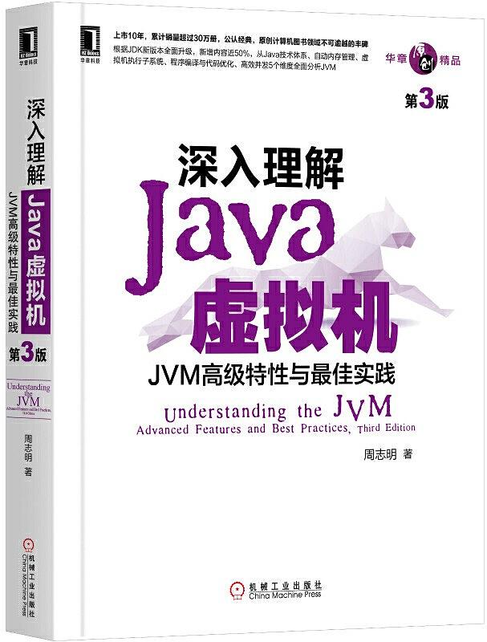
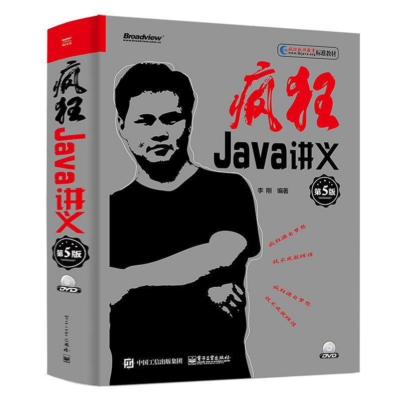
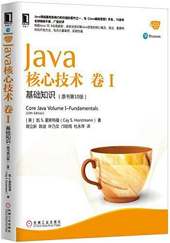
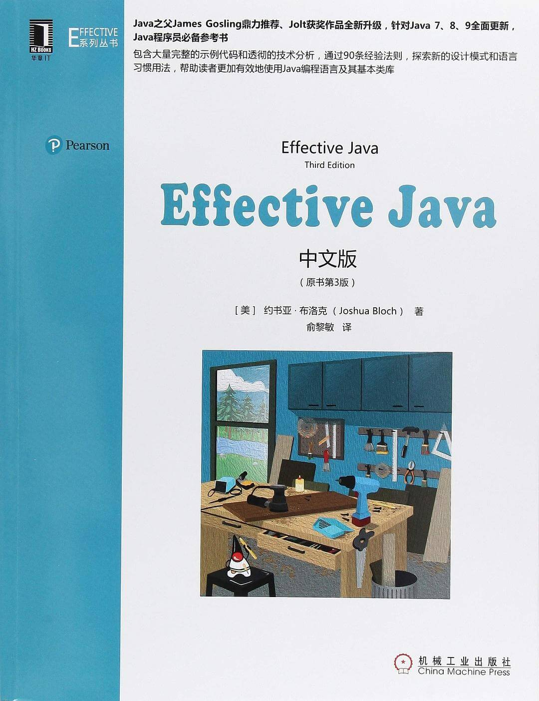
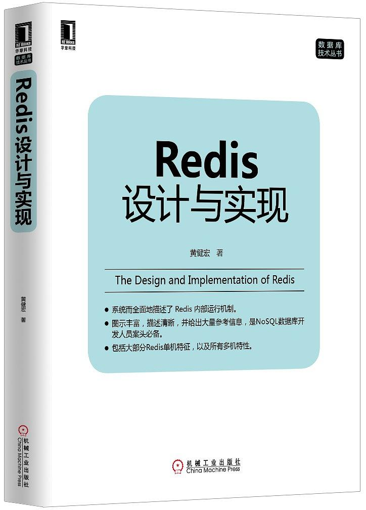
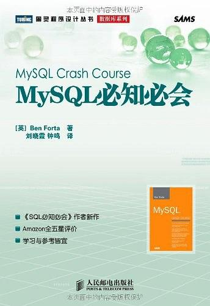
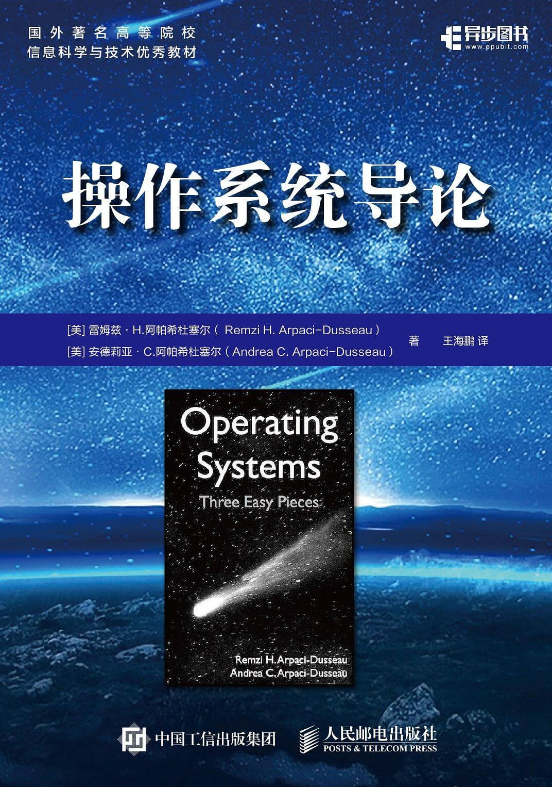
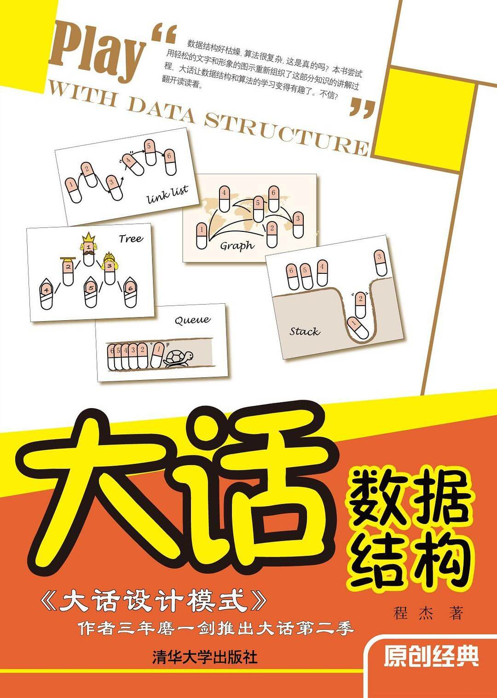

(PS：扫描[首页里面的二维码](README.md)进群，分享我自己在看的技术资料给大家，希望和大家一起学习进步！)

技术书籍其实有很多，我自己也买了很多，网上也有很多推荐书单，但是每个的情况都不太一样，当前工作中需要深入了解的技术面也不尽相同。所以我就谈一谈我自己买的一些书，以及看的一些书的感受。我的感受是看完一本技术书籍，只算是完成了20%，看完书写读书笔记，也只能算是完成了40%，看完书然后自己找一些面试题，自己翻书查资料，尝试着用自己的语言来讲解面试题，才算是完成了80%。就像在中学时，如果只是上课听懂，或者上课记很多笔记，但是回家从来不做作业，考试肯定得不了高分。所以也欢迎大家一起来完善这个项目！

### 《深入理解Java虚拟机 第三版》

  - 推荐指数：五星
  - 阅读进度：20%
  - 感受：这本书是在2019年双十二的时候出第三版了，作者更新了一些内容，强烈建议大家都买一本来看看，我自己还没有看完。

### 《疯狂Java讲义》

- 推荐指数：五星

- 阅读进度：70%

- 感受：这本书大概看了一半，还没有完全看完，特点是比较全，讲解得比较通俗易懂，也有很多大学使用这本书当做教材。我个人认为对于普通的开发工程师来说，比看《Java编程思想》 ，《Java核心技术 卷I》 要好一些。

### 《Java核心技术 卷I》

* 推荐指数：三星

* 阅读进度：100%

* 感受：这本书是比较好的书，可能国内的编辑翻译得比较生涩，有些地方没有那么好通俗易懂，而且很多地方也不是很深入。我只看了卷I，我觉得还是看看《疯狂Java讲义》要便于理解一些。

### 《Effective Java》

- 推荐指数：四星

- 阅读进度：100%

- 感受：书是好书，但是编辑翻译得让人捉急，可以先看看《疯狂Java讲义》，之后再来看这本书。

### 《Redis设计与实现》

  - 推荐指数：五星

  - 阅读进度：100%

  - 感受：这本书对于了解的Redis原理还是很好的，我觉得可以看一看（里面的原理都是针对于Redis 2.6，可能有一些实现已经遍历，例如在老版本中，List存储的元素较少时，会使用ziplist作为底层实现，元素较多时，使用linkedList来作为底层实现，而在新版本，引入了一种新的数据结构quickList，来作为底层实现。）

### 《Redis深度历险：核心原理与应用实践》

- 推荐指数：五星

- 阅读进度：100%

- 感受：这本书是一个掘金作者写的掘金小册，我感觉作者是阅读了《Redis设计与实现》，并且作者也去看了一下源码和其他博客，然后整理写得一个小册，覆盖了Redis的方方面面，比较全面，但是因为篇幅有限，更像是一个概要，快速了解一些技术点，需要深入了解还是需要看《Redis设计与实现》或者自己去资料。
- 图书链接：https://juejin.im/book/5afc2e5f6fb9a07a9b362527

### 《MySQL必知必会》

- 推荐指数：三星

- 阅读进度：100%

- 感受：这本书讲得比较全面，主要是讲用法，看起来很轻松，如果想要快速了解MySQL的各种用法，可以买一本来看一看。

### 《操作系统导论》

- 推荐指数：五星

- 阅读进度：0%

- 感受：这本书我是买了，但是还没有看，看评价是国外的一对计算机教授夫妇以通俗易懂地方式来讲解操作系统，也是2019年才出中文版的，之前都是Github上的一些爱好者们在自发得对这本书的英文原版翻译。

- 豆瓣链接：https://book.douban.com/subject/33463930

### 《大话数据结构》

- 推荐指数：五星

- 阅读进度：30%

- 感受：感觉讲得还比较通俗，需要复习数据结构的朋友可以看一看。

还有一些看过的书，之后再来更新了，还有很多书，买了还没有看，看完了再来更新吧。