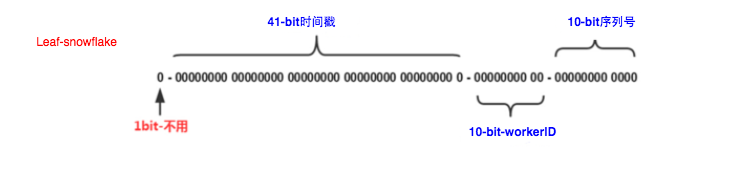

##### 分布式ID生成框架分析和改进

在日常的业务开发中，通常需要对一些数据做唯一标识，例如为大量抓取的文章入库时分配一个唯一的id，为用户下的订单分配订单号等等。我们的业务中也使用到了分布式ID的生成，也对开源的分布式ID框架进行了一些优化和改造。本文主要分为以下三个部分：
1.常见的分布式ID生成方案的简单介绍。
2.当前开源的分布式ID框架美团的Leaf和百度的uid-generator的原理分析。
3.Leaf和uid-generator存在的一些问题及如何进行优化改进。

### 分布式ID生成方案
目前常用的分布式ID生成方案主要由以下几种：

####  1.UUID

简单的来说，UUID是服务器在不需要任何外界依赖(像类Snowflake算法的方案都需要注册中心)的情况下，基于当前时间、计数器（counter）和硬件标识等等信息生成的唯一ID。
优点
像类Snowflake算法的技术方案至少启动时都需要注册中心，UUID生成不需要任何外界依赖，

当然为了唯一性，带来的牺牲就是生成的结果字符串太长了，一般是32位的字符串。由于字符串太长，并且不是数字类型，所以不适合作为数据库的主键。通常可以作为一些临时性唯一标识，例如用户登陆后，生成一个UUID作为登录的会话ID，作为key存储在Redis中，Value是用户相关的信息。

### 单机数据库主键自增

业务量较小时普遍采用这种方案


* 多数据库主键自增（设置步长区分不同数据库）

* 数据库分段发号

  例如美团的Leaf框架中的segement模式，滴滴的tinyId

* 类snowflake方案

  例如美团的Leaf框架中的snowflake模式

UUID的

如果量比较的小的场景下，我们一般是通过单机数据库主键自增的方式来实现的，


#### 对 uuid 的理解？知道哪些 GUID、Random 算法？

Universally Unique Identifier

uuid是为了让分布式系统不借助中心节点，生成一个唯一ID的解决方案。一般用的都是randomUUID，根据随机数算出来的。重复的可能性极小。是一个8字节的数，在16进制下有32位。一般

GUID是微软对UUID的一种实现。


UUID有五个版本，

**版本1** 时间戳+Mac地址

基于时间戳、机器MAC地址生成，缺点还是会暴露生成时间和机器的mac地址。

**版本2 **DCE安全的UUID

会把时间戳前四位用POSIX的UID或GID值来替换掉，一般UUID的实现都没有提供这种方法。

**版本3** 基于名字空间的UUID

就是可以传入一个自定义的字符串，通过MD5加密，得到一个UUID。

```css
System.out.println(UUID.nameUUIDFromBytes("myString".getBytes("UTF-8")).toString());
```

**版本4** 基于随机数的UUID

这一版的UUID主要是根据随机数来生成的。一般用的也就是第四种

```css
System.out.println(UUID.randomUUID().toString());
```

**版本5**：基于名字空间的UUID（SHA1）

跟版本三一样，不过是通过SHA1加密，也是一种不可逆的加密方式

https://mp.weixin.qq.com/s?src=3&timestamp=1586142782&ver=1&signature=xqjBIqXRrTSrhO9bVfPMKw*Gg90a6ZTGaG2SA1uH4jPnPOsr1Ym5aOtx0uDgBRkFsuzgpM-KK7Nwl9lp44lE3qX8GPHZb5j9JdT2nbMR9UjU6tfBxWFHxqiLnHdbnafOVkI0j7BZ*fKcQCxBFHvJ-X-JxfaHoC44q4B9PcjkA18=

https://www.cnblogs.com/yjmyzz/p/why_paging_so_tough_with_sharding.html


#### 分库分表唯一ID生成方案

##### UUID

UUID 优点是可以基本保证唯一。

但是缺点是无序的，不是递增的，插入数据效率会低一些，如果主键是字符串的话，查询效率也比较低，而且32位的字符串，查询效率低，没

##### MySQL主键自增

优点是数字化，插入和查询效率高，具有一定的业务可读性，id小的创建时间更早。

缺点是只能单机，不能用于分库分表。

##### MySQL多实例主键自增

可以设置mysql表每次自增时的步长，

```sql
CREATE TABLE table (...) AUTO_INCREMENT = n;
alter table <table name> auto_increment=2;
```

优点是解决了每次自增是1的问题，缺点是一旦设置了步长，就不方便扩容了，因为分库分表的表的数量已经定下来了。

##### snowflake算法

是推特开源分布式ID生成算法，一共有64位，

第一位是0，标志位

接下来41位是13位的毫秒时间戳，最大可以到2039年9月

接下来10个二进制位是服务器的id

后面12位是业务序列号

意味着每毫秒最大可以生成2的12次方个id，4096个，支持每个机器每毫秒生成4096个id，每秒可以生成400多万的id

优点是比较快，不依赖mysql去生成

缺点是

1.趋势递增，容易被猜到订单量，第一条下单多少，第二条下单多少，可以自己加随机数。

2.依赖机器时间，如果机器时间出现回拨，变成以前的时间，可能会导致id重复。

解决回拨的问题

就是机器需要同步时间，不一致会对时间回拨，可能会导致id重复，像百度的snowflake是几台特定的服务器，每次的机器id也是从数据库里面生成的，所以不需要做时间同步。


## 百度的uid-generator

##### 默认模式

每次启动时向数据库插入一条数据，这行数据的主键是自增的，主键id就是workId，

因为默认是snowflake算法是1标志位+41位时间戳+10位机器号+12位序列号，

因为百度的是每次启动都获取新的机器号，所以它修改了这些位数配比，是

1标志位+28位的时间差+22位的机器号+13位的序列号，所以总共支出2的22次方次启动，也就是400万次启动。

解决时间回拨问题：

* 启动时时间回拨

因为是每次都用新的机器号，所以当前机器号都是之前没有的，所以即便时间戳回拨也不影响。

* 运行时时间回拨

会使用lastSecond来记录上次生成id的时间戳，如果当前时间戳比lastSecond还小，就抛出异常。

##### 缓存模式

主要继承自默认模式，只是用一个环形数组来存储生成好的id，每次去环形数组中去，默认大小是2的13次方，8192。这种模式使用的时间取得不是实时的系统时间，而且使用启动时的时间，每次生成一组id时，对之前保存的时间+1。

阀值检测，然后填充

取id时，可用id数小于阀值50%时，去填充

定期填充

会去检查环形数组中id使用情况，然后生成一组最大序列号个数的id(默认是8192个)，然后进行填充，多的直接丢弃掉，

### 美团的leaf

snowflake模式

1位的符号位+41位的时间戳+10位的workID+10位的序列号





#### 1 时钟回拨问题

若机器出现时钟回拨，会产生重复id

##### 1）启动时回拨

启动时获取其他机器的时间，计算出平均时间后，将本机时间与平均时间比较，若超过阈值则启动失败。

##### 2）运行时回拨

1. 直接拒绝，抛异常

2. 若回拨时间小于阈值，则睡眠

3. 若回拨时间大于阈值，直接拒绝服务并报错，或者更换机器号，或者利用拓展位

   

##### 时间类型

- 时间戳：自1970.01.01起（今日头条）
- 时间差：自选起始时间（百度、美团）

##### 2）时间精度

- 秒级：支持峰值更高（今日头条、百度）
- 毫秒级：记录时间粒度更细（美团）

汽车之家是自增的id，只是作品类型不同，文章，视频等

头条，百度，美团也是使用了snowFlake只是改变了位数占比。

比如头条是去掉了符号标示位，缩短了时间戳，前31位是秒级时间戳+自定义的序列（可能是机器id+递增的数），记录的时间粒度会粗一些，每一秒生成的id会少一些，但是支持的峰值会高一些，时间戳也可以不从1970年开始选，也可以从自定义的时间开始选，这样支持的年长会多一些。

#### 3 机器号

纯机器号，或，机房号+机器号

##### 1）物理机

- 手动配置
- zookeeper（美团）
  在zookeeper如未注册则创建持久顺序节点，顺序号当机器号，并本地缓存

##### 2）虚拟机

- redis
  利用redis原子计数器，虚拟机启动后，请求计数器，按机器号位数取余
- zookeeper
  从0到机器号上限，在zookeeper尝试创建临时节点，成功则为当前机器号
- 数据库（百度）
  利用系统变量的host和port为唯一索引，在数据库中存取，主键作为机器id
  
  
  
  
  